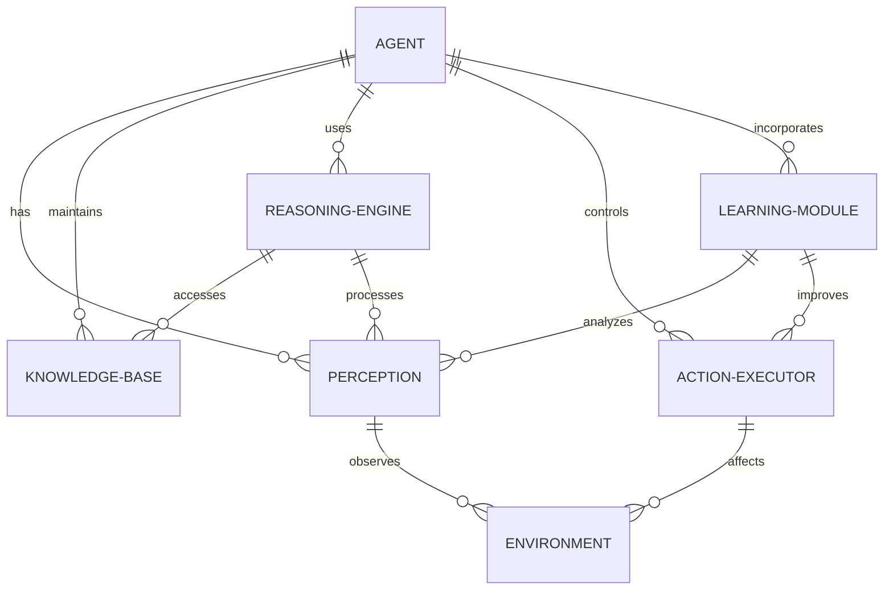
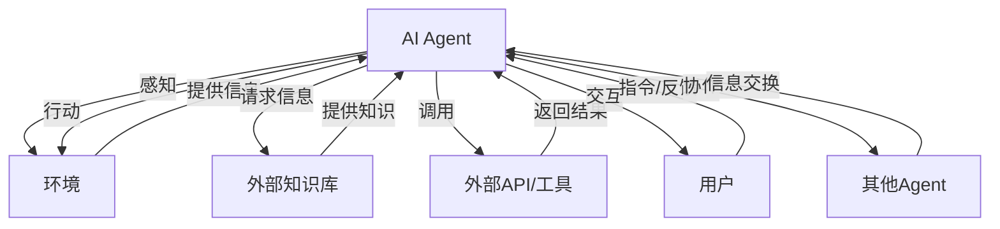
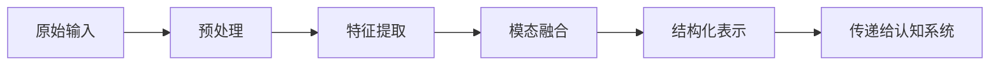
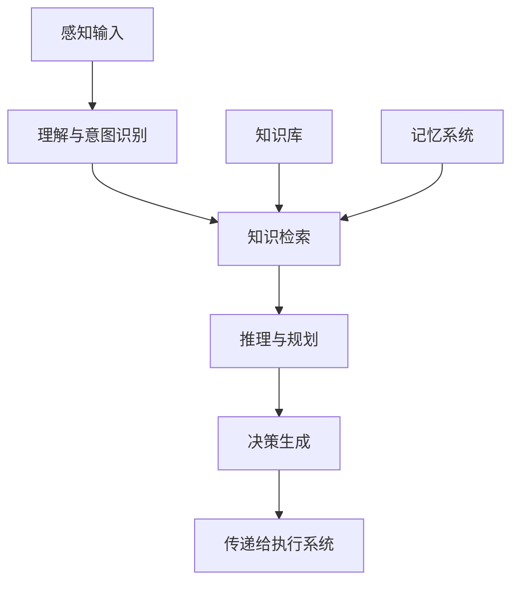
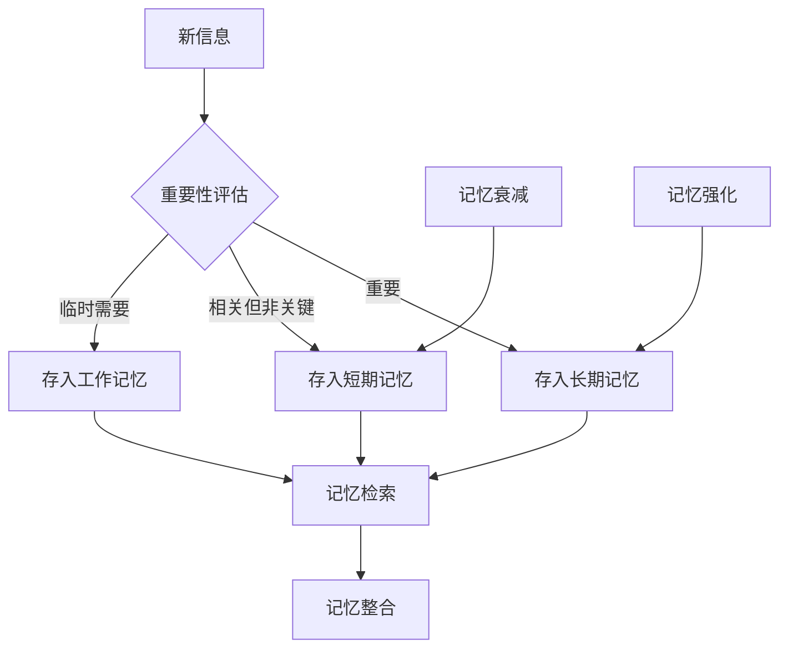
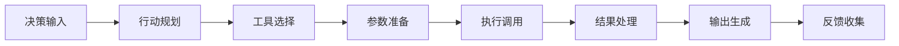
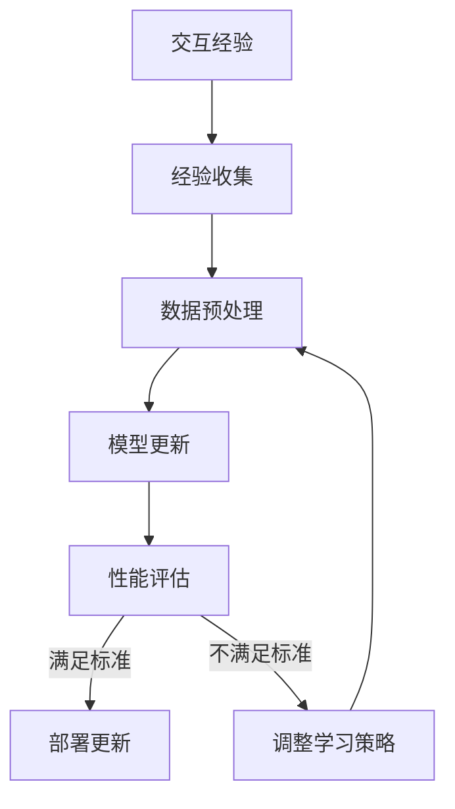
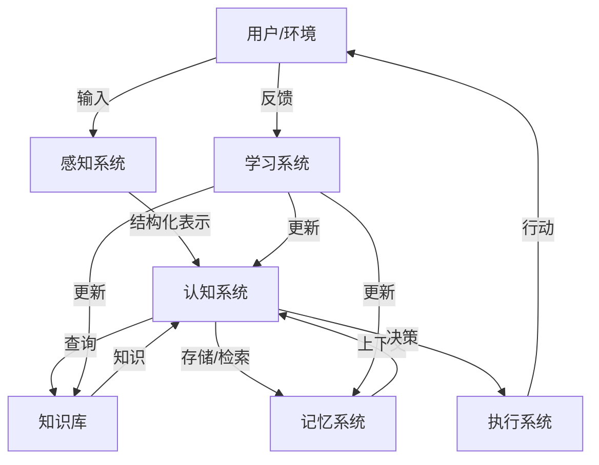
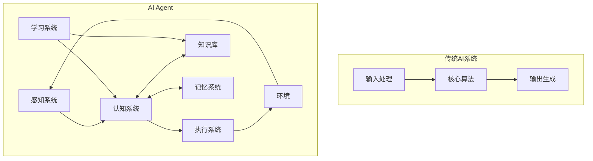

# 第一部分：基础知识

第一部分将为读者奠定构建AI Agent所需的理论基础。我们将从AI Agent的基本概念入手，探讨其定义、特征和应用场景，帮助读者建立对AI Agent的整体认识。随后，我们将深入研究大型语言模型（LLM）的核心原理和技术特点，这是现代AI Agent的基石。最后，我们将详细讲解提示工程（Prompt Engineering）的关键技术，这是有效利用LLM能力的必备技能。通过这三个章节的学习，读者将掌握构建AI Agent的基础知识框架，为后续的实践应用做好准备。

# 第1章 AI Agent概述

本章将全面介绍AI Agent的基本概念、特征、发展历程和应用场景，帮助读者建立对AI Agent的系统认识。我们将探讨AI Agent的核心组件和工作原理，分析不同类型的Agent及其特点，并比较AI Agent与传统AI系统的区别。通过本章学习，读者将了解AI Agent的基本框架和技术基础，为后续深入学习打下坚实基础。

## 1.1 AI Agent的定义与特征

### 核心概念

AI Agent（人工智能代理）是一种能够感知环境、做出决策并采取行动以实现特定目标的智能系统。与传统的AI系统不同，AI Agent具有更高的自主性和适应性，能够在复杂、动态的环境中持续学习和优化其行为。

### 问题背景介绍

随着人工智能技术的快速发展，特别是大型语言模型（LLM）的突破，AI系统的能力边界不断扩展。然而，传统的AI应用通常专注于解决特定问题，缺乏灵活性和自主性。用户需要更智能、更自主的系统来处理复杂任务，这推动了AI Agent概念的发展和应用。

### AI Agent的核心特征

AI Agent具有以下核心特征：

1. **自主性（Autonomy）**：能够在没有直接人类干预的情况下执行任务，根据环境变化调整行为。

2. **感知能力（Perception）**：通过各种传感器或接口感知环境状态，获取必要的信息。

3. **推理能力（Reasoning）**：基于获取的信息和内部知识进行逻辑推理和决策。

4. **学习能力（Learning）**：能够从经验中学习，不断改进自身的行为和决策策略。

5. **社交能力（Social ability）**：能够与人类用户或其他Agent进行交互和协作。

6. **反应性（Reactivity）**：能够及时响应环境变化，调整行为以适应新情况。

7. **主动性（Proactivity）**：不仅被动响应，还能主动采取行动实现目标。

8. **目标导向（Goal-oriented）**：所有行为都围绕着实现特定目标或目标集合。

### AI Agent的基本结构

一个典型的AI Agent通常包含以下基本结构：

1. **感知模块**：负责从环境中收集信息，如用户输入、数据库查询结果等。

2. **知识库**：存储Agent的领域知识、规则和历史交互信息。

3. **推理引擎**：基于感知信息和知识库进行推理和决策。

4. **行动执行器**：将决策转化为具体行动，如生成回复、调用API等。

5. **学习模块**：从交互过程中学习，更新知识库和决策策略。

### 概念结构与核心要素组成

AI Agent的概念结构可以通过以下ER图表示：

### AI Agent的数学模型

从数学角度看，AI Agent可以表示为一个决策函数 $f$，它将环境状态 $S$ 映射到行动 $A$：

$$f: S \rightarrow A$$

考虑时间因素，Agent的决策过程可以表示为：

$$a_t = f(s_t, h_t)$$

其中：
- $a_t$ 是时间 $t$ 的行动
- $s_t$ 是时间 $t$ 的环境状态
- $h_t$ 是Agent的历史记忆或经验

在强化学习框架下，Agent的目标是最大化累积奖励：

$$\max_{\pi} \mathbb{E}\left[\sum_{t=0}^{T} \gamma^t r_t\right]$$

其中：
- $\pi$ 是Agent的策略
- $r_t$ 是时间 $t$ 的奖励
- $\gamma$ 是折扣因子
- $T$ 是时间范围

### 概念之间的关系

下表比较了AI Agent与其他相关概念的区别：

| 特性 | AI Agent | 传统AI系统 | 简单自动化工具 | 人类专家 |
|------|----------|------------|----------------|----------|
| 自主性 | 高 | 中 | 低 | 非常高 |
| 学习能力 | 持续学习 | 通常固定 | 无学习能力 | 终身学习 |
| 适应性 | 高 | 中 | 低 | 非常高 |
| 推理复杂度 | 复杂 | 中等 | 简单 | 非常复杂 |
| 目标设定 | 可调整 | 固定 | 固定 | 自定义 |
| 交互方式 | 多模态、自然 | 有限、结构化 | 简单命令 | 自然、灵活 |
| 知识范围 | 广泛 | 特定领域 | 非常有限 | 专业领域深入 |

### AI Agent的交互关系

AI Agent与环境、用户和其他系统的交互关系可以通过以下图表示：

## 1.2 AI Agent的发展历程

### 早期智能代理（1950s-1990s）

AI Agent的概念可以追溯到人工智能研究的早期阶段。1950年代，艾伦·图灵提出了著名的"图灵测试"，探讨机器是否能表现出与人类相当的智能。这为后来的智能代理研究奠定了理论基础。

1960年代至1970年代，早期的专家系统开始出现，如DENDRAL（用于有机化学分析）和MYCIN（用于医疗诊断）。这些系统虽然功能有限，但已经展示了代理式决策的雏形。

1980年代，随着符号主义AI的发展，基于规则的代理系统得到了广泛应用。同时，分布式人工智能（DAI）领域开始研究多代理系统，探索代理之间的协作机制。

### 现代AI Agent的兴起（1990s-2010s）

1990年代，随着互联网的普及，网络智能代理开始出现，如自动搜索代理和推荐系统。同时，强化学习理论的发展为Agent的自主学习提供了新的方法论。

2000年代初，Russell和Norvig在其经典教材《人工智能：一种现代方法》中系统化了智能代理的概念，将Agent定义为"能够感知环境并采取行动的实体"。这一定义至今仍被广泛接受。

2010年前后，机器学习特别是深度学习的突破，为Agent提供了更强大的感知和决策能力。基于深度强化学习的Agent在游戏领域取得了突破性进展，如DeepMind的AlphaGo和OpenAI的DotA2 Agent。

### LLM驱动的Agent时代（2020s至今）

2020年代，大型语言模型（LLM）的出现彻底改变了AI Agent的发展轨迹。GPT系列、Claude、Gemini等模型展示了前所未有的语言理解和生成能力，为构建更智能、更自然的Agent提供了可能。

基于LLM的Agent具有以下特点：

1. **自然语言交互**：能够理解和生成自然语言，实现更自然的人机交互。

2. **知识广度**：预训练过程中吸收了海量文本数据，具备广泛的知识基础。

3. **上下文学习**：能够在对话过程中学习和适应，无需显式编程。

4. **多模态能力**：逐渐整合视觉、音频等多模态信息处理能力。

5. **工具使用能力**：能够学习使用外部工具和API，扩展自身能力边界。

### AI Agent发展的关键里程碑

| 时间 | 事件 | 意义 |
|------|------|------|
| 1950 | 图灵测试提出 | 为智能代理研究提供了理论基础 |
| 1965 | DENDRAL系统开发 | 早期专家系统的代表作 |
| 1972 | MYCIN系统开发 | 医疗诊断领域的早期智能代理 |
| 1986 | 分布式人工智能研究兴起 | 开启多代理系统研究 |
| 1995 | 网络智能代理出现 | 扩展了Agent的应用场景 |
| 1998 | 《人工智能：一种现代方法》出版 | 系统化了智能代理的理论框架 |
| 2013 | 深度强化学习突破 | 为Agent提供了更强大的学习能力 |
| 2016 | AlphaGo战胜李世石 | 展示了基于深度学习的Agent的潜力 |
| 2020 | GPT-3发布 | 开启了LLM驱动的Agent时代 |
| 2022 | ChatGPT发布 | 将LLM Agent带入大众视野 |
| 2023 | AutoGPT等自主Agent出现 | 探索更高级别的Agent自主性 |
| 2024 | 多模态Agent普及 | 扩展了Agent的感知和交互能力 |

## 1.3 AI Agent的应用场景

AI Agent技术已经在多个领域展现出巨大的应用潜力，下面我们将探讨一些主要的应用场景。

### 个人助理

个人助理是AI Agent最直接、最广泛的应用场景之一。基于LLM的个人助理Agent可以：

- 管理日程和提醒
- 回答问题和提供信息
- 协助撰写邮件和文档
- 提供个性化建议和推荐
- 执行简单的任务自动化

**案例分析**：Apple的Siri、Google Assistant和Amazon的Alexa都是早期个人助理Agent的代表。而基于LLM的新一代个人助理，如Claude、ChatGPT和Gemini，则提供了更自然、更智能的交互体验。

### 客户服务

在客户服务领域，AI Agent可以：

- 24/7全天候回答客户询问
- 处理常见问题和请求
- 收集客户反馈和信息
- 在需要时将客户转接给人工客服
- 提供个性化的产品推荐和解决方案

**案例分析**：许多企业已经部署了基于LLM的客服Agent，如Intercom的客服机器人和Zendesk的智能助手，这些系统能够理解复杂的客户问题，提供准确的回答，显著提高了客户满意度并降低了运营成本。

### 内容创作

在内容创作领域，AI Agent可以：

- 协助撰写文章、报告和创意内容
- 提供写作建议和修改意见
- 生成初稿或内容大纲
- 翻译和本地化内容
- 创建个性化的营销文案

**案例分析**：Jasper、Copy.ai等内容创作平台利用LLM构建了专门的写作Agent，帮助营销人员和内容创作者提高工作效率。这些Agent不仅能生成高质量内容，还能根据特定风格和目标受众调整输出。

### 教育与学习

在教育领域，AI Agent可以：

- 提供个性化的学习辅导
- 回答学生问题
- 生成练习题和测验
- 评估学生作业和提供反馈
- 适应不同学习风格和进度

**案例分析**：Khan Academy的Khanmigo和Duolingo的AI辅导功能展示了教育领域AI Agent的潜力。这些系统能够根据学生的学习进度和困难点提供个性化指导，模拟一对一辅导体验，同时收集学习数据以持续优化教学策略。

### 研究与知识发现

在科研领域，AI Agent可以：

- 分析大量科学文献和数据
- 提出研究假设和实验设计
- 协助数据分析和结果解释
- 生成研究报告和论文草稿
- 跨学科知识整合和创新

**案例分析**：Elicit和Semantic Scholar等研究助手利用AI Agent技术帮助研究人员快速查找相关文献、总结研究发现并生成见解。这些工具显著提高了科研效率，特别是在跨学科研究和文献综述方面。

### 软件开发

在软件开发领域，AI Agent可以：

- 协助代码编写和调试
- 生成代码注释和文档
- 进行代码审查和优化建议
- 自动化测试和错误修复
- 回答编程相关问题

**案例分析**：GitHub Copilot和Amazon CodeWhisperer等代码助手Agent已经成为开发者的得力助手，能够理解开发意图，生成符合上下文的代码片段，甚至完成复杂的编程任务，大幅提高了开发效率。

### 医疗健康

在医疗领域，AI Agent可以：

- 辅助医疗诊断和治疗决策
- 提供健康管理和生活方式建议
- 监控患者状况并发出预警
- 回答医疗相关问题
- 协助医学研究和文献分析

**案例分析**：Ada Health和Babylon等医疗AI系统利用Agent技术为用户提供初步健康评估和建议。这些系统通过对话式交互收集症状信息，结合医学知识库进行分析，帮助用户决定是否需要就医，同时为医生提供参考信息。

### 金融服务

在金融领域，AI Agent可以：

- 提供个性化财务建议
- 执行交易和投资分析
- 检测欺诈和异常活动
- 回答金融产品和服务问题
- 协助财务规划和风险管理

**案例分析**：摩根大通的COIN（Contract Intelligence）系统和Wealthfront的自动投资顾问展示了金融领域AI Agent的应用。这些系统能够分析大量金融数据，提供个性化的投资建议，并自动执行交易决策，提高了金融服务的效率和可及性。

### 智能家居与物联网

在智能家居领域，AI Agent可以：

- 控制和协调家庭设备
- 学习用户习惯并自动调整设置
- 监控家庭安全和能源使用
- 提供个性化的家庭环境建议
- 与家庭成员进行自然语言交互

**案例分析**：Google Home和Amazon Echo等智能家居系统通过AI Agent技术整合了语音交互、设备控制和个性化服务，创造了更智能、更便捷的家居体验。

### 企业决策支持

在企业管理领域，AI Agent可以：

- 分析业务数据并生成洞察
- 预测市场趋势和风险
- 优化资源分配和供应链
- 协助战略规划和决策
- 自动生成业务报告和分析

**案例分析**：IBM Watson for Business和Microsoft Power BI的AI助手功能为企业管理者提供数据驱动的决策支持，帮助他们从复杂的业务数据中提取有价值的信息，做出更明智的决策。

## 1.4 AI Agent的核心组件

AI Agent由多个核心组件组成，这些组件协同工作，使Agent能够感知环境、做出决策并采取行动。下面我们将详细介绍这些核心组件。

### 感知系统（Perception System）

感知系统是AI Agent与外部世界交互的窗口，负责收集和处理环境信息。

**组成部分**：

1. **输入接口**：接收用户输入、环境数据等信息
2. **预处理模块**：清洗、格式化和标准化输入数据
3. **特征提取**：从原始数据中提取有用的特征和模式
4. **多模态融合**：整合文本、图像、音频等不同模态的信息

**工作流程**：

**技术实现**：

在基于LLM的Agent中，感知系统通常包括：
- 文本处理：使用分词器（tokenizer）将文本转换为模型可处理的格式
- 图像处理：使用计算机视觉模型（如CLIP、ViT）提取图像特征
- 音频处理：使用语音识别模型将语音转换为文本
- 多模态融合：将不同模态的特征映射到共享的语义空间

### 认知系统（Cognitive System）

认知系统是AI Agent的"大脑"，负责理解输入、推理决策和生成响应。

**组成部分**：

1. **理解模块**：解析输入的含义和意图
2. **推理引擎**：基于知识和上下文进行逻辑推理
3. **规划模块**：制定实现目标的行动计划
4. **决策模块**：在多个可能的行动中做出选择

**工作流程**：

**技术实现**：

在现代AI Agent中，认知系统通常由LLM承担核心角色，辅以：
- 意图识别：分析用户输入，确定其目的和需求
- 符号推理：结合神经网络和符号逻辑的混合推理方法
- 规划算法：如分层任务网络（HTN）、蒙特卡洛树搜索（MCTS）等
- 决策优化：基于效用函数或强化学习的决策策略

### 知识库（Knowledge Base）

知识库存储Agent的领域知识、常识和专业信息，为推理和决策提供基础。

**组成部分**：

1. **事实性知识**：客观事实、定义和关系
2. **程序性知识**：操作步骤、方法和流程
3. **元知识**：关于知识本身的知识，如可靠性和适用范围
4. **知识图谱**：概念之间的关系网络

**知识表示方法**：

- **语义网络**：概念之间的关系图
- **本体（Ontology）**：领域概念的形式化描述
- **规则系统**：IF-THEN形式的知识规则
- **向量表示**：概念的分布式数值表示

**技术实现**：

现代AI Agent的知识库通常采用混合方式：
- 预训练知识：LLM在预训练阶段获取的广泛知识
- 外部知识库：结构化数据库、知识图谱或文档集合
- 向量数据库：存储文本或其他数据的向量表示，支持语义检索
- 参数化知识：通过微调或提示工程注入的特定领域知识

### 记忆系统（Memory System）

记忆系统使Agent能够存储和利用过去的交互和经验，保持上下文连贯性。

**记忆类型**：

1. **短期记忆**：当前对话或任务的上下文
2. **长期记忆**：持久存储的用户偏好、历史交互和学习经验
3. **工作记忆**：当前任务处理过程中的临时信息
4. **情景记忆**：特定事件或交互的详细记录

**记忆管理策略**：

**技术实现**：

- **上下文窗口**：LLM的输入上下文，包含最近的交互历史
- **向量存储**：将历史交互转换为向量表示，支持相似性检索
- **记忆压缩**：将长对话历史压缩为摘要，节省上下文空间
- **记忆检索**：基于当前查询检索相关历史信息
- **记忆优先级**：根据重要性和相关性为记忆分配优先级

### 执行系统（Execution System）

执行系统负责将Agent的决策转化为具体行动，与外部环境或系统交互。

**组成部分**：

1. **行动生成器**：将决策转化为可执行的行动
2. **工具调用模块**：调用外部API、工具或服务
3. **输出格式化**：将结果转换为适合用户的格式
4. **反馈收集**：监控行动执行结果和用户反馈

**工作流程**：

**技术实现**：

- **函数调用**：LLM生成结构化的函数调用请求
- **API集成**：通过API网关连接各种外部服务
- **工具使用框架**：如LangChain、AutoGPT等提供的工具使用接口
- **沙箱执行**：在安全环境中执行代码或命令
- **结果验证**：检查执行结果的有效性和安全性

### 学习系统（Learning System）

学习系统使Agent能够从经验中学习，不断改进其性能和适应能力。

**学习类型**：

1. **监督学习**：从标记数据中学习模式和规则
2. **强化学习**：通过奖励信号优化行为策略
3. **自监督学习**：从未标记数据中提取知识
4. **在线学习**：在交互过程中持续学习和适应

**学习流程**：

**技术实现**：

- **RLHF（基于人类反馈的强化学习）**：利用人类反馈优化模型行为
- **微调**：在特定任务或领域数据上微调基础模型
- **提示学习**：通过优化提示模板提高模型性能
- **记忆更新**：根据新经验更新Agent的知识库和记忆系统
- **元学习**：学习如何更有效地学习新任务

### 组件集成架构

AI Agent的各个核心组件需要通过一个统一的架构进行集成，以实现协同工作。

**典型架构模式**：

**集成方法**：

1. **管道模式**：组件按顺序处理信息，形成处理流水线
2. **中央控制器模式**：由中央模块协调各组件的工作
3. **事件驱动模式**：组件响应特定事件，实现松耦合架构
4. **混合架构**：结合多种模式，根据任务特点灵活调整

## 1.5 AI Agent的类型与分类

AI Agent可以根据不同的标准进行分类，了解这些分类有助于我们选择适合特定应用场景的Agent类型。

### 按自主程度分类

根据Agent的自主决策能力，可以将其分为以下几类：

1. **简单反射型Agent（Simple Reflex Agents）**
   - 基于当前感知直接做出反应
   - 不考虑历史信息或未来影响
   - 通常使用简单的条件规则（if-then）
   - 适用于简单、确定性环境
   - 例如：基本的聊天机器人、简单的自动回复系统

2. **基于模型的反射型Agent（Model-based Reflex Agents）**
   - 维护内部模型来跟踪环境状态
   - 考虑环境如何演变以及行动如何影响环境
   - 仍然基于条件规则做出决策
   - 适用于部分可观察的环境
   - 例如：智能恒温器、基础导航系统

3. **基于目标的Agent（Goal-based Agents）**
   - 明确定义目标，并选择能达成目标的行动
   - 考虑多个可能的行动序列及其结果
   - 使用搜索和规划算法
   - 适用于复杂但目标明确的任务
   - 例如：路径规划系统、任务管理助手

4. **基于效用的Agent（Utility-based Agents）**
   - 使用效用函数评估不同状态的"好坏程度"
   - 选择能最大化预期效用的行动
   - 能处理多目标和目标间的权衡
   - 适用于需要优化多个指标的场景
   - 例如：推荐系统、投资顾问Agent

5. **学习型Agent（Learning Agents）**
   - 能够从经验中学习和改进
   - 适应环境变化和新情况
   - 通常结合上述类型与学习机制
   - 适用于动态、不确定的环境
   - 例如：现代LLM驱动的对话Agent、自适应个人助理

### 按功能领域分类

根据Agent的主要功能和应用领域，可以分为：

1. **对话型Agent（Conversational Agents）**
   - 专注于自然语言交互
   - 理解用户意图并生成相应回复
   - 维护对话上下文和连贯性
   - 例如：ChatGPT、客服机器人、虚拟助手

2. **任务型Agent（Task-oriented Agents）**
   - 专注于完成特定任务或目标
   - 通常需要规划和执行多步骤操作
   - 可能需要调用外部工具和API
   - 例如：AutoGPT、BabyAGI、工作流自动化Agent

3. **创意型Agent（Creative Agents）**
   - 专注于生成创意内容
   - 具备审美判断和创新能力
   - 能理解和应用风格、情感等抽象概念
   - 例如：DALL-E、Midjourney、创意写作助手

4. **分析型Agent（Analytical Agents）**
   - 专注于数据分析和洞察生成
   - 处理和解释复杂数据
   - 提供决策支持和预测
   - 例如：数据分析助手、研究Agent、诊断系统

5. **协作型Agent（Collaborative Agents）**
   - 专注于团队协作和任务协调
   - 理解不同角色和责任
   - 协调多个参与者的活动
   - 例如：项目管理Agent、团队协作助手

### 按架构模式分类

根据Agent的内部架构和设计模式，可以分为：

1. **基于规则的Agent（Rule-based Agents）**
   - 使用预定义的规则和逻辑
   - 决策过程透明且可解释
   - 适合有明确规则的领域
   - 例如：专家系统、业务流程自动化

2. **基于神经网络的Agent（Neural Agents）**
   - 使用神经网络模型（如LLM）作为核心
   - 依靠数据驱动的学习和推理
   - 具有强大的泛化能力
   - 例如：基于GPT的助手、基于扩散模型的创意Agent

3. **混合架构Agent（Hybrid Agents）**
   - 结合符号推理和神经网络
   - 利用两种方法的互补优势
   - 提高性能和可解释性
   - 例如：神经符号系统、LLM+规则引擎的组合

4. **多Agent系统（Multi-Agent Systems）**
   - 由多个协作的Agent组成
   - 每个Agent负责特定功能或领域
   - 通过协议和协调机制交互
   - 例如：CrewAI、多专家协作系统

### 按交互模式分类

根据Agent与用户和环境的交互方式，可以分为：

1. **反应式Agent（Reactive Agents）**
   - 被动响应用户请求或环境变化
   - 等待触发后才执行操作
   - 例如：问答系统、命令执行助手

2. **主动式Agent（Proactive Agents）**
   - 主动发起交互或提供建议
   - 预测用户需求并提前准备
   - 例如：智能提醒系统、主动推荐Agent

3. **持续运行Agent（Persistent Agents）**
   - 长期运行并监控环境
   - 维护状态和上下文
   - 例如：监控系统、虚拟管家

4. **多模态交互Agent（Multimodal Interaction Agents）**
   - 支持多种输入和输出模式（文本、语音、图像等）
   - 根据场景选择最合适的交互方式
   - 例如：多模态助手、虚拟现实Agent

### 分类比较

下表比较了不同类型Agent的关键特性：

| Agent类型 | 自主性 | 学习能力 | 适应性 | 复杂度 | 可解释性 | 典型应用 |
|-----------|--------|----------|--------|--------|----------|----------|
| 简单反射型 | 低 | 无 | 低 | 低 | 高 | 基本自动化 |
| 基于模型的反射型 | 中低 | 低 | 中低 | 中 | 高 | 环境监控 |
| 基于目标的 | 中 | 中 | 中 | 中高 | 中 | 任务规划 |
| 基于效用的 | 中高 | 中高 | 中高 | 高 | 中 | 决策优化 |
| 学习型 | 高 | 高 | 高 | 非常高 | 低-中 | 智能助手 |
| 对话型 | 中-高 | 中-高 | 中-高 | 高 | 中 | 客服系统 |
| 任务型 | 高 | 中-高 | 中-高 | 高 | 中 | 工作流自动化 |
| 创意型 | 中-高 | 高 | 中 | 高 | 低 | 内容生成 |
| 分析型 | 中 | 中-高 | 中 | 高 | 中-高 | 数据分析 |
| 协作型 | 高 | 高 | 高 | 非常高 | 中 | 团队协调 |

## 1.6 AI Agent与传统AI系统的区别

AI Agent与传统AI系统在设计理念、技术实现和应用方式上存在显著差异。理解这些区别有助于我们更好地把握AI Agent的特点和优势。

### 设计理念的区别

1. **目标导向 vs 功能导向**
   - **传统AI系统**：通常设计为执行特定功能，如图像分类、语音识别等
   - **AI Agent**：设计为实现特定目标，能够自主选择和组合不同功能

2. **自主性程度**
   - **传统AI系统**：通常需要明确指令，按预设流程执行
   - **AI Agent**：具有更高的自主性，能够根据环境和目标自行决策

3. **交互模式**
   - **传统AI系统**：多为单向交互或简单的请求-响应模式
   - **AI Agent**：支持持续、多轮、上下文相关的交互

4. **系统边界**
   - **传统AI系统**：通常有明确定义的功能边界
   - **AI Agent**：边界更加模糊，能够扩展和适应新任务

### 技术架构的区别

1. **组件集成方式**

2. **决策机制**
   - **传统AI系统**：通常基于预定义规则或单一模型
   - **AI Agent**：结合多种决策方法，包括规则推理、神经网络、规划算法等

3. **状态管理**
   - **传统AI系统**：多为无状态或简单状态管理
   - **AI Agent**：复杂的状态管理，包括短期和长期记忆、上下文理解等

4. **学习机制**
   - **传统AI系统**：通常在部署前训练，部署后较少更新
   - **AI Agent**：支持持续学习和适应，能从交互中不断改进

### 能力边界的区别

1. **任务复杂度**
   - **传统AI系统**：擅长特定、明确定义的任务
   - **AI Agent**：能处理复杂、模糊、多步骤的任务

2. **适应性**
   - **传统AI系统**：对任务变化和环境变化适应性较低
   - **AI Agent**：具有较强的适应性，能处理新情况和变化

3. **知识整合**
   - **传统AI系统**：通常专注于单一领域知识
   - **AI Agent**：能整合多领域知识，进行跨领域推理

4. **工具使用**
   - **传统AI系统**：通常不具备使用外部工具的能力
   - **AI Agent**：能学习和使用各种外部工具和API

### 应用场景的区别

1. **应用广度**
   - **传统AI系统**：针对特定应用场景优化
   - **AI Agent**：适用于更广泛的场景，具有通用性

2. **用户交互**
   - **传统AI系统**：通常需要特定格式的输入和交互方式
   - **AI Agent**：支持自然语言和多模态交互，更接近人类交流方式

3. **任务持续性**
   - **传统AI系统**：通常执行离散的单次任务
   - **AI Agent**：能够执行长期、持续的任务，维护上下文连贯性

4. **协作能力**
   - **传统AI系统**：通常作为独立工具使用
   - **AI Agent**：能与用户和其他系统协作，形成协作网络

### 具体对比案例

| 特性 | 传统AI系统示例 | AI Agent示例 |
|------|----------------|-------------|
| 图像处理 | 图像分类模型：给定图像，输出类别标签 | 视觉Agent：分析图像，回答相关问题，提供上下文解释 |
| 文本处理 | 情感分析模型：分析文本情感倾向 | 内容助手：理解文档，回答问题，生成摘要，提供建议 |
| 决策支持 | 预测模型：基于历史数据预测特定指标 | 决策Agent：综合分析数据，提供多方面建议，解释利弊 |
| 自动化 | 规则引擎：按预设规则执行操作 | 自动化Agent：理解任务目标，规划步骤，适应变化，执行复杂流程 |
| 学习方式 | 批量训练：收集数据，训练模型，部署使用 | 持续学习：从交互中学习，适应用户偏好，不断优化行为 |

## 1.7 行业发展与未来趋势

AI Agent技术正处于快速发展阶段，了解其发展趋势对于研究者、开发者和企业决策者都具有重要意义。

### 技术发展趋势

1. **多模态融合**
   - 整合文本、图像、音频、视频等多种模态
   - 实现更全面的环境感知和自然交互
   - 例如：GPT-4V、Gemini、Claude 3等多模态模型的应用

2. **自主性增强**
   - 从被动响应向主动规划转变
   - 提高长期目标规划和执行能力
   - 例如：AutoGPT、BabyAGI等自主Agent框架的发展

3. **工具使用能力**
   - 增强与外部系统和API的集成
   - 学习使用新工具的能力提升
   - 例如：Function Calling、Tool Use等技术的普及

4. **记忆与个性化**
   - 长期记忆机制的改进
   - 更精细的用户模型和个性化策略
   - 例如：向量数据库与LLM结合的长期记忆解决方案

5. **多Agent协作**
   - Agent之间的协作机制完善
   - 专家Agent网络的形成
   - 例如：CrewAI、AutoGen等多Agent框架的兴起

6. **安全与对齐**
   - 强化Agent的安全保障机制
   - 提高与人类价值观的对齐度
   - 例如：Constitutional AI、RLHF等技术的应用

### 市场与应用趋势

1. **垂直领域专精**
   - 从通用Agent向领域专精Agent发展
   - 深度整合行业知识和专业技能
   - 例如：医疗诊断Agent、法律助手Agent等专业应用

2. **个人AI助手普及**
   - 个性化AI助手成为日常工具
   - 跨设备、跨平台的一致体验
   - 例如：Microsoft Copilot、Apple Intelligence等个人助手

3. **企业级Agent平台**
   - 企业级Agent开发和管理平台兴起
   - 强调安全、合规和可控性
   - 例如：企业知识库Agent、业务流程自动化Agent

4. **Agent生态系统**
   - Agent市场和交易平台形成
   - 专业Agent开发者社区壮大
   - 例如：Agent应用商店、Agent开发平台

5. **人机协作新模式**
   - 从工具使用到协作伙伴关系
   - 人类+AI混合团队的工作模式
   - 例如：创意协作、研究助手、决策支持

### 挑战与机遇

1. **技术挑战**
   - 长期规划与推理能力的提升
   - 常识推理和因果理解的增强
   - 可靠性和稳定性的保障
   - 计算资源和效率优化

2. **商业挑战**
   - 商业模式创新和价值捕获
   - 用户隐私和数据安全保护
   - 差异化竞争和市场定位
   - 技术与业务的深度融合

3. **社会挑战**
   - 就业结构变化和技能转型
   - 数字鸿沟和技术普惠
   - 伦理问题和社会影响
   - 监管框架和标准建设

4. **发展机遇**
   - 生产力工具革命
   - 个性化服务新范式
   - 知识工作自动化
   - 人机协作新模式

### 行业发展时间线与预测

| 时间 | 技术发展 | 市场应用 | 社会影响 |
|------|----------|----------|----------|
| 2023-2024 | 多模态LLM普及 工具使用能力提升 基础Agent框架成熟 | 个人助手应用爆发 企业试点应用增多 垂直领域解决方案出现 | AI素养教育兴起 初步就业影响显现 伦理讨论增多 |
| 2025-2026 | Agent自主性显著提高 多Agent协作框架成熟 记忆系统大幅改进 | Agent平台生态形成 行业专用Agent普及 Agent市场规模扩大 | 工作流程重构 新型就业岗位出现 监管框架初步建立 |
| 2027-2028 | 通用智能雏形出现 Agent创造力突破 自我改进能力增强 | Agent经济初步形成 人机混合团队普及 Agent服务标准化 | 教育体系变革 社会分工重组 人机协作新文化 |
| 2029-2030 | 接近人类水平的Agent 跨领域通用能力 自主研发能力 | Agent即服务模式主流 传统行业深度重构 新型商业模式成熟 | 社会结构性变革 人类角色重新定义 全球治理新挑战 |

## 1.8 本章小结

本章全面介绍了AI Agent的基本概念、特征、发展历程和应用场景，为读者构建了对AI Agent的系统认识。我们探讨了AI Agent的核心组件和工作原理，分析了不同类型的Agent及其特点，并比较了AI Agent与传统AI系统的区别。

关键要点回顾：

1. **AI Agent的定义与特征**：AI Agent是能够感知环境、做出决策并采取行动以实现特定目标的智能系统，具有自主性、感知能力、推理能力、学习能力等核心特征。

2. **AI Agent的发展历程**：从早期的专家系统到现代基于LLM的智能Agent，AI Agent技术经历了长期演进，特别是近年来大型语言模型的突破为Agent技术带来了革命性进展。

3. **AI Agent的应用场景**：AI Agent已在个人助理、客户服务、内容创作、教育学习、研究发现、软件开发、医疗健康、金融服务等多个领域展现出巨大应用潜力。

4. **AI Agent的核心组件**：现代AI Agent通常由感知系统、认知系统、知识库、记忆系统、执行系统和学习系统等核心组件组成，这些组件协同工作，使Agent能够有效完成复杂任务。

5. **AI Agent的类型与分类**：AI Agent可以按自主程度、功能领域、架构模式和交互方式等维度进行分类，不同类型的Agent适用于不同的应用场景。

6. **AI Agent与传统AI系统的区别**：相比传统AI系统，AI Agent具有更高的自主性、更强的适应性、更复杂的架构和更广泛的应用场景，代表了AI技术的发展方向。

7. **行业发展与未来趋势**：AI Agent技术正处于快速发展阶段，多模态融合、自主性增强、工具使用能力提升、多Agent协作等技术趋势将推动行业持续创新，同时也面临技术、商业和社会等多方面的挑战。

通过本章的学习，读者应该已经对AI Agent有了基本的认识，理解了其核心概念、技术基础和应用前景。这些知识将为后续深入学习AI Agent的开发和应用奠定基础。在接下来的章节中，我们将深入探讨大型语言模型（LLM）的基础知识，这是构建现代AI Agent的核心技术。

### 拓展阅读

1. Russell, S., & Norvig, P. (2020). *Artificial Intelligence: A Modern Approach (4th Edition)*. Pearson.
2. Wooldridge, M. (2020). *An Introduction to MultiAgent Systems (2nd Edition)*. Wiley.
3. Sutton, R. S., & Barto, A. G. (2018). *Reinforcement Learning: An Introduction (2nd Edition)*. MIT Press.
4. Bommasani, R., et al. (2021). *On the Opportunities and Risks of Foundation Models*. arXiv preprint arXiv:2108.07258.
5. Yao, S., et al. (2022). *ReAct: Synergizing Reasoning and Acting in Language Models*. arXiv preprint arXiv:2210.03629.
6. Park, J., et al. (2023). *Generative Agents: Interactive Simulacra of Human Behavior*. arXiv preprint arXiv:2304.03442.