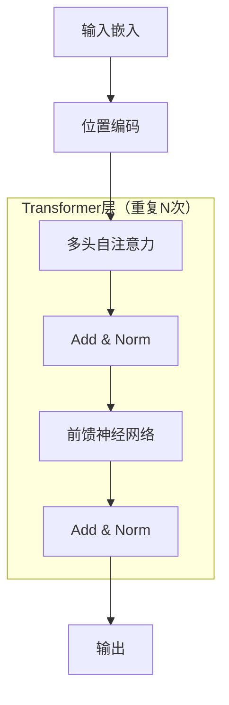
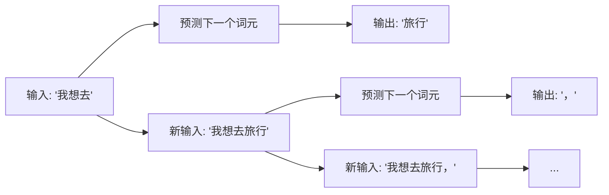
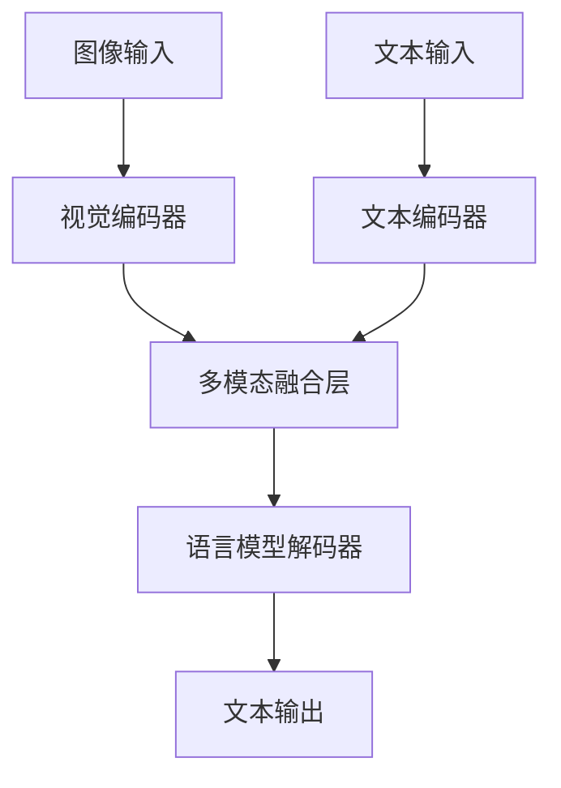
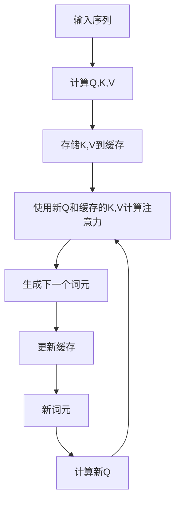
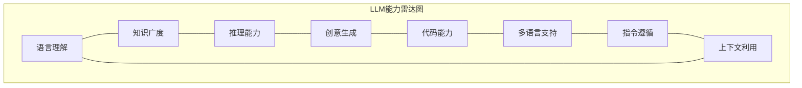
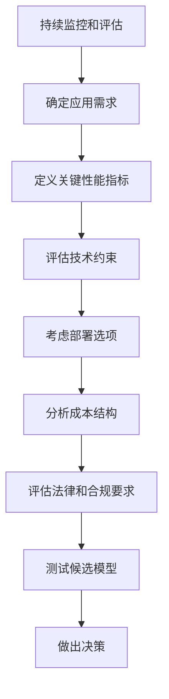
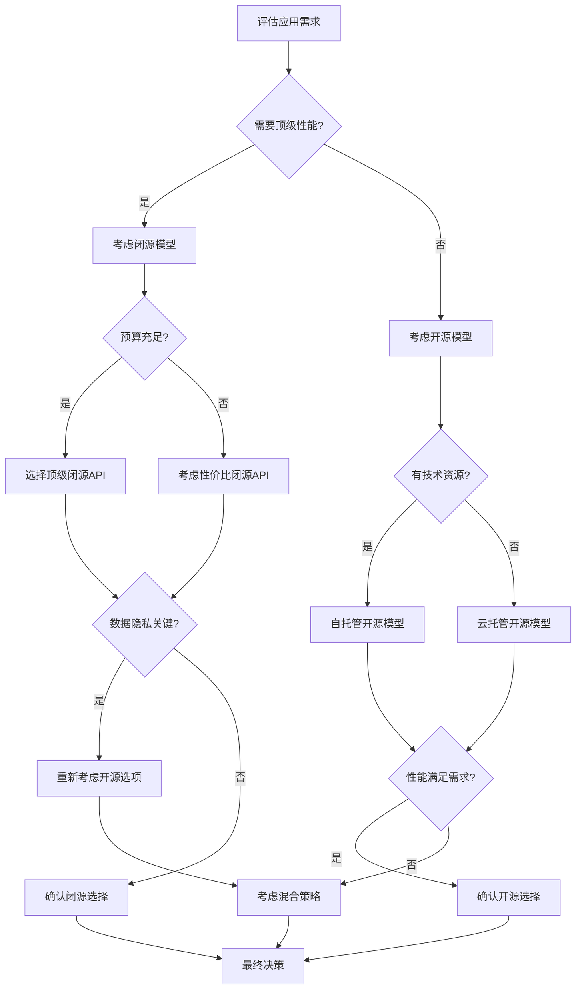
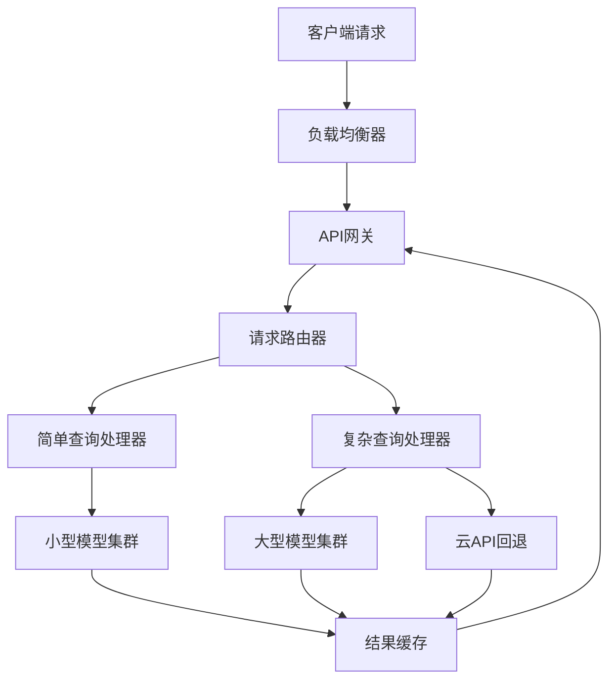

# 第2章 大型语言模型（LLM）基础

本章将深入探讨大型语言模型（Large Language Models, LLM）的基础知识，这是构建现代AI Agent的核心技术。我们将从LLM的定义和发展历程入手，介绍主流LLM模型及其特点，分析LLM的核心技术原理和能力边界，并讨论选择合适LLM的考虑因素。通过本章学习，读者将了解LLM的工作原理、技术特点和应用方法，为后续构建基于LLM的AI Agent奠定坚实基础。

## 2.1 LLM的定义与发展历程

### 核心概念

大型语言模型（Large Language Models, LLM）是一类基于深度学习技术、通过自监督学习在大规模文本数据上训练得到的神经网络模型。这些模型能够理解和生成人类语言，执行各种语言相关任务，如文本生成、问答、摘要、翻译等。LLM的"大"主要体现在三个方面：模型参数规模大（通常达到数十亿甚至数千亿参数）、训练数据量大（通常为数万亿词元）、计算资源需求大。

### 问题背景介绍

自然语言处理（NLP）一直是人工智能领域的核心挑战之一。传统NLP方法通常需要为不同任务设计特定模型和特征，缺乏通用性和迁移能力。随着深度学习技术的发展，特别是Transformer架构的提出，为构建通用、大规模的语言模型提供了可能。LLM的出现代表了NLP领域从"专用模型"向"通用基础模型"的范式转变，为AI Agent提供了强大的语言理解和生成能力。

### LLM的发展历程

#### 早期语言模型（2000年代初-2017年）

早期的语言模型主要基于统计方法，如n-gram模型，它们通过计算词序列的概率来预测下一个词。这些模型简单但受限于数据稀疏性问题，难以捕捉长距离依赖关系。

随着深度学习的发展，基于神经网络的语言模型开始出现，如循环神经网络（RNN）、长短期记忆网络（LSTM）和门控循环单元（GRU）。这些模型能够更好地捕捉序列信息，但在处理长文本时仍面临梯度消失/爆炸等问题。

#### Transformer革命（2017年）

2017年，Google研究团队在论文《Attention is All You Need》中提出了Transformer架构，这是LLM发展的关键转折点。Transformer通过自注意力（Self-Attention）机制解决了序列处理的长距离依赖问题，同时支持并行计算，大幅提高了训练效率。

Transformer架构的核心创新包括：
- 自注意力机制：允许模型关注输入序列的任意位置
- 多头注意力：从不同表示子空间学习信息
- 位置编码：保留序列中的位置信息
- 编码器-解码器结构：适用于各种序列转换任务

#### 预训练语言模型兴起（2018-2019年）

基于Transformer架构，研究者开始探索大规模预训练语言模型。这一阶段的代表性工作包括：

- **BERT**（2018年）：由Google提出的双向编码器表示，通过掩码语言模型（MLM）和下一句预测（NSP）任务进行预训练，显著提升了多种NLP任务的性能。

- **GPT**（2018年）：由OpenAI提出的生成式预训练Transformer，采用单向语言模型进行预训练，专注于生成任务。

- **GPT-2**（2019年）：GPT的扩展版本，参数量达到15亿，展示了零样本学习能力，引发了对大规模语言模型潜力和风险的讨论。

- **RoBERTa**、**XLNet**、**ALBERT**等：对BERT架构的各种改进和变体。

这一阶段的模型主要采用"预训练+微调"范式，即先在大规模无标注文本上预训练，再在特定任务上微调。

#### 大规模语言模型时代（2020年至今）

从2020年开始，语言模型的规模开始呈指数级增长，参数量从数十亿迅速扩展到数千亿，同时训练数据量和计算资源也大幅增加。这一阶段的代表性模型包括：

- **GPT-3**（2020年）：OpenAI推出的1750亿参数模型，展示了强大的少样本学习能力，能够通过简单的提示完成各种任务，标志着LLM时代的真正到来。

- **PaLM**（2022年）：Google的5400亿参数模型，在多种任务上取得了当时的最佳性能。

- **GPT-4**（2023年）：OpenAI的多模态大模型，能力显著超越GPT-3.5，在多种专业考试和基准测试上接近人类专家水平。

- **Claude**（2023年）：Anthropic开发的对话模型，强调安全性和有益性。

- **Gemini**（2023年）：Google的多模态模型，在多种基准测试上表现优异。

- **Llama 2**（2023年）：Meta发布的开源大模型，为开源社区提供了强大的基础模型。

这一阶段的LLM不再局限于特定任务，而是展现出通用人工智能的潜力，能够理解复杂指令、进行推理、生成创意内容，甚至展示出一定的工具使用能力。

### LLM发展的关键趋势

1. **规模扩展**：模型参数量从数百万增长到数千亿，展示了"规模即能力"的趋势。

2. **架构优化**：从基础Transformer到各种优化变体，如Transformer-XL、Reformer、Performer等，提高了训练和推理效率。

3. **训练方法创新**：从简单的语言模型预训练到指令微调（Instruction Tuning）、基于人类反馈的强化学习（RLHF）等高级训练方法。

4. **多模态融合**：从纯文本模型向多模态模型发展，整合文本、图像、音频等多种信息。

5. **开源生态繁荣**：从闭源商业模型到开源社区模型百花齐放，如Llama、Mistral、Falcon等。

6. **部署优化**：从云端大模型到本地小模型，各种量化、蒸馏、剪枝技术使LLM能够在更多设备上运行。

### LLM发展的关键里程碑

| 年份 | 模型/技术 | 开发机构 | 参数规模 | 主要创新与影响 |
|------|-----------|----------|----------|----------------|
| 2017 | Transformer | Google | - | 提出自注意力机制，为LLM奠定架构基础 |
| 2018 | BERT | Google | 3.4亿 | 双向编码器，掩码语言模型预训练 |
| 2018 | GPT | OpenAI | 1.17亿 | 生成式预训练，单向语言模型 |
| 2019 | GPT-2 | OpenAI | 15亿 | 展示零样本学习能力，引发伦理讨论 |
| 2019 | XLNet | Google | 3.4亿 | 排列语言模型，结合自回归和双向特性 |
| 2019 | RoBERTa | Facebook | 3.55亿 | 优化BERT训练方法，提升性能 |
| 2019 | T5 | Google | 110亿 | 统一框架处理多种NLP任务 |
| 2020 | GPT-3 | OpenAI | 1750亿 | 少样本学习能力，API商业化 |
| 2021 | Codex | OpenAI | 120亿 | 代码生成能力，GitHub Copilot基础 |
| 2022 | PaLM | Google | 5400亿 | 路径语言模型，多语言能力 |
| 2022 | ChatGPT | OpenAI | - | 对话优化，RLHF应用，大众普及 |
| 2022 | Chinchilla | DeepMind | 700亿 | 提出最优计算分配理论 |
| 2023 | GPT-4 | OpenAI | - | 多模态能力，专业水平表现 |
| 2023 | Llama 2 | Meta | 70亿-700亿 | 高质量开源模型，推动开源生态 |
| 2023 | Claude | Anthropic | - | 宪法AI方法，安全性强调 |
| 2023 | Gemini | Google | - | 多模态设计，推理能力增强 |
| 2024 | Claude 3 | Anthropic | - | 多模态理解，工具使用能力 |
| 2024 | GPT-4o | OpenAI | - | 多模态实时交互，成本优化 |

## 2.2 主流LLM模型介绍

当前LLM领域已经形成了丰富多样的模型生态，包括商业闭源模型和开源社区模型。了解这些主流模型的特点和适用场景，对于选择合适的模型构建AI Agent至关重要。

### 商业闭源模型

#### OpenAI系列

**GPT-4**
- **开发机构**：OpenAI
- **发布时间**：2023年3月
- **主要特点**：
  - 多模态能力，支持图像输入和文本输出
  - 在专业和学术考试中表现接近人类专家
  - 上下文窗口长达32K tokens
  - 强大的推理能力和指令遵循能力
  - 支持工具使用（Function Calling）
- **适用场景**：复杂推理、专业内容生成、多模态理解、高级AI助手

**GPT-4o**
- **开发机构**：OpenAI
- **发布时间**：2024年5月
- **主要特点**：
  - 实时多模态交互，支持音频、图像和文本
  - 性能与GPT-4相当，但延迟更低、成本更优
  - 更自然的对话体验和情感表达
- **适用场景**：实时交互应用、多模态助手、语音交互系统

**GPT-3.5 Turbo**
- **开发机构**：OpenAI
- **发布时间**：2022年11月（持续更新）
- **主要特点**：
  - 性能与成本的良好平衡
  - 支持16K tokens上下文窗口
  - 响应速度快，API成本低
  - 支持基本的工具使用功能
- **适用场景**：一般对话应用、内容生成、成本敏感场景

#### Anthropic系列

**Claude 3 Opus**
- **开发机构**：Anthropic
- **发布时间**：2024年3月
- **主要特点**：
  - Anthropic最强大的模型，性能接近或超越GPT-4
  - 优秀的推理能力和知识准确性
  - 多模态理解能力
  - 强调安全性和有益性
  - 支持200K tokens的超长上下文
- **适用场景**：高级推理任务、学术研究、专业内容生成

**Claude 3 Sonnet**
- **开发机构**：Anthropic
- **发布时间**：2024年3月
- **主要特点**：
  - 性能与成本的平衡点
  - 较快的响应速度
  - 保持Claude系列的安全特性
  - 支持200K tokens上下文
- **适用场景**：一般商业应用、内容创作、对话系统

**Claude 3 Haiku**
- **开发机构**：Anthropic
- **发布时间**：2024年3月
- **主要特点**：
  - Claude系列中最快速、最轻量的模型
  - 低延迟，适合实时应用
  - 成本效益高
  - 支持200K tokens上下文
- **适用场景**：实时交互、大规模部署、移动应用

#### Google系列

**Gemini Ultra**
- **开发机构**：Google
- **发布时间**：2023年12月
- **主要特点**：
  - Google最强大的多模态模型
  - 在多项基准测试上超越GPT-4
  - 强大的推理和问题解决能力
  - 原生多模态设计
- **适用场景**：复杂推理、多模态应用、高级AI助手

**Gemini Pro**
- **开发机构**：Google
- **发布时间**：2023年12月
- **主要特点**：
  - 性能与效率的平衡
  - 支持多种编程语言和代码生成
  - 良好的多语言能力
  - 通过Google AI Studio和Vertex AI提供
- **适用场景**：一般AI应用、代码辅助、多语言服务

**Gemini Nano**
- **开发机构**：Google
- **发布时间**：2023年12月
- **主要特点**：
  - 为设备端优化的轻量级模型
  - 低延迟，无需云连接
  - 隐私保护，数据本地处理
- **适用场景**：移动设备、边缘计算、隐私敏感应用

#### 其他商业模型

**Cohere Command**
- **开发机构**：Cohere
- **主要特点**：
  - 专为企业应用优化
  - 强大的文本生成和理解能力
  - 支持多种语言
  - 企业级安全性和可控性
- **适用场景**：企业内容生成、客户服务、文档处理

**AI21 Jurassic-2**
- **开发机构**：AI21 Labs
- **主要特点**：
  - 专注于文本生成和理解
  - 强大的摘要和改写能力
  - 支持多种专业领域知识
- **适用场景**：内容创作、学术写作、专业文档生成

### 开源模型

#### Meta系列

**Llama 2**
- **开发机构**：Meta
- **发布时间**：2023年7月
- **参数规模**：7B、13B、70B
- **主要特点**：
  - 高质量开源模型，商业友好许可
  - 提供基础模型和对话微调版本
  - 在多种任务上表现优异
  - 广泛的社区支持和生态系统
- **适用场景**：自托管应用、研究实验、定制化AI服务

**Llama 3**
- **开发机构**：Meta
- **发布时间**：2024年4月
- **参数规模**：8B、70B
- **主要特点**：
  - 性能显著超越Llama 2
  - 改进的多语言能力
  - 更好的指令遵循和推理能力
  - 支持8K tokens上下文窗口
- **适用场景**：高性能自托管应用、多语言服务、研究开发

#### Mistral AI系列

**Mistral 7B**
- **开发机构**：Mistral AI
- **发布时间**：2023年9月
- **参数规模**：7B
- **主要特点**：
  - 小参数量但性能优异
  - 创新的滑动窗口注意力机制
  - Apache 2.0许可
  - 高效的推理速度
- **适用场景**：资源受限环境、移动应用、边缘设备

**Mixtral 8x7B**
- **开发机构**：Mistral AI
- **发布时间**：2023年12月
- **架构**：8个7B专家的混合专家模型（MoE）
- **主要特点**：
  - 混合专家架构，有效参数32B
  - 性能接近70B参数的密集模型
  - 支持多种语言和编程语言
  - 推理效率高
- **适用场景**：通用AI应用、代码生成、多语言服务

**Mistral Large**
- **开发机构**：Mistral AI
- **发布时间**：2024年2月
- **主要特点**：
  - Mistral AI最强大的模型
  - 性能接近顶级商业模型
  - 支持32K tokens上下文
  - 通过API提供，非开源
- **适用场景**：高级推理任务、专业内容生成、复杂问题解决

#### 其他开源模型

**BLOOM**
- **开发机构**：BigScience工作坊
- **发布时间**：2022年7月
- **参数规模**：176B
- **主要特点**：
  - 多语言训练（46种语言）
  - 开放科学合作项目
  - 注重语言多样性和包容性
- **适用场景**：多语言应用、低资源语言研究

**Falcon**
- **开发机构**：阿联酋技术创新研究所（TII）
- **发布时间**：2023年5月
- **参数规模**：7B、40B、180B
- **主要特点**：
  - 高质量训练数据
  - 优化的架构设计
  - 商业友好许可
- **适用场景**：通用AI应用、研究开发

**Yi**
- **开发机构**：01.AI
- **发布时间**：2023年11月
- **参数规模**：6B、34B
- **主要特点**：
  - 中英双语优化
  - 强大的代码能力
  - 开源社区活跃
- **适用场景**：中英双语应用、代码开发

**Qwen**
- **开发机构**：阿里巴巴
- **发布时间**：2023年8月
- **参数规模**：1.8B、7B、14B、72B
- **主要特点**：
  - 中英双语优化
  - 提供基础版和对话版
  - 支持多模态版本
- **适用场景**：中文应用、多模态服务

### 模型性能对比

下表比较了主要LLM在不同能力维度上的相对表现：

| 模型 | 推理能力 | 创意生成 | 代码能力 | 多语言 | 指令遵循 | 上下文长度 | 推理速度 | 部署难度 |
|------|----------|----------|----------|--------|----------|------------|----------|----------|
| GPT-4 | ★★★★★ | ★★★★★ | ★★★★★ | ★★★★☆ | ★★★★★ | 32K | 中等 | 仅API |
| GPT-4o | ★★★★★ | ★★★★★ | ★★★★★ | ★★★★☆ | ★★★★★ | 128K | 快 | 仅API |
| GPT-3.5 Turbo | ★★★☆☆ | ★★★★☆ | ★★★★☆ | ★★★☆☆ | ★★★★☆ | 16K | 快 | 仅API |
| Claude 3 Opus | ★★★★★ | ★★★★☆ | ★★★★☆ | ★★★★☆ | ★★★★★ | 200K | 中等 | 仅API |
| Claude 3 Sonnet | ★★★★☆ | ★★★★☆ | ★★★★☆ | ★★★★☆ | ★★★★☆ | 200K | 快 | 仅API |
| Gemini Ultra | ★★★★★ | ★★★★☆ | ★★★★★ | ★★★★☆ | ★★★★★ | 32K | 中等 | 仅API |
| Gemini Pro | ★★★★☆ | ★★★★☆ | ★★★★☆ | ★★★★☆ | ★★★★☆ | 32K | 快 | 仅API |
| Llama 3 70B | ★★★★☆ | ★★★★☆ | ★★★★☆ | ★★★★☆ | ★★★★☆ | 8K | 慢 | 困难 |
| Llama 3 8B | ★★★☆☆ | ★★★☆☆ | ★★★☆☆ | ★★★☆☆ | ★★★☆☆ | 8K | 快 | 简单 |
| Mixtral 8x7B | ★★★★☆ | ★★★★☆ | ★★★★☆ | ★★★★☆ | ★★★★☆ | 32K | 中等 | 中等 |
| Mistral 7B | ★★★☆☆ | ★★★☆☆ | ★★★☆☆ | ★★★☆☆ | ★★★☆☆ | 8K | 快 | 简单 |

## 2.3 LLM的核心技术原理

要有效利用LLM构建AI Agent，理解其核心技术原理至关重要。本节将深入探讨LLM的基础架构、训练方法和工作机制。

### Transformer架构

Transformer是现代LLM的基础架构，它通过自注意力机制实现了对序列数据的高效处理。

#### 自注意力机制

自注意力是Transformer的核心创新，它允许模型在处理序列时考虑所有位置的信息，而不仅仅是相邻位置。

自注意力的计算过程可以表示为：

$$\text{Attention}(Q, K, V) = \text{softmax}\left(\frac{QK^T}{\sqrt{d_k}}\right)V$$

其中：
- $Q$（查询）、$K$（键）和$V$（值）是输入序列的线性变换
- $d_k$ 是键向量的维度
- $\text{softmax}$ 函数将注意力权重归一化

多头注意力进一步扩展了这一机制，允许模型从不同的表示子空间关注信息：

$$\text{MultiHead}(Q, K, V) = \text{Concat}(\text{head}_1, \ldots, \text{head}_h)W^O$$

其中每个头部计算为：

$$\text{head}_i = \text{Attention}(QW_i^Q, KW_i^K, VW_i^V)$$

#### Transformer的基本结构



Transformer层的主要组件包括：

1. **输入嵌入**：将词元（token）转换为向量表示
2. **位置编码**：添加位置信息，因为自注意力本身不包含序列顺序
3. **多头自注意力**：计算序列中各位置之间的关系
4. **残差连接和层归一化**：稳定训练过程
5. **前馈神经网络**：对每个位置独立应用的全连接层
6. **输出层**：生成最终预测

#### 位置编码

由于自注意力机制本身不考虑序列顺序，Transformer使用位置编码来注入位置信息。原始Transformer使用正弦和余弦函数生成位置编码：

$$PE_{(pos, 2i)} = \sin\left(\frac{pos}{10000^{2i/d_{model}}}\right)$$

$$PE_{(pos, 2i+1)} = \cos\left(\frac{pos}{10000^{2i/d_{model}}}\right)$$

其中：
- $pos$ 是位置
- $i$ 是维度
- $d_{model}$ 是模型维度

现代LLM通常使用可学习的位置嵌入或相对位置编码等改进方法。

### 预训练与微调范式

LLM通常采用"预训练+微调"的开发范式，这种方法允许模型首先学习通用语言知识，然后适应特定任务。

#### 预训练目标

LLM预训练常用的目标函数包括：

1. **自回归语言建模（Autoregressive LM）**：预测序列中的下一个词元，这是GPT系列模型采用的方法。

   给定序列 $x_1, x_2, ..., x_n$，模型最大化条件概率：

   $$P(x_1, x_2, ..., x_n) = \prod_{i=1}^{n} P(x_i | x_1, x_2, ..., x_{i-1})$$

2. **掩码语言建模（Masked LM）**：预测被随机掩盖的词元，这是BERT采用的方法。

   给定部分观察到的序列，模型最大化被掩盖词元的条件概率：

   $$P(x_{masked} | x_{observed})$$

3. **前缀语言建模（Prefix LM）**：结合双向上下文和自回归预测，如T5和PaLM采用的方法。

#### 预训练数据

LLM预训练通常使用大规模、多样化的文本语料库，包括：

- 网页内容（如Common Crawl）
- 书籍和学术论文
- 代码库
- 维基百科和其他百科全书
- 社交媒体和论坛内容
- 专业领域文档

数据质量和多样性对模型性能至关重要，现代LLM通常采用复杂的数据筛选和清洗流程。

#### 微调方法

预训练后，LLM可以通过以下方法进行微调：

1. **监督微调（SFT）**：使用人类标注的高质量数据进行微调，使模型适应特定任务或风格。

2. **指令微调（Instruction Tuning）**：使用指令-响应对训练模型，提高模型遵循指令的能力。

3. **基于人类反馈的强化学习（RLHF）**：
   - 收集人类对模型输出的偏好数据
   - 训练奖励模型
   - 使用强化学习优化模型以最大化预期奖励

   RLHF的目标函数可表示为：

   $$\max_{\theta} \mathbb{E}_{x \sim D, y \sim \pi_{\theta}(y|x)}[r(x, y)] - \beta D_{KL}[\pi_{\theta}(y|x) || \pi_{ref}(y|x)]$$


其中：
- $\pi_{\theta}$ 是当前策略（模型）
- $\pi_{ref}$ 是参考策略（通常是SFT模型）
- $r(x, y)$ 是奖励函数
- $\beta$ 是控制KL散度惩罚的系数

4. **宪法AI（Constitutional AI）**：模型通过自我批评和修正来改进输出，减少对人类标注的依赖。

5. **对比学习（Contrastive Learning）**：训练模型区分好的和差的输出，如DPO（Direct Preference Optimization）方法。

### 推理与生成机制

LLM生成文本的过程涉及多个关键机制，理解这些机制有助于优化模型输出。

#### 自回归生成

LLM使用自回归方式生成文本，即一次生成一个词元，每次生成都依赖于之前生成的所有词元：



#### 采样策略

生成过程中，LLM使用各种采样策略来控制输出的多样性和质量：

1. **贪婪解码（Greedy Decoding）**：每一步都选择概率最高的词元。
   - 优点：确定性输出
   - 缺点：容易生成重复内容，缺乏多样性

2. **温度采样（Temperature Sampling）**：通过温度参数 $T$ 调整概率分布：
   $$p_i = \frac{\exp(z_i/T)}{\sum_j \exp(z_j/T)}$$
   
   - 高温度（如T=1.0）：更多样化但可能不连贯
   - 低温度（如T=0.2）：更确定性但可能重复

3. **Top-K采样**：只从概率最高的K个词元中采样。

4. **Top-p（核采样）**：从累积概率达到阈值p的最小词元集合中采样。

5. **Beam Search**：维护多个候选序列，选择整体概率最高的序列。

#### 上下文窗口

LLM的上下文窗口（Context Window）限制了模型一次能处理的最大序列长度，这是由模型架构和训练方式决定的。

上下文窗口的重要性：
- 决定了模型能"记住"的信息量
- 影响模型处理长文档的能力
- 限制了多轮对话的历史长度

现代LLM的上下文窗口从早期的2K tokens扩展到了8K、32K甚至200K tokens，通过位置插值、旋转位置编码等技术实现。

### 多模态整合

最新的LLM正在向多模态方向发展，能够处理文本、图像、音频等多种输入。

#### 多模态架构

多模态LLM通常采用以下架构之一：

1. **编码器-解码器架构**：使用专门的编码器处理非文本模态，然后将编码结果输入到语言模型中。



2. **端到端架构**：将不同模态的输入统一转换为模型可处理的序列。

#### 视觉-语言模型

视觉-语言模型（如GPT-4V、Gemini、Claude 3）能够理解图像并生成相关文本。这些模型通常使用以下方法处理图像：

1. **图像分割**：将图像划分为网格或区域
2. **特征提取**：使用视觉编码器（如ViT、CLIP）提取每个区域的特征
3. **特征映射**：将视觉特征映射到语言模型的嵌入空间
4. **多模态推理**：结合视觉和文本信息进行推理和生成

### 高效推理技术

随着LLM规模的增长，高效推理技术变得越来越重要，这些技术使大模型能够在有限资源下运行。

#### 量化

量化是将模型权重从高精度（如FP32、FP16）转换为低精度（如INT8、INT4）的过程，可以显著减少内存需求和计算量。

常见的量化技术包括：

1. **后训练量化（PTQ）**：在训练后应用量化，无需重新训练。
   
2. **量化感知训练（QAT）**：在训练过程中模拟量化效果，提高量化后的性能。

3. **混合精度量化**：对不同层或权重使用不同的精度。

量化的数学表示：

$$W_q = \text{round}\left(\frac{W - \min(W)}{\max(W) - \min(W)} \cdot (2^n - 1)\right) \cdot s + z$$

其中：
- $W_q$ 是量化后的权重
- $W$ 是原始权重
- $n$ 是位宽
- $s$ 是缩放因子
- $z$ 是零点偏移

#### KV缓存

KV缓存（Key-Value Cache）是一种优化自回归生成的技术，通过缓存先前计算的注意力键（K）和值（V）来避免重复计算。



KV缓存可以将生成速度提高数倍，特别是对于长序列生成。

#### 模型并行与张量并行

对于大型模型，单个GPU的内存通常不足，需要使用模型并行技术：

1. **流水线并行（Pipeline Parallelism）**：将模型层分配到不同设备上，数据按流水线方式处理。

2. **张量并行（Tensor Parallelism）**：将单个张量操作分割到多个设备上并行计算。

3. **专家并行（Expert Parallelism）**：在混合专家模型（MoE）中，将不同专家分配到不同设备上。

#### 推理优化框架

多种框架和库专注于优化LLM推理：

1. **NVIDIA TensorRT-LLM**：针对NVIDIA GPU优化的高性能推理库。

2. **Microsoft DeepSpeed**：提供ZeRO优化器和推理优化。

3. **HuggingFace Transformers**：广泛使用的模型库，提供多种优化选项。

4. **vLLM**：专注于高效KV缓存管理和PagedAttention技术。

5. **GGML/GGUF**：轻量级推理框架，支持CPU和消费级GPU。

## 2.4 LLM的能力边界

尽管LLM展现出令人印象深刻的能力，但它们仍然存在明确的局限性。理解这些能力边界对于构建可靠的AI Agent至关重要。

### LLM的核心能力

#### 语言理解与生成

LLM在语言理解和生成方面表现出色，能够：

1. **理解复杂指令**：解析多步骤、条件性和上下文相关的指令。

2. **生成连贯文本**：创建结构良好、风格一致的长文本。

3. **语言转换**：执行翻译、改写、总结等语言转换任务。

4. **风格模仿**：模仿特定的写作风格、语气或格式。

#### 知识检索与应用

LLM在预训练过程中吸收了大量知识，能够：

1. **回答事实性问题**：提供关于历史、科学、文化等领域的信息。

2. **解释概念**：清晰解释复杂概念和理论。

3. **提供背景信息**：为特定主题提供相关背景和上下文。

4. **知识整合**：将不同领域的知识结合起来回答跨学科问题。

#### 推理与问题解决

LLM展示了一定的推理和问题解决能力：

1. **逻辑推理**：进行基本的演绎和归纳推理。

2. **数学问题**：解决中等难度的数学问题和计算。

3. **常识推理**：应用常识知识进行推理。

4. **分析与评估**：分析情况、评估选项并提供建议。

#### 上下文学习

LLM能够从上下文中学习和适应：

1. **少样本学习**：通过少量示例学习执行新任务。

2. **上下文记忆**：在对话过程中保持上下文连贯性。

3. **指令遵循**：根据详细指令调整行为和输出。

4. **偏好适应**：根据用户反馈调整响应风格和内容。

### LLM的局限性

#### 知识时效性

LLM的知识受限于其训练数据的截止日期：

1. **过时信息**：无法了解训练截止日期后的事件和发展。

2. **新兴主题**：对训练后出现的新概念、术语或趋势了解有限。

3. **动态信息**：无法实时获取股价、天气、新闻等变化信息。

解决方案：通过RAG（检索增强生成）或工具使用来获取最新信息。

#### 事实准确性

LLM在生成事实信息时存在不可靠性：

1. **幻觉（Hallucination）**：生成看似合理但实际不正确的信息。

2. **信息混淆**：混合或错误关联不同的事实。

3. **过度自信**：对不确定信息给出确定性回答。

4. **来源缺失**：无法提供信息来源或引用。

解决方案：使用RAG、事实检查工具和不确定性表达机制。

#### 推理深度

LLM在复杂推理任务上仍有局限：

1. **多步推理**：在需要多步骤、长链条推理的问题上容易出错。

2. **抽象推理**：在高度抽象的概念推理上能力有限。

3. **因果推理**：理解复杂因果关系的能力有限。

4. **反事实推理**：在假设性场景中推理时可能不一致。

解决方案：链式思考（CoT）提示、思维树探索、推理分解。

#### 上下文窗口限制

LLM的上下文窗口限制了其处理长文本的能力：

1. **长文档处理**：难以全面理解超出上下文窗口的长文档。

2. **记忆衰减**：对上下文窗口早期内容的关注度降低。

3. **上下文截断**：当输入超过上下文限制时，信息会丢失。

解决方案：文档分块、记忆管理系统、长文本处理策略。

#### 工具使用能力

LLM在使用外部工具方面存在挑战：

1. **API调用准确性**：可能生成不正确的API调用格式或参数。

2. **工具选择**：在多工具场景中选择最合适工具的能力有限。

3. **结果解释**：理解和解释工具返回结果的能力不完善。

4. **多步工具使用**：协调多个工具完成复杂任务时容易出错。

解决方案：结构化函数调用、工具使用框架、ReAct提示方法。

#### 偏见与伦理问题

LLM可能反映或放大训练数据中的偏见：

1. **社会偏见**：在性别、种族、文化等方面可能表现出偏见。

2. **政治倾向**：可能表现出特定的政治或意识形态倾向。

3. **有害内容**：在某些情况下可能生成有害或不适当的内容。

4. **过度安全**：过度规避某些话题，影响有效性。

解决方案：对齐技术、内容过滤、多样化训练数据。

### 能力评估方法

评估LLM能力的常用方法包括：

#### 基准测试

1. **通用语言理解**：GLUE、SuperGLUE等评估语言理解能力。

2. **知识与推理**：MMLU（大规模多任务语言理解）、Big-Bench等评估多领域知识。

3. **代码能力**：HumanEval、MBPP等评估代码生成和理解能力。

4. **数学能力**：GSM8K、MATH等评估数学推理能力。

5. **多语言能力**：XNLI、FLORES等评估跨语言能力。

#### 人类评估

1. **人类偏好比较**：让人类评估者比较不同模型的输出质量。

2. **图灵测试变体**：评估模型输出与人类输出的区分难度。

3. **专家评审**：由领域专家评估特定领域的回答质量。

4. **用户满意度**：收集实际用户对模型响应的满意度反馈。

#### 能力雷达图

下图展示了不同代表性LLM在各能力维度上的相对表现：



## 2.5 选择合适LLM的考虑因素

为AI Agent选择合适的LLM是一个关键决策，需要考虑多种因素。本节将帮助读者了解如何根据具体需求选择最合适的模型。

### 性能需求

#### 任务类型匹配

不同LLM在不同类型任务上的表现各异：

1. **对话型应用**：选择在对话流畅性、上下文理解和指令遵循方面表现良好的模型，如ChatGPT、Claude系列。

2. **内容创作**：选择在创意生成、风格多样性和长文本生成方面出色的模型，如GPT-4、Claude 3 Opus。

3. **代码开发**：选择在代码生成、理解和调试方面专精的模型，如Codex、GPT-4、Gemini Pro。

4. **知识密集型应用**：选择在事实准确性和专业知识方面表现优异的模型，如Claude 3 Opus、GPT-4。

5. **多语言应用**：选择在目标语言上经过充分训练的模型，如BLOOM（多语言）、Qwen（中英双语）。

#### 性能指标

根据应用需求确定关键性能指标：

1. **准确性**：模型提供正确信息的能力，对知识型应用至关重要。

2. **相关性**：生成与用户查询相关内容的能力，对搜索和推荐系统重要。

3. **连贯性**：生成逻辑连贯、结构清晰内容的能力，对内容创作重要。

4. **创新性**：生成新颖、独特内容的能力，对创意应用重要。

5. **指令遵循**：准确理解和执行复杂指令的能力，对Agent系统关键。

### 技术约束

#### 部署环境

部署环境对模型选择有重要影响：

1. **云服务部署**：
   - 可以选择通过API访问的商业模型（GPT-4、Claude等）
   - 考虑API调用成本和限制
   - 评估服务可靠性和SLA

2. **自托管部署**：
   - 需要选择开源模型（Llama、Mistral等）
   - 考虑硬件要求和资源消耗
   - 评估部署复杂性和维护成本

3. **边缘设备部署**：
   - 需要轻量级模型（Phi-2、Gemini Nano等）
   - 考虑量化和优化技术
   - 评估性能与资源消耗的平衡

#### 资源需求

不同规模的LLM有不同的资源需求：

| 模型规模 | GPU内存需求 | 推理延迟 | 吞吐量 | 典型应用场景 |
|---------|------------|---------|--------|-------------|
| 小型（1-3B） | 2-8GB | 低 | 高 | 移动应用、实时交互 |
| 中型（7-13B） | 8-24GB | 中 | 中 | 一般应用、自托管服务 |
| 大型（30-70B） | 24-80GB | 高 | 低 | 高质量内容生成、复杂推理 |
| 超大型（>70B） | 80GB+ | 非常高 | 非常低 | 研究、高端商业应用 |

#### 延迟与吞吐量

根据应用场景的实时性需求选择模型：

1. **高实时性需求**（如对话应用）：
   - 选择响应速度快的模型
   - 考虑使用较小模型或量化版本
   - 优化推理基础设施

2. **批处理场景**（如内容生成）：
   - 可以接受较高延迟换取更高质量
   - 优化吞吐量而非单次响应时间
   - 考虑使用更大、更强大的模型

### 集成考虑

#### API vs 自托管

API和自托管部署各有优缺点：

**API优势**：
- 无需管理基础设施
- 持续获得模型更新
- 通常提供更强大的模型
- 简化的扩展和维护

**API劣势**：
- 持续的使用成本
- 依赖外部服务可用性
- 数据隐私和安全顾虑
- API限制和速率控制

**自托管优势**：
- 完全控制和定制能力
- 无使用量限制
- 数据本地处理
- 无网络依赖

**自托管劣势**：
- 高初始硬件投资
- 需要技术专业知识
- 维护和更新负担
- 通常性能不如顶级商业模型

#### 多模型策略

在实际应用中，可以考虑多模型策略：

1. **分层模型架构**：
   - 使用小型模型处理简单查询
   - 仅在需要时调用大型模型
   - 优化成本和性能平衡

2. **专业模型组合**：
   - 为不同任务使用专门的模型
   - 例如，代码生成使用Codex，创意写作使用GPT-4

3. **回退策略**：
   - 设计主要模型失败时的备用方案
   - 确保服务连续性

### 商业因素

#### 成本结构

LLM使用成本包括多个方面：

1. **API成本**：
   - 输入/输出token计费
   - 不同模型价格差异大
   - 批量折扣和承诺使用折扣

2. **计算成本**：
   - 硬件购置或租赁
   - 电力和冷却
   - 维护和升级

3. **开发成本**：
   - 模型集成和优化
   - 提示工程和测试
   - 持续改进

**成本优化策略**：
- 输入截断和压缩
- 缓存常见查询
- 适当的模型大小选择
- 批处理请求

#### 许可和法律考虑

使用LLM涉及多种法律和许可考虑：

1. **商业模型许可**：
   - 使用条款和限制
   - 数据使用和隐私政策
   - 输出内容的知识产权

2. **开源模型许可**：
   - 不同开源许可的商业影响
   - 修改和分发限制
   - 归属要求

3. **合规要求**：
   - 行业特定法规（如HIPAA、GDPR）
   - 数据主权和本地化要求
   - 内容审核和责任

#### 供应商锁定

评估供应商锁定风险：

1. **迁移难度**：
   - 从一个模型迁移到另一个模型的难度
   - 提示工程的可移植性
   - 依赖特定供应商功能

2. **多供应商策略**：
   - 设计支持多个模型的架构
   - 抽象模型接口层
   - 定期评估替代方案

### 决策框架

以下是选择LLM的系统化决策框架：



#### 模型选择决策矩阵

| 应用类型 | 推荐商业模型 | 推荐开源模型 | 关键考虑因素 |
|---------|------------|------------|-------------|
| 通用对话助手 | GPT-3.5 Turbo, Claude 3 Sonnet | Llama 3 8B, Mistral 7B | 响应质量、延迟、成本 |
| 高级推理应用 | GPT-4, Claude 3 Opus | Llama 3 70B, Mixtral 8x7B | 推理能力、准确性、上下文长度 |
| 创意内容生成 | GPT-4, Claude 3 Opus | Llama 3 70B, Mixtral 8x7B | 创意质量、多样性、风格控制 |
| 代码助手 | GPT-4, Gemini Pro | CodeLlama, DeepSeek Coder | 代码质量、语言支持、安全性 |
| 客户服务 | Claude 3 Sonnet, GPT-3.5 Turbo | Mistral 7B, Llama 3 8B | 响应速度、准确性、语气控制 |
| 多语言应用 | GPT-4, Gemini Pro | BLOOM, Qwen | 语言覆盖、翻译质量、文化敏感性 |
| 移动/边缘应用 | Gemini Nano | Phi-2, TinyLlama | 模型大小、延迟、资源消耗 |

## 2.6 开源与闭源LLM对比

LLM生态系统中，开源和闭源（商业）模型各有优势和局限性。本节将对两类模型进行全面比较，帮助读者做出明智选择。

### 性能对比

#### 能力差距

开源和闭源模型在各方面能力上存在差异：

1. **通用理解与生成**：
   - 顶级闭源模型（如GPT-4、Claude 3 Opus）通常在通用理解和生成任务上表现最佳
   - 领先开源模型（如Llama 3 70B、Mixtral 8x7B）性能接近但仍有差距
   - 小型开源模型与大型闭源模型差距明显

2. **专业领域知识**：
   - 闭源模型通常在医学、法律、金融等专业领域知识更全面
   - 开源模型可以通过领域特定微调缩小差距
   - 某些专门训练的开源模型在特定领域可能超过通用闭源模型

3. **推理能力**：
   - 复杂推理任务上闭源模型优势明显
   - 数学和逻辑推理方面差距尤为显著
   - 开源模型在简单推理任务上表现良好

4. **指令遵循**：
   - 闭源模型通常经过更广泛的RLHF训练，指令遵循能力更强
   - 开源模型在复杂、多步骤指令上容易出错
   - 差距正在缩小，如Llama 3等新模型显著改进了指令遵循能力

#### 基准测试比较

下表比较了主要开源和闭源模型在标准基准测试上的表现：

| 模型类型 | 代表模型 | MMLU (%) | GSM8K (%) | HumanEval (%) | HELM平均分 |
|---------|---------|----------|-----------|--------------|-----------|
| 顶级闭源 | GPT-4 | 86.4 | 92.0 | 67.0 | 90.5 |
| 顶级闭源 | Claude 3 Opus | 85.7 | 88.0 | 75.0 | 89.0 |
| 顶级开源 | Llama 3 70B | 82.0 | 85.0 | 65.0 | 84.0 |
| 中型开源 | Mixtral 8x7B | 70.6 | 74.9 | 38.2 | 75.0 |
| 小型开源 | Mistral 7B | 62.5 | 52.2 | 30.5 | 65.0 |

*注：数据为近似值，实际性能可能因版本和评估方法而异*

### 成本与可访问性

#### 使用成本

开源和闭源模型的成本结构差异显著：

1. **闭源API成本**：
   - 按使用量（通常是token数）计费
   - 不同模型价格差异大（如GPT-4比GPT-3.5贵5-10倍）
   - 长期使用成本可能很高

2. **开源部署成本**：
   - 前期硬件投资高（GPU服务器）
   - 运营成本（电力、冷却、维护）
   - 规模经济效应（使用量大时单位成本降低）

3. **云托管开源模型**：
   - 避免硬件投资
   - 按使用时间计费
   - 通常比商业API便宜但比自托管贵

#### 成本比较示例

| 部署方式 | 初始投资 | 每百万token成本 | 适合场景 |
|---------|---------|----------------|---------|
| GPT-4 API | 无 | $10-30 | 低用量、高质量需求 |
| GPT-3.5 API | 无 | $0.5-2 | 中等用量、成本敏感 |
| 云托管Llama 70B | 无 | $1-5 | 需要控制、中等用量 |
| 自托管Llama 70B | $10,000-50,000 | $0.1-0.5* | 高用量、需要完全控制 |
| 自托管Mistral 7B | $2,000-10,000 | $0.01-0.05* | 高用量、接受性能折衷 |

*自托管成本取决于硬件利用率、电力成本等因素

#### 访问限制

1. **闭源模型限制**：
   - API使用配额和速率限制
   - 某些模型需要申请访问权限
   - 可能有地区可用性限制
   - 使用条款限制某些应用场景

2. **开源模型优势**：
   - 无使用量限制
   - 无需申请访问
   - 全球可用（受出口管制法规限制）
   - 更少的使用场景限制

### 定制与控制

#### 微调能力

1. **闭源模型**：
   - 部分提供有限的微调能力（如GPT-3.5微调）
   - 通常无法访问完整模型权重
   - 微调成本高且受限
   - 提供替代方案如微调API或嵌入式学习

2. **开源模型**：
   - 完全访问模型权重
   - 支持各种微调技术（LoRA、QLoRA、全参数微调）
   - 可以针对特定领域或任务优化
   - 支持持续学习和适应

#### 控制与透明度

1. **闭源模型限制**：
   - 模型行为"黑盒"
   - 无法控制安全过滤器和限制
   - 依赖供应商的更新和变更
   - 有限的模型解释性

2. **开源模型优势**：
   - 完全透明的模型架构和权重
   - 可以修改或移除内容过滤
   - 完全控制更新和版本
   - 更好的可解释性和可审计性

### 安全与合规

#### 安全考虑

1. **闭源模型优势**：
   - 通常有强大的安全过滤和审核
   - 供应商负责安全更新和漏洞修复
   - 减轻用户的安全责任
   - 持续监控和改进安全措施

2. **开源模型挑战**：
   - 安全过滤可能较弱或缺失
   - 用户负责实施安全措施
   - 需要主动监控安全问题
   - 可能被用于恶意目的的风险

#### 数据隐私

1. **闭源模型风险**：
   - 用户数据可能被用于模型改进
   - 数据可能离开组织边界
   - 依赖供应商的隐私政策
   - 可能不符合某些行业的合规要求

2. **开源模型优势**：
   - 数据可以完全在本地处理
   - 无需与第三方共享数据
   - 更容易满足严格的数据主权要求
   - 适合处理敏感或机密信息

### 生态系统与支持

#### 开发工具与资源

1. **闭源模型生态**：
   - 完善的API文档和SDK
   - 官方支持的集成和插件
   - 企业级SLA和技术支持
   - 稳定的版本和更新策略

2. **开源模型生态**：
   - 活跃的开发者社区
   - 丰富的第三方工具和框架
   - GitHub上的代码示例和教程
   - 快速创新但可能不稳定

#### 社区与支持

| 方面 | 闭源模型 | 开源模型 |
|------|---------|---------|
| 技术支持 | 官方支持渠道、SLA保障 | 社区论坛、GitHub issues |
| 问题解决 | 通常更快、更可靠 | 依赖社区响应，质量参差不齐 |
| 文档质量 | 通常全面且专业 | 质量不一，但持续改进 |
| 更新频率 | 受控、可预测 | 快速但可能不稳定 |
| 长期可持续性 | 依赖商业成功 | 依赖社区活跃度 |

### 选择策略

#### 混合方法

在实际应用中，混合使用开源和闭源模型通常是最佳策略：

1. **分层策略**：
   - 使用开源模型处理基础任务和高频查询
   - 仅在需要高级能力时调用闭源API
   - 优化成本和性能平衡

2. **领域特化**：
   - 为特定领域微调开源模型
   - 对通用任务使用闭源API
   - 最大化性能与成本效益

3. **渐进式采用**：
   - 使用闭源API快速启动项目
   - 随着规模增长，逐步迁移到开源模型
   - 降低初始投资风险

#### 决策框架

选择开源还是闭源模型的决策框架：



## 2.7 LLM部署与优化策略

成功部署LLM并优化其性能是构建高效AI Agent的关键步骤。本节将介绍LLM部署的主要方法和性能优化策略。

### 部署架构

#### 云API部署

使用第三方提供的LLM API是最简单的部署方式：

1. **架构组件**：
   - 客户端应用
   - API集成层
   - 第三方LLM服务（如OpenAI、Anthropic、Google）
   - 可选的缓存和结果存储

2. **实现流程**：
   ```python
   import openai
   
   openai.api_key = "your-api-key"
   
   def generate_response(prompt, model="gpt-3.5-turbo"):
       try:
           response = openai.ChatCompletion.create(
               model=model,
               messages=[{"role": "user", "content": prompt}],
               temperature=0.7,
               max_tokens=500
           )
           return response.choices[0].message.content
       except Exception as e:
           return f"Error: {str(e)}"
   
   # 使用示例
   result = generate_response("解释量子计算的基本原理")
   print(result)
   ```

3. **优势与挑战**：

   **优势**：
   - 快速实现，无需基础设施
   - 零维护成本
   - 自动获取模型更新
   - 可靠的SLA保障

   **挑战**：
   - API成本随使用量增加
   - 依赖外部服务可用性
   - 数据隐私和安全顾虑
   - API限制和速率控制

#### 自托管部署

自托管部署提供最大的控制和定制能力：

1. **架构组件**：
   - 模型服务器（运行LLM）
   - 推理API（如FastAPI、Flask）
   - 负载均衡器（多实例部署）
   - 监控和日志系统
   - 客户端应用

2. **部署选项**：

   a. **直接部署**：
   ```python
   from transformers import AutoModelForCausalLM, AutoTokenizer
   import torch
   
   # 加载模型和分词器
   model_name = "mistralai/Mistral-7B-Instruct-v0.2"
   tokenizer = AutoTokenizer.from_pretrained(model_name)
   model = AutoModelForCausalLM.from_pretrained(
       model_name, 
       torch_dtype=torch.float16,
       device_map="auto"
   )
   
   def generate_text(prompt, max_length=500):
       inputs = tokenizer(prompt, return_tensors="pt").to(model.device)
       outputs = model.generate(
           inputs.input_ids,
           max_length=max_length,
           temperature=0.7,
           top_p=0.9
       )
       return tokenizer.decode(outputs[0], skip_special_tokens=True)
   ```

   b. **使用推理服务器**：
   - TGI (Text Generation Inference)
   - vLLM
   - Triton Inference Server

3. **容器化部署**：
   使用Docker和Kubernetes实现可扩展部署：

   ```dockerfile
   FROM nvidia/cuda:12.1.0-runtime-ubuntu22.04
   
   # 安装依赖
   RUN apt-get update && apt-get install -y python3 python3-pip
   
   # 复制应用代码
   COPY . /app
   WORKDIR /app
   
   # 安装Python依赖
   RUN pip3 install -r requirements.txt
   
   # 启动服务
   CMD ["python3", "model_server.py"]
   ```

4. **优势与挑战**：

   **优势**：
   - 完全控制和定制能力
   - 数据隐私和安全
   - 无使用量限制
   - 长期成本可能更低

   **挑战**：
   - 高初始投资（硬件）
   - 需要技术专业知识
   - 维护和更新负担
   - 扩展复杂性

#### 混合部署

混合部署结合了云API和自托管的优势：

1. **架构示例**：
   - 自托管小型模型处理常见查询
   - 复杂查询转发到云API
   - 共享缓存和结果存储
   - 统一的路由和负载管理

2. **实现策略**：
   - 基于查询复杂度的路由
   - 基于负载的动态分配
   - 基于成本的优化调度
   - 故障转移和备份机制

### 性能优化技术

#### 模型量化

量化是减少模型大小和提高推理速度的关键技术：

1. **量化类型**：
   - **FP16（半精度）**：相比FP32减少一半内存，性能损失最小
   - **INT8**：将权重从浮点转换为8位整数，显著减少内存占用
   - **INT4**：更激进的量化，内存需求更低，但可能影响性能
   - **混合精度**：关键层使用更高精度，非关键层使用低精度

2. **量化实现**：
   ```python
   # 使用Transformers的量化
   from transformers import AutoModelForCausalLM, BitsAndBytesConfig
   import torch
   
   # 4位量化配置
   quantization_config = BitsAndBytesConfig(
       load_in_4bit=True,
       bnb_4bit_compute_dtype=torch.float16,
       bnb_4bit_quant_type="nf4"
   )
   
   # 加载量化模型
   model = AutoModelForCausalLM.from_pretrained(
       "mistralai/Mistral-7B-Instruct-v0.2",
       quantization_config=quantization_config,
       device_map="auto"
   )
   ```

3. **量化效果比较**：

| 量化级别 | 内存减少 | 速度提升 | 质量影响 | 适用场景 |
|---------|---------|---------|---------|---------|
| FP16 | 50% | 1.5-2x | 最小 | 高质量需求 |
| INT8 | 75% | 2-3x | 轻微 | 平衡场景 |
| INT4 | 87.5% | 3-4x | 中等 | 资源受限环境 |
| GPTQ/AWQ | 75-87.5% | 2-4x | 轻微-中等 | 优化部署 |

#### 推理优化

除量化外，还有多种推理优化技术：

1. **KV缓存优化**：
   - 高效内存管理
   - 缓存预分配
   - 注意力机制优化

2. **批处理处理**：
   - 合并多个请求一起处理
   - 提高GPU利用率
   - 增加总体吞吐量

   ```python
   # 批处理示例
   def batch_generate(prompts, batch_size=4):
       results = []
       for i in range(0, len(prompts), batch_size):
           batch = prompts[i:i+batch_size]
           inputs = tokenizer(batch, return_tensors="pt", padding=True).to(model.device)
           outputs = model.generate(inputs.input_ids, max_length=100)
           decoded = tokenizer.batch_decode(outputs, skip_special_tokens=True)
           results.extend(decoded)
       return results
   ```

3. **连续批处理**：
   - 动态添加请求到活跃批次
   - 减少等待时间
   - 平衡延迟和吞吐量

4. **模型并行**：
   - 张量并行：将单个操作分散到多个设备
   - 流水线并行：将模型层分配到不同设备
   - 专家并行：MoE模型中分配不同专家

#### 缓存策略

缓存是提高LLM应用性能的有效方法：

1. **结果缓存**：
   - 存储常见查询的响应
   - 使用语义相似性匹配近似查询
   - 实现LRU或其他缓存替换策略

   ```python
   import hashlib
   from functools import lru_cache
   
   @lru_cache(maxsize=1000)
   def cached_generate(prompt, temperature=0.7):
       # 对于确定性生成（temperature=0），可以直接缓存
       if temperature == 0:
           return generate_text(prompt)
       
       # 对于非确定性生成，可以使用prompt作为key但要注意缓存命中率
       prompt_hash = hashlib.md5(prompt.encode()).hexdigest()
       return generate_text(prompt, temperature=temperature)
   ```

2. **向量缓存**：
   - 缓存中间表示和嵌入
   - 减少重复计算
   - 适用于RAG系统

3. **分层缓存**：
   - 内存缓存（快速但容量小）
   - 磁盘缓存（较慢但容量大）
   - 分布式缓存（如Redis）

#### 请求优化

优化LLM请求可以显著提高性能和降低成本：

1. **提示压缩**：
   - 删除冗余信息
   - 使用更简洁的表达
   - 保留关键上下文

2. **上下文窗口管理**：
   - 智能截断长对话历史
   - 使用摘要替代完整历史
   - 优先保留最相关信息

3. **流式响应**：
   - 增量返回生成结果
   - 提高用户体验
   - 支持提前终止生成

   ```python
   from flask import Flask, Response, request
   import json
   
   app = Flask(__name__)
   
   @app.route("/generate", methods=["POST"])
   def stream_generate():
       prompt = request.json.get("prompt")
       
       def generate():
           for token in generate_text_stream(prompt):
               yield f"data: {json.dumps({'token': token})}\n\n"
       
       return Response(generate(), mimetype="text/event-stream")
   ```

### 监控与维护

有效的监控和维护对于LLM部署至关重要：

1. **性能监控**：
   - 响应时间和延迟
   - 吞吐量和请求率
   - GPU利用率和内存使用
   - 缓存命中率

2. **质量监控**：
   - 用户反馈和评分
   - 自动评估指标
   - A/B测试结果
   - 错误率和失败模式

3. **成本监控**：
   - API调用成本
   - 计算资源使用
   - 每次查询成本
   - 成本异常检测

4. **监控工具**：
   - Prometheus和Grafana
   - CloudWatch或其他云监控
   - 自定义日志分析
   - 应用性能监控（APM）

5. **维护最佳实践**：
   - 定期模型更新
   - 性能基准测试
   - 安全漏洞修复
   - 缓存刷新策略

### 扩展策略

随着用户和请求量增长，LLM部署需要有效的扩展策略：

1. **水平扩展**：
   - 增加模型服务器实例
   - 负载均衡器分发请求
   - 无状态设计便于扩展
   - 自动扩展配置

2. **垂直扩展**：
   - 使用更强大的GPU
   - 增加单服务器内存
   - 优化单实例性能
   - 升级网络和存储

3. **混合扩展策略**：
   - 基于请求类型的路由
   - 高峰期云爆发（Cloud Bursting）
   - 地理分布式部署
   - 多级服务架构

4. **扩展架构示例**：



## 2.8 行业发展与未来趋势

LLM技术正在快速发展，了解行业趋势对于规划AI Agent战略至关重要。本节将探讨LLM领域的主要发展方向和未来趋势。

### 技术发展趋势

#### 模型架构创新

1. **混合专家模型（MoE）**：
   - 将大模型分解为专家网络集合
   - 只激活部分专家处理特定输入
   - 提高参数效率和推理速度
   - 代表模型：Mixtral 8x7B、Gemini 1.5

2. **稀疏注意力机制**：
   - 减少注意力计算复杂度
   - 支持更长的上下文窗口
   - 保持性能的同时提高效率
   - 代表技术：FlashAttention、Sliding Window Attention

3. **检索增强架构**：
   - 将检索机制集成到模型架构中
   - 减少幻觉，提高事实准确性
   - 支持更新知识而无需重新训练
   - 代表方法：RETRO、Atlas、REALM

4. **多模态统一架构**：
   - 单一模型处理多种模态输入
   - 端到端训练而非模块组合
   - 模态间知识迁移和协同学习
   - 代表模型：GPT-4V、Gemini、Claude 3

#### 训练方法进展

1. **自监督学习创新**：
   - 超越简单的下一词预测
   - 多任务预训练目标
   - 自对抗训练和数据生成
   - 代表方法：UL2、Gopher、PaLM

2. **对齐技术发展**：
   - 超越RLHF的新方法
   - 直接偏好优化（DPO）
   - 宪法AI和自我改进
   - 代表方法：RLHF+DPO、Constitutional AI、RLAIF

3. **持续学习能力**：
   - 模型部署后持续更新
   - 从交互中学习新知识
   - 保留核心能力同时适应新信息
   - 代表方法：在线微调、记忆增强

4. **数据效率提升**：
   - 减少训练数据需求
   - 高质量数据筛选和合成
   - 知识蒸馏和迁移学习
   - 代表方法：Chinchilla缩放定律、UL2R

#### 能力边界扩展

1. **上下文长度突破**：
   - 从2K到200K+的上下文窗口
   - 长期记忆和检索机制
   - 递归和分层处理长文档
   - 代表技术：RoPE扩展、Position Interpolation

2. **推理能力增强**：
   - 复杂多步推理能力提升
   - 数学和符号推理能力
   - 逻辑一致性和因果理解
   - 代表方法：Chain-of-Thought、Tree of Thoughts

3. **工具使用能力**：
   - 自主识别和使用外部工具
   - 结构化输出和API调用
   - 多工具协调和结果整合
   - 代表技术：Function Calling、ReAct、Tool-LLM

4. **多语言能力**：
   - 低资源语言支持改进
   - 跨语言知识迁移
   - 文化语境理解
   - 代表模型：BLOOM、Gemini、GPT-4

### 市场与应用趋势

#### 商业格局变化

1. **竞争格局演变**：
   - 从少数巨头到多元化竞争
   - 开源模型崛起挑战商业模型
   - 专业化和垂直领域模型增多
   - 区域性模型提供商出现

2. **商业模式创新**：
   - API访问向平台服务转变
   - 行业特定解决方案增加
   - 基础设施即服务（IaaS）模式
   - 开源+企业支持模式

3. **投资与并购活动**：
   - AI基础设施投资增加
   - 专业LLM应用创业公司融资
   - 大型科技公司收购AI人才和技术
   - 开源社区商业化

#### 应用领域扩展

1. **企业应用深化**：
   - 从实验到核心业务流程
   - 知识管理和企业搜索
   - 自动化报告和分析
   - 客户服务和内部支持

2. **垂直行业解决方案**：
   - 医疗健康：诊断辅助、医学研究、患者教育
   - 金融服务：风险分析、投资建议、合规审查
   - 法律：合同分析、案例研究、法律研究
   - 教育：个性化学习、内容创建、评估

3. **消费者应用创新**：
   - 个人AI助手普及
   - 创意工具和内容创作
   - 教育和学习辅助
   - 娱乐和游戏体验

4. **新兴应用领域**：
   - 科学研究和发现
   - 软件开发自动化
   - 元宇宙和虚拟世界
   - 机器人控制和自动化

### 挑战与机遇

#### 技术挑战

1. **计算资源限制**：
   - 训练成本持续增加
   - 能源消耗和环境影响
   - 专用硬件需求
   - 推理效率优化需求

2. **数据质量与规模**：
   - 高质量训练数据稀缺
   - 数据隐私和版权问题
   - 多语言和多文化数据不平衡
   - 数据污染和模型记忆问题

3. **评估与基准**：
   - 现有基准测试饱和
   - 难以评估真实世界性能
   - 缺乏标准化评估方法
   - 人类评估成本高且主观

4. **安全与对齐**：
   - 减少有害输出的挑战
   - 价值观对齐的复杂性
   - 防止误用和滥用
   - 安全性与能力的平衡

#### 商业挑战

1. **成本与可访问性**：
   - 降低部署和运营成本
   - 使技术对中小企业可行
   - 缩小数字鸿沟
   - 平衡开源与商业模式

2. **监管与合规**：
   - 适应不同地区监管要求
   - 版权和知识产权问题
   - 隐私法规遵从
   - 责任和问责框架

3. **市场教育与期望管理**：
   - 克服炒作周期
   - 设定合理期望
   - 教育用户了解局限性
   - 展示实际商业价值

4. **人才与技能缺口**：
   - LLM专业人才短缺
   - 技能需求快速变化
   - 跨学科知识需求
   - 教育与培训跟不上发展

#### 未来机遇

1. **多模态智能**：
   - 视觉-语言-音频统一理解
   - 物理世界交互能力
   - 多模态推理和创造
   - 沉浸式人机交互

2. **自主Agent系统**：
   - 从模型到自主Agent
   - 长期规划和目标追求
   - 工具使用和环境交互
   - 多Agent协作网络

3. **个性化与适应性**：
   - 用户特定模型定制
   - 持续学习和适应
   - 个人知识和偏好整合
   - 情感和社交智能

4. **普惠AI**：
   - 降低使用门槛
   - 多语言和跨文化支持
   - 无障碍设计和包容性
   - 教育和技能发展支持

### 未来五年预测

| 时间 | 技术发展 | 市场应用 | 社会影响 |
|------|----------|----------|----------|
| 2025 | 1T参数模型出现<br>10x更高效的训练方法<br>1M tokens上下文窗口 | 企业LLM平台普及<br>垂直行业解决方案成熟<br>个人AI助手标配化 | AI素养成为必备技能<br>知识工作初步重构<br>监管框架成形 |
| 2026 | 多模态模型主流化<br>自监督学习重大突破<br>模型可解释性提升 | LLM即服务生态系统<br>创意产业深度融合<br>教育个性化革命 | 新型就业岗位涌现<br>教育体系调整<br>数字鸿沟问题凸显 |
| 2027 | 通用推理能力接近人类<br>Agent框架标准化<br>极低资源模型突破 | Agent经济初步形成<br>科研自动化加速<br>医疗诊断广泛应用 | 工作定义重塑<br>人机协作新范式<br>隐私保护新方案 |
| 2028 | 情感和社交智能提升<br>持续学习成为标准<br>硬件专用化成熟 | 元宇宙智能体普及<br>自动化创新加速<br>全行业深度整合 | 创造力重新定义<br>社会互动新模式<br>全球治理挑战 |
| 2029 | 接近通用人工智能<br>自我改进能力<br>跨领域知识整合 | 智能体经济主流化<br>人机边界模糊化<br>新型组织结构出现 | 人类角色根本性思考<br>经济结构转型<br>伦理框架重构 |

## 2.9 本章小结

本章深入探讨了大型语言模型（LLM）的基础知识，这是构建现代AI Agent的核心技术。我们从LLM的定义和发展历程入手，介绍了主流LLM模型及其特点，分析了LLM的核心技术原理和能力边界，并讨论了选择合适LLM的考虑因素。

关键要点回顾：

1. **LLM的定义与发展历程**：LLM是基于深度学习技术、通过自监督学习在大规模文本数据上训练得到的神经网络模型。从2017年Transformer架构的提出到如今的GPT-4、Claude 3和Gemini等模型，LLM经历了快速发展，参数规模从数亿增长到数千亿，能力也从简单的文本生成扩展到复杂推理和多模态理解。

2. **主流LLM模型介绍**：当前LLM领域已形成丰富多样的模型生态，包括OpenAI的GPT系列、Anthropic的Claude系列、Google的Gemini系列等商业闭源模型，以及Meta的Llama系列、Mistral AI的Mistral系列等开源模型。这些模型在性能、特点和适用场景上各有差异。

3. **LLM的核心技术原理**：LLM基于Transformer架构，通过自注意力机制处理序列数据。预训练与微调范式、自回归生成机制、采样策略、上下文窗口等技术原理共同构成了LLM的基础。高效推理技术如量化、KV缓存和模型并行等使大模型能够在有限资源下运行。

4. **LLM的能力边界**：LLM在语言理解与生成、知识检索与应用、推理与问题解决、上下文学习等方面展现出强大能力，但在知识时效性、事实准确性、推理深度、上下文窗口限制、工具使用能力、偏见与伦理等方面仍存在明显局限。

5. **选择合适LLM的考虑因素**：为AI Agent选择合适的LLM需要考虑性能需求（任务类型匹配、关键性能指标）、技术约束（部署环境、资源需求、延迟与吞吐量）、集成考虑（API vs 自托管、多模型策略）和商业因素（成本结构、许可和法律考虑、供应商锁定）等多方面因素。

6. **开源与闭源LLM对比**：开源和闭源模型在性能、成本、可访问性、定制能力、安全性和生态系统等方面各有优劣。在实际应用中，混合使用两类模型通常是最佳策略。

7. **LLM部署与优化策略**：成功部署LLM需要选择合适的部署架构（云API、自托管或混合部署），并应用模型量化、推理优化、缓存策略和请求优化等技术提高性能。有效的监控、维护和扩展策略对于保障系统稳定性和应对增长至关重要。

8. **行业发展与未来趋势**：LLM领域正经历快速发展，混合专家模型、稀疏注意力机制、多模态统一架构等技术创新不断涌现。未来五年，我们可能看到参数规模继续增长、上下文窗口扩展、多模态能力增强、自主Agent系统兴起等发展，同时也面临计算资源、数据质量、安全对齐等挑战。

通过本章的学习，读者应该已经对LLM有了全面的认识，理解了其技术原理、能力特点和应用方法。这些知识将为后续构建基于LLM的AI Agent提供坚实基础。在下一章中，我们将探讨提示工程（Prompt Engineering）的关键技术，这是有效利用LLM能力的必备技能。

### 拓展阅读

1. Brown, T. B., et al. (2020). *Language Models are Few-Shot Learners*. arXiv preprint arXiv:2005.14165.
2. Vaswani, A., et al. (2017). *Attention is All You Need*. arXiv preprint arXiv:1706.03762.
3. Hoffmann, J., et al. (2022). *Training Compute-Optimal Large Language Models*. arXiv preprint arXiv:2203.15556.
4. Touvron, H., et al. (2023). *Llama 2: Open Foundation and Fine-Tuned Chat Models*. arXiv preprint arXiv:2307.09288.
5. Ouyang, L., et al. (2022). *Training Language Models to Follow Instructions with Human Feedback*. arXiv preprint arXiv:2203.02155.
6. Anthropic. (2023). *Claude: Introducing Claude*. https://www.anthropic.com/index/introducing-claude
7. Chowdhery, A., et al. (2022). *PaLM: Scaling Language Modeling with Pathways*. arXiv preprint arXiv:2204.02311.
8. Jiang, A. Q., et al. (2023). *Mistral 7B*. arXiv preprint arXiv:2310.06825.

