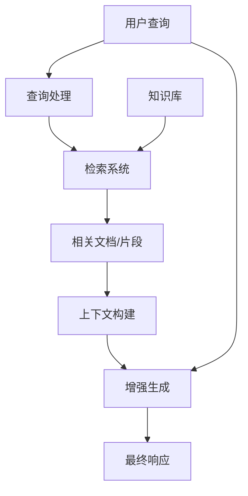
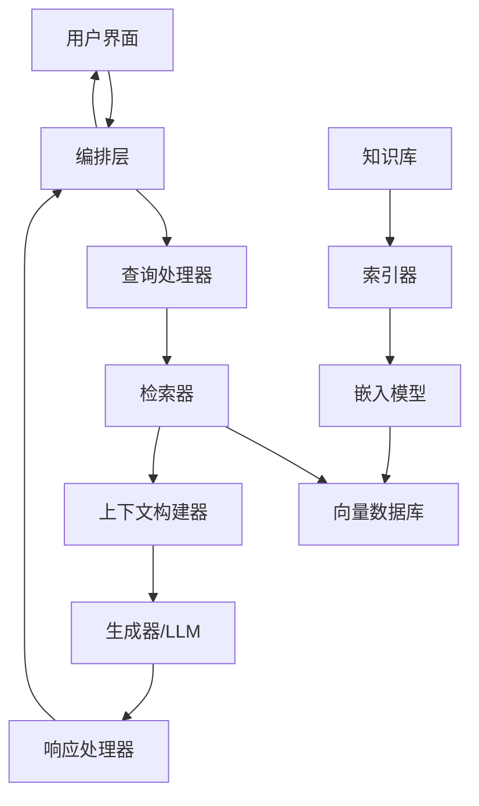
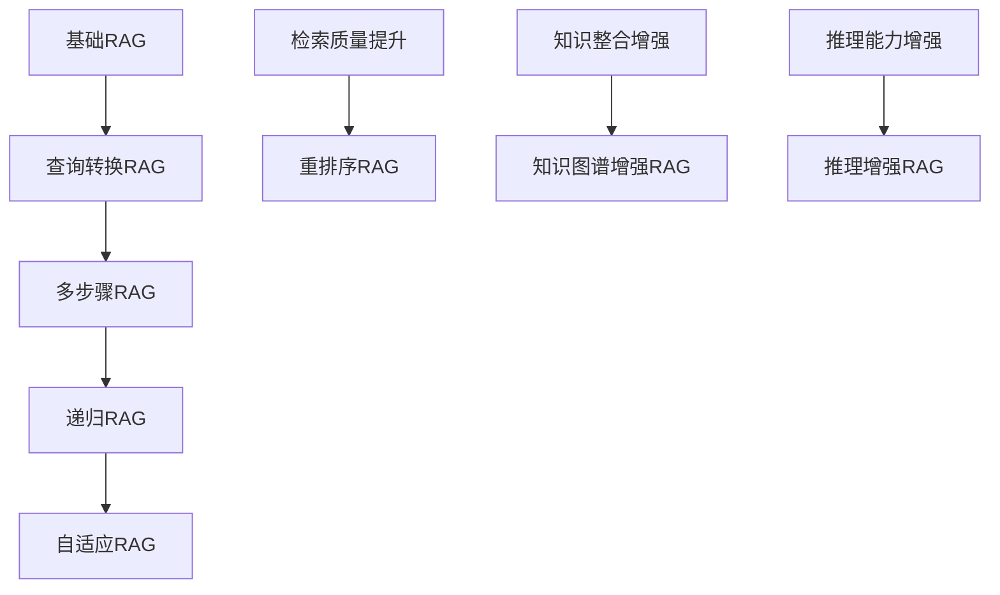
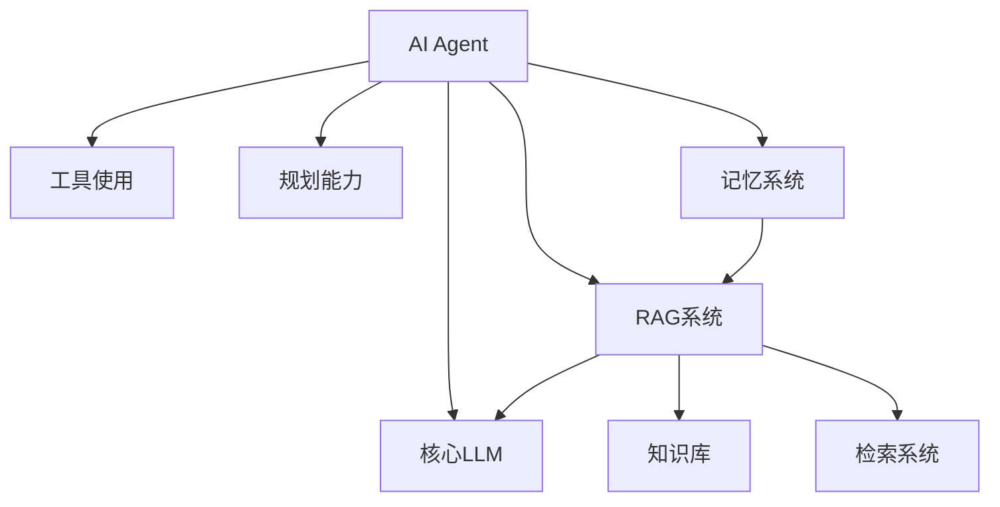
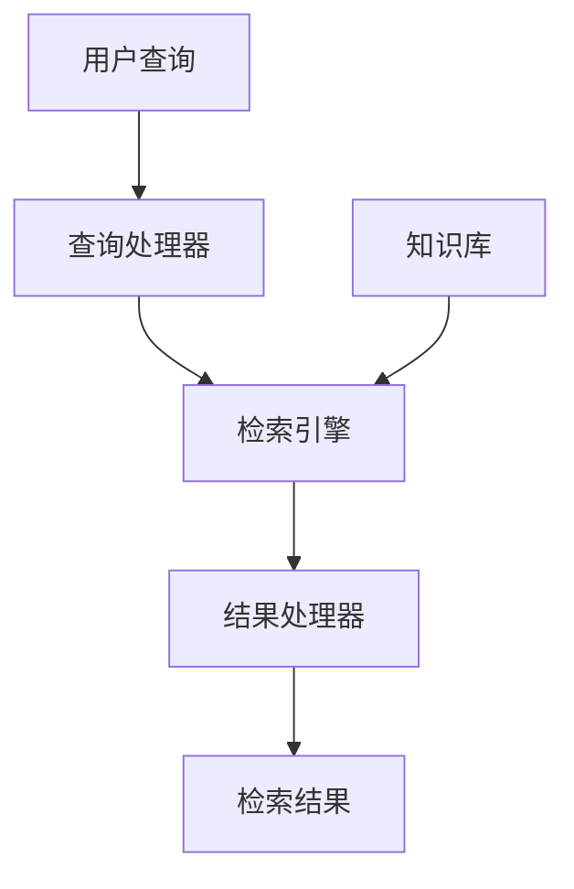
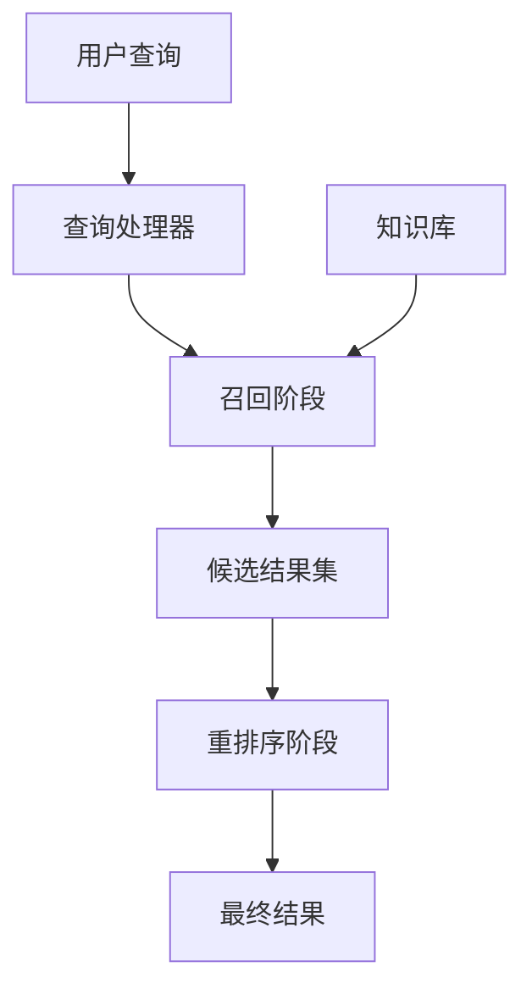
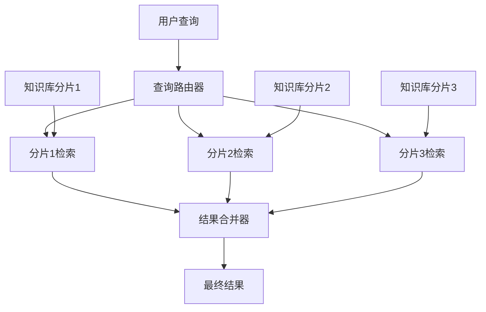
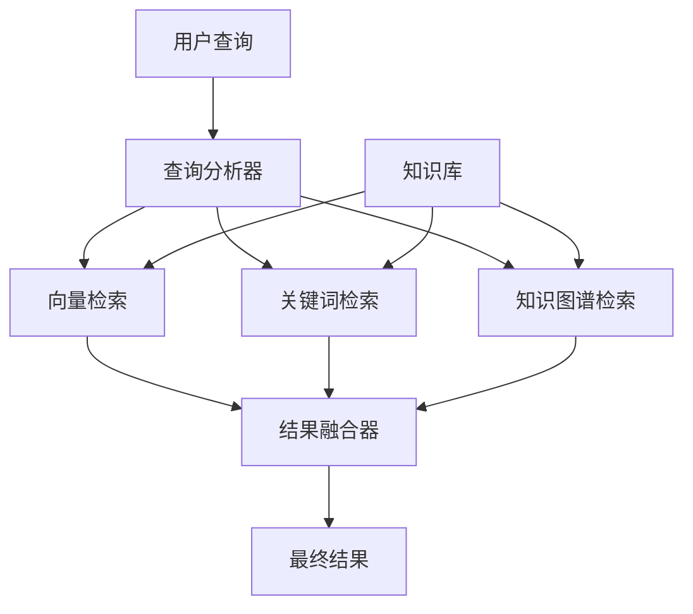

# 第二部分：应用开发

第二部分将深入探讨AI Agent的实际应用开发，从理论转向实践。我们将首先介绍检索增强生成（RAG）技术，这是增强AI Agent知识能力的关键方法。随后，我们将详细讲解AI Agent的工作流设计，包括架构、任务规划、工具使用和记忆机制。接着，我们将提供全面的AI Agent开发实践指南，涵盖环境搭建、基础实现和高级功能开发。最后，我们将探讨Agent的测试、优化与部署策略，确保系统的可靠性和可扩展性。通过这四个章节，读者将掌握构建功能完善、性能优异的AI Agent的全套技能。

# 第4章 检索增强生成（RAG）

本章将详细介绍检索增强生成（Retrieval-Augmented Generation, RAG）技术，这是提升AI Agent知识能力和事实准确性的关键方法。我们将从RAG的基本原理和架构入手，深入探讨知识库构建、向量数据库选型、文本嵌入技术、检索系统设计和生成增强策略等核心环节。通过本章学习，读者将了解如何构建高效的RAG系统，使AI Agent能够访问和利用外部知识，生成更准确、更相关的响应。

## 4.1 RAG的基本原理与架构

### 核心概念

检索增强生成（Retrieval-Augmented Generation, RAG）是一种结合信息检索和文本生成的技术框架，旨在增强大型语言模型（LLM）的知识能力和事实准确性。RAG通过在生成响应前检索相关信息，为LLM提供额外的上下文和知识，从而减少"幻觉"（生成不准确信息）并提高回答的质量。

### 问题背景介绍

尽管现代LLM在预训练过程中学习了大量知识，但它们仍然面临几个关键挑战：

1. **知识时效性**：LLM的知识截止于其训练数据的收集时间，无法获取更新的信息。
2. **知识覆盖范围**：对于专业领域或小众话题，LLM的知识可能不够深入或准确。
3. **幻觉问题**：LLM可能生成看似合理但实际不正确的信息，特别是在处理事实性问题时。
4. **透明度和可追溯性**：纯生成的回答难以追溯信息来源，降低了可信度。

RAG技术正是为了解决这些问题而设计的。通过将外部知识库与LLM结合，RAG系统可以提供更新、更准确、可追溯的信息，同时保持LLM的自然语言理解和生成能力。

### RAG的基本工作流程

RAG系统的基本工作流程包括以下几个关键步骤：

1. **查询处理**：接收用户查询并进行预处理（如分词、扩展、重写等）。
2. **检索**：从知识库中检索与查询相关的文档或片段。
3. **上下文构建**：将检索到的信息组织成适合LLM处理的上下文。
4. **增强生成**：LLM基于查询和检索到的上下文生成最终响应。



### RAG与纯生成模型的对比

RAG系统与纯生成模型（仅使用LLM而不检索外部信息）相比有显著差异：

| 特性 | RAG系统 | 纯生成模型 |
|------|---------|------------|
| 知识更新 | 可以访问最新信息 | 限于训练数据截止日期 |
| 事实准确性 | 更高，基于检索的事实 | 可能产生"幻觉" |
| 专业知识深度 | 可以整合专业资料 | 受预训练数据覆盖限制 |
| 信息来源 | 可追溯 | 难以确定来源 |
| 计算复杂度 | 较高（检索+生成） | 较低（仅生成） |
| 延迟 | 通常更高 | 通常更低 |
| 可控性 | 更高（可控制知识来源） | 较低 |

### RAG的系统架构

一个完整的RAG系统通常包含以下核心组件：

#### 1. 知识库（Knowledge Base）

知识库是RAG系统的基础，存储了系统可以访问的所有信息。它可以包含多种类型的数据：

- 文本文档（如PDF、Word文档、网页等）
- 结构化数据（如数据库、API响应等）
- 半结构化数据（如JSON、XML、Markdown等）
- 多模态内容（如包含图像、表格的文档）

知识库需要经过处理和索引，以便快速检索。

#### 2. 嵌入模型（Embedding Model）

嵌入模型负责将文本转换为向量表示（嵌入），使计算机能够理解和比较文本的语义相似性。在RAG系统中，查询和知识库中的文档都会被转换为向量，以便进行相似性搜索。

常用的嵌入模型包括：
- OpenAI的text-embedding-ada-002
- Sentence-BERT/MPNet
- BGE Embeddings
- Cohere Embeddings

#### 3. 向量数据库（Vector Database）

向量数据库专门设计用于存储和检索向量数据，支持高效的相似性搜索。它存储了知识库中所有文档的向量表示，并提供快速检索功能。

主流向量数据库包括：
- Pinecone
- Weaviate
- Milvus
- Qdrant
- Chroma
- FAISS

#### 4. 检索器（Retriever）

检索器负责从向量数据库中找出与用户查询最相关的文档或片段。它通常使用向量相似性搜索（如余弦相似度、欧氏距离等），但也可能结合其他检索策略，如关键词匹配、混合检索等。

#### 5. 生成器（Generator）

生成器是RAG系统的核心，通常是一个LLM，如GPT-4、Claude或Llama。它接收用户查询和检索到的上下文，生成最终响应。生成器需要通过精心设计的提示来引导其有效利用检索到的信息。

#### 6. 编排层（Orchestration Layer）

编排层协调整个RAG系统的工作流程，管理组件间的交互，处理错误和边缘情况，并可能包含性能监控和优化逻辑。



### RAG的数学模型

从数学角度看，RAG可以表示为一个条件概率模型：

给定用户查询 $q$ 和知识库 $K$，RAG系统生成响应 $y$ 的过程可以分解为：

1. 检索阶段：选择相关文档 $z$ 的概率
   $$p(z|q, K) = \text{Retriever}(q, K)$$

2. 生成阶段：基于查询和检索文档生成响应的概率
   $$p(y|q, z) = \text{Generator}(q, z)$$

3. 整体RAG过程可以表示为：
   $$p(y|q, K) = \sum_{z \in K} p(z|q, K) \cdot p(y|q, z)$$

在实际实现中，通常只选择top-k个最相关文档，而不是对所有可能的文档求和：
   $$p(y|q, K) \approx \sum_{z \in \text{top-k}(q, K)} p(z|q, K) \cdot p(y|q, z)$$

向量相似度计算通常使用余弦相似度：
   $$\text{similarity}(q, d) = \frac{q \cdot d}{||q|| \cdot ||d||}$$

其中 $q$ 是查询向量，$d$ 是文档向量。

### RAG的变体与演进

RAG技术自提出以来不断演进，形成了多种变体：

#### 基础RAG（Basic RAG）

最简单的RAG实现，直接将检索到的文档与用户查询一起发送给LLM。

```
用户查询: "什么是量子计算？"
检索文档: [相关文档内容]
提示模板: "基于以下信息回答问题：\n\n{检索文档}\n\n问题：{用户查询}"
```

#### 高级RAG变体

1. **查询转换RAG（Query Transformation RAG）**
   - 在检索前对原始查询进行扩展、重写或分解
   - 生成多个查询变体以提高检索覆盖面
   - 例如：HyDE（Hypothetical Document Embeddings）方法

2. **多步骤RAG（Multi-step RAG）**
   - 将复杂查询分解为多个子查询
   - 逐步检索和推理
   - 综合多步骤的结果

3. **递归RAG（Recursive RAG）**
   - 使用初步检索结果生成新的查询
   - 迭代检索直到获得满意结果
   - 适用于复杂问题和推理任务

4. **自适应RAG（Adaptive RAG）**
   - 根据查询类型和初步检索结果动态调整检索策略
   - 可能结合多种检索方法（稠密检索、稀疏检索、混合检索等）
   - 智能决定是否需要检索以及检索多少文档

5. **重排序RAG（Reranking RAG）**
   - 在初步检索后添加重排序步骤
   - 使用更复杂的模型评估文档相关性
   - 提高最终传递给LLM的文档质量



### RAG在AI Agent中的作用

在AI Agent系统中，RAG扮演着关键角色：

1. **知识基础**：为Agent提供专业知识和最新信息，超越LLM的内在知识限制。

2. **事实锚定**：确保Agent生成的响应基于可验证的事实，减少幻觉。

3. **领域适应**：通过特定领域的知识库，使通用Agent适应专业领域应用。

4. **透明度增强**：允许Agent引用信息来源，增加可信度和可解释性。

5. **工具使用基础**：RAG可以视为Agent使用的基础工具之一，与其他工具协同工作。

6. **记忆扩展**：作为Agent长期记忆的一部分，存储过去交互和学习经验。



### 实际应用示例

#### 客户支持Agent

```python
from langchain.embeddings import OpenAIEmbeddings
from langchain.vectorstores import Chroma
from langchain.chat_models import ChatOpenAI
from langchain.chains import RetrievalQA

# 初始化嵌入模型
embeddings = OpenAIEmbeddings()

# 加载向量数据库
vectorstore = Chroma(
    collection_name="customer_support_docs",
    embedding_function=embeddings
)

# 初始化检索器
retriever = vectorstore.as_retriever(
    search_type="similarity",
    search_kwargs={"k": 5}
)

# 初始化LLM
llm = ChatOpenAI(model_name="gpt-4")

# 创建RAG链
qa_chain = RetrievalQA.from_chain_type(
    llm=llm,
    chain_type="stuff",
    retriever=retriever,
    return_source_documents=True
)

# 处理用户查询
def process_customer_query(query):
    result = qa_chain({"query": query})
    return {
        "answer": result["result"],
        "sources": [doc.metadata.get("source") for doc in result["source_documents"]]
    }

# 示例使用
response = process_customer_query("如何重置我的账户密码？")
print(response["answer"])
print("信息来源:", response["sources"])
```

#### 医疗咨询Agent

```python
# 医疗RAG系统示例
from langchain.prompts import PromptTemplate
from langchain.chains import RetrievalQAWithSourcesChain

# 自定义提示模板，强调医疗信息的准确性和来源
medical_prompt_template = """你是一位医疗信息助手，基于可靠的医学资料提供信息。
请使用以下医学参考资料回答问题。如果无法从资料中找到答案，请明确说明你不知道，而不是提供可能不准确的信息。

医学参考资料:
{context}

问题: {question}

请提供详细、准确的回答，并注明信息来源。回答应该易于理解但保持医学准确性。
"""

prompt = PromptTemplate(
    template=medical_prompt_template,
    input_variables=["context", "question"]
)

# 创建医疗RAG链
medical_qa_chain = RetrievalQAWithSourcesChain.from_chain_type(
    llm=llm,
    chain_type="stuff",
    retriever=medical_retriever,
    return_source_documents=True,
    chain_type_kwargs={"prompt": prompt}
)

# 处理医疗查询
def process_medical_query(query):
    try:
        result = medical_qa_chain({"question": query})
        return {
            "answer": result["answer"],
            "sources": result["sources"]
        }
    except Exception as e:
        return {
            "answer": "处理您的查询时出现问题。医疗问题请务必咨询专业医生。",
            "error": str(e)
        }
```

## 4.2 知识库构建与管理

知识库是RAG系统的基础，其质量直接影响系统的整体性能。本节将详细介绍知识库的构建和管理过程，包括数据收集、处理、组织和维护。

### 知识库的类型与特点

根据数据结构和来源，知识库可以分为多种类型：

#### 文档知识库

文档知识库由各种文本文档组成，如PDF、Word文档、HTML页面、Markdown文件等。

**特点**：
- 内容丰富，格式多样
- 通常需要文本提取和清洗
- 适合存储长篇、详细的信息
- 常用于企业内部文档、学术资料、产品手册等

**示例应用**：公司政策手册、产品说明书、研究论文集合

#### 结构化知识库

结构化知识库包含具有明确模式的数据，如数据库表、CSV文件、JSON对象等。

**特点**：
- 数据组织有明确的结构
- 查询和过滤效率高
- 适合精确的事实性信息
- 通常需要转换为文本形式供LLM使用

**示例应用**：产品目录、客户数据、财务记录、配置信息

#### 知识图谱

知识图谱以图形结构存储实体及其关系，捕捉复杂的语义网络。

**特点**：
- 表示实体间的复杂关系
- 支持推理和关联查询
- 适合表示领域概念和关系
- 与RAG结合可增强推理能力

**示例应用**：医学概念关系、组织结构图、产品依赖关系

#### 多模态知识库

多模态知识库包含文本、图像、音频、视频等多种媒体类型。

**特点**：
- 整合多种信息形式
- 需要特殊的处理和索引方法
- 适合需要视觉或听觉信息的场景
- 通常需要多模态模型支持

**示例应用**：包含图表的技术文档、带有示例图片的教程、医学影像资料

### 知识库数据收集

构建知识库的第一步是收集相关数据，可以通过多种方式获取：

#### 内部数据源

**企业文档系统**：
- 内部知识库、Wiki、文档管理系统
- 内部报告、会议记录、项目文档
- 培训材料、操作手册、政策文件

**数据库和应用**：
- 企业数据库中的结构化数据
- 内部应用和系统的API
- 业务流程和交易记录

**示例代码**：连接内部文档系统
```python
from langchain.document_loaders import SharePointLoader, ConfluenceLoader

# 从SharePoint加载文档
sharepoint_loader = SharePointLoader(
    site_url="https://company.sharepoint.com/sites/knowledge",
    username="user@company.com",
    password="password"
)
sharepoint_docs = sharepoint_loader.load()

# 从Confluence加载文档
confluence_loader = ConfluenceLoader(
    url="https://company.atlassian.net/wiki",
    username="user@company.com",
    api_key="your-api-key"
)
confluence_docs = confluence_loader.load(space_key="KNOWLEDGE")

# 合并文档
all_internal_docs = sharepoint_docs + confluence_docs
```

#### 外部数据源

**公开网站和API**：
- 公司官网、产品页面、支持文档
- 公开API和数据服务
- RSS源和新闻网站

**学术和专业资源**：
- 研究论文和学术数据库
- 行业报告和白皮书
- 标准文档和规范

**示例代码**：网页抓取
```python
from langchain.document_loaders import WebBaseLoader, PyPDFLoader
from langchain.text_splitter import RecursiveCharacterTextSplitter

# 从网页加载内容
web_loader = WebBaseLoader(
    web_paths=["https://company.com/faq", "https://company.com/support"],
    bs_kwargs={"features": "html.parser"}
)
web_docs = web_loader.load()

# 从PDF加载内容
pdf_loader = PyPDFLoader("https://company.com/whitepaper.pdf")
pdf_docs = pdf_loader.load()

# 文本分割
text_splitter = RecursiveCharacterTextSplitter(
    chunk_size=1000,
    chunk_overlap=200
)
web_chunks = text_splitter.split_documents(web_docs)
pdf_chunks = text_splitter.split_documents(pdf_docs)

# 合并文档
all_external_docs = web_chunks + pdf_chunks
```

#### 数据收集自动化

对于需要保持更新的知识库，建立自动化数据收集流程至关重要：

**定期抓取**：
- 设置定时任务抓取网站和API
- 监控文件系统变化
- 定期同步数据库内容

**变更检测**：
- 检测内容更新和修改
- 仅处理新增或变更的内容
- 维护版本历史

**示例代码**：自动化数据收集流程
```python
import schedule
import time
from datetime import datetime
from langchain.document_loaders import WebBaseLoader

def scrape_website(url, collection_name):
    """抓取网站并更新知识库"""
    print(f"正在抓取 {url}，时间：{datetime.now()}")
    
    # 加载网页内容
    loader = WebBaseLoader(url)
    docs = loader.load()
    
    # 处理文档（分块、提取元数据等）
    processed_docs = process_documents(docs)
    
    # 更新向量存储
    update_vector_store(processed_docs, collection_name)
    
    print(f"完成 {url} 的抓取和更新")

# 设置定时任务
schedule.every().day.at("02:00").do(
    scrape_website, 
    "https://company.com/blog", 
    "company_blog"
)

schedule.every().monday.do(
    scrape_website, 
    "https://company.com/products", 
    "product_info"
)

# 运行调度器
while True:
    schedule.run_pending()
    time.sleep(60)
```

### 文档处理与转换

收集到的原始数据通常需要经过一系列处理步骤，转换为适合RAG系统使用的格式。

#### 文本提取

从不同格式的文件中提取纯文本内容：

**常见文件格式处理**：
- PDF：提取文本、表格和图像说明
- Word/Office：解析文档结构和格式
- HTML：清除HTML标签，保留有用内容
- 图像：OCR识别图像中的文本

**示例代码**：多格式文本提取
```python
from langchain.document_loaders import (
    PyPDFLoader,
    Docx2txtLoader,
    UnstructuredHTMLLoader,
    UnstructuredImageLoader
)

# 处理PDF
pdf_loader = PyPDFLoader("document.pdf")
pdf_docs = pdf_loader.load()

# 处理Word文档
docx_loader = Docx2txtLoader("document.docx")
docx_docs = docx_loader.load()

# 处理HTML
html_loader = UnstructuredHTMLLoader("page.html")
html_docs = html_loader.load()

# 处理图像（使用OCR）
image_loader = UnstructuredImageLoader(
    "scan.jpg",
    mode="elements",
    strategy="fast"
)
image_docs = image_loader.load()
```

#### 文本清洗与规范化

提取的文本通常需要清洗和规范化处理：

**清洗操作**：
- 移除多余空白字符和换行
- 修复编码问题和特殊字符
- 删除页眉、页脚、水印等无关内容
- 处理表格和列表格式

**规范化操作**：
- 统一大小写和标点符号
- 修正拼写和语法错误
- 标准化日期、数字和单位格式
- 解析和标准化专业术语

**示例代码**：文本清洗与规范化
```python
import re
import unicodedata
import spacy

# 加载spaCy模型
nlp = spacy.load("en_core_web_sm")

def clean_text(text):
    """基本文本清洗"""
    # 规范化Unicode字符
    text = unicodedata.normalize('NFKC', text)
    
    # 移除多余空白
    text = re.sub(r'\s+', ' ', text).strip()
    
    # 移除页眉页脚模式
    text = re.sub(r'Page \d+ of \d+', '', text)
    
    # 修复常见OCR错误
    text = text.replace('l', 'l').replace('0', 'O')
    
    return text

def normalize_text(text):
    """文本规范化处理"""
    # 使用spaCy进行处理
    doc = nlp(text)
    
    # 修正拼写（简单示例）
    corrected_tokens = []
    for token in doc:
        # 这里可以接入更复杂的拼写检查库
        corrected_tokens.append(token.text)
    
    # 标准化日期和数字
    normalized_text = ' '.join(corrected_tokens)
    
    return normalized_text

# 处理文档
processed_docs = []
for doc in raw_docs:
    cleaned_text = clean_text(doc.page_content)
    normalized_text = normalize_text(cleaned_text)
    
    # 创建新文档
    processed_doc = Document(
        page_content=normalized_text,
        metadata=doc.metadata
    )
    processed_docs.append(processed_doc)
```

#### 文档分块

将长文档分割成适合RAG系统处理的较小块：

**分块策略**：
- 固定大小分块：按字符或词数分割
- 递归分块：根据文档结构递归分割
- 语义分块：基于语义边界分割
- 重叠分块：块之间保留一定重叠，避免信息丢失

**分块考虑因素**：
- 块大小：太大影响检索精度，太小可能丢失上下文
- 重叠程度：平衡信息连贯性和存储效率
- 保留结构：尊重文档的自然结构（段落、章节等）
- 元数据保留：确保每个块都有足够的来源信息

**示例代码**：高级文档分块
```python
from langchain.text_splitter import (
    RecursiveCharacterTextSplitter,
    MarkdownHeaderTextSplitter,
    TokenTextSplitter
)

# 基于字符的递归分块
char_splitter = RecursiveCharacterTextSplitter(
    chunk_size=1000,
    chunk_overlap=200,
    length_function=len,
    separators=["\n\n", "\n", ". ", " ", ""]
)

# 基于Markdown标题的分块
markdown_splitter = MarkdownHeaderTextSplitter(
    headers_to_split_on=[
        ("#", "Header 1"),
        ("##", "Header 2"),
        ("###", "Header 3"),
    ]
)

# 基于token的分块（适合LLM上下文窗口）
token_splitter = TokenTextSplitter(
    chunk_size=500,
    chunk_overlap=50,
    encoding_name="cl100k_base"  # OpenAI tokenizer
)

# 组合使用多种分块器
def split_document(doc):
    # 首先按Markdown标题分块（如果适用）
    if doc.metadata.get("source", "").endswith(".md"):
        # 提取元数据
        metadata = doc.metadata
        # 按标题分块
        header_splits = markdown_splitter.split_text(doc.page_content)
        
        # 进一步按token分块
        final_chunks = []
        for split in header_splits:
            # 合并标题信息到元数据
            split_metadata = metadata.copy()
            split_metadata.update({
                k: v for k, v in split.metadata.items()
            })
            
            # 按token进一步分块
            token_chunks = token_splitter.split_text(split.page_content)
            
            # 创建最终文档块
            for chunk in token_chunks:
                final_chunks.append(Document(
                    page_content=chunk,
                    metadata=split_metadata
                ))
        
        return final_chunks
    else:
        # 对非Markdown文档使用递归字符分块
        return char_splitter.split_documents([doc])
```

#### 元数据提取与增强

为文档块添加丰富的元数据，提高检索和生成质量：

**基本元数据**：
- 来源信息（文件名、URL、页码等）
- 创建和修改时间
- 作者和所有者信息
- 文档类型和格式

**高级元数据**：
- 文档分类和标签
- 主题和关键词
- 章节和层级信息
- 相关实体和概念

**示例代码**：元数据提取与增强
```python
from langchain.retrievers import ContextualCompressionRetriever
from langchain.retrievers.document_compressors import EmbeddingsFilter
from langchain.llms import OpenAI

def extract_enhanced_metadata(doc):
    """提取和增强文档元数据"""
    # 基本元数据
    metadata = doc.metadata.copy() if hasattr(doc, 'metadata') else {}
    
    # 提取文件信息
    source = metadata.get("source", "")
    if source:
        # 文件类型
        metadata["file_type"] = source.split(".")[-1].lower()
        
        # 提取路径信息
        path_parts = source.split("/")
        if len(path_parts) > 1:
            metadata["directory"] = "/".join(path_parts[:-1])
            metadata["filename"] = path_parts[-1]
    
    # 提取时间信息
    if "created_at" in metadata:
        # 解析并标准化日期
        date_str = metadata["created_at"]
        try:
            # 日期处理逻辑
            metadata["year"] = date_str[:4]  # 简化示例
        except:
            pass
    
    # 使用LLM提取高级元数据
    llm = OpenAI(temperature=0)
    text_sample = doc.page_content[:1000]  # 使用文档开头部分
    
    # 提取主题和关键词
    topic_prompt = f"提取以下文本的主要主题和关键词（以JSON格式返回）:\n\n{text_sample}"
    topic_response = llm(topic_prompt)
    
    try:
        import json
        topic_data = json.loads(topic_response)
        metadata.update(topic_data)
    except:
        # 解析失败时的后备处理
        pass
    
    return metadata

# 处理文档集合
enhanced_docs = []
for doc in chunked_docs:
    enhanced_metadata = extract_enhanced_metadata(doc)
    enhanced_doc = Document(
        page_content=doc.page_content,
        metadata=enhanced_metadata
    )
    enhanced_docs.append(enhanced_doc)
```

### 知识库组织与结构

有效组织知识库可以提高检索效率和准确性，特别是对于大型知识库。

#### 分类与层次结构

**主题分类**：
- 按领域和主题组织文档
- 创建分类体系和标签系统
- 支持多级分类和交叉分类

**层次结构**：
- 建立文档间的层次关系
- 定义父子关系和依赖关系
- 保留文档的原始组织结构

**示例代码**：实现分类结构
```python
from langchain.vectorstores import Chroma

# 按主题组织文档
def organize_by_topic(documents):
    # 按主题分组
    topic_groups = {}
    for doc in documents:
        topic = doc.metadata.get("topic", "general")
        if topic not in topic_groups:
            topic_groups[topic] = []
        topic_groups[topic].append(doc)
    
    return topic_groups

# 创建分层向量存储
def create_hierarchical_vectorstore(documents, embedding_function):
    # 按主题分组
    topic_groups = organize_by_topic(documents)
    
    # 为每个主题创建单独的集合
    vectorstores = {}
    for topic, docs in topic_groups.items():
        # 创建向量存储
        vectorstore = Chroma(
            collection_name=f"knowledge_{topic}",
            embedding_function=embedding_function
        )
        
        # 添加文档
        vectorstore.add_documents(docs)
        vectorstores[topic] = vectorstore
    
    return vectorstores

# 使用分层检索
def hierarchical_retrieval(query, vectorstores, embedding_function, k=5):
    # 首先确定相关主题
    topic_scores = {}
    for topic, vectorstore in vectorstores.items():
        # 简单相关性评分
        sample_docs = vectorstore.similarity_search(query, k=2)
        avg_score = sum(doc.metadata.get("score", 0) for doc in sample_docs) / len(sample_docs) if sample_docs else 0
        topic_scores[topic] = avg_score
    
    # 选择最相关的主题
    relevant_topics = sorted(topic_scores.items(), key=lambda x: x[1], reverse=True)[:3]
    
    # 从相关主题中检索文档
    results = []
    for topic, score in relevant_topics:
        topic_results = vectorstores[topic].similarity_search(query, k=k//len(relevant_topics))
        results.extend(topic_results)
    
    return results
```

#### 知识图谱集成

将知识图谱与RAG系统集成，增强语义理解和关联能力：

**知识图谱构建**：
- 从文档中提取实体和关系
- 构建领域本体和概念模型
- 连接不同来源的相关信息

**知识图谱增强检索**：
- 基于图结构的相关性计算
- 实体链接和消歧
- 关系推理和路径分析

**示例代码**：知识图谱集成
```python
from langchain.graphs import NetworkxEntityGraph
from langchain.chains import GraphQAChain
import networkx as nx

# 从文档构建知识图谱
def build_knowledge_graph(documents):
    # 初始化图
    graph = nx.DiGraph()
    
    # 使用LLM提取实体和关系
    llm = OpenAI(temperature=0)
    
    for doc in documents:
        # 提取实体和关系的提示
        extract_prompt = f"""
        从以下文本中提取实体和它们之间的关系，以JSON格式返回:
        
        {doc.page_content}
        
        格式:
        {{
            "entities": [
                {{"id": "entity1", "type": "Person", "name": "实体名称"}},
                ...
            ],
            "relations": [
                {{"source": "entity1", "target": "entity2", "type": "关系类型"}},
                ...
            ]
        }}
        """
        
        try:
            # 提取实体和关系
            response = llm(extract_prompt)
            data = json.loads(response)
            
            # 添加到图中
            for entity in data.get("entities", []):
                graph.add_node(
                    entity["id"],
                    type=entity.get("type"),
                    name=entity.get("name"),
                    source_doc=doc.metadata.get("source")
                )
            
            for relation in data.get("relations", []):
                graph.add_edge(
                    relation["source"],
                    relation["target"],
                    type=relation.get("type")
                )
        except Exception as e:
            print(f"Error processing document: {e}")
    
    return graph

# 使用知识图谱增强检索
def graph_enhanced_retrieval(query, graph, vectorstore, k=5):
    # 从查询中提取实体
    llm = OpenAI(temperature=0)
    entity_prompt = f"从以下查询中提取关键实体（以JSON格式返回实体列表）:\n\n{query}"
    entity_response = llm(entity_prompt)
    
    try:
        entities = json.loads(entity_response).get("entities", [])
    except:
        entities = []
    
    # 基于图的检索
    relevant_nodes = set()
    for entity in entities:
        # 查找匹配的节点
        for node in graph.nodes:
            if entity.lower() in graph.nodes[node].get("name", "").lower():
                # 添加节点及其邻居
                relevant_nodes.add(node)
                relevant_nodes.update(graph.neighbors(node))
    
    # 获取相关节点的文档
    graph_docs = []
    for node in relevant_nodes:
        source_doc = graph.nodes[node].get("source_doc")
        if source_doc:
            # 从向量存储中检索原始文档
            doc_results = vectorstore.similarity_search(
                f"source:{source_doc}",
                k=1,
                filter={"source": source_doc}
            )
            graph_docs.extend(doc_results)
    
    # 结合向量检索结果
    vector_docs = vectorstore.similarity_search(query, k=k)
    
    # 合并结果（去重）
    seen_sources = set()
    final_results = []
    
    # 优先添加图检索结果
    for doc in graph_docs:
        source = doc.metadata.get("source")
        if source and source not in seen_sources:
            seen_sources.add(source)
            final_results.append(doc)
    
    # 添加向量检索结果
    for doc in vector_docs:
        source = doc.metadata.get("source")
        if source and source not in seen_sources:
            seen_sources.add(source)
            final_results.append(doc)
    
    # 限制返回数量
    return final_results[:k]
```

#### 多知识库管理

管理多个知识库，适应不同领域和用途：

**知识库分离**：
- 按领域或用途分离知识库
- 维护独立的索引和检索系统
- 支持跨知识库查询和整合

**路由与分发**：
- 智能路由查询到相关知识库
- 动态选择检索策略
- 合并多知识库的检索结果

**示例代码**：多知识库管理
```python
from langchain.embeddings import OpenAIEmbeddings
from langchain.vectorstores import Chroma
from langchain.llms import OpenAI

class MultiKnowledgeBaseManager:
    def __init__(self):
        self.knowledge_bases = {}
        self.embedding_function = OpenAIEmbeddings()
        self.llm = OpenAI(temperature=0)
    
    def add_knowledge_base(self, name, documents, description):
        """添加新的知识库"""
        # 创建向量存储
        vectorstore = Chroma(
            collection_name=name,
            embedding_function=self.embedding_function
        )
        
        # 添加文档
        vectorstore.add_documents(documents)
        
        # 注册知识库
        self.knowledge_bases[name] = {
            "vectorstore": vectorstore,
            "description": description,
            "document_count": len(documents)
        }
        
        print(f"已添加知识库 '{name}' 包含 {len(documents)} 个文档")
    
    def route_query(self, query):
        """路由查询到相关知识库"""
        if not self.knowledge_bases:
            return []
        
        # 如果只有一个知识库，直接使用
        if len(self.knowledge_bases) == 1:
            kb_name = list(self.knowledge_bases.keys())[0]
            return [kb_name], f"只有一个可用的知识库: {kb_name}"
        
        # 准备知识库描述
        kb_descriptions = "\n".join([
            f"- {name}: {info['description']} ({info['document_count']} 文档)"
            for name, info in self.knowledge_bases.items()
        ])
        
        # 使用LLM选择相关知识库
        router_prompt = f"""
        基于以下查询，选择最相关的知识库。你可以选择多个知识库，如果都相关。
        
        查询: {query}
        
        可用知识库:
        {kb_descriptions}
        
        以JSON格式返回结果:
        {{
            "selected_knowledge_bases": ["知识库名称1", "知识库名称2"],
            "reasoning": "选择理由..."
        }}
        """
        
        response = self.llm(router_prompt)
        
        try:
            result = json.loads(response)
            selected_kbs = result.get("selected_knowledge_bases", [])
            reasoning = result.get("reasoning", "")
            
            # 验证选择的知识库是否存在
            valid_kbs = [kb for kb in selected_kbs if kb in self.knowledge_bases]
            
            if not valid_kbs:
                # 如果没有有效选择，使用所有知识库
                valid_kbs = list(self.knowledge_bases.keys())
                reasoning = "没有找到明确匹配的知识库，将使用所有可用知识库。"
            
            return valid_kbs, reasoning
            
        except Exception as e:
            # 解析失败时使用所有知识库
            return list(self.knowledge_bases.keys()), f"路由过程出错: {str(e)}"
    
    def retrieve(self, query, k=5):
        """从相关知识库检索文档"""
        # 路由查询
        selected_kbs, reasoning = self.route_query(query)
        
        print(f"查询路由: {reasoning}")
        print(f"选择的知识库: {selected_kbs}")
        
        # 从每个选择的知识库检索文档
        results = []
        for kb_name in selected_kbs:
            kb_info = self.knowledge_bases.get(kb_name)
            if kb_info:
                # 计算每个知识库应检索的文档数
                kb_k = max(1, k // len(selected_kbs))
                
                # 检索文档
                kb_results = kb_info["vectorstore"].similarity_search(
                    query, k=kb_k
                )
                
                # 添加知识库信息到元数据
                for doc in kb_results:
                    doc.metadata["knowledge_base"] = kb_name
                
                results.extend(kb_results)
        
        # 如果有多个知识库，可能需要重新排序结果
        if len(selected_kbs) > 1:
            # 简单方法：基于嵌入相似度重新排序
            query_embedding = self.embedding_function.embed_query(query)
            
            # 计算每个文档与查询的相似度
            scored_results = []
            for doc in results:
                if "embedding" in doc.metadata:
                    doc_embedding = doc.metadata["embedding"]
                    similarity = cosine_similarity(query_embedding, doc_embedding)
                    scored_results.append((doc, similarity))
                else:
                    # 如果没有预计算的嵌入，使用默认分数
                    scored_results.append((doc, 0.5))
            
            # 按相似度排序
            scored_results.sort(key=lambda x: x[1], reverse=True)
            
            # 提取排序后的文档
            results = [doc for doc, _ in scored_results[:k]]
        
        return results[:k]

# 使用示例
manager = MultiKnowledgeBaseManager()

# 添加多个知识库
manager.add_knowledge_base(
    "product_docs",
    product_documents,
    "产品说明书、规格和使用指南"
)

manager.add_knowledge_base(
    "support_docs",
    support_documents,
    "常见问题、故障排除和客户支持信息"
)

manager.add_knowledge_base(
    "company_policies",
    policy_documents,
    "公司政策、流程和内部规定"
)

# 检索文档
query = "如何解决产品X的蓝屏问题？"
results = manager.retrieve(query, k=5)
```

### 知识库更新与维护

知识库不是静态的，需要定期更新和维护以保持其相关性和准确性。

#### 增量更新策略

**变更检测**：
- 监控数据源的变更
- 比较文档版本差异
- 识别需要更新的内容

**选择性更新**：
- 仅处理变更的文档
- 保留未变更文档的向量
- 维护更新历史和版本控制

**示例代码**：增量更新
```python
from datetime import datetime
import hashlib

class IncrementalUpdater:
    def __init__(self, vectorstore):
        self.vectorstore = vectorstore
        self.document_hashes = {}  # 存储文档哈希值
        self.last_update = {}  # 存储最后更新时间
    
    def compute_document_hash(self, document):
        """计算文档内容的哈希值"""
        content = document.page_content
        return hashlib.md5(content.encode()).hexdigest()
    
    def load_document_state(self):
        """从向量存储加载文档状态"""
        # 这里假设向量存储支持元数据查询
        # 实际实现可能需要根据具体向量存储调整
        try:
            all_docs = self.vectorstore.get_all_documents()
            
            for doc in all_docs:
                source = doc.metadata.get("source")
                if source:
                    self.document_hashes[source] = doc.metadata.get("content_hash")
                    self.last_update[source] = doc.metadata.get("last_updated")
            
            print(f"已加载 {len(self.document_hashes)} 个文档的状态")
        except Exception as e:
            print(f"加载文档状态失败: {e}")
    
    def update_knowledge_base(self, new_documents):
        """增量更新知识库"""
        # 加载当前状态（如果尚未加载）
        if not self.document_hashes:
            self.load_document_state()
        
        # 处理新文档
        documents_to_add = []
        documents_to_update = []
        unchanged_documents = []
        
        for doc in new_documents:
            source = doc.metadata.get("source")
            current_hash = self.compute_document_hash(doc)
            
            # 添加哈希和更新时间到元数据
            doc.metadata["content_hash"] = current_hash
            doc.metadata["last_updated"] = datetime.now().isoformat()
            
            if source in self.document_hashes:
                # 文档已存在，检查是否变更
                if current_hash != self.document_hashes[source]:
                    # 文档已变更
                    documents_to_update.append(doc)
                    print(f"文档已变更: {source}")
                else:
                    # 文档未变更
                    unchanged_documents.append(doc)
                    print(f"文档未变更: {source}")
            else:
                # 新文档
                documents_to_add.append(doc)
                print(f"新文档: {source}")
        
        # 更新向量存储
        if documents_to_add:
            print(f"添加 {len(documents_to_add)} 个新文档")
            self.vectorstore.add_documents(documents_to_add)
        
        if documents_to_update:
            print(f"更新 {len(documents_to_update)} 个变更文档")
            # 删除旧版本
            for doc in documents_to_update:
                source = doc.metadata.get("source")
                self.vectorstore.delete(filter={"source": source})
            
            # 添加新版本
            self.vectorstore.add_documents(documents_to_update)
        
        # 更新内部状态
        for doc in documents_to_add + documents_to_update:
            source = doc.metadata.get("source")
            if source:
                self.document_hashes[source] = doc.metadata["content_hash"]
                self.last_update[source] = doc.metadata["last_updated"]
        
        return {
            "added": len(documents_to_add),
            "updated": len(documents_to_update),
            "unchanged": len(unchanged_documents),
            "total": len(new_documents)
        }
```

#### 知识库质量监控

**质量指标**：
- 检索相关性评分
- 用户反馈和评价
- 内容覆盖率和完整性
- 信息时效性和准确性

**监控与警报**：
- 定期评估知识库质量
- 识别低质量或过时内容
- 设置质量阈值和警报机制

**示例代码**：知识库质量监控
```python
from langchain.evaluation import QAEvalChain
import numpy as np
from datetime import datetime, timedelta

class KnowledgeBaseMonitor:
    def __init__(self, vectorstore, llm):
        self.vectorstore = vectorstore
        self.llm = llm
        self.qa_evaluator = QAEvalChain.from_llm(llm)
        self.quality_thresholds = {
            "relevance": 0.7,  # 最低相关性分数
            "freshness": 180,  # 最大天数（6个月）
            "coverage": 0.8,   # 最低覆盖率
        }
    
    def evaluate_retrieval_quality(self, test_queries, k=5):
        """评估检索质量"""
        results = {}
        all_relevance_scores = []
        
        for query in test_queries:
            # 检索文档
            retrieved_docs = self.vectorstore.similarity_search(query, k=k)
            
            # 评估相关性
            eval_prompt = f"""
            查询: {query}
            
            请评估以下检索结果与查询的相关性，为每个结果评分（0-10分）:
            """
            
            for i, doc in enumerate(retrieved_docs):
                eval_prompt += f"\n\n文档 {i+1}:\n{doc.page_content[:500]}..."
            
            eval_prompt += "\n\n以JSON格式返回评分，例如: {\"scores\": [8, 5, 7, 4, 6]}"
            
            try:
                eval_response = self.llm(eval_prompt)
                scores = json.loads(eval_response).get("scores", [])
                
                # 标准化分数到0-1
                normalized_scores = [s/10 for s in scores]
                
                # 计算平均相关性
                avg_relevance = sum(normalized_scores) / len(normalized_scores) if normalized_scores else 0
                all_relevance_scores.extend(normalized_scores)
                
                results[query] = {
                    "relevance_scores": normalized_scores,
                    "average_relevance": avg_relevance,
                    "below_threshold": avg_relevance < self.quality_thresholds["relevance"]
                }
                
            except Exception as e:
                print(f"评估查询失败 '{query}': {e}")
                results[query] = {"error": str(e)}
        
        # 计算整体指标
        overall_relevance = sum(all_relevance_scores) / len(all_relevance_scores) if all_relevance_scores else 0
        below_threshold_queries = sum(1 for q in results if results[q].get("below_threshold", False))
        
        summary = {
            "overall_relevance": overall_relevance,
            "below_threshold_queries": below_threshold_queries,
            "total_queries": len(test_queries),
            "below_threshold_percentage": below_threshold_queries / len(test_queries) if test_queries else 0
        }
        
        return results, summary
    
    def check_content_freshness(self):
        """检查内容新鲜度"""
        try:
            all_docs = self.vectorstore.get_all_documents()
            
            now = datetime.now()
            outdated_docs = []
            
            for doc in all_docs:
                # 检查最后更新时间
                last_updated = doc.metadata.get("last_updated")
                if last_updated:
                    try:
                        update_date = datetime.fromisoformat(last_updated)
                        days_since_update = (now - update_date).days
                        
                        if days_since_update > self.quality_thresholds["freshness"]:
                            outdated_docs.append({
                                "source": doc.metadata.get("source"),
                                "days_since_update": days_since_update,
                                "last_updated": last_updated
                            })
                    except:
                        # 日期解析错误
                        pass
            
            freshness_report = {
                "total_documents": len(all_docs),
                "outdated_documents": len(outdated_docs),
                "outdated_percentage": len(outdated_docs) / len(all_docs) if all_docs else 0,
                "outdated_details": outdated_docs
            }
            
            return freshness_report
            
        except Exception as e:
            return {"error": f"检查内容新鲜度失败: {e}"}
    
    def evaluate_coverage(self, test_queries):
        """评估知识库覆盖率"""
        covered_queries = 0
        coverage_details = {}
        
        for query in test_queries:
            # 检索文档
            retrieved_docs = self.vectorstore.similarity_search(query, k=3)
            
            # 评估是否有足够信息回答查询
            eval_prompt = f"""
            查询: {query}
            
            基于以下检索到的信息，评估是否有足够的信息来完整回答查询:
            
            {[doc.page_content for doc in retrieved_docs]}
            
            以JSON格式返回结果:
            {{
                "has_sufficient_info": true/false,
                "missing_information": "如果信息不足，说明缺少什么信息"
            }}
            """
            
            try:
                eval_response = self.llm(eval_prompt)
                result = json.loads(eval_response)
                
                has_info = result.get("has_sufficient_info", False)
                if has_info:
                    covered_queries += 1
                
                coverage_details[query] = {
                    "has_sufficient_info": has_info,
                    "missing_information": result.get("missing_information", "")
                }
                
            except Exception as e:
                print(f"评估查询覆盖率失败 '{query}': {e}")
                coverage_details[query] = {"error": str(e)}
        
        coverage_rate = covered_queries / len(test_queries) if test_queries else 0
        
        coverage_report = {
            "coverage_rate": coverage_rate,
            "covered_queries": covered_queries,
            "total_queries": len(test_queries),
            "below_threshold": coverage_rate < self.quality_thresholds["coverage"],
            "details": coverage_details
        }
        
        return coverage_report
    
    def generate_quality_report(self, test_queries):
        """生成完整的质量报告"""
        # 检索质量评估
        retrieval_results, retrieval_summary = self.evaluate_retrieval_quality(test_queries)
        
        # 内容新鲜度检查
        freshness_report = self.check_content_freshness()
        
        # 覆盖率评估
        coverage_report = self.evaluate_coverage(test_queries)
        
        # 汇总报告
        quality_report = {
            "timestamp": datetime.now().isoformat(),
            "retrieval_quality": retrieval_summary,
            "content_freshness": freshness_report,
            "coverage": coverage_report,
            "overall_health": "good" if (
                retrieval_summary["overall_relevance"] >= self.quality_thresholds["relevance"] and
                freshness_report["outdated_percentage"] < 0.2 and
                coverage_report["coverage_rate"] >= self.quality_thresholds["coverage"]
            ) else "needs_attention",
            "recommendations": self._generate_recommendations(
                retrieval_summary, freshness_report, coverage_report
            )
        }
        
        return quality_report
    
    def _generate_recommendations(self, retrieval_summary, freshness_report, coverage_report):
        """生成改进建议"""
        recommendations = []
        
        # 检索质量建议
        if retrieval_summary["overall_relevance"] < self.quality_thresholds["relevance"]:
            recommendations.append(
                "提高检索质量：考虑改进嵌入模型或检索策略，当前相关性分数低于阈值。"
            )
        
        # 内容新鲜度建议
        if freshness_report["outdated_percentage"] > 0.2:
            recommendations.append(
                f"更新过时内容：{freshness_report['outdated_documents']}个文档（{freshness_report['outdated_percentage']:.1%}）超过{self.quality_thresholds['freshness']}天未更新。"
            )
        
        # 覆盖率建议
        if coverage_report["coverage_rate"] < self.quality_thresholds["coverage"]:
            recommendations.append(
                f"扩展知识覆盖：当前覆盖率为{coverage_report['coverage_rate']:.1%}，低于目标阈值{self.quality_thresholds['coverage']:.1%}。考虑添加更多相关内容。"
            )
        
        return recommendations
```

#### 知识库版本控制

**版本管理**：
- 维护知识库的版本历史
- 支持回滚到先前版本
- 记录变更内容和原因

**分支与环境**：
- 支持开发、测试和生产环境
- 允许并行开发和实验
- 控制版本发布和部署

**示例代码**：知识库版本控制
```python
import uuid
from datetime import datetime
import json
import os

class KnowledgeBaseVersionControl:
    def __init__(self, base_path="./kb_versions"):
        self.base_path = base_path
        self.current_version = None
        self.version_history = []
        self.environments = {
            "development": None,
            "testing": None,
            "production": None
        }
        
        # 创建版本目录
        os.makedirs(base_path, exist_ok=True)
        
        # 加载版本历史
        self._load_version_history()
    
    def _load_version_history(self):
        """加载版本历史"""
        history_path = os.path.join(self.base_path, "version_history.json")
        if os.path.exists(history_path):
            try:
                with open(history_path, "r") as f:
                    data = json.load(f)
                    self.version_history = data.get("versions", [])
                    self.environments = data.get("environments", self.environments)
                    self.current_version = data.get("current_version")
                print(f"已加载 {len(self.version_history)} 个版本的历史记录")
            except Exception as e:
                print(f"加载版本历史失败: {e}")
    
    def _save_version_history(self):
        """保存版本历史"""
        history_path = os.path.join(self.base_path, "version_history.json")
        try:
            with open(history_path, "w") as f:
                json.dump({
                    "versions": self.version_history,
                    "environments": self.environments,
                    "current_version": self.current_version
                }, f, indent=2)
        except Exception as e:
            print(f"保存版本历史失败: {e}")
    
    def create_version(self, vectorstore, description, author):
        """创建新版本"""
        # 生成版本ID
        version_id = str(uuid.uuid4())
        timestamp = datetime.now().isoformat()
        
        # 版本信息
        version_info = {
            "id": version_id,
            "timestamp": timestamp,
            "description": description,
            "author": author,
            "document_count": self._count_documents(vectorstore),
            "parent_version": self.current_version
        }
        
        # 保存版本数据
        version_path = os.path.join(self.base_path, version_id)
        os.makedirs(version_path, exist_ok=True)
        
        # 导出向量存储数据
        try:
            # 这里的实现取决于具体的向量存储
            # 例如，Chroma可以使用persist()方法
            vectorstore.persist(version_path)
            
            # 保存版本元数据
            with open(os.path.join(version_path, "metadata.json"), "w") as f:
                json.dump(version_info, f, indent=2)
            
            # 更新版本历史
            self.version_history.append(version_info)
            self.current_version = version_id
            self._save_version_history()
            
            print(f"已创建新版本: {version_id}")
            return version_id
            
        except Exception as e:
            print(f"创建版本失败: {e}")
            return None
    
    def _count_documents(self, vectorstore):
        """计算向量存储中的文档数量"""
        try:
            # 这里的实现取决于具体的向量存储
            return len(vectorstore.get_all_documents())
        except:
            return 0
    
    def list_versions(self, limit=10):
        """列出版本历史"""
        # 按时间倒序排列
        sorted_versions = sorted(
            self.version_history,
            key=lambda v: v.get("timestamp", ""),
            reverse=True
        )
        
        return sorted_versions[:limit]
    
    def get_version_details(self, version_id):
        """获取版本详情"""
        for version in self.version_history:
            if version["id"] == version_id:
                return version
        return None
    
    def load_version(self, version_id, vectorstore_class):
        """加载特定版本"""
        version_path = os.path.join(self.base_path, version_id)
        if not os.path.exists(version_path):
            print(f"版本不存在: {version_id}")
            return None
        
        try:
            # 加载向量存储
            # 这里的实现取决于具体的向量存储类
            vectorstore = vectorstore_class(persist_directory=version_path)
            
            print(f"已加载版本: {version_id}")
            return vectorstore
        except Exception as e:
            print(f"加载版本失败: {e}")
            return None
    
    def deploy_to_environment(self, version_id, environment):
        """部署版本到特定环境"""
        if environment not in self.environments:
            print(f"环境不存在: {environment}")
            return False
        
        # 检查版本是否存在
        version_exists = False
        for version in self.version_history:
            if version["id"] == version_id:
                version_exists = True
                break
        
        if not version_exists:
            print(f"版本不存在: {version_id}")
            return False
        
        # 更新环境指针
        self.environments[environment] = version_id
        self._save_version_history()
        
        print(f"已将版本 {version_id} 部署到 {environment} 环境")
        return True
    
    def get_environment_version(self, environment):
        """获取环境当前版本"""
        if environment not in self.environments:
            return None
        
        return self.environments[environment]
    
    def compare_versions(self, version_id1, version_id2):
        """比较两个版本的差异"""
        # 获取版本详情
        version1 = self.get_version_details(version_id1)
        version2 = self.get_version_details(version_id2)
        
        if not version1 or not version2:
            return {"error": "一个或多个版本不存在"}
        
        # 加载版本数据
        try:
            # 这里需要根据具体向量存储实现
            # 简化示例：只比较元数据
            with open(os.path.join(self.base_path, version_id1, "metadata.json"), "r") as f:
                metadata1 = json.load(f)
            
            with open(os.path.join(self.base_path, version_id2, "metadata.json"), "r") as f:
                metadata2 = json.load(f)
            
            # 计算基本差异
            comparison = {
                "version1": {
                    "id": version_id1,
                    "timestamp": version1.get("timestamp"),
                    "document_count": version1.get("document_count", 0)
                },
                "version2": {
                    "id": version_id2,
                    "timestamp": version2.get("timestamp"),
                    "document_count": version2.get("document_count", 0)
                },
                "document_count_diff": version2.get("document_count", 0) - version1.get("document_count", 0),
                "is_newer": version2.get("timestamp", "") > version1.get("timestamp", "")
            }
            
            return comparison
            
        except Exception as e:
            return {"error": f"比较版本失败: {e}"}
```

## 4.3 向量数据库选型与应用

向量数据库是RAG系统的核心组件，负责存储和检索文档的向量表示。选择合适的向量数据库对系统性能至关重要。本节将介绍主流向量数据库的特点、选型考虑因素以及实际应用方法。

### 向量数据库基础

#### 向量数据库的定义与作用

向量数据库是专门设计用于存储、管理和检索高维向量数据的数据库系统。在RAG系统中，向量数据库存储文档的嵌入表示，并提供高效的相似性搜索功能。

**核心功能**：
- 存储高维向量数据
- 执行高效的相似性搜索
- 管理向量与原始数据的映射
- 支持过滤和复杂查询

**在RAG中的作用**：
- 存储知识库文档的向量表示
- 快速找到与用户查询最相关的文档
- 支持语义搜索而非仅关键词匹配
- 处理大规模知识库的高效检索

#### 向量索引技术

向量数据库使用特殊的索引技术来加速相似性搜索：

**精确搜索算法**：
- 暴力搜索：计算查询向量与所有存储向量的距离
- KD树：基于空间分割的树形索引结构
- VP树：基于距离的树形索引结构

**近似最近邻（ANN）算法**：
- 局部敏感哈希（LSH）：将相似向量映射到相同的哈希桶
- 产品量化（PQ）：将高维向量分解为低维子向量的笛卡尔积
- 层次导航图（HNSW）：构建多层图结构进行导航搜索
- 倒排文件索引（IVF）：将向量空间分割为多个单元，构建倒排索引

**索引性能对比**：

| 索引方法 | 查询速度 | 准确性 | 内存占用 | 构建时间 | 适用场景 |
|---------|---------|-------|---------|---------|---------|
| 暴力搜索 | 非常慢 | 100% | 低 | 无需构建 | 小数据集、需要精确结果 |
| KD树 | 中等 | 高 | 中等 | 中等 | 低维向量（<20维） |
| LSH | 快 | 中等 | 高 | 快 | 大数据集、可接受近似结果 |
| HNSW | 非常快 | 高 | 高 | 慢 | 需要高查询性能、内存充足 |
| IVF | 快 | 中等 | 中等 | 中等 | 平衡性能和资源消耗 |
| PQ | 快 | 中低 | 低 | 中等 | 资源受限环境、超大规模数据 |

#### 相似性度量

向量数据库支持多种相似性度量方法，适用于不同类型的数据和应用场景：

**常用距离/相似度度量**：
- 余弦相似度：测量向量方向的相似性，忽略大小
- 欧氏距离：测量向量在空间中的直线距离
- 点积：考虑向量方向和大小的简单乘积
- 曼哈顿距离：测量沿坐标轴的距离总和
- 汉明距离：适用于二进制向量，计算不同位的数量

**数学表示**：

余弦相似度：
$$\text{cosine}(A, B) = \frac{A \cdot B}{||A|| \cdot ||B||} = \frac{\sum_{i=1}^{n} A_i B_i}{\sqrt{\sum_{i=1}^{n} A_i^2} \sqrt{\sum_{i=1}^{n} B_i^2}}$$

欧氏距离：
$$\text{euclidean}(A, B) = ||A - B|| = \sqrt{\sum_{i=1}^{n} (A_i - B_i)^2}$$

点积：
$$\text{dot}(A, B) = A \cdot B = \sum_{i=1}^{n} A_i B_i$$

**选择指南**：
- 余弦相似度：当向量大小不重要，只关注方向相似性时（常用于文本嵌入）
- 欧氏距离：当向量的绝对位置重要时
- 点积：当使用L2归一化的向量时（等同于余弦相似度）
- 曼哈顿距离：当特征独立性强，且关注各维度差异总和时
- 汉明距离：当使用二进制或散列特征时

### 主流向量数据库对比

市场上有多种向量数据库解决方案，各有优缺点。以下是主流向量数据库的详细对比：

#### Pinecone

**特点**：
- 完全托管的云服务
- 高可用性和可扩展性
- 支持实时更新和查询
- 简单的API和客户端库
- 内置的向量索引优化

**优势**：
- 零运维负担
- 自动扩展和负载均衡
- 企业级安全和合规性
- 稳定的性能和SLA保证

**局限性**：
- 成本随数据量和查询量增加
- 数据存储在第三方云服务
- 自定义和灵活性有限

**适用场景**：
- 需要快速部署的企业应用
- 对可靠性和可扩展性有高要求
- 不想管理基础设施的团队

**示例代码**：
```python
import pinecone
from langchain.vectorstores import Pinecone
from langchain.embeddings import OpenAIEmbeddings

# 初始化Pinecone
pinecone.init(
    api_key="your-api-key",
    environment="us-west1-gcp"
)

# 创建或连接到索引
index_name = "knowledge-base"
if index_name not in pinecone.list_indexes():
    pinecone.create_index(
        name=index_name,
        dimension=1536,  # OpenAI嵌入维度
        metric="cosine"
    )

# 初始化嵌入模型
embeddings = OpenAIEmbeddings()

# 创建向量存储
vectorstore = Pinecone.from_documents(
    documents=documents,
    embedding=embeddings,
    index_name=index_name,
    namespace="company-docs"
)

# 相似性搜索
query = "如何重置密码？"
results = vectorstore.similarity_search(
    query=query,
    k=5,
    namespace="company-docs"
)

# 元数据过滤搜索
filtered_results = vectorstore.similarity_search(
    query=query,
    k=5,
    filter={"category": "account-management"},
    namespace="company-docs"
)
```

#### Weaviate

**特点**：
- 开源向量搜索引擎
- 支持多模态数据
- GraphQL查询接口
- 内置的分类和自动化模块
- 支持混合搜索（向量+关键词）

**优势**：
- 灵活的数据模型和模式
- 强大的查询能力和过滤
- 可自托管或使用云服务
- 活跃的开源社区

**局限性**：
- 配置和优化较复杂
- 自托管需要更多维护工作
- 学习曲线较陡峭

**适用场景**：
- 需要复杂数据模型的应用
- 多模态搜索需求
- 需要灵活查询和过滤的场景

**示例代码**：
```python
import weaviate
from langchain.vectorstores import Weaviate
from langchain.embeddings import OpenAIEmbeddings
import uuid

# 连接到Weaviate
client = weaviate.Client(
    url="http://localhost:8080",
    additional_headers={
        "X-OpenAI-Api-Key": "your-openai-api-key"
    }
)

# 创建类（相当于集合或表）
class_obj = {
    "class": "Document",
    "vectorizer": "text2vec-openai",
    "moduleConfig": {
        "text2vec-openai": {
            "model": "ada",
            "modelVersion": "002",
            "type": "text"
        }
    },
    "properties": [
        {
            "name": "content",
            "dataType": ["text"]
        },
        {
            "name": "source",
            "dataType": ["string"]
        },
        {
            "name": "category",
            "dataType": ["string"]
        }
    ]
}

# 检查类是否存在，不存在则创建
if not client.schema.contains({"class": "Document"}):
    client.schema.create_class(class_obj)

# 初始化嵌入模型
embeddings = OpenAIEmbeddings()

# 创建向量存储
vectorstore = Weaviate(
    client=client,
    index_name="Document",
    text_key="content",
    embedding=embeddings
)

# 添加文档
for doc in documents:
    metadata = doc.metadata.copy()
    vectorstore.add_texts(
        texts=[doc.page_content],
        metadatas=[metadata]
    )

# 相似性搜索
query = "如何重置密码？"
results = vectorstore.similarity_search(
    query=query,
    k=5
)

# 高级查询（使用GraphQL）
response = client.query.get(
    "Document", ["content", "source", "category"]
).with_near_text({
    "concepts": ["password reset"]
}).with_where({
    "path": ["category"],
    "operator": "Equal",
    "valueString": "security"
}).with_limit(5).do()
```

#### Milvus

**特点**：
- 开源分布式向量数据库
- 高性能和可扩展性
- 支持多种索引类型
- 混合搜索能力
- 云原生架构

**优势**：
- 处理大规模数据的能力
- 灵活的部署选项
- 丰富的索引类型选择
- 强大的水平扩展能力

**局限性**：
- 部署和维护复杂度高
- 需要较多资源
- 配置优化需要专业知识

**适用场景**：
- 超大规模向量数据
- 需要高吞吐量的应用
- 需要细粒度性能调优的场景

**示例代码**：
```python
from pymilvus import connections, Collection, FieldSchema, CollectionSchema, DataType, utility
from langchain.vectorstores import Milvus
from langchain.embeddings import OpenAIEmbeddings

# 连接到Milvus
connections.connect("default", host="localhost", port="19530")

# 定义集合架构
fields = [
    FieldSchema(name="id", dtype=DataType.INT64, is_primary=True, auto_id=True),
    FieldSchema(name="content", dtype=DataType.VARCHAR, max_length=65535),
    FieldSchema(name="embedding", dtype=DataType.FLOAT_VECTOR, dim=1536),
    FieldSchema(name="source", dtype=DataType.VARCHAR, max_length=255),
    FieldSchema(name="category", dtype=DataType.VARCHAR, max_length=255)
]

schema = CollectionSchema(fields=fields)

# 创建集合
collection_name = "knowledge_base"
if utility.has_collection(collection_name):
    collection = Collection(name=collection_name)
else:
    collection = Collection(name=collection_name, schema=schema)
    # 创建索引
    index_params = {
        "metric_type": "COSINE",
        "index_type": "HNSW",
        "params": {"M": 8, "efConstruction": 64}
    }
    collection.create_index(field_name="embedding", index_params=index_params)

# 初始化嵌入模型
embeddings = OpenAIEmbeddings()

# 创建向量存储
vectorstore = Milvus(
    collection_name=collection_name,
    embedding_function=embeddings,
    connection_args={"host": "localhost", "port": "19530"}
)

# 添加文档
texts = [doc.page_content for doc in documents]
metadatas = [doc.metadata for doc in documents]
vectorstore.add_texts(texts=texts, metadatas=metadatas)

# 加载集合
collection.load()

# 相似性搜索
query = "如何重置密码？"
results = vectorstore.similarity_search(
    query=query,
    k=5
)

# 混合搜索（向量+属性过滤）
results = vectorstore.similarity_search(
    query=query,
    k=5,
    expr="category == 'account-management'"
)
```

#### Qdrant

**特点**：
- 开源向量相似度搜索引擎
- 支持丰富的过滤和条件查询
- 内置的分片和复制功能
- REST API和客户端库
- 支持多种距离度量

**优势**：
- 简单易用的API
- 强大的过滤能力
- 良好的性能和可扩展性
- 可自托管或使用云服务

**局限性**：
- 社区规模相对较小
- 高级功能文档有限
- 生态系统不如某些竞品成熟

**适用场景**：
- 需要强大过滤功能的应用
- 中小规模向量数据
- 需要简单部署和维护的团队

**示例代码**：
```python
from qdrant_client import QdrantClient
from qdrant_client.models import Distance, VectorParams, PointStruct
from langchain.vectorstores import Qdrant
from langchain.embeddings import OpenAIEmbeddings

# 连接到Qdrant
client = QdrantClient(host="localhost", port=6333)

# 创建集合
collection_name = "knowledge_base"
collections = client.get_collections().collections
collection_names = [collection.name for collection in collections]

if collection_name not in collection_names:
    client.create_collection(
        collection_name=collection_name,
        vectors_config=VectorParams(size=1536, distance=Distance.COSINE)
    )

# 初始化嵌入模型
embeddings = OpenAIEmbeddings()

# 创建向量存储
vectorstore = Qdrant(
    client=client,
    collection_name=collection_name,
    embedding_function=embeddings
)

# 添加文档
texts = [doc.page_content for doc in documents]
metadatas = [doc.metadata for doc in documents]
vectorstore.add_texts(texts=texts, metadatas=metadatas)

# 相似性搜索
query = "如何重置密码？"
results = vectorstore.similarity_search(
    query=query,
    k=5
)

# 带过滤的搜索
results = vectorstore.similarity_search(
    query=query,
    k=5,
    filter={
        "must": [
            {
                "key": "category",
                "match": {
                    "value": "account-management"
                }
            }
        ]
    }
)
```

#### Chroma

**特点**：
- 轻量级开源向量数据库
- 简单的API和集成
- 支持本地和客户端-服务器模式
- 内置的嵌入功能
- 针对RAG优化的设计

**优势**：
- 极低的使用门槛
- 快速部署和原型开发
- 与LangChain等框架紧密集成
- 适合小型到中型应用

**局限性**：
- 大规模数据性能有限
- 高级功能较少
- 分布式能力有限

**适用场景**：
- 快速原型开发
- 个人项目和小型应用
- 学习和实验环境

**示例代码**：
```python
from langchain.vectorstores import Chroma
from langchain.embeddings import OpenAIEmbeddings
import chromadb

# 初始化嵌入模型
embeddings = OpenAIEmbeddings()

# 创建持久化客户端
client = chromadb.PersistentClient(path="./chroma_db")

# 创建向量存储
vectorstore = Chroma(
    client=client,
    collection_name="knowledge_base",
    embedding_function=embeddings
)

# 添加文档
texts = [doc.page_content for doc in documents]
metadatas = [doc.metadata for doc in documents]
ids = [f"doc_{i}" for i in range(len(texts))]

vectorstore.add_texts(
    texts=texts,
    metadatas=metadatas,
    ids=ids
)

# 相似性搜索
query = "如何重置密码？"
results = vectorstore.similarity_search(
    query=query,
    k=5
)

# 带过滤的搜索
results = vectorstore.similarity_search(
    query=query,
    k=5,
    filter={"category": "account-management"}
)

# 获取相似度分数
results_with_scores = vectorstore.similarity_search_with_score(
    query=query,
    k=5
)
for doc, score in results_with_scores:
    print(f"Score: {score}, Content: {doc.page_content[:50]}...")
```

#### FAISS (Facebook AI Similarity Search)

**特点**：
- 由Facebook AI Research开发的库
- 专注于高效相似性搜索
- 支持多种索引类型
- 优化的C++实现
- 内存中操作，速度极快

**优势**：
- 极高的搜索性能
- 内存效率优化
- 丰富的索引选项
- 广泛的学术和工业应用

**局限性**：
- 无内置持久化机制
- 缺乏内置的元数据过滤
- 需要额外代码管理数据更新
- 不是完整的数据库系统

**适用场景**：
- 需要极高搜索性能的应用
- 静态或少更新的数据集
- 研究和实验环境

**示例代码**：
```python
from langchain.vectorstores import FAISS
from langchain.embeddings import OpenAIEmbeddings
import pickle
import os

# 初始化嵌入模型
embeddings = OpenAIEmbeddings()

# 创建向量存储
vectorstore = FAISS.from_documents(
    documents=documents,
    embedding=embeddings
)

# 保存向量存储到磁盘
vectorstore.save_local("faiss_index")

# 加载向量存储
if os.path.exists("faiss_index"):
    vectorstore = FAISS.load_local(
        "faiss_index",
        embeddings
    )

# 相似性搜索
query = "如何重置密码？"
results = vectorstore.similarity_search(
    query=query,
    k=5
)

# 合并新文档
new_vectorstore = FAISS.from_documents(
    documents=new_documents,
    embedding=embeddings
)
vectorstore.merge_from(new_vectorstore)

# 获取相似度分数
results_with_scores = vectorstore.similarity_search_with_score(
    query=query,
    k=5
)
```

### 向量数据库选型考虑因素

选择合适的向量数据库需要考虑多种因素，包括技术需求、运营需求和业务需求。

#### 技术需求评估

**性能考虑**：
- 数据规模：预期存储的向量数量
- 查询延迟要求：实时应用vs批处理
- 吞吐量需求：并发查询数量
- 更新频率：静态数据vs频繁更新

**功能需求**：
- 索引类型支持：HNSW、IVF、PQ等
- 距离度量：余弦相似度、欧氏距离等
- 过滤能力：元数据过滤的复杂度
- 多模态支持：文本、图像、音频等
- API和集成：支持的编程语言和框架

**部署与运维**：
- 部署选项：自托管vs云服务
- 可扩展性：水平扩展能力
- 高可用性：复制和故障转移
- 监控和管理工具
- 备份和恢复机制

#### 决策矩阵示例

以下决策矩阵可帮助根据不同需求选择合适的向量数据库：

| 需求 | Pinecone | Weaviate | Milvus | Qdrant | Chroma | FAISS |
|------|---------|----------|--------|--------|--------|-------|
| 大规模数据 (>10M向量) | ★★★★★ | ★★★★☆ | ★★★★★ | ★★★☆☆ | ★★☆☆☆ | ★★★★☆ |
| 查询性能 | ★★★★☆ | ★★★★☆ | ★★★★★ | ★★★★☆ | ★★★☆☆ | ★★★★★ |
| 元数据过滤 | ★★★★☆ | ★★★★★ | ★★★★☆ | ★★★★★ | ★★★☆☆ | ★☆☆☆☆ |
| 易用性 | ★★★★★ | ★★★☆☆ | ★★☆☆☆ | ★★★★☆ | ★★★★★ | ★★☆☆☆ |
| 部署简易度 | ★★★★★ | ★★★☆☆ | ★★☆☆☆ | ★★★★☆ | ★★★★★ | ★★★☆☆ |
| 可扩展性 | ★★★★★ | ★★★★☆ | ★★★★★ | ★★★☆☆ | ★★☆☆☆ | ★★☆☆☆ |
| 多模态支持 | ★★★☆☆ | ★★★★★ | ★★★☆☆ | ★★★☆☆ | ★★★☆☆ | ★★☆☆☆ |
| 社区活跃度 | ★★★★☆ | ★★★★☆ | ★★★★☆ | ★★★☆☆ | ★★★★☆ | ★★★★☆ |
| 成本效益 | ★★☆☆☆ | ★★★★☆ | ★★★★☆ | ★★★★☆ | ★★★★★ | ★★★★★ |

#### 场景匹配推荐

**初创企业/小型项目**：
- 推荐：Chroma、Qdrant
- 原因：易于设置，低维护成本，适合快速迭代

**中型企业应用**：
- 推荐：Pinecone（云服务）或Qdrant（自托管）
- 原因：平衡性能和易用性，运维负担适中

**大规模企业应用**：
- 推荐：Pinecone（云服务）或Milvus（自托管）
- 原因：高可扩展性，企业级特性，支持大规模数据

**研究和实验**：
- 推荐：FAISS、Chroma
- 原因：灵活性高，适合快速实验，学术界广泛使用

**多模态应用**：
- 推荐：Weaviate
- 原因：原生支持多模态数据，强大的查询能力

### 向量数据库实践应用

#### 基本操作与集成

无论选择哪种向量数据库，都需要掌握一些基本操作：

**初始化与连接**：
```python
# 以Qdrant为例
from qdrant_client import QdrantClient
from langchain.vectorstores import Qdrant
from langchain.embeddings import OpenAIEmbeddings

# 连接到Qdrant
client = QdrantClient(host="localhost", port=6333)

# 初始化嵌入模型
embeddings = OpenAIEmbeddings()

# 创建向量存储
vectorstore = Qdrant(
    client=client,
    collection_name="knowledge_base",
    embedding_function=embeddings
)
```

**添加文档**：
```python
# 准备文档和元数据
texts = [doc.page_content for doc in documents]
metadatas = [doc.metadata for doc in documents]

# 添加到向量存储
vectorstore.add_texts(
    texts=texts,
    metadatas=metadatas
)
```

**基本搜索**：
```python
# 相似性搜索
results = vectorstore.similarity_search(
    query="如何重置密码？",
    k=5
)

# 带分数的搜索
results_with_scores = vectorstore.similarity_search_with_score(
    query="如何重置密码？",
    k=5
)
```

**过滤搜索**：
```python
# 使用元数据过滤
filtered_results = vectorstore.similarity_search(
    query="如何重置密码？",
    k=5,
    filter={"category": "account-management"}
)
```

#### 高级查询技术

除了基本操作，向量数据库还支持多种高级查询技术：

**混合搜索（向量+关键词）**：
```python
# 以Weaviate为例
hybrid_results = client.query.get(
    "Document", ["content", "source"]
).with_hybrid(
    query="password reset",
    alpha=0.5  # 平衡向量和关键词搜索的权重
).with_limit(5).do()
```

**多向量查询**：
```python
# 以Pinecone为例
from langchain.embeddings import OpenAIEmbeddings

embeddings_model = OpenAIEmbeddings()

# 生成多个查询向量
query_texts = [
    "如何重置密码",
    "忘记密码怎么办",
    "账户登录问题"
]
query_embeddings = embeddings_model.embed_documents(query_texts)

# 使用多向量查询
from pinecone import Pinecone, ServerlessSpec

pc = Pinecone(api_key="your-api-key")
index = pc.Index("knowledge-base")

multi_query_results = index.query(
    vector=query_embeddings,
    top_k=3,
    namespace="company-docs",
    include_metadata=True
)

# 合并和去重结果
unique_results = {}
for batch in multi_query_results:
    for match in batch["matches"]:
        if match["id"] not in unique_results:
            unique_results[match["id"]] = match

# 按相似度排序
sorted_results = sorted(
    unique_results.values(),
    key=lambda x: x["score"],
    reverse=True
)[:5]
```

**语义缓存**：
```python
import numpy as np
from typing import Dict, List, Tuple

class SemanticCache:
    def __init__(self, embedding_function, similarity_threshold=0.95, max_cache_size=1000):
        self.embedding_function = embedding_function
        self.similarity_threshold = similarity_threshold
        self.max_cache_size = max_cache_size
        self.cache: Dict[str, Tuple[List[float], List[dict]]] = {}
    
    def _compute_similarity(self, embedding1, embedding2):
        """计算余弦相似度"""
        return np.dot(embedding1, embedding2) / (
            np.linalg.norm(embedding1) * np.linalg.norm(embedding2)
        )
    
    def get(self, query: str):
        """尝试从缓存获取结果"""
        # 生成查询嵌入
        query_embedding = self.embedding_function.embed_query(query)
        
        # 检查缓存中的相似查询
        for cached_query, (cached_embedding, cached_results) in self.cache.items():
            similarity = self._compute_similarity(query_embedding, cached_embedding)
            if similarity >= self.similarity_threshold:
                print(f"缓存命中! 查询'{query}'与缓存查询'{cached_query}'的相似度为{similarity:.4f}")
                return cached_results
        
        return None
    
    def put(self, query: str, results: List[dict]):
        """将结果添加到缓存"""
        # 生成查询嵌入
        query_embedding = self.embedding_function.embed_query(query)
        
        # 添加到缓存
        self.cache[query] = (query_embedding, results)
        
        # 如果缓存超出大小限制，删除最旧的条目
        if len(self.cache) > self.max_cache_size:
            oldest_query = next(iter(self.cache))
            del self.cache[oldest_query]

# 使用示例
semantic_cache = SemanticCache(embedding_function=embeddings)

def search_with_cache(query, vectorstore):
    # 尝试从缓存获取
    cached_results = semantic_cache.get(query)
    if cached_results:
        return cached_results
    
    # 缓存未命中，执行实际搜索
    results = vectorstore.similarity_search(query, k=5)
    
    # 将结果添加到缓存
    semantic_cache.put(query, results)
    
    return results
```

**多阶段检索**：
```python
def multi_stage_retrieval(query, vectorstore, k=10, rerank_k=5):
    """多阶段检索：先广泛检索，再精确重排"""
    # 第一阶段：广泛检索
    initial_results = vectorstore.similarity_search(
        query=query,
        k=k
    )
    
    # 第二阶段：使用更复杂的模型重新排序
    from langchain.llms import OpenAI
    
    llm = OpenAI(temperature=0)
    
    # 为每个结果评分
    scored_results = []
    for doc in initial_results:
        # 构建评分提示
        score_prompt = f"""
        查询: {query}
        
        文档内容:
        {doc.page_content}
        
        请评估上述文档与查询的相关性，返回0-10的分数。
        只返回分数，不要有其他文字。
        """
        
        # 获取评分
        try:
            score_response = llm(score_prompt)
            score = float(score_response.strip())
        except:
            score = 5.0  # 默认中等分数
        
        scored_results.append((doc, score))
    
    # 按分数排序并返回前rerank_k个结果
    reranked_results = [doc for doc, _ in sorted(
        scored_results,
        key=lambda x: x[1],
        reverse=True
    )[:rerank_k]]
    
    return reranked_results
```

#### 性能优化策略

向量数据库的性能对RAG系统至关重要，以下是一些优化策略：

**索引参数优化**：
```python
# 以HNSW索引为例（Qdrant）
from qdrant_client.http import models

# 创建优化的集合
client.create_collection(
    collection_name="optimized_knowledge_base",
    vectors_config=models.VectorParams(
        size=1536,  # 向量维度
        distance=models.Distance.COSINE
    ),
    hnsw_config=models.HnswConfigDiff(
        m=16,  # 每个节点的连接数（更高=更准确但更慢）
        ef_construct=128,  # 构建时的搜索宽度（更高=更准确但构建更慢）
        full_scan_threshold=10000,  # 小于此数量时使用暴力搜索
    ),
    optimizers_config=models.OptimizersConfigDiff(
        memmap_threshold=10000,  # 内存映射阈值
    ),
    on_disk_payload=True  # 将元数据存储在磁盘而非内存
)
```

**批量操作**：
```python
# 批量添加文档
batch_size = 100
for i in range(0, len(documents), batch_size):
    batch = documents[i:i+batch_size]
    texts = [doc.page_content for doc in batch]
    metadatas = [doc.metadata for doc in batch]
    
    vectorstore.add_texts(
        texts=texts,
        metadatas=metadatas
    )
    print(f"已处理 {i+len(batch)}/{len(documents)} 个文档")
```

**分片与分区**：
```python
# 以Milvus为例
from pymilvus import utility, connections, Collection

# 连接到Milvus
connections.connect("default", host="localhost", port="19530")

# 创建分片集合
collection_params = {
    "collection_name": "sharded_knowledge_base",
    "dimension": 1536,
    "metric_type": "COSINE",
    "shards_num": 4  # 分片数量
}

# 检查集合是否存在
if not utility.has_collection(collection_params["collection_name"]):
    # 创建集合
    from pymilvus import FieldSchema, CollectionSchema, DataType
    
    fields = [
        FieldSchema(name="id", dtype=DataType.INT64, is_primary=True, auto_id=True),
        FieldSchema(name="content", dtype=DataType.VARCHAR, max_length=65535),
        FieldSchema(name="embedding", dtype=DataType.FLOAT_VECTOR, dim=collection_params["dimension"]),
        FieldSchema(name="source", dtype=DataType.VARCHAR, max_length=255)
    ]
    
    schema = CollectionSchema(fields=fields)
    
    collection = Collection(
        name=collection_params["collection_name"],
        schema=schema,
        shards_num=collection_params["shards_num"]
    )
    
    # 创建索引
    index_params = {
        "metric_type": collection_params["metric_type"],
        "index_type": "HNSW",
        "params": {"M": 8, "efConstruction": 64}
    }
    
    collection.create_index(
        field_name="embedding",
        index_params=index_params
    )
```

**查询优化**：
```python
# 优化查询参数（以Qdrant为例）
from qdrant_client.http.models import SearchParams

# 使用优化的搜索参数
search_results = client.search(
    collection_name="knowledge_base",
    query_vector=query_vector,
    limit=5,
    search_params=SearchParams(
        hnsw_ef=128,  # 搜索宽度（更高=更准确但更慢）
        exact=False   # 是否使用精确搜索
    ),
    with_payload=True
)
```

**缓存策略**：
```python
import functools
import time

# 使用LRU缓存装饰器
@functools.lru_cache(maxsize=1000)
def cached_similarity_search(query, k=5):
    """缓存相似性搜索结果"""
    # 由于LRU缓存需要可哈希参数，我们使用字符串形式的查询
    return vectorstore.similarity_search(query, k=k)

# 带过期时间的缓存
cache = {}
cache_ttl = 3600  # 缓存有效期（秒）

def cached_search_with_ttl(query, k=5):
    """带过期时间的缓存搜索"""
    cache_key = f"{query}_{k}"
    
    # 检查缓存
    if cache_key in cache:
        entry = cache[cache_key]
        if time.time() - entry["timestamp"] < cache_ttl:
            return entry["results"]
    
    # 缓存未命中或已过期
    results = vectorstore.similarity_search(query, k=k)
    
    # 更新缓存
    cache[cache_key] = {
        "results": results,
        "timestamp": time.time()
    }
    
    # 清理过期缓存
    expired_keys = [
        key for key, entry in cache.items()
        if time.time() - entry["timestamp"] > cache_ttl
    ]
    for key in expired_keys:
        del cache[key]
    
    return results
```

#### 监控与维护

向量数据库需要定期监控和维护，以确保性能和可靠性：

**性能监控**：
```python
import time
import statistics
from datetime import datetime
import matplotlib.pyplot as plt

class VectorDBMonitor:
    def __init__(self, vectorstore):
        self.vectorstore = vectorstore
        self.query_times = []
        self.query_counts = []
        self.timestamps = []
    
    def measure_query_performance(self, query, k=5, iterations=10):
        """测量查询性能"""
        times = []
        for _ in range(iterations):
            start_time = time.time()
            self.vectorstore.similarity_search(query, k=k)
            end_time = time.time()
            times.append(end_time - start_time)
        
        avg_time = statistics.mean(times)
        p95_time = sorted(times)[int(iterations * 0.95)]
        
        self.query_times.append(avg_time)
        self.timestamps.append(datetime.now())
        
        return {
            "average_time": avg_time,
            "p95_time": p95_time,
            "min_time": min(times),
            "max_time": max(times)
        }
    
    def record_query_count(self, count):
        """记录查询数量"""
        self.query_counts.append(count)
        if len(self.timestamps) <= len(self.query_counts):
            self.timestamps.append(datetime.now())
    
    def plot_performance_trend(self):
        """绘制性能趋势图"""
        plt.figure(figsize=(12, 6))
        
        plt.subplot(2, 1, 1)
        plt.plot(self.timestamps[:len(self.query_times)], self.query_times)
        plt.title('平均查询时间趋势')
        plt.ylabel('时间 (秒)')
        plt.grid(True)
        
        if self.query_counts:
            plt.subplot(2, 1, 2)
            plt.plot(self.timestamps[:len(self.query_counts)], self.query_counts)
            plt.title('查询数量趋势')
            plt.ylabel('查询数')
            plt.grid(True)
        
        plt.tight_layout()
        plt.savefig('vectordb_performance.png')
        plt.close()
    
    def get_collection_stats(self):
        """获取集合统计信息"""
        # 这里的实现取决于具体的向量数据库
        # 以下是一个通用示例
        try:
            # 尝试获取文档数量
            doc_count = len(self.vectorstore.get_all_documents())
            
            return {
                "document_count": doc_count,
                "last_updated": datetime.now().isoformat()
            }
        except:
            return {"error": "无法获取统计信息"}
```

**健康检查**：
```python
def vector_db_health_check(vectorstore, test_queries):
    """执行向量数据库健康检查"""
    health_status = {
        "status": "healthy",
        "checks": {},
        "timestamp": datetime.now().isoformat()
    }
    
    # 检查连接性
    try:
        # 简单查询测试
        vectorstore.similarity_search("test", k=1)
        health_status["checks"]["connectivity"] = "pass"
    except Exception as e:
        health_status["status"] = "unhealthy"
        health_status["checks"]["connectivity"] = {
            "status": "fail",
            "error": str(e)
        }
    
    # 检查延迟
    try:
        latencies = []
        for query in test_queries:
            start_time = time.time()
            vectorstore.similarity_search(query, k=5)
            latency = time.time() - start_time
            latencies.append(latency)
        
        avg_latency = statistics.mean(latencies)
        health_status["checks"]["latency"] = {
            "status": "pass" if avg_latency < 1.0 else "warning",
            "value": avg_latency,
            "unit": "seconds"
        }
    except Exception as e:
        health_status["status"] = "degraded"
        health_status["checks"]["latency"] = {
            "status": "fail",
            "error": str(e)
        }
    
    # 检查结果质量（简单示例）
    try:
        quality_scores = []
        for query in test_queries:
            results = vectorstore.similarity_search(query, k=5)
            # 简单检查：确保返回了结果
            quality_score = 1.0 if results else 0.0
            quality_scores.append(quality_score)
        
        avg_quality = statistics.mean(quality_scores)
        health_status["checks"]["result_quality"] = {
            "status": "pass" if avg_quality > 0.5 else "warning",
            "value": avg_quality
        }
    except Exception as e:
        health_status["checks"]["result_quality"] = {
            "status": "fail",
            "error": str(e)
        }
    
    return health_status
```

**维护操作**：
```python
def perform_maintenance(vectorstore, client):
    """执行向量数据库维护操作"""
    maintenance_log = {
        "timestamp": datetime.now().isoformat(),
        "operations": []
    }
    
    # 以Qdrant为例
    try:
        # 1. 获取集合信息
        collection_name = "knowledge_base"
        collection_info = client.get_collection(collection_name)
        
        maintenance_log["collection_info"] = {
            "vectors_count": collection_info.vectors_count,
            "points_count": collection_info.points_count,
            "segments_count": collection_info.segments_count
        }
        
        # 2. 执行优化操作（如果需要）
        if collection_info.segments_count > 10:
            client.optimize_collection(
                collection_name=collection_name,
                threshold=0.2  # 合并小于20%的段
            )
            maintenance_log["operations"].append({
                "type": "optimize",
                "segments_before": collection_info.segments_count
            })
        
        # 3. 检查并删除孤立向量（如果有）
        # 这需要应用程序级别的逻辑来识别孤立向量
        
        # 4. 备份集合（如果支持）
        snapshot_path = f"backups/{collection_name}_{datetime.now().strftime('%Y%m%d')}"
        client.create_snapshot(
            collection_name=collection_name,
            snapshot_path=snapshot_path
        )
        maintenance_log["operations"].append({
            "type": "backup",
            "path": snapshot_path
        })
        
        maintenance_log["status"] = "success"
        
    except Exception as e:
        maintenance_log["status"] = "failed"
        maintenance_log["error"] = str(e)
    
    return maintenance_log
```

## 4.4 文本嵌入与语义检索

文本嵌入是RAG系统的核心技术，它将文本转换为向量表示，使计算机能够理解和比较文本的语义相似性。本节将深入探讨文本嵌入模型、嵌入技术和语义检索方法。

### 嵌入模型概述

#### 嵌入的基本概念

嵌入（Embedding）是将文本、图像等数据转换为密集向量的过程，这些向量在高维空间中捕捉数据的语义特征。在文本嵌入中，语义相似的文本在向量空间中的距离较近。

**嵌入的关键特性**：
- **维度**：通常从数百到数千维不等
- **密集性**：每个维度都有非零值（区别于稀疏表示）
- **语义捕捉**：相似含义的文本有相似的向量表示
- **可计算性**：支持相似度计算和向量运算

**嵌入的应用**：
- 语义搜索：基于含义而非关键词匹配
- 文档聚类：自动分组相似文档
- 推荐系统：找到相似内容
- 异常检测：识别语义异常
- 信息检索：RAG系统的基础

#### 主流嵌入模型

市场上有多种文本嵌入模型，各有优缺点：

**OpenAI嵌入**：
- **text-embedding-ada-002**：OpenAI的通用嵌入模型
- **text-embedding-3-small/large**：新一代嵌入模型
- **特点**：高质量、易用、支持多语言
- **维度**：1536（ada-002）或1024/3072（3-small/large）
- **适用场景**：通用文本嵌入，多语言应用

**Sentence Transformers**：
- **开源模型系列**：如BERT、MPNet、RoBERTa的变体
- **特点**：开源、可自定义、多语言支持
- **维度**：通常为384-768
- **适用场景**：自托管应用，需要定制化的场景

**Cohere嵌入**：
- **embed-english-v3.0**、**embed-multilingual-v3.0**
- **特点**：高性能，支持多语言，专为检索优化
- **维度**：1024或4096
- **适用场景**：企业级应用，多语言检索

**BGE嵌入**：
- **BAAI/bge-large-en-v1.5**、**BAAI/bge-large-zh-v1.5**
- **特点**：开源，针对英文/中文优化，高性能
- **维度**：1024
- **适用场景**：中英文应用，开源部署

**模型对比**：

| 模型 | 维度 | 开源 | 多语言支持 | 相对性能 | 适用场景 |
|------|------|------|------------|---------|---------|
| OpenAI text-embedding-ada-002 | 1536 | ❌ | ✅ | 高 | 通用应用 |
| OpenAI text-embedding-3-small | 1024 | ❌ | ✅ | 高 | 成本敏感应用 |
| OpenAI text-embedding-3-large | 3072 | ❌ | ✅ | 非常高 | 高要求应用 |
| BAAI/bge-large-en-v1.5 | 1024 | ✅ | 部分 | 高 | 英文应用 |
| BAAI/bge-large-zh-v1.5 | 1024 | ✅ | 部分 | 高 | 中文应用 |
| Cohere embed-multilingual-v3.0 | 1024 | ❌ | ✅ | 高 | 多语言企业应用 |
| all-MiniLM-L6-v2 | 384 | ✅ | 部分 | 中 | 轻量级应用 |
| all-mpnet-base-v2 | 768 | ✅ | 部分 | 中高 | 平衡性能和资源 |

### 嵌入技术与最佳实践

#### 文本预处理

在生成嵌入之前，适当的文本预处理可以提高嵌入质量：

**基本预处理步骤**：
- **清理**：移除HTML标签、特殊字符、多余空白
- **规范化**：统一大小写、标点符号、数字格式
- **分词**：将文本分割为词元（tokens）
- **停用词处理**：根据需要保留或移除常见词

**示例代码**：
```python
import re
import unicodedata
import nltk
from nltk.corpus import stopwords
from nltk.tokenize import word_tokenize

# 下载必要的NLTK资源
nltk.download('punkt')
nltk.download('stopwords')

def preprocess_text(text, remove_stopwords=False):
    """文本预处理函数"""
    # 转换为小写
    text = text.lower()
    
    # 移除HTML标签
    text = re.sub(r'<.*?>', '', text)
    
    # 规范化Unicode字符
    text = unicodedata.normalize('NFKD', text)
    
    # 移除URL
    text = re.sub(r'https?://\S+|www\.\S+', '', text)
    
    # 移除多余空白
    text = re.sub(r'\s+', ' ', text).strip()
    
    # 移除特殊字符（保留字母、数字、基本标点）
    text = re.sub(r'[^\w\s.,!?]', '', text)
    
    # 停用词处理（可选）
    if remove_stopwords:
        stop_words = set(stopwords.words('english'))
        tokens = word_tokenize(text)
        filtered_tokens = [word for word in tokens if word.lower() not in stop_words]
        text = ' '.join(filtered_tokens)
    
    return text
```

#### 嵌入生成策略

生成高质量嵌入需要考虑多种策略：

**文档分块**：
- **块大小**：通常在256-1024个token之间
- **重叠**：块之间保留10-20%的重叠，避免信息丢失
- **语义边界**：尊重段落、章节等自然边界
- **均衡长度**：避免过短或过长的块

**示例代码**：
```python
from langchain.text_splitter import RecursiveCharacterTextSplitter

def create_embeddings_with_optimal_chunking(documents, embedding_model):
    """使用优化的分块策略创建嵌入"""
    # 创建分块器
    text_splitter = RecursiveCharacterTextSplitter(
        chunk_size=800,  # 目标字符数
        chunk_overlap=100,  # 重叠字符数
        length_function=len,
        separators=["\n\n", "\n", ". ", " ", ""]  # 优先按段落、句子分割
    )
    
    # 分割文档
    chunks = text_splitter.split_documents(documents)
    
    print(f"原始文档数: {len(documents)}, 分块后: {len(chunks)}")
    
    # 生成嵌入
    embeddings = []
    for chunk in chunks:
        # 保存原始元数据
        metadata = chunk.metadata
        
        # 添加块信息到元数据
        metadata["chunk_size"] = len(chunk.page_content)
        
        # 生成嵌入
        embedding = embedding_model.embed_query(chunk.page_content)
        
        embeddings.append({
            "content": chunk.page_content,
            "embedding": embedding,
            "metadata": metadata
        })
    
    return embeddings
```

**特殊处理**：
- **结构化数据**：表格、列表等需要特殊处理保留结构
- **代码**：保留缩进和格式，可能需要特殊分块策略
- **多语言文本**：确保分块不破坏非英语语言的语义单位

**示例代码**：
```python
def process_structured_content(content, content_type):
    """处理不同类型的结构化内容"""
    if content_type == "table":
        # 表格处理：保留行列关系
        processed_content = content.replace("\n", " | ").replace("  ", " ")
        return f"[TABLE] {processed_content}"
    
    elif content_type == "list":
        # 列表处理：确保项目保持在一起
        list_items = content.split("\n")
        processed_items = [item.strip() for item in list_items if item.strip()]
        return "[LIST] " + " | ".join(processed_items)
    
    elif content_type == "code":
        # 代码处理：保留缩进和格式
        return f"[CODE]\n{content}\n[/CODE]"
    
    else:
        # 默认文本处理
        return content
```

**批量处理**：
- **并行处理**：利用多线程/多进程加速大量文档处理
- **批量API调用**：减少API请求次数，提高效率
- **错误处理**：妥善处理失败的嵌入请求

**示例代码**：
```python
import concurrent.futures
import time
from tqdm import tqdm

def batch_embed_documents(documents, embedding_model, batch_size=32, max_workers=4):
    """并行批量生成文档嵌入"""
    results = []
    total_docs = len(documents)
    
    # 分批处理
    batches = [documents[i:i+batch_size] for i in range(0, total_docs, batch_size)]
    
    # 定义单批处理函数
    def process_batch(batch):
        batch_results = []
        try:
            # 提取文本内容
            texts = [doc.page_content for doc in batch]
            
            # 批量生成嵌入
            embeddings = embedding_model.embed_documents(texts)
            
            # 组合结果
            for i, (doc, embedding) in enumerate(zip(batch, embeddings)):
                batch_results.append({
                    "content": doc.page_content,
                    "embedding": embedding,
                    "metadata": doc.metadata
                })
                
        except Exception as e:
            print(f"批处理错误: {str(e)}")
            # 回退到单个处理
            for doc in batch:
                try:
                    embedding = embedding_model.embed_query(doc.page_content)
                    batch_results.append({
                        "content": doc.page_content,
                        "embedding": embedding,
                        "metadata": doc.metadata
                    })
                except Exception as inner_e:
                    print(f"单个文档嵌入错误: {str(inner_e)}")
        
        return batch_results
    
    # 使用线程池并行处理
    with concurrent.futures.ThreadPoolExecutor(max_workers=max_workers) as executor:
        futures = [executor.submit(process_batch, batch) for batch in batches]
        
        # 使用tqdm显示进度
        for future in tqdm(concurrent.futures.as_completed(futures), total=len(batches), desc="生成嵌入"):
            results.extend(future.result())
    
    return results
```

#### 嵌入模型选择与调优

选择合适的嵌入模型并进行调优对RAG系统性能至关重要：

**选择考虑因素**：
- **领域匹配**：模型是否适合特定领域（医疗、法律、技术等）
- **语言支持**：是否支持目标语言和多语言需求
- **维度权衡**：高维度提供更多信息但消耗更多资源
- **性能需求**：延迟、吞吐量和准确性的平衡
- **部署约束**：云API vs 本地部署，资源限制

**领域适应性调优**：
```python
from sentence_transformers import SentenceTransformer, losses
from sentence_transformers.evaluation import EmbeddingSimilarityEvaluator
from torch.utils.data import DataLoader
import torch

def fine_tune_embedding_model(base_model_name, train_examples, dev_examples=None, epochs=3):
    """微调嵌入模型以适应特定领域"""
    # 加载基础模型
    model = SentenceTransformer(base_model_name)
    
    # 准备训练数据
    train_dataloader = DataLoader(train_examples, shuffle=True, batch_size=16)
    
    # 定义损失函数（这里使用余弦相似度损失）
    train_loss = losses.CosineSimilarityLoss(model)
    
    # 准备评估器（如果有开发集）
    evaluator = None
    if dev_examples:
        evaluator = EmbeddingSimilarityEvaluator.from_input_examples(dev_examples)
    
    # 训练模型
    model.fit(
        train_objectives=[(train_dataloader, train_loss)],
        epochs=epochs,
        evaluator=evaluator,
        evaluation_steps=500,
        warmup_steps=100,
        output_path="fine_tuned_embedding_model"
    )
    
    return model

# 使用示例
from sentence_transformers.datasets import SentencesDataset
from sentence_transformers.readers import InputExample

# 准备训练数据（示例）
train_examples = [
    InputExample(texts=["患者出现胸痛症状", "病人胸部疼痛"], label=0.9),
    InputExample(texts=["药物剂量调整指南", "如何调整药物用量"], label=0.8),
    InputExample(texts=["心肌梗塞的治疗方案", "冠心病治疗建议"], label=0.7),
    # 更多领域特定的例子...
]

# 微调模型
fine_tuned_model = fine_tune_embedding_model(
    "all-mpnet-base-v2",
    train_examples,
    epochs=5
)
```

**嵌入模型评估**：
```python
import numpy as np
from sklearn.metrics.pairwise import cosine_similarity

def evaluate_embedding_model(model, test_pairs, similarity_threshold=0.7):
    """评估嵌入模型在特定任务上的性能"""
    results = {
        "accuracy": 0,
        "precision": 0,
        "recall": 0,
        "f1": 0,
        "average_similarity_positive": 0,
        "average_similarity_negative": 0,
        "examples": []
    }
    
    # 提取文本对和标签
    texts1 = [pair["text1"] for pair in test_pairs]
    texts2 = [pair["text2"] for pair in test_pairs]
    labels = [pair["is_similar"] for pair in test_pairs]
    
    # 生成嵌入
    embeddings1 = model.embed_documents(texts1)
    embeddings2 = model.embed_documents(texts2)
    
    # 计算相似度
    similarities = []
    for emb1, emb2 in zip(embeddings1, embeddings2):
        similarity = np.dot(emb1, emb2) / (np.linalg.norm(emb1) * np.linalg.norm(emb2))
        similarities.append(similarity)
    
    # 预测（基于阈值）
    predictions = [sim >= similarity_threshold for sim in similarities]
    
    # 计算指标
    tp = sum(1 for pred, label in zip(predictions, labels) if pred and label)
    fp = sum(1 for pred, label in zip(predictions, labels) if pred and not label)
    fn = sum(1 for pred, label in zip(predictions, labels) if not pred and label)
    tn = sum(1 for pred, label in zip(predictions, labels) if not pred and not label)
    
    # 准确率
    accuracy = (tp + tn) / len(labels) if len(labels) > 0 else 0
    
    # 精确率
    precision = tp / (tp + fp) if (tp + fp) > 0 else 0
    
    # 召回率
    recall = tp / (tp + fn) if (tp + fn) > 0 else 0
    
    # F1分数
    f1 = 2 * precision * recall / (precision + recall) if (precision + recall) > 0 else 0
    
    # 平均相似度
    positive_similarities = [sim for sim, label in zip(similarities, labels) if label]
    negative_similarities = [sim for sim, label in zip(similarities, labels) if not label]
    
    avg_pos_sim = sum(positive_similarities) / len(positive_similarities) if positive_similarities else 0
    avg_neg_sim = sum(negative_similarities) / len(negative_similarities) if negative_similarities else 0
    
    # 收集结果
    results["accuracy"] = accuracy
    results["precision"] = precision
    results["recall"] = recall
    results["f1"] = f1
    results["average_similarity_positive"] = avg_pos_sim
    results["average_similarity_negative"] = avg_neg_sim
    
    # 收集示例（特别是错误案例）
    for i, (text1, text2, label, pred, sim) in enumerate(zip(texts1, texts2, labels, predictions, similarities)):
        if label != pred:  # 错误案例
            results["examples"].append({
                "text1": text1,
                "text2": text2,
                "true_label": label,
                "prediction": pred,
                "similarity": sim,
                "is_error": True
            })
    
    return results
```

**混合嵌入策略**：
```python
class HybridEmbeddingModel:
    """混合嵌入模型，结合多个嵌入模型的优势"""
    
    def __init__(self, models, weights=None):
        """
        初始化混合嵌入模型
        
        参数:
        models - 嵌入模型列表
        weights - 各模型权重（如果为None则平均加权）
        """
        self.models = models
        
        if weights is None:
            self.weights = [1.0 / len(models)] * len(models)
        else:
            # 归一化权重
            total = sum(weights)
            self.weights = [w / total for w in weights]
    
    def embed_query(self, text):
        """生成查询文本的混合嵌入"""
        # 获取各模型的嵌入
        embeddings = []
        for model in self.models:
            embedding = model.embed_query(text)
            # 归一化嵌入
            norm = np.linalg.norm(embedding)
            if norm > 0:
                embedding = embedding / norm
            embeddings.append(embedding)
        
        # 加权组合
        combined = np.zeros_like(embeddings[0])
        for emb, weight in zip(embeddings, self.weights):
            combined += emb * weight
        
        # 再次归一化
        norm = np.linalg.norm(combined)
        if norm > 0:
            combined = combined / norm
        
        return combined
    
    def embed_documents(self, documents):
        """生成文档列表的混合嵌入"""
        return [self.embed_query(doc) for doc in documents]
```

### 语义检索技术

语义检索是RAG系统的核心功能，它使用嵌入向量找到与查询语义相关的文档。

#### 基本检索方法

**向量相似度搜索**：
- **余弦相似度**：测量向量方向的相似性
- **欧氏距离**：测量向量间的直线距离
- **点积**：考虑向量方向和大小的简单乘积

**示例代码**：
```python
import numpy as np
from sklearn.metrics.pairwise import cosine_similarity

def vector_search(query_embedding, document_embeddings, top_k=5, method="cosine"):
    """基本向量相似度搜索"""
    scores = []
    
    # 确保查询嵌入是二维数组
    query_embedding = np.array(query_embedding).reshape(1, -1)
    
    for i, doc_embedding in enumerate(document_embeddings):
        doc_embedding = np.array(doc_embedding).reshape(1, -1)
        
        if method == "cosine":
            # 余弦相似度
            similarity = cosine_similarity(query_embedding, doc_embedding)[0][0]
            scores.append((i, similarity))
        
        elif method == "euclidean":
            # 欧氏距离（转换为相似度：距离越小，相似度越高）
            distance = np.linalg.norm(query_embedding - doc_embedding)
            similarity = 1 / (1 + distance)  # 转换为0-1范围的相似度
            scores.append((i, similarity))
        
        elif method == "dot":
            # 点积
            similarity = np.dot(query_embedding, doc_embedding.T)[0][0]
            scores.append((i, similarity))
    
    # 按相似度降序排序
    scores.sort(key=lambda x: x[1], reverse=True)
    
    # 返回前top_k个结果
    return scores[:top_k]
```

**近似最近邻搜索**：
- **HNSW**：层次导航小世界图，平衡速度和准确性
- **IVF**：倒排文件索引，将向量空间分割为多个单元
- **PQ**：产品量化，压缩向量表示

**示例代码**（使用FAISS）：
```python
import faiss
import numpy as np

def build_faiss_index(embeddings, dimension, index_type="flat"):
    """构建FAISS索引"""
    # 将嵌入转换为numpy数组
    embeddings_np = np.array(embeddings).astype('float32')
    
    if index_type == "flat":
        # 精确搜索（暴力搜索）
        index = faiss.IndexFlatL2(dimension)
    
    elif index_type == "hnsw":
        # HNSW索引（近似搜索，高效）
        index = faiss.IndexHNSWFlat(dimension, 32)  # 32是每个节点的连接数
    
    elif index_type == "ivf":
        # IVF索引（近似搜索，平衡性能和内存）
        nlist = 100  # 聚类中心数量
        quantizer = faiss.IndexFlatL2(dimension)
        index = faiss.IndexIVFFlat(quantizer, dimension, nlist, faiss.METRIC_L2)
        # 需要训练
        if embeddings_np.shape[0] > nlist:
            index.train(embeddings_np)
    
    # 添加向量到索引
    index.add(embeddings_np)
    
    return index

def search_faiss_index(index, query_embedding, top_k=5):
    """使用FAISS索引搜索"""
    # 确保查询嵌入是正确的形状和类型
    query_np = np.array([query_embedding]).astype('float32')
    
    # 搜索
    distances, indices = index.search(query_np, top_k)
    
    # 返回结果
    results = []
    for i in range(len(indices[0])):
        idx = indices[0][i]
        distance = distances[0][i]
        # 转换距离为相似度分数（可选）
        similarity = 1 / (1 + distance)
        results.append((idx, similarity))
    
    return results
```

#### 高级检索技术

**混合检索**：
- **稠密-稀疏混合**：结合嵌入（稠密）和关键词（稀疏）检索
- **多查询扩展**：生成多个查询变体，合并结果
- **重排序**：先广泛检索，再精确重排

**示例代码**：
```python
from langchain.retrievers import BM25Retriever
from langchain.llms import OpenAI

class HybridRetriever:
    """混合检索器，结合语义搜索和关键词搜索"""
    
    def __init__(self, vector_store, documents, llm=None):
        """
        初始化混合检索器
        
        参数:
        vector_store - 向量存储（语义搜索）
        documents - 原始文档（用于BM25）
        llm - 语言模型（用于查询扩展，可选）
        """
        self.vector_store = vector_store
        
        # 初始化BM25检索器
        self.bm25_retriever = BM25Retriever.from_documents(documents)
        self.bm25_retriever.k = 5  # 每次检索的文档数
        
        self.llm = llm
    
    def retrieve(self, query, top_k=5, vector_weight=0.7):
        """
        执行混合检索
        
        参数:
        query - 查询文本
        top_k - 返回的文档数量
        vector_weight - 向量检索结果的权重（0-1）
        """
        # 可选：查询扩展
        expanded_queries = [query]
        if self.llm:
            expanded_queries.extend(self._expand_query(query))
        
        # 结果集合
        all_results = {}
        
        # 对每个查询变体执行检索
        for q in expanded_queries:
            # 向量检索
            vector_results = self.vector_store.similarity_search_with_score(q, k=top_k)
            
            # BM25检索
            bm25_results = self.bm25_retriever.get_relevant_documents(q)
            
            # 合并结果
            self._merge_results(all_results, vector_results, "vector", weight=vector_weight)
            self._merge_results(all_results, bm25_results, "bm25", weight=1-vector_weight)
        
        # 按分数排序
        sorted_results = sorted(
            all_results.values(),
            key=lambda x: x["score"],
            reverse=True
        )
        
        # 返回前top_k个文档
        return [item["document"] for item in sorted_results[:top_k]]
    
    def _expand_query(self, query, num_variations=2):
        """使用LLM生成查询变体"""
        prompt = f"""
        为以下搜索查询生成{num_variations}个不同的变体，保持相同的意思但使用不同的词语或表达方式。
        只返回变体，每行一个，不要有编号或其他文字。
        
        原始查询: {query}
        """
        
        try:
            response = self.llm(prompt)
            variations = [v.strip() for v in response.strip().split('\n') if v.strip()]
            return variations[:num_variations]  # 限制变体数量
        except Exception as e:
            print(f"查询扩展错误: {str(e)}")
            return []
    
    def _merge_results(self, all_results, new_results, source, weight=0.5):
        """合并检索结果"""
        for i, result in enumerate(new_results):
            # 提取文档和分数
            if source == "vector":
                doc, score = result
            else:
                doc = result
                # BM25没有分数，使用排名作为分数
                score = 1.0 - (i / len(new_results))
            
            # 文档ID（使用内容哈希作为ID）
            import hashlib
            doc_id = hashlib.md5(doc.page_content.encode()).hexdigest()
            
            # 如果文档已存在，更新分数
            if doc_id in all_results:
                all_results[doc_id]["score"] += score * weight
                all_results[doc_id]["sources"].append(source)
            else:
                # 添加新文档
                all_results[doc_id] = {
                    "document": doc,
                    "score": score * weight,
                    "sources": [source]
                }
```

**上下文感知检索**：
- **查询理解**：分析查询意图和类型
- **个性化检索**：考虑用户上下文和历史
- **会话感知**：在对话上下文中理解查询

**示例代码**：
```python
class ContextAwareRetriever:
    """上下文感知检索器"""
    
    def __init__(self, vector_store, llm):
        self.vector_store = vector_store
        self.llm = llm
        self.conversation_history = []
    
    def retrieve(self, query, user_context=None, top_k=5):
        """
        执行上下文感知检索
        
        参数:
        query - 当前查询
        user_context - 用户上下文信息（可选）
        top_k - 返回的文档数量
        """
        # 添加到对话历史
        self.conversation_history.append({"role": "user", "content": query})
        
        # 分析查询
        query_analysis = self._analyze_query(query)
        
        # 重写查询（考虑对话历史和用户上下文）
        rewritten_query = self._rewrite_query(query, query_analysis, user_context)
        
        # 检索文档
        if query_analysis["requires_retrieval"]:
            results = self.vector_store.similarity_search(
                rewritten_query,
                k=top_k,
                filter=query_analysis.get("filters", {})
            )
        else:
            # 某些查询可能不需要检索（如简单问候）
            results = []
        
        # 记录系统响应
        self.conversation_history.append({
            "role": "system",
            "content": f"Retrieved {len(results)} documents for query: {rewritten_query}"
        })
        
        return {
            "original_query": query,
            "rewritten_query": rewritten_query,
            "query_analysis": query_analysis,
            "results": results
        }
    
    def _analyze_query(self, query):
        """分析查询意图和类型"""
        # 构建分析提示
        history_context = "\n".join([
            f"{item['role']}: {item['content']}"
            for item in self.conversation_history[-5:]  # 最近5条记录
        ])
        
        analysis_prompt = f"""
        分析以下对话上下文中的最新查询，并以JSON格式返回分析结果：
        
        对话历史：
        {history_context}
        
        请分析最后一个用户查询，并返回以下JSON格式：
        {{
            "query_type": "factual/opinion/procedural/clarification/greeting/other",
            "requires_retrieval": true/false,
            "is_follow_up": true/false,
            "referenced_entities": ["实体1", "实体2", ...],
            "filters": {{"category": "可能的类别", "time_period": "可能的时间范围"}}
        }}
        
        只返回JSON，不要有其他文字。
        """
        
        try:
            response = self.llm(analysis_prompt)
            import json
            analysis = json.loads(response)
            return analysis
        except Exception as e:
            print(f"查询分析错误: {str(e)}")
            # 返回默认分析
            return {
                "query_type": "factual",
                "requires_retrieval": True,
                "is_follow_up": len(self.conversation_history) > 1,
                "referenced_entities": [],
                "filters": {}
            }
    
    def _rewrite_query(self, query, analysis, user_context):
        """重写查询以包含上下文信息"""
        # 如果不是跟进查询，可能不需要重写
        if not analysis.get("is_follow_up", False) and not user_context:
            return query
        
        # 构建重写提示
        history_context = "\n".join([
            f"{item['role']}: {item['content']}"
            for item in self.conversation_history[-5:-1]  # 不包括当前查询
        ])
        
        user_context_str = ""
        if user_context:
            user_context_str = f"\n用户上下文信息：\n{json.dumps(user_context, ensure_ascii=False)}"
        
        rewrite_prompt = f"""
        基于以下对话历史和用户上下文，将用户的查询重写为独立、明确的搜索查询。
        
        对话历史：
        {history_context}
        {user_context_str}
        
        原始查询：{query}
        
        重写后的查询：
        """
        
        try:
            rewritten_query = self.llm(rewrite_prompt).strip()
            return rewritten_query
        except Exception as e:
            print(f"查询重写错误: {str(e)}")
            return query
    
    def clear_history(self):
        """清除对话历史"""
        self.conversation_history = []
```

**多模态检索**：
- **跨模态检索**：文本查询检索图像或视频
- **多模态嵌入**：结合文本和视觉特征
- **多模态重排序**：使用多模态信息重新排序结果

**示例代码**：
```python
from PIL import Image
import torch
from transformers import CLIPProcessor, CLIPModel

class MultimodalRetriever:
    """多模态检索器，支持文本和图像检索"""
    
    def __init__(self, vector_store):
        self.vector_store = vector_store
        
        # 加载CLIP模型
        self.clip_model = CLIPModel.from_pretrained("openai/clip-vit-base-patch32")
        self.clip_processor = CLIPProcessor.from_pretrained("openai/clip-vit-base-patch32")
    
    def retrieve_with_text(self, text_query, top_k=5):
        """使用文本查询检索"""
        return self.vector_store.similarity_search(text_query, k=top_k)
    
    def retrieve_with_image(self, image, top_k=5):
        """使用图像查询检索"""
        # 生成图像嵌入
        image_embedding = self._get_image_embedding(image)
        
        # 使用图像嵌入检索
        results = self.vector_store.similarity_search_by_vector(
            image_embedding,
            k=top_k
        )
        
        return results
    
    def retrieve_multimodal(self, text_query, image, top_k=5, text_weight=0.7):
        """结合文本和图像进行检索"""
        # 获取文本嵌入
        text_embedding = self.vector_store.embedding_function.embed_query(text_query)
        
        # 获取图像嵌入
        image_embedding = self._get_image_embedding(image)
        
        # 合并嵌入（加权平均）
        combined_embedding = [
            text_weight * t + (1 - text_weight) * i
            for t, i in zip(text_embedding, image_embedding)
        ]
        
        # 归一化
        import numpy as np
        norm = np.linalg.norm(combined_embedding)
        if norm > 0:
            combined_embedding = [x / norm for x in combined_embedding]
        
        # 使用合并嵌入检索
        results = self.vector_store.similarity_search_by_vector(
            combined_embedding,
            k=top_k
        )
        
        return results
    
    def _get_image_embedding(self, image):
        """获取图像的嵌入表示"""
        # 处理图像
        if isinstance(image, str):
            # 如果是图像路径
            image = Image.open(image)
        
        # 使用CLIP处理图像
        inputs = self.clip_processor(
            text=None,
            images=image,
            return_tensors="pt",
            padding=True
        )
        
        # 获取图像特征
        with torch.no_grad():
            image_features = self.clip_model.get_image_features(**inputs)
        
        # 转换为numpy数组并归一化
        image_embedding = image_features.cpu().numpy()[0]
        norm = np.linalg.norm(image_embedding)
        if norm > 0:
            image_embedding = image_embedding / norm
        
        return image_embedding.tolist()
```

#### 检索评估与优化

评估和优化检索系统对于构建高效的RAG应用至关重要：

**评估指标**：
- **准确率（Precision）**：检索结果中相关文档的比例
- **召回率（Recall）**：成功检索到的相关文档比例
- **F1分数**：准确率和召回率的调和平均
- **平均倒数排名（MRR）**：第一个相关文档排名的倒数平均值
- **归一化折扣累积增益（NDCG）**：考虑排序质量的指标

**示例代码**：
```python
def evaluate_retrieval(retriever, test_queries, relevance_judgments, top_k=5):
    """
    评估检索系统性能
    
    参数:
    retriever - 检索系统
    test_queries - 测试查询列表
    relevance_judgments - 相关性判断字典 {query_id: {doc_id: relevance_score}}
    top_k - 评估的检索结果数量
    """
    metrics = {
        "precision": [],
        "recall": [],
        "f1": [],
        "mrr": [],
        "ndcg": []
    }
    
    for query_id, query in test_queries.items():
        # 获取检索结果
        results = retriever.retrieve(query, top_k=top_k)
        
        # 获取检索到的文档ID
        retrieved_doc_ids = [get_doc_id(doc) for doc in results]
        
        # 获取相关文档
        relevant_docs = relevance_judgments.get(query_id, {})
        relevant_doc_ids = set(relevant_docs.keys())
        
        # 计算相关检索文档数
        relevant_retrieved = [doc_id for doc_id in retrieved_doc_ids if doc_id in relevant_doc_ids]
        num_relevant_retrieved = len(relevant_retrieved)
        
        # 准确率：相关检索文档 / 检索文档总数
        precision = num_relevant_retrieved / len(retrieved_doc_ids) if retrieved_doc_ids else 0
        
        # 召回率：相关检索文档 / 相关文档总数
        recall = num_relevant_retrieved / len(relevant_doc_ids) if relevant_doc_ids else 0
        
        # F1分数
        f1 = 2 * precision * recall / (precision + recall) if (precision + recall) > 0 else 0
        
        # MRR：第一个相关文档的倒数排名
        mrr = 0
        for i, doc_id in enumerate(retrieved_doc_ids):
            if doc_id in relevant_doc_ids:
                mrr = 1 / (i + 1)
                break
        
        # NDCG
        dcg = 0
        idcg = 0
        
        # 计算DCG
        for i, doc_id in enumerate(retrieved_doc_ids):
            rel = relevant_docs.get(doc_id, 0)
            dcg += rel / np.log2(i + 2)  # i+2 因为log_2(1)=0
        
        # 计算IDCG（理想DCG）
        sorted_rels = sorted([rel for doc_id, rel in relevant_docs.items()], reverse=True)
        for i, rel in enumerate(sorted_rels[:top_k]):
            idcg += rel / np.log2(i + 2)
        
        # 计算NDCG
        ndcg = dcg / idcg if idcg > 0 else 0
        
        # 添加到指标列表
        metrics["precision"].append(precision)
        metrics["recall"].append(recall)
        metrics["f1"].append(f1)
        metrics["mrr"].append(mrr)
        metrics["ndcg"].append(ndcg)
    
    # 计算平均指标
    avg_metrics = {
        metric: sum(values) / len(values) if values else 0
        for metric, values in metrics.items()
    }
    
    return avg_metrics

def get_doc_id(doc):
    """从文档对象获取唯一ID"""
    # 使用内容哈希作为ID
    import hashlib
    return hashlib.md5(doc.page_content.encode()).hexdigest()
```

**检索优化技术**：
- **查询扩展**：使用同义词、相关术语扩展查询
- **查询重写**：使用LLM重写查询以提高检索效果
- **结果多样性**：确保检索结果的多样性和覆盖面
- **个性化排序**：根据用户偏好和历史调整排序

**示例代码**：
```python
class RetrievalOptimizer:
    """检索优化器，提供多种优化技术"""
    
    def __init__(self, base_retriever, llm):
        self.base_retriever = base_retriever
        self.llm = llm
    
    def retrieve_with_query_expansion(self, query, top_k=5, expansion_terms=3):
        """使用查询扩展进行检索"""
        # 生成扩展术语
        expansion_prompt = f"""
        为以下搜索查询生成{expansion_terms}个相关术语或同义词，以提高搜索效果。
        只返回术语列表，用逗号分隔，不要有其他文字。
        
        查询: {query}
        
        相关术语:
        """
        
        try:
            expansion_response = self.llm(expansion_prompt)
            expansion_terms = [term.strip() for term in expansion_response.split(',')]
            
            # 构建扩展查询
            expanded_query = f"{query} {' '.join(expansion_terms)}"
            
            # 使用扩展查询检索
            results = self.base_retriever.retrieve(expanded_query, top_k=top_k)
            
            return {
                "original_query": query,
                "expanded_query": expanded_query,
                "expansion_terms": expansion_terms,
                "results": results
            }
            
        except Exception as e:
            print(f"查询扩展错误: {str(e)}")
            # 回退到基本检索
            return {
                "original_query": query,
                "results": self.base_retriever.retrieve(query, top_k=top_k)
            }
    
    def retrieve_with_query_rewriting(self, query, top_k=5):
        """使用查询重写进行检索"""
        # 重写查询
        rewrite_prompt = f"""
        将以下搜索查询重写为更有效的搜索查询，以提高检索相关文档的可能性。
        保持查询的原始意图，但使其更明确、更全面。
        只返回重写后的查询，不要有其他文字。
        
        原始查询: {query}
        
        重写查询:
        """
        
        try:
            rewritten_query = self.llm(rewrite_prompt).strip()
            
            # 使用重写查询检索
            results = self.base_retriever.retrieve(rewritten_query, top_k=top_k)
            
            return {
                "original_query": query,
                "rewritten_query": rewritten_query,
                "results": results
            }
            
        except Exception as e:
            print(f"查询重写错误: {str(e)}")
            # 回退到基本检索
            return {
                "original_query": query,
                "results": self.base_retriever.retrieve(query, top_k=top_k)
            }
    
    def retrieve_with_diversity(self, query, top_k=5, diversity_threshold=0.8):
        """确保检索结果多样性"""
        # 获取更多结果，然后筛选
        initial_results = self.base_retriever.retrieve(query, top_k=top_k*2)
        
        if len(initial_results) <= top_k:
            return initial_results
        
        # 计算结果间的相似度
        from sklearn.metrics.pairwise import cosine_similarity
        
        # 获取嵌入
        embeddings = []
        for doc in initial_results:
            if hasattr(doc, 'embedding') and doc.embedding is not None:
                embeddings.append(doc.embedding)
            else:
                # 如果文档没有预计算的嵌入，生成一个
                embedding = self.base_retriever.vector_store.embedding_function.embed_query(doc.page_content)
                embeddings.append(embedding)
        
        # 转换为numpy数组
        embeddings_np = np.array(embeddings)
        
        # 计算相似度矩阵
        similarity_matrix = cosine_similarity(embeddings_np)
        
        # 贪婪选择多样化结果
        selected_indices = [0]  # 始终选择第一个结果
        
        for i in range(1, len(initial_results)):
            # 检查与已选结果的最大相似度
            max_similarity = max(similarity_matrix[i][j] for j in selected_indices)
            
            # 如果相似度低于阈值，选择该结果
            if max_similarity < diversity_threshold:
                selected_indices.append(i)
            
            # 如果已经选择了足够的结果，停止
            if len(selected_indices) >= top_k:
                break
        
        # 如果没有足够的多样化结果，添加剩余的结果
        if len(selected_indices) < top_k:
            remaining = [i for i in range(len(initial_results)) if i not in selected_indices]
            selected_indices.extend(remaining[:top_k - len(selected_indices)])
        
        # 返回选定的结果
        diverse_results = [initial_results[i] for i in sorted(selected_indices)]
        return diverse_results
```

## 4.5 检索系统设计与优化

检索系统是RAG应用的核心组件，负责从知识库中找到与用户查询最相关的信息。本节将探讨检索系统的设计原则、架构模式和优化策略。

### 检索系统架构设计

#### 基本架构模式

检索系统的基本架构通常包含以下核心组件：

**查询处理器**：
- 接收和解析用户查询
- 执行查询预处理（如分词、规范化）
- 可能进行查询扩展或重写

**检索引擎**：
- 执行向量相似度搜索
- 可能结合关键词搜索
- 应用过滤和排序逻辑

**结果处理器**：
- 后处理检索结果
- 可能进行重排序或过滤
- 格式化输出结果

**基本架构图**：



**示例代码**：
```python
class BasicRetrievalSystem:
    """基本检索系统架构"""
    
    def __init__(self, vector_store):
        self.vector_store = vector_store
    
    def retrieve(self, query, top_k=5):
        """执行检索流程"""
        # 1. 查询处理
        processed_query = self._process_query(query)
        
        # 2. 执行检索
        raw_results = self._execute_retrieval(processed_query, top_k)
        
        # 3. 结果处理
        final_results = self._process_results(raw_results, query)
        
        return final_results
    
    def _process_query(self, query):
        """查询预处理"""
        # 简单处理：去除多余空格，转换为小写
        processed_query = query.strip().lower()
        return processed_query
    
    def _execute_retrieval(self, processed_query, top_k):
        """执行检索操作"""
        # 基本向量检索
        results = self.vector_store.similarity_search(
            processed_query,
            k=top_k
        )
        return results
    
    def _process_results(self, results, original_query):
        """结果后处理"""
        # 基本实现：直接返回结果
        return results
```

#### 高级架构模式

随着应用复杂度增加，检索系统架构也需要更加复杂和灵活：

**多阶段检索架构**：
- 第一阶段：快速但粗略的检索（召回阶段）
- 第二阶段：精确但计算密集的重排序（排序阶段）
- 可能有多个阶段的过滤和优化



**示例代码**：
```python
class MultiStageRetrievalSystem:
    """多阶段检索系统"""
    
    def __init__(self, vector_store, reranker=None):
        self.vector_store = vector_store
        self.reranker = reranker  # 重排序模型
    
    def retrieve(self, query, top_k=5, recall_multiplier=3):
        """执行多阶段检索"""
        # 1. 查询处理
        processed_query = self._process_query(query)
        
        # 2. 召回阶段 - 检索更多候选结果
        recall_k = top_k * recall_multiplier
        candidates = self._recall_stage(processed_query, recall_k)
        
        # 3. 重排序阶段
        if self.reranker and len(candidates) > top_k:
            reranked_results = self._rerank_stage(candidates, processed_query, top_k)
        else:
            reranked_results = candidates[:top_k]
        
        # 4. 结果后处理
        final_results = self._post_process(reranked_results, query)
        
        return final_results
    
    def _process_query(self, query):
        """查询预处理"""
        # 简单处理：去除多余空格，转换为小写
        processed_query = query.strip().lower()
        return processed_query
    
    def _recall_stage(self, processed_query, recall_k):
        """召回阶段 - 快速检索候选结果"""
        # 使用向量检索获取候选结果
        candidates = self.vector_store.similarity_search(
            processed_query,
            k=recall_k
        )
        return candidates
    
    def _rerank_stage(self, candidates, query, top_k):
        """重排序阶段 - 精确评估候选结果相关性"""
        if not self.reranker:
            return candidates[:top_k]
        
        # 使用重排序模型评分
        scored_results = []
        
        for doc in candidates:
            # 计算文档与查询的相关性分数
            score = self.reranker.compute_score(query, doc.page_content)
            scored_results.append((doc, score))
        
        # 按分数排序
        scored_results.sort(key=lambda x: x[1], reverse=True)
        
        # 返回前top_k个结果
        reranked_docs = [doc for doc, _ in scored_results[:top_k]]
        return reranked_docs
    
    def _post_process(self, results, original_query):
        """结果后处理"""
        # 可以添加额外的处理逻辑，如结果去重、格式化等
        return results
```

**分布式检索架构**：
- 水平分片：将知识库分布在多个节点上
- 并行查询：同时查询多个分片
- 结果合并：合并和排序来自不同分片的结果



**示例代码**：
```python
import concurrent.futures

class DistributedRetrievalSystem:
    """分布式检索系统"""
    
    def __init__(self, vector_stores):
        """
        初始化分布式检索系统
        
        参数:
        vector_stores - 向量存储分片列表
        """
        self.vector_stores = vector_stores
    
    def retrieve(self, query, top_k=5):
        """执行分布式检索"""
        # 1. 查询处理
        processed_query = self._process_query(query)
        
        # 2. 并行查询所有分片
        shard_results = self._query_shards(processed_query, top_k)
        
        # 3. 合并结果
        merged_results = self._merge_results(shard_results, top_k)
        
        return merged_results
    
    def _process_query(self, query):
        """查询预处理"""
        processed_query = query.strip()
        return processed_query
    
    def _query_shards(self, processed_query, top_k):
        """并行查询所有分片"""
        # 每个分片检索更多结果，以确保最终结果质量
        shard_k = min(top_k * 2, 20)  # 限制每个分片的最大结果数
        
        # 使用线程池并行查询
        with concurrent.futures.ThreadPoolExecutor(max_workers=len(self.vector_stores)) as executor:
            # 提交查询任务
            future_to_shard = {
                executor.submit(self._query_single_shard, shard, processed_query, shard_k): i
                for i, shard in enumerate(self.vector_stores)
            }
            
            # 收集结果
            shard_results = []
            for future in concurrent.futures.as_completed(future_to_shard):
                shard_index = future_to_shard[future]
                try:
                    results = future.result()
                    shard_results.append((shard_index, results))
                except Exception as e:
                    print(f"分片 {shard_index} 查询失败: {str(e)}")
        
        return shard_results
    
    def _query_single_shard(self, vector_store, query, k):
        """查询单个分片"""
        return vector_store.similarity_search_with_score(query, k=k)
    
    def _merge_results(self, shard_results, top_k):
        """合并来自不同分片的结果"""
        # 收集所有结果
        all_results = []
        for shard_index, results in shard_results:
            for doc, score in results:
                # 添加分片信息到元数据
                if not hasattr(doc, 'metadata'):
                    doc.metadata = {}
                doc.metadata['shard'] = shard_index
                
                all_results.append((doc, score))
        
        # 按相似度分数排序
        all_results.sort(key=lambda x: x[1], reverse=True)
        
        # 返回前top_k个结果
        top_results = [doc for doc, _ in all_results[:top_k]]
        
        return top_results
```

**混合检索架构**：
- 结合多种检索方法（向量、关键词、知识图谱等）
- 可能使用集成学习方法合并结果
- 适应不同类型的查询和内容



**示例代码**：
```python
from langchain.retrievers import BM25Retriever
import networkx as nx

class HybridRetrievalSystem:
    """混合检索系统"""
    
    def __init__(self, vector_store, documents, knowledge_graph=None):
        """
        初始化混合检索系统
        
        参数:
        vector_store - 向量存储（语义检索）
        documents - 原始文档（用于BM25）
        knowledge_graph - 知识图谱（可选）
        """
        self.vector_store = vector_store
        
        # 初始化BM25检索器
        self.keyword_retriever = BM25Retriever.from_documents(documents)
        self.keyword_retriever.k = 5
        
        # 知识图谱
        self.knowledge_graph = knowledge_graph
    
    def retrieve(self, query, top_k=5):
        """执行混合检索"""
        # 1. 查询分析
        query_analysis = self._analyze_query(query)
        
        # 2. 根据查询类型选择检索策略
        retrieval_weights = self._determine_retrieval_weights(query_analysis)
        
        # 3. 执行多种检索方法
        results = {}
        
        # 向量检索
        if retrieval_weights.get("vector", 0) > 0:
            vector_results = self._vector_retrieval(query, top_k)
            results["vector"] = vector_results
        
        # 关键词检索
        if retrieval_weights.get("keyword", 0) > 0:
            keyword_results = self._keyword_retrieval(query, top_k)
            results["keyword"] = keyword_results
        
        # 知识图谱检索
        if retrieval_weights.get("graph", 0) > 0 and self.knowledge_graph:
            graph_results = self._graph_retrieval(query, top_k)
            results["graph"] = graph_results
        
        # 4. 融合结果
        final_results = self._fuse_results(results, retrieval_weights, top_k)
        
        return final_results
    
    def _analyze_query(self, query):
        """分析查询类型和特征"""
        # 简化版本：基于启发式规则分析查询
        analysis = {
            "length": len(query),
            "has_keywords": any(kw in query.lower() for kw in ["what", "who", "how", "when", "where", "why"]),
            "is_specific": len(query.split()) > 5,  # 简单启发式：较长查询可能更具体
            "has_entities": self._detect_entities(query)
        }
        
        # 确定查询类型
        if analysis["has_entities"] and len(analysis["has_entities"]) > 1:
            analysis["type"] = "relationship"  # 可能涉及实体间关系
        elif analysis["is_specific"]:
            analysis["type"] = "specific"  # 具体查询
        elif analysis["has_keywords"]:
            analysis["type"] = "factual"  # 事实性查询
        else:
            analysis["type"] = "general"  # 一般查询
        
        return analysis
    
    def _detect_entities(self, query):
        """检测查询中的实体（简化版）"""
        # 实际应用中可以使用NER模型
        # 这里使用简单的启发式方法
        entities = []
        words = query.split()
        for word in words:
            if word[0].isupper() and len(word) > 1:
                entities.append(word)
        return entities
    
    def _determine_retrieval_weights(self, query_analysis):
        """根据查询分析确定各检索方法的权重"""
        weights = {"vector": 0.5, "keyword": 0.5, "graph": 0.0}
        
        # 根据查询类型调整权重
        query_type = query_analysis.get("type", "general")
        
        if query_type == "relationship" and self.knowledge_graph:
            weights = {"vector": 0.3, "keyword": 0.2, "graph": 0.5}
        elif query_type == "specific":
            weights = {"vector": 0.7, "keyword": 0.3, "graph": 0.0}
        elif query_type == "factual":
            weights = {"vector": 0.6, "keyword": 0.4, "graph": 0.0}
        
        # 如果检测到实体且有知识图谱，增加图谱权重
        if query_analysis.get("has_entities") and self.knowledge_graph:
            weights["graph"] = max(weights["graph"], 0.3)
            # 重新归一化
            total = sum(weights.values())
            weights = {k: v/total for k, v in weights.items()}
        
        return weights
    
    def _vector_retrieval(self, query, top_k):
        """执行向量检索"""
        return self.vector_store.similarity_search_with_score(query, k=top_k)
    
    def _keyword_retrieval(self, query, top_k):
        """执行关键词检索"""
        docs = self.keyword_retriever.get_relevant_documents(query)
        # 为与其他检索方法结果格式一致，添加伪分数
        return [(doc, 0.5) for doc in docs[:top_k]]
    
    def _graph_retrieval(self, query, top_k):
        """执行知识图谱检索"""
        if not self.knowledge_graph:
            return []
        
        # 检测查询中的实体
        entities = self._detect_entities(query)
        
        # 如果没有检测到实体，返回空结果
        if not entities:
            return []
        
        # 在知识图谱中查找相关节点
        relevant_nodes = []
        for entity in entities:
            # 查找匹配的节点
            for node in self.knowledge_graph.nodes():
                if entity.lower() in node.lower():
                    relevant_nodes.append(node)
        
        # 如果没有找到相关节点，返回空结果
        if not relevant_nodes:
            return []
        
        # 获取相关节点的邻居
        neighbors = set()
        for node in relevant_nodes:
            neighbors.update(self.knowledge_graph.neighbors(node))
        
        # 合并相关节点和邻居
        all_relevant_nodes = set(relevant_nodes) | neighbors
        
        # 提取相关子图
        subgraph = self.knowledge_graph.subgraph(all_relevant_nodes)
        
        # 计算节点重要性（使用PageRank）
        pagerank = nx.pagerank(subgraph)
        
        # 将节点转换为文档
        graph_results = []
        for node, score in sorted(pagerank.items(), key=lambda x: x[1], reverse=True)[:top_k]:
            # 获取节点属性
            node_data = self.knowledge_graph.nodes[node]
            
            # 创建文档
            from langchain.schema import Document
            doc = Document(
                page_content=f"Entity: {node}\nType: {node_data.get('type', 'Unknown')}\nDescription: {node_data.get('description', 'No description')}",
                metadata={"source": "knowledge_graph", "entity": node, "type": node_data.get("type")}
            )
            
            graph_results.append((doc, score))
        
        return graph_results
    
    def _fuse_results(self, results_dict, weights, top_k):
        """融合多种检索方法的结果"""
        # 收集所有结果
        all_results = {}
        
        for method, method_results in results_dict.items():
            weight = weights.get(method, 0)
            if weight <= 0:
                continue
                
            for doc, score in method_results:
                #使用文档内容作为键（实际应用中可能需要更复杂的去重逻辑）
                doc_key = doc.page_content
                
                # 如果文档已存在，更新分数
                if doc_key in all_results:
                    existing_doc, existing_score, methods = all_results[doc_key]
                    # 加权合并分数
                    new_score = existing_score + score * weight
                    methods.append(method)
                    all_results[doc_key] = (existing_doc, new_score, methods)
                else:
                    # 添加新文档
                    all_results[doc_key] = (doc, score * weight, [method])
        
        # 提取结果并排序
        fused_results = [(doc, score, methods) for doc, score, methods in all_results.values()]
        fused_results.sort(key=lambda x: x[1], reverse=True)
        
        # 返回前top_k个结果
        top_results = [doc for doc, _, _ in fused_results[:top_k]]
        
        return top_results
```

#### 可扩展性设计

随着知识库规模和查询量的增长，检索系统需要具备良好的可扩展性：

**水平扩展**：
- 数据分片：将知识库分割成多个分片
- 负载均衡：在多个节点间分配查询负载
- 结果合并：合并来自不同分片的结果

**示例代码**：
```python
class ScalableRetrievalSystem:
    """可扩展的检索系统"""
    
    def __init__(self, config):
        """
        初始化可扩展检索系统
        
        参数:
        config - 系统配置，包含分片信息等
        """
        self.config = config
        self.shards = {}
        self.initialize_shards()
    
    def initialize_shards(self):
        """初始化分片"""
        for shard_id, shard_config in self.config["shards"].items():
            # 连接到分片
            if shard_config["type"] == "pinecone":
                self.shards[shard_id] = self._connect_pinecone_shard(shard_config)
            elif shard_config["type"] == "qdrant":
                self.shards[shard_id] = self._connect_qdrant_shard(shard_config)
            elif shard_config["type"] == "local":
                self.shards[shard_id] = self._connect_local_shard(shard_config)
    
    def _connect_pinecone_shard(self, config):
        """连接到Pinecone分片"""
        import pinecone
        from langchain.vectorstores import Pinecone
        
        # 初始化Pinecone
        pinecone.init(
            api_key=config["api_key"],
            environment=config["environment"]
        )
        
        # 连接到索引
        return Pinecone.from_existing_index(
            index_name=config["index_name"],
            embedding=self._get_embedding_function(),
            namespace=config.get("namespace", "")
        )
    
    def _connect_qdrant_shard(self, config):
        """连接到Qdrant分片"""
        from qdrant_client import QdrantClient
        from langchain.vectorstores import Qdrant
        
        # 连接到Qdrant
        client = QdrantClient(
            url=config["url"],
            api_key=config.get("api_key")
        )
        
        # 连接到集合
        return Qdrant(
            client=client,
            collection_name=config["collection_name"],
            embedding_function=self._get_embedding_function()
        )
    
    def _connect_local_shard(self, config):
        """连接到本地分片"""
        from langchain.vectorstores import Chroma
        
        # 连接到本地Chroma
        return Chroma(
            persist_directory=config["persist_directory"],
            embedding_function=self._get_embedding_function(),
            collection_name=config.get("collection_name", "documents")
        )
    
    def _get_embedding_function(self):
        """获取嵌入函数"""
        embedding_config = self.config["embedding"]
        
        if embedding_config["type"] == "openai":
            from langchain.embeddings import OpenAIEmbeddings
            return OpenAIEmbeddings(
                model=embedding_config.get("model", "text-embedding-ada-002")
            )
        elif embedding_config["type"] == "huggingface":
            from langchain.embeddings import HuggingFaceEmbeddings
            return HuggingFaceEmbeddings(
                model_name=embedding_config["model_name"]
            )
        else:
            raise ValueError(f"不支持的嵌入类型: {embedding_config['type']}")
    
    def retrieve(self, query, top_k=5):
        """执行分布式检索"""
        # 确定要查询的分片
        target_shards = self._route_query(query)
        
        # 并行查询分片
        shard_results = self._query_shards(query, target_shards, top_k)
        
        # 合并结果
        merged_results = self._merge_results(shard_results, top_k)
        
        return merged_results
    
    def _route_query(self, query):
        """路由查询到相关分片"""
        # 简单策略：查询所有分片
        # 高级策略可能基于查询内容、分片内容或负载均衡
        return list(self.shards.keys())
    
    def _query_shards(self, query, target_shards, top_k):
        """并行查询目标分片"""
        # 每个分片检索更多结果
        shard_k = min(top_k * 2, 20)
        
        # 使用线程池并行查询
        with concurrent.futures.ThreadPoolExecutor(max_workers=len(target_shards)) as executor:
            # 提交查询任务
            future_to_shard = {
                executor.submit(self._query_single_shard, self.shards[shard_id], query, shard_k): shard_id
                for shard_id in target_shards
            }
            
            # 收集结果
            shard_results = []
            for future in concurrent.futures.as_completed(future_to_shard):
                shard_id = future_to_shard[future]
                try:
                    results = future.result()
                    shard_results.append((shard_id, results))
                except Exception as e:
                    print(f"分片 {shard_id} 查询失败: {str(e)}")
        
        return shard_results
    
    def _query_single_shard(self, vector_store, query, k):
        """查询单个分片"""
        try:
            return vector_store.similarity_search_with_score(query, k=k)
        except Exception as e:
            print(f"分片查询错误: {str(e)}")
            return []
    
    def _merge_results(self, shard_results, top_k):
        """合并来自不同分片的结果"""
        # 收集所有结果
        all_results = []
        for shard_id, results in shard_results:
            for doc, score in results:
                # 添加分片信息到元数据
                if not hasattr(doc, 'metadata'):
                    doc.metadata = {}
                doc.metadata['shard_id'] = shard_id
                
                all_results.append((doc, score))
        
        # 按相似度分数排序
        all_results.sort(key=lambda x: x[1], reverse=True)
        
        # 返回前top_k个结果
        top_results = [doc for doc, _ in all_results[:top_k]]
        
        return top_results
    
    def add_documents(self, documents, shard_id=None):
        """添加文档到系统"""
        if shard_id is None:
            # 选择分片（简单策略：轮询）
            shard_ids = list(self.shards.keys())
            shard_id = shard_ids[hash(str(documents[0].page_content)) % len(shard_ids)]
        
        # 检查分片是否存在
        if shard_id not in self.shards:
            raise ValueError(f"分片不存在: {shard_id}")
        
        # 添加文档到分片
        self.shards[shard_id].add_documents(documents)
        
        return {"shard_id": shard_id, "document_count": len(documents)}
```

**垂直扩展**：
- 索引优化：使用更高效的索引结构
- 缓存策略：缓存热门查询和结果
- 批处理：合并和批量处理查询

**示例代码**：
```python
import time
from functools import lru_cache
from collections import OrderedDict

class CacheEntry:
    """缓存条目"""
    def __init__(self, value, expiry=None):
        self.value = value
        self.expiry = expiry  # None表示永不过期
        self.last_accessed = time.time()

class TTLCache:
    """带过期时间的缓存"""
    def __init__(self, max_size=1000, ttl=3600):
        """
        初始化缓存
        
        参数:
        max_size - 最大缓存条目数
        ttl - 过期时间（秒），None表示永不过期
        """
        self.cache = OrderedDict()
        self.max_size = max_size
        self.ttl = ttl
    
    def get(self, key):
        """获取缓存值"""
        self._remove_expired()
        
        if key not in self.cache:
            return None
        
        # 更新访问时间
        entry = self.cache[key]
        entry.last_accessed = time.time()
        
        # 将条目移到末尾（最近使用）
        self.cache.move_to_end(key)
        
        return entry.value
    
    def put(self, key, value, ttl=None):
        """添加或更新缓存"""
        self._remove_expired()
        
        # 使用指定的ttl或默认ttl
        expiry = None if ttl is None and self.ttl is None else (
            time.time() + (ttl if ttl is not None else self.ttl)
        )
        
        # 创建或更新条目
        self.cache[key] = CacheEntry(value, expiry)
        
        # 将条目移到末尾（最近使用）
        self.cache.move_to_end(key)
        
        # 如果超出大小限制，删除最旧的条目
        if len(self.cache) > self.max_size:
            self.cache.popitem(last=False)
    
    def _remove_expired(self):
        """删除过期条目"""
        now = time.time()
        expired_keys = [
            key for key, entry in self.cache.items()
            if entry.expiry is not None and entry.expiry < now
        ]
        
        for key in expired_keys:
            del self.cache[key]

class OptimizedRetrievalSystem:
    """优化的检索系统"""
    
    def __init__(self, vector_store, cache_size=1000, cache_ttl=3600):
        self.vector_store = vector_store
        self.result_cache = TTLCache(max_size=cache_size, ttl=cache_ttl)
        self.query_batch = []
        self.batch_results = {}
        self.batch_lock = threading.Lock()
        self.batch_timer = None
    
    def retrieve(self, query, top_k=5, use_cache=True):
        """执行检索，支持缓存和批处理"""
        # 1. 查询处理
        processed_query = self._process_query(query)
        
        # 2. 检查缓存
        cache_key = f"{processed_query}_{top_k}"
        if use_cache:
            cached_results = self.result_cache.get(cache_key)
            if cached_results:
                return cached_results
        
        # 3. 检查是否应该批处理
        if self._should_batch():
            return self._batch_retrieve(processed_query, top_k, cache_key)
        
        # 4. 直接检索
        results = self._execute_retrieval(processed_query, top_k)
        
        # 5. 更新缓存
        if use_cache:
            self.result_cache.put(cache_key, results)
        
        return results
    
    def _process_query(self, query):
        """查询预处理"""
        return query.strip()
    
    def _should_batch(self):
        """判断是否应该批处理"""
        # 简单策略：当前批次不为空时批处理
        return len(self.query_batch) > 0
    
    def _batch_retrieve(self, query, top_k, cache_key):
        """批处理检索"""
        # 创建批处理请求
        request_id = str(uuid.uuid4())
        
        with self.batch_lock:
            # 添加到批次
            self.query_batch.append((request_id, query, top_k, cache_key))
            
            # 如果这是第一个请求，启动批处理计时器
            if len(self.query_batch) == 1:
                self.batch_timer = threading.Timer(0.1, self._process_batch)
                self.batch_timer.start()
        
        # 等待结果（简化版，实际应用可能使用事件或回调）
        max_wait = 0.5  # 最大等待时间（秒）
        start_time = time.time()
        
        while time.time() - start_time < max_wait:
            if request_id in self.batch_results:
                # 获取结果并从结果字典中删除
                with self.batch_lock:
                    results = self.batch_results.pop(request_id)
                return results
            
            time.sleep(0.01)  # 短暂休眠避免CPU占用
        
        # 超时，执行单独检索
        results = self._execute_retrieval(query, top_k)
        
        # 更新缓存
        self.result_cache.put(cache_key, results)
        
        return results
    
    def _process_batch(self):
        """处理批次查询"""
        with self.batch_lock:
            # 获取当前批次
            current_batch = self.query_batch.copy()
            self.query_batch = []
        
        if not current_batch:
            return
        
        # 提取查询
        request_ids = [req[0] for req in current_batch]
        queries = [req[1] for req in current_batch]
        top_ks = [req[2] for req in current_batch]
        cache_keys = [req[3] for req in current_batch]
        
        # 批量检索
        try:
            # 这里假设向量存储支持批量查询
            # 如果不支持，需要改为循环单独查询
            batch_results = self._execute_batch_retrieval(queries, top_ks)
            
            # 处理结果
            with self.batch_lock:
                for i, request_id in enumerate(request_ids):
                    results = batch_results[i]
                    self.batch_results[request_id] = results
                    
                    # 更新缓存
                    self.result_cache.put(cache_keys[i], results)
        
        except Exception as e:
            print(f"批处理错误: {str(e)}")
            # 出错时，为每个请求单独执行检索
            for i, (request_id, query, top_k, cache_key) in enumerate(current_batch):
                try:
                    results = self._execute_retrieval(query, top_k)
                    
                    with self.batch_lock:
                        self.batch_results[request_id] = results
                        
                        # 更新缓存
                        self.result_cache.put(cache_key, results)
                
                except Exception as inner_e:
                    print(f"单个查询错误 (ID: {request_id}): {str(inner_e)}")
    
    def _execute_batch_retrieval(self, queries, top_ks):
        """执行批量检索"""
        # 这里的实现取决于具体的向量存储
        # 简化版：循环单独查询
        results = []
        for i, query in enumerate(queries):
            top_k = top_ks[i]
            query_results = self._execute_retrieval(query, top_k)
            results.append(query_results)
        
        return results
    
    def _execute_retrieval(self, query, top_k):
        """执行单个检索"""
        return self.vector_store.similarity_search(query, k=top_k)
```

### 查询处理与优化

有效的查询处理和优化可以显著提高检索系统的性能和准确性。

#### 查询预处理

查询预处理是提高检索质量的第一步：

**标准化与清洗**：
- 大小写转换
- 去除停用词
- 标点符号处理
- 拼写纠正

**示例代码**：
```python
import re
import nltk
from nltk.corpus import stopwords
from nltk.tokenize import word_tokenize
from nltk.stem import WordNetLemmatizer

# 下载必要的NLTK资源
nltk.download('punkt')
nltk.download('stopwords')
nltk.download('wordnet')

class QueryPreprocessor:
    """查询预处理器"""
    
    def __init__(self, language="english"):
        self.language = language
        self.stop_words = set(stopwords.words(language))
        self.lemmatizer = WordNetLemmatizer()
    
    def preprocess(self, query, remove_stopwords=False, lemmatize=False, correct_spelling=False):
        """预处理查询"""
        # 转换为小写
        query = query.lower()
        
        # 移除特殊字符
        query = re.sub(r'[^\w\s]', ' ', query)
        
        # 移除多余空格
        query = re.sub(r'\s+', ' ', query).strip()
        
        # 分词
        tokens = word_tokenize(query)
        
        # 移除停用词（可选）
        if remove_stopwords:
            tokens = [word for word in tokens if word not in self.stop_words]
        
        # 词形还原（可选）
        if lemmatize:
            tokens = [self.lemmatizer.lemmatize(word) for word in tokens]
        
        # 拼写纠正（可选）
        if correct_spelling:
            tokens = [self._correct_spelling(word) for word in tokens]
        
        # 重新组合为字符串
        processed_query = ' '.join(tokens)
        
        return processed_query
    
    def _correct_spelling(self, word):
        """简单的拼写纠正（示例）"""
        # 实际应用中可以使用更复杂的拼写纠正库，如pyspellchecker
        # 这里仅作为示例
        common_errors = {
            'retreive': 'retrieve',
            'retreival': 'retrieval',
            'serch': 'search',
            'quary': 'query',
            'documant': 'document'
        }
        
        return common_errors.get(word, word)
```

**查询扩展**：
- 同义词扩展
- 相关术语添加
- 缩写和全称转换
- 领域特定扩展

**示例代码**：
```python
from nltk.corpus import wordnet

# 下载WordNet
nltk.download('wordnet')

class QueryExpander:
    """查询扩展器"""
    
    def __init__(self, domain_synonyms=None):
        """
        初始化查询扩展器
        
        参数:
        domain_synonyms - 领域特定的同义词字典
        """
        self.domain_synonyms = domain_synonyms or {}
    
    def expand_query(self, query, use_wordnet=True, use_domain=True, max_synonyms=2):
        """扩展查询"""
        # 分词
        tokens = word_tokenize(query)
        expanded_tokens = tokens.copy()
        
        for token in tokens:
            # 领域特定同义词
            if use_domain and token in self.domain_synonyms:
                domain_syns = self.domain_synonyms[token][:max_synonyms]
                expanded_tokens.extend(domain_syns)
            
            # WordNet同义词
            if use_wordnet:
                wordnet_syns = self._get_wordnet_synonyms(token, max_synonyms)
                expanded_tokens.extend(wordnet_syns)
        
        # 去重
        expanded_tokens = list(dict.fromkeys(expanded_tokens))
        
        # 重新组合为字符串
        expanded_query = ' '.join(expanded_tokens)
        
        return expanded_query
    
    def _get_wordnet_synonyms(self, word, max_synonyms=2):
        """获取WordNet同义词"""
        synonyms = []
        
        for syn in wordnet.synsets(word):
            for lemma in syn.lemmas():
                synonym = lemma.name().replace('_', ' ')
                if synonym != word and synonym not in synonyms:
                    synonyms.append(synonym)
                    if len(synonyms) >= max_synonyms:
                        return synonyms
        
        return synonyms
```

**查询重写**：
- 使用LLM重写查询
- 结构化转换
- 查询分解

**示例代码**：
```python
class QueryRewriter:
    """查询重写器"""
    
    def __init__(self, llm):
        self.llm = llm
    
    def rewrite_query(self, query, style="default"):
        """重写查询"""
        if style == "default":
            return self._default_rewrite(query)
        elif style == "detailed":
            return self._detailed_rewrite(query)
        elif style == "decompose":
            return self._decompose_query(query)
        else:
            return query
    
    def _default_rewrite(self, query):
        """标准查询重写"""
        prompt = f"""
        将以下搜索查询重写为更有效的搜索查询，以提高检索相关文档的可能性。
        保持查询的原始意图，但使其更明确、更全面。
        只返回重写后的查询，不要有其他文字。
        
        原始查询: {query}
        
        重写查询:
        """
        
        try:
            rewritten_query = self.llm(prompt).strip()
            return rewritten_query
        except Exception as e:
            print(f"查询重写错误: {str(e)}")
            return query
    
    def _detailed_rewrite(self, query):
        """详细查询重写，添加更多上下文和细节"""
        prompt = f"""
        将以下搜索查询重写为更详细、更具体的查询。添加可能的上下文、相关术语和具体细节，以提高检索质量。
        保持原始查询的核心意图，但使其更加全面。
        只返回重写后的查询，不要有其他文字。
        
        原始查询: {query}
        
        详细查询:
        """
        
        try:
            detailed_query = self.llm(prompt).strip()
            return detailed_query
        except Exception as e:
            print(f"详细查询重写错误: {str(e)}")
            return query
    
    def _decompose_query(self, query):
        """将复杂查询分解为多个子查询"""
        prompt = f"""
        分析以下复杂查询，并将其分解为2-3个更简单、更具体的子查询。
        这些子查询应该共同覆盖原始查询的所有方面，但每个子查询都更加聚焦。
        以JSON格式返回子查询列表。
        
        复杂查询: {query}
        
        JSON格式:
        {{
            "sub_queries": [
                "子查询1",
                "子查询2",
                "子查询3"
            ]
        }}
        """
        
        try:
            response = self.llm(prompt)
            import json
            result = json.loads(response)
            return result.get("sub_queries", [query])
        except Exception as e:
            print(f"查询分解错误: {str(e)}")
            return [query]
```

#### 检索策略优化

选择和优化检索策略对于提高检索质量至关重要：

**相似度计算优化**：
- 余弦相似度调整
- 混合距离度量
- 加权相似度计算

**示例代码**：
```python
import numpy as np
from sklearn.metrics.pairwise import cosine_similarity, euclidean_distances

class SimilarityOptimizer:
    """相似度计算优化器"""
    
    def __init__(self, vector_store):
        self.vector_store = vector_store
    
    def retrieve_with_optimized_similarity(self, query, top_k=5, method="hybrid", weights=None):
        """使用优化的相似度计算检索文档"""
        # 获取查询嵌入
        query_embedding = self.vector_store.embedding_function.embed_query(query)
        
        # 获取所有文档嵌入（实际应用中应使用向量数据库的API）
        # 这里简化为直接获取所有文档
        documents = self.vector_store.similarity_search(query, k=100)
        
        # 提取文档嵌入
        doc_embeddings = []
        for doc in documents:
            if hasattr(doc, 'embedding') and doc.embedding is not None:
                doc_embeddings.append(doc.embedding)
            else:
                # 如果文档没有预计算的嵌入，生成一个
                embedding = self.vector_store.embedding_function.embed_query(doc.page_content)
                doc_embeddings.append(embedding)
        
        # 转换为numpy数组
        query_embedding_np = np.array(query_embedding).reshape(1, -1)
        doc_embeddings_np = np.array(doc_embeddings)
        
        # 计算相似度
        if method == "cosine":
            # 余弦相似度
            similarities = cosine_similarity(query_embedding_np, doc_embeddings_np)[0]
        
        elif method == "euclidean":
            # 欧氏距离（转换为相似度：距离越小，相似度越高）
            distances = euclidean_distances(query_embedding_np, doc_embeddings_np)[0]
            similarities = 1 / (1 + distances)  # 转换为0-1范围的相似度
        
        elif method == "hybrid":
            # 混合相似度（余弦和欧氏的加权组合）
            if weights is None:
                weights = {"cosine": 0.7, "euclidean": 0.3}
            
            cosine_sim = cosine_similarity(query_embedding_np, doc_embeddings_np)[0]
            euclidean_dist = euclidean_distances(query_embedding_np, doc_embeddings_np)[0]
            euclidean_sim = 1 / (1 + euclidean_dist)
            
            similarities = (
                weights["cosine"] * cosine_sim + 
                weights["euclidean"] * euclidean_sim
            )
        
        else:
            raise ValueError(f"不支持的相似度方法: {method}")
        
        # 获取前top_k个结果
        top_indices = np.argsort(similarities)[-top_k:][::-1]
        
        # 返回结果
        results = [documents[i] for i in top_indices]
        return results
```

**检索参数调优**：
- k值优化
- 相似度阈值设置
- 过滤条件优化

**示例代码**：
```python
class RetrievalParameterOptimizer:
    """检索参数优化器"""
    
    def __init__(self, vector_store):
        self.vector_store = vector_store
        self.optimal_params = {
            "default": {"k": 5, "threshold": 0.7, "fetch_k": 20},
            "high_precision": {"k": 3, "threshold": 0.8, "fetch_k": 10},
            "high_recall": {"k": 8, "threshold": 0.5, "fetch_k": 30}
        }
    
    def retrieve_with_optimal_params(self, query, profile="default", custom_params=None):
        """使用优化参数检索"""
        # 获取参数
        params = custom_params or self.optimal_params.get(profile, self.optimal_params["default"])
        
        # 提取参数
        k = params.get("k", 5)
        threshold = params.get("threshold", 0.7)
        fetch_k = params.get("fetch_k", 20)
        
        # 检索更多候选结果
        candidates = self.vector_store.similarity_search_with_score(
            query,
            k=fetch_k
        )
        
        # 应用相似度阈值过滤
        filtered_results = [
            (doc, score) for doc, score in candidates
            if score >= threshold
        ]
        
        # 返回前k个结果
        top_results = [doc for doc, _ in filtered_results[:k]]
        
        return top_results
    def optimize_parameters(self, test_queries, relevance_judgments, param_grid=None):
        """优化检索参数"""
        if param_grid is None:
            param_grid = {
                "k": [3, 5, 7, 10],
                "threshold": [0.5, 0.6, 0.7, 0.8],
                "fetch_k": [10, 20, 30, 50]
            }
        
        # 生成参数组合
        param_combinations = []
        for k in param_grid["k"]:
            for threshold in param_grid["threshold"]:
                for fetch_k in param_grid["fetch_k"]:
                    if fetch_k >= k:  # fetch_k必须大于等于k
                        param_combinations.append({
                            "k": k,
                            "threshold": threshold,
                            "fetch_k": fetch_k
                        })
        
        # 评估每个参数组合
        best_score = 0
        best_params = None
        
        for params in param_combinations:
            total_score = 0
            
            for query_id, query in test_queries.items():
                # 使用当前参数检索
                results = self.retrieve_with_optimal_params(query, custom_params=params)
                
                # 评估结果
                retrieved_doc_ids = [self._get_doc_id(doc) for doc in results]
                relevant_docs = relevance_judgments.get(query_id, {})
                relevant_doc_ids = set(relevant_docs.keys())
                
                # 计算F1分数
                relevant_retrieved = [doc_id for doc_id in retrieved_doc_ids if doc_id in relevant_doc_ids]
                precision = len(relevant_retrieved) / len(retrieved_doc_ids) if retrieved_doc_ids else 0
                recall = len(relevant_retrieved) / len(relevant_doc_ids) if relevant_doc_ids else 0
                f1 = 2 * precision * recall / (precision + recall) if (precision + recall) > 0 else 0
                
                total_score += f1
            
            # 计算平均分数
            avg_score = total_score / len(test_queries) if test_queries else 0
            
            # 更新最佳参数
            if avg_score > best_score:
                best_score = avg_score
                best_params = params
        
        return best_params, best_score
    
    def _get_doc_id(self, doc):
        """从文档获取ID"""
        # 使用内容哈希作为ID
        import hashlib
        return hashlib.md5(doc.page_content.encode()).hexdigest()
```

**多策略检索**：
- 策略组合与融合
- 自适应策略选择
- 查询特定策略

**示例代码**：
```python
class MultiStrategyRetriever:
    """多策略检索器"""
    
    def __init__(self, vector_store, keyword_retriever=None, llm=None):
        self.vector_store = vector_store
        self.keyword_retriever = keyword_retriever
        self.llm = llm
        
        # 预定义策略
        self.strategies = {
            "vector_only": self._vector_retrieval,
            "keyword_only": self._keyword_retrieval,
            "hybrid": self._hybrid_retrieval,
            "adaptive": self._adaptive_retrieval
        }
    
    def retrieve(self, query, strategy="adaptive", top_k=5):
        """使用指定策略检索"""
        # 获取策略函数
        strategy_fn = self.strategies.get(strategy, self._adaptive_retrieval)
        
        # 执行检索
        return strategy_fn(query, top_k)
    
    def _vector_retrieval(self, query, top_k):
        """向量检索策略"""
        return self.vector_store.similarity_search(query, k=top_k)
    
    def _keyword_retrieval(self, query, top_k):
        """关键词检索策略"""
        if self.keyword_retriever:
            return self.keyword_retriever.get_relevant_documents(query)[:top_k]
        else:
            # 回退到向量检索
            return self._vector_retrieval(query, top_k)
    
    def _hybrid_retrieval(self, query, top_k):
        """混合检索策略"""
        # 向量检索
        vector_results = self._vector_retrieval(query, top_k)
        
        # 如果没有关键词检索器，直接返回向量结果
        if not self.keyword_retriever:
            return vector_results
        
        # 关键词检索
        keyword_results = self._keyword_retrieval(query, top_k)
        
        # 合并结果（简单去重）
        seen_content = set()
        merged_results = []
        
        # 交替添加结果
        for i in range(max(len(vector_results), len(keyword_results))):
            # 添加向量结果
            if i < len(vector_results):
                content = vector_results[i].page_content
                if content not in seen_content:
                    seen_content.add(content)
                    merged_results.append(vector_results[i])
            
            # 添加关键词结果
            if i < len(keyword_results):
                content = keyword_results[i].page_content
                if content not in seen_content:
                    seen_content.add(content)
                    merged_results.append(keyword_results[i])
            
            # 如果已经收集了足够的结果，停止
            if len(merged_results) >= top_k:
                break
        
        return merged_results[:top_k]
    
    def _adaptive_retrieval(self, query, top_k):
        """自适应检索策略"""
        # 分析查询
        query_type = self._analyze_query(query)
        
        # 根据查询类型选择策略
        if query_type == "factual":
            # 事实性查询适合向量检索
            return self._vector_retrieval(query, top_k)
        
        elif query_type == "keyword":
            # 关键词查询适合关键词检索
            return self._keyword_retrieval(query, top_k)
        
        else:
            # 默认使用混合检索
            return self._hybrid_retrieval(query, top_k)
    
    def _analyze_query(self, query):
        """分析查询类型"""
        # 如果有LLM，使用它分析查询
        if self.llm:
            return self._analyze_query_with_llm(query)
        
        # 否则使用简单启发式规则
        # 检查是否包含问题词
        question_words = ["what", "who", "how", "when", "where", "why"]
        if any(word in query.lower().split() for word in question_words):
            return "factual"
        
        # 检查查询长度
        if len(query.split()) <= 3:
            return "keyword"
        
        # 默认
        return "general"
    
    def _analyze_query_with_llm(self, query):
        """使用LLM分析查询类型"""
        prompt = f"""
        分析以下搜索查询，并确定其类型。返回以下类型之一：
        - "factual"：寻找事实或信息的查询
        - "keyword"：主要包含关键词的简短查询
        - "general"：一般性查询，不属于上述类别
        
        只返回类型，不要有其他文字。
        
        查询: {query}
        """
        
        try:
            response = self.llm(prompt).strip().lower()
            if response in ["factual", "keyword", "general"]:
                return response
            else:
                return "general"
        except Exception as e:
            print(f"查询分析错误: {str(e)}")
            return "general"
```

#### 结果后处理

检索结果的后处理可以进一步提高最终输出的质量：

**结果重排序**：
- 基于相关性重排序
- 基于多样性重排序
- 基于新颖性重排序

**示例代码**：
```python
class ResultReranker:
    """检索结果重排序器"""
    
    def __init__(self, llm=None):
        self.llm = llm
    
    def rerank_by_relevance(self, query, results, top_k=None):
        """基于相关性重排序"""
        if not results:
            return []
        
        if self.llm:
            return self._rerank_with_llm(query, results, top_k)
        else:
            return self._simple_rerank(query, results, top_k)
    
    def _simple_rerank(self, query, results, top_k=None):
        """简单重排序（基于关键词匹配）"""
        # 提取查询关键词
        query_keywords = set(query.lower().split())
        
        # 计算每个文档的关键词匹配分数
        scored_results = []
        for doc in results:
            content = doc.page_content.lower()
            
            # 计算匹配的关键词数量
            matched_keywords = sum(1 for keyword in query_keywords if keyword in content)
            
            # 计算分数（匹配关键词比例）
            score = matched_keywords / len(query_keywords) if query_keywords else 0
            
            scored_results.append((doc, score))
        
        # 按分数排序
        scored_results.sort(key=lambda x: x[1], reverse=True)
        
        # 返回前top_k个结果
        if top_k is not None:
            reranked_results = [doc for doc, _ in scored_results[:top_k]]
        else:
            reranked_results = [doc for doc, _ in scored_results]
        
        return reranked_results
    
    def _rerank_with_llm(self, query, results, top_k=None):
        """使用LLM重排序"""
        if not self.llm:
            return self._simple_rerank(query, results, top_k)
        
        # 限制结果数量（避免提示过长）
        results_to_rerank = results[:min(len(results), 10)]
        
        # 构建评分提示
        prompt = f"""
        对以下文档片段与查询的相关性进行评分（0-10分）。
        
        查询: {query}
        
        文档片段:
        """
        
        for i, doc in enumerate(results_to_rerank):
            # 限制文档长度
            content = doc.page_content[:500] + ("..." if len(doc.page_content) > 500 else "")
            prompt += f"\n\n文档{i+1}:\n{content}"
        
        prompt += "\n\n以JSON格式返回评分，例如: {\"scores\": [7, 4, 9, ...]}"
        
        try:
            # 获取LLM评分
            response = self.llm(prompt)
            
            import json
            scores_data = json.loads(response)
            scores = scores_data.get("scores", [])
            
            # 确保分数列表长度与文档数量匹配
            if len(scores) != len(results_to_rerank):
                # 回退到简单重排序
                return self._simple_rerank(query, results, top_k)
            
            # 为每个文档分配分数
            scored_results = list(zip(results_to_rerank, scores))
            
            # 按分数排序
            scored_results.sort(key=lambda x: x[1], reverse=True)
            
            # 获取排序后的文档
            reranked_docs = [doc for doc, _ in scored_results]
            
            # 添加未评分的文档（如果有）
            if len(results) > len(results_to_rerank):
                reranked_docs.extend(results[len(results_to_rerank):])
            
            # 返回前top_k个结果
            if top_k is not None:
                return reranked_docs[:top_k]
            else:
                return reranked_docs
            
        except Exception as e:
            print(f"LLM重排序错误: {str(e)}")
            # 回退到简单重排序
            return self._simple_rerank(query, results, top_k)
    
    def rerank_by_diversity(self, results, diversity_threshold=0.7, top_k=None):
        """基于多样性重排序"""
        if not results:
            return []
        
        # 如果只有一个结果，直接返回
        if len(results) == 1:
            return results
        
        # 提取文档内容
        contents = [doc.page_content for doc in results]
        
        # 计算文档间的相似度
        from sklearn.feature_extraction.text import TfidfVectorizer
        from sklearn.metrics.pairwise import cosine_similarity
        
        # 使用TF-IDF向量化文档
        vectorizer = TfidfVectorizer()
        tfidf_matrix = vectorizer.fit_transform(contents)
        
        # 计算余弦相似度
        similarity_matrix = cosine_similarity(tfidf_matrix)
        
        # 贪婪选择多样化结果
        selected_indices = [0]  # 始终选择第一个结果
        
        for i in range(1, len(results)):
            # 检查与已选结果的最大相似度
            max_similarity = max(similarity_matrix[i][j] for j in selected_indices)
            
            # 如果相似度低于阈值，选择该结果
            if max_similarity < diversity_threshold:
                selected_indices.append(i)
            
            # 如果已经选择了足够的结果，停止
            if top_k is not None and len(selected_indices) >= top_k:
                break
        
        # 如果没有足够的多样化结果，添加剩余的结果
        if top_k is not None and len(selected_indices) < min(top_k, len(results)):
            remaining = [i for i in range(len(results)) if i not in selected_indices]
            selected_indices.extend(remaining[:top_k - len(selected_indices)])
        
        # 返回选定的结果
        diverse_results = [results[i] for i in sorted(selected_indices)]
        return diverse_results
```

**结果合并与去重**：
- 内容相似度去重
- 元数据去重
- 智能合并

**示例代码**：
```python
class ResultProcessor:
    """检索结果处理器"""
    
    def __init__(self, embedding_function=None):
        self.embedding_function = embedding_function
    
    def deduplicate(self, results, method="content", threshold=0.9):
        """去除重复结果"""
        if not results:
            return []
        
        if method == "content":
            return self._deduplicate_by_content(results)
        elif method == "embedding":
            if self.embedding_function:
                return self._deduplicate_by_embedding(results, threshold)
            else:
                # 如果没有嵌入函数，回退到内容去重
                return self._deduplicate_by_content(results)
        elif method == "metadata":
            return self._deduplicate_by_metadata(results)
        else:
            return results
    
    def _deduplicate_by_content(self, results):
        """基于内容去重"""
        unique_results = []
        seen_content = set()
        
        for doc in results:
            # 使用内容的哈希作为唯一标识
            content_hash = hash(doc.page_content)
            
            if content_hash not in seen_content:
                seen_content.add(content_hash)
                unique_results.append(doc)
        
        return unique_results
    
    def _deduplicate_by_embedding(self, results, threshold):
        """基于嵌入相似度去重"""
        if not self.embedding_function:
            return self._deduplicate_by_content(results)
        
        unique_results = []
        
        # 生成嵌入
        contents = [doc.page_content for doc in results]
        embeddings = self.embedding_function.embed_documents(contents)
        
        # 转换为numpy数组
        import numpy as np
        embeddings_np = np.array(embeddings)
        
        # 计算余弦相似度矩阵
        from sklearn.metrics.pairwise import cosine_similarity
        similarity_matrix = cosine_similarity(embeddings_np)
        
        # 贪婪去重
        selected_indices = []
        
        for i in range(len(results)):
            # 检查是否与已选结果相似
            is_duplicate = False
            
            for j in selected_indices:
                if similarity_matrix[i][j] > threshold:
                    is_duplicate = True
                    break
            
            # 如果不是重复的，添加到结果
            if not is_duplicate:
                selected_indices.append(i)
        
        # 返回去重后的结果
        unique_results = [results[i] for i in selected_indices]
        return unique_results
    
    def _deduplicate_by_metadata(self, results):
        """基于元数据去重"""
        unique_results = []
        seen_sources = set()
        
        for doc in results:
            # 使用source字段作为唯一标识
            source = doc.metadata.get("source", None)
            
            if source is not None:
                if source not in seen_sources:
                    seen_sources.add(source)
                    unique_results.append(doc)
            else:
                # 如果没有source字段，保留文档
                unique_results.append(doc)
        
        return unique_results
    
    def merge_similar(self, results, threshold=0.8):
        """合并相似结果"""
        if not results or not self.embedding_function:
            return results
        
        # 生成嵌入
        contents = [doc.page_content for doc in results]
        embeddings = self.embedding_function.embed_documents(contents)
        
        # 转换为numpy数组
        import numpy as np
        embeddings_np = np.array(embeddings)
        
        # 计算余弦相似度矩阵
        from sklearn.metrics.pairwise import cosine_similarity
        similarity_matrix = cosine_similarity(embeddings_np)
        
        # 找出需要合并的文档组
        from collections import defaultdict
        import networkx as nx
        
        # 创建相似度图
        G = nx.Graph()
        for i in range(len(results)):
            G.add_node(i)
        
        # 添加边（相似度高于阈值）
        for i in range(len(results)):
            for j in range(i+1, len(results)):
                if similarity_matrix[i][j] > threshold:
                    G.add_edge(i, j)
        
        # 找出连通分量（需要合并的文档组）
        merged_results = []
        for component in nx.connected_components(G):
            component_indices = sorted(component)
            
            if len(component_indices) == 1:
                # 单个文档，不需要合并
                merged_results.append(results[component_indices[0]])
            else:
                # 多个文档，需要合并
                merged_doc = self._merge_documents([results[i] for i in component_indices])
                merged_results.append(merged_doc)
        
        return merged_results
    
    def _merge_documents(self, docs):
        """合并多个文档"""
        from langchain.schema import Document
        
        # 合并内容
        merged_content = "\n\n".join([doc.page_content for doc in docs])
        
        # 合并元数据
        merged_metadata = {}
        for doc in docs:
            for key, value in doc.metadata.items():
                if key in merged_metadata:
                    # 如果是列表，扩展它
                    if isinstance(merged_metadata[key], list):
                        if isinstance(value, list):
                            merged_metadata[key].extend(value)
                        else:
                            merged_metadata[key].append(value)
                    # 如果不是列表，转换为列表
                    else:
                        merged_metadata[key] = [merged_metadata[key], value]
                else:
                    merged_metadata[key] = value
        
        # 添加合并信息
        merged_metadata["merged"] = True
        merged_metadata["merged_count"] = len(docs)
        
        # 创建合并文档
        merged_doc = Document(
            page_content=merged_content,
            metadata=merged_metadata
        )
        
        return merged_doc
```

**结果增强**：
- 元数据增强
- 摘要生成
- 相关度评分

**示例代码**：
```python
class ResultEnhancer:
    """检索结果增强器"""
    
    def __init__(self, llm=None):
        self.llm = llm
    
    def enhance_results(self, query, results, enhancements=None):
        """增强检索结果"""
        if not results:
            return []
        
        if enhancements is None:
            enhancements = ["metadata", "summary", "relevance"]
        
        enhanced_results = []
        
        for doc in results:
            enhanced_doc = doc
            
            # 复制文档以避免修改原始文档
            from copy import deepcopy
            enhanced_doc = deepcopy(doc)
            
            # 应用增强
            if "metadata" in enhancements:
                enhanced_doc = self._enhance_metadata(enhanced_doc, query)
            
            if "summary" in enhancements and self.llm:
                enhanced_doc = self._add_summary(enhanced_doc, query)
            
            if "relevance" in enhancements:
                enhanced_doc = self._add_relevance_score(enhanced_doc, query)
            
            enhanced_results.append(enhanced_doc)
        
        return enhanced_results
    
    def _enhance_metadata(self, doc, query):
        """增强文档元数据"""
        # 确保metadata字典存在
        if not hasattr(doc, 'metadata') or doc.metadata is None:
            doc.metadata = {}
        
        # 添加基本元数据
        doc.metadata["content_length"] = len(doc.page_content)
        doc.metadata["word_count"] = len(doc.page_content.split())
        
        # 提取关键词（简化版）
        query_terms = set(query.lower().split())
        content_terms = set(doc.page_content.lower().split())
        common_terms = query_terms.intersection(content_terms)
        
        doc.metadata["query_term_overlap"] = len(common_terms)
        doc.metadata["query_term_overlap_ratio"] = len(common_terms) / len(query_terms) if query_terms else 0
        
        return doc
    
    def _add_summary(self, doc, query):
        """添加文档摘要"""
        if not self.llm:
            return doc
        
        # 限制内容长度
        content = doc.page_content
        if len(content) > 1000:
            content = content[:1000] + "..."
        
        # 构建摘要提示
        prompt = f"""
        生成以下文档片段的简短摘要（50-100字），重点关注与查询相关的内容。
        
        查询: {query}
        
        文档内容:
        {content}
        
        简短摘要:
        """
        
        try:
            summary = self.llm(prompt).strip()
            doc.metadata["summary"] = summary
        except Exception as e:
            print(f"生成摘要错误: {str(e)}")
        
        return doc
    
    def _add_relevance_score(self, doc, query):
        """添加相关度评分"""
        # 简单相关度评分（基于词汇重叠）
        query_terms = set(query.lower().split())
        content_terms = set(doc.page_content.lower().split())
        
        # 计算Jaccard相似度
        intersection = len(query_terms.intersection(content_terms))
        union = len(query_terms.union(content_terms))
        jaccard_similarity = intersection / union if union > 0 else 0
        
        # 添加到元数据
        doc.metadata["relevance_score"] = jaccard_similarity
        
        # 如果有LLM，尝试获取更准确的评分
        if self.llm:
            try:
                # 限制内容长度
                content = doc.page_content
                if len(content) > 500:
                    content = content[:500] + "..."
                
                # 构建评分提示
                prompt = f"""
                评估以下文档片段与查询的相关性，给出0-10的分数。
                只返回分数，不要有其他文字。
                
                查询: {query}
                
                文档内容:
                {content}
                
                相关性分数(0-10):
                """
                
                response = self.llm(prompt).strip()
                try:
                    llm_score = float(response) / 10  # 归一化到0-1
                    doc.metadata["llm_relevance_score"] = llm_score
                except ValueError:
                    pass
                
            except Exception as e:
                print(f"LLM评分错误: {str(e)}")
        
        return doc
```

### 检索系统评估与监控

有效的评估和监控对于持续改进检索系统至关重要。

#### 评估指标与方法

**离线评估**：
- 准确率、召回率、F1分数
- 平均倒数排名（MRR）
- 归一化折扣累积增益（NDCG）

**示例代码**：
```python
class RetrievalEvaluator:
    """检索系统评估器"""
    
    def __init__(self):
        pass
    
    def evaluate(self, retriever, test_queries, relevance_judgments, metrics=None):
        """
        评估检索系统
        
        参数:
        retriever - 检索系统
        test_queries - 测试查询字典 {query_id: query_text}
        relevance_judgments - 相关性判断字典 {query_id: {doc_id: relevance_score}}
        metrics - 要计算的指标列表
        """
        if metrics is None:
            metrics = ["precision", "recall", "f1", "mrr", "ndcg"]
        
        results = {metric: [] for metric in metrics}
        
        for query_id, query in test_queries.items():
            # 获取检索结果
            retrieved_docs = retriever.retrieve(query, top_k=10)
            
            # 获取检索到的文档ID
            retrieved_doc_ids = [self._get_doc_id(doc) for doc in retrieved_docs]
            
            # 获取相关文档
            relevant_docs = relevance_judgments.get(query_id, {})
            relevant_doc_ids = set(relevant_docs.keys())
            
            # 计算指标
            query_results = {}
            
            # 准确率、召回率、F1
            if any(m in metrics for m in ["precision", "recall", "f1"]):
                precision, recall, f1 = self._calculate_precision_recall_f1(
                    retrieved_doc_ids, relevant_doc_ids
                )
                
                if "precision" in metrics:
                    query_results["precision"] = precision
                    results["precision"].append(precision)
                
                if "recall" in metrics:
                    query_results["recall"] = recall
                    results["recall"].append(recall)
                
                if "f1" in metrics:
                    query_results["f1"] = f1
                    results["f1"].append(f1)
            
            # MRR
            if "mrr" in metrics:
                mrr = self._calculate_mrr(retrieved_doc_ids, relevant_doc_ids)
                query_results["mrr"] = mrr
                results["mrr"].append(mrr)
            
            # NDCG
            if "ndcg" in metrics:
                ndcg = self._calculate_ndcg(retrieved_doc_ids, relevant_docs)
                query_results["ndcg"] = ndcg
                results["ndcg"].append(ndcg)
        
        # 计算平均指标
        avg_results = {
            metric: sum(values) / len(values) if values else 0
            for metric, values in results.items()
        }
        
        return avg_results
    
    def _get_doc_id(self, doc):
        """从文档获取ID"""
        # 首先尝试从元数据获取ID
        if hasattr(doc, 'metadata') and doc.metadata:
            if 'id' in doc.metadata:
                return doc.metadata['id']
            elif 'source' in doc.metadata:
                return doc.metadata['source']
        
        # 如果没有ID，使用内容哈希
        import hashlib
        return hashlib.md5(doc.page_content.encode()).hexdigest()
    
    def _calculate_precision_recall_f1(self, retrieved_doc_ids, relevant_doc_ids):
        """计算准确率、召回率和F1分数"""
        # 相关且被检索的文档数
        relevant_retrieved = [doc_id for doc_id in retrieved_doc_ids if doc_id in relevant_doc_ids]
        num_relevant_retrieved = len(relevant_retrieved)
        
        # 准确率：相关检索文档 / 检索文档总数
        precision = num_relevant_retrieved / len(retrieved_doc_ids) if retrieved_doc_ids else 0
        
        # 召回率：相关检索文档 / 相关文档总数
        recall = num_relevant_retrieved / len(relevant_doc_ids) if relevant_doc_ids else 0
        
        # F1分数
        f1 = 2 * precision * recall / (precision + recall) if (precision + recall) > 0 else 0
        
        return precision, recall, f1
    
    def _calculate_mrr(self, retrieved_doc_ids, relevant_doc_ids):
        """计算平均倒数排名(MRR)"""
        # 找到第一个相关文档的排名
        for i, doc_id in enumerate(retrieved_doc_ids):
            if doc_id in relevant_doc_ids:
                return 1.0 / (i + 1)  # 排名从1开始
        
        # 如果没有相关文档被检索到
        return 0.0
    
    def _calculate_ndcg(self, retrieved_doc_ids, relevance_scores, k=10):
        """计算NDCG@k"""
        import numpy as np
        
        # 限制检索结果数量
        retrieved_doc_ids = retrieved_doc_ids[:k]
        
        # 获取检索结果的相关性分数
        retrieved_relevance = [
            relevance_scores.get(doc_id, 0)
            for doc_id in retrieved_doc_ids
        ]
        
        # 计算DCG
        dcg = 0
        for i, rel in enumerate(retrieved_relevance):
            dcg += rel / np.log2(i + 2)  # i+2 因为log_2(1)=0
        
        # 计算IDCG（理想DCG）
        ideal_relevance = sorted(relevance_scores.values(), reverse=True)[:k]
        idcg = 0
        for i, rel in enumerate(ideal_relevance):
            idcg += rel / np.log2(i + 2)
        
        # 计算NDCG
        ndcg = dcg / idcg if idcg > 0 else 0
        
        return ndcg
```

**在线评估**：
- 点击率（CTR）
- 用户满意度
- 会话成功率

**示例代码**：
```python
class OnlineEvaluator:
    """检索系统在线评估器"""
    
    def __init__(self, db_connection=None):
        """
        初始化在线评估器
        
        参数:
        db_connection - 数据库连接（用于存储评估数据）
        """
        self.db_connection = db_connection
        self.session_data = {}
    
    def record_query(self, session_id, query, retrieved_docs):
        """记录查询和检索结果"""
        # 创建会话记录（如果不存在）
        if session_id not in self.session_data:
            self.session_data[session_id] = {
                "queries": [],
                "clicks": [],
                "ratings": [],
                "start_time": time.time()
            }
        
        # 记录查询
        query_id = str(uuid.uuid4())
        query_data = {
            "query_id": query_id,
            "query_text": query,
            "timestamp": time.time(),
            "retrieved_docs": [
                {
                    "doc_id": self._get_doc_id(doc),
                    "position": i,
                    "clicked": False
                }
                for i, doc in enumerate(retrieved_docs)
            ]
        }
        
        self.session_data[session_id]["queries"].append(query_data)
        
        # 如果有数据库连接，保存到数据库
        if self.db_connection:
            self._save_query_to_db(session_id, query_data)
        
        return query_id
    
    def record_click(self, session_id, query_id, doc_id, position):
        """记录文档点击"""
        if session_id not in self.session_data:
            return False
        
        # 查找查询
        query_data = None
        for q in self.session_data[session_id]["queries"]:
            if q["query_id"] == query_id:
                query_data = q
                break
        
        if not query_data:
            return False
        
        # 记录点击
        click_data = {
            "query_id": query_id,
            "doc_id": doc_id,
            "position": position,
            "timestamp": time.time()
        }
        
        self.session_data[session_id]["clicks"].append(click_data)
        
        # 更新检索文档的点击状态
        for doc in query_data["retrieved_docs"]:
            if doc["doc_id"] == doc_id and doc["position"] == position:
                doc["clicked"] = True
                break
        
        # 如果有数据库连接，保存到数据库
        if self.db_connection:
            self._save_click_to_db(session_id, click_data)
        
        return True
    
    def record_rating(self, session_id, query_id, rating, feedback=None):
        """记录用户评分和反馈"""
        if session_id not in self.session_data:
            return False
        
        # 记录评分
        rating_data = {
            "query_id": query_id,
            "rating": rating,
            "feedback": feedback,
            "timestamp": time.time()
        }
        
        self.session_data[session_id]["ratings"].append(rating_data)
        
        # 如果有数据库连接，保存到数据库
        if self.db_connection:
            self._save_rating_to_db(session_id, rating_data)
        
        return True
    
    def end_session(self, session_id):
        """结束会话并计算指标"""
        if session_id not in self.session_data:
            return None
        
        session = self.session_data[session_id]
        
        # 计算会话持续时间
        duration = time.time() - session["start_time"]
        
        # 计算指标
        metrics = self._calculate_session_metrics(session)
        
        # 添加会话信息
        metrics["session_id"] = session_id
        metrics["duration"] = duration
        metrics["query_count"] = len(session["queries"])
        
        # 如果有数据库连接，保存会话指标
        if self.db_connection:
            self._save_session_metrics_to_db(session_id, metrics)
        
        # 清理会话数据
        del self.session_data[session_id]
        
        return metrics
    
    def _calculate_session_metrics(self, session):
        """计算会话指标"""
        queries = session["queries"]
        clicks = session["clicks"]
        ratings = session["ratings"]
        
        # 初始化指标
        metrics = {
            "ctr": 0,  # 点击率
            "mrr": 0,  # 平均倒数排名
            "avg_rating": 0,  # 平均评分
            "success_rate": 0  # 成功率（有点击或高评分的查询比例）
        }
        
        # 计算CTR
        total_docs = sum(len(q["retrieved_docs"]) for q in queries)
        total_clicks = len(clicks)
        metrics["ctr"] = total_clicks / total_docs if total_docs > 0 else 0
        
        # 计算MRR
        mrr_values = []
        for query in queries:
            # 找到第一个被点击的文档位置
            first_click_position = None
            for doc in query["retrieved_docs"]:
                if doc["clicked"]:
                    first_click_position = doc["position"]
                    break
            
            # 计算倒数排名
            if first_click_position is not None:
                mrr_values.append(1.0 / (first_click_position + 1))
            else:
                mrr_values.append(0)
        
        metrics["mrr"] = sum(mrr_values) / len(mrr_values) if mrr_values else 0
        
        # 计算平均评分
        if ratings:
            metrics["avg_rating"] = sum(r["rating"] for r in ratings) / len(ratings)
        
        # 计算成功率
        successful_queries = set()
        
        # 有点击的查询
        for click in clicks:
            successful_queries.add(click["query_id"])
        
        # 高评分的查询（评分>=4）
        for rating in ratings:
            if rating["rating"] >= 4:
                successful_queries.add(rating["query_id"])
        
        metrics["success_rate"] = len(successful_queries) / len(queries) if queries else 0
        
        return metrics
    
    def _get_doc_id(self, doc):
        """从文档获取ID"""
        if hasattr(doc, 'metadata') and doc.metadata:
            if 'id' in doc.metadata:
                return doc.metadata['id']
            elif 'source' in doc.metadata:
                return doc.metadata['source']
        
        import hashlib
        return hashlib.md5(doc.page_content.encode()).hexdigest()
    
    # 数据库相关方法（示例）
    def _save_query_to_db(self, session_id, query_data):
        """保存查询到数据库"""
        # 实际实现取决于数据库类型和架构
        pass
    
    def _save_click_to_db(self, session_id, click_data):
        """保存点击到数据库"""
        pass
    
    def _save_rating_to_db(self, session_id, rating_data):
        """保存评分到数据库"""
        pass
    
    def _save_session_metrics_to_db(self, session_id, metrics):
        """保存会话指标到数据库"""
        pass
```

#### 监控与日志

**性能监控**：
- 延迟和吞吐量
- 资源使用率
- 错误率和类型

**示例代码**：
```python
import time
import logging
import threading
from collections import deque
import psutil

class RetrievalMonitor:
    """检索系统监控器"""
    
    def __init__(self, window_size=100):
        """
        初始化监控器
        
        参数:
        window_size - 滑动窗口大小（保留最近的请求数）
        """
        # 配置日志
        self.logger = logging.getLogger("retrieval_monitor")
        self.logger.setLevel(logging.INFO)
        
        # 添加控制台处理器
        if not self.logger.handlers:
            handler = logging.StreamHandler()
            formatter = logging.Formatter('%(asctime)s - %(name)s - %(levelname)s - %(message)s')
            handler.setFormatter(formatter)
            self.logger.addHandler(handler)
        
        # 性能指标
        self.latencies = deque(maxlen=window_size)
        self.error_count = 0
        self.request_count = 0
        self.start_time = time.time()
        
        # 资源使用
        self.cpu_usage = deque(maxlen=window_size)
        self.memory_usage = deque(maxlen=window_size)
        
        # 线程锁
        self.lock = threading.Lock()
        
        # 启动资源监控线程
        self.monitoring = True
        self.monitor_thread = threading.Thread(target=self._monitor_resources)
        self.monitor_thread.daemon = True
        self.monitor_thread.start()
    
    def record_request(self, latency, error=False):
        """记录请求性能"""
        with self.lock:
            self.request_count += 1
            self.latencies.append(latency)
            
            if error:
                self.error_count += 1
            
            # 记录日志
            if error:
                self.logger.error(f"请求错误，延迟: {latency:.4f}秒")
            elif latency > 1.0:  # 高延迟阈值
                self.logger.warning(f"高延迟请求: {latency:.4f}秒")
            else:
                self.logger.debug(f"请求完成，延迟: {latency:.4f}秒")
    
    def get_metrics(self):
        """获取性能指标"""
        with self.lock:
            # 计算指标
            avg_latency = sum(self.latencies) / len(self.latencies) if self.latencies else 0
            p95_latency = sorted(self.latencies)[int(len(self.latencies) * 0.95)] if len(self.latencies) >= 20 else avg_latency
            error_rate = self.error_count / self.request_count if self.request_count > 0 else 0
            
            # 计算吞吐量（每秒请求数）
            uptime = time.time() - self.start_time
            throughput = self.request_count / uptime if uptime > 0 else 0
            
            # 资源使用
            avg_cpu = sum(self.cpu_usage) / len(self.cpu_usage) if self.cpu_usage else 0
            avg_memory = sum(self.memory_usage) / len(self.memory_usage) if self.memory_usage else 0
            
            return {
                "avg_latency": avg_latency,
                "p95_latency": p95_latency,
                "error_rate": error_rate,
                "throughput": throughput,
                "request_count": self.request_count,
                "error_count": self.error_count,
                "avg_cpu_usage": avg_cpu,
                "avg_memory_usage": avg_memory,
                "uptime": uptime
            }
    
    def _monitor_resources(self):
        """监控系统资源使用"""
        while self.monitoring:
            try:
                # 获取CPU和内存使用率
                cpu_percent = psutil.cpu_percent(interval=1)
                memory_percent = psutil.virtual_memory().percent
                
                # 记录数据
                with self.lock:
                    self.cpu_usage.append(cpu_percent)
                    self.memory_usage.append(memory_percent)
                
                # 记录日志
                if cpu_percent > 80:  # 高CPU使用率阈值
                    self.logger.warning(f"高CPU使用率: {cpu_percent}%")
                if memory_percent > 80:  # 高内存使用率阈值
                    self.logger.warning(f"高内存使用率: {memory_percent}%")
                
                # 休眠
                time.sleep(5)
            except Exception as e:
                self.logger.error(f"资源监控错误: {str(e)}")
                time.sleep(10)  # 错误后延长休眠时间
    
    def stop(self):
        """停止监控"""
        self.monitoring = False
        if self.monitor_thread.is_alive():
            self.monitor_thread.join(timeout=1)
        
        self.logger.info("监控已停止")
```

**查询日志与分析**：
- 查询模式识别
- 失败查询分析
- 用户行为洞察

**示例代码**：
```python
import json
from datetime import datetime
from collections import Counter

class QueryLogger:
    """查询日志记录和分析"""
    
    def __init__(self, log_file=None):
        """
        初始化查询日志器
        
        参数:
        log_file - 日志文件路径（如果为None，则只在内存中记录）
        """
        self.log_file = log_file
        self.queries = []
        
        # 如果指定了日志文件，尝试加载现有日志
        if log_file:
            try:
                with open(log_file, 'r') as f:
                    self.queries = json.load(f)
            except (FileNotFoundError, json.JSONDecodeError):
                # 文件不存在或格式错误，使用空列表
                self.queries = []
    
    def log_query(self, query, results=None, user_id=None, metadata=None):
        """记录查询"""
        # 创建日志条目
        log_entry = {
            "timestamp": datetime.now().isoformat(),
            "query": query,
            "user_id": user_id,
            "results_count": len(results) if results else 0
        }
        
        # 添加元数据（如果有）
        if metadata:
            log_entry["metadata"] = metadata
        
        # 添加结果摘要（如果有）
        if results:
            log_entry["results_summary"] = [
                {
                    "doc_id": self._get_doc_id(doc),
                    "content_preview": doc.page_content[:100] + "..." if len(doc.page_content) > 100 else doc.page_content
                }
                for doc in results[:5]  # 只记录前5个结果
            ]
        
        # 添加到内存中的日志
        self.queries.append(log_entry)
        
        # 如果指定了日志文件，保存到文件
        if self.log_file:
            try:
                with open(self.log_file, 'w') as f:
                    json.dump(self.queries, f, indent=2)
            except Exception as e:
                print(f"保存日志文件错误: {str(e)}")
    
    def analyze_queries(self, time_range=None):
        """分析查询日志"""
        # 过滤查询（如果指定了时间范围）
        filtered_queries = self.queries
        if time_range:
            start_time, end_time = time_range
            filtered_queries = [
                q for q in self.queries
                if start_time <= datetime.fromisoformat(q["timestamp"]) <= end_time
            ]
        
        # 基本统计
        total_queries = len(filtered_queries)
        if total_queries == 0:
            return {"error": "没有查询记录"}
        
        # 查询频率分析
        query_counter = Counter([q["query"] for q in filtered_queries])
        most_common_queries = query_counter.most_common(10)
        
        # 查询长度分析
        query_lengths = [len(q["query"].split()) for q in filtered_queries]
        avg_query_length = sum(query_lengths) / len(query_lengths)
        
        # 结果数量分析
        results_counts = [q.get("results_count", 0) for q in filtered_queries]
        avg_results_count = sum(results_counts) / len(results_counts)
        zero_results_count = sum(1 for count in results_counts if count == 0)
        zero_results_rate = zero_results_count / total_queries
        
        # 用户分析（如果有用户ID）
        user_queries = {}
        for q in filtered_queries:
            user_id = q.get("user_id")
            if user_id:
                if user_id not in user_queries:
                    user_queries[user_id] = []
                user_queries[user_id].append(q)
        
        unique_users = len(user_queries)
        queries_per_user = total_queries / unique_users if unique_users > 0 else 0
        
        # 时间模式分析
        hour_distribution = [0] * 24
        for q in filtered_queries:
            hour = datetime.fromisoformat(q["timestamp"]).hour
            hour_distribution[hour] += 1
        
        # 返回分析结果
        return {
            "total_queries": total_queries,
            "unique_users": unique_users,
            "queries_per_user": queries_per_user,
            "avg_query_length": avg_query_length,
            "avg_results_count": avg_results_count,
            "zero_results_rate": zero_results_rate,
            "most_common_queries": most_common_queries,
            "hour_distribution": hour_distribution
        }
    
    def find_failed_queries(self):
        """查找失败的查询（零结果）"""
        failed_queries = [
            q for q in self.queries
            if q.get("results_count", 0) == 0
        ]
        
        return failed_queries
    
    def get_query_patterns(self):
        """识别查询模式"""
        # 提取所有查询文本
        query_texts = [q["query"] for q in self.queries]
        
        # 简单模式：查询开头词
        starting_words = []
        for query in query_texts:
            words = query.split()
            if words:
                starting_words.append(words[0].lower())
        
        starting_word_counts = Counter(starting_words)
        
        # 查询长度分布
        length_distribution = Counter([len(q.split()) for q in query_texts])
        
        # 常见词组（简化版）
        all_words = []
        for query in query_texts:
            all_words.extend([w.lower() for w in query.split()])
        
        common_words = Counter(all_words).most_common(20)
        
        return {
            "starting_words": starting_word_counts.most_common(10),
            "length_distribution": sorted(length_distribution.items()),
            "common_words": common_words
        }
    
    def _get_doc_id(self, doc):
        """从文档获取ID"""
        if hasattr(doc, 'metadata') and doc.metadata:
            if 'id' in doc.metadata:
                return doc.metadata['id']
            elif 'source' in doc.metadata:
                return doc.metadata['source']
        
        import hashlib
        return hashlib.md5(doc.page_content.encode()).hexdigest()
```

## 4.6 生成增强策略

生成增强是RAG系统的最后一步，它将检索到的信息与LLM的生成能力结合，产生高质量的响应。本节将探讨各种生成增强策略，帮助开发者充分利用检索结果提高生成质量。

### 基本生成增强方法

#### 提示模板设计

提示模板是连接检索和生成的关键，良好的提示模板可以显著提高生成质量：

**基本RAG提示模板**：
```python
def create_basic_rag_prompt(query, retrieved_docs, num_docs=5):
    """创建基本RAG提示"""
    # 限制文档数量
    docs_to_use = retrieved_docs[:num_docs]
    
    # 构建上下文
    context = "\n\n".join([doc.page_content for doc in docs_to_use])
    
    # 构建提示
    prompt = f"""请使用以下检索到的上下文信息来回答问题。如果上下文中没有足够信息，请说明你不知道，不要编造答案。

问题: {query}

上下文信息:
{context}

回答:"""
    
    return prompt
```

**高级RAG提示模板**：
```python
def create_advanced_rag_prompt(query, retrieved_docs, num_docs=5):
    """创建高级RAG提示"""
    # 限制文档数量
    docs_to_use = retrieved_docs[:num_docs]
    
    # 构建带有元数据的上下文
    context_parts = []
    for i, doc in enumerate(docs_to_use):
        # 提取元数据
        source = doc.metadata.get("source", f"文档{i+1}")
        date = doc.metadata.get("date", "未知日期")
        
        # 构建上下文部分
        context_part = f"[文档{i+1}] 来源: {source} | 日期: {date}\n{doc.page_content}"
        context_parts.append(context_part)
    
    context = "\n\n".join(context_parts)
    
    # 构建提示
    prompt = f"""你是一个专业的研究助手，请基于检索到的信息回答用户的问题。

请遵循以下指南:
1. 仔细分析所有提供的上下文信息
2. 直接回答问题，保持简洁和相关性
3. 如果上下文中包含相互矛盾的信息，请指出这些矛盾
4. 如果上下文不足以回答问题，请明确说明，不要编造信息
5. 在回答中引用相关的文档编号（如[文档1]），以支持你的论点
6. 如果信息来源于特定日期的文档，请在回答中提及这一点

用户问题: {query}

上下文信息:
{context}

回答:"""
    
    return prompt
```

**引用增强提示模板**：
```python
def create_citation_enhanced_prompt(query, retrieved_docs, num_docs=5):
    """创建带引用的增强提示"""
    # 限制文档数量
    docs_to_use = retrieved_docs[:num_docs]
    
    # 为每个文档分配引用ID
    citations = {}
    context_parts = []
    
    for i, doc in enumerate(docs_to_use):
        # 提取元数据
        source = doc.metadata.get("source", f"Source{i+1}")
        
        # 创建引用ID
        citation_id = f"[{i+1}]"
        citations[citation_id] = {
            "source": source,
            "title": doc.metadata.get("title", "Untitled"),
            "date": doc.metadata.get("date", "Unknown date")
        }
        
        # 构建上下文部分
        context_part = f"{citation_id} {doc.page_content}"
        context_parts.append(context_part)
    
    context = "\n\n".join(context_parts)
    
    # 构建引用列表
    citation_list = "\n".join([
        f"{cid}: {info['title']} ({info['source']}), {info['date']}"
        for cid, info in citations.items()
    ])
    
    # 构建提示
    prompt = f"""你是一个学术研究助手，请基于检索到的信息回答用户的问题，并提供适当的引用。

用户问题: {query}

检索到的信息:
{context}

引用列表:
{citation_list}

请提供详细回答，并在适当位置使用引用标记（如[1]、[2]等）指明信息来源。如果检索到的信息不足以回答问题，请明确说明，不要编造内容。在回答的最后，请列出"参考来源"部分，包含你引用的所有来源。

回答:"""
    
    return prompt
```

**结构化输出提示模板**：
```python
def create_structured_output_prompt(query, retrieved_docs, output_format="json", num_docs=5):
    """创建结构化输出提示"""
    # 限制文档数量
    docs_to_use = retrieved_docs[:num_docs]
    
    # 构建上下文
    context = "\n\n".join([doc.page_content for doc in docs_to_use])
    
    # 定义输出格式
    format_instructions = ""
    if output_format == "json":
        format_instructions = """以JSON格式提供回答，包含以下字段：
{
  "answer": "对问题的直接回答",
  "reasoning": "你的推理过程",
  "sources": ["使用的信息来源列表"],
  "confidence": "高/中/低，表示你对回答的确信度"
}"""
    elif output_format == "markdown":
        format_instructions = """以Markdown格式提供回答，包含以下部分：
# 回答
直接回答问题

## 推理过程
解释你如何得出答案

## 来源
列出使用的信息来源

## 置信度
说明你对回答的确信度（高/中/低）及原因"""
    else:
        format_instructions = "提供清晰、结构化的回答。"
    
    # 构建提示
    prompt = f"""基于检索到的信息回答问题，并按指定格式输出。

问题: {query}

检索到的信息:
{context}

输出格式要求:
{format_instructions}

请确保你的回答完全基于检索到的信息。如果信息不足，请明确说明，不要编造内容。"""
    
    return prompt
```

#### 上下文整合策略

上下文整合是将检索到的文档有效组织并传递给LLM的过程：

**基本拼接策略**：
```python
def basic_stuffing(retrieved_docs, max_tokens=3000):
    """基本拼接策略：简单连接文档内容"""
    # 简单连接所有文档
    combined_text = "\n\n".join([doc.page_content for doc in retrieved_docs])
    
    # 简单截断（实际应用中应使用更智能的方法）
    if len(combined_text) > max_tokens:
        combined_text = combined_text[:max_tokens] + "..."
    
    return combined_text
```

**映射归约策略**：
```python
def map_reduce_strategy(query, retrieved_docs, llm):
    """映射归约策略：先处理每个文档，再合并结果"""
    # 映射阶段：处理每个文档
    individual_responses = []
    
    for doc in retrieved_docs:
        # 为每个文档创建提示
        map_prompt = f"""基于以下信息片段，提取与问题"{query}"相关的关键信息。
        
信息片段:
{doc.page_content}

相关关键信息:"""
        
        # 获取每个文档的处理结果
        response = llm(map_prompt)
        individual_responses.append(response)
    
    # 归约阶段：合并所有结果
    reduce_prompt = f"""基于以下从多个来源提取的信息，回答问题"{query}"。
    
提取的信息:
{"\n\n".join(individual_responses)}

综合回答:"""
    
    # 获取最终合并结果
    final_response = llm(reduce_prompt)
    
    return final_response
```

**摘要增强策略**：
```python
def summarize_then_retrieve(query, retrieved_docs, llm):
    """摘要增强策略：先总结文档，再基于摘要生成回答"""
    # 为每个文档生成摘要
    summaries = []
    
    for i, doc in enumerate(retrieved_docs):
        # 构建摘要提示
        summary_prompt = f"""请总结以下文本的关键信息，重点关注与问题相关的内容。保持简洁，不超过3-5个要点。
        
问题: {query}

文本:
{doc.page_content}

摘要:"""
        
        # 生成摘要
        summary = llm(summary_prompt)
        
        # 添加来源信息
        source = doc.metadata.get("source", f"文档{i+1}")
        summaries.append(f"来源: {source}\n{summary}")
    
    # 合并摘要
    combined_summaries = "\n\n".join(summaries)
    
    # 基于摘要生成最终回答
    final_prompt = f"""基于以下文档摘要，回答问题。如果摘要中没有足够信息，请说明你不知道，不要编造答案。

问题: {query}

文档摘要:
{combined_summaries}

回答:"""
    
    # 生成最终回答
    final_response = llm(final_prompt)
    
    return final_response
```

**递归整合策略**：
```python
def recursive_integration(query, retrieved_docs, llm, chunk_size=2):
    """递归整合策略：逐步合并文档信息"""
    # 如果文档数量少，直接处理
    if len(retrieved_docs) <= chunk_size:
        context = "\n\n".join([doc.page_content for doc in retrieved_docs])
        prompt = f"""基于以下信息回答问题。如果信息不足，请说明你不知道，不要编造答案。

问题: {query}

信息:
{context}

回答:"""
        return llm(prompt)
    
    # 将文档分成多个块
    chunks = [retrieved_docs[i:i+chunk_size] for i in range(0, len(retrieved_docs), chunk_size)]
    
    # 处理每个块
    intermediate_results = []
    for i, chunk in enumerate(chunks):
        # 递归处理每个块
        chunk_result = recursive_integration(query, chunk, llm, chunk_size)
        intermediate_results.append(f"结果{i+1}: {chunk_result}")
    
    # 合并中间结果
    combined_results = "\n\n".join(intermediate_results)
    
    # 最终整合
    final_prompt = f"""基于以下中间结果，提供对问题的最终综合回答。

问题: {query}

中间结果:
{combined_results}

最终回答:"""
    
    return llm(final_prompt)
```

### 高级生成增强技术

#### 多步推理增强

多步推理增强通过引导LLM进行分步思考，提高复杂问题的回答质量：

**思维链增强**：
```python
def chain_of_thought_rag(query, retrieved_docs, llm):
    """思维链增强RAG：引导LLM进行分步推理"""
    # 构建上下文
    context = "\n\n".join([doc.page_content for doc in retrieved_docs[:5]])
    
    # 构建提示
    prompt = f"""基于检索到的信息回答问题。请一步一步思考，确保你的推理过程清晰可见。

问题: {query}

检索到的信息:
{context}

思考过程:
1. 让我首先理解问题要求...
2. 从检索到的信息中，我可以找到以下相关内容...
3. 基于这些信息，我可以推断...
4. 综合以上分析...

最终回答:"""
    
    # 生成回答
    response = llm(prompt)
    
    return response
```

**自我验证增强**：
```python
def self_verification_rag(query, retrieved_docs, llm):
    """自我验证增强RAG：引导LLM验证自己的回答"""
    # 构建上下文
    context = "\n\n".join([doc.page_content for doc in retrieved_docs[:5]])
    
    # 构建提示
    prompt = f"""基于检索到的信息回答问题，然后验证你的回答。

问题: {query}

检索到的信息:
{context}

请按照以下步骤回答:
1. 初步回答: 基于检索到的信息提供初步回答
2. 证据检查: 检查每个陈述是否有检索到的信息支持
3. 事实验证: 确认回答中的事实是否准确
4. 完整性检查: 确认是否回答了问题的所有方面
5. 最终回答: 提供经过验证的最终回答

回答:"""
    
    # 生成回答
    response = llm(prompt)
    
    return response
```

**反驳与修正增强**：
```python
def refutation_rag(query, retrieved_docs, llm):
    """反驳与修正增强RAG：引导LLM考虑反面观点"""
    # 构建上下文
    context = "\n\n".join([doc.page_content for doc in retrieved_docs[:5]])
    
    # 构建提示
    prompt = f"""基于检索到的信息回答问题，考虑多个角度，并修正可能的错误。

问题: {query}

检索到的信息:
{context}

请按照以下步骤回答:
1. 初步回答: 基于检索到的信息提供初步回答
2. 潜在反驳: 考虑可能的反对意见或替代解释
3. 证据评估: 评估支持和反对的证据强度
4. 修正与完善: 根据反驳修正初步回答
5. 最终回答: 提供平衡、全面的最终回答

回答:"""
    
    # 生成回答
    response = llm(prompt)
    
    return response
```

#### 知识整合增强

知识整合增强通过更智能地组织和利用检索到的知识，提高回答质量：

**知识图谱增强**：
```python
def knowledge_graph_enhanced_rag(query, retrieved_docs, llm, entities=None):
    """知识图谱增强RAG：利用实体关系增强回答"""
    # 如果没有提供实体，从检索文档中提取
    if entities is None:
        # 构建实体提取提示
        entity_prompt = f"""从以下文本中提取关键实体（人物、组织、地点、概念等），以JSON格式返回。

文本:
{' '.join([doc.page_content[:200] + '...' for doc in retrieved_docs[:3]])}

JSON格式:
{{
  "entities": [
    {{"name": "实体1", "type": "类型"}},
    {{"name": "实体2", "type": "类型"}},
    ...
  ]
}}"""
        
        # 提取实体
        entity_response = llm(entity_prompt)
        
        # 解析实体（简化处理）
        try:
            import json
            entities_data = json.loads(entity_response)
            entities = entities_data.get("entities", [])
        except:
            entities = []
    
    # 构建实体关系提示
    if entities:
        entity_names = [e["name"] for e in entities]
        relation_prompt = f"""分析以下实体之间可能的关系，以JSON格式返回。

实体: {', '.join(entity_names)}

检索到的信息:
{' '.join([doc.page_content[:100] + '...' for doc in retrieved_docs[:3]])}

JSON格式:
{{
  "relations": [
    {{"entity1": "实体1", "relation": "关系描述", "entity2": "实体2"}},
    ...
  ]
}}"""
        
        # 提取关系
        relation_response = llm(relation_prompt)
        
        # 解析关系（简化处理）
        try:
            relations_data = json.loads(relation_response)
            relations = relations_data.get("relations", [])
        except:
            relations = []
        
        # 构建知识图谱描述
        kg_description = "实体关系:\n"
        for relation in relations:
            kg_description += f"- {relation.get('entity1', '')} {relation.get('relation', '')} {relation.get('entity2', '')}\n"
    else:
        kg_description = ""
    
    # 构建上下文
    context = "\n\n".join([doc.page_content for doc in retrieved_docs[:5]])
    
    # 构建最终提示
    prompt = f"""基于检索到的信息和实体关系回答问题。

问题: {query}

检索到的信息:
{context}

{kg_description}

请提供全面、准确的回答，利用实体之间的关系来组织信息。如果信息不足，请说明你不知道，不要编造答案。

回答:"""
    
    # 生成回答
    response = llm(prompt)
    
    return response
```

**多源融合增强**：
```python
def multi_source_fusion_rag(query, retrieved_docs, llm):
    """多源融合增强RAG：整合不同来源的信息"""
    # 按来源分组文档
    sources = {}
    for doc in retrieved_docs:
        source = doc.metadata.get("source", "unknown")
        if source not in sources:
            sources[source] = []
        sources[source].append(doc)
    
    # 处理每个来源的信息
    source_summaries = []
    for source_name, docs in sources.items():
        # 合并同一来源的文档
        source_text = "\n\n".join([doc.page_content for doc in docs])
        
        # 为每个来源生成摘要
        summary_prompt = f"""总结以下来自"{source_name}"的信息，重点关注与问题相关的内容:

问题: {query}

信息:
{source_text}

摘要:"""
        
        summary = llm(summary_prompt)
        source_summaries.append(f"来源: {source_name}\n{summary}")
    
    # 合并来源摘要
    combined_summaries = "\n\n".join(source_summaries)
    
    # 构建融合提示
    fusion_prompt = f"""基于多个来源的信息回答问题。注意比较不同来源的观点，识别共识和分歧。

问题: {query}

来源信息:
{combined_summaries}

请提供综合分析，考虑以下几点:
1. 不同来源的共同观点
2. 来源之间的分歧或矛盾
3. 每个来源的可信度和专业性
4. 基于所有来源的平衡结论

回答:"""
    
    # 生成融合回答
    response = llm(fusion_prompt)
    
    return response
```

**时间感知增强**：
```python
def time_aware_rag(query, retrieved_docs, llm, current_date=None):
    """时间感知增强RAG：考虑信息的时间性"""
    # 设置当前日期
    if current_date is None:
        from datetime import datetime
        current_date = datetime.now().strftime("%Y-%m-%d")
    
    # 提取文档日期并排序
    dated_docs = []
    for doc in retrieved_docs:
        # 提取日期（格式可能需要根据实际元数据调整）
        date = doc.metadata.get("date", "未知日期")
        dated_docs.append((date, doc))
    
    # 尝试按日期排序（简化处理）
    try:
        dated_docs.sort(key=lambda x: x[0] if x[0] != "未知日期" else "0000-00-00")
    except:
        # 排序失败，保持原顺序
        pass
    
    # 构建时间线上下文
    timeline_context = ""
    for date, doc in dated_docs:
        timeline_context += f"[日期: {date}]\n{doc.page_content}\n\n"
    
    # 构建提示
    prompt = f"""基于检索到的时间线信息回答问题。请注意信息的时间顺序和时效性。

问题: {query}

当前日期: {current_date}

时间线信息:
{timeline_context}

请在回答中考虑以下几点:
1. 信息的时间发展趋势
2. 最新信息与早期信息的差异
3. 信息的时效性（某些信息可能已过时）
4. 明确指出信息的日期，特别是关键事实

回答:"""
    
    # 生成回答
    response = llm(prompt)
    
    return response
```

#### 生成控制增强

生成控制增强通过更精确地控制LLM的输出，提高回答的质量和可靠性：

**不确定性表达增强**：
```python
def uncertainty_aware_rag(query, retrieved_docs, llm):
    """不确定性表达增强RAG：引导LLM表达不确定性"""
    # 构建上下文
    context = "\n\n".join([doc.page_content for doc in retrieved_docs[:5]])
    
    # 构建提示
    prompt = f"""基于检索到的信息回答问题，明确表达你的确定性水平。

问题: {query}

检索到的信息:
{context}

在回答时，请遵循以下指南:
1. 对于有充分证据支持的陈述，直接表述
2. 对于有部分证据支持的陈述，使用"可能"、"似乎"等词语表示不确定性
3. 对于证据不足的方面，明确说明"基于提供的信息，无法确定..."
4. 区分事实陈述和推测
5. 如果检索到的信息完全不足以回答问题，请明确说明

回答:"""
    
    # 生成回答
    response = llm(prompt)
    
    return response
```

**格式控制增强**：
```python
def format_controlled_rag(query, retrieved_docs, llm, output_format="default"):
    """格式控制增强RAG：控制输出格式"""
    # 构建上下文
    context = "\n\n".join([doc.page_content for doc in retrieved_docs[:5]])
    
    # 定义格式指令
    format_instructions = ""
    if output_format == "bullet_points":
        format_instructions = """以项目符号列表形式组织你的回答，每个要点应简洁明了。"""
    elif output_format == "step_by_step":
        format_instructions = """以步骤形式组织你的回答，清晰标明每个步骤。"""
    elif output_format == "pros_cons":
        format_instructions = """将回答组织为优点和缺点两部分，清晰列出各方面。"""
    elif output_format == "json":
        format_instructions = """以JSON格式返回回答，包含以下字段：
{
  "answer": "主要回答",
  "evidence": ["支持证据列表"],
  "confidence": "高/中/低"
}"""
    else:  # default
        format_instructions = """以清晰、结构化的段落形式组织你的回答。"""
    
    # 构建提示
    prompt = f"""基于检索到的信息回答问题，按指定格式输出。

问题: {query}

检索到的信息:
{context}

格式要求:
{format_instructions}

回答:"""
    
    # 生成回答
    response = llm(prompt)
    
    return response
```

**多样性控制增强**：
```python
def diversity_controlled_rag(query, retrieved_docs, llm, perspective_count=3):
    """多样性控制增强RAG：生成多样化视角"""
    # 构建上下文
    context = "\n\n".join([doc.page_content for doc in retrieved_docs[:5]])
    
    # 构建提示
    prompt = f"""基于检索到的信息，从多个角度回答问题。

问题: {query}

检索到的信息:
{context}

请提供{perspective_count}个不同的视角或解释，每个视角应有合理的支持证据。确保这些视角涵盖不同的可能性、方法或观点。如果检索到的信息不足以支持多个视角，请明确说明。

回答格式:
视角1: [第一个视角的详细解释]
证据: [支持这个视角的证据]

视角2: [第二个视角的详细解释]
证据: [支持这个视角的证据]

...

结论: [综合各个视角的平衡结论]"""
    
    # 生成回答
    response = llm(prompt)
    
    return response
```

### 生成质量评估与优化

#### 自动评估方法

自动评估方法可以帮助开发者系统地评估和改进RAG系统的生成质量：

**基于参考的评估**：
```python
def reference_based_evaluation(generated_answer, reference_answer, llm):
    """基于参考答案的评估"""
    # 构建评估提示
    prompt = f"""评估生成的答案与参考答案的一致性和质量。为生成的答案评分（1-10分），并提供详细分析。

生成的答案:
{generated_answer}

参考答案:
{reference_answer}

评分标准:
1. 事实准确性（1-10分）：生成的答案中的事实是否与参考答案一致
2. 完整性（1-10分）：生成的答案是否涵盖了参考答案中的所有关键点
3. 相关性（1-10分）：生成的答案是否紧扣主题，没有不相关内容
4. 清晰度（1-10分）：生成的答案是否表达清晰，易于理解

请提供总体评分（1-10分）和详细分析。

评估:"""
    
    # 生成评估
    evaluation = llm(prompt)
    
    return evaluation
```

**无参考评估**：
```python
def reference_free_evaluation(query, retrieved_docs, generated_answer, llm):
    """无参考答案的评估"""
    # 构建上下文
    context = "\n\n".join([doc.page_content for doc in retrieved_docs[:3]])
    
    # 构建评估提示
    prompt = f"""评估生成的答案相对于原始问题和检索到的信息的质量。为生成的答案评分（1-10分），并提供详细分析。

问题:
{query}

检索到的信息（部分）:
{context}

生成的答案:
{generated_answer}

评分标准:
1. 事实支持（1-10分）：答案中的事实是否由检索到的信息支持
2. 信息利用（1-10分）：答案是否有效利用了检索到的关键信息
3. 问题回应（1-10分）：答案是否直接回应了问题
4. 幻觉程度（1-10分，越低越好）：答案中是否包含检索信息中没有的内容

请提供总体评分（1-10分）和详细分析，特别指出任何可能的幻觉或未支持的陈述。

评估:"""
    
    # 生成评估
    evaluation = llm(prompt)
    
    return evaluation
```

**多维度评估**：
```python
def multidimensional_evaluation(query, retrieved_docs, generated_answer, llm):
    """多维度评估"""
    # 构建评估提示
    prompt = f"""对生成的答案进行全面的多维度评估。

问题:
{query}

生成的答案:
{generated_answer}

请对以下维度进行评分（1-5分）并提供分析:

1. 相关性：答案与问题的相关程度
2. 准确性：答案中陈述的准确程度
3. 完整性：答案涵盖问题各方面的程度
4. 一致性：答案内部逻辑一致的程度
5. 有用性：答案对用户的实用价值
6. 清晰度：答案表达的清晰程度
7. 简洁性：答案是否简明扼要，没有冗余
8. 客观性：答案是否保持客观，避免偏见

对于每个维度，请提供评分和简短分析。最后，给出总体评价和改进建议。

评估:"""
    
    # 生成评估
    evaluation = llm(prompt)
    
    return evaluation
```

#### 生成质量优化

基于评估结果，可以采用多种策略优化生成质量：

**自我修正**：
```python
def self_correction_rag(query, retrieved_docs, llm):
    """自我修正RAG：生成初步回答后进行自我修正"""
    # 构建上下文
    context = "\n\n".join([doc.page_content for doc in retrieved_docs[:5]])
    
    # 生成初步回答
    initial_prompt = f"""基于检索到的信息回答问题。

问题: {query}

检索到的信息:
{context}

初步回答:"""
    
    initial_answer = llm(initial_prompt)
    
    # 自我修正
    correction_prompt = f"""请审查并改进你的初步回答。检查以下几点:
1. 事实准确性：回答中的事实是否与检索到的信息一致
2. 完整性：是否遗漏了重要信息
3. 相关性：是否有不相关的内容
4. 逻辑性：推理是否合理
5. 清晰度：表达是否清晰

问题: {query}

检索到的信息:
{context}

初步回答:
{initial_answer}

改进后的回答:"""
    
    improved_answer = llm(correction_prompt)
    
    return improved_answer
```

**多模型集成**：
```python
def ensemble_rag(query, retrieved_docs, llm_list):
    """多模型集成RAG：使用多个模型生成回答并整合"""
    # 确保至少有一个模型
    if not llm_list:
        return "错误：没有提供模型"
    
    # 构建上下文
    context = "\n\n".join([doc.page_content for doc in retrieved_docs[:5]])
    
    # 基本提示
    prompt = f"""基于检索到的信息回答问题。如果信息不足，请说明你不知道，不要编造答案。

问题: {query}

检索到的信息:
{context}

回答:"""
    
    # 使用每个模型生成回答
    model_answers = []
    for i, llm in enumerate(llm_list):
        try:
            answer = llm(prompt)
            model_answers.append((f"模型{i+1}", answer))
        except Exception as e:
            print(f"模型{i+1}生成错误: {str(e)}")
    
    # 如果只有一个模型成功生成，直接返回
    if len(model_answers) == 1:
        return model_answers[0][1]
    
    # 如果有多个模型，使用最后一个模型整合结果
    if len(model_answers) > 1:
        ensemble_prompt = f"""基于多个模型的回答，提供一个综合、平衡的最终回答。

问题: {query}

各模型回答:
"""
        
        for model_name, answer in model_answers:
            ensemble_prompt += f"\n{model_name}的回答:\n{answer}\n"
        
        ensemble_prompt += "\n请分析各个回答的优缺点，提供一个综合了所有有价值信息的最终回答。特别注意解决模型间的任何矛盾或分歧。\n\n最终回答:"
        
        # 使用最后一个模型整合
        try:
            final_answer = llm_list[-1](ensemble_prompt)
            return final_answer
        except Exception as e:
            # 如果整合失败，返回第一个模型的回答
            print(f"整合错误: {str(e)}")
            return model_answers[0][1]
    
    # 如果所有模型都失败
    return "无法生成回答。"
```

**迭代优化**：
```python
def iterative_refinement_rag(query, retrieved_docs, llm, iterations=3):
    """迭代优化RAG：多轮迭代改进回答"""
    # 构建上下文
    context = "\n\n".join([doc.page_content for doc in retrieved_docs[:5]])
    
    # 初始回答
    current_answer = ""
    
    for i in range(iterations):
        # 构建提示
        if i == 0:
            # 第一轮：生成初步回答
            prompt = f"""基于检索到的信息回答问题。

问题: {query}

检索到的信息:
{context}

回答:"""
        else:
            # 后续轮次：改进现有回答
            prompt = f"""这是改进回答的第{i+1}轮。请审查并改进你的上一轮回答。

问题: {query}

检索到的信息:
{context}

当前回答（第{i}轮）:
{current_answer}

请关注以下改进点:
1. 增加任何遗漏的重要信息
2. 纠正任何不准确的陈述
3. 提高表达的清晰度和连贯性
4. 确保回答直接回应问题
5. 移除任何冗余或不相关的内容

改进后的回答:"""
        
        # 生成或改进回答
        current_answer = llm(prompt)
    
    return current_answer
```

### 实际应用案例

#### 客户支持RAG系统

```python
class CustomerSupportRAG:
    """客户支持RAG系统"""
    
    def __init__(self, vector_store, llm):
        self.vector_store = vector_store
        self.llm = llm
    
    def answer_query(self, query, customer_info=None):
        """回答客户查询"""
        # 检索相关文档
        retrieved_docs = self.vector_store.similarity_search(query, k=5)
        
        # 构建客户上下文
        customer_context = ""
        if customer_info:
            customer_context = f"""
客户信息:
- 客户ID: {customer_info.get('id', 'N/A')}
- 客户类型: {customer_info.get('type', '普通客户')}
- 会员等级: {customer_info.get('tier', '标准')}
- 使用的产品: {', '.join(customer_info.get('products', ['未知']))}
- 客户历史: {customer_info.get('history', '无历史记录')}
"""
        
        # 构建提示
        prompt = f"""你是一名专业的客户支持代表。请基于提供的信息回答客户的问题。

客户问题: {query}

{customer_context}

相关知识库信息:
{self._format_retrieved_docs(retrieved_docs)}

请遵循以下指南:
1. 使用专业、友好的语气
2. 直接回答客户问题，不要重复问题
3. 如果知识库中没有足够信息，请说明你需要进一步咨询专家
4. 提供具体、可操作的建议
5. 如果适用，引导客户使用自助服务选项
6. 根据客户类型和会员等级提供个性化回复
7. 不要编造不在知识库中的产品信息或政策

回答:"""
        
        # 生成回答
        response = self.llm(prompt)
        
        return response
    
    def _format_retrieved_docs(self, docs):
        """格式化检索到的文档"""
        formatted_docs = []
        
        for i, doc in enumerate(docs):
            # 提取元数据
            category = doc.metadata.get("category", "一般信息")
            source = doc.metadata.get("source", "知识库")
            last_updated = doc.metadata.get("last_updated", "未知日期")
            
            # 格式化文档
            formatted_doc = f"""[文档{i+1}] 类别: {category} | 来源: {source} | 更新日期: {last_updated}
{doc.page_content}"""
            
            formatted_docs.append(formatted_doc)
        
        return "\n\n".join(formatted_docs)
```

#### 医疗咨询RAG系统

```python
class MedicalConsultationRAG:
    """医疗咨询RAG系统"""
    
    def __init__(self, vector_store, llm):
        self.vector_store = vector_store
        self.llm = llm
    
    def answer_query(self, query, patient_info=None):
        """回答医疗咨询问题"""
        # 检索相关文档
        retrieved_docs = self.vector_store.similarity_search(query, k=7)
        
        # 构建患者上下文
        patient_context = ""
        if patient_info:
            patient_context = f"""
患者信息:
- 年龄: {patient_info.get('age', '未知')}
- 性别: {patient_info.get('gender', '未知')}
- 主要症状: {patient_info.get('symptoms', '未提供')}
- 病史: {patient_info.get('history', '无记录')}
- 当前用药: {patient_info.get('medications', '无')}
- 过敏史: {patient_info.get('allergies', '无记录')}
"""
        
        # 构建提示
        prompt = f"""你是一名医疗信息助手，提供基于可靠医学资料的健康信息。请注意，你不是医生，不提供诊断或治疗建议。

患者问题: {query}

{patient_context}

相关医学资料:
{self._format_medical_docs(retrieved_docs)}

请遵循以下指南:
1. 基于提供的医学资料回答问题，不要编造信息
2. 清晰说明你提供的是一般健康信息，不是医疗建议
3. 建议患者咨询合格的医疗专业人员获取个人化的医疗建议
4. 使用平易近人但专业的语言
5. 如果问题涉及紧急医疗情况，建议立即就医
6. 引用信息来源，增加可信度
7. 避免做出确定性的诊断或治疗推荐

回答:"""
        
        # 生成回答
        response = self.llm(prompt)
        
        # 添加免责声明
        disclaimer = "\n\n免责声明：以上信息仅供参考，不构成医疗建议。请咨询合格的医疗专业人员获取个人化的诊断和治疗建议。"
        
        return response + disclaimer
    
    def _format_medical_docs(self, docs):
        """格式化医学文档"""
        formatted_docs = []
        
        for i, doc in enumerate(docs):
            # 提取元数据
            source_type = doc.metadata.get("source_type", "医学文献")
            publication = doc.metadata.get("publication", "未知来源")
            pub_date = doc.metadata.get("publication_date", "未知日期")
            author = doc.metadata.get("author", "未知作者")
            evidence_level = doc.metadata.get("evidence_level", "未分级")
            
            # 格式化文档
            formatted_doc = f"""[资料{i+1}] 类型: {source_type} | 出处: {publication} | 日期: {pub_date} | 作者: {author} | 证据级别: {evidence_level}
{doc.page_content}"""
            
            formatted_docs.append(formatted_doc)
        
        return "\n\n".join(formatted_docs)
```

#### 法律研究RAG系统

```python
class LegalResearchRAG:
    """法律研究RAG系统"""
    
    def __init__(self, vector_store, llm):
        self.vector_store = vector_store
        self.llm = llm
    
    def answer_query(self, query, jurisdiction=None, case_info=None):
        """回答法律研究问题"""
        # 构建增强查询
        enhanced_query = query
        if jurisdiction:
            enhanced_query += f" jurisdiction:{jurisdiction}"
        
        # 检索相关文档
        retrieved_docs = self.vector_store.similarity_search(enhanced_query, k=8)
        
        # 构建案例上下文
        case_context = ""
        if case_info:
            case_context = f"""
案例信息:
- 案例类型: {case_info.get('type', '未指定')}
- 管辖区域: {case_info.get('jurisdiction', jurisdiction if jurisdiction else '未指定')}
- 相关方: {case_info.get('parties', '未提供')}
- 关键事实: {case_info.get('facts', '未提供')}
- 法律问题: {case_info.get('legal_issues', '未提供')}
"""
        
        # 构建提示
        prompt = f"""你是一名法律研究助手，提供基于法律资料的信息。请注意，你不是律师，不提供法律建议。

法律研究问题: {query}

{case_context}

相关法律资料:
{self._format_legal_docs(retrieved_docs)}

请遵循以下指南:
1. 基于提供的法律资料回答问题，不要编造法律信息
2. 清晰说明你提供的是一般法律信息，不是法律建议
3. 引用相关法规、判例和学术观点，注明来源
4. 识别不同观点和解释，说明法律中可能存在的不确定性
5. 考虑管辖区域的特殊性，避免跨管辖区的不适当概括
6. 使用专业但清晰的法律语言
7. 建议咨询合格的法律专业人士获取具体法律建议

回答:"""
        
        # 生成回答
        response = self.llm(prompt)
        
        # 添加免责声明
        disclaimer = "\n\n免责声明：以上信息仅供参考，不构成法律建议。法律问题通常取决于具体情况和管辖区域。请咨询合格的法律专业人士获取针对您具体情况的法律建议。"
        
        return response + disclaimer
    
    def _format_legal_docs(self, docs):
        """格式化法律文档"""
        formatted_docs = []
        
        for i, doc in enumerate(docs):
            # 提取元数据
            doc_type = doc.metadata.get("doc_type", "法律文献")
            jurisdiction = doc.metadata.get("jurisdiction", "未指定管辖区")
            source = doc.metadata.get("source", "未知来源")
            date = doc.metadata.get("date", "未知日期")
            citation = doc.metadata.get("citation", "无引用信息")
            
            # 格式化文档
            formatted_doc = f"""[资料{i+1}] 类型: {doc_type} | 管辖区: {jurisdiction} | 来源: {source} | 日期: {date} | 引用: {citation}
{doc.page_content}"""
            
            formatted_docs.append(formatted_doc)
        
        return "\n\n".join(formatted_docs)
```

## 4.7 RAG系统评估方法

构建RAG系统后，系统评估是确保其性能和质量的关键步骤。本节将介绍评估RAG系统的方法和指标，帮助开发者全面了解系统的优缺点并持续改进。

### 评估框架与指标

#### 全面评估框架

RAG系统评估应该是多维度的，涵盖检索和生成两个主要环节：

**评估维度**：
- 检索质量：检索结果的相关性和覆盖度
- 生成质量：生成内容的准确性、相关性和有用性
- 系统性能：响应时间、资源使用等
- 用户体验：用户满意度、交互流畅度等

**评估流程**：
```python
class RAGEvaluator:
    """RAG系统评估器"""
    
    def __init__(self, rag_system, test_dataset=None, reference_answers=None):
        """
        初始化评估器
        
        参数:
        rag_system - 要评估的RAG系统
        test_dataset - 测试数据集 {query_id: query_text}
        reference_answers - 参考答案 {query_id: answer_text}
        """
        self.rag_system = rag_system
        self.test_dataset = test_dataset or {}
        self.reference_answers = reference_answers or {}
        self.evaluation_results = {}
    
    def evaluate(self, metrics=None):
        """
        评估RAG系统
        
        参数:
        metrics - 要计算的指标列表
        
        返回:
        评估结果字典
        """
        if metrics is None:
            metrics = ["retrieval_precision", "retrieval_recall", "answer_relevance", 
                      "answer_faithfulness", "answer_correctness", "latency"]
        
        results = {metric: [] for metric in metrics}
        
        for query_id, query in self.test_dataset.items():
            # 记录查询开始时间
            start_time = time.time()
            
            # 获取系统响应
            try:
                response = self.rag_system.answer_query(query)
                retrieved_docs = self.rag_system.last_retrieved_docs  # 假设系统保存了最后检索的文档
                
                # 计算延迟
                latency = time.time() - start_time
                
                # 获取参考答案（如果有）
                reference_answer = self.reference_answers.get(query_id)
                
                # 计算各项指标
                query_results = {}
                
                for metric in metrics:
                    if metric == "latency":
                        query_results[metric] = latency
                        results[metric].append(latency)
                    elif metric.startswith("retrieval_") and retrieved_docs:
                        # 检索相关指标
                        metric_value = self._evaluate_retrieval(metric, query, retrieved_docs, query_id)
                        query_results[metric] = metric_value
                        results[metric].append(metric_value)
                    elif metric.startswith("answer_") and response:
                        # 生成相关指标
                        metric_value = self._evaluate_generation(metric, query, response, reference_answer, retrieved_docs)
                        query_results[metric] = metric_value
                        results[metric].append(metric_value)
                
                # 保存查询结果
                self.evaluation_results[query_id] = {
                    "query": query,
                    "response": response,
                    "metrics": query_results
                }
                
            except Exception as e:
                print(f"评估查询 {query_id} 时出错: {str(e)}")
                # 记录错误
                self.evaluation_results[query_id] = {
                    "query": query,
                    "error": str(e)
                }
        
        # 计算平均指标
        avg_results = {}
        for metric, values in results.items():
            if values:
                avg_results[metric] = sum(values) / len(values)
            else:
                avg_results[metric] = None
        
        return avg_results
    
    def _evaluate_retrieval(self, metric, query, retrieved_docs, query_id):
        """评估检索质量"""
        # 这里需要根据具体评估数据集实现
        # 简化示例：假设我们有一个相关性判断字典
        relevance_judgments = getattr(self, "relevance_judgments", {})
        relevant_docs = relevance_judgments.get(query_id, set())
        
        # 获取检索文档ID
        retrieved_ids = [self._get_doc_id(doc) for doc in retrieved_docs]
        
        if metric == "retrieval_precision":
            # 准确率：相关检索文档 / 检索文档总数
            relevant_retrieved = [doc_id for doc_id in retrieved_ids if doc_id in relevant_docs]
            return len(relevant_retrieved) / len(retrieved_ids) if retrieved_ids else 0
            
        elif metric == "retrieval_recall":
            # 召回率：相关检索文档 / 相关文档总数
            relevant_retrieved = [doc_id for doc_id in retrieved_ids if doc_id in relevant_docs]
            return len(relevant_retrieved) / len(relevant_docs) if relevant_docs else 0
            
        elif metric == "retrieval_f1":
            # F1分数
            precision = self._evaluate_retrieval("retrieval_precision", query, retrieved_docs, query_id)
            recall = self._evaluate_retrieval("retrieval_recall", query, retrieved_docs, query_id)
            return 2 * precision * recall / (precision + recall) if (precision + recall) > 0 else 0
        
        return 0
    
    def _evaluate_generation(self, metric, query, response, reference_answer, retrieved_docs):
        """评估生成质量"""
        if metric == "answer_relevance":
            # 相关性：回答与问题的相关程度
            return self._evaluate_relevance(query, response)
            
        elif metric == "answer_faithfulness":
            # 忠实度：回答是否基于检索文档，不包含幻觉
            return self._evaluate_faithfulness(response, retrieved_docs)
            
        elif metric == "answer_correctness":
            # 正确性：回答是否与参考答案一致
            if reference_answer:
                return self._evaluate_correctness(response, reference_answer)
            return None
            
        elif metric == "answer_completeness":
            # 完整性：回答是否完整回应了问题
            return self._evaluate_completeness(query, response, reference_answer)
        
        return 0
    
    def _evaluate_relevance(self, query, response):
        """评估回答与问题的相关性"""
        # 简化实现：使用关键词匹配
        query_keywords = set(query.lower().split())
        response_text = response.lower()
        
        # 计算查询关键词在回答中出现的比例
        matched_keywords = sum(1 for keyword in query_keywords if keyword in response_text)
        relevance_score = matched_keywords / len(query_keywords) if query_keywords else 0
        
        return min(1.0, relevance_score)  # 归一化到0-1
    
    def _evaluate_faithfulness(self, response, retrieved_docs):
        """评估回答对检索文档的忠实度"""
        # 简化实现：检查回答中的句子是否来自检索文档
        
        # 提取检索文档的内容
        retrieved_content = " ".join([doc.page_content for doc in retrieved_docs])
        retrieved_content = retrieved_content.lower()
        
        # 将回答分成句子
        import re
        sentences = re.split(r'[.!?]', response.lower())
        sentences = [s.strip() for s in sentences if s.strip()]
        
        # 检查每个句子是否有支持
        supported_sentences = 0
        for sentence in sentences:
            # 简化：检查句子中的关键词是否在检索内容中
            words = sentence.split()
            if len(words) >= 3:  # 忽略太短的句子
                keywords = [word for word in words if len(word) > 4]  # 只考虑较长的词
                if keywords:
                    matches = sum(1 for keyword in keywords if keyword in retrieved_content)
                    if matches / len(keywords) >= 0.5:  # 如果50%以上的关键词匹配
                        supported_sentences += 1
        
        faithfulness_score = supported_sentences / len(sentences) if sentences else 0
        
        return faithfulness_score
    
    def _evaluate_correctness(self, response, reference_answer):
        """评估回答与参考答案的一致性"""
        # 简化实现：使用词袋模型计算相似度
        
        # 标准化文本
        response_text = response.lower()
        reference_text = reference_answer.lower()
        
        # 创建词袋
        from collections import Counter
        response_bag = Counter(response_text.split())
        reference_bag = Counter(reference_text.split())
        
        # 计算交集
        intersection = sum((response_bag & reference_bag).values())
        
        # 计算并集
        union = sum((response_bag | reference_bag).values())
        
        # Jaccard相似度
        similarity = intersection / union if union > 0 else 0
        
        return similarity
    
    def _evaluate_completeness(self, query, response, reference_answer=None):
        """评估回答的完整性"""
        # 如果有参考答案，比较长度比例
        if reference_answer:
            completeness = len(response) / len(reference_answer)
            return min(1.0, completeness)  # 归一化到0-1
        
        # 否则使用启发式方法
        # 简化：检查回答长度与问题复杂度的匹配
        query_complexity = len(query.split())
        expected_length = query_complexity * 10  # 假设每个问题词应对应10个回答词
        
        completeness = len(response.split()) / expected_length
        return min(1.0, completeness)  # 归一化到0-1
    
    def _get_doc_id(self, doc):
        """从文档获取ID"""
        if hasattr(doc, 'metadata') and doc.metadata:
            if 'id' in doc.metadata:
                return doc.metadata['id']
            elif 'source' in doc.metadata:
                return doc.metadata['source']
        
        import hashlib
        return hashlib.md5(doc.page_content.encode()).hexdigest()
    
    def generate_report(self):
        """生成评估报告"""
        if not self.evaluation_results:
            return "没有评估结果可供报告。"
        
        # 计算平均指标
        all_metrics = set()
        for query_id, result in self.evaluation_results.items():
            if "metrics" in result:
                all_metrics.update(result["metrics"].keys())
        
        avg_metrics = {}
        for metric in all_metrics:
            values = [result["metrics"][metric] for result in self.evaluation_results.values() 
                     if "metrics" in result and metric in result["metrics"]]
            if values:
                avg_metrics[metric] = sum(values) / len(values)
        
        # 生成报告
        report = "# RAG系统评估报告\n\n"
        
        # 总体指标
        report += "## 总体性能指标\n\n"
        for metric, value in avg_metrics.items():
            report += f"- {metric}: {value:.4f}\n"
        
        # 查询级别详情
        report += "\n## 查询级别详情\n\n"
        for query_id, result in self.evaluation_results.items():
            report += f"### 查询 {query_id}\n\n"
            report += f"问题: {result.get('query', 'N/A')}\n\n"
            
            if "error" in result:
                report += f"错误: {result['error']}\n\n"
                continue
                
            report += f"回答: {result.get('response', 'N/A')}\n\n"
            
            if "metrics" in result:
                report += "指标:\n"
                for metric, value in result["metrics"].items():
                    report += f"- {metric}: {value:.4f}\n"
            
            report += "\n"
        
        return report
```

#### 检索评估指标

检索评估关注系统找到相关信息的能力：

**基本指标**：
- **准确率（Precision）**：检索结果中相关文档的比例
- **召回率（Recall）**：成功检索到的相关文档比例
- **F1分数**：准确率和召回率的调和平均
- **平均倒数排名（MRR）**：第一个相关文档排名的倒数平均值

**示例代码**：
```python
def evaluate_retrieval(retriever, test_queries, relevance_judgments):
    """
    评估检索组件
    
    参数:
    retriever - 检索器
    test_queries - 测试查询字典 {query_id: query_text}
    relevance_judgments - 相关性判断字典 {query_id: {doc_id: relevance_score}}
    
    返回:
    评估指标字典
    """
    metrics = {
        "precision": [],
        "recall": [],
        "f1": [],
        "mrr": [],
        "ndcg": []
    }
    
    for query_id, query in test_queries.items():
        # 获取检索结果
        retrieved_docs = retriever.retrieve(query, top_k=10)
        
        # 获取检索到的文档ID
        retrieved_doc_ids = [get_doc_id(doc) for doc in retrieved_docs]
        
        # 获取相关文档
        relevant_docs = relevance_judgments.get(query_id, {})
        relevant_doc_ids = set(relevant_docs.keys())
        
        # 计算指标
        # 准确率、召回率、F1
        relevant_retrieved = [doc_id for doc_id in retrieved_doc_ids if doc_id in relevant_doc_ids]
        precision = len(relevant_retrieved) / len(retrieved_doc_ids) if retrieved_doc_ids else 0
        recall = len(relevant_retrieved) / len(relevant_doc_ids) if relevant_doc_ids else 0
        f1 = 2 * precision * recall / (precision + recall) if (precision + recall) > 0 else 0
        
        # MRR
        mrr = 0
        for i, doc_id in enumerate(retrieved_doc_ids):
            if doc_id in relevant_doc_ids:
                mrr = 1.0 / (i + 1)  # 排名从1开始
                break
        
        # NDCG
        import numpy as np
        
        # 获取检索结果的相关性分数
        retrieved_relevance = [
            relevant_docs.get(doc_id, 0)
            for doc_id in retrieved_doc_ids
        ]
        
        # 计算DCG
        dcg = 0
        for i, rel in enumerate(retrieved_relevance):
            dcg += rel / np.log2(i + 2)  # i+2 因为log_2(1)=0
        
        # 计算IDCG（理想DCG）
        ideal_relevance = sorted(relevant_docs.values(), reverse=True)[:len(retrieved_doc_ids)]
        idcg = 0
        for i, rel in enumerate(ideal_relevance):
            idcg += rel / np.log2(i + 2)
        
        # 计算NDCG
        ndcg = dcg / idcg if idcg > 0 else 0
        
        # 添加到指标列表
        metrics["precision"].append(precision)
        metrics["recall"].append(recall)
        metrics["f1"].append(f1)
        metrics["mrr"].append(mrr)
        metrics["ndcg"].append(ndcg)
    
    # 计算平均指标
    avg_metrics = {
        metric: sum(values) / len(values) if values else 0
        for metric, values in metrics.items()
    }
    
    return avg_metrics

def get_doc_id(doc):
    """从文档获取ID"""
    if hasattr(doc, 'metadata') and doc.metadata:
        if 'id' in doc.metadata:
            return doc.metadata['id']
        elif 'source' in doc.metadata:
            return doc.metadata['source']
    
    import hashlib
    return hashlib.md5(doc.page_content.encode()).hexdigest()
```

**高级指标**：
- **归一化折扣累积增益（NDCG）**：考虑文档排序和相关性程度的指标
- **检索准确率@K**：前K个结果中相关文档的比例
- **检索覆盖率**：检索结果覆盖问题所需信息的程度

**示例代码**：
```python
def evaluate_retrieval_coverage(retriever, test_queries, required_info):
    """
    评估检索覆盖率
    
    参数:
    retriever - 检索器
    test_queries - 测试查询字典 {query_id: query_text}
    required_info - 每个查询所需的信息点 {query_id: [info_point1, info_point2, ...]}
    
    返回:
    覆盖率评估结果
    """
    coverage_scores = []
    
    for query_id, query in test_queries.items():
        # 获取检索结果
        retrieved_docs = retriever.retrieve(query, top_k=10)
        
        # 合并检索文档内容
        retrieved_content = " ".join([doc.page_content for doc in retrieved_docs])
        
        # 获取该查询所需的信息点
        info_points = required_info.get(query_id, [])
        
        if not info_points:
            continue
        
        # 计算覆盖的信息点数量
        covered_points = 0
        for point in info_points:
            # 简化检查：如果信息点关键词在检索内容中出现，则认为已覆盖
            keywords = point.lower().split()
            significant_keywords = [k for k in keywords if len(k) > 3]  # 只考虑较长的词
            
            if significant_keywords:
                matches = sum(1 for k in significant_keywords if k in retrieved_content.lower())
                coverage_ratio = matches / len(significant_keywords)
                
                if coverage_ratio >= 0.7:  # 如果70%以上的关键词匹配
                    covered_points += 1
        
        # 计算覆盖率
        coverage = covered_points / len(info_points)
        coverage_scores.append(coverage)
    
    # 计算平均覆盖率
    avg_coverage = sum(coverage_scores) / len(coverage_scores) if coverage_scores else 0
    
    return {
        "average_coverage": avg_coverage,
        "coverage_scores": coverage_scores
    }
```

#### 生成评估指标

生成评估关注系统基于检索信息生成回答的质量：

**基本指标**：
- **相关性（Relevance）**：回答与问题的相关程度
- **忠实度（Faithfulness）**：回答是否基于检索文档，不包含幻觉
- **信息性（Informativeness）**：回答包含的有用信息量

**示例代码**：
```python
def evaluate_generation(rag_system, test_queries, reference_answers=None):
    """
    评估生成组件
    
    参数:
    rag_system - RAG系统
    test_queries - 测试查询字典 {query_id: query_text}
    reference_answers - 参考答案字典 {query_id: answer_text}
    
    返回:
    评估指标字典
    """
    metrics = {
        "relevance": [],
        "faithfulness": [],
        "informativeness": []
    }
    
    for query_id, query in test_queries.items():
        # 获取系统回答
        response = rag_system.answer_query(query)
        
        # 获取检索文档（假设系统保存了最后检索的文档）
        retrieved_docs = getattr(rag_system, "last_retrieved_docs", [])
        
        # 获取参考答案（如果有）
        reference_answer = reference_answers.get(query_id) if reference_answers else None
        
        # 评估相关性
        relevance = evaluate_relevance(query, response)
        metrics["relevance"].append(relevance)
        
        # 评估忠实度
        faithfulness = evaluate_faithfulness(response, retrieved_docs)
        metrics["faithfulness"].append(faithfulness)
        
        # 评估信息性
        informativeness = evaluate_informativeness(response, reference_answer, query)
        metrics["informativeness"].append(informativeness)
    
    # 计算平均指标
    avg_metrics = {
        metric: sum(values) / len(values) if values else 0
        for metric, values in metrics.items()
    }
    
    return avg_metrics

def evaluate_relevance(query, response):
    """评估回答与问题的相关性"""
    # 简化实现：使用关键词匹配
    query_keywords = set(query.lower().split())
    response_text = response.lower()
    
    # 计算查询关键词在回答中出现的比例
    matched_keywords = sum(1 for keyword in query_keywords if keyword in response_text)
    relevance_score = matched_keywords / len(query_keywords) if query_keywords else 0
    
    return min(1.0, relevance_score)  # 归一化到0-1

def evaluate_faithfulness(response, retrieved_docs):
    """评估回答对检索文档的忠实度"""
    if not retrieved_docs:
        return 0.0
    
    # 提取检索文档的内容
    retrieved_content = " ".join([doc.page_content for doc in retrieved_docs])
    retrieved_content = retrieved_content.lower()
    
    # 将回答分成句子
    import re
    sentences = re.split(r'[.!?]', response.lower())
    sentences = [s.strip() for s in sentences if s.strip()]
    
    if not sentences:
        return 0.0
    
    # 检查每个句子是否有支持
    supported_sentences = 0
    for sentence in sentences:
        # 简化：检查句子中的关键词是否在检索内容中
        words = sentence.split()
        if len(words) >= 3:  # 忽略太短的句子
            keywords = [word for word in words if len(word) > 4]  # 只考虑较长的词
            if keywords:
                matches = sum(1 for keyword in keywords if keyword in retrieved_content)
                if matches / len(keywords) >= 0.5:  # 如果50%以上的关键词匹配
                    supported_sentences += 1
    
    faithfulness_score = supported_sentences / len(sentences)
    
    return faithfulness_score

def evaluate_informativeness(response, reference_answer=None, query=None):
    """评估回答的信息量"""
    # 如果有参考答案，比较信息重叠
    if reference_answer:
        # 提取实体和关键词
        response_info = extract_key_info(response)
        reference_info = extract_key_info(reference_answer)
        
        # 计算重叠
        overlap = len(response_info.intersection(reference_info))
        informativeness = overlap / len(reference_info) if reference_info else 0
        
        return informativeness
    
    # 如果没有参考答案，使用启发式方法
    # 简化：基于回答长度和结构评估信息量
    words = response.split()
    word_count = len(words)
    
    # 计算信息密度（假设每20个词包含一个信息点）
    info_points = word_count / 20
    
    # 根据问题复杂度调整期望的信息点数量
    if query:
        query_complexity = len(query.split()) / 2  # 简化的复杂度估计
        expected_info_points = max(1, query_complexity)
        
        # 归一化信息量分数
        informativeness = min(1.0, info_points / expected_info_points)
    else:
        # 如果没有查询，使用简单的长度启发式
        informativeness = min(1.0, info_points / 5)  # 假设5个信息点为满分
    
    return informativeness

def extract_key_info(text):
    """提取文本中的关键信息（实体和关键词）"""
    # 简化实现：提取所有较长的词作为关键信息
    words = text.lower().split()
    key_info = set(word for word in words if len(word) > 5)  # 只考虑较长的词
    
    return key_info
```

**高级指标**：
- **正确性（Correctness）**：回答中事实的准确性
- **完整性（Completeness）**：回答是否完整回应了问题
- **一致性（Consistency）**：回答内部是否逻辑一致

**示例代码**：
```python
def evaluate_advanced_generation(rag_system, test_queries, reference_answers, llm=None):
    """
    高级生成评估
    
    参数:
    rag_system - RAG系统
    test_queries - 测试查询字典 {query_id: query_text}
    reference_answers - 参考答案字典 {query_id: answer_text}
    llm - 用于评估的语言模型（可选）
    
    返回:
    评估指标字典
    """
    metrics = {
        "correctness": [],
        "completeness": [],
        "consistency": []
    }
    
    for query_id, query in test_queries.items():
        # 获取系统回答
        response = rag_system.answer_query(query)
        
        # 获取参考答案
        reference_answer = reference_answers.get(query_id)
        
        if not reference_answer:
            continue
        
        # 评估正确性
        if llm:
            correctness = evaluate_correctness_with_llm(response, reference_answer, query, llm)
        else:
            correctness = evaluate_correctness_heuristic(response, reference_answer)
        metrics["correctness"].append(correctness)
        
        # 评估完整性
        completeness = evaluate_completeness(response, reference_answer, query)
        metrics["completeness"].append(completeness)
        
        # 评估一致性
        consistency = evaluate_consistency(response, llm)
        metrics["consistency"].append(consistency)
    
    # 计算平均指标
    avg_metrics = {
        metric: sum(values) / len(values) if values else 0
        for metric, values in metrics.items()
    }
    
    return avg_metrics

def evaluate_correctness_with_llm(response, reference_answer, query, llm):
    """使用LLM评估回答的正确性"""
    prompt = f"""评估以下回答的事实准确性，与参考答案比较。
    
问题: {query}

系统回答:
{response}

参考答案:
{reference_answer}

请评估系统回答中的事实陈述是否准确。给出1-10的评分，其中:
1 = 完全不准确，包含多个严重错误
5 = 部分准确，有一些错误或遗漏
10 = 完全准确，与参考答案一致

只返回评分数字，不要有其他文字。
"""
    
    try:
        result = llm(prompt)
        # 尝试提取数字评分
        import re
        score_match = re.search(r'\d+', result)
        if score_match:
            score = int(score_match.group())
            # 归一化到0-1
            return score / 10
    except:
        pass
    
    # 如果LLM评估失败，回退到启发式方法
    return evaluate_correctness_heuristic(response, reference_answer)

def evaluate_correctness_heuristic(response, reference_answer):
    """使用启发式方法评估回答的正确性"""
    # 提取数字和命名实体（简化版）
    def extract_facts(text):
        facts = set()
        
        # 提取数字
        import re
        numbers = re.findall(r'\d+(?:\.\d+)?', text)
        facts.update(numbers)
        
        # 提取可能的命名实体（大写开头的词）
        words = text.split()
        entities = [word for word in words if word and word[0].isupper()]
        facts.update(entities)
        
        return facts
    
    # 提取事实
    response_facts = extract_facts(response)
    reference_facts = extract_facts(reference_answer)
    
    if not reference_facts:
        return 0.5  # 无法评估
    
    # 计算事实匹配率
    matches = response_facts.intersection(reference_facts)
    correctness = len(matches) / len(reference_facts)
    
    return correctness

def evaluate_completeness(response, reference_answer, query):
    """评估回答的完整性"""
    # 提取查询中的问题要素
    def extract_question_elements(text):
        # 简化：提取疑问词和关键名词
        elements = set()
        words = text.lower().split()
        
        # 疑问词
        question_words = {"what", "who", "where", "when", "why", "how"}
        elements.update([word for word in words if word in question_words])
        
        # 关键名词（简化为较长的词）
        elements.update([word for word in words if len(word) > 5])
        
        return elements
    
    # 提取回答中的要素
    def extract_answer_elements(text):
        elements = set()
        words = text.lower().split()
        
        # 关键词（简化为较长的词）
        elements.update([word for word in words if len(word) > 5])
        
        return elements
    
    # 提取要素
    question_elements = extract_question_elements(query)
    response_elements = extract_answer_elements(response)
    reference_elements = extract_answer_elements(reference_answer)
    
    # 计算参考答案中与问题相关的要素
    relevant_reference_elements = reference_elements.intersection(question_elements)
    if not relevant_reference_elements:
        relevant_reference_elements = reference_elements
    
    # 计算回答覆盖的相关要素比例
    covered_elements = response_elements.intersection(relevant_reference_elements)
    completeness = len(covered_elements) / len(relevant_reference_elements) if relevant_reference_elements else 0
    
    return completeness

def evaluate_consistency(response, llm=None):
    """评估回答的内部一致性"""
    if llm:
        return evaluate_consistency_with_llm(response, llm)
    else:
        return evaluate_consistency_heuristic(response)

def evaluate_consistency_with_llm(response, llm):
    """使用LLM评估回答的内部一致性"""
    prompt = f"""评估以下回答的内部一致性。检查是否有自相矛盾的陈述或逻辑不连贯的部分。

回答:
{response}

请评估回答的内部一致性。给出1-10的评分，其中:
1 = 高度不一致，包含多个矛盾
5 = 部分一致，有一些小矛盾或逻辑跳跃
10 = 完全一致，没有矛盾，逻辑流畅

只返回评分数字，不要有其他文字。
"""
    
    try:
        result = llm(prompt)
        # 尝试提取数字评分
        import re
        score_match = re.search(r'\d+', result)
        if score_match:
            score = int(score_match.group())
            # 归一化到0-1
            return score / 10
    except:
        pass
    
    # 如果LLM评估失败，回退到启发式方法
    return evaluate_consistency_heuristic(response)

def evaluate_consistency_heuristic(response):
    """使用启发式方法评估回答的内部一致性"""
    # 简化实现：检查常见的矛盾模式
    
    # 将回答分成句子
    import re
    sentences = re.split(r'[.!?]', response.lower())
    sentences = [s.strip() for s in sentences if s.strip()]
    
    if len(sentences) <= 1:
        return 1.0  # 单句无法检测矛盾
    
    # 检查常见的矛盾词组
    contradiction_patterns = [
        ("always", "never"),
        ("all", "none"),
        ("yes", "no"),
        ("true", "false"),
        ("increase", "decrease"),
        ("more", "less"),
        ("agree", "disagree")
    ]
    
    # 检查句子间的矛盾
    contradictions = 0
    for i, sentence1 in enumerate(sentences):
        for j in range(i+1, len(sentences)):
            sentence2 = sentences[j]
            
            # 检查常见矛盾模式
            for word1, word2 in contradiction_patterns:
                if word1 in sentence1 and word2 in sentence2 and similar_context(sentence1, sentence2, word1, word2):
                    contradictions += 1
                elif word2 in sentence1 and word1 in sentence2 and similar_context(sentence1, sentence2, word2, word1):
                    contradictions += 1
    
    # 计算一致性分数
    max_possible_contradictions = len(sentences) * (len(sentences) - 1) / 2
    consistency = 1.0 - (contradictions / max_possible_contradictions if max_possible_contradictions > 0 else 0)
    
    return consistency

def similar_context(sentence1, sentence2, word1, word2):
    """检查两个句子是否在相似上下文中使用了矛盾词"""
    # 提取词周围的上下文（简化为相邻的2个词）
    words1 = sentence1.split()
    words2 = sentence2.split()
    
    # 找到词在句子中的位置
    try:
        pos1 = words1.index(word1)
        context1 = set(words1[max(0, pos1-2):min(len(words1), pos1+3)])
    except ValueError:
        return False
    
    try:
        pos2 = words2.index(word2)
        context2 = set(words2[max(0, pos2-2):min(len(words2), pos2+3)])
    except ValueError:
        return False
    
    # 检查上下文重叠
    overlap = context1.intersection(context2)
    return len(overlap) >= 2  # 如果有至少2个共同词，认为上下文相似
```

#### 系统性能指标

系统性能指标关注RAG系统的运行效率和资源使用：

**关键指标**：
- **延迟（Latency）**：系统响应时间
- **吞吐量（Throughput）**：单位时间内处理的查询数
- **资源使用率**：CPU、内存、GPU使用情况
- **成本效益**：每次查询的成本

**示例代码**：
```python
import time
import psutil
import threading
import statistics
from collections import deque

class PerformanceMonitor:
    """RAG系统性能监控器"""
    
    def __init__(self, window_size=100):
        """
        初始化性能监控器
        
        参数:
        window_size - 滑动窗口大小（保留最近的请求数）
        """
        # 性能指标
        self.latencies = deque(maxlen=window_size)
        self.retrieval_latencies = deque(maxlen=window_size)
        self.generation_latencies = deque(maxlen=window_size)
        self.token_counts = deque(maxlen=window_size)
        self.error_count = 0
        self.request_count = 0
        self.start_time = time.time()
        
        # 资源使用
        self.cpu_usage = deque(maxlen=window_size)
        self.memory_usage = deque(maxlen=window_size)
        
        # 线程锁
        self.lock = threading.Lock()
        
        # 启动资源监控线程
        self.monitoring = True
        self.monitor_thread = threading.Thread(target=self._monitor_resources)
        self.monitor_thread.daemon = True
        self.monitor_thread.start()
    
    def record_request(self, total_latency, retrieval_latency=None, generation_latency=None, 
                      input_tokens=None, output_tokens=None, error=False):
        """记录请求性能"""
        with self.lock:
            self.request_count += 1
            self.latencies.append(total_latency)
            
            if retrieval_latency is not None:
                self.retrieval_latencies.append(retrieval_latency)
            
            if generation_latency is not None:
                self.generation_latencies.append(generation_latency)
            
            if input_tokens is not None and output_tokens is not None:
                self.token_counts.append((input_tokens, output_tokens))
            
            if error:
                self.error_count += 1
    
    def get_performance_metrics(self):
        """获取性能指标"""
        with self.lock:
            # 计算延迟指标
            avg_latency = statistics.mean(self.latencies) if self.latencies else 0
            p95_latency = sorted(self.latencies)[int(len(self.latencies) * 0.95)] if len(self.latencies) >= 20 else avg_latency
            
            # 计算检索和生成延迟
            avg_retrieval = statistics.mean(self.retrieval_latencies) if self.retrieval_latencies else 0
            avg_generation = statistics.mean(self.generation_latencies) if self.generation_latencies else 0
            
            # 计算吞吐量（每秒请求数）
            uptime = time.time() - self.start_time
            throughput = self.request_count / uptime if uptime > 0 else 0
            
            # 计算错误率
            error_rate = self.error_count / self.request_count if self.request_count > 0 else 0
            
            # 计算token使用
            avg_input_tokens = statistics.mean([t[0] for t in self.token_counts]) if self.token_counts else 0
            avg_output_tokens = statistics.mean([t[1] for t in self.token_counts]) if self.token_counts else 0
            
            # 资源使用
            avg_cpu = statistics.mean(self.cpu_usage) if self.cpu_usage else 0
            avg_memory = statistics.mean(self.memory_usage) if self.memory_usage else 0
            
            return {
                "avg_latency": avg_latency,
                "p95_latency": p95_latency,
                "avg_retrieval_latency": avg_retrieval,
                "avg_generation_latency": avg_generation,
                "throughput": throughput,
                "error_rate": error_rate,
                "avg_input_tokens": avg_input_tokens,
                "avg_output_tokens": avg_output_tokens,
                "avg_cpu_usage": avg_cpu,
                "avg_memory_usage": avg_memory,
                "request_count": self.request_count,
                "uptime": uptime
            }
    
    def estimate_cost(self, input_token_cost=0.0015, output_token_cost=0.002):
        """估算成本（基于OpenAI GPT-3.5-turbo价格）"""
        with self.lock:
            if not self.token_counts:
                return {"avg_request_cost": 0, "total_cost": 0}
            
            # 计算每个请求的成本
            request_costs = []
            for input_tokens, output_tokens in self.token_counts:
                cost = (input_tokens * input_token_cost / 1000) + (output_tokens * output_token_cost / 1000)
                request_costs.append(cost)
            
            # 计算平均和总成本
            avg_cost = statistics.mean(request_costs)
            total_cost = sum(request_costs)
            
            return {
                "avg_request_cost": avg_cost,
                "total_cost": total_cost
            }
    
    def _monitor_resources(self):
        """监控系统资源使用"""
        while self.monitoring:
            try:
                # 获取CPU和内存使用率
                cpu_percent = psutil.cpu_percent(interval=1)
                memory_percent = psutil.virtual_memory().percent
                
                # 记录数据
                with self.lock:
                    self.cpu_usage.append(cpu_percent)
                    self.memory_usage.append(memory_percent)
                
                # 休眠
                time.sleep(5)
            except Exception as e:
                print(f"资源监控错误: {str(e)}")
                time.sleep(10)  # 错误后延长休眠时间
    
    def stop(self):
        """停止监控"""
        self.monitoring = False
        if self.monitor_thread.is_alive():
            self.monitor_thread.join(timeout=1)
```

### 评估数据集构建

高质量的评估数据集对于全面评估RAG系统至关重要：

#### 标准评估数据集

**公开数据集**：
- **MSMARCO**：微软的机器阅读理解数据集
- **Natural Questions**：Google的开放域问答数据集
- **HotpotQA**：多跳推理问答数据集
- **TREC-CAR**：复杂问答和检索数据集

**示例代码**：
```python
def load_msmarco_dataset(file_path, max_samples=1000):
    """
    加载MSMARCO数据集
    
    参数:
    file_path - 数据集文件路径
    max_samples - 最大加载样本数
    
    返回:
    查询和相关文档字典
    """
    queries = {}
    relevance_judgments = {}
    
    try:
        with open(file_path, 'r', encoding='utf-8') as f:
            count = 0
            for line in f:
                if count >= max_samples:
                    break
                
                parts = line.strip().split('\t')
                if len(parts) >= 4:
                    query_id = parts[0]
                    query_text = parts[1]
                    passage_id = parts[2]
                    relevance = int(parts[3])
                    
                    # 存储查询
                    if query_id not in queries:
                        queries[query_id] = query_text
                    
                    # 存储相关性判断
                    if query_id not in relevance_judgments:
                        relevance_judgments[query_id] = {}
                    
                    if relevance > 0:  # 只保留相关文档
                        relevance_judgments[query_id][passage_id] = relevance
                    
                    count += 1
        
        return {
            "queries": queries,
            "relevance_judgments": relevance_judgments
        }
    
    except Exception as e:
        print(f"加载MSMARCO数据集错误: {str(e)}")
        return {"queries": {}, "relevance_judgments": {}}
```

#### 自定义评估数据集

**数据集构建流程**：
- 收集真实用户查询
- 创建多样化的测试用例
- 准备参考答案和相关文档标注
- 验证数据集质量

**示例代码**：
```python
class CustomDatasetBuilder:
    """自定义评估数据集构建器"""
    
    def __init__(self, vector_store=None, llm=None):
        self.vector_store = vector_store
        self.llm = llm
        self.dataset = {
            "queries": {},
            "relevance_judgments": {},
            "reference_answers": {}
        }
    
    def add_query(self, query_id, query_text, reference_answer=None):
        """添加查询"""
        self.dataset["queries"][query_id] = query_text
        
        if reference_answer:
            self.dataset["reference_answers"][query_id] = reference_answer
        
        return query_id
    
    def add_relevant_documents(self, query_id, doc_relevance_pairs):
        """
        添加相关文档
        
        参数:
        query_id - 查询ID
        doc_relevance_pairs - 文档ID和相关性分数的列表 [(doc_id, relevance), ...]
        """
        if query_id not in self.dataset["relevance_judgments"]:
            self.dataset["relevance_judgments"][query_id] = {}
        
        for doc_id, relevance in doc_relevance_pairs:
            self.dataset["relevance_judgments"][query_id][doc_id] = relevance
    
    def generate_queries_from_documents(self, documents, num_queries=10):
        """从文档生成查询"""
        if not self.llm:
            raise ValueError("需要LLM来生成查询")
        
        generated_queries = []
        
        for i, doc in enumerate(documents):
            if i >= num_queries:
                break
            
            # 构建提示
            prompt = f"""基于以下文档内容，生成一个自然、有意义的问题，该问题的答案可以在文档中找到。
            
文档内容:
{doc.page_content[:500]}...

生成的问题应该:
1. 清晰明确
2. 需要文档中的信息来回答
3. 不是简单的是/否问题
4. 不包含文档中的直接引用

只返回生成的问题，不要有其他文字。
"""
            
            try:
                # 生成查询
                query = self.llm(prompt).strip()
                
                # 生成参考答案
                answer_prompt = f"""基于以下文档内容，回答问题。回答应该简洁、准确，并且完全基于文档内容。
                
问题: {query}

文档内容:
{doc.page_content}

回答:
"""
                reference_answer = self.llm(answer_prompt).strip()
                
                # 添加到数据集
                query_id = f"gen_{i+1}"
                self.add_query(query_id, query, reference_answer)
                
                # 添加相关文档
                doc_id = self._get_doc_id(doc)
                self.add_relevant_documents(query_id, [(doc_id, 3)])  # 高相关性
                
                generated_queries.append({
                    "query_id": query_id,
                    "query": query,
                    "reference_answer": reference_answer
                })
                
            except Exception as e:
                print(f"生成查询错误: {str(e)}")
        
        return generated_queries
    
    def find_relevant_documents(self, query_id, query_text, top_k=10):
        """查找相关文档（使用向量存储）"""
        if not self.vector_store:
            raise ValueError("需要向量存储来查找相关文档")
        
        try:
            # 检索文档
            retrieved_docs = self.vector_store.similarity_search(query_text, k=top_k)
            
            # 使用LLM评估相关性（如果可用）
            if self.llm:
                doc_relevance_pairs = self._assess_relevance_with_llm(query_text, retrieved_docs)
            else:
                # 简单启发式：假设排名越高相关性越高
                doc_relevance_pairs = [
                    (self._get_doc_id(doc), max(1, 3 - i//3))  # 相关性从3递减到1
                    for i, doc in enumerate(retrieved_docs)
                ]
            
            # 添加相关文档
            self.add_relevant_documents(query_id, doc_relevance_pairs)
            
            return doc_relevance_pairs
            
        except Exception as e:
            print(f"查找相关文档错误: {str(e)}")
            return []
    
    def _assess_relevance_with_llm(self, query, documents):
        """使用LLM评估文档相关性"""
        doc_relevance_pairs = []
        
        for doc in documents:
            # 构建提示
            prompt = f"""评估以下文档与查询的相关性。

查询: {query}

文档内容:
{doc.page_content[:500]}...

相关性评分:
0 = 完全不相关
1 = 略微相关
2 = 相关
3 = 高度相关

只返回评分数字（0-3），不要有其他文字。
"""
            
            try:
                # 获取相关性评分
                response = self.llm(prompt)
                
                # 提取数字
                import re
                score_match = re.search(r'[0-3]', response)
                if score_match:
                    relevance = int(score_match.group())
                    
                    # 只添加相关文档
                    if relevance > 0:
                        doc_id = self._get_doc_id(doc)
                        doc_relevance_pairs.append((doc_id, relevance))
            
            except Exception as e:
                print(f"评估相关性错误: {str(e)}")
        
        return doc_relevance_pairs
    
    def _get_doc_id(self, doc):
        """从文档获取ID"""
        if hasattr(doc, 'metadata') and doc.metadata:
            if 'id' in doc.metadata:
                return doc.metadata['id']
            elif 'source' in doc.metadata:
                return doc.metadata['source']
        
        import hashlib
        return hashlib.md5(doc.page_content.encode()).hexdigest()
    
    def save_dataset(self, file_path):
        """保存数据集到文件"""
        try:
            import json
            with open(file_path, 'w', encoding='utf-8') as f:
                json.dump(self.dataset, f, indent=2, ensure_ascii=False)
            
            print(f"数据集已保存到 {file_path}")
            return True
        except Exception as e:
            print(f"保存数据集错误: {str(e)}")
            return False
    
    def load_dataset(self, file_path):
        """从文件加载数据集"""
        try:
            import json
            with open(file_path, 'r', encoding='utf-8') as f:
                self.dataset = json.load(f)
            
            print(f"已加载数据集，包含 {len(self.dataset['queries'])} 个查询")
            return True
        except Exception as e:
            print(f"加载数据集错误: {str(e)}")
            return False
    
    def get_dataset_stats(self):
        """获取数据集统计信息"""
        stats = {
            "query_count": len(self.dataset["queries"]),
            "queries_with_answers": len(self.dataset["reference_answers"]),
            "queries_with_relevance": len(self.dataset["relevance_judgments"]),
            "avg_relevant_docs_per_query": 0
        }
        
        # 计算每个查询的平均相关文档数
        if self.dataset["relevance_judgments"]:
            relevant_doc_counts = [len(docs) for docs in self.dataset["relevance_judgments"].values()]
            stats["avg_relevant_docs_per_query"] = sum(relevant_doc_counts) / len(relevant_doc_counts)
        
        # 查询长度分析
        if self.dataset["queries"]:
            query_lengths = [len(q.split()) for q in self.dataset["queries"].values()]
            stats["avg_query_length"] = sum(query_lengths) / len(query_lengths)
            stats["min_query_length"] = min(query_lengths)
            stats["max_query_length"] = max(query_lengths)
        
        # 答案长度分析
        if self.dataset["reference_answers"]:
            answer_lengths = [len(a.split()) for a in self.dataset["reference_answers"].values()]
            stats["avg_answer_length"] = sum(answer_lengths) / len(answer_lengths)
            stats["min_answer_length"] = min(answer_lengths)
            stats["max_answer_length"] = max(answer_lengths)
        
        return stats
```

#### 评估数据增强

**数据增强技术**：
- 查询变体生成
- 难度分级
- 对抗性示例创建
- 多语言扩展

**示例代码**：
```python
class DatasetEnhancer:
    """评估数据集增强器"""
    
    def __init__(self, dataset, llm=None):
        self.dataset = dataset
        self.llm = llm
    
    def generate_query_variants(self, num_variants=2):
        """为每个查询生成变体"""
        if not self.llm:
            raise ValueError("需要LLM来生成查询变体")
        
        original_queries = self.dataset["queries"].copy()
        original_relevance = self.dataset["relevance_judgments"].copy()
        original_answers = self.dataset["reference_answers"].copy()
        
        variant_count = 0
        
        for query_id, query_text in original_queries.items():
            # 构建提示
            prompt = f"""为以下查询生成{num_variants}个不同的变体，保持相同的意思但使用不同的词语或表达方式。
            
原始查询: {query_text}

每个变体应该:
1. 表达相同的信息需求
2. 使用不同的词语或句式
3. 保持自然、符合用户实际提问方式

以编号列表形式返回变体，每行一个，不要有其他文字。
"""
            
            try:
                # 生成变体
                response = self.llm(prompt)
                
                # 解析变体
                import re
                variants = re.findall(r'\d+\.\s*(.*?)(?=\d+\.|$)', response, re.DOTALL)
                variants = [v.strip() for v in variants if v.strip()]
                
                # 如果没有找到变体，尝试按行分割
                if not variants:
                    variants = [line.strip() for line in response.split('\n') if line.strip()]
                    variants = variants[:num_variants]  # 限制数量
                
                # 添加变体到数据集
                for i, variant in enumerate(variants):
                    variant_id = f"{query_id}_v{i+1}"
                    
                    # 添加查询变体
                    self.dataset["queries"][variant_id] = variant
                    
                    # 复制相关性判断
                    if query_id in original_relevance:
                        self.dataset["relevance_judgments"][variant_id] = original_relevance[query_id].copy()
                    
                    # 复制参考答案
                    if query_id in original_answers:
                        self.dataset["reference_answers"][variant_id] = original_answers[query_id]
                    
                    variant_count += 1
                
            except Exception as e:
                print(f"生成查询变体错误 (ID: {query_id}): {str(e)}")
        
        print(f"已生成 {variant_count} 个查询变体")
        return variant_count
    
    def create_adversarial_examples(self, num_examples=10):
        """创建对抗性示例"""
        if not self.llm:
            raise ValueError("需要LLM来创建对抗性示例")
        
        adversarial_count = 0
        
        # 选择一些现有查询作为基础
        import random
        query_ids = list(self.dataset["queries"].keys())
        if len(query_ids) > num_examples:
            selected_ids = random.sample(query_ids, num_examples)
        else:
            selected_ids = query_ids
        
        for query_id in selected_ids:
            query_text = self.dataset["queries"][query_id]
            
            # 构建提示
            prompt = f"""创建一个对抗性版本的以下查询，使其更难回答但仍保持原始意图。

原始查询: {query_text}

对抗性版本应该:
1. 使用更复杂或模糊的语言
2. 添加干扰信息或条件
3. 要求更精确或细微的区分
4. 保持原始查询的核心信息需求

只返回对抗性版本，不要有其他文字。
"""
            
            try:
                # 生成对抗性示例
                adversarial_query = self.llm(prompt).strip()
                
                # 添加到数据集
                adv_id = f"{query_id}_adv"
                self.dataset["queries"][adv_id] = adversarial_query
                
                # 复制相关性判断
                if query_id in self.dataset["relevance_judgments"]:
                    self.dataset["relevance_judgments"][adv_id] = self.dataset["relevance_judgments"][query_id].copy()
                
                # 复制参考答案
                if query_id in self.dataset["reference_answers"]:
                    self.dataset["reference_answers"][adv_id] = self.dataset["reference_answers"][query_id]
                
                adversarial_count += 1
                
            except Exception as e:
                print(f"创建对抗性示例错误 (ID: {query_id}): {str(e)}")
        
        print(f"已创建 {adversarial_count} 个对抗性示例")
        return adversarial_count
    
    def assign_difficulty_levels(self):
        """为查询分配难度级别"""
        if not self.llm:
            raise ValueError("需要LLM来分配难度级别")
        
        for query_id, query_text in self.dataset["queries"].items():
            # 构建提示
            prompt = f"""评估以下查询的难度级别。

查询: {query_text}

难度级别:
1 = 简单（直接的事实性问题，答案容易找到）
2 = 中等（需要一些推理或综合多个信息点）
3 = 困难（需要复杂推理、专业知识或处理模糊信息）

只返回难度级别数字（1-3），不要有其他文字。
"""
            
            try:
                # 获取难度评估
                response = self.llm(prompt)
                
                # 提取数字
                import re
                difficulty_match = re.search(r'[1-3]', response)
                if difficulty_match:
                    difficulty = int(difficulty_match.group())
                    
                    # 添加到元数据
                    if "metadata" not in self.dataset:
                        self.dataset["metadata"] = {}
                    
                    if "difficulty" not in self.dataset["metadata"]:
                        self.dataset["metadata"]["difficulty"] = {}
                    
                    self.dataset["metadata"]["difficulty"][query_id] = difficulty
            
            except Exception as e:
                print(f"分配难度级别错误 (ID: {query_id}): {str(e)}")
        
        # 计算难度分布
        if "metadata" in self.dataset and "difficulty" in self.dataset["metadata"]:
            difficulties = self.dataset["metadata"]["difficulty"].values()
            distribution = {
                "easy": sum(1 for d in difficulties if d == 1),
                "medium": sum(1 for d in difficulties if d == 2),
                "hard": sum(1 for d in difficulties if d == 3)
            }
            
            print(f"难度分布: 简单={distribution['easy']}, 中等={distribution['medium']}, 困难={distribution['hard']}")
            return distribution
        
        return None
    
    def translate_dataset(self, target_languages=None):
        """将数据集翻译成多种语言"""
        if not self.llm:
            raise ValueError("需要LLM来翻译数据集")
        
        if target_languages is None:
            target_languages = ["Spanish", "French", "German", "Chinese"]
        
        translations = {}
        
        for lang in target_languages:
            translations[lang] = {
                "queries": {},
                "reference_answers": {}
            }
            
            # 翻译查询
            for query_id, query_text in self.dataset["queries"].items():
                # 构建提示
                prompt = f"""将以下查询翻译成{lang}，保持原意和风格。

原始查询: {query_text}

{lang}翻译:"""
                
                try:
                    # 获取翻译
                    translation = self.llm(prompt).strip()
                    translations[lang]["queries"][query_id] = translation
                    
                except Exception as e:
                    print(f"翻译查询错误 (ID: {query_id}, 语言: {lang}): {str(e)}")
            
            # 翻译参考答案
            for query_id, answer_text in self.dataset["reference_answers"].items():
                # 构建提示
                prompt = f"""将以下参考答案翻译成{lang}，保持原意和风格。

原始答案: {answer_text}

{lang}翻译:"""
                
                try:
                    # 获取翻译
                    translation = self.llm(prompt).strip()
                    translations[lang]["reference_answers"][query_id] = translation
                    
                except Exception as e:
                    print(f"翻译答案错误 (ID: {query_id}, 语言: {lang}): {str(e)}")
        
        # 添加翻译到数据集
        if "translations" not in self.dataset:
            self.dataset["translations"] = {}
        
        self.dataset["translations"].update(translations)
        
        print(f"已将数据集翻译成 {len(target_languages)} 种语言")
        return translations
```

### 人工评估方法

除了自动评估外，人工评估对于全面了解RAG系统的质量也至关重要：

#### 人工评估框架

**评估流程设计**：
- 定义评估维度和标准
- 设计评估任务和界面
- 招募和培训评估人员
- 收集和分析评估结果

**示例代码**：
```python
class HumanEvaluationFramework:
    """人工评估框架"""
    
    def __init__(self, rag_system, test_queries=None):
        self.rag_system = rag_system
        self.test_queries = test_queries or {}
        self.evaluation_tasks = []
        self.evaluation_results = {}
    
    def generate_evaluation_tasks(self, num_tasks=10):
        """生成评估任务"""
        # 如果测试查询少于请求的任务数，使用所有查询
        query_ids = list(self.test_queries.keys())
        if len(query_ids) <= num_tasks:
            selected_ids = query_ids
        else:
            # 随机选择查询
            import random
            selected_ids = random.sample(query_ids, num_tasks)
        
        tasks = []
        
        for query_id in selected_ids:
            query_text = self.test_queries[query_id]
            
            # 生成系统回答
            try:
                response = self.rag_system.answer_query(query_text)
                
                # 创建评估任务
                task = {
                    "task_id": f"eval_{query_id}",
                    "query_id": query_id,
                    "query": query_text,
                    "response": response,
                    "retrieved_docs": getattr(self.rag_system, "last_retrieved_docs", [])[:3],  # 限制文档数量
                    "status": "pending"
                }
                
                tasks.append(task)
                
            except Exception as e:
                print(f"生成评估任务错误 (ID: {query_id}): {str(e)}")
        
        self.evaluation_tasks = tasks
        return tasks
    
    def create_evaluation_form(self, task):
        """创建评估表单"""
        # 构建HTML表单
        form = f"""
        <form id="evaluation_form_{task['task_id']}">
            <h2>RAG系统评估</h2>
            
            <div class="section">
                <h3>查询</h3>
                <p>{task['query']}</p>
            </div>
            
            <div class="section">
                <h3>系统回答</h3>
                <p>{task['response']}</p>
            </div>
            
            <div class="section">
                <h3>检索文档</h3>
                <div class="retrieved-docs">
        """
        
        # 添加检索文档
        for i, doc in enumerate(task.get("retrieved_docs", [])):
            content = doc.page_content[:300] + "..." if len(doc.page_content) > 300 else doc.page_content
            form += f"""
                    <div class="doc">
                        <h4>文档 {i+1}</h4>
                        <p>{content}</p>
                    </div>
            """
        
        # 添加评估问题
        form += """
                </div>
            </div>
            
            <div class="section">
                <h3>评估</h3>
                
                <div class="question">
                    <label>1. 回答相关性：回答与查询的相关程度</label><br>
                    <input type="radio" name="relevance" value="1"> 1 (完全不相关)
                    <input type="radio" name="relevance" value="2"> 2
                    <input type="radio" name="relevance" value="3"> 3
                    <input type="radio" name="relevance" value="4"> 4
                    <input type="radio" name="relevance" value="5"> 5 (高度相关)
                </div>
                
                <div class="question">
                    <label>2. 回答准确性：回答中的事实是否准确</label><br>
                    <input type="radio" name="accuracy" value="1"> 1 (多处错误)
                    <input type="radio" name="accuracy" value="2"> 2
                    <input type="radio" name="accuracy" value="3"> 3
                    <input type="radio" name="accuracy" value="4"> 4
                    <input type="radio" name="accuracy" value="5"> 5 (完全准确)
                </div>
                
                <div class="question">
                    <label>3. 回答完整性：回答是否完整回应了查询</label><br>
                    <input type="radio" name="completeness" value="1"> 1 (非常不完整)
                    <input type="radio" name="completeness" value="2"> 2
                    <input type="radio" name="completeness" value="3"> 3
                    <input type="radio" name="completeness" value="4"> 4
                    <input type="radio" name="completeness" value="5"> 5 (非常完整)
                </div>
                
                <div class="question">
                    <label>4. 检索质量：检索的文档与查询的相关程度</label><br>
                    <input type="radio" name="retrieval_quality" value="1"> 1 (完全不相关)
                    <input type="radio" name="retrieval_quality" value="2"> 2
                    <input type="radio" name="retrieval_quality" value="3"> 3
                    <input type="radio" name="retrieval_quality" value="4"> 4
                    <input type="radio" name="retrieval_quality" value="5"> 5 (高度相关)
                </div>
                
                <div class="question">
                    <label>5. 整体质量：系统回答的整体质量</label><br>
                    <input type="radio" name="overall_quality" value="1"> 1 (非常差)
                    <input type="radio" name="overall_quality" value="2"> 2
                    <input type="radio" name="overall_quality" value="3"> 3
                    <input type="radio" name="overall_quality" value="4"> 4
                    <input type="radio" name="overall_quality" value="5"> 5 (非常好)
                </div>
                
                <div class="question">
                    <label>6. 评论和建议：</label><br>
                    <textarea name="comments" rows="4" cols="50"></textarea>
                </div>
            </div>
            
            <div class="submit">
                <button type="submit">提交评估</button>
            </div>
        </form>
        """
        
        return form
    
    def record_evaluation_result(self, task_id, evaluation_data):
        """记录评估结果"""
        # 查找任务
        task = None
        for t in self.evaluation_tasks:
            if t["task_id"] == task_id:
                task = t
                break
        
        if not task:
            raise ValueError(f"未找到任务: {task_id}")
        
        # 更新任务状态
        task["status"] = "completed"
        
        # 记录评估结果
        self.evaluation_results[task_id] = {
            "task_id": task_id,
            "query_id": task["query_id"],
            "query": task["query"],
            "response": task["response"],
            "evaluation": evaluation_data,
            "timestamp": time.time()
        }
        
        return True
    
    def get_evaluation_summary(self):
        """获取评估摘要"""
        if not self.evaluation_results:
            return {"error": "没有评估结果"}
        
        # 计算平均分数
        dimensions = ["relevance", "accuracy", "completeness", "retrieval_quality", "overall_quality"]
        scores = {dim: [] for dim in dimensions}
        
        for result in self.evaluation_results.values():
            evaluation = result.get("evaluation", {})
            for dim in dimensions:
                if dim in evaluation:
                    try:
                        score = float(evaluation[dim])
                        scores[dim].append(score)
                    except (ValueError, TypeError):
                        pass
        
        # 计算平均分
        avg_scores = {}
        for dim, values in scores.items():
            if values:
                avg_scores[dim] = sum(values) / len(values)
            else:
                avg_scores[dim] = None
        
        # 收集评论
        comments = [result.get("evaluation", {}).get("comments", "") 
                   for result in self.evaluation_results.values()
                   if result.get("evaluation", {}).get("comments")]
        
        # 计算完成率
        completion_rate = sum(1 for task in self.evaluation_tasks if task["status"] == "completed") / len(self.evaluation_tasks) if self.evaluation_tasks else 0
        
        return {
            "average_scores": avg_scores,
            "completion_rate": completion_rate,
            "completed_evaluations": len(self.evaluation_results),
            "total_tasks": len(self.evaluation_tasks),
            "comments": comments
        }
    
    def export_results(self, file_path):
        """导出评估结果"""
        try:
            import json
            with open(file_path, 'w', encoding='utf-8') as f:
                json.dump({
                    "tasks": self.evaluation_tasks,
                    "results": self.evaluation_results,
                    "summary": self.get_evaluation_summary()
                }, f, indent=2, ensure_ascii=False)
            
            print(f"评估结果已导出到 {file_path}")
            return True
        except Exception as e:
            print(f"导出评估结果错误: {str(e)}")
            return False
```

#### 专家评估与用户研究

**专家评估**：
- 领域专家审查
- 深度质量分析
- 系统改进建议

**用户研究**：
- 用户满意度调查
- 任务完成研究
- A/B测试比较

**示例代码**：
```python
class ExpertUserStudy:
    """专家评估与用户研究框架"""
    
    def __init__(self, rag_systems, test_scenarios=None):
        """
        初始化研究框架
        
        参数:
        rag_systems - RAG系统字典 {"system_name": system_instance}
        test_scenarios - 测试场景列表
        """
        self.rag_systems = rag_systems
        self.test_scenarios = test_scenarios or []
        self.expert_evaluations = {}
        self.user_studies = {}
    
    def create_test_scenario(self, scenario_id, title, description, queries, success_criteria=None):
        """创建测试场景"""
        scenario = {
            "scenario_id": scenario_id,
            "title": title,
            "description": description,
            "queries": queries,
            "success_criteria": success_criteria or {}
        }
        
        self.test_scenarios.append(scenario)
        return scenario
    
    def run_expert_evaluation(self, expert_id, system_name, scenario_id):
        """运行专家评估"""
        # 验证输入
        if system_name not in self.rag_systems:
            raise ValueError(f"未知系统: {system_name}")
        
        # 查找场景
        scenario = None
        for s in self.test_scenarios:
            if s["scenario_id"] == scenario_id:
                scenario = s
                break
        
        if not scenario:
            raise ValueError(f"未知场景: {scenario_id}")
        
        # 获取系统
        system = self.rag_systems[system_name]
        
        # 运行查询
        responses = []
        for i, query in enumerate(scenario["queries"]):
            try:
                response = system.answer_query(query)
                retrieved_docs = getattr(system, "last_retrieved_docs", [])[:3]
                
                responses.append({
                    "query_index": i,
                    "query": query,
                    "response": response,
                    "retrieved_docs": [
                        {
                            "content": doc.page_content[:300] + "..." if len(doc.page_content) > 300 else doc.page_content,
                            "metadata": doc.metadata
                        }
                        for doc in retrieved_docs
                    ]
                })
            except Exception as e:
                responses.append({
                    "query_index": i,
                    "query": query,
                    "error": str(e)
                })
        
        # 创建评估记录
        evaluation_id = f"expert_{expert_id}_{system_name}_{scenario_id}"
        evaluation = {
            "evaluation_id": evaluation_id,
            "expert_id": expert_id,
            "system_name": system_name,
            "scenario_id": scenario_id,
            "scenario_title": scenario["title"],
            "responses": responses,
            "status": "pending",
            "timestamp": time.time()
        }
        
        self.expert_evaluations[evaluation_id] = evaluation
        return evaluation
    
    def submit_expert_feedback(self, evaluation_id, feedback):
        """提交专家反馈"""
        if evaluation_id not in self.expert_evaluations:
            raise ValueError(f"未知评估ID: {evaluation_id}")
        
        evaluation = self.expert_evaluations[evaluation_id]
        
        # 更新评估
        evaluation["feedback"] = feedback
        evaluation["status"] = "completed"
        evaluation["completion_timestamp"] = time.time()
        
        return True
    
    def run_user_study(self, study_id, system_names, participant_count=10):
        """设置用户研究"""
        # 验证系统
        for system_name in system_names:
            if system_name not in self.rag_systems:
                raise ValueError(f"未知系统: {system_name}")
        
        # 创建用户研究
        study = {
            "study_id": study_id,
            "system_names": system_names,
            "target_participants": participant_count,
            "participants": [],
            "sessions": [],
            "status": "active",
            "start_timestamp": time.time()
        }
        
        self.user_studies[study_id] = study
        return study
    
    def create_study_session(self, study_id, participant_id, system_name, scenario_id):
        """创建用户研究会话"""
        if study_id not in self.user_studies:
            raise ValueError(f"未知研究ID: {study_id}")
        
        study = self.user_studies[study_id]
        
        if system_name not in study["system_names"]:
            raise ValueError(f"系统 {system_name} 不在研究 {study_id} 中")
        
        # 查找场景
        scenario = None
        for s in self.test_scenarios:
            if s["scenario_id"] == scenario_id:
                scenario = s
                break
        
        if not scenario:
            raise ValueError(f"未知场景: {scenario_id}")
        
        # 创建会话
        session_id = f"session_{study_id}_{participant_id}_{system_name}_{scenario_id}"
        session = {
            "session_id": session_id,
            "study_id": study_id,
            "participant_id": participant_id,
            "system_name": system_name,
            "scenario_id": scenario_id,
            "scenario_title": scenario["title"],
            "status": "active",
            "start_timestamp": time.time(),
            "interactions": []
        }
        
        # 添加参与者（如果是新参与者）
        if participant_id not in [p["participant_id"] for p in study["participants"]]:
            study["participants"].append({
                "participant_id": participant_id,
                "join_timestamp": time.time()
            })
        
        # 添加会话
        study["sessions"].append(session)
        
        return session
    
    def record_user_interaction(self, session_id, query, response, user_feedback=None):
        """记录用户交互"""
        # 查找会话
        session = None
        for study in self.user_studies.values():
            for s in study["sessions"]:
                if s["session_id"] == session_id:
                    session = s
                    break
            if session:
                break
        
        if not session:
            raise ValueError(f"未知会话ID: {session_id}")
        
        # 记录交互
        interaction = {
            "interaction_id": len(session["interactions"]) + 1,
            "query": query,
            "response": response,
            "timestamp": time.time(),
            "user_feedback": user_feedback
        }
        
        session["interactions"].append(interaction)
        return interaction
    
    def complete_study_session(self, session_id, satisfaction_rating, feedback):
        """完成用户研究会话"""
        # 查找会话
        session = None
        for study in self.user_studies.values():
            for s in study["sessions"]:
                if s["session_id"] == session_id:
                    session = s
                    break
            if session:
                break
        
        if not session:
            raise ValueError(f"未知会话ID: {session_id}")
        
        # 更新会话
        session["status"] = "completed"
        session["end_timestamp"] = time.time()
        session["duration"] = session["end_timestamp"] - session["start_timestamp"]
        session["satisfaction_rating"] = satisfaction_rating
        session["feedback"] = feedback
        
        return True
    
    def get_study_results(self, study_id):
        """获取用户研究结果"""
        if study_id not in self.user_studies:
            raise ValueError(f"未知研究ID: {study_id}")
        
        study = self.user_studies[study_id]
        
        # 计算完成率
        completed_sessions = [s for s in study["sessions"] if s["status"] == "completed"]
        completion_rate = len(completed_sessions) / len(study["sessions"]) if study["sessions"] else 0
        
        # 计算每个系统的满意度
        system_satisfaction = {}
        for system_name in study["system_names"]:
            system_sessions = [s for s in completed_sessions if s["system_name"] == system_name]
            if system_sessions:
                ratings = [s.get("satisfaction_rating", 0) for s in system_sessions]
                avg_rating = sum(ratings) / len(ratings)
                system_satisfaction[system_name] = avg_rating
            else:
                system_satisfaction[system_name] = None
        
        # 计算交互统计
        interaction_stats = {}
        for system_name in study["system_names"]:
            system_sessions = [s for s in study["sessions"] if s["system_name"] == system_name]
            interaction_counts = [len(s["interactions"]) for s in system_sessions]
            
            if interaction_counts:
                interaction_stats[system_name] = {
                    "avg_interactions": sum(interaction_counts) / len(interaction_counts),
                    "min_interactions": min(interaction_counts),
                    "max_interactions": max(interaction_counts),
                    "total_interactions": sum(interaction_counts)
                }
            else:
                interaction_stats[system_name] = {
                    "avg_interactions": 0,
                    "min_interactions": 0,
                    "max_interactions": 0,
                    "total_interactions": 0
                }
        
        # 收集反馈
        feedback = {system_name: [] for system_name in study["system_names"]}
        for session in completed_sessions:
            system = session["system_name"]
            if "feedback" in session and session["feedback"]:
                feedback[system].append(session["feedback"])
        
        return {
            "study_id": study_id,
            "completion_rate": completion_rate,
            "participant_count": len(study["participants"]),
            "completed_sessions": len(completed_sessions),
            "system_satisfaction": system_satisfaction,
            "interaction_stats": interaction_stats,
            "feedback": feedback
        }
    
    def compare_systems(self, study_id):
        """比较研究中的系统"""
        results = self.get_study_results(study_id)
        
        # 找出满意度最高的系统
        satisfaction = results["system_satisfaction"]
        if all(v is not None for v in satisfaction.values()):
            best_system = max(satisfaction.items(), key=lambda x: x[1])
            worst_system = min(satisfaction.items(), key=lambda x: x[1])
        else:
            best_system = worst_system = (None, None)
        
        # 比较交互效率
        interaction_stats = results["interaction_stats"]
        efficiency = {}
        for system, stats in interaction_stats.items():
            if stats["avg_interactions"] > 0:
                efficiency[system] = stats["avg_interactions"]
        
        if efficiency:
            most_efficient = min(efficiency.items(), key=lambda x: x[1])
            least_efficient = max(efficiency.items(), key=lambda x: x[1])
        else:
            most_efficient = least_efficient = (None, None)
        
        return {
            "highest_satisfaction": best_system,
            "lowest_satisfaction": worst_system,
            "most_efficient": most_efficient,
            "least_efficient": least_efficient,
            "detailed_comparison": {
                "satisfaction": satisfaction,
                "efficiency": efficiency
            }
        }
    
    def export_study_data(self, study_id, file_path):
        """导出用户研究数据"""
        if study_id not in self.user_studies:
            raise ValueError(f"未知研究ID: {study_id}")
        
        study = self.user_studies[study_id]
        results = self.get_study_results(study_id)
        comparison = self.compare_systems(study_id)
        
        export_data = {
            "study": study,
            "results": results,
            "comparison": comparison
        }
        
        try:
            import json
            with open(file_path, 'w', encoding='utf-8') as f:
                json.dump(export_data, f, indent=2, ensure_ascii=False)
            
            print(f"研究数据已导出到 {file_path}")
            return True
        except Exception as e:
            print(f"导出研究数据错误: {str(e)}")
            return False
```

## 4.8 RAG的实际应用案例

RAG技术已经在各行各业得到广泛应用，本节将介绍几个实际应用案例，展示RAG如何解决不同领域的实际问题。

### 企业知识库应用

#### 内部文档搜索系统

**应用场景**：
- 企业内部文档、政策和流程的智能检索
- 员工手册和培训材料的问答系统
- 技术文档和代码库的智能助手

**示例实现**：
```python
class EnterpriseKnowledgeBase:
    """企业知识库RAG系统"""
    
    def __init__(self, vector_store, llm):
        self.vector_store = vector_store
        self.llm = llm
        self.last_retrieved_docs = []
    
    def answer_query(self, query, user_department=None, access_level="general"):
        """回答企业知识库查询"""
        # 根据用户部门和访问级别构建过滤条件
        filters = {}
        
        if user_department:
            # 添加部门过滤（可见性）
            filters["visible_to"] = user_department
        
        if access_level:
            # 添加访问级别过滤
            filters["min_access_level"] = access_level
        
        # 检索相关文档
        retrieved_docs = self.vector_store.similarity_search(
            query,
            k=5,
            filter=filters
        )
        
        # 保存检索文档以供评估
        self.last_retrieved_docs = retrieved_docs
        
        # 构建提示
        prompt = self._build_prompt(query, retrieved_docs)
        
        # 生成回答
        response = self.llm(prompt)
        
        return response
    
    def _build_prompt(self, query, retrieved_docs):
        """构建提示"""
        # 提取文档内容和元数据
        docs_with_metadata = []
        for i, doc in enumerate(retrieved_docs):
            # 提取元数据
            doc_type = doc.metadata.get("doc_type", "一般文档")
            department = doc.metadata.get("department", "全公司")
            last_updated = doc.metadata.get("last_updated", "未知日期")
            
            # 格式化文档
            formatted_doc = f"""[文档{i+1}] 类型: {doc_type} | 部门: {department} | 更新日期: {last_updated}
{doc.page_content}"""
            
            docs_with_metadata.append(formatted_doc)
        
        # 构建上下文
        context = "\n\n".join(docs_with_metadata)
        
        # 构建提示
        prompt = f"""你是企业知识库助手，请基于企业文档回答员工的问题。

员工问题: {query}

相关企业文档:
{context}

请遵循以下指南:
1. 直接回答问题，基于提供的企业文档
2. 如果文档中没有足够信息，请明确说明
3. 引用相关文档编号（如[文档1]）支持你的回答
4. 注意文档的更新日期，优先使用最新信息
5. 保持专业、简洁的语气
6. 不要编造不在文档中的公司政策或流程

回答:"""
        
        return prompt
    
    def search_documents(self, query, filters=None, top_k=10):
        """搜索文档（不生成回答）"""
        # 执行检索
        retrieved_docs = self.vector_store.similarity_search(
            query,
            k=top_k,
            filter=filters
        )
        
        # 格式化结果
        results = []
        for i, doc in enumerate(retrieved_docs):
            results.append({
                "id": i,
                "content": doc.page_content,
                "metadata": doc.metadata,
                "score": getattr(doc, "score", None)
            })
        
        return results
    
    def add_document(self, content, metadata):
        """添加文档到知识库"""
        # 创建文档对象
        from langchain.schema import Document
        doc = Document(page_content=content, metadata=metadata)
        
        # 添加到向量存储
        self.vector_store.add_documents([doc])
        
        return {"status": "success", "message": "文档已添加到知识库"}
```

#### 客户支持知识库

**应用场景**：
- 客户服务代表的实时知识辅助
- 自助服务门户的智能问答
- 技术支持文档的智能检索

**示例实现**：
```python
class CustomerSupportKnowledgeBase:
    """客户支持知识库RAG系统"""
    
    def __init__(self, vector_store, llm):
        self.vector_store = vector_store
        self.llm = llm
        self.last_retrieved_docs = []
    
    def answer_query(self, query, product=None, customer_tier=None):
        """回答客户支持查询"""
        # 构建过滤条件
        filters = {}
        
        if product:
            # 添加产品过滤
            filters["product"] = product
        
        # 检索相关文档
        retrieved_docs = self.vector_store.similarity_search(
            query,
            k=5,
            filter=filters
        )
        
        # 保存检索文档以供评估
        self.last_retrieved_docs = retrieved_docs
        
        # 根据客户等级调整回答风格
        style_instruction = ""
        if customer_tier == "premium":
            style_instruction = "使用优先、个性化的语气，提供详细解释和额外建议。"
        elif customer_tier == "business":
            style_instruction = "使用专业、高效的语气，提供全面解决方案。"
        else:  # standard
            style_instruction = "使用友好、清晰的语气，提供直接的解决方案。"
        
        # 构建提示
        prompt = self._build_prompt(query, retrieved_docs, style_instruction)
        
        # 生成回答
        response = self.llm(prompt)
        
        return response
    
    def _build_prompt(self, query, retrieved_docs, style_instruction):
        """构建提示"""
        # 提取文档内容和元数据
        docs_with_metadata = []
        for i, doc in enumerate(retrieved_docs):
            # 提取元数据
            doc_type = doc.metadata.get("doc_type", "支持文档")
            product = doc.metadata.get("product", "通用")
            solution_type = doc.metadata.get("solution_type", "一般信息")
            last_updated = doc.metadata.get("last_updated", "未知日期")
            
            # 格式化文档
            formatted_doc = f"""[文档{i+1}] 类型: {doc_type} | 产品: {product} | 解决方案类型: {solution_type} | 更新日期: {last_updated}
{doc.page_content}"""
            
            docs_with_metadata.append(formatted_doc)
        
        # 构建上下文
        context = "\n\n".join(docs_with_metadata)
        
        # 构建提示
        prompt = f"""你是客户支持助手，请基于支持文档回答客户的问题。

客户问题: {query}

相关支持文档:
{context}

回答风格: {style_instruction}

请遵循以下指南:
1. 直接回答问题，基于提供的支持文档
2. 提供清晰、可操作的解决步骤
3. 引用相关文档编号（如[文档1]）支持你的回答
4. 注意文档的更新日期，优先使用最新信息
5. 如果问题涉及多个产品或功能，清晰区分不同情况
6. 如果文档中没有足够信息，建议客户联系客服代表，并说明可能需要的信息

回答:"""
        
        return prompt
    
    def suggest_related_questions(self, query, max_suggestions=3):
        """基于当前查询建议相关问题"""
        # 构建提示
        prompt = f"""基于以下客户问题，生成{max_suggestions}个相关的后续问题，这些问题客户可能会问。

客户问题: {query}

生成的问题应该:
1. 与原始问题相关但不重复
2. 涵盖可能的后续疑问或相关功能
3. 简洁明了

以JSON格式返回问题列表:
{{
  "related_questions": [
    "问题1",
    "问题2",
    "问题3"
  ]
}}
"""
        
        # 生成相关问题
        try:
            response = self.llm(prompt)
            
            # 解析JSON
            import json
            suggestions = json.loads(response)
            return suggestions.get("related_questions", [])
        except:
            # 如果解析失败，返回空列表
            return []
    
    def get_customer_satisfaction_prediction(self, query, response):
        """预测客户对回答的满意度"""
        # 构建提示
        prompt = f"""分析以下客户问题和系统回答，预测客户满意度评分（1-5分）。

客户问题: {query}

系统回答: {response}

考虑以下因素:
1. 回答是否直接解决了问题
2. 回答的完整性和清晰度
3. 回答的个性化程度
4. 解决方案的可操作性

以JSON格式返回评分和理由:
{{
  "predicted_satisfaction": 评分,
  "reasoning": "评分理由"
}}
"""
        
        # 预测满意度
        try:
            response = self.llm(prompt)
            
            # 解析JSON
            import json
            prediction = json.loads(response)
            return prediction
        except:
            # 如果解析失败，返回默认值
            return {"predicted_satisfaction": 3, "reasoning": "无法分析"}
```

### 专业领域应用

#### 法律文档分析

**应用场景**：
- 法律文档和判例的智能检索
- 合同分析和条款解释
- 法规遵从性查询

**示例实现**：
```python
class LegalDocumentAnalyzer:
    """法律文档分析RAG系统"""
    
    def __init__(self, vector_store, llm):
        self.vector_store = vector_store
        self.llm = llm
        self.last_retrieved_docs = []
        self.citation_format = "standard"  # standard, bluebook, apa
    
    def answer_query(self, query, jurisdiction=None, practice_area=None, date_range=None):
        """回答法律查询"""
        # 构建过滤条件
        filters = {}
        
        if jurisdiction:
            # 添加管辖区过滤
            filters["jurisdiction"] = jurisdiction
        
        if practice_area:
            # 添加实践领域过滤
            filters["practice_area"] = practice_area
        
        if date_range:
            # 添加日期范围过滤
            filters["date"] = date_range
        
        # 检索相关文档
        retrieved_docs = self.vector_store.similarity_search(
            query,
            k=7,  # 法律查询通常需要更多参考文档
            filter=filters
        )
        
        # 保存检索文档以供评估
        self.last_retrieved_docs = retrieved_docs
        
        # 构建提示
        prompt = self._build_prompt(query, retrieved_docs)
        
        # 生成回答
        response = self.llm(prompt)
        
        return response
    
    def _build_prompt(self, query, retrieved_docs):
        """构建提示"""
        # 提取文档内容和元数据
        docs_with_metadata = []
        for i, doc in enumerate(retrieved_docs):
            # 提取元数据
            doc_type = doc.metadata.get("doc_type", "法律文档")
            jurisdiction = doc.metadata.get("jurisdiction", "未指定")
            citation = doc.metadata.get("citation", "无引用信息")
            date = doc.metadata.get("date", "未知日期")
            
            # 格式化文档
            formatted_doc = f"""[文档{i+1}] 类型: {doc_type} | 管辖区: {jurisdiction} | 引用: {citation} | 日期: {date}
{doc.page_content}"""
            
            docs_with_metadata.append(formatted_doc)
        
        # 构建上下文
        context = "\n\n".join(docs_with_metadata)
        
        # 构建提示
        prompt = f"""你是法律研究助手，请基于法律文档回答问题。请注意，你提供的是一般法律信息，而非法律建议。

法律问题: {query}

相关法律文档:
{context}

请遵循以下指南:
1. 基于提供的法律文档回答问题，不要编造法律信息
2. 清晰引用相关文档编号（如[文档1]）和具体引用（如判例、法规条款）
3. 注意管辖区差异，明确说明法律适用范围
4. 识别不同观点和解释，说明法律中可能存在的不确定性
5. 使用专业但清晰的法律语言
6. 在回答末尾包含免责声明，说明这不构成法律建议
7. 如果文档中没有足够信息，明确说明限制

回答:"""
        
        return prompt
    
    def analyze_contract(self, contract_text, analysis_type="general"):
        """分析合同文本"""
        # 将合同文本分块
        from langchain.text_splitter import RecursiveCharacterTextSplitter
        text_splitter = RecursiveCharacterTextSplitter(
            chunk_size=1000,
            chunk_overlap=200
        )
        contract_chunks = text_splitter.split_text(contract_text)
        
        # 检索相关法律文档
        relevant_docs = []
        for chunk in contract_chunks[:3]:  # 限制使用前几个块进行检索
            chunk_docs = self.vector_store.similarity_search(
                chunk,
                k=2,
                filter={"doc_type": "contract_template"}
            )
            relevant_docs.extend(chunk_docs)
        
        # 去重
        seen_ids = set()
        unique_docs = []
        for doc in relevant_docs:
            doc_id = doc.metadata.get("id", doc.page_content[:100])
            if doc_id not in seen_ids:
                seen_ids.add(doc_id)
                unique_docs.append(doc)
        
        # 根据分析类型构建提示
        if analysis_type == "risks":
            analysis_instruction = "识别合同中的主要风险条款，评估潜在法律风险，并提出缓解建议。"
        elif analysis_type == "obligations":
            analysis_instruction = "提取合同中各方的关键义务和责任，按时间顺序或重要性组织。"
        elif analysis_type == "termination":
            analysis_instruction = "分析合同的终止条款，包括终止条件、通知要求和终止后的义务。"
        else:  # general
            analysis_instruction = "提供合同的总体分析，包括关键条款、潜在问题和需要注意的方面。"
        
        # 构建提示
        prompt = f"""作为法律合同分析师，请分析以下合同文本。{analysis_instruction}

合同文本:
{contract_text[:2000]}...

相关法律参考:
{self._format_docs(unique_docs)}

请提供专业、结构化的分析，包括:
1. 主要发现和关键条款摘要
2. 详细分析，引用具体合同条款
3. 潜在问题和建议
4. 与标准实践的比较（基于参考文档）

分析:"""
        
        # 生成分析
        analysis = self.llm(prompt)
        
        return analysis
    
    def _format_docs(self, docs):
        """格式化文档列表"""
        formatted = []
        for i, doc in enumerate(docs):
            # 提取元数据
            doc_type = doc.metadata.get("doc_type", "法律文档")
            source = doc.metadata.get("source", "未知来源")
            
            # 格式化
            formatted.append(f"[参考{i+1}] 类型: {doc_type} | 来源: {source}\n{doc.page_content[:300]}...")
        
        return "\n\n".join(formatted)
    
    def set_citation_format(self, format_name):
        """设置引用格式"""
        valid_formats = ["standard", "bluebook", "apa", "chicago"]
        if format_name in valid_formats:
            self.citation_format = format_name
            return {"status": "success", "message": f"引用格式已设置为 {format_name}"}
        else:
            return {"status": "error", "message": f"无效的引用格式。有效选项: {', '.join(valid_formats)}"}
```

#### 医疗信息检索

**应用场景**：
- 医学文献和研究的智能检索
- 临床指南和治疗方案查询
- 医疗教育和培训资料检索

**示例实现**：
```python
class MedicalInformationRetrieval:
    """医疗信息检索RAG系统"""
    
    def __init__(self, vector_store, llm):
        self.vector_store = vector_store
        self.llm = llm
        self.last_retrieved_docs = []
        self.audience_level = "professional"  # professional, student, patient
    
    def answer_query(self, query, specialty=None, evidence_level=None, recency=None):
        """回答医疗查询"""
        # 构建过滤条件
        filters = {}
        
        if specialty:
            # 添加专业领域过滤
            filters["specialty"] = specialty
        
        if evidence_level:
            # 添加证据级别过滤
            filters["evidence_level"] = evidence_level
        
        if recency:
            # 添加时间范围过滤
            filters["publication_date"] = recency
        
        # 检索相关文档
        retrieved_docs = self.vector_store.similarity_search(
            query,
            k=6,
            filter=filters
        )
        
        # 保存检索文档以供评估
        self.last_retrieved_docs = retrieved_docs
        
        # 构建提示
        prompt = self._build_prompt(query, retrieved_docs)
        
        # 生成回答
        response = self.llm(prompt)
        
        # 添加免责声明
        disclaimer = "\n\n免责声明：以上信息仅供参考，不构成医疗建议。请咨询合格的医疗专业人员获取个人化的诊断和治疗建议。"
        
        return response + disclaimer
    
    def _build_prompt(self, query, retrieved_docs):
        """构建提示"""
        # 提取文档内容和元数据
        docs_with_metadata = []
        for i, doc in enumerate(retrieved_docs):
            # 提取元数据
            doc_type = doc.metadata.get("doc_type", "医学文献")
            specialty = doc.metadata.get("specialty", "一般医学")
            evidence_level = doc.metadata.get("evidence_level", "未分级")
            publication = doc.metadata.get("publication", "未知来源")
            pub_date = doc.metadata.get("publication_date", "未知日期")
            
            # 格式化文档
            formatted_doc = f"""[文档{i+1}] 类型: {doc_type} | 专业: {specialty} | 证据级别: {evidence_level} | 出处: {publication} | 日期: {pub_date}
{doc.page_content}"""
            
            docs_with_metadata.append(formatted_doc)
        
        # 构建上下文
        context = "\n\n".join(docs_with_metadata)
        
        # 根据受众调整语言
        language_instruction = ""
        if self.audience_level == "professional":
            language_instruction = "使用专业医学术语，提供详细的科学解释。"
        elif self.audience_level == "student":
            language_instruction = "使用教育性语言，解释医学概念，同时保持科学准确性。"
        else:  # patient
            language_instruction = "使用通俗易懂的语言，避免过多专业术语，确保信息易于理解。"
        
        # 构建提示
        prompt = f"""你是医疗信息助手，请基于可靠的医学资料回答问题。请注意，你提供的是一般健康信息，而非医疗建议。

医疗问题: {query}

相关医学资料:
{context}

语言要求: {language_instruction}

请遵循以下指南:
1. 基于提供的医学资料回答问题，不要编造医疗信息
2. 清晰引用相关文档编号（如[文档1]）和具体来源
3. 注意证据级别和发布日期，优先使用高质量、最新的证据
4. 当存在医学争议或多种观点时，说明这一点
5. 使用符合受众水平的语言和解释
6. 如果资料中没有足够信息，明确说明限制
7. 不要做出诊断或推荐特定治疗

回答:"""
        
        return prompt
    
    def set_audience_level(self, level):
        """设置受众水平"""
        valid_levels = ["professional", "student", "patient"]
        if level in valid_levels:
            self.audience_level = level
            return {"status": "success", "message": f"受众水平已设置为 {level}"}
        else:
            return {"status": "error", "message": f"无效的受众水平。有效选项: {', '.join(valid_levels)}"}
    
    def get_evidence_summary(self, condition, treatment=None):
        """获取特定疾病或治疗的证据摘要"""
        # 构建查询
        if treatment:
            query = f"{condition} {treatment} 治疗效果证据"
        else:
            query = f"{condition} 最新研究证据"
        
        # 检索高质量证据
        filters = {
            "evidence_level": ["1a", "1b", "2a", "2b"],  # 高级别证据
            "doc_type": ["systematic_review", "meta_analysis", "rct", "guideline"]
        }
        
        retrieved_docs = self.vector_store.similarity_search(
            query,
            k=8,
            filter=filters
        )
        
        # 构建提示
        prompt = f"""创建一份关于"{condition}"{"的"+treatment+"治疗" if treatment else ""}的证据摘要。

相关医学证据:
{self._format_docs(retrieved_docs)}

请提供一份结构化的证据摘要，包括:
1. 主要发现概述
2. 证据质量评估
3. 按证据级别组织的详细发现
4. 临床意义和局限性
5. 研究差距和未来方向

摘要应引用具体研究和指南，注明证据级别和发布日期。

证据摘要:"""
        
        # 生成摘要
        summary = self.llm(prompt)
        
        return summary
    
    def _format_docs(self, docs):
        """格式化文档列表"""
        formatted = []
        for i, doc in enumerate(docs):
            # 提取元数据
            doc_type = doc.metadata.get("doc_type", "医学文献")
            evidence_level = doc.metadata.get("evidence_level", "未分级")
            publication = doc.metadata.get("publication", "未知来源")
            pub_date = doc.metadata.get("publication_date", "未知日期")
            
            # 格式化
            formatted.append(f"[证据{i+1}] 类型: {doc_type} | 级别: {evidence_level} | 出处: {publication} | 日期: {pub_date}\n{doc.page_content[:300]}...")
        
        return "\n\n".join(formatted)
```

### 教育与研究应用

#### 学术研究助手

**应用场景**：
- 学术文献检索和摘要
- 研究问题探索和假设生成
- 跨学科知识整合

**示例实现**：
```python
class AcademicResearchAssistant:
    """学术研究助手RAG系统"""
    
    def __init__(self, vector_store, llm):
        self.vector_store = vector_store
        self.llm = llm
        self.last_retrieved_docs = []
        self.citation_style = "apa"  # apa, mla, chicago, ieee
    
    def answer_query(self, query, field=None, publication_years=None, peer_reviewed_only=True):
        """回答学术研究查询"""
        # 构建过滤条件
        filters = {}
        
        if field:
            # 添加学术领域过滤
            filters["field"] = field
        
        if publication_years:
            # 添加出版年份过滤
            filters["publication_year"] = publication_years
        
        if peer_reviewed_only:
            # 只包含同行评审文献
            filters["peer_reviewed"] = True
        
        # 检索相关文档
        retrieved_docs = self.vector_store.similarity_search(
            query,
            k=8,
            filter=filters
        )
        
        # 保存检索文档以供评估
        self.last_retrieved_docs = retrieved_docs
        
        # 构建提示
        prompt = self._build_prompt(query, retrieved_docs)
        
        # 生成回答
        response = self.llm(prompt)
        
        return response
    
    def _build_prompt(self, query, retrieved_docs):
        """构建提示"""
        # 提取文档内容和元数据
        docs_with_metadata = []
        for i, doc in enumerate(retrieved_docs):
            # 提取元数据
            title = doc.metadata.get("title", "未知标题")
            authors = doc.metadata.get("authors", "未知作者")
            journal = doc.metadata.get("journal", "未知期刊")
            year = doc.metadata.get("publication_year", "未知年份")
            doi = doc.metadata.get("doi", "无DOI")
            
            # 格式化文档
            formatted_doc = f"""[文献{i+1}] 标题: {title} | 作者: {authors} | 期刊: {journal} | 年份: {year} | DOI: {doi}
{doc.page_content}"""
            
            docs_with_metadata.append(formatted_doc)
        
        # 构建上下文
        context = "\n\n".join(docs_with_metadata)
        
        # 构建提示
        prompt = f"""你是学术研究助手，请基于学术文献回答研究问题。

研究问题: {query}

相关学术文献:
{context}

请遵循以下指南:
1. 基于提供的学术文献回答问题，不要编造研究结果
2. 清晰引用相关文献编号（如[文献1]）
3. 注意研究的时间性和方法学质量
4. 当存在学术争议或多种理论时，说明这一点
5. 使用准确的学术语言和术语
6. 如果文献中没有足够信息，明确说明研究局限性
7. 在回答末尾提供完整的参考文献列表，使用{self.citation_style.upper()}引用格式

回答:"""
        
        return prompt
    
    def literature_review(self, topic, subtopics=None, years_range=None):
        """生成文献综述"""
        # 构建查询
        query = f"{topic} 文献综述"
        
        # 构建过滤条件
        filters = {}
        if years_range:
            filters["publication_year"] = years_range
        
        # 检索相关文档
        retrieved_docs = self.vector_store.similarity_search(
            query,
            k=15,  # 文献综述需要更多文献
            filter=filters
        )
        
        # 如果提供了子主题，为每个子主题检索额外文档
        subtopic_docs = {}
        if subtopics:
            for subtopic in subtopics:
                subtopic_query = f"{topic} {subtopic}"
                docs = self.vector_store.similarity_search(
                    subtopic_query,
                    k=5,
                    filter=filters
                )
                subtopic_docs[subtopic] = docs
        
        # 构建提示
        prompt = f"""创建一份关于"{topic}"的文献综述。

相关学术文献:
{self._format_docs(retrieved_docs)}
"""

        # 添加子主题文献
        if subtopics:
            prompt += "\n子主题相关文献:\n"
            for subtopic, docs in subtopic_docs.items():
                prompt += f"\n{subtopic}:\n"
                prompt += self._format_docs(docs)
        
        prompt += f"""
请创建一份全面的文献综述，包括:
1. 引言：研究领域概述和综述目的
2. 方法：所涵盖文献的选择标准和范围
3. 主要发现：按主题或时间顺序组织的关键研究发现
4. 讨论：研究趋势、共识和分歧
5. 研究差距：现有文献的局限性和未来研究方向
6. 结论：主要发现的总结和意义
7. 参考文献：使用{self.citation_style.upper()}格式的完整参考文献列表

文献综述:"""
        
        # 生成文献综述
        review = self.llm(prompt)
        
        return review
    
    def _format_docs(self, docs):
        """格式化文档列表"""
        formatted = []
        for i, doc in enumerate(docs):
            # 提取元数据
            title = doc.metadata.get("title", "未知标题")
            authors = doc.metadata.get("authors", "未知作者")
            journal = doc.metadata.get("journal", "未知期刊")
            year = doc.metadata.get("publication_year", "未知年份")
            
            # 格式化
            formatted.append(f"[文献{i+1}] {title} ({authors}, {year}). {journal}.\n{doc.page_content[:300]}...")
        
        return "\n\n".join(formatted)
    
    def set_citation_style(self, style):
        """设置引用样式"""
        valid_styles = ["apa", "mla", "chicago", "ieee", "harvard"]
        if style.lower() in valid_styles:
            self.citation_style = style.lower()
            return {"status": "success", "message": f"引用样式已设置为 {style}"}
        else:
            return {"status": "error", "message": f"无效的引用样式。有效选项: {', '.join(valid_styles)}"}
    
    def generate_research_questions(self, topic, methodology=None, gap_focus=True):
        """生成研究问题"""
        # 构建查询
        query = f"{topic} 研究差距 未来研究方向"
        
        # 检索相关文档
        retrieved_docs = self.vector_store.similarity_search(
            query,
            k=10
        )
        
        # 构建提示
        prompt = f"""基于现有文献，为"{topic}"领域生成有价值的研究问题。

相关学术文献:
{self._format_docs(retrieved_docs)}

{"关注研究差距和未解决问题。" if gap_focus else "关注扩展现有研究的机会。"}
{"考虑使用"+methodology+"方法论。" if methodology else ""}

请生成10个潜在的研究问题，包括:
1. 描述性问题：探索现象的本质和特征
2. 关系性问题：探索变量间的关系
3. 因果性问题：探索因果关系
4. 干预性问题：测试干预或解决方案的效果
5. 方法论问题：改进研究方法或测量工具

对于每个问题，简要说明其重要性、创新性和可行性。

研究问题:"""
        
        # 生成研究问题
        questions = self.llm(prompt)
        
        return questions
```

#### 教育内容个性化

**应用场景**：
- 个性化学习材料生成
- 学生问题的智能回答
- 教育资源的适应性推荐

**示例实现**：
```python
class PersonalizedEducationAssistant:
    """个性化教育助手RAG系统"""
    
    def __init__(self, vector_store, llm):
        self.vector_store = vector_store
        self.llm = llm
        self.last_retrieved_docs = []
    
    def answer_query(self, query, subject=None, grade_level=None, learning_style=None, prior_knowledge=None):
        """回答教育查询"""
        # 构建过滤条件
        filters = {}
        
        if subject:
            # 添加学科过滤
            filters["subject"] = subject
        
        if grade_level:
            # 添加年级过滤
            filters["grade_level"] = grade_level
        
        # 检索相关文档
        retrieved_docs = self.vector_store.similarity_search(
            query,
            k=5,
            filter=filters
        )
        
        # 保存检索文档以供评估
        self.last_retrieved_docs = retrieved_docs
        
        # 构建学习者上下文
        learner_context = ""
        if grade_level:
            learner_context += f"年级水平: {grade_level}\n"
        if learning_style:
            learner_context += f"学习风格: {learning_style}\n"
        if prior_knowledge:
            learner_context += f"先前知识: {prior_knowledge}\n"
        
        # 构建提示
        prompt = self._build_prompt(query, retrieved_docs, learner_context)
        
        # 生成回答
        response = self.llm(prompt)
        
        return response
    
    def _build_prompt(self, query, retrieved_docs, learner_context):
        """构建提示"""
        # 提取文档内容和元数据
        docs_with_metadata = []
        for i, doc in enumerate(retrieved_docs):
            # 提取元数据
            subject = doc.metadata.get("subject", "一般学科")
            grade_level = doc.metadata.get("grade_level", "未指定年级")
            resource_type = doc.metadata.get("resource_type", "教育资源")
            
            # 格式化文档
            formatted_doc = f"""[资源{i+1}] 学科: {subject} | 年级: {grade_level} | 类型: {resource_type}
{doc.page_content}"""
            
            docs_with_metadata.append(formatted_doc)
        
        # 构建上下文
        context = "\n\n".join(docs_with_metadata)
        
        # 构建提示
        prompt = f"""你是个性化教育助手，请基于教育资源回答学习者的问题。

学习者问题: {query}

学习者信息:
{learner_context}

相关教育资源:
{context}

请遵循以下指南:
1. 根据学习者的年级水平和先前知识调整解释的复杂度
2. 考虑学习者的学习风格，相应地调整回答方式
3. 使用清晰、易于理解的语言，避免不必要的专业术语
4. 提供具体例子和类比，帮助理解抽象概念
5. 鼓励批判性思考，而不仅仅提供事实
6. 如果适当，建议进一步学习的资源或活动
7. 如果资源中没有足够信息，明确说明限制

回答:"""
        
        return prompt
    
    def generate_lesson_plan(self, topic, grade_level, duration="60分钟", objectives=None):
        """生成课程计划"""
        # 构建查询
        query = f"{topic} {grade_level} 课程计划 教学活动"
        
        # 检索相关文档
        retrieved_docs = self.vector_store.similarity_search(
            query,
            k=8,
            filter={"resource_type": "lesson_plan"}
        )
        
        # 构建目标字符串
        objectives_str = ""
        if objectives:
            objectives_str = "学习目标:\n"
            for i, obj in enumerate(objectives):
                objectives_str += f"{i+1}. {obj}\n"
        
        # 构建提示
        prompt = f"""创建一份关于"{topic}"的{duration}课程计划，适合{grade_level}学生。

{objectives_str}

参考教育资源:
{self._format_docs(retrieved_docs)}

请创建一份详细的课程计划，包括:
1. 课程概述：主题、年级水平、持续时间和学习目标
2. 所需材料和资源
3. 课前准备
4. 详细的教学流程，包括:
   - 导入活动（5-10分钟）
   - 主要教学活动
   - 小组或个人实践活动
   - 总结和评估
5. 差异化教学策略：如何适应不同能力水平的学生
6. 评估方法：如何评估学生理解
7. 扩展活动和家庭作业建议

课程计划:"""
        
        # 生成课程计划
        lesson_plan = self.llm(prompt)
        
        return lesson_plan
    
    def _format_docs(self, docs):
        """格式化文档列表"""
        formatted = []
        for i, doc in enumerate(docs):
            # 提取元数据
            subject = doc.metadata.get("subject", "一般学科")
            grade_level = doc.metadata.get("grade_level", "未指定年级")
            resource_type = doc.metadata.get("resource_type", "教育资源")
            
            # 格式化
            formatted.append(f"[资源{i+1}] 学科: {subject} | 年级: {grade_level} | 类型: {resource_type}\n{doc.page_content[:300]}...")
        
        return "\n\n".join(formatted)
    
    def generate_assessment(self, topic, grade_level, assessment_type="混合", difficulty_level="中等"):
        """生成评估材料"""
        # 构建查询
        query = f"{topic} {grade_level} 评估 测试题"
        
        # 检索相关文档
        retrieved_docs = self.vector_store.similarity_search(
            query,
            k=8,
            filter={"resource_type": ["assessment", "quiz", "test"]}
        )
        
        # 确定题目类型
        question_types = []
        if assessment_type == "选择题":
            question_types = ["多项选择题"]
        elif assessment_type == "简答题":
            question_types = ["简答题", "开放式问题"]
        elif assessment_type == "实践评估":
            question_types = ["实践任务", "项目评估"]
        else:  # 混合
            question_types = ["多项选择题", "简答题", "匹配题", "判断题"]
        
        question_types_str = ", ".join(question_types)
        
        # 构建提示
        prompt = f"""创建一份关于"{topic}"的评估材料，适合{grade_level}学生，难度为{difficulty_level}。

评估类型: {assessment_type}（包括{question_types_str}）

参考教育资源:
{self._format_docs(retrieved_docs)}

请创建一份全面的评估材料，包括:
1. 评估概述：主题、年级水平、预计完成时间和评估目标
2. 评分标准和权重
3. 10-15个不同类型的问题，涵盖主题的关键概念和技能
4. 对于选择题，提供4个选项和正确答案
5. 对于开放式问题，提供评分标准和示例答案
6. 对于实践任务，提供详细说明和评估标准

评估材料:"""
        
        # 生成评估材料
        assessment = self.llm(prompt)
        
        return assessment
```

## 4.9 RAG的行业发展与未来趋势

RAG技术正在快速发展，并在各行业得到广泛应用。本节将探讨RAG的行业发展状况、最新趋势和未来方向，帮助读者了解这一领域的动态。

### RAG技术的演变历程

#### 从传统检索到RAG

RAG技术的发展可以追溯到信息检索和问答系统的演变：

**传统信息检索**：
- 基于关键词匹配的搜索引擎
- 布尔检索和向量空间模型
- TF-IDF和BM25等经典算法

**神经信息检索**：
- 深度学习在检索中的应用
- 神经网络编码器生成文本表示
- 双塔模型和交互模型

**早期问答系统**：
- 基于规则的问答系统
- 信息抽取和模板填充
- 知识库问答系统

**RAG的诞生与发展**：
- 2020年：Facebook AI Research提出RAG论文
- 2021-2022年：RAG在开源社区获得关注
- 2023年：RAG成为LLM应用的主流架构
- 2024年及以后：RAG技术的多样化和专业化

**RAG技术演变时间线**：

| 时期 | 关键发展 | 技术特点 |
|------|---------|---------|
| 2020年前 | 传统信息检索和问答系统 | 关键词匹配、规则系统、浅层语义理解 |
| 2020年 | RAG论文发表 | 结合检索和生成，使用BERT和BART |
| 2021年 | 早期RAG实现 | 基础检索增强，简单向量存储 |
| 2022年 | RAG框架出现 | LangChain等框架支持，向量数据库发展 |
| 2023年 | RAG商业化 | 企业级RAG解决方案，多模态RAG探索 |
| 2024年+ | RAG高级技术 | 多跳推理、自适应检索、多智能体RAG |

#### 当前RAG技术格局

当前RAG技术领域呈现多元化发展格局：

**开源生态系统**：
- **框架**：LangChain、LlamaIndex、Haystack等
- **向量数据库**：Chroma、Qdrant、Weaviate、Milvus等
- **嵌入模型**：Sentence Transformers、BGE、E5等
- **评估工具**：RAGAS、TruLens等

**商业解决方案**：
- **云服务提供商**：OpenAI、Anthropic、Google、Microsoft等
- **专业RAG平台**：Pinecone、Vectara、Relevance AI等
- **垂直领域解决方案**：法律、医疗、金融等专业RAG

**研究前沿**：
- **多跳RAG**：递归检索和推理
- **自适应RAG**：动态调整检索策略
- **多模态RAG**：整合文本、图像、音频等
- **知识图谱增强RAG**：结合结构化知识

**RAG技术格局对比**：

| 类别 | 代表技术/公司 | 优势 | 局限性 |
|------|--------------|------|--------|
| 开源框架 | LangChain, LlamaIndex | 灵活性高，社区活跃 | 集成复杂，需要技术专长 |
| 向量数据库 | Pinecone, Weaviate, Chroma | 专注高效检索，易于扩展 | 通常需要与其他组件集成 |
| 云RAG服务 | OpenAI, Azure, Google | 易用性高，维护成本低 | 定制化有限，数据隐私问题 |
| 垂直领域解决方案 | 行业特定供应商 | 针对特定领域优化 | 通用性较差，成本较高 |
| 研究原型 | 学术机构，研究实验室 | 创新性高，前沿技术 | 生产就绪度低，稳定性差 |

### 行业应用趋势

RAG技术正在各行业得到广泛应用，并呈现出不同的应用模式和趋势：

#### 行业采用情况

**金融服务**：
- 合规文档检索和解释
- 投资研究和市场分析
- 客户服务和财务咨询
- 风险评估和欺诈检测

**医疗健康**：
- 医学文献检索和证据总结
- 临床决策支持系统
- 患者教育和信息服务
- 医疗记录分析和报告生成

**法律服务**：
- 法律研究和判例检索
- 合同分析和起草
- 法规遵从性检查
- 法律文档自动化

**教育与学术**：
- 个性化学习内容生成
- 研究文献综述和分析
- 教育资源推荐
- 学生问答和辅导系统

**制造与工业**：
- 技术文档检索和问答
- 故障排除和维护支持
- 产品知识库和培训
- 质量控制和合规性

**行业采用对比**：

| 行业 | 采用程度 | 主要应用场景 | 关键挑战 |
|------|---------|------------|---------|
| 金融服务 | 高 | 合规、研究、客户服务 | 数据安全、准确性要求高 |
| 医疗健康 | 中高 | 文献检索、临床支持 | 隐私法规、专业准确性 |
| 法律服务 | 中高 | 法律研究、文档分析 | 精确性要求、专业术语 |
| 教育学术 | 中 | 个性化学习、研究辅助 | 内容质量、教育适应性 |
| 制造工业 | 中低 | 技术支持、文档检索 | 专业领域知识、系统集成 |
| 零售电商 | 中 | 产品推荐、客户服务 | 实时性要求、个性化 |
| 政府公共 | 低中 | 公民服务、文档管理 | 安全要求、遗留系统 |

#### 应用模式与最佳实践

随着RAG技术的成熟，一些应用模式和最佳实践已经形成：

**垂直领域优化**：
- 针对特定行业的知识库构建
- 领域特定的嵌入模型微调
- 专业术语和概念的处理优化
- 行业标准和法规的集成

**混合架构模式**：
- RAG与微调模型的结合
- 多种检索策略的集成
- 结构化和非结构化数据的混合处理
- 多模态信息的整合

**用户体验设计**：
- 透明的信息来源引用
- 交互式结果探索和反馈
- 用户意图理解和查询重写
- 结果可解释性和置信度指示

**部署与运维策略**：
- 增量更新和知识库维护
- 性能监控和质量评估
- 多环境部署（开发、测试、生产）
- 成本优化和资源管理

**最佳实践对比**：

| 实践领域 | 初级实践 | 中级实践 | 高级实践 |
|---------|---------|---------|---------|
| 知识库构建 | 基本文档导入和分块 | 元数据增强、质量过滤 | 知识图谱集成、动态更新 |
| 检索策略 | 简单向量相似度搜索 | 混合检索、重排序 | 多跳推理、自适应检索 |
| 提示工程 | 基本RAG提示模板 | 结构化输出、引用增强 | 多步推理、自我验证 |
| 评估与监控 | 基本准确性检查 | 自动评估流水线 | 持续学习和自适应改进 |
| 用户交互 | 简单问答界面 | 交互式探索、反馈机制 | 多轮对话、个性化适应 |

### 技术发展趋势

RAG技术正在多个方向上快速发展，以下是一些关键的技术趋势：

#### 高级RAG架构

**多跳RAG（Multi-hop RAG）**：
- 递归检索和推理过程
- 复杂问题分解为子问题
- 基于中间结果进行后续检索
- 支持更深入的推理链

**示例代码**：
```python
def multi_hop_rag(query, vector_store, llm, max_hops=3):
    """多跳RAG实现"""
    # 初始化
    all_retrieved_docs = []
    current_context = ""
    current_query = query
    
    # 执行多跳检索
    for hop in range(max_hops):
        print(f"执行第 {hop+1} 跳检索...")
        
        # 检索当前查询的相关文档
        retrieved_docs = vector_store.similarity_search(current_query, k=3)
        all_retrieved_docs.extend(retrieved_docs)
        
        # 提取文档内容
        hop_context = "\n\n".join([doc.page_content for doc in retrieved_docs])
        current_context += f"\n\n--- 第 {hop+1} 跳检索结果 ---\n" + hop_context
        
        # 生成下一个查询或决定停止
        next_query_prompt = f"""基于原始问题和当前检索到的信息，确定是否需要进一步检索，如果需要，生成下一个检索查询。

原始问题: {query}

已检索信息:
{current_context}

请分析我们是否已经有足够信息回答原始问题。如果有，请回复"SUFFICIENT_INFORMATION"。
如果没有，请生成一个新的检索查询来获取缺失的信息。新查询应该具体、明确，直接针对缺失的信息。

回复:"""
        
        response = llm(next_query_prompt)
        
        if "SUFFICIENT_INFORMATION" in response:
            print(f"在 {hop+1} 跳后获得足够信息")
            break
        
        current_query = response.replace("SUFFICIENT_INFORMATION", "").strip()
        if not current_query or hop == max_hops - 1:
            break
    
    # 生成最终回答
    answer_prompt = f"""基于以下检索到的信息，回答原始问题。

原始问题: {query}

检索到的信息:
{current_context}

请提供全面、准确的回答，基于检索到的信息。如果信息不足，请说明。

回答:"""
    
    final_answer = llm(answer_prompt)
    
    return {
        "answer": final_answer,
        "hops": hop + 1,
        "retrieved_docs": all_retrieved_docs,
        "reasoning_path": current_context
    }
```

**自适应RAG（Adaptive RAG）**：
- 动态决定是否需要检索
- 根据查询类型选择检索策略
- 自动调整检索参数（k值、阈值等）
- 平衡检索成本和回答质量

**示例代码**：
```python
def adaptive_rag(query, vector_store, llm):
    """自适应RAG实现"""
    # 分析查询类型
    analysis_prompt = f"""分析以下查询，确定最佳的检索策略。

查询: {query}

请判断:
1. 这是否是一个需要检索的查询（某些通用问题可能不需要外部知识）
2. 这是什么类型的查询（事实性、解释性、指导性等）
3. 这个查询的复杂度（简单、中等、复杂）
4. 推荐的检索策略（精确匹配、语义搜索、混合检索等）
5. 建议的检索参数（检索文档数量k、相似度阈值等）

以JSON格式返回分析结果。
"""
    
    # 获取查询分析
    analysis_response = llm(analysis_prompt)
    
    # 解析JSON（简化处理）
    import json
    try:
        analysis = json.loads(analysis_response)
    except:
        # 解析失败时使用默认策略
        analysis = {
            "needs_retrieval": True,
            "query_type": "general",
            "complexity": "medium",
            "retrieval_strategy": "semantic",
            "parameters": {"k": 5, "threshold": 0.7}
        }
    
    # 如果不需要检索，直接使用LLM回答
    if not analysis.get("needs_retrieval", True):
        direct_prompt = f"回答以下问题: {query}"
        return {"answer": llm(direct_prompt), "retrieval_used": False}
    
    # 根据分析选择检索策略
    strategy = analysis.get("retrieval_strategy", "semantic")
    k = analysis.get("parameters", {}).get("k", 5)
    threshold = analysis.get("parameters", {}).get("threshold", 0.7)
    
    # 执行检索
    if strategy == "keyword":
        # 关键词检索（简化示例）
        retrieved_docs = keyword_search(query, k)
    elif strategy == "hybrid":
        # 混合检索（简化示例）
        retrieved_docs = hybrid_search(query, k, threshold)
    else:  # 默认语义检索
        retrieved_docs = vector_store.similarity_search(query, k=k)
    
    # 过滤低相关性文档
    if hasattr(retrieved_docs[0], 'score'):
        filtered_docs = [doc for doc in retrieved_docs if doc.score >= threshold]
    else:
        filtered_docs = retrieved_docs
    
    # 如果没有相关文档，可能需要调整策略
    if not filtered_docs:
        # 降低阈值重试
        threshold = threshold * 0.8
        if hasattr(retrieved_docs[0], 'score'):
            filtered_docs = [doc for doc in retrieved_docs if doc.score >= threshold]
        else:
            filtered_docs = retrieved_docs[:2]  # 至少使用前两个结果
    
    # 构建上下文
    context = "\n\n".join([doc.page_content for doc in filtered_docs])
    
    # 根据查询类型和复杂度调整提示
    query_type = analysis.get("query_type", "general")
    complexity = analysis.get("complexity", "medium")
    
    if query_type == "factual" and complexity == "simple":
        prompt_template = f"""基于以下信息简洁回答问题。如果信息不足，请说明。

问题: {query}

信息:
{context}

回答:"""
    elif complexity == "complex":
        prompt_template = f"""基于以下信息详细回答复杂问题。分析多个角度，考虑不同观点。如果信息不足，请说明。

问题: {query}

信息:
{context}

请提供深入、全面的分析，包括:
1. 主要观点和发现
2. 不同视角的比较
3. 潜在的限制和不确定性
4. 基于证据的结论

回答:"""
    else:
        # 默认平衡提示
        prompt_template = f"""基于以下信息回答问题。如果信息不足，请说明。

问题: {query}

信息:
{context}

回答:"""
    
    # 生成回答
    answer = llm(prompt_template)
    
    return {
        "answer": answer,
        "retrieval_used": True,
        "strategy": strategy,
        "docs_retrieved": len(retrieved_docs),
        "docs_used": len(filtered_docs),
        "analysis": analysis
    }
```

**模块化RAG（Modular RAG）**：
- 可组合的RAG组件
- 专门化的检索和生成模块
- 灵活的流水线配置
- 易于扩展和维护

**示例代码**：
```python
class ModularRAG:
    """模块化RAG系统"""
    
    def __init__(self):
        self.retrievers = {}  # 检索器字典
        self.generators = {}  # 生成器字典
        self.preprocessors = {}  # 预处理器字典
        self.postprocessors = {}  # 后处理器字典
    
    def register_retriever(self, name, retriever):
        """注册检索器"""
        self.retrievers[name] = retriever
        return self
    
    def register_generator(self, name, generator):
        """注册生成器"""
        self.generators[name] = generator
        return self
    
    def register_preprocessor(self, name, preprocessor):
        """注册预处理器"""
        self.preprocessors[name] = preprocessor
        return self
    
    def register_postprocessor(self, name, postprocessor):
        """注册后处理器"""
        self.postprocessors[name] = postprocessor
        return self
    
    def create_pipeline(self, config):
        """创建RAG流水线"""
        # 配置示例:
        # {
        #   "preprocessors": ["query_expansion", "context_aware"],
        #   "retrievers": [{"name": "vector", "weight": 0.7}, {"name": "keyword", "weight": 0.3}],
        #   "generator": "structured_output",
        #   "postprocessors": ["citation", "fact_check"]
        # }
        
        def pipeline(query, **kwargs):
            # 跟踪处理过程
            trace = {"original_query": query}
            
            # 1. 预处理
            processed_query = query
            if "preprocessors" in config:
                for preprocessor_name in config["preprocessors"]:
                    if preprocessor_name in self.preprocessors:
                        preprocessor = self.preprocessors[preprocessor_name]
                        processed_query = preprocessor(processed_query, **kwargs)
                        trace[f"preprocessed_by_{preprocessor_name}"] = processed_query
            
            # 2. 检索
            retrieved_docs = []
            if "retrievers" in config:
                retrieval_results = {}
                
                # 执行所有检索器
                for retriever_config in config["retrievers"]:
                    name = retriever_config["name"]
                    weight = retriever_config.get("weight", 1.0)
                    
                    if name in self.retrievers:
                        retriever = self.retrievers[name]
                        docs = retriever(processed_query, **kwargs)
                        retrieval_results[name] = {"docs": docs, "weight": weight}
                
                # 合并结果（简化版）
                all_docs = []
                for name, result in retrieval_results.items():
                    docs = result["docs"]
                    all_docs.extend([(doc, name, result["weight"]) for doc in docs])
                
                # 去重和排序
                seen_contents = set()
                unique_weighted_docs = []
                
                for doc, source, weight in all_docs:
                    content = doc.page_content
                    if content not in seen_contents:
                        seen_contents.add(content)
                        # 如果文档有分数属性，将其与权重相乘
                        if hasattr(doc, 'score'):
                            doc.score = doc.score * weight
                        unique_weighted_docs.append(doc)
                
                # 排序（如果有分数）
                if unique_weighted_docs and hasattr(unique_weighted_docs[0], 'score'):
                    retrieved_docs = sorted(unique_weighted_docs, key=lambda x: x.score, reverse=True)
                else:
                    retrieved_docs = unique_weighted_docs
                
                trace["retrieved_docs_count"] = len(retrieved_docs)
            
            # 3. 生成
            generator_name = config.get("generator", "default")
            if generator_name in self.generators:
                generator = self.generators[generator_name]
                response = generator(processed_query, retrieved_docs, **kwargs)
                trace["generator_used"] = generator_name
            else:
                response = {"error": f"Generator '{generator_name}' not found"}
            
            # 4. 后处理
            if "postprocessors" in config:
                for postprocessor_name in config["postprocessors"]:
                    if postprocessor_name in self.postprocessors:
                        postprocessor = self.postprocessors[postprocessor_name]
                        response = postprocessor(response, retrieved_docs, processed_query, **kwargs)
                        trace[f"postprocessed_by_{postprocessor_name}"] = True
            
            # 添加跟踪信息
            if isinstance(response, dict):
                response["trace"] = trace
            else:
                response = {"answer": response, "trace": trace}
            
            return response
        
        return pipeline
```

#### 多模态与跨模态RAG

**多模态RAG**：
- 整合文本、图像、音频等多种模态
- 多模态知识库构建和索引
- 跨模态检索和相关性计算
- 多模态内容生成

**示例代码**：
```python
class MultimodalRAG:
    """多模态RAG系统"""
    
    def __init__(self, text_vector_store, image_vector_store, multimodal_llm):
        self.text_vector_store = text_vector_store
        self.image_vector_store = image_vector_store
        self.multimodal_llm = multimodal_llm
    
    def answer_query(self, query, query_image=None):
        """回答多模态查询"""
        # 检索相关文本文档
        text_docs = self.text_vector_store.similarity_search(query, k=3)
        
        # 如果有查询图像，检索相关图像
        image_docs = []
        if query_image:
            image_docs = self.image_vector_store.similarity_search_by_image(query_image, k=2)
        
        # 构建多模态上下文
        context_elements = []
        
        # 添加文本文档
        for i, doc in enumerate(text_docs):
            context_elements.append({
                "type": "text",
                "content": doc.page_content,
                "source": doc.metadata.get("source", f"文本文档{i+1}")
            })
        
        # 添加图像文档
        for i, doc in enumerate(image_docs):
            context_elements.append({
                "type": "image",
                "content": doc.metadata.get("image_path", f"图像{i+1}"),
                "caption": doc.page_content,  # 假设page_content包含图像描述
                "source": doc.metadata.get("source", f"图像文档{i+1}")
            })
        
        # 构建提示
        prompt = self._build_multimodal_prompt(query, query_image, context_elements)
        
        # 生成回答
        response = self.multimodal_llm(prompt, query_image)
        
        return response
    
    def _build_multimodal_prompt(self, query, query_image, context_elements):
        """构建多模态提示"""
        # 构建文本上下文
        text_context = ""
        for elem in [e for e in context_elements if e["type"] == "text"]:
            text_context += f"[{elem['source']}]\n{elem['content']}\n\n"
        
        # 构建图像描述上下文
        image_context = ""
        for elem in [e for e in context_elements if e["type"] == "image"]:
            image_context += f"[图像: {elem['source']}]\n描述: {elem['caption']}\n\n"
        
        # 构建完整提示
        image_query_text = "（包含查询图像）" if query_image else ""
        
        prompt = f"""回答以下多模态查询{image_query_text}，使用提供的文本和图像信息。

查询: {query}

相关文本信息:
{text_context}

相关图像信息:
{image_context}

请基于所有提供的信息提供全面、准确的回答。如果文本和图像信息之间有关联，请指出这些关联。如果信息不足，请说明。

回答:"""
        
        return prompt
    
    def process_document_with_images(self, text, images, image_positions=None):
        """处理包含图像的文档"""
        # 处理文本
        from langchain.text_splitter import RecursiveCharacterTextSplitter
        text_splitter = RecursiveCharacterTextSplitter(
            chunk_size=1000,
            chunk_overlap=200
        )
        text_chunks = text_splitter.split_text(text)
        
        # 如果没有提供图像位置，假设均匀分布
        if not image_positions and images:
            chunk_count = len(text_chunks)
            image_positions = [int(i * chunk_count / (len(images) + 1)) for i in range(1, len(images) + 1)]
        
        # 处理图像
        processed_images = []
        for i, image in enumerate(images):
            # 生成图像描述
            image_description = self._generate_image_description(image)
            
            # 确定关联的文本块
            position = image_positions[i] if i < len(image_positions) else 0
            position = min(position, len(text_chunks) - 1)
            
            processed_images.append({
                "image": image,
                "description": image_description,
                "position": position
            })
        
        # 创建多模态文档
        multimodal_docs = []
        
        # 处理文本块
        for i, chunk in enumerate(text_chunks):
            # 查找与此块关联的图像
            related_images = [img for img in processed_images if img["position"] == i]
            
            # 创建文本文档
            from langchain.schema import Document
            text_doc = Document(
                page_content=chunk,
                metadata={"chunk_id": i, "type": "text"}
            )
            multimodal_docs.append(text_doc)
            
            # 创建图像文档
            for img in related_images:
                image_doc = Document(
                    page_content=img["description"],
                    metadata={
                        "type": "image",
                        "image_path": img["image"],
                        "related_chunk": i
                    }
                )
                multimodal_docs.append(image_doc)
        
        return multimodal_docs
    
    def _generate_image_description(self, image):
        """生成图像描述"""
        # 使用多模态LLM生成图像描述
        prompt = "请详细描述这张图像的内容，包括主要对象、场景、活动和视觉特征。"
        description = self.multimodal_llm(prompt, image)
        
        return description
```

**跨模态检索**：
- 文本查询检索图像
- 图像查询检索文本
- 多模态查询理解
- 跨模态相似度计算

**示例代码**：
```python
class CrossModalRetriever:
    """跨模态检索器"""
    
    def __init__(self, text_encoder, image_encoder, vector_store):
        self.text_encoder = text_encoder
        self.image_encoder = image_encoder
        self.vector_store = vector_store
    
    def retrieve_images_from_text(self, text_query, k=5):
        """使用文本查询检索图像"""
        # 编码文本查询
        text_embedding = self.text_encoder.encode_text(text_query)
        
        # 检索相关图像
        results = self.vector_store.similarity_search_by_vector(
            text_embedding,
            k=k,
            filter={"modality": "image"}
        )
        
        return results
    
    def retrieve_text_from_image(self, image, k=5):
        """使用图像查询检索文本"""
        # 编码图像
        image_embedding = self.image_encoder.encode_image(image)
        
        # 检索相关文本
        results = self.vector_store.similarity_search_by_vector(
            image_embedding,
            k=k,
            filter={"modality": "text"}
        )
        
        return results
    
    def retrieve_with_multimodal_query(self, text_query, image=None, text_weight=0.7, k=5):
        """使用多模态查询检索内容"""
        if not image:
            # 如果没有图像，退化为纯文本查询
            return self.retrieve_images_from_text(text_query, k)
        
        # 编码文本和图像
        text_embedding = self.text_encoder.encode_text(text_query)
        image_embedding = self.image_encoder.encode_image(image)
        
        # 合并嵌入（加权平均）
        import numpy as np
        combined_embedding = np.average(
            [text_embedding, image_embedding],
            axis=0,
            weights=[text_weight, 1.0 - text_weight]
        )
        
        # 归一化
        norm = np.linalg.norm(combined_embedding)
        if norm > 0:
            combined_embedding = combined_embedding / norm
        
        # 检索相关内容（不限模态）
        results = self.vector_store.similarity_search_by_vector(
            combined_embedding,
            k=k
        )
        
        return results
    
    def index_multimodal_content(self, contents):
        """索引多模态内容"""
        documents = []
        
        for content in contents:
            modality = content.get("modality")
            
            if modality == "text":
                # 处理文本
                text = content.get("text", "")
                metadata = content.get("metadata", {})
                metadata["modality"] = "text"
                
                # 编码文本
                embedding = self.text_encoder.encode_text(text)
                
                # 创建文档
                from langchain.schema import Document
                doc = Document(
                    page_content=text,
                    metadata=metadata
                )
                
                # 添加到文档列表
                documents.append((doc, embedding))
                
            elif modality == "image":
                # 处理图像
                image = content.get("image")
                caption = content.get("caption", "")
                metadata = content.get("metadata", {})
                metadata["modality"] = "image"
                
                # 编码图像
                embedding = self.image_encoder.encode_image(image)
                
                # 创建文档
                from langchain.schema import Document
                doc = Document(
                    page_content=caption,
                    metadata=metadata
                )
                
                # 添加到文档列表
                documents.append((doc, embedding))
        
        # 批量添加到向量存储
        self.vector_store.add_embeddings(
            [(doc, embedding) for doc, embedding in documents]
        )
        
        return len(documents)
```

#### 知识增强与推理

**知识图谱增强RAG**：
- 结合向量检索和图结构查询
- 实体和关系的显式表示
- 多跳推理和路径分析
- 结构化知识与非结构化文本的融合

**示例代码**：
```python
class KnowledgeGraphRAG:
    """知识图谱增强RAG系统"""
    
    def __init__(self, vector_store, knowledge_graph, llm):
        self.vector_store = vector_store
        self.knowledge_graph = knowledge_graph
        self.llm = llm
    
    def answer_query(self, query):
        """回答查询，结合向量检索和知识图谱"""
        # 1. 从查询中提取实体
        entities = self._extract_entities(query)
        
        # 2. 在知识图谱中查找相关实体和关系
        kg_context = self._query_knowledge_graph(entities, query)
        
        # 3. 执行向量检索
        vector_docs = self.vector_store.similarity_search(query, k=5)
        vector_context = "\n\n".join([doc.page_content for doc in vector_docs])
        
        # 4. 合并上下文并生成回答
        prompt = f"""回答以下问题，使用提供的知识图谱信息和文本信息。

问题: {query}

知识图谱信息:
{kg_context}

文本信息:
{vector_context}

请综合两种信息源提供全面、准确的回答。知识图谱提供了实体间的结构化关系，而文本提供了更详细的背景和解释。如果信息不足，请说明。

回答:"""
        
        response = self.llm(prompt)
        
        return {
            "answer": response,
            "kg_entities": entities,
            "kg_context": kg_context,
            "vector_docs": vector_docs
        }
    
    def _extract_entities(self, query):
        """从查询中提取实体"""
        # 使用LLM提取实体
        extract_prompt = f"""从以下查询中提取关键实体（人物、组织、地点、概念等）。
        
查询: {query}

以JSON格式返回实体列表:
{{
  "entities": [
    {{"name": "实体1", "type": "类型"}},
    {{"name": "实体2", "type": "类型"}},
    ...
  ]
}}"""
        
        response = self.llm(extract_prompt)
        
        # 解析实体
        try:
            import json
            result = json.loads(response)
            return result.get("entities", [])
        except:
            # 解析失败时返回空列表
            return []
    
    def _query_knowledge_graph(self, entities, query):
        """查询知识图谱获取相关信息"""
        if not entities:
            return "未找到相关实体信息。"
        
        # 收集实体信息
        entity_info = []
        relations = []
        
        # 查询每个实体
        for entity in entities:
            entity_name = entity.get("name")
            if not entity_name:
                continue
            
            # 查找实体节点
            node = self.knowledge_graph.get_entity(entity_name)
            if node:
                # 添加实体属性
                properties = node.get("properties", {})
                property_text = ", ".join([f"{k}: {v}" for k, v in properties.items()])
                entity_info.append(f"实体: {entity_name} ({node.get('type', '未知类型')})\n属性: {property_text}")
                
                # 查找关系
                entity_relations = self.knowledge_graph.get_relations(entity_name)
                for relation in entity_relations:
                    relations.append(
                        f"{relation['source']} {relation['relation']} {relation['target']}"
                    )
        
        # 查询实体间的路径
        if len(entities) >= 2:
            for i in range(len(entities)):
                for j in range(i+1, len(entities)):
                    source = entities[i].get("name")
                    target = entities[j].get("name")
                    
                    paths = self.knowledge_graph.find_paths(source, target, max_length=3)
                    for path in paths:
                        path_text = " -> ".join([
                            f"{step['source']} {step['relation']} {step['target']}"
                            for step in path
                        ])
                        relations.append(f"路径: {path_text}")
        
        # 构建知识图谱上下文
        kg_context = ""
        
        if entity_info:
            kg_context += "实体信息:\n" + "\n\n".join(entity_info) + "\n\n"
        
        if relations:
            kg_context += "关系信息:\n" + "\n".join(relations)
        
        if not kg_context:
            kg_context = "未找到相关知识图谱信息。"
        
        return kg_context
    
    def expand_knowledge_graph(self, text_documents):
        """从文本文档扩展知识图谱"""
        # 处理每个文档
        for doc in text_documents:
            # 提取实体和关系
            extraction_prompt = f"""从以下文本中提取实体和关系，以构建知识图谱。

文本:
{doc.page_content}

以JSON格式返回提取结果:
{{
  "entities": [
    {{"id": "entity1", "name": "实体名称", "type": "实体类型", "properties": {{"属性1": "值1", "属性2": "值2"}}}}
  ],
  "relations": [
    {{"source": "entity1", "relation": "关系类型", "target": "entity2"}}
  ]
}}"""
            
            response = self.llm(extraction_prompt)
            
            # 解析提取结果
            try:
                import json
                result = json.loads(response)
                
                # 添加实体和关系到知识图谱
                entities = result.get("entities", [])
                relations = result.get("relations", [])
                
                for entity in entities:
                    self.knowledge_graph.add_entity(entity)
                
                for relation in relations:
                    self.knowledge_graph.add_relation(relation)
                
            except Exception as e:
                print(f"解析错误: {str(e)}")
        
        return {
            "entities_added": len(entities) if 'entities' in locals() else 0,
            "relations_added": len(relations) if 'relations' in locals() else 0
        }
```

**推理增强RAG**：
- 多步推理过程
- 假设生成和验证
- 反事实分析
- 逻辑推理和因果分析

**示例代码**：
```python
class ReasoningEnhancedRAG:
    """推理增强RAG系统"""
    
    def __init__(self, vector_store, llm):
        self.vector_store = vector_store
        self.llm = llm
    
    def answer_with_reasoning(self, query):
        """使用多步推理回答查询"""
        # 1. 分析问题
        analysis = self._analyze_question(query)
        
        # 2. 检索相关文档
        retrieved_docs = self.vector_store.similarity_search(query, k=5)
        
        # 3. 生成初步假设
        hypotheses = self._generate_hypotheses(query, retrieved_docs, analysis)
        
        # 4. 验证假设
        verified_hypotheses = self._verify_hypotheses(hypotheses, retrieved_docs, query)
        
        # 5. 生成最终回答
        final_answer = self._generate_final_answer(query, verified_hypotheses, retrieved_docs)
        
        return {
            "answer": final_answer,
            "analysis": analysis,
            "hypotheses": hypotheses,
            "verified_hypotheses": verified_hypotheses
        }
    
    def _analyze_question(self, query):
        """分析问题类型和需求"""
        analysis_prompt = f"""分析以下问题，确定其类型、所需信息和推理步骤。

问题: {query}

请提供以下分析:
1. 问题类型（事实性、推理性、因果性、比较性等）
2. 需要的信息类型
3. 解答问题所需的推理步骤
4. 可能的挑战或复杂性

以JSON格式返回分析结果。
"""
        
        response = self.llm(analysis_prompt)
        
        # 解析JSON
        try:
            import json
            analysis = json.loads(response)
        except:
            # 解析失败时使用默认分析
            analysis = {
                "question_type": "general",
                "information_needed": ["relevant facts"],
                "reasoning_steps": ["gather information", "analyze", "conclude"],
                "challenges": []
            }
        
        return analysis
    
    def _generate_hypotheses(self, query, retrieved_docs, analysis):
        """生成可能的假设"""
        # 提取文档内容
        context = "\n\n".join([doc.page_content for doc in retrieved_docs[:3]])
        
        # 构建提示
        hypotheses_prompt = f"""基于以下信息，为问题生成2-3个可能的假设或答案。

问题: {query}

问题分析:
{json.dumps(analysis, indent=2)}

相关信息:
{context}

对于每个假设，请提供:
1. 假设陈述
2. 支持该假设的证据
3. 可能反对该假设的证据
4. 验证该假设所需的额外信息

以JSON格式返回假设列表。
"""
        
        response = self.llm(hypotheses_prompt)
        
        # 解析JSON
        try:
            import json
            hypotheses = json.loads(response)
        except:
            # 解析失败时使用默认结构
            hypotheses = {
                "hypotheses": [
                    {
                        "statement": "无法生成有效假设",
                        "supporting_evidence": [],
                        "opposing_evidence": [],
                        "additional_info_needed": []
                    }
                ]
            }
        
        return hypotheses
    
    def _verify_hypotheses(self, hypotheses, retrieved_docs, query):
        """验证假设"""
        # 提取所有文档内容
        all_context = "\n\n".join([doc.page_content for doc in retrieved_docs])
        
        # 构建提示
        verification_prompt = f"""验证以下关于问题的假设，基于提供的信息。

问题: {query}

假设:
{json.dumps(hypotheses, indent=2)}

所有相关信息:
{all_context}

对每个假设进行评估:
1. 可信度评分（1-10）
2. 评估理由
3. 是否有足够证据支持
4. 可能的替代解释

以JSON格式返回验证结果。
"""
        
        response = self.llm(verification_prompt)
        
        # 解析JSON
        try:
            import json
            verified_hypotheses = json.loads(response)
        except:
            # 解析失败时使用默认结构
            verified_hypotheses = {
                "verified_hypotheses": [
                    {
                        "original_statement": hypotheses.get("hypotheses", [{}])[0].get("statement", ""),
                        "credibility": 5,
                        "reasoning": "无法完成验证过程",
                        "sufficient_evidence": False
                    }
                ]
            }
        
        return verified_hypotheses
    
    def _generate_final_answer(self, query, verified_hypotheses, retrieved_docs):
        """生成最终回答"""
        # 提取文档内容
        context = "\n\n".join([doc.page_content for doc in retrieved_docs])
        
        # 构建提示
        answer_prompt = f"""基于验证后的假设和所有相关信息，回答问题。

问题: {query}

验证后的假设:
{json.dumps(verified_hypotheses, indent=2)}

相关信息:
{context}

请提供一个全面、平衡的回答，包括:
1. 直接回答问题
2. 支持该回答的主要证据
3. 任何重要的不确定性或限制
4. 替代观点（如果相关）
5. 推理过程的总结

回答应该清晰、准确，并反映证据的强度和局限性。
"""
        
        final_answer = self.llm(answer_prompt)
        
        return final_answer
```

### 未来展望

RAG技术仍在快速发展，以下是一些值得关注的未来趋势：

#### 新兴技术方向

**自主RAG系统**：
- 自主知识库管理和更新
- 自我评估和改进能力
- 主动学习和知识获取
- 自适应检索和生成策略

**RAG与微调的融合**：
- 结合检索和参数微调的混合模型
- 检索增强的持续学习
- 领域特定的RAG微调
- 检索引导的模型训练

**多智能体RAG**：
- 专业化的检索和生成智能体
- 智能体间的协作和竞争
- 分布式知识访问和推理
- 集体智能和共识机制

**隐私保护RAG**：
- 联邦学习与RAG的结合
- 差分隐私检索技术
- 加密向量搜索
- 本地化部署和数据控制

#### 行业影响与变革

RAG技术将对多个行业产生深远影响：

**知识工作转型**：
- 知识工作者角色的重新定义
- 人机协作的新模式
- 专业知识的民主化
- 创造性和分析性工作的增强

**教育与学习革新**：
- 个性化学习体验
- 知识获取方式的变革
- 教育资源的重组与整合
- 终身学习的新范式

**企业知识管理变革**：
- 组织知识的动态表示和访问
- 隐性知识的捕捉和传递
- 决策支持系统的进化
- 知识资产的价值重估

**信息生态系统重构**：
- 信息获取和消费模式的变化
- 内容创作和策划的新方法
- 信息质量和可信度的新标准
- 数字内容经济的转型

#### 挑战与机遇

RAG技术的发展也面临一些挑战和机遇：

**技术挑战**：
- 大规模知识库的高效管理
- 复杂推理能力的提升
- 多语言和跨文化知识整合
- 实时性和延迟优化

**伦理与社会挑战**：
- 信息准确性和可靠性保障
- 知识产权和归属问题
- 数字鸿沟和知识获取公平性
- 隐私保护和数据主权

**商业机遇**：
- 垂直领域RAG解决方案
- 知识库构建和维护服务
- RAG开发工具和平台
- 专业化检索和生成组件

**研究方向**：
- 认知架构与RAG的结合
- 长期记忆和知识累积机制
- 跨模态理解和推理
- 可解释性和透明度增强

## 4.10 本章小结

本章深入探讨了检索增强生成（RAG）技术，这是提升AI Agent知识能力和事实准确性的关键方法。我们从RAG的基本原理和架构入手，系统地介绍了知识库构建、向量数据库选型、文本嵌入、检索系统设计和生成增强策略等核心环节。

### 关键要点回顾

1. **RAG的基本原理与架构**：RAG通过在生成响应前检索相关信息，为LLM提供额外的上下文和知识，从而减少"幻觉"并提高回答质量。RAG系统的核心组件包括知识库、嵌入模型、向量数据库、检索器和生成器。我们探讨了RAG的数学模型和多种变体，如查询转换RAG、多步骤RAG和递归RAG等。

2. **知识库构建与管理**：高质量的知识库是RAG系统的基础。我们详细介绍了知识库的类型、数据收集方法、文档处理与转换技术、知识库组织结构以及更新与维护策略。特别强调了文档分块、元数据提取和知识图谱集成等关键技术。

3. **向量数据库选型与应用**：向量数据库是RAG系统的核心存储组件。我们比较了Pinecone、Weaviate、Milvus、Qdrant、Chroma和FAISS等主流向量数据库的特点和适用场景，并提供了选型考虑因素和实际应用示例。

4. **文本嵌入与语义检索**：文本嵌入是实现语义检索的基础。我们介绍了主流嵌入模型、嵌入生成策略和语义检索技术，包括基本检索方法和高级检索技术如混合检索、上下文感知检索和多模态检索。

5. **检索系统设计与优化**：优秀的检索系统设计对RAG性能至关重要。我们探讨了基本架构模式、高级架构模式、可扩展性设计、查询处理与优化、检索策略优化和结果后处理等方面，提供了多种架构和优化策略的实现示例。

6. **生成增强策略**：生成增强是RAG系统的最后一步，将检索到的信息与LLM的生成能力结合。我们介绍了基本生成增强方法（提示模板设计、上下文整合策略）和高级生成增强技术（多步推理增强、知识整合增强、生成控制增强），以及生成质量评估与优化方法。

7. **RAG系统评估方法**：全面的评估对于了解和改进RAG系统至关重要。我们提供了评估框架与指标、检索评估指标、生成评估指标、系统性能指标，以及评估数据集构建和人工评估方法。

8. **RAG的实际应用案例**：我们展示了RAG在企业知识库、客户支持、法律文档分析、医疗信息检索、学术研究和教育内容个性化等领域的实际应用，提供了详细的实现示例。

9. **RAG的行业发展与未来趋势**：我们回顾了RAG技术的演变历程，分析了当前技术格局和行业应用趋势，并展望了未来发展方向，包括高级RAG架构、多模态与跨模态RAG、知识增强与推理等新兴技术方向。

### 实践意义

RAG技术为AI Agent提供了强大的知识获取和利用能力，使其能够访问和整合外部知识，生成更准确、更相关的响应。通过本章学习，读者应该能够：

1. 理解RAG系统的工作原理和核心组件
2. 构建和管理适合特定应用场景的知识库
3. 选择合适的向量数据库和嵌入模型
4. 设计和优化检索系统
5. 实现有效的生成增强策略
6. 评估和改进RAG系统性能
7. 将RAG技术应用到实际业务场景中

随着RAG技术的不断发展，我们可以期待看到更多创新应用和技术突破，进一步扩展AI Agent的能力边界。在下一章中，我们将探讨AI Agent的工作流设计，包括架构设计、任务规划、工具使用和记忆机制等关键环节，这些将与RAG技术一起，构成功能完善的AI Agent系统的基础。

### 拓展阅读

1. Lewis, P., et al. (2020). *Retrieval-Augmented Generation for Knowledge-Intensive NLP Tasks*. NeurIPS 2020.
2. Gao, J., et al. (2023). *Retrieval-Augmented Generation for Large Language Models: A Survey*. arXiv preprint arXiv:2312.10997.
3. Izacard, G., & Grave, E. (2021). *Leveraging Passage Retrieval with Generative Models for Open Domain Question Answering*. EACL 2021.
4. Khattab, O., et al. (2022). *Demonstrate-Search-Predict: Composing Retrieval and Language Models for Knowledge-Intensive NLP*. arXiv preprint arXiv:2212.14024.
5. Shi, W., et al. (2023). *Large Language Models as Optimizers*. arXiv preprint arXiv:2309.03409.
6. Asai, A., et al. (2023). *Self-RAG: Learning to Retrieve, Generate, and Critique through Self-Reflection*. arXiv preprint arXiv:2310.11511.
7. Ram, P., et al. (2023). *In-Context Retrieval-Augmented Language Models*. arXiv preprint arXiv:2302.00083.
8. Guu, K., et al. (2020). *REALM: Retrieval-Augmented Language Model Pre-Training*. ICML 2020.