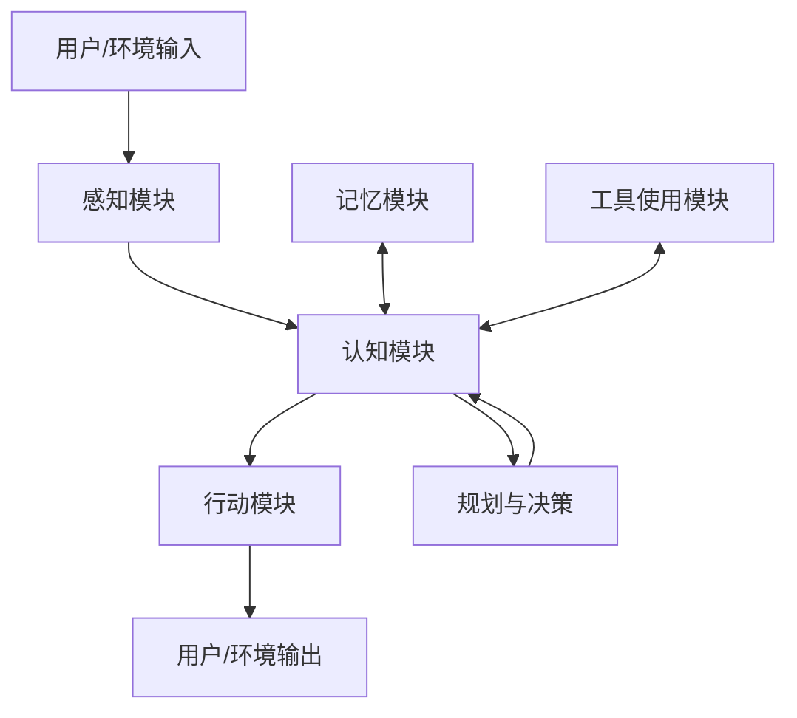

# 第5章 AI Agent工作流

本章将深入探讨AI Agent的工作流设计，这是构建高效、智能Agent的核心环节。我们将从Agent架构设计原则入手，详细讲解任务规划与分解、工具使用与API集成、多步骤推理与决策、Agent记忆机制设计等关键技术。通过本章学习，读者将了解如何设计灵活、可扩展的Agent架构，使Agent能够有效地规划任务、使用工具、进行推理决策，并维护上下文记忆，从而实现复杂任务的自主完成。

## 5.1 Agent架构设计原则

Agent架构是AI Agent系统的骨架，决定了Agent的能力边界和行为模式。本节将介绍Agent架构设计的核心原则和常见模式，帮助开发者构建结构合理、功能强大的Agent系统。

### 核心概念与基础架构

#### Agent的定义与特征

AI Agent是一个能够感知环境、做出决策并采取行动以实现特定目标的智能系统。与简单的模型或应用不同，Agent具有以下核心特征：

**自主性（Autonomy）**：
- 能够在没有直接人类干预的情况下运行
- 具有一定程度的自我控制和决策能力
- 可以根据环境变化调整行为

**目标导向（Goal-oriented）**：
- 有明确的目标或目的
- 行动是为了实现这些目标
- 能够评估行动的效果并调整策略

**交互能力（Interactivity）**：
- 与环境和用户进行双向交互
- 接收输入并产生有意义的输出
- 能够处理反馈并据此调整行为

**持续性（Persistence）**：
- 不仅仅是一次性的查询-响应系统
- 可以维护状态和上下文
- 能够进行长期运行和任务跟踪

**适应性（Adaptability）**：
- 能够学习和适应新情况
- 从经验中改进性能
- 处理不确定性和不完整信息

#### 基础架构组件

一个完整的AI Agent架构通常包含以下核心组件：

**感知模块（Perception）**：
- 接收和处理来自环境的输入
- 可能包括自然语言理解、图像识别等
- 将原始输入转换为Agent可理解的表示

**认知模块（Cognition）**：
- 处理信息并做出决策
- 包括推理、规划和问题解决
- 通常基于大型语言模型（LLM）或其他AI技术

**行动模块（Action）**：
- 执行决策并与环境交互
- 可能包括生成文本、调用API、控制设备等
- 将内部决策转化为外部可观察的行为

**记忆模块（Memory）**：
- 存储和检索信息
- 维护对话历史和上下文
- 可能包括短期和长期记忆机制

**工具使用模块（Tool Use）**：
- 识别何时需要使用工具
- 选择合适的工具并正确使用
- 解释工具输出并整合到决策中

**基础架构图**：



#### 架构设计考虑因素

在设计Agent架构时，需要考虑以下关键因素：

**功能需求**：
- Agent需要完成什么任务？
- 需要哪些核心能力？
- 用户期望什么样的交互体验？

**性能要求**：
- 响应时间要求
- 资源使用限制
- 可扩展性需求

**安全与隐私**：
- 数据处理和存储安全
- 用户隐私保护
- 防止滥用和恶意使用

**可扩展性**：
- 添加新功能的难易程度
- 支持多种工具和API
- 适应不同领域和任务

**可维护性**：
- 代码结构和组织
- 测试和调试便利性
- 文档和版本控制

### 常见Agent架构模式

随着AI Agent技术的发展，已经形成了几种常见的架构模式，每种模式都有其优势和适用场景。

#### ReAct架构

ReAct（Reasoning and Acting）架构结合了推理和行动，让Agent能够交替进行思考和执行操作。

**核心特点**：
- 交替的思考-行动循环
- 显式的推理过程
- 基于推理结果选择行动

**工作流程**：
1. 接收任务或查询
2. 进行推理（Reasoning）分析需要采取的步骤
3. 执行行动（Acting）如调用工具或API
4. 观察结果并进行新一轮推理
5. 重复直到任务完成

**示例代码**：
```python
class ReActAgent:
    """基于ReAct模式的Agent实现"""
    
    def __init__(self, llm, tools):
        self.llm = llm
        self.tools = {tool.name: tool for tool in tools}
        self.memory = []
    
    def run(self, task):
        """运行Agent完成任务"""
        # 初始化对话历史
        self.memory = [{"role": "user", "content": task}]
        
        # 最大步骤数（防止无限循环）
        max_steps = 10
        current_step = 0
        
        while current_step < max_steps:
            current_step += 1
            
            # 1. 思考阶段：分析任务并决定下一步行动
            reasoning, action = self._reason()
            
            # 如果决定任务完成，返回最终答案
            if action["tool"] == "FINISH":
                return action["input"]
            
            # 2. 行动阶段：执行选定的工具
            if action["tool"] in self.tools:
                tool = self.tools[action["tool"]]
                observation = tool.run(action["input"])
            else:
                observation = f"错误：未知工具 '{action['tool']}'"
            
            # 3. 记录推理、行动和观察结果
            self._update_memory(reasoning, action, observation)
        
        # 如果达到最大步骤数，生成最终回答
        return self._generate_final_answer()
    
    def _reason(self):
        """思考阶段：分析任务并决定下一步行动"""
        # 构建提示
        prompt = self._build_prompt()
        
        # 获取LLM响应
        response = self.llm(prompt)
        
        # 解析响应，提取推理和行动
        reasoning, action = self._parse_response(response)
        
        return reasoning, action
    
    def _build_prompt(self):
        """构建提示，包含任务、对话历史和可用工具"""
        # 构建对话历史
        history = ""
        for message in self.memory:
            if message["role"] == "user":
                history += f"User: {message['content']}\n"
            elif message["role"] == "assistant":
                if "reasoning" in message:
                    history += f"Assistant (thinking): {message['reasoning']}\n"
                if "action" in message:
                    tool = message['action']['tool']
                    tool_input = message['action']['input']
                    history += f"Assistant (action): 使用工具 {tool} 输入: {tool_input}\n"
                if "observation" in message:
                    history += f"Observation: {message['observation']}\n"
        
        # 构建工具描述
        tools_desc = ""
        for tool_name, tool in self.tools.items():
            tools_desc += f"- {tool_name}: {tool.description}\n"
        
        # 完整提示
        prompt = f"""你是一个基于ReAct（推理和行动）模式的AI助手。你需要通过思考和使用工具来完成用户的任务。

对话历史:
{history}

可用工具:
{tools_desc}
FINISH: 当任务完成时使用此工具，输入为最终答案

请按照以下格式回应:
思考: <你的推理过程，分析当前情况和需要采取的步骤>
行动: <工具名称>
行动输入: <工具输入>

如果任务已完成，使用FINISH工具并提供最终答案。

你的回应:"""
        
        return prompt
    
    def _parse_response(self, response):
        """解析LLM响应，提取推理和行动"""
        # 提取推理部分
        reasoning_match = re.search(r"思考:(.*?)(?=行动:|$)", response, re.DOTALL)
        reasoning = reasoning_match.group(1).strip() if reasoning_match else ""
        
        # 提取行动部分
        action_match = re.search(r"行动:(.*?)(?=行动输入:|$)", response, re.DOTALL)
        action_tool = action_match.group(1).strip() if action_match else "FINISH"
        
        # 提取行动输入
        input_match = re.search(r"行动输入:(.*?)$", response, re.DOTALL)
        action_input = input_match.group(1).strip() if input_match else ""
        
        # 构建行动字典
        action = {
            "tool": action_tool,
            "input": action_input
        }
        
        return reasoning, action
    
    def _update_memory(self, reasoning, action, observation):
        """更新对话历史"""
        self.memory.append({
            "role": "assistant",
            "reasoning": reasoning,
            "action": action,
            "observation": observation
        })
    
    def _generate_final_answer(self):
        """生成最终答案"""
        # 构建提示
        history = ""
        for message in self.memory:
            if message["role"] == "user":
                history += f"User: {message['content']}\n"
            elif message["role"] == "assistant":
                if "reasoning" in message:
                    history += f"Assistant (thinking): {message['reasoning']}\n"
                if "action" in message:
                    tool = message['action']['tool']
                    tool_input = message['action']['input']
                    history += f"Assistant (action): 使用工具 {tool} 输入: {tool_input}\n"
                if "observation" in message:
                    history += f"Observation: {message['observation']}\n"
        
        prompt = f"""基于以下对话历史，生成对用户原始任务的最终回答。

对话历史:
{history}

最终回答:"""
        
        # 获取LLM响应
        response = self.llm(prompt)
        
        return response
```

**适用场景**：
- 需要多步骤推理和工具使用的复杂任务
- 需要透明决策过程的应用
- 需要灵活调用外部工具的场景

#### 反射增强架构

反射增强架构（Reflection-Augmented）让Agent能够评估自己的输出和行动，并进行自我修正。

**核心特点**：
- 自我评估和反思能力
- 迭代改进输出
- 错误检测和修正

**工作流程**：
1. 生成初步响应或行动计划
2. 对生成的内容进行反思和评估
3. 基于反思结果进行修正
4. 重复直到达到质量标准

**示例代码**：
```python
class ReflectionAgent:
    """基于反思增强的Agent实现"""
    
    def __init__(self, llm, tools=None):
        self.llm = llm
        self.tools = tools or []
        self.memory = []
    
    def run(self, task):
        """运行Agent完成任务"""
        # 记录任务
        self.memory = [{"role": "user", "content": task}]
        
        # 1. 生成初步计划
        initial_plan = self._generate_plan(task)
        
        # 2. 反思和评估计划
        reflection = self._reflect_on_plan(initial_plan)
        
        # 3. 修正计划
        revised_plan = self._revise_plan(initial_plan, reflection)
        
        # 4. 执行计划
        result = self._execute_plan(revised_plan)
        
        # 5. 反思执行结果
        result_reflection = self._reflect_on_result(result, task)
        
        # 6. 生成最终答案
        final_answer = self._generate_final_answer(result, result_reflection)
        
        return final_answer
    
    def _generate_plan(self, task):
        """生成初步计划"""
        prompt = f"""为以下任务生成一个详细的执行计划:

任务: {task}

你的计划应该包括:
1. 任务分解：将任务分解为更小的子任务
2. 工具使用：确定每个步骤需要使用的工具
3. 执行顺序：明确步骤的先后顺序
4. 成功标准：如何判断任务完成

计划:"""
        
        plan = self.llm(prompt)
        self.memory.append({"role": "assistant", "content": plan, "type": "initial_plan"})
        
        return plan
    
    def _reflect_on_plan(self, plan):
        """反思和评估计划"""
        prompt = f"""请评估以下执行计划的质量和完整性:

计划:
{plan}

请从以下几个方面进行评估:
1. 完整性：计划是否涵盖了所有必要步骤？
2. 可行性：计划中的步骤是否可行？
3. 效率：是否有更高效的方法？
4. 潜在问题：可能遇到的障碍和挑战？
5. 改进建议：如何改进这个计划？

评估:"""
        
        reflection = self.llm(prompt)
        self.memory.append({"role": "assistant", "content": reflection, "type": "plan_reflection"})
        
        return reflection
    
    def _revise_plan(self, initial_plan, reflection):
        """基于反思修正计划"""
        prompt = f"""根据以下反思和评估，修改执行计划:

原始计划:
{initial_plan}

评估和反思:
{reflection}

请提供一个修订后的、更完善的计划:"""
        
        revised_plan = self.llm(prompt)
        self.memory.append({"role": "assistant", "content": revised_plan, "type": "revised_plan"})
        
        return revised_plan
    
    def _execute_plan(self, plan):
        """执行计划"""
        # 这里是简化实现，实际应用中需要解析计划并执行具体步骤
        # 可能涉及工具调用、多轮交互等
        
        # 模拟执行结果
        execution_result = f"计划执行结果：\n{plan}\n\n这里是执行过程中收集的信息和中间结果..."
        
        self.memory.append({"role": "system", "content": execution_result, "type": "execution_result"})
        
        return execution_result
    
    def _reflect_on_result(self, result, original_task):
        """反思执行结果"""
        prompt = f"""评估以下执行结果是否成功完成了原始任务:

原始任务: {original_task}

执行结果:
{result}

请评估:
1. 任务完成度：原始任务的目标是否达成？
2. 结果质量：执行结果的质量如何？
3. 遗漏之处：是否有任何遗漏或未解决的问题？
4. 额外发现：执行过程中的任何意外发现或见解？

评估:"""
        
        reflection = self.llm(prompt)
        self.memory.append({"role": "assistant", "content": reflection, "type": "result_reflection"})
        
        return reflection
    
    def _generate_final_answer(self, result, reflection):
        """生成最终答案"""
        prompt = f"""基于执行结果和反思，生成对原始任务的最终回答:

执行结果:
{result}

反思:
{reflection}

请提供一个全面、准确的最终回答，确保解决了原始任务的所有方面，并纳入了反思中的见解。

最终回答:"""
        
        final_answer = self.llm(prompt)
        self.memory.append({"role": "assistant", "content": final_answer, "type": "final_answer"})
        
        return final_answer
```

**适用场景**：
- 需要高质量输出的任务
- 复杂推理和问题解决
- 自我改进和学习系统

#### 工具增强架构

工具增强架构（Tool-Augmented）专注于有效地集成和使用外部工具，扩展Agent的能力范围。

**核心特点**：
- 丰富的工具集成
- 工具选择和使用策略
- 工具输出解释和整合

**工作流程**：
1. 分析任务，确定需要的工具
2. 选择合适的工具并准备输入
3. 调用工具并获取结果
4. 解释工具输出并整合到解决方案中

**示例代码**：
```python
class ToolAgent:
    """基于工具增强的Agent实现"""
    
    def __init__(self, llm, tools):
        self.llm = llm
        self.tools = {tool.name: tool for tool in tools}
        self.memory = []
    
    def run(self, task):
        """运行Agent完成任务"""
        # 记录任务
        self.memory = [{"role": "user", "content": task}]
        
        # 分析任务，确定需要的工具
        tool_selection = self._select_tools(task)
        
        # 执行工具调用
        tool_results = self._execute_tools(tool_selection)
        
        # 整合工具结果
        final_answer = self._integrate_results(task, tool_results)
        
        return final_answer
    
    def _select_tools(self, task):
        """分析任务并选择合适的工具"""
        # 构建工具描述
        tools_desc = ""
        for tool_name, tool in self.tools.items():
            tools_desc += f"- {tool_name}: {tool.description}\n"
        
        # 构建提示
        prompt = f"""分析以下任务，并选择完成任务所需的工具:

任务: {task}

可用工具:
{tools_desc}

对于每个选择的工具，请说明:
1. 为什么需要这个工具
2. 使用顺序
3. 需要提供给工具的输入

以JSON格式返回你的选择:
{{
  "selected_tools": [
    {{
      "tool": "工具名称",
      "reason": "选择原因",
      "input": "工具输入",
      "order": 1
    }},
    ...
  ]
}}"""
        
        response = self.llm(prompt)
        
        # 解析JSON响应
        try:
            import json
            tool_selection = json.loads(response)
        except:
            # 解析失败时使用备用方法
            tool_selection = self._fallback_tool_selection(response)
        
        self.memory.append({"role": "assistant", "content": response, "type": "tool_selection"})
        
        return tool_selection
    
    def _fallback_tool_selection(self, response):
        """当JSON解析失败时的备用解析方法"""
        # 简单的正则表达式匹配
        import re
        
        tools = []
        tool_matches = re.finditer(r'"tool":\s*"([^"]+)"', response)
        reason_matches = re.finditer(r'"reason":\s*"([^"]+)"', response)
        input_matches = re.finditer(r'"input":\s*"([^"]+)"', response)
        order_matches = re.finditer(r'"order":\s*(\d+)', response)
        
        # 将匹配结果转换为列表
        tool_names = [m.group(1) for m in tool_matches]
        reasons = [m.group(1) for m in reason_matches]
        inputs = [m.group(1) for m in input_matches]
        orders = [int(m.group(1)) for m in order_matches]
        
        # 组合结果
        for i in range(min(len(tool_names), len(reasons), len(inputs), len(orders))):
            tools.append({
                "tool": tool_names[i],
                "reason": reasons[i],
                "input": inputs[i],
                "order": orders[i]
            })
        
        # 按顺序排序
        tools.sort(key=lambda x: x["order"])
        
        return {"selected_tools": tools}
    
    def _execute_tools(self, tool_selection):
        """执行选定的工具"""
        results = []
        
        for tool_info in tool_selection.get("selected_tools", []):
            tool_name = tool_info.get("tool")
            tool_input = tool_info.get("input")
            
            if tool_name in self.tools:
                # 调用工具
                tool = self.tools[tool_name]
                try:
                    output = tool.run(tool_input)
                    status = "success"
                except Exception as e:
                    output = f"错误: {str(e)}"
                    status = "error"
            else:
                output = f"错误: 未知工具 '{tool_name}'"
                status = "error"
            
            # 记录结果
            result = {
                "tool": tool_name,
                "input": tool_input,
                "output": output,
                "status": status
            }
            
            results.append(result)
            self.memory.append({"role": "system", "content": output, "type": "tool_output", "tool": tool_name})
        
        return results
    
    def _integrate_results(self, task, tool_results):
        """整合工具结果生成最终答案"""
        # 构建工具结果描述
        results_desc = ""
        for i, result in enumerate(tool_results):
            results_desc += f"工具 {i+1}: {result['tool']}\n"
            results_desc += f"输入: {result['input']}\n"
            results_desc += f"输出: {result['output']}\n"
            results_desc += f"状态: {result['status']}\n\n"
        
        # 构建提示
        prompt = f"""基于以下工具执行结果，回答原始任务:

原始任务: {task}

工具执行结果:
{results_desc}

请提供一个全面的回答，整合所有工具的输出。解释工具结果如何帮助解决任务，并指出任何不确定性或限制。

最终回答:"""
        
        final_answer = self.llm(prompt)
        self.memory.append({"role": "assistant", "content": final_answer, "type": "final_answer"})
        
        return final_answer
```

**适用场景**：
- 需要访问外部系统和API的任务
- 数据处理和分析
- 需要特定领域工具的专业任务

#### 多智能体协作架构

多智能体协作架构（Multi-Agent Collaborative）涉及多个专业化Agent协同工作，共同完成复杂任务。

**核心特点**：
- 多个专业化Agent
- Agent间通信和协调
- 任务分配和结果整合

**工作流程**：
1. 分析任务并分配给专业Agent
2. 各Agent独立执行子任务
3. Agent间交流和协调
4. 整合各Agent的结果
5. 生成最终解决方案

**示例代码**：
```python
class MultiAgentSystem:
    """多智能体协作系统"""
    
    def __init__(self, llm, agents_config):
        self.llm = llm
        self.agents = self._initialize_agents(agents_config)
        self.coordinator = Coordinator(llm, self.agents)
        self.memory = []
    
    def _initialize_agents(self, agents_config):
        """初始化专业Agent"""
        agents = {}
        
        for agent_config in agents_config:
            agent_type = agent_config.get("type")
            agent_name = agent_config.get("name")
            agent_tools = agent_config.get("tools", [])
            
            if agent_type == "research":
                agents[agent_name] = ResearchAgent(self.llm, agent_tools)
            elif agent_type == "coding":
                agents[agent_name] = CodingAgent(self.llm, agent_tools)
            elif agent_type == "writing":
                agents[agent_name] = WritingAgent(self.llm, agent_tools)
            elif agent_type == "critic":
                agents[agent_name] = CriticAgent(self.llm)
            else:
                agents[agent_name] = GenericAgent(self.llm, agent_tools)
        
        return agents
    
    def run(self, task):
        """运行多智能体系统完成任务"""
        # 记录任务
        self.memory = [{"role": "user", "content": task}]
        
        # 1. 任务分析和分配
        task_plan = self.coordinator.create_task_plan(task)
        self.memory.append({"role": "system", "content": task_plan, "type": "task_plan"})
        
        # 2. 执行任务
        agent_results = self.coordinator.execute_task_plan(task_plan)
        
        for agent_name, result in agent_results.items():
            self.memory.append({
                "role": "agent",
                "agent": agent_name,
                "content": result,
                "type": "agent_result"
            })
        
        # 3. 结果整合
        final_answer = self.coordinator.integrate_results(task, agent_results)
        self.memory.append({"role": "assistant", "content": final_answer, "type": "final_answer"})
        
        return final_answer


class Coordinator:
    """多智能体系统的协调器"""
    
    def __init__(self, llm, agents):
        self.llm = llm
        self.agents = agents
    
    def create_task_plan(self, task):
        """创建任务计划，分配子任务给各Agent"""
        # 构建Agent描述
        agents_desc = ""
        for agent_name, agent in self.agents.items():
            agents_desc += f"- {agent_name}: {agent.description}\n"
        
        # 构建提示
        prompt = f"""作为多智能体系统的协调器，请为以下任务创建一个执行计划:

任务: {task}

可用智能体:
{agents_desc}

请创建一个详细的任务计划，包括:
1. 任务分解：将主任务分解为子任务
2. 智能体分配：为每个子任务分配最合适的智能体
3. 执行顺序：确定子任务的执行顺序（并行或串行）
4. 协作点：智能体需要协作的地方
5. 整合策略：如何整合各智能体的结果

以JSON格式返回任务计划:
{{
  "task_breakdown": [
    {{
      "subtask_id": "subtask1",
      "description": "子任务描述",
      "assigned_agent": "智能体名称",
      "dependencies": [],
      "expected_output": "期望输出描述"
    }},
    ...
  ],
  "execution_flow": ["subtask1", "subtask2", ...],
  "integration_strategy": "结果整合策略描述"
}}"""
        
        response = self.llm(prompt)
        
        # 解析JSON响应
        try:
            import json
            task_plan = json.loads(response)
        except:
            # 解析失败时使用备用方法
            task_plan = self._fallback_task_plan(response, task)
        
        return task_plan
    
    def _fallback_task_plan(self, response, task):
        """当JSON解析失败时的备用计划生成"""
        # 简单地为每个Agent分配任务
        task_breakdown = []
        
        for i, (agent_name, agent) in enumerate(self.agents.items()):
            subt = {
                "subtask_id": f"subtask{i+1}",
                "description": f"使用{agent_name}完成与'{task}'相关的任务",
                "assigned_agent": agent_name,
                "dependencies": [],
                "expected_output": "相关分析和结果"
            }
            task_breakdown.append(subt)
        
        # 设置简单的线性依赖关系
        for i in range(1, len(task_breakdown)):
            task_breakdown[i]["dependencies"] = [task_breakdown[i-1]["subtask_id"]]
        
        return {
            "task_breakdown": task_breakdown,
            "execution_flow": [t["subtask_id"] for t in task_breakdown],
            "integration_strategy": "按顺序整合所有智能体的输出，生成综合回答"
        }
    
    def execute_task_plan(self, task_plan):
        """执行任务计划"""
        results = {}
        completed_subtasks = set()
        
        # 获取执行顺序
        execution_flow = task_plan.get("execution_flow", [])
        if not execution_flow:
            # 如果没有指定执行顺序，按任务分解顺序执行
            execution_flow = [t["subtask_id"] for t in task_plan.get("task_breakdown", [])]
        
        # 按顺序执行子任务
        for subtask_id in execution_flow:
            # 查找子任务详情
            subtask = None
            for t in task_plan.get("task_breakdown", []):
                if t["subtask_id"] == subtask_id:
                    subtask = t
                    break
            
            if not subtask:
                continue
            
            # 检查依赖是否满足
            dependencies = subtask.get("dependencies", [])
            if not all(dep in completed_subtasks for dep in dependencies):
                # 依赖未满足，跳过此任务
                continue
            
            # 获取分配的Agent
            agent_name = subtask.get("assigned_agent")
            if agent_name not in self.agents:
                results[subtask_id] = f"错误: 未知智能体 '{agent_name}'"
                continue
            
            # 准备Agent输入
            agent_input = {
                "subtask": subtask.get("description"),
                "expected_output": subtask.get("expected_output"),
                "context": {
                    # 提供已完成子任务的结果作为上下文
                    dep: results.get(dep, "") for dep in dependencies
                }
            }
            
            # 执行Agent任务
            agent = self.agents[agent_name]
            result = agent.run(agent_input)
            
            # 记录结果
            results[subtask_id] = result
            completed_subtasks.add(subtask_id)
        
        return results
    
    def integrate_results(self, original_task, agent_results):
        """整合各Agent的结果"""
        # 构建结果描述
        results_desc = ""
        for subtask_id, result in agent_results.items():
            results_desc += f"子任务 {subtask_id} 结果:\n{result}\n\n"
        
        # 构建提示
        prompt = f"""作为多智能体系统的协调器，请整合以下各智能体的输出，生成对原始任务的最终回答:

原始任务: {original_task}

各智能体输出:
{results_desc}

请提供一个全面、连贯的最终回答，确保:
1. 整合所有相关信息
2. 解决任何冲突或不一致
3. 突出关键发现和见解
4. 直接回答原始任务

最终回答:"""
        
        final_answer = self.llm(prompt)
        
        return final_answer


class GenericAgent:
    """通用Agent基类"""
    
    def __init__(self, llm, tools=None):
        self.llm = llm
        self.tools = tools or []
        self.description = "通用智能体，可以处理各种基本任务"
    
    def run(self, input_data):
        """执行Agent任务"""
        subtask = input_data.get("subtask", "")
        context = input_data.get("context", {})
        
        # 构建上下文描述
        context_desc = ""
        for subtask_id, result in context.items():
            context_desc += f"子任务 {subtask_id} 结果:\n{result}\n\n"
        
        # 构建提示
        prompt = f"""执行以下任务:

任务: {subtask}

上下文信息:
{context_desc}

请提供详细、准确的回答。"""
        
        response = self.llm(prompt)
        
        return response


class ResearchAgent(GenericAgent):
    """研究Agent"""
    
    def __init__(self, llm, tools=None):
        super().__init__(llm, tools)
        self.description = "专门进行信息收集、分析和研究的智能体"
    
    def run(self, input_data):
        """执行研究任务"""
        subtask = input_data.get("subtask", "")
        context = input_data.get("context", {})
        
        # 构建上下文描述
        context_desc = ""
        for subtask_id, result in context.items():
            context_desc += f"子任务 {subtask_id} 结果:\n{result}\n\n"
        
        # 构建提示
        prompt = f"""作为研究专家，执行以下研究任务:

研究任务: {subtask}

上下文信息:
{context_desc}

请提供全面、深入的研究结果，包括:
1. 关键发现和见解
2. 数据和证据支持
3. 不同观点的分析
4. 研究局限性
5. 进一步研究方向

研究结果:"""
        
        response = self.llm(prompt)
        
        return response


class CodingAgent(GenericAgent):
    """编程Agent"""
    
    def __init__(self, llm, tools=None):
        super().__init__(llm, tools)
        self.description = "专门编写、分析和优化代码的智能体"
    
    def run(self, input_data):
        """执行编程任务"""
        subtask = input_data.get("subtask", "")
        context = input_data.get("context", {})
        
        # 构建上下文描述
        context_desc = ""
        for subtask_id, result in context.items():
            context_desc += f"子任务 {subtask_id} 结果:\n{result}\n\n"
        
        # 构建提示
        prompt = f"""作为编程专家，执行以下编程任务:

编程任务: {subtask}

上下文信息:
{context_desc}

请提供高质量的代码和详细说明，包括:
1. 代码实现
2. 函数和变量说明
3. 算法和设计选择解释
4. 使用示例
5. 潜在的优化和扩展

代码和说明:"""
        
        response = self.llm(prompt)
        
        return response


class WritingAgent(GenericAgent):
    """写作Agent"""
    
    def __init__(self, llm, tools=None):
        super().__init__(llm, tools)
        self.description = "专门创作、编辑和优化文本内容的智能体"
    
    def run(self, input_data):
        """执行写作任务"""
        subtask = input_data.get("subtask", "")
        context = input_data.get("context", {})
        
        # 构建上下文描述
        context_desc = ""
        for subtask_id, result in context.items():
            context_desc += f"子任务 {subtask_id} 结果:\n{result}\n\n"
        
        # 构建提示
        prompt = f"""作为写作专家，执行以下写作任务:

写作任务: {subtask}

上下文信息:
{context_desc}

请提供高质量的文本内容，确保:
1. 清晰、流畅的表达
2. 结构合理、逻辑连贯
3. 语言生动、引人入胜
4. 适合目标受众
5. 无语法和拼写错误

文本内容:"""
        
        response = self.llm(prompt)
        
        return response


class CriticAgent(GenericAgent):
    """评论Agent"""
    
    def __init__(self, llm):
        super().__init__(llm)
        self.description = "专门评估、审查和提供反馈的智能体"
    
    def run(self, input_data):
        """执行评论任务"""
        subtask = input_data.get("subtask", "")
        context = input_data.get("context", {})
        
        # 构建上下文描述
        context_desc = ""
        for subtask_id, result in context.items():
            context_desc += f"子任务 {subtask_id} 结果:\n{result}\n\n"
        
        # 构建提示
        prompt = f"""作为评论专家，执行以下评估任务:

评估任务: {subtask}

需要评估的内容:
{context_desc}

请提供全面、客观的评估，包括:
1. 内容质量和准确性
2. 优点和亮点
3. 不足和改进空间
4. 具体的改进建议
5. 总体评价

评估结果:"""
        
        response = self.llm(prompt)
        
        return response
```

**适用场景**：
- 复杂的多领域任务
- 需要多种专业知识的项目
- 大规模或长期运行的任务

### 模块化与可扩展设计

为了构建灵活、可维护的Agent系统，模块化和可扩展设计至关重要。

#### 模块化设计原则

**关注点分离**：
- 将不同功能划分为独立模块
- 每个模块专注于特定责任
- 减少模块间的耦合

**接口一致性**：
- 定义清晰的模块接口
- 标准化输入和输出格式
- 确保模块可互换性

**可配置性**：
- 通过配置而非硬编码控制行为
- 支持运行时参数调整
- 便于不同环境和需求的适配

**示例代码**：
```python
class ModularAgent:
    """模块化Agent架构"""
    
    def __init__(self, config=None):
        """
        初始化模块化Agent
        
        参数:
        config - Agent配置字典
        """
        self.config = config or {}
        
        # 初始化模块
        self.modules = {}
        self._initialize_modules()
    
    def _initialize_modules(self):
        """初始化各功能模块"""
        # 加载语言模型
        llm_config = self.config.get("llm", {})
        self.modules["llm"] = self._load_llm(llm_config)
        
        # 加载工具
        tools_config = self.config.get("tools", [])
        self.modules["tools"] = self._load_tools(tools_config)
        
        # 加载记忆模块
        memory_config = self.config.get("memory", {})
        self.modules["memory"] = self._load_memory(memory_config)
        
        # 加载规划器
        planner_config = self.config.get("planner", {})
        self.modules["planner"] = self._load_planner(planner_config)
        
        # 加载执行器
        executor_config = self.config.get("executor", {})
        self.modules["executor"] = self._load_executor(executor_config)
    
    def _load_llm(self, config):
        """加载语言模型"""
        llm_type = config.get("type", "openai")
        
        if llm_type == "openai":
            from langchain.llms import OpenAI
            return OpenAI(
                model_name=config.get("model", "gpt-3.5-turbo"),
                temperature=config.get("temperature", 0.7)
            )
        elif llm_type == "anthropic":
            from langchain.llms import Anthropic
            return Anthropic(
                model=config.get("model", "claude-2"),
                temperature=config.get("temperature", 0.7)
            )
        else:
            # 默认返回OpenAI
            from langchain.llms import OpenAI
            return OpenAI()
    
    def _load_tools(self, config):
        """加载工具集"""
        tools = []
        
        for tool_config in config:
            tool_type = tool_config.get("type")
            
            if tool_type == "search":
                from langchain.tools import DuckDuckGoSearchTool
                tools.append(DuckDuckGoSearchTool())
            elif tool_type == "calculator":
                from langchain.tools import Calculator
                tools.append(Calculator())
            elif tool_type == "weather":
                from custom_tools import WeatherTool
                api_key = tool_config.get("api_key", "")
                tools.append(WeatherTool(api_key=api_key))
            # 添加更多工具类型...
        
        return tools
    
    def _load_memory(self, config):
        """加载记忆模块"""
        memory_type = config.get("type", "buffer")
        
        if memory_type == "buffer":
            from langchain.memory import ConversationBufferMemory
            return ConversationBufferMemory()
        elif memory_type == "buffer_window":
            from langchain.memory import ConversationBufferWindowMemory
            return ConversationBufferWindowMemory(
                k=config.get("window_size", 5)
            )
        elif memory_type == "summary":
            from langchain.memory import ConversationSummaryMemory
            return ConversationSummaryMemory(
                llm=self.modules["llm"]
            )
        else:
            # 默认返回简单缓冲记忆
            from langchain.memory import ConversationBufferMemory
            return ConversationBufferMemory()
    
    def _load_planner(self, config):
        """加载规划器模块"""
        planner_type = config.get("type", "simple")
        
        if planner_type == "simple":
            from planners import SimplePlanner
            return SimplePlanner(
                llm=self.modules["llm"]
            )
        elif planner_type == "hierarchical":
            from planners import HierarchicalPlanner
            return HierarchicalPlanner(
                llm=self.modules["llm"],
                max_depth=config.get("max_depth", 3)
            )
        else:
            # 默认返回简单规划器
            from planners import SimplePlanner
            return SimplePlanner(
                llm=self.modules["llm"]
            )
    
    def _load_executor(self, config):
        """加载执行器模块"""
        executor_type = config.get("type", "sequential")
        
        if executor_type == "sequential":
            from executors import SequentialExecutor
            return SequentialExecutor(
                llm=self.modules["llm"],
                tools=self.modules["tools"]
            )
        elif executor_type == "parallel":
            from executors import ParallelExecutor
            return ParallelExecutor(
                llm=self.modules["llm"],
                tools=self.modules["tools"],
                max_workers=config.get("max_workers", 4)
            )
        else:
            # 默认返回顺序执行器
            from executors import SequentialExecutor
            return SequentialExecutor(
                llm=self.modules["llm"],
                tools=self.modules["tools"]
            )
    
    def run(self, task):
        """运行Agent完成任务"""
        # 1. 记录任务到记忆
        memory = self.modules["memory"]
        memory.add_user_message(task)
        
        # 2. 使用规划器创建计划
        planner = self.modules["planner"]
        plan = planner.create_plan(task, memory)
        
        # 3. 使用执行器执行计划
        executor = self.modules["executor"]
        result = executor.execute_plan(plan, memory)
        
        # 4. 记录结果到记忆
        memory.add_ai_message(result)
        
        return result
    
    def add_module(self, module_name, module_instance):
        """添加或替换模块"""
        self.modules[module_name] = module_instance
        return self
    
    def get_module(self, module_name):
        """获取模块实例"""
        return self.modules.get(module_name)
```

#### 插件系统设计

插件系统允许在不修改核心代码的情况下扩展Agent功能：

**插件接口定义**：
- 标准化插件接口
- 生命周期管理（加载、初始化、卸载）
- 事件和钩子机制

**插件发现与加载**：
- 动态发现和加载插件
- 插件依赖管理
- 版本兼容性检查

**插件通信机制**：
- 插件间通信接口
- 事件发布-订阅模式
- 共享状态管理

**示例代码**：
```python
class PluginInterface:
    """Agent插件接口"""
    
    def __init__(self):
        self.name = self.__class__.__name__
        self.version = "1.0.0"
        self.description = "基础插件接口"
        self.agent = None
    
    def initialize(self, agent):
        """初始化插件"""
        self.agent = agent
        return True
    
    def on_message(self, message):
        """处理消息"""
        pass
    
    def on_plan_created(self, plan):
        """计划创建后的钩子"""
        return plan
    
    def on_action_executed(self, action, result):
        """动作执行后的钩子"""
        return result
    
    def on_response_generated(self, response):
        """响应生成后的钩子"""
        return response
    
    def shutdown(self):
        """关闭插件"""
        pass


class PluginManager:
    """Agent插件管理器"""
    
    def __init__(self, agent):
        self.agent = agent
        self.plugins = {}
        self.hooks = {
            "on_message": [],
            "on_plan_created": [],
            "on_action_executed": [],
            "on_response_generated": []
        }
    
    def discover_plugins(self, plugin_dir="plugins"):
        """发现并加载插件目录中的插件"""
        import os
        import importlib.util
        
        # 确保插件目录存在
        if not os.path.exists(plugin_dir):
            os.makedirs(plugin_dir)
        
        # 查找所有Python文件
        for filename in os.listdir(plugin_dir):
            if filename.endswith(".py") and not filename.startswith("_"):
                plugin_path = os.path.join(plugin_dir, filename)
                
                try:
                    # 动态加载模块
                    module_name = filename[:-3]  # 移除.py后缀
                    spec = importlib.util.spec_from_file_location(module_name, plugin_path)
                    module = importlib.util.module_from_spec(spec)
                    spec.loader.exec_module(module)
                    
                    # 查找模块中的插件类
                    for attr_name in dir(module):
                        attr = getattr(module, attr_name)
                        if (isinstance(attr, type) and 
                            issubclass(attr, PluginInterface) and 
                            attr is not PluginInterface):
                            # 创建插件实例
                            plugin = attr()
                            self.register_plugin(plugin)
                
                except Exception as e:
                    print(f"加载插件 {filename} 时出错: {str(e)}")
    
    def register_plugin(self, plugin):
        """注册插件"""
        # 检查是否已存在同名插件
        if plugin.name in self.plugins:
            print(f"警告: 插件 {plugin.name} 已存在，将被覆盖")
        
        # 初始化插件
        success = plugin.initialize(self.agent)
        
        if success:
            # 注册插件
            self.plugins[plugin.name] = plugin
            
            # 注册钩子
            for hook_name in self.hooks:
                if hasattr(plugin, hook_name) and callable(getattr(plugin, hook_name)):
                    self.hooks[hook_name].append(plugin)
            
            print(f"插件 {plugin.name} v{plugin.version} 已注册")
            return True
        else:
            print(f"插件 {plugin.name} 初始化失败")
            return False
    
    def unregister_plugin(self, plugin_name):
        """注销插件"""
        if plugin_name not in self.plugins:
            print(f"插件 {plugin_name} 不存在")
            return False
        
        plugin = self.plugins[plugin_name]
        
        # 从钩子中移除
        for hook_name in self.hooks:
            if plugin in self.hooks[hook_name]:
                self.hooks[hook_name].remove(plugin)
        
        # 关闭插件
        plugin.shutdown()
        
        # 移除插件
        del self.plugins[plugin_name]
        
        print(f"插件 {plugin_name} 已注销")
        return True
    
    def execute_hook(self, hook_name, *args, **kwargs):
        """执行指定钩子"""
        result = args[0] if args else None
        
        for plugin in self.hooks.get(hook_name, []):
            try:
                hook_method = getattr(plugin, hook_name)
                result = hook_method(*args, **kwargs)
            except Exception as e:
                print(f"执行插件 {plugin.name} 的 {hook_name} 钩子时出错: {str(e)}")
        
        return result
    
    def get_plugin(self, plugin_name):
        """获取插件实例"""
        return self.plugins.get(plugin_name)
    
    def get_all_plugins(self):
        """获取所有插件"""
        return self.plugins.copy()
    
    def shutdown_all(self):
        """关闭所有插件"""
        for plugin_name in list(self.plugins.keys()):
            self.unregister_plugin(plugin_name)


# 示例插件实现
class LoggingPlugin(PluginInterface):
    """日志记录插件"""
    
    def __init__(self):
        super().__init__()
        self.name = "LoggingPlugin"
        self.version = "1.0.0"
        self.description = "记录Agent活动的插件"
        self.log_file = "agent_activity.log"
    
    def initialize(self, agent):
        """初始化插件"""
        self.agent = agent
        
        # 创建或清空日志文件
        with open(self.log_file, "w") as f:
            f.write(f"=== Agent活动日志 ===\n")
            f.write(f"开始时间: {datetime.now().strftime('%Y-%m-%d %H:%M:%S')}\n\n")
        
        return True
    
    def on_message(self, message):
        """记录消息"""
        with open(self.log_file, "a") as f:
            f.write(f"[{datetime.now().strftime('%H:%M:%S')}] 消息: {message}\n")
    
    def on_plan_created(self, plan):
        """记录计划"""
        with open(self.log_file, "a") as f:
            f.write(f"[{datetime.now().strftime('%H:%M:%S')}] 计划创建:\n")
            f.write(f"{plan}\n")
        
        return plan
    
    def on_action_executed(self, action, result):
        """记录动作执行"""
        with open(self.log_file, "a") as f:
            f.write(f"[{datetime.now().strftime('%H:%M:%S')}] 执行动作: {action}\n")
            f.write(f"结果: {result}\n")
        
        return result
    
    def shutdown(self):
        """关闭插件"""
        with open(self.log_file, "a") as f:
            f.write(f"\n结束时间: {datetime.now().strftime('%Y-%m-%d %H:%M:%S')}\n")
            f.write("=== 日志结束 ===\n")


class SecurityPlugin(PluginInterface):
    """安全检查插件"""
    
    def __init__(self):
        super().__init__()
        self.name = "SecurityPlugin"
        self.version = "1.0.0"
        self.description = "执行安全检查的插件"
        self.blocked_keywords = ["rm -rf", "format", "delete all", "sudo"]
    
    def on_message(self, message):
        """检查消息安全性"""
        for keyword in self.blocked_keywords:
            if keyword.lower() in message.lower():
                print(f"安全警告: 消息包含潜在危险关键词 '{keyword}'")
    
    def on_action_executed(self, action, result):
        """检查动作安全性"""
        action_str = str(action)
        
        for keyword in self.blocked_keywords:
            if keyword.lower() in action_str.lower():
                print(f"安全警告: 动作包含潜在危险关键词 '{keyword}'")
                return "该操作因安全原因被阻止"
        
        return result
```

#### 配置驱动设计

配置驱动设计允许通过配置文件而非代码更改来调整Agent行为：

**配置文件格式**：
- 使用标准格式（JSON、YAML等）
- 层次化配置结构
- 支持环境变量和引用

**配置验证与默认值**：
- 配置模式验证
- 合理的默认值设置
- 配置错误处理

**动态配置更新**：
- 运行时配置更改
- 配置热重载
- 配置变更通知

**示例代码**：
```python
import yaml
import json
import os
import jsonschema

class ConfigManager:
    """Agent配置管理器"""
    
    def __init__(self, config_path=None, schema_path=None):
        """
        初始化配置管理器
        
        参数:
        config_path - 配置文件路径
        schema_path - 配置模式文件路径
        """
        self.config_path = config_path
        self.schema_path = schema_path
        self.config = {}
        self.schema = {}
        self.listeners = []
        
        # 加载默认配置
        self._load_default_config()
        
        # 加载配置模式
        if schema_path and os.path.exists(schema_path):
            self._load_schema()
        
        # 加载用户配置
        if config_path and os.path.exists(config_path):
            self._load_config()
    
    def _load_default_config(self):
        """加载默认配置"""
        self.config = {
            "agent": {
                "name": "DefaultAgent",
                "description": "默认Agent配置"
            },
            "llm": {
                "type": "openai",
                "model": "gpt-3.5-turbo",
                "temperature": 0.7
            },
            "memory": {
                "type": "buffer",
                "max_tokens": 2000
            },
            "tools": [],
            "plugins": []
        }
    
    def _load_schema(self):
        """加载配置模式"""
        try:
            with open(self.schema_path, 'r', encoding='utf-8') as f:
                if self.schema_path.endswith('.yaml') or self.schema_path.endswith('.yml'):
                    self.schema = yaml.safe_load(f)
                else:
                    self.schema = json.load(f)
        except Exception as e:
            print(f"加载配置模式失败: {str(e)}")
    
    def _load_config(self):
        """加载用户配置"""
        try:
            with open(self.config_path, 'r', encoding='utf-8') as f:
                if self.config_path.endswith('.yaml') or self.config_path.endswith('.yml'):
                    user_config = yaml.safe_load(f)
                else:
                    user_config = json.load(f)
                
                # 处理环境变量
                user_config = self._process_env_vars(user_config)
                
                # 验证配置
                if self.schema:
                    self._validate_config(user_config)
                
                # 合并配置
                self._merge_config(user_config)
                
        except Exception as e:
            print(f"加载配置失败: {str(e)}")
    
    def _process_env_vars(self, config):
        """处理配置中的环境变量引用"""
        if isinstance(config, dict):
            return {k: self._process_env_vars(v) for k, v in config.items()}
        elif isinstance(config, list):
            return [self._process_env_vars(item) for item in config]
        elif isinstance(config, str) and config.startswith('${') and config.endswith('}'):
            # 提取环境变量名
            env_var = config[2:-1]
            # 获取环境变量值，如果不存在则返回原字符串
            return os.environ.get(env_var, config)
        else:
            return config
    
    def _validate_config(self, config):
        """验证配置是否符合模式"""
        try:
            jsonschema.validate(instance=config, schema=self.schema)
        except jsonschema.exceptions.ValidationError as e:
            print(f"配置验证失败: {str(e)}")
            raise
    
    def _merge_config(self, user_config):
        """合并用户配置和默认配置"""
        def deep_merge(source, destination):
            for key, value in source.items():
                if key in destination:
                    if isinstance(value, dict) and isinstance(destination[key], dict):
                        deep_merge(value, destination[key])
                    else:
                        destination[key] = value
                else:
                    destination[key] = value
        
        deep_merge(user_config, self.config)
        
        # 通知配置变更
        self._notify_listeners()
    
    def get(self, key_path, default=None):
        """
        获取配置值
        
        参数:
        key_path - 点分隔的配置路径，如 "llm.model"
        default - 如果配置不存在，返回的默认值
        """
        keys = key_path.split('.')
        value = self.config
        
        for key in keys:
            if isinstance(value, dict) and key in value:
                value = value[key]
            else:
                return default
        
        return value
    
    def set(self, key_path, value):
        """
        设置配置值
        
        参数:
        key_path - 点分隔的配置路径，如 "llm.model"
        value - 要设置的值
        """
        keys = key_path.split('.')
        config = self.config
        
        # 导航到最后一个键的父对象
        for key in keys[:-1]:
            if key not in config:
                config[key] = {}
            config = config[key]
        
        # 设置值
        config[keys[-1]] = value
        
        # 通知配置变更
        self._notify_listeners()
        
        return self
    
    def save(self, config_path=None):
        """
        保存配置到文件
        
        参数:
        config_path - 保存路径，如果为None则使用初始化时的路径
        """
        save_path = config_path or self.config_path
        
        if not save_path:
            raise ValueError("未指定配置保存路径")
        
        try:
            with open(save_path, 'w', encoding='utf-8') as f:
                if save_path.endswith('.yaml') or save_path.endswith('.yml'):
                    yaml.dump(self.config, f, default_flow_style=False)
                else:
                    json.dump(self.config, f, indent=2)
            
            return True
        except Exception as e:
            print(f"保存配置失败: {str(e)}")
            return False
    
    def add_listener(self, listener):
        """
        添加配置变更监听器
        
        参数:
        listener - 配置变更时调用的函数
        """
        if callable(listener) and listener not in self.listeners:
            self.listeners.append(listener)
    
    def remove_listener(self, listener):
        """
        移除配置变更监听器
        
        参数:
        listener - 要移除的监听器函数
        """
        if listener in self.listeners:
            self.listeners.remove(listener)
    
    def _notify_listeners(self):
        """通知所有配置变更监听器"""
        for listener in self.listeners:
            try:
                listener(self.config)
            except Exception as e:
                print(f"通知配置监听器时出错: {str(e)}")
    
    def reload(self):
        """重新加载配置文件"""
        if self.config_path and os.path.exists(self.config_path):
            # 保存当前配置的副本
            old_config = self.config.copy()
            
            # 重新加载默认配置
            self._load_default_config()
            
            # 加载用户配置
            self._load_config()
            
            # 检查配置是否有变化
            if old_config != self.config:
                self._notify_listeners()
            
            return True
        
        return False


# 示例配置模式
CONFIG_SCHEMA = {
    "type": "object",
    "properties": {
        "agent": {
            "type": "object",
            "properties": {
                "name": {"type": "string"},
                "description": {"type": "string"}
            },
            "required": ["name"]
        },
        "llm": {
            "type": "object",
            "properties": {
                "type": {"type": "string", "enum": ["openai", "anthropic", "local"]},
                "model": {"type": "string"},
                "temperature": {"type": "number", "minimum": 0, "maximum": 1}
            },
            "required": ["type", "model"]
        },
        "memory": {
            "type": "object",
            "properties": {
                "type": {"type": "string", "enum": ["buffer", "buffer_window", "summary"]},
                "max_tokens": {"type": "integer", "minimum": 0}
            }
        },
        "tools": {
            "type": "array",
            "items": {
                "type": "object",
                "properties": {
                    "type": {"type": "string"},
                    "name": {"type": "string"},
                    "description": {"type": "string"},
                    "api_key": {"type": "string"}
                },
                "required": ["type"]
            }
        },
        "plugins": {
            "type": "array",
            "items": {
                "type": "object",
                "properties": {
                    "name": {"type": "string"},
                    "enabled": {"type": "boolean"},
                    "config": {"type": "object"}
                },
                "required": ["name", "enabled"]
            }
        }
    },
    "required": ["agent", "llm"]
}

# 示例YAML配置文件
EXAMPLE_CONFIG = """
agent:
  name: MyAssistant
  description: 个人助手Agent

llm:
  type: openai
  model: gpt-4
  temperature: 0.7
  api_key: ${OPENAI_API_KEY}

memory:
  type: buffer_window
  max_tokens: 4000
  window_size: 10

tools:
  - type: search
    name: web_search
    description: 搜索网络信息
  
  - type: calculator
    name: math_tool
    description: 执行数学计算
  
  - type: weather
    name: weather_tool
    description: 获取天气信息
    api_key: ${WEATHER_API_KEY}

plugins:
  - name: LoggingPlugin
    enabled: true
    config:
      log_file: agent_activity.log
  
  - name: SecurityPlugin
    enabled: true
    config:
      blocked_keywords:
        - rm -rf
        - format
        - delete all
"""
```

### 安全与伦理设计

在设计Agent架构时，安全和伦理考虑至关重要，尤其是对于具有自主性的系统。

#### 安全防护机制

**输入验证与过滤**：
- 检查和净化用户输入
- 防止注入攻击
- 输入长度和复杂度限制

**行动限制与沙箱**：
- 限制Agent可执行的操作
- 工具使用权限控制
- 敏感操作的确认机制

**监控与审计**：
- 记录Agent活动和决策
- 异常行为检测
- 性能和安全指标跟踪

**示例代码**：
```python
class SecurityManager:
    """Agent安全管理器"""
    
    def __init__(self, config=None):
        """
        初始化安全管理器
        
        参数:
        config - 安全配置
        """
        self.config = config or {}
        
        # 初始化安全规则
        self.input_filters = self._load_input_filters()
        self.action_restrictions = self._load_action_restrictions()
        self.sensitive_patterns = self._load_sensitive_patterns()
        
        # 初始化审计日志
        self.audit_log = []
        self.max_log_entries = self.config.get("max_log_entries", 1000)
    
    def _load_input_filters(self):
        """加载输入过滤规则"""
        default_filters = [
            r'(?i)(?:rm|remove|del|delete)(?:\s+-rf|\s+-r|\s+-f|\s+\/\w+)',  # 危险的删除命令
            r'(?i)(?:format|fdisk)(?:\s+\/\w+)',  # 格式化命令
            r'(?i)(?:sudo|su)(?:\s+.*)',  # 提权命令
            r'(?i)(?:wget|curl)(?:\s+.*\s+-O\s+.*)',  # 下载并覆盖文件
            r'(?i)(?:eval|exec|system)(?:\s*\(.*\))',  # 代码执行函数
        ]
        
        return self.config.get("input_filters", default_filters)
    
    def _load_action_restrictions(self):
        """加载操作限制规则"""
        default_restrictions = {
            "file_operations": {
                "allowed_directories": ["/tmp", "./data"],
                "max_file_size": 10 * 1024 * 1024,  # 10MB
                "allowed_extensions": [".txt", ".json", ".csv", ".md"]
            },
            "network_operations": {
                "allowed_domains": ["api.openai.com", "api.github.com"],
                "blocked_ports": [22, 23, 25, 3306],
                "max_requests_per_minute": 60
            },
            "system_operations": {
                "allowed_commands": ["echo", "ls", "cat", "grep"],
                "max_cpu_percent": 50,
                "max_memory_percent": 50
            }
        }
        
        return self.config.get("action_restrictions", default_restrictions)
    
    def _load_sensitive_patterns(self):
        """加载敏感信息模式"""
        default_patterns = [
            r'\b(?:\d[ -]*?){13,16}\b',  # 信用卡号
            r'\b[A-Za-z0-9._%+-]+@[A-Za-z0-9.-]+\.[A-Z|a-z]{2,}\b',  # 电子邮件
            r'\b\d{3}[-.]?\d{3}[-.]?\d{4}\b',  # 美国电话号码
            r'\b\d{3}[-.]?\d{2}[-.]?\d{4}\b',  # 社会安全号码
            r'(?i)(?:api[_-]?key|secret[_-]?key|password|token)["\']?\s*(?::|=|:=|\+=)\s*["\']?[A-Za-z0-9_\-\.]{10,}'  # API密钥和密码
        ]
        
        return self.config.get("sensitive_patterns", default_patterns)
    
    def validate_input(self, user_input):
        """
        验证用户输入
        
        返回:
        (is_safe, reason) - 输入是否安全及原因
        """
        # 检查输入长度
        max_length = self.config.get("max_input_length", 4096)
        if len(user_input) > max_length:
            return False, f"输入超过最大长度限制 ({max_length} 字符)"
        
        # 检查危险模式
        import re
        for pattern in self.input_filters:
            if re.search(pattern, user_input):
                return False, f"输入包含潜在危险模式: {pattern}"
        
        # 检查敏感信息
        for pattern in self.sensitive_patterns:
            matches = re.finditer(pattern, user_input)
            for match in matches:
                # 记录敏感信息检测（不记录实际内容）
                self.log_security_event("sensitive_info_detected", {
                    "pattern_type": pattern,
                    "position": match.span()
                })
                
                # 对于敏感信息，我们可能允许输入但会记录警告
                # 或者可以选择屏蔽敏感信息
        
        return True, "输入验证通过"
    
    def validate_action(self, action_type, action_params):
        """
        验证Agent行动
        
        参数:
        action_type - 行动类型（如file_operation, network_request等）
        action_params - 行动参数
        
        返回:
        (is_allowed, reason) - 行动是否允许及原因
        """
        # 检查行动类型是否受限
        if action_type not in self.action_restrictions:
            return False, f"未知的行动类型: {action_type}"
        
        restrictions = self.action_restrictions[action_type]
        
        # 根据行动类型执行特定验证
        if action_type == "file_operations":
            return self._validate_file_operation(action_params, restrictions)
        elif action_type == "network_operations":
            return self._validate_network_operation(action_params, restrictions)
        elif action_type == "system_operations":
            return self._validate_system_operation(action_params, restrictions)
        else:
            # 默认验证
            return True, "行动验证通过"
    
    def _validate_file_operation(self, params, restrictions):
        """验证文件操作"""
        operation = params.get("operation")
        path = params.get("path", "")
        
        # 检查路径是否在允许的目录中
        allowed_dirs = restrictions.get("allowed_directories", [])
        if not any(path.startswith(dir) for dir in allowed_dirs):
            return False, f"路径不在允许的目录中: {path}"
        
        # 检查文件扩展名
        if operation in ["write", "create", "append"]:
            import os
            ext = os.path.splitext(path)[1].lower()
            allowed_exts = restrictions.get("allowed_extensions", [])
            if ext not in allowed_exts:
                return False, f"不允许的文件扩展名: {ext}"
            
            # 检查文件大小（如果提供）
            content = params.get("content", "")
            max_size = restrictions.get("max_file_size", float('inf'))
            if len(content) > max_size:
                return False, f"文件大小超过限制: {len(content)} > {max_size}"
        
        return True, "文件操作验证通过"
    
    def _validate_network_operation(self, params, restrictions):
        """验证网络操作"""
        url = params.get("url", "")
        method = params.get("method", "GET")
        
        # 检查域名是否允许
        import re
        from urllib.parse import urlparse
        
        parsed_url = urlparse(url)
        domain = parsed_url.netloc
        
        allowed_domains = restrictions.get("allowed_domains", [])
        if allowed_domains and not any(domain.endswith(d) for d in allowed_domains):
            return False, f"不允许的域名: {domain}"
        
        # 检查端口
        port = parsed_url.port or (443 if parsed_url.scheme == 'https' else 80)
        blocked_ports = restrictions.get("blocked_ports", [])
        if port in blocked_ports:
            return False, f"不允许的端口: {port}"
        
        # 检查请求频率（需要额外的请求计数器）
        # 这里简化处理，实际实现需要请求计数和时间窗口
        
        return True, "网络操作验证通过"
    
    def _validate_system_operation(self, params, restrictions):
        """验证系统操作"""
        command = params.get("command", "")
        
        # 提取命令名称（第一个空格前的部分）
        cmd_name = command.split()[0] if command else ""
        
        # 检查命令是否在允许列表中
        allowed_commands = restrictions.get("allowed_commands", [])
        if cmd_name not in allowed_commands:
            return False, f"不允许的命令: {cmd_name}"
        
        # 可以添加更多系统资源使用检查
        
        return True, "系统操作验证通过"
    
    def log_security_event(self, event_type, event_data):
        """记录安全事件"""
        event = {
            "timestamp": time.time(),
            "event_type": event_type,
            "data": event_data
        }
        
        # 添加到审计日志
        self.audit_log.append(event)
        
        # 如果超出最大日志条目数，移除最旧的条目
        if len(self.audit_log) > self.max_log_entries:
            self.audit_log = self.audit_log[-self.max_log_entries:]
        
        # 对于严重事件，可以添加实时警报
        if event_type in ["unauthorized_action", "attack_detected"]:
            self._trigger_alert(event)
    
    def _trigger_alert(self, event):
        """触发安全警报"""
        # 这里可以实现警报机制，如发送电子邮件、推送通知等
        print(f"安全警报: {event['event_type']}")
        print(f"详情: {event['data']}")
    
    def get_audit_log(self, filters=None):
        """获取审计日志，可选过滤条件"""
        if not filters:
            return self.audit_log
        
        # 应用过滤器
        filtered_log = self.audit_log
        
        if "event_type" in filters:
            filtered_log = [e for e in filtered_log if e["event_type"] == filters["event_type"]]
        
        if "start_time" in filters:
            filtered_log = [e for e in filtered_log if e["timestamp"] >= filters["start_time"]]
        
        if "end_time" in filters:
            filtered_log = [e for e in filtered_log if e["timestamp"] <= filters["end_time"]]
        
        return filtered_log
```

#### 伦理准则实现

**价值观对齐**：
- 明确的伦理准则和价值观
- 偏见检测和缓解
- 公平性和包容性考虑

**透明度与可解释性**：
- 决策过程的透明度
- 行动理由的可解释性
- 用户可理解的输出

**用户控制与同意**：
- 明确的用户权限边界
- 敏感操作的用户确认
- 用户偏好的尊重

**示例代码**：
```python
class EthicsManager:
    """Agent伦理管理器"""
    
    def __init__(self, config=None):
        """
        初始化伦理管理器
        
        参数:
        config - 伦理配置
        """
        self.config = config or {}
        
        # 加载伦理准则
        self.ethical_guidelines = self._load_ethical_guidelines()
        self.bias_patterns = self._load_bias_patterns()
        self.sensitive_topics = self._load_sensitive_topics()
        
        # 初始化伦理评估日志
        self.assessment_log = []
    
    def _load_ethical_guidelines(self):
        """加载伦理准则"""
        default_guidelines = {
            "respect": "尊重用户的自主权和隐私",
            "fairness": "公平对待所有用户，避免偏见和歧视",
            "transparency": "提供透明的决策过程和清晰的信息",
            "safety": "优先考虑用户安全，避免可能导致伤害的行为",
            "truthfulness": "提供准确、真实的信息，避免误导",
            "privacy": "保护用户数据和隐私信息"
        }
        
        return self.config.get("ethical_guidelines", default_guidelines)
    
    def _load_bias_patterns(self):
        """加载偏见模式"""
        default_patterns = {
            "gender_bias": [
                r'(?i)(?:all|every|most)\s+(?:men|women)\s+are',
                r'(?i)(?:men|women)\s+(?:always|never|can\'t|shouldn\'t)',
                r'(?i)(?:typical|just like a)\s+(?:man|woman|girl|boy)'
            ],
            "racial_bias": [
                r'(?i)(?:all|every|most)\s+(?:black|white|asian|hispanic)\s+people',
                r'(?i)(?:black|white|asian|hispanic)\s+people\s+(?:always|never|can\'t|shouldn\'t)'
            ],
            "age_bias": [
                r'(?i)(?:all|every|most)\s+(?:old|young)\s+people',
                r'(?i)(?:old|young)\s+people\s+(?:always|never|can\'t|shouldn\'t)'
            ],
            "religious_bias": [
                r'(?i)(?:all|every|most)\s+(?:christian|muslim|jewish|buddhist|hindu)',
                r'(?i)(?:christian|muslim|jewish|buddhist|hindu)\s+(?:always|never|can\'t|shouldn\'t)'
            ]
        }
        
        return self.config.get("bias_patterns", default_patterns)
    
    def _load_sensitive_topics(self):
        """加载敏感主题"""
        default_topics = [
            "politics",
            "religion",
            "race",
            "gender",
            "sexual_orientation",
            "disability",
            "violence",
            "self_harm",
            "illegal_activities"
        ]
        
        return self.config.get("sensitive_topics", default_topics)
    
    def assess_content(self, content, content_type="response"):
        """
        评估内容的伦理合规性
        
        参数:
        content - 要评估的内容
        content_type - 内容类型（response, plan, action等）
        
        返回:
        (is_compliant, issues, suggestions) - 合规性、问题和建议
        """
        issues = []
        suggestions = []
        
        # 检查偏见
        bias_issues = self._check_bias(content)
        if bias_issues:
            issues.extend(bias_issues)
            suggestions.append("重新表述内容以避免潜在的偏见或刻板印象")
        
        # 检查敏感主题处理
        sensitivity_issues = self._check_sensitive_topics(content)
        if sensitivity_issues:
            issues.extend(sensitivity_issues)
            suggestions.append("对敏感主题采取更平衡、客观的方式")
        
        # 检查透明度
        if content_type == "response" and len(content) > 100:
            transparency_score = self._assess_transparency(content)
            if transparency_score < 0.7:  # 假设0.7是透明度阈值
                issues.append("透明度不足")
                suggestions.append("提供更清晰的信息来源和推理过程")
        
        # 记录评估结果
        self._log_assessment(content_type, content, issues, suggestions)
        
        # 确定整体合规性
        is_compliant = len(issues) == 0
        
        return is_compliant, issues, suggestions
    
    def _check_bias(self, content):
        """检查内容中的偏见"""
        issues = []
        
        # 检查各类偏见模式
        import re
        for bias_type, patterns in self.bias_patterns.items():
            for pattern in patterns:
                if re.search(pattern, content):
                    issues.append(f"检测到可能的{bias_type}：匹配模式 '{pattern}'")
        
        return issues
    
    def _check_sensitive_topics(self, content):
        """检查敏感主题处理"""
        issues = []
        content_lower = content.lower()
        
        # 简单检查是否包含敏感主题关键词
        # 实际应用中可能需要更复杂的主题检测
        for topic in self.sensitive_topics:
            if topic in content_lower:
                # 进一步分析处理方式
                if self._is_unbalanced_treatment(content, topic):
                    issues.append(f"对敏感主题'{topic}'的处理可能不够平衡")
        
        return issues
    
    def _is_unbalanced_treatment(self, content, topic):
        """评估对敏感主题的处理是否平衡"""
        # 这是一个简化的实现
        # 实际应用中可能需要更复杂的分析
        
        # 检查是否有极端词汇
        extreme_words = ["always", "never", "all", "none", "must", "absolutely"]
        content_lower = content.lower()
        
        # 如果主题附近有极端词汇，可能表示不平衡处理
        topic_index = content_lower.find(topic)
        if topic_index >= 0:
            context = content_lower[max(0, topic_index - 50):min(len(content_lower), topic_index + 50)]
            for word in extreme_words:
                if word in context:
                    return True
        
        return False
    
    def _assess_transparency(self, content):
        """评估内容的透明度"""
        # 这是一个简化的实现
        # 实际应用中可能需要更复杂的分析
        
        transparency_indicators = [
            "based on", "according to", "source", "reference",
            "research shows", "studies indicate", "evidence suggests",
            "I think", "in my view", "my assessment", "my analysis",
            "reasoning", "because", "therefore", "thus", "hence"
        ]
        
        # 计算透明度指标出现的次数
        content_lower = content.lower()
        indicator_count = sum(1 for indicator in transparency_indicators if indicator in content_lower)
        
        # 简单的透明度分数计算
        # 实际应用中可能需要更复杂的算法
        base_score = min(1.0, indicator_count / 5)  # 假设5个指标为满分
        
        # 调整分数
        if "I don't know" in content or "uncertain" in content_lower:
            base_score += 0.2  # 承认不确定性是透明的表现
        
        if "however" in content_lower or "on the other hand" in content_lower:
            base_score += 0.1  # 考虑多个角度也是透明的表现
        
        return min(1.0, base_score)  # 确保分数不超过1.0
    
    def _log_assessment(self, content_type, content, issues, suggestions):
        """记录伦理评估"""
        assessment = {
            "timestamp": time.time(),
            "content_type": content_type,
            "content_preview": content[:100] + "..." if len(content) > 100 else content,
            "issues": issues,
            "suggestions": suggestions,
            "is_compliant": len(issues) == 0
        }
        
        self.assessment_log.append(assessment)
        
        # 限制日志大小
        max_log_entries = self.config.get("max_log_entries", 1000)
        if len(self.assessment_log) > max_log_entries:
            self.assessment_log = self.assessment_log[-max_log_entries:]
    
    def get_ethical_explanation(self, decision, context=None):
        """
        生成决策的伦理解释
        
        参数:
        decision - 需要解释的决策
        context - 决策上下文
        
        返回:
        伦理解释
        """
        # 这是一个简化的实现
        # 实际应用中可能需要更复杂的解释生成
        
        explanation = f"决策 '{decision}' 的伦理考虑:\n"
        
        # 添加相关伦理准则
        relevant_guidelines = []
        for principle, description in self.ethical_guidelines.items():
            if context and principle in context:
                relevant_guidelines.append(f"- {principle.capitalize()}: {description}")
        
        if relevant_guidelines:
            explanation += "\n相关伦理准则:\n" + "\n".join(relevant_guidelines)
        else:
            explanation += "\n此决策遵循我们的一般伦理准则，包括尊重、公平、透明和安全。"
        
        # 添加决策理由
        if context and "reasoning" in context:
            explanation += f"\n\n决策理由: {context['reasoning']}"
        
        # 添加限制说明
        if context and "limitations" in context:
            explanation += f"\n\n限制说明: {context['limitations']}"
        
        return explanation
    
    def get_assessment_log(self, filters=None):
        """获取评估日志，可选过滤条件"""
        if not filters:
            return self.assessment_log
        
        # 应用过滤器
        filtered_log = self.assessment_log
        
        if "content_type" in filters:
            filtered_log = [e for e in filtered_log if e["content_type"] == filters["content_type"]]
        
        if "is_compliant" in filters:
            filtered_log = [e for e in filtered_log if e["is_compliant"] == filters["is_compliant"]]
        
        if "start_time" in filters:
            filtered_log = [e for e in filtered_log if e["timestamp"] >= filters["start_time"]]
        
        if "end_time" in filters:
            filtered_log = [e for e in filtered_log if e["timestamp"] <= filters["end_time"]]
        
        return filtered_log
```

## 5.2 任务规划与分解

任务规划与分解是AI Agent成功完成复杂任务的关键能力。本节将探讨如何设计和实现有效的任务规划机制，使Agent能够将复杂任务分解为可管理的子任务，并制定合理的执行计划。

### 任务规划基础

#### 任务表示与建模

任务规划的第一步是建立清晰的任务表示模型，使Agent能够理解和处理各种任务：

**任务属性**：
- 任务ID和名称
- 任务描述和目标
- 输入参数和预期输出
- 优先级和截止时间
- 依赖关系和约束条件

**任务状态**：
- 未开始（Pending）
- 进行中（In Progress）
- 已完成（Completed）
- 失败（Failed）
- 等待中（Waiting）

**任务类型**：
- 信息检索任务
- 分析和推理任务
- 创作和生成任务
- 决策和选择任务
- 执行和操作任务

**示例代码**：
```python
from enum import Enum
from datetime import datetime
import uuid

class TaskStatus(Enum):
    """任务状态枚举"""
    PENDING = "pending"
    IN_PROGRESS = "in_progress"
    COMPLETED = "completed"
    FAILED = "failed"
    WAITING = "waiting"

class TaskType(Enum):
    """任务类型枚举"""
    RETRIEVAL = "retrieval"  # 信息检索
    ANALYSIS = "analysis"    # 分析和推理
    CREATION = "creation"    # 创作和生成
    DECISION = "decision"    # 决策和选择
    EXECUTION = "execution"  # 执行和操作

class Task:
    """任务表示类"""
    
    def __init__(self, description, task_type=None, priority=1, deadline=None):
        """
        初始化任务
        
        参数:
        description - 任务描述
        task_type - 任务类型
        priority - 优先级（1-5，5为最高）
        deadline - 截止时间
        """
        self.id = str(uuid.uuid4())
        self.description = description
        self.type = task_type or TaskType.ANALYSIS
        self.status = TaskStatus.PENDING
        self.priority = min(max(1, priority), 5)  # 确保优先级在1-5之间
        self.deadline = deadline
        
        self.created_at = datetime.now()
        self.started_at = None
        self.completed_at = None
        
        self.parent_id = None
        self.dependencies = []
        self.subtasks = []
        
        self.input_data = {}
        self.output_data = None
        self.error = None
        
        self.metadata = {}
    
    def add_dependency(self, task_id):
        """添加依赖任务"""
        if task_id not in self.dependencies:
            self.dependencies.append(task_id)
    
    def add_subtask(self, subtask):
        """添加子任务"""
        subtask.parent_id = self.id
        self.subtasks.append(subtask)
        return subtask
    
    def set_status(self, status):
        """设置任务状态"""
        old_status = self.status
        self.status = status
        
        # 更新时间戳
        if status == TaskStatus.IN_PROGRESS and old_status == TaskStatus.PENDING:
            self.started_at = datetime.now()
        elif status == TaskStatus.COMPLETED and old_status != TaskStatus.COMPLETED:
            self.completed_at = datetime.now()
        
        return self
    
    def set_input(self, key, value):
        """设置输入数据"""
        self.input_data[key] = value
        return self
    
    def set_output(self, output):
        """设置输出数据"""
        self.output_data = output
        return self
    
    def set_error(self, error):
        """设置错误信息"""
        self.error = error
        self.status = TaskStatus.FAILED
        return self
    
    def is_ready(self):
        """检查任务是否准备好执行"""
        # 如果有依赖任务，所有依赖必须完成
        return self.status == TaskStatus.PENDING and not self.dependencies
    
    def is_overdue(self):
        """检查任务是否已逾期"""
        if not self.deadline:
            return False
        return datetime.now() > self.deadline
    
    def get_duration(self):
        """获取任务持续时间（如果已完成）"""
        if self.started_at and self.completed_at:
            return (self.completed_at - self.started_at).total_seconds()
        return None
    
    def to_dict(self):
        """转换为字典表示"""
        return {
            "id": self.id,
            "description": self.description,
            "type": self.type.value,
            "status": self.status.value,
            "priority": self.priority,
            "deadline": self.deadline.isoformat() if self.deadline else None,
            "created_at": self.created_at.isoformat(),
            "started_at": self.started_at.isoformat() if self.started_at else None,
            "completed_at": self.completed_at.isoformat() if self.completed_at else None,
            "parent_id": self.parent_id,
            "dependencies": self.dependencies,
            "subtasks": [subtask.id for subtask in self.subtasks],
            "input_data": self.input_data,
            "output_data": self.output_data,
            "error": self.error,
            "metadata": self.metadata
        }
    
    @classmethod
    def from_dict(cls, data):
        """从字典创建任务"""
        task = cls(
            description=data["description"],
            task_type=TaskType(data["type"]),
            priority=data["priority"],
            deadline=datetime.fromisoformat(data["deadline"]) if data["deadline"] else None
        )
        
        task.id = data["id"]
        task.status = TaskStatus(data["status"])
        task.created_at = datetime.fromisoformat(data["created_at"])
        
        if data["started_at"]:
            task.started_at = datetime.fromisoformat(data["started_at"])
        
        if data["completed_at"]:
            task.completed_at = datetime.fromisoformat(data["completed_at"])
        
        task.parent_id = data["parent_id"]
        task.dependencies = data["dependencies"]
        task.input_data = data["input_data"]
        task.output_data = data["output_data"]
        task.error = data["error"]
        task.metadata = data["metadata"]
        
        return task


class TaskManager:
    """任务管理器"""
    
    def __init__(self):
        self.tasks = {}
        self.task_history = []
    
    def create_task(self, description, task_type=None, priority=1, deadline=None):
        """创建新任务"""
        task = Task(description, task_type, priority, deadline)
        self.tasks[task.id] = task
        return task
    
    def get_task(self, task_id):
        """获取任务"""
        return self.tasks.get(task_id)
    
    def update_task(self, task_id, **kwargs):
        """更新任务属性"""
        task = self.get_task(task_id)
        if not task:
            return None
        
        for key, value in kwargs.items():
            if hasattr(task, key):
                setattr(task, key, value)
        
        return task
    
    def delete_task(self, task_id):
        """删除任务"""
        if task_id in self.tasks:
            # 保存到历史记录
            self.task_history.append(self.tasks[task_id])
            # 删除任务
            del self.tasks[task_id]
            return True
        return False
    
    def get_all_tasks(self):
        """获取所有任务"""
        return list(self.tasks.values())
    
    def get_tasks_by_status(self, status):
        """按状态获取任务"""
        return [task for task in self.tasks.values() if task.status == status]
    
    def get_tasks_by_type(self, task_type):
        """按类型获取任务"""
        return [task for task in self.tasks.values() if task.type == task_type]
    
    def get_ready_tasks(self):
        """获取准备好执行的任务"""
        return [task for task in self.tasks.values() if task.is_ready()]
    
    def get_overdue_tasks(self):
        """获取逾期任务"""
        return [task for task in self.tasks.values() if task.is_overdue()]
    
    def get_task_tree(self, root_task_id):
        """获取任务树（任务及其所有子任务）"""
        root_task = self.get_task(root_task_id)
        if not root_task:
            return None
        
        def build_tree(task):
            tree = task.to_dict()
            tree["subtasks"] = [build_tree(self.get_task(subtask_id)) for subtask_id in task.subtasks]
            return tree
        
        return build_tree(root_task)
```

#### 规划算法与策略

有效的任务规划需要合适的算法和策略，以下是几种常见的规划方法：

**目标分解（Goal Decomposition）**：
- 将复杂目标分解为子目标
- 自顶向下的分解过程
- 基于目标之间的层次关系

**向后规划（Backward Planning）**：
- 从最终目标开始，向后推导所需步骤
- 识别达成目标的前提条件
- 适合明确终点但起点不确定的任务

**向前规划（Forward Planning）**：
- 从当前状态开始，向前推导可能的行动
- 评估每个行动的效果和价值
- 适合起点明确但终点多变的任务

**示例代码**：
```python
class TaskPlanner:
    """任务规划器基类"""
    
    def __init__(self, llm):
        self.llm = llm
    
    def create_plan(self, task_description, context=None):
        """
        创建任务计划
        
        参数:
        task_description - 任务描述
        context - 上下文信息
        
        返回:
        任务计划
        """
        raise NotImplementedError("子类必须实现此方法")


class GoalDecompositionPlanner(TaskPlanner):
    """目标分解规划器"""
    
    def create_plan(self, task_description, context=None):
        """使用目标分解方法创建计划"""
        # 构建提示
        prompt = self._build_decomposition_prompt(task_description, context)
        
        # 获取LLM响应
        response = self.llm(prompt)
        
        # 解析响应
        plan = self._parse_decomposition_response(response)
        
        return plan
    
    def _build_decomposition_prompt(self, task_description, context):
        """构建目标分解提示"""
        context_text = self._format_context(context) if context else ""
        
        prompt = f"""请将以下任务分解为更小、更具体的子任务。每个子任务应该是明确的、可执行的，并且共同构成完成主任务的完整计划。

主任务: {task_description}

{context_text}

请按照以下格式返回分解结果:
1. 子任务1: [子任务描述]
   - 步骤1.1: [步骤描述]
   - 步骤1.2: [步骤描述]
   ...
2. 子任务2: [子任务描述]
   - 步骤2.1: [步骤描述]
   - 步骤2.2: [步骤描述]
   ...
...

对于每个子任务，请指明:
- 预期输出: [该子任务的预期结果]
- 依赖关系: [依赖的其他子任务编号，如果有]
- 优先级: [1-5，5为最高]

分解结果:"""
        
        return prompt
    
    def _parse_decomposition_response(self, response):
        """解析目标分解响应"""
        import re
        
        # 创建任务管理器
        task_manager = TaskManager()
        
        # 创建主任务
        main_task = task_manager.create_task("主任务")
        
        # 解析子任务
        subtask_pattern = r'(\d+)\.\s+(.*?):\s+(.*?)(?=\n\d+\.|$)'
        subtask_matches = re.finditer(subtask_pattern, response, re.DOTALL)
        
        subtask_map = {}  # 映射子任务编号到任务ID
        
        for match in subtask_matches:
            subtask_num = match.group(1)
            subtask_name = match.group(2).strip()
            subtask_content = match.group(3).strip()
            
            # 提取预期输出
            output_match = re.search(r'预期输出:\s+(.*?)(?=\n|$)', subtask_content, re.DOTALL)
            expected_output = output_match.group(1).strip() if output_match else None
            
            # 提取优先级
            priority_match = re.search(r'优先级:\s+(\d)', subtask_content)
            priority = int(priority_match.group(1)) if priority_match else 3
            
            # 创建子任务
            subtask = main_task.add_subtask(
                Task(subtask_name, priority=priority)
            )
            
            # 设置元数据
            subtask.metadata["expected_output"] = expected_output
            
            # 保存映射
            subtask_map[subtask_num] = subtask.id
            
            # 提取步骤
            step_pattern = r'-\s+(步骤\s*\d+\.\d+):\s+(.*?)(?=\n-|$)'
            step_matches = re.finditer(step_pattern, subtask_content, re.DOTALL)
            
            for step_match in step_matches:
                step_name = step_match.group(1).strip()
                step_desc = step_match.group(2).strip()
                
                # 创建步骤任务
                step_task = subtask.add_subtask(
                    Task(f"{step_name}: {step_desc}")
                )
        
        # 处理依赖关系
        for match in subtask_matches:
            subtask_num = match.group(1)
            subtask_content = match.group(3).strip()
            
            # 提取依赖关系
            dependency_match = re.search(r'依赖关系:\s+(.*?)(?=\n|$)', subtask_content, re.DOTALL)
            if dependency_match:
                dependencies_str = dependency_match.group(1).strip()
                if dependencies_str and dependencies_str.lower() not in ["无", "none"]:
                    # 解析依赖编号
                    dependency_nums = re.findall(r'\d+', dependencies_str)
                    
                    # 获取当前子任务
                    current_subtask_id = subtask_map.get(subtask_num)
                    current_subtask = task_manager.get_task(current_subtask_id)
                    
                    if current_subtask:
                        # 添加依赖
                        for dep_num in dependency_nums:
                            dep_id = subtask_map.get(dep_num)
                            if dep_id:
                                current_subtask.add_dependency(dep_id)
        
        return {
            "main_task": main_task,
            "task_manager": task_manager
        }
    
    def _format_context(self, context):
        """格式化上下文信息"""
        if isinstance(context, str):
            return f"上下文信息:\n{context}"
        elif isinstance(context, dict):
            context_str = "上下文信息:\n"
            for key, value in context.items():
                context_str += f"- {key}: {value}\n"
            return context_str
        elif isinstance(context, list):
            context_str = "上下文信息:\n"
            for item in context:
                context_str += f"- {item}\n"
            return context_str
        else:
            return ""


class BackwardPlanner(TaskPlanner):
    """向后规划器"""
    
    def create_plan(self, task_description, context=None):
        """使用向后规划方法创建计划"""
        # 构建提示
        prompt = self._build_backward_prompt(task_description, context)
        
        # 获取LLM响应
        response = self.llm(prompt)
        
        # 解析响应
        plan = self._parse_backward_response(response, task_description)
        
        return plan
    
    def _build_backward_prompt(self, task_description, context):
        """构建向后规划提示"""
        context_text = self._format_context(context) if context else ""
        
        prompt = f"""请使用向后规划方法为以下任务创建执行计划。向后规划是从最终目标开始，逐步确定达成目标所需的前置步骤。

最终目标: {task_description}

{context_text}

请按照以下步骤进行向后规划:
1. 明确最终目标的具体成功标准
2. 确定达成最终目标直接需要的前置条件或步骤
3. 对于每个前置条件或步骤，继续确定其前置条件
4. 持续这个过程，直到达到当前已知条件或可直接执行的步骤
5. 最后，将所有步骤按正向执行顺序重新组织

请按照以下格式返回规划结果:

最终目标: [详细描述最终目标]
成功标准: [如何判断目标达成]

前置步骤:
1. [第一个需要执行的步骤]
   - 输入: [该步骤需要的输入]
   - 输出: [该步骤产生的输出]
   - 方法: [执行该步骤的方法]
2. [第二个需要执行的步骤]
   ...

请确保步骤是具体的、可执行的，并按照正确的执行顺序排列。

规划结果:"""
        
        return prompt
    
    def _parse_backward_response(self, response, original_task):
        """解析向后规划响应"""
        import re
        
        # 创建任务管理器
        task_manager = TaskManager()
        
        # 提取最终目标
        goal_match = re.search(r'最终目标:\s+(.*?)(?=\n|$)', response, re.DOTALL)
        goal_description = goal_match.group(1).strip() if goal_match else original_task
        
        # 提取成功标准
        success_match = re.search(r'成功标准:\s+(.*?)(?=\n|$)', response, re.DOTALL)
        success_criteria = success_match.group(1).strip() if success_match else None
        
        # 创建主任务
        main_task = task_manager.create_task(goal_description)
        main_task.metadata["success_criteria"] = success_criteria
        
        # 提取步骤
        step_pattern = r'(\d+)\.\s+(.*?)(?=\n\d+\.|$)'
        step_matches = re.finditer(step_pattern, response, re.DOTALL)
        
        previous_step_id = None
        
        for match in step_matches:
            step_num = match.group(1)
            step_content = match.group(2).strip()
            
            # 提取步骤描述（第一行）
            step_desc = step_content.split('\n')[0].strip()
            
            # 提取输入
            input_match = re.search(r'输入:\s+(.*?)(?=\n|$)', step_content, re.DOTALL)
            step_input = input_match.group(1).strip() if input_match else None
            
            # 提取输出
            output_match = re.search(r'输出:\s+(.*?)(?=\n|$)', step_content, re.DOTALL)
            step_output = output_match.group(1).strip() if output_match else None
            
            # 提取方法
            method_match = re.search(r'方法:\s+(.*?)(?=\n|$)', step_content, re.DOTALL)
            step_method = method_match.group(1).strip() if method_match else None
            
            # 创建步骤任务
            step_task = main_task.add_subtask(
                Task(step_desc)
            )
            
            # 设置元数据
            step_task.metadata["input"] = step_input
            step_task.metadata["output"] = step_output
            step_task.metadata["method"] = step_method
            
            # 设置依赖关系（按顺序依赖前一个步骤）
            if previous_step_id:
                step_task.add_dependency(previous_step_id)
            
            previous_step_id = step_task.id
        
        return {
            "main_task": main_task,
            "task_manager": task_manager
        }
    
    def _format_context(self, context):
        """格式化上下文信息"""
        if isinstance(context, str):
            return f"当前状态与约束:\n{context}"
        elif isinstance(context, dict):
            context_str = "当前状态与约束:\n"
            for key, value in context.items():
                context_str += f"- {key}: {value}\n"
            return context_str
        elif isinstance(context, list):
            context_str = "当前状态与约束:\n"
            for item in context:
                context_str += f"- {item}\n"
            return context_str
        else:
            return ""


class ForwardPlanner(TaskPlanner):
    """向前规划器"""
    
    def create_plan(self, task_description, context=None):
        """使用向前规划方法创建计划"""
        # 构建提示
        prompt = self._build_forward_prompt(task_description, context)
        
        # 获取LLM响应
        response = self.llm(prompt)
        
        # 解析响应
        plan = self._parse_forward_response(response, task_description)
        
        return plan
    
    def _build_forward_prompt(self, task_description, context):
        """构建向前规划提示"""
        context_text = self._format_context(context) if context else ""
        
        prompt = f"""请使用向前规划方法为以下任务创建执行计划。向前规划是从当前状态开始，逐步确定可以采取的行动，直到达成最终目标。

任务: {task_description}

{context_text}

请按照以下步骤进行向前规划:
1. 分析当前状态和可用资源
2. 确定当前可以采取的行动
3. 评估每个行动的效果和价值
4. 选择最佳行动，并预测执行后的新状态
5. 基于新状态重复上述过程，直到达成最终目标

请按照以下格式返回规划结果:

初始状态: [描述当前状态和可用资源]
最终目标: [描述任务完成的状态]

行动计划:
1. [第一个行动]
   - 理由: [为什么选择这个行动]
   - 预期效果: [执行后的状态变化]
   - 可能的挑战: [执行过程中可能遇到的问题]
2. [第二个行动]
   ...

请确保行动是具体的、可执行的，并考虑到可能的分支和意外情况。

规划结果:"""
        
        return prompt
    
    def _parse_forward_response(self, response, original_task):
        """解析向前规划响应"""
        import re
        
        # 创建任务管理器
        task_manager = TaskManager()
        
        # 提取初始状态
        initial_match = re.search(r'初始状态:\s+(.*?)(?=\n|$)', response, re.DOTALL)
        initial_state = initial_match.group(1).strip() if initial_match else None
        
        # 提取最终目标
        goal_match = re.search(r'最终目标:\s+(.*?)(?=\n|$)', response, re.DOTALL)
        goal_description = goal_match.group(1).strip() if goal_match else original_task
        
        # 创建主任务
        main_task = task_manager.create_task(goal_description)
        main_task.metadata["initial_state"] = initial_state
        
        # 提取行动
        action_pattern = r'(\d+)\.\s+(.*?)(?=\n\d+\.|$)'
        action_matches = re.finditer(action_pattern, response, re.DOTALL)
        
        previous_action_id = None
        
        for match in action_matches:
            action_num = match.group(1)
            action_content = match.group(2).strip()
            
            # 提取行动描述（第一行）
            action_desc = action_content.split('\n')[0].strip()
            
            # 提取理由
            reason_match = re.search(r'理由:\s+(.*?)(?=\n|$)', action_content, re.DOTALL)
            action_reason = reason_match.group(1).strip() if reason_match else None
            
            # 提取预期效果
            effect_match = re.search(r'预期效果:\s+(.*?)(?=\n|$)', action_content, re.DOTALL)
            action_effect = effect_match.group(1).strip() if effect_match else None
            
            # 提取可能的挑战
            challenge_match = re.search(r'可能的挑战:\s+(.*?)(?=\n|$)', action_content, re.DOTALL)
            action_challenge = challenge_match.group(1).strip() if challenge_match else None
            
            # 创建行动任务
            action_task = main_task.add_subtask(
                Task(action_desc)
            )
            
            # 设置元数据
            action_task.metadata["reason"] = action_reason
            action_task.metadata["expected_effect"] = action_effect
            action_task.metadata["potential_challenges"] = action_challenge
            
            # 设置依赖关系（按顺序依赖前一个行动）
            if previous_action_id:
                action_task.add_dependency(previous_action_id)
            
            previous_action_id = action_task.id
        
        return {
            "main_task": main_task,
            "task_manager": task_manager
        }
    
    def _format_context(self, context):
        """格式化上下文信息"""
        if isinstance(context, str):
            return f"当前状态与可用资源:\n{context}"
        elif isinstance(context, dict):
            context_str = "当前状态与可用资源:\n"
            for key, value in context.items():
                context_str += f"- {key}: {value}\n"
            return context_str
        elif isinstance(context, list):
            context_str = "当前状态与可用资源:\n"
            for item in context:
                context_str += f"- {item}\n"
            return context_str
        else:
            return ""
```

#### 任务优先级与调度

有效的任务管理需要合理的优先级设置和调度策略：

**优先级确定因素**：
- 任务重要性和紧急性
- 用户明确的优先级指示
- 任务依赖关系
- 资源可用性和约束

**调度策略**：
- 基于优先级的调度
- 截止时间驱动的调度
- 依赖关系感知的调度
- 资源约束调度

**示例代码**：
```python
class TaskScheduler:
    """任务调度器"""
    
    def __init__(self, task_manager):
        """
        初始化任务调度器
        
        参数:
        task_manager - 任务管理器实例
        """
        self.task_manager = task_manager
        self.scheduling_strategy = "priority"  # 默认调度策略
    
    def set_scheduling_strategy(self, strategy):
        """
        设置调度策略
        
        参数:
        strategy - 调度策略名称（priority, deadline, dependency）
        """
        valid_strategies = ["priority", "deadline", "dependency", "resource"]
        if strategy in valid_strategies:
            self.scheduling_strategy = strategy
            return True
        return False
    
    def get_next_task(self):
        """获取下一个要执行的任务"""
        # 获取所有准备好执行的任务
        ready_tasks = self.task_manager.get_ready_tasks()
        
        if not ready_tasks:
            return None
        
        # 根据调度策略选择任务
        if self.scheduling_strategy == "priority":
            return self._schedule_by_priority(ready_tasks)
        elif self.scheduling_strategy == "deadline":
            return self._schedule_by_deadline(ready_tasks)
        elif self.scheduling_strategy == "dependency":
            return self._schedule_by_dependency(ready_tasks)
        elif self.scheduling_strategy == "resource":
            return self._schedule_by_resource(ready_tasks)
        else:
            # 默认使用优先级调度
            return self._schedule_by_priority(ready_tasks)
    
    def _schedule_by_priority(self, tasks):
        """基于优先级调度任务"""
        # 按优先级降序排序（优先级高的先执行）
        sorted_tasks = sorted(tasks, key=lambda t: t.priority, reverse=True)
        return sorted_tasks[0] if sorted_tasks else None
    
    def _schedule_by_deadline(self, tasks):
        """基于截止时间调度任务"""
        # 过滤有截止时间的任务
        deadline_tasks = [t for t in tasks if t.deadline]
        
        if not deadline_tasks:
            # 如果没有设置截止时间的任务，回退到优先级调度
            return self._schedule_by_priority(tasks)
        
        # 按截止时间升序排序（截止时间近的先执行）
        sorted_tasks = sorted(deadline_tasks, key=lambda t: t.deadline)
        return sorted_tasks[0]
    
    def _schedule_by_dependency(self, tasks):
        """基于依赖关系调度任务"""
        # 计算每个任务的依赖深度（依赖链长度）
        task_depths = {}
        
        for task in tasks:
            depth = self._calculate_dependency_depth(task)
            task_depths[task.id] = depth
        
        # 按依赖深度降序排序（深度大的先执行，以减少阻塞）
        sorted_tasks = sorted(tasks, key=lambda t: task_depths[t.id], reverse=True)
        return sorted_tasks[0] if sorted_tasks else None
    
    def _calculate_dependency_depth(self, task):
        """计算任务的依赖深度"""
        # 已经完成的任务深度为0
        if task.status == TaskStatus.COMPLETED:
            return 0
        
        # 没有子任务的任务深度为1
        if not task.subtasks:
            return 1
        
        # 计算所有子任务的最大深度
        max_subtask_depth = 0
        for subtask_id in task.subtasks:
            subtask = self.task_manager.get_task(subtask_id)
            if subtask:
                subtask_depth = self._calculate_dependency_depth(subtask)
                max_subtask_depth = max(max_subtask_depth, subtask_depth)
        
        # 当前任务深度为最大子任务深度加1
        return max_subtask_depth + 1
    
    def _schedule_by_resource(self, tasks):
        """基于资源约束调度任务"""
        # 这是一个简化的资源调度实现
        # 实际应用中可能需要更复杂的资源管理
        
        # 假设每个任务有资源需求元数据
        resource_efficient_tasks = []
        
        for task in tasks:
            # 检查任务是否有资源需求元数据
            resource_needs = task.metadata.get("resource_needs", {})
            
            # 如果没有特定资源需求，认为是资源高效的
            if not resource_needs:
                resource_efficient_tasks.append(task)
                continue
            
            # 检查资源需求是否可满足（简化实现）
            resource_efficient = True
            for resource, amount in resource_needs.items():
                # 这里应该检查实际资源可用性
                # 简化为假设所有资源需求小于5的任务可以执行
                if amount > 5:
                    resource_efficient = False
                    break
            
            if resource_efficient:
                resource_efficient_tasks.append(task)
        
        if not resource_efficient_tasks:
            # 如果没有资源高效的任务，回退到优先级调度
            return self._schedule_by_priority(tasks)
        
        # 在资源高效的任务中，按优先级选择
        return self._schedule_by_priority(resource_efficient_tasks)
    
    def schedule_all_tasks(self):
        """调度所有任务，返回执行顺序"""
        execution_order = []
        
        while True:
            next_task = self.get_next_task()
            if not next_task:
                break
            
            execution_order.append(next_task)
            
            # 将任务标记为进行中，使其不再被选中
            next_task.set_status(TaskStatus.IN_PROGRESS)
            
            # 更新任务依赖关系
            self._update_dependencies(next_task)
        
        # 恢复任务状态
        for task in execution_order:
            task.set_status(TaskStatus.PENDING)
        
        return execution_order
    
    def _update_dependencies(self, completed_task):
        """更新依赖于已完成任务的其他任务"""
        for task in self.task_manager.get_all_tasks():
            if completed_task.id in task.dependencies:
                task.dependencies.remove(completed_task.id)


class PriorityCalculator:
    """任务优先级计算器"""
    
    def __init__(self, llm=None):
        """
        初始化优先级计算器
        
        参数:
        llm - 语言模型（可选，用于智能优先级计算）
        """
        self.llm = llm
    
    def calculate_priority(self, task, context=None):
        """
        计算任务优先级
        
        参数:
        task - 任务对象
        context - 上下文信息
        
        返回:
        优先级（1-5，5为最高）
        """
        if self.llm:
            return self._calculate_with_llm(task, context)
        else:
            return self._calculate_heuristic(task, context)
    
    def _calculate_heuristic(self, task, context):
        """使用启发式规则计算优先级"""
        base_priority = 3  # 默认中等优先级
        
        # 考虑截止时间
        if task.deadline:
            import datetime
            now = datetime.datetime.now()
            days_until_deadline = (task.deadline - now).days
            
            if days_until_deadline <= 1:  # 1天内
                base_priority += 2
            elif days_until_deadline <= 3:  # 3天内
                base_priority += 1
        
        # 考虑任务类型
        if task.type == TaskType.EXECUTION:
            # 执行类任务通常更紧急
            base_priority += 1
        elif task.type == TaskType.ANALYSIS:
            # 分析类任务可能需要更多时间
            base_priority += 0.5
        
        # 考虑依赖关系
        if task.dependencies:
            # 有依赖的任务优先级略低（因为需要等待）
            base_priority -= 0.5
        
        # 如果有子任务，优先级略高（因为阻塞其他任务）
        if task.subtasks:
            base_priority += 0.5
        
        # 确保优先级在1-5范围内
        return min(max(round(base_priority), 1), 5)
    
    def _calculate_with_llm(self, task, context):
        """使用LLM计算优先级"""
        # 构建提示
        prompt = self._build_priority_prompt(task, context)
        
        # 获取LLM响应
        response = self.llm(prompt)
        
        # 解析响应
        try:
            # 尝试直接提取数字
            import re
            priority_match = re.search(r'(\d+)', response)
            if priority_match:
                priority = int(priority_match.group(1))
                # 确保优先级在1-5范围内
                return min(max(priority, 1), 5)
        except:
            pass
        
        # 如果解析失败，使用启发式方法
        return self._calculate_heuristic(task, context)
    
    def _build_priority_prompt(self, task, context):
        """构建优先级计算提示"""
        context_text = ""
        if context:
            if isinstance(context, str):
                context_text = f"上下文信息:\n{context}\n\n"
            elif isinstance(context, dict):
                context_text = "上下文信息:\n"
                for key, value in context.items():
                    context_text += f"- {key}: {value}\n"
                context_text += "\n"
        
        deadline_text = f"截止时间: {task.deadline.isoformat()}" if task.deadline else "无截止时间"
        dependencies_text = f"依赖任务: {', '.join(task.dependencies)}" if task.dependencies else "无依赖任务"
        subtasks_text = f"子任务数量: {len(task.subtasks)}" if task.subtasks else "无子任务"
        
        prompt = f"""请为以下任务评估优先级，范围从1到5（5为最高优先级）。

任务描述: {task.description}
任务类型: {task.type.value}
{deadline_text}
{dependencies_text}
{subtasks_text}

{context_text}
请考虑任务的重要性、紧急性、依赖关系和资源需求。

只返回一个数字（1-5）作为优先级评分。
"""
        
        return prompt
```

### 复杂任务分解技术

复杂任务分解是AI Agent处理复杂问题的关键能力，以下是几种有效的分解技术：

#### 层次分解方法

层次分解将复杂任务按照层次结构分解为多级子任务：

**自顶向下分解**：
- 从高层目标开始，逐步细化
- 保持任务间的层次关系
- 适合结构清晰的问题

**功能分解**：
- 按照功能或领域划分任务
- 识别不同功能模块
- 定义模块间的接口和交互

**示例代码**：
```python
class HierarchicalTaskDecomposer:
    """层次任务分解器"""
    
    def __init__(self, llm):
        self.llm = llm
    
    def decompose(self, task_description, max_depth=3):
        """
        层次分解任务
        
        参数:
        task_description - 任务描述
        max_depth - 最大分解深度
        
        返回:
        任务树
        """
        # 创建任务管理器
        task_manager = TaskManager()
        
        # 创建根任务
        root_task = task_manager.create_task(task_description)
        
        # 递归分解任务
        self._decompose_recursive(root_task, task_manager, 1, max_depth)
        
        return {
            "root_task": root_task,
            "task_manager": task_manager
        }
    
    def _decompose_recursive(self, parent_task, task_manager, current_depth, max_depth):
        """递归分解任务"""
        # 如果达到最大深度，停止分解
        if current_depth >= max_depth:
            return
        
        # 构建分解提示
        prompt = self._build_decomposition_prompt(parent_task, current_depth)
        
        # 获取LLM响应
        response = self.llm(prompt)
        
        # 解析子任务
        subtasks = self._parse_subtasks(response)
        
        # 创建子任务
        for subtask_desc in subtasks:
            subtask = parent_task.add_subtask(
                Task(subtask_desc)
            )
            
            # 递归分解子任务
            self._decompose_recursive(subtask, task_manager, current_depth + 1, max_depth)
    
    def _build_decomposition_prompt(self, task, current_depth):
        """构建分解提示"""
        prompt = f"""请将以下任务分解为3-5个更小、更具体的子任务。每个子任务应该是明确的、可执行的，并且共同构成完成父任务的完整计划。

父任务: {task.description}

当前分解深度: {current_depth}

请列出子任务，每行一个，不要添加编号或其他标记。确保子任务:
1. 具体且明确
2. 相互独立（尽可能）
3. 共同涵盖父任务的所有方面
4. 适合当前分解深度（越深越具体）

子任务列表:"""
        
        return prompt
    
    def _parse_subtasks(self, response):
        """解析子任务列表"""
        # 按行分割响应
        lines = response.strip().split('\n')
        
        # 过滤空行和可能的标题行
        subtasks = []
        for line in lines:
            # 移除可能的编号和标点
            cleaned_line = line.strip()
            # 移除数字编号（如"1. "或"1)"）
            import re
            cleaned_line = re.sub(r'^\d+[\.\)\-]\s*', '', cleaned_line)
            
            if cleaned_line and not cleaned_line.startswith('#') and len(cleaned_line) > 5:
                subtasks.append(cleaned_line)
        
        return subtasks


class FunctionalDecomposer:
    """功能性任务分解器"""
    
    def __init__(self, llm):
        self.llm = llm
    
    def decompose(self, task_description, domain_context=None):
        """
        按功能领域分解任务
        
        参数:
        task_description - 任务描述
        domain_context - 领域上下文信息
        
        返回:
        功能模块和任务
        """
        # 识别功能模块
        modules = self._identify_functional_modules(task_description, domain_context)
        
        # 创建任务管理器
        task_manager = TaskManager()
        
        # 创建主任务
        main_task = task_manager.create_task(task_description)
        
        # 为每个功能模块创建子任务
        module_tasks = {}
        
        for module_name, module_info in modules.items():
            # 创建模块任务
            module_task = main_task.add_subtask(
                Task(f"{module_name}: {module_info['description']}")
            )
            
            # 记录模块任务
            module_tasks[module_name] = module_task
            
            # 创建模块内的子任务
            for subtask_desc in module_info["subtasks"]:
                module_task.add_subtask(
                    Task(subtask_desc)
                )
        
        # 处理模块间依赖
        for module_name, dependencies in modules.items():
            if "dependencies" in dependencies:
                for dep_module in dependencies["dependencies"]:
                    if dep_module in module_tasks:
                        module_tasks[module_name].add_dependency(module_tasks[dep_module].id)
        
        return {
            "main_task": main_task,
            "task_manager": task_manager,
            "modules": modules,
            "module_tasks": module_tasks
        }
    
    def _identify_functional_modules(self, task_description, domain_context):
        """识别功能模块"""
        # 构建提示
        prompt = self._build_module_identification_prompt(task_description, domain_context)
        
        # 获取LLM响应
        response = self.llm(prompt)
        
        # 解析功能模块
        modules = self._parse_modules(response)
        
        return modules
    
    def _build_module_identification_prompt(self, task_description, domain_context):
        """构建模块识别提示"""
        context_text = ""
        if domain_context:
            if isinstance(domain_context, str):
                context_text = f"领域上下文:\n{domain_context}\n\n"
            elif isinstance(domain_context, dict):
                context_text = "领域上下文:\n"
                for key, value in domain_context.items():
                    context_text += f"- {key}: {value}\n"
                context_text += "\n"
        
        prompt = f"""请将以下复杂任务按功能领域分解为多个模块。每个模块应该代表一个相对独立的功能领域或组件。

任务: {task_description}

{context_text}
请按照以下JSON格式返回功能模块:

```json
{{
  "模块1名称": {{
    "description": "模块1的简要描述",
    "subtasks": [
      "子任务1描述",
      "子任务2描述",
      ...
    ],
    "dependencies": ["依赖的其他模块名称"]
  }},
  "模块2名称": {{
    ...
  }},
  ...
}}
```

确保:
1. 模块之间相对独立但共同涵盖整个任务
2. 明确模块间的依赖关系
3. 每个模块包含3-5个具体的子任务
4. 模块名称简洁且描述性强


#### 问题分解模式

问题分解模式提供了一套结构化的方法来分解不同类型的问题：

**MECE原则**：
- 相互独立（Mutually Exclusive）
- 完全穷尽（Collectively Exhaustive）
- 避免重叠和遗漏

**问题类型识别**：
- 识别问题的基本类型
- 应用适合的分解模式
- 调整分解策略

**示例代码**：
```python
class ProblemTypeIdentifier:
    """问题类型识别器"""
    
    def __init__(self, llm):
        self.llm = llm
        
        # 定义问题类型
        self.problem_types = {
            "information_gathering": "信息收集型问题",
            "analysis": "分析型问题",
            "decision_making": "决策型问题",
            "creation": "创作型问题",
            "implementation": "实施型问题",
            "optimization": "优化型问题"
        }
    
    def identify_problem_type(self, task_description):
        """
        识别问题类型
        
        参数:
        task_description - 任务描述
        
        返回:
        问题类型及置信度
        """
        # 构建提示
        prompt = self._build_type_identification_prompt(task_description)
        
        # 获取LLM响应
        response = self.llm(prompt)
        
        # 解析问题类型
        problem_type, confidence = self._parse_type_response(response)
        
        return {
            "problem_type": problem_type,
            "description": self.problem_types.get(problem_type, "未知问题类型"),
            "confidence": confidence
        }
    
    def _build_type_identification_prompt(self, task_description):
        """构建类型识别提示"""
        # 构建问题类型描述
        type_descriptions = ""
        for type_id, description in self.problem_types.items():
            type_descriptions += f"- {type_id}: {description}\n"
        
        prompt = f"""请分析以下任务，确定它主要属于哪种问题类型。

任务: {task_description}

问题类型:
{type_descriptions}

请以JSON格式返回问题类型和置信度:
{{
  "problem_type": "最匹配的问题类型ID",
  "confidence": 置信度(0-1之间的小数),
  "reasoning": "简要解释为什么选择这个类型"
}}"""
        
        return prompt
    
    def _parse_type_response(self, response):
        """解析类型识别响应"""
        try:
            import json
            result = json.loads(response)
            problem_type = result.get("problem_type", "unknown")
            confidence = float(result.get("confidence", 0.5))
            return problem_type, confidence
        except:
            # 如果JSON解析失败，尝试直接从文本提取
            import re
            
            # 尝试提取问题类型
            type_match = re.search(r'problem_type"?\s*:?\s*"?([a-z_]+)"?', response)
            problem_type = type_match.group(1) if type_match else "unknown"
            
            # 尝试提取置信度
            confidence_match = re.search(r'confidence"?\s*:?\s*([0-9.]+)', response)
            confidence = float(confidence_match.group(1)) if confidence_match else 0.5
            
            return problem_type, confidence


class MECEDecomposer:
    """MECE原则任务分解器"""
    
    def __init__(self, llm):
        self.llm = llm
        self.problem_identifier = ProblemTypeIdentifier(llm)
    
    def decompose(self, task_description):
        """
        使用MECE原则分解任务
        
        参数:
        task_description - 任务描述
        
        返回:
        分解结果
        """
        # 识别问题类型
        problem_info = self.problem_identifier.identify_problem_type(task_description)
        problem_type = problem_info["problem_type"]
        
        # 根据问题类型选择分解方法
        if problem_type == "information_gathering":
            return self._decompose_information_gathering(task_description)
        elif problem_type == "analysis":
            return self._decompose_analysis(task_description)
        elif problem_type == "decision_making":
            return self._decompose_decision_making(task_description)
        elif problem_type == "creation":
            return self._decompose_creation(task_description)
        elif problem_type == "implementation":
            return self._decompose_implementation(task_description)
        elif problem_type == "optimization":
            return self._decompose_optimization(task_description)
        else:
            # 默认使用通用MECE分解
            return self._decompose_generic_mece(task_description)
    
    def _decompose_information_gathering(self, task_description):
        """分解信息收集型问题"""
        prompt = f"""请使用MECE原则（相互独立、完全穷尽）分解以下信息收集任务。

任务: {task_description}

对于信息收集型问题，请按照以下维度分解:
1. 信息来源（不同的数据源或渠道）
2. 信息类型（不同类别的信息）
3. 时间维度（历史、当前、预测）
4. 信息处理步骤（收集、验证、组织、总结）

请以JSON格式返回分解结果:
```json
{{
  "dimensions": [
    {{
      "name": "维度名称",
      "categories": [
        {{
          "name": "类别名称",
          "tasks": ["具体任务1", "具体任务2", ...]
        }},
        ...
      ]
    }},
    ...
  ]
}}
```

确保各维度之间相互独立，且所有类别共同涵盖整个问题空间，不重不漏。

任务: {task_description}

对于分析型问题，请按照以下维度分解:
1. 分析角度（不同的视角或框架）
2. 分析对象（需要分析的不同实体或组件）
3. 分析方法（定性、定量、比较等）
4. 分析深度（描述、解释、预测、评价）

请以JSON格式返回分解结果:
```json
{{
  "dimensions": [
    {{
      "name": "维度名称",
      "categories": [
        {{
          "name": "类别名称",
          "tasks": ["具体任务1", "具体任务2", ...]
        }},
        ...
      ]
    }},
    ...
  ]
}}
```

确保各维度之间相互独立，且所有类别共同涵盖整个问题空间，不重不漏。


任务: {task_description}

对于决策型问题，请按照以下维度分解:
1. 决策标准（不同的评估标准或目标）
2. 决策选项（可能的选择或方案）
3. 决策过程（信息收集、分析、评估、选择）
4. 决策影响（短期、中期、长期影响）

请以JSON格式返回分解结果:
```json
{{
  "dimensions": [
    {{
      "name": "维度名称",
      "categories": [
        {{
          "name": "类别名称",
          "tasks": ["具体任务1", "具体任务2", ...]
        }},
        ...
      ]
    }},
    ...
  ]
}}
```

确保各维度之间相互独立，且所有类别共同涵盖整个问题空间，不重不漏。
 

#### 递归分解与重组

递归分解是处理特别复杂任务的有效方法：

**递归分解过程**：
- 将任务分解为子任务
- 对复杂子任务继续分解
- 直到达到可管理的粒度

**子任务重组**：
- 识别子任务间的依赖关系
- 确定执行顺序
- 合并相关子任务

**示例代码**：
```python
class RecursiveDecomposer:
    """递归任务分解器"""
    
    def __init__(self, llm):
        self.llm = llm
    
    def decompose(self, task_description, max_depth=3, complexity_threshold=0.3):
        """
        递归分解任务
        
        参数:
        task_description - 任务描述
        max_depth - 最大递归深度
        complexity_threshold - 复杂度阈值（0-1，越高越容易继续分解）
        
        返回:
        任务树
        """
        # 创建任务管理器
        task_manager = TaskManager()
        
        # 创建根任务
        root_task = task_manager.create_task(task_description)
        
        # 递归分解
        self._decompose_recursive(root_task, task_manager, 1, max_depth, complexity_threshold)
        
        # 重组任务
        self._reorganize_tasks(root_task, task_manager)
        
        return {
            "root_task": root_task,
            "task_manager": task_manager
        }
    
    def _decompose_recursive(self, task, task_manager, current_depth, max_depth, complexity_threshold):
        """递归分解任务"""
        # 如果达到最大深度，停止分解
        if current_depth >= max_depth:
            return
        
        # 评估任务复杂度
        complexity = self._evaluate_complexity(task.description)
        
        # 如果复杂度低于阈值，不再分解
        if complexity < complexity_threshold:
            return
        
        # 分解任务
        subtasks = self._decompose_task(task.description)
        
        # 创建子任务
        for subtask_desc in subtasks:
            subtask = task.add_subtask(
                Task(subtask_desc)
            )
            
            # 递归分解子任务
            self._decompose_recursive(subtask, task_manager, current_depth + 1, max_depth, complexity_threshold)
    
    def _evaluate_complexity(self, task_description):
        """评估任务复杂度"""
        # 构建提示
        prompt = f"""评估以下任务的复杂度，返回一个0到1之间的数值（0表示非常简单，1表示极其复杂）。

任务: {task_description}

考虑以下因素:
1. 任务的范围和规模
2. 所需的专业知识和技能
3. 涉及的步骤和组件数量
4. 不确定性和风险程度

只返回一个0到1之间的数字，不要有其他文字。"""
        
        # 获取LLM响应
        response = self.llm(prompt)
        
        # 解析复杂度
        try:
            complexity = float(response.strip())
            # 确保在0-1范围内
            return max(0.0, min(1.0, complexity))
        except:
            # 如果解析失败，返回默认值
            return 0.5
    
    def _decompose_task(self, task_description):
        """分解单个任务"""
        # 构建提示
        prompt = f"""将以下任务分解为3-5个更小、更具体的子任务。每个子任务应该是明确的、可执行的，并且共同构成完成原任务的完整计划。

任务: {task_description}

请列出子任务，每行一个，不要添加编号或其他标记。确保子任务:
1. 具体且明确
2. 相互独立（尽可能）
3. 共同涵盖原任务的所有方面

子任务列表:"""
        
        # 获取LLM响应
        response = self.llm(prompt)
        
        # 解析子任务
        lines = response.strip().split('\n')
        
        # 过滤空行和可能的标题行
        subtasks = []
        for line in lines:
            # 移除可能的编号和标点
            cleaned_line = line.strip()
            # 移除数字编号（如"1. "或"1)"）
            import re
            cleaned_line = re.sub(r'^\d+[\.\)\-]\s*', '', cleaned_line)
            
            if cleaned_line and not cleaned_line.startswith('#') and len(cleaned_line) > 5:
                subtasks.append(cleaned_line)
        
        return subtasks
    
    def _reorganize_tasks(self, root_task, task_manager):
        """重组任务，识别依赖关系"""
        # 获取所有叶子任务（没有子任务的任务）
        leaf_tasks = self._get_leaf_tasks(root_task, task_manager)
        
        # 如果叶子任务太少，不需要重组
        if len(leaf_tasks) <= 5:
            return
        
        # 识别任务间的依赖关系
        self._identify_dependencies(leaf_tasks, task_manager)
        
        # 合并相关任务
        self._merge_related_tasks(leaf_tasks, root_task, task_manager)
    
    def _get_leaf_tasks(self, task, task_manager):
        """获取所有叶子任务"""
        if not task.subtasks:
            return [task]
        
        leaf_tasks = []
        for subtask_id in task.subtasks:
            subtask = task_manager.get_task(subtask_id)
            if subtask:
                leaf_tasks.extend(self._get_leaf_tasks(subtask, task_manager))
        
        return leaf_tasks
    
    def _identify_dependencies(self, tasks, task_manager):
        """识别任务间的依赖关系"""
        # 如果任务太多，分批处理
        batch_size = 10
        for i in range(0, len(tasks), batch_size):
            batch = tasks[i:i+batch_size]
            self._identify_batch_dependencies(batch, tasks, task_manager)
    
    def _identify_batch_dependencies(self, batch, all_tasks, task_manager):
        """识别一批任务的依赖关系"""
        # 构建任务描述
        task_descriptions = []
        for i, task in enumerate(batch):
            task_descriptions.append(f"任务{i+1}: {task.description}")
        
        all_task_descriptions = []
        for i, task in enumerate(all_tasks):
            all_task_descriptions.append(f"任务{i+1}: {task.description}")
        
        # 构建提示
        prompt = f"""分析以下任务之间的依赖关系。对于每个任务，确定它依赖于哪些其他任务（即哪些任务必须在它之前完成）。

待分析的任务:
{chr(10).join(task_descriptions)}

所有可能的依赖任务:
{chr(10).join(all_task_descriptions)}

请以JSON格式返回依赖关系:
```json
{{
  "dependencies": [
    {{
      "task": "任务1",
      "depends_on": ["任务X", "任务Y", ...]
    }},
    ...
  ]
}}
```

如果任务没有依赖，请使用空数组[]。只考虑直接依赖，不要包括传递依赖。


### 任务执行与监控

任务规划后，需要有效的执行和监控机制：

#### 执行流程管理

执行流程管理确保任务按计划有序执行：

**执行状态跟踪**：
- 任务状态变更记录
- 进度监控和报告
- 完成标准验证

**异常处理**：
- 错误检测和记录
- 恢复和重试策略
- 降级执行选项

**示例代码**：
```python
class TaskExecutor:
    """任务执行器"""
    
    def __init__(self, task_manager, llm, tools=None):
        """
        初始化任务执行器
        
        参数:
        task_manager - 任务管理器
        llm - 语言模型
        tools - 可用工具列表
        """
        self.task_manager = task_manager
        self.llm = llm
        self.tools = tools or []
        self.tool_map = {tool.name: tool for tool in self.tools}
        
        # 执行状态
        self.execution_status = {}
        self.execution_history = []
        
        # 错误处理配置
        self.max_retries = 3
        self.retry_delay = 2  # 秒
    
    def execute_task(self, task_id):
        """
        执行单个任务
        
        参数:
        task_id - 任务ID
        
        返回:
        执行结果
        """
        task = self.task_manager.get_task(task_id)
        if not task:
            return {"status": "error", "message": f"任务不存在: {task_id}"}
        
        # 检查任务是否准备好执行
        if not self._is_task_ready(task):
            return {"status": "waiting", "message": "任务依赖未满足"}
        
        # 更新任务状态
        task.set_status(TaskStatus.IN_PROGRESS)
        self.execution_status[task_id] = {"status": "in_progress", "start_time": time.time()}
        
        # 记录执行历史
        self.execution_history.append({
            "task_id": task_id,
            "action": "start",
            "timestamp": time.time(),
            "details": {"description": task.description}
        })
        
        # 执行任务
        result = self._execute_task_with_retry(task)
        
        # 更新任务状态和结果
        if result["status"] == "success":
            task.set_status(TaskStatus.COMPLETED)
            task.set_output(result["output"])
        else:
            task.set_status(TaskStatus.FAILED)
            task.set_error(result["message"])
        
        # 更新执行状态
        self.execution_status[task_id] = {
            "status": result["status"],
            "start_time": self.execution_status[task_id]["start_time"],
            "end_time": time.time(),
            "duration": time.time() - self.execution_status[task_id]["start_time"]
        }
        
        # 记录执行历史
        self.execution_history.append({
            "task_id": task_id,
            "action": "complete" if result["status"] == "success" else "fail",
            "timestamp": time.time(),
            "details": result
        })
        
        return result
    
    def _is_task_ready(self, task):
        """检查任务是否准备好执行"""
        # 检查依赖任务是否已完成
        for dep_id in task.dependencies:
            dep_task = self.task_manager.get_task(dep_id)
            if not dep_task or dep_task.status != TaskStatus.COMPLETED:
                return False
        
        return True
    
    def _execute_task_with_retry(self, task):
        """带重试的任务执行"""
        retries = 0
        last_error = None
        
        while retries <= self.max_retries:
            try:
                # 执行任务
                result = self._execute_single_task(task)
                
                # 如果成功，返回结果
                if result["status"] == "success":
                    return result
                
                # 记录错误
                last_error = result["message"]
                
            except Exception as e:
                # 记录异常
                last_error = str(e)
            
            # 增加重试计数
            retries += 1
            
            # 记录重试
            self.execution_history.append({
                "task_id": task.id,
                "action": "retry",
                "timestamp": time.time(),
                "details": {"retry_count": retries, "error": last_error}
            })
            
            # 如果还有重试机会，等待后重试
            if retries <= self.max_retries:
                time.sleep(self.retry_delay)
        
        # 所有重试都失败
        return {
            "status": "error",
            "message": f"执行失败，已重试{retries}次: {last_error}"
        }
    
    def _execute_single_task(self, task):
        """执行单个任务的核心逻辑"""
        # 如果任务有子任务，执行所有子任务
        if task.subtasks:
            return self._execute_composite_task(task)
        
        # 执行叶子任务
        return self._execute_leaf_task(task)
    
    def _execute_composite_task(self, task):
        """执行有子任务的复合任务"""
        # 获取所有子任务
        subtask_ids = task.subtasks
        
        # 执行结果
        results = []
        all_success = True
        
        # 按顺序执行子任务
        for subtask_id in subtask_ids:
            subtask_result = self.execute_task(subtask_id)
            results.append(subtask_result)
            
            # 如果子任务失败，标记整体失败
            if subtask_result["status"] != "success":
                all_success = False
        
        # 整合子任务结果
        if all_success:
            return {
                "status": "success",
                "output": {
                    "message": "所有子任务已完成",
                    "subtask_results": results
                }
            }
        else:
            return {
                "status": "error",
                "message": "一个或多个子任务失败",
                "subtask_results": results
            }
    
    def _execute_leaf_task(self, task):
        """执行叶子任务（没有子任务的任务）"""
        # 分析任务，确定执行方法
        execution_plan = self._analyze_task(task)
        
        # 根据执行计划执行任务
        if execution_plan["method"] == "tool":
            return self._execute_with_tool(task, execution_plan["tool"], execution_plan["parameters"])
        elif execution_plan["method"] == "llm":
            return self._execute_with_llm(task, execution_plan["prompt"])
        else:
            return {
                "status": "error",
                "message": f"未知的执行方法: {execution_plan['method']}"
            }
    
    def _analyze_task(self, task):
        """分析任务，确定执行方法"""
        # 构建提示
        tools_desc = ""
        for tool_name, tool in self.tool_map.items():
            tools_desc += f"- {tool_name}: {tool.description}\n"
        
        prompt = f"""分析以下任务，确定最佳的执行方法。

任务: {task.description}

可用工具:
{tools_desc}

请确定是使用特定工具还是直接使用LLM来完成任务。

如果应该使用工具，请以JSON格式返回:
{{
  "method": "tool",
  "tool": "工具名称",
  "parameters": {{
    "参数1": "值1",
    "参数2": "值2",
    ...
  }}
}}

如果应该使用LLM，请以JSON格式返回:
{{
  "method": "llm",
  "prompt": "用于LLM的提示"
}}

执行计划:"""
        
        # 获取LLM响应
        response = self.llm(prompt)
        
        # 解析执行计划
        try:
            import json
            execution_plan = json.loads(response)
            return execution_plan
        except:
            # 如果解析失败，默认使用LLM
            return {
                "method": "llm",
                "prompt": f"执行以下任务并提供详细结果:\n\n{task.description}"
            }
    
    def _execute_with_tool(self, task, tool_name, parameters):
        """使用工具执行任务"""
        # 检查工具是否存在
        if tool_name not in self.tool_map:
            return {
                "status": "error",
                "message": f"未知工具: {tool_name}"
            }
        
        tool = self.tool_map[tool_name]
        
        # 执行工具
        try:
            result = tool.run(**parameters)
            
            return {
                "status": "success",
                "output": result,
                "tool": tool_name,
                "parameters": parameters
            }
        except Exception as e:
            return {
                "status": "error",
                "message": f"工具执行错误: {str(e)}",
                "tool": tool_name,
                "parameters": parameters
            }
    
    def _execute_with_llm(self, task, prompt):
        """使用LLM执行任务"""
        try:
            # 获取LLM响应
            response = self.llm(prompt)
            
            return {
                "status": "success",
                "output": response
            }
        except Exception as e:
            return {
                "status": "error",
                "message": f"LLM执行错误: {str(e)}"
            }
    
    def execute_task_tree(self, root_task_id):
        """
        执行任务树
        
        参数:
        root_task_id - 根任务ID
        
        返回:
        执行结果
        """
        # 获取根任务
        root_task = self.task_manager.get_task(root_task_id)
        if not root_task:
            return {"status": "error", "message": f"任务不存在: {root_task_id}"}
        
        # 获取任务树中的所有任务
        all_tasks = self._get_all_tasks_in_tree(root_task)
        
        # 创建任务调度器
        scheduler = TaskScheduler(self.task_manager)
        
        # 获取执行顺序
        execution_order = scheduler.schedule_all_tasks()
        
        # 按顺序执行任务
        results = {}
        for task in execution_order:
            # 只执行任务树中的任务
            if task.id in all_tasks:
                result = self.execute_task(task.id)
                results[task.id] = result
        
        # 返回根任务的结果
        return {
            "status": "completed",
            "root_task_result": results.get(root_task_id),
            "all_results": results
        }
    
    def _get_all_tasks_in_tree(self, root_task):
        """获取任务树中的所有任务ID"""
        task_ids = {root_task.id}
        
        def collect_subtasks(task):
            for subtask_id in task.subtasks:
                subtask = self.task_manager.get_task(subtask_id)
                if subtask:
                    task_ids.add(subtask.id)
                    collect_subtasks(subtask)
        
        collect_subtasks(root_task)
        return task_ids
    
    def get_execution_status(self, task_id=None):
        """
        获取任务执行状态
        
        参数:
        task_id - 任务ID，如果为None则返回所有任务状态
        
        返回:
        执行状态
        """
        if task_id:
            return self.execution_status.get(task_id)
        else:
            return self.execution_status
    
    def get_execution_history(self, task_id=None):
        """
        获取任务执行历史
        
        参数:
        task_id - 任务ID，如果为None则返回所有历史记录
        
        返回:
        执行历史
        """
        if task_id:
            return [entry for entry in self.execution_history if entry["task_id"] == task_id]
        else:
            return self.execution_history


class ExecutionMonitor:
    """任务执行监控器"""
    
    def __init__(self, task_executor):
        """
        初始化执行监控器
        
        参数:
        task_executor - 任务执行器
        """
        self.task_executor = task_executor
        self.task_manager = task_executor.task_manager
        self.alerts = []
        self.metrics = {
            "total_tasks": 0,
            "completed_tasks": 0,
            "failed_tasks": 0,
            "in_progress_tasks": 0,
            "waiting_tasks": 0,
            "average_duration": 0,
            "success_rate": 0
        }
    
    def update_metrics(self):
        """更新执行指标"""
        # 获取所有任务
        all_tasks = self.task_manager.get_all_tasks()
        
        # 计算基本指标
        self.metrics["total_tasks"] = len(all_tasks)
        self.metrics["completed_tasks"] = len([t for t in all_tasks if t.status == TaskStatus.COMPLETED])
        self.metrics["failed_tasks"] = len([t for t in all_tasks if t.status == TaskStatus.FAILED])
        self.metrics["in_progress_tasks"] = len([t for t in all_tasks if t.status == TaskStatus.IN_PROGRESS])
        self.metrics["waiting_tasks"] = len([t for t in all_tasks if t.status == TaskStatus.PENDING or t.status == TaskStatus.WAITING])
        
        # 计算成功率
        completed_and_failed = self.metrics["completed_tasks"] + self.metrics["failed_tasks"]
        self.metrics["success_rate"] = self.metrics["completed_tasks"] / completed_and_failed if completed_and_failed > 0 else 0
        
        # 计算平均持续时间
        durations = []
        for task_id, status in self.task_executor.execution_status.items():
            if "duration" in status:
                durations.append(status["duration"])
        
        self.metrics["average_duration"] = sum(durations) / len(durations) if durations else 0
        
        return self.metrics
    
    def check_for_issues(self):
        """检查执行问题"""
        issues = []
        
        # 检查失败的任务
        failed_tasks = self.task_manager.get_tasks_by_status(TaskStatus.FAILED)
        for task in failed_tasks:
            issues.append({
                "type": "task_failure",
                "task_id": task.id,
                "description": task.description,
                "error": task.error,
                "severity": "high"
            })
        
        # 检查长时间运行的任务
        for task_id, status in self.task_executor.execution_status.items():
            if status["status"] == "in_progress":
                duration = time.time() - status["start_time"]
                if duration > 300:  # 5分钟
                    task = self.task_manager.get_task(task_id)
                    if task:
                        issues.append({
                            "type": "long_running_task",
                            "task_id": task_id,
                            "description": task.description,
                            "duration": duration,
                            "severity": "medium"
                        })
        
        # 检查依赖循环
        cycles = self._detect_dependency_cycles()
        for cycle in cycles:
            issues.append({
                "type": "dependency_cycle",
                "tasks": cycle,
                "severity": "high"
            })
        
        return issues
    
    def _detect_dependency_cycles(self):
        """检测依赖循环"""
        cycles = []
        all_tasks = self.task_manager.get_all_tasks()
        
        # 构建依赖图
        dependency_graph = {}
        for task in all_tasks:
            dependency_graph[task.id] = task.dependencies
        
        # 对每个任务执行DFS检测循环
        for task in all_tasks:
            visited = set()
            path = []
            self._dfs_detect_cycle(task.id, dependency_graph, visited, path, cycles)
        
        return cycles
    
    def _dfs_detect_cycle(self, task_id, graph, visited, path, cycles):
        """DFS检测循环"""
        if task_id in path:
            # 找到循环
            cycle_start = path.index(task_id)
            cycle = path[cycle_start:] + [task_id]
            if cycle not in cycles:
                cycles.append(cycle)
            return
        
        if task_id in visited:
            return
        
        visited.add(task_id)
        path.append(task_id)
        
        for dep_id in graph.get(task_id, []):
            self._dfs_detect_cycle(dep_id, graph, visited, path, cycles)
        
        path.pop()
    
    def generate_progress_report(self):
        """生成进度报告"""
        # 更新指标
        self.update_metrics()
        
        # 检查问题
        issues = self.check_for_issues()
        
        # 获取最近的执行历史
        recent_history = self.task_executor.execution_history[-10:] if self.task_executor.execution_history else []
        
        # 生成报告
        report = {
            "timestamp": time.time(),
            "metrics": self.metrics,
            "issues": issues,
            "recent_activity": recent_history,
            "overall_status": self._determine_overall_status()
        }
        
        return report
    
    def _determine_overall_status(self):
        """确定整体状态"""
        if self.metrics["total_tasks"] == 0:
            return "not_started"
        
        if self.metrics["failed_tasks"] > 0:
            return "issues"
        
        if self.metrics["completed_tasks"] == self.metrics["total_tasks"]:
            return "completed"
        
        if self.metrics["in_progress_tasks"] > 0:
            return "in_progress"
        
        return "waiting"
    
    def alert_on_issue(self, issue):
        """对问题发出警报"""
        # 记录警报
        alert = {
            "timestamp": time.time(),
            "issue": issue,
            "acknowledged": False
        }
        
        self.alerts.append(alert)
        
        # 这里可以添加实际的警报机制，如发送电子邮件或推送通知
        print(f"警报: {issue['type']} - 严重性: {issue['severity']}")
        
        return alert
    
    def monitor_execution(self, interval=60, callback=None):
        """
        持续监控执行
        
        参数:
        interval - 检查间隔（秒）
        callback - 报告回调函数
        """
        import threading
        
        def monitoring_loop():
            while True:
                # 生成报告
                report = self.generate_progress_report()
                
                # 检查问题并发出警报
                for issue in report["issues"]:
                    self.alert_on_issue(issue)
                
                # 调用回调函数
                if callback:
                    callback(report)
                
                # 等待下一次检查
                time.sleep(interval)
        
        # 启动监控线程
        monitor_thread = threading.Thread(target=monitoring_loop)
        monitor_thread.daemon = True
        monitor_thread.start()
        
        return monitor_thread
```

#### 适应性调整

适应性调整允许Agent根据执行情况动态调整计划：

**计划重评估**：
- 定期评估计划有效性
- 基于新信息更新计划
- 处理计划与实际的偏差

**动态任务调整**：
- 根据执行结果调整后续任务
- 添加、修改或删除任务
- 重新排序任务优先级

**示例代码**：
```python
class AdaptivePlanner:
    """适应性任务规划器"""
    
    def __init__(self, task_manager, task_executor, llm):
        """
        初始化适应性规划器
        
        参数:
        task_manager - 任务管理器
        task_executor - 任务执行器
        llm - 语言模型
        """
        self.task_manager = task_manager
        self.task_executor = task_executor
        self.llm = llm
        
        # 计划评估配置
        self.evaluation_frequency = 5  # 每执行N个任务评估一次
        self.tasks_since_last_eval = 0
        
        # 计划历史
        self.plan_history = []
    
    def evaluate_plan(self, root_task_id):
        """
        评估当前计划
        
        参数:
        root_task_id - 根任务ID
        
        返回:
        评估结果
        """
        # 获取根任务
        root_task = self.task_manager.get_task(root_task_id)
        if not root_task:
            return {"status": "error", "message": f"任务不存在: {root_task_id}"}
        
        # 获取任务树
        task_tree = self.task_manager.get_task_tree(root_task_id)
        
        # 获取执行状态
        execution_status = self.task_executor.get_execution_status()
        
        # 构建评估提示
        prompt = self._build_evaluation_prompt(root_task, task_tree, execution_status)
        
        # 获取LLM评估
        evaluation = self.llm(prompt)
        
        # 解析评估结果
        try:
            import json
            eval_result = json.loads(evaluation)
        except:
            # 如果解析失败，使用简单结构
            eval_result = {
                "needs_adjustment": True,
                "issues": ["无法解析评估结果"],
                "suggestions": ["重新评估计划"]
            }
        
        # 记录评估历史
        self.plan_history.append({
            "timestamp": time.time(),
            "root_task_id": root_task_id,
            "evaluation": eval_result
        })
        
        return eval_result
    
    def _build_evaluation_prompt(self, root_task, task_tree, execution_status):
        """构建计划评估提示"""
        # 将任务树转换为文本表示
        task_tree_text = self._format_task_tree(task_tree)
        
        # 将执行状态转换为文本表示
        execution_status_text = ""
        for task_id, status in execution_status.items():
            task = self.task_manager.get_task(task_id)
            if task:
                status_str = status["status"]
                duration = status.get("duration", "进行中")
                execution_status_text += f"任务: {task.description}\n"
                execution_status_text += f"状态: {status_str}\n"
                execution_status_text += f"持续时间: {duration}\n\n"
        
        prompt = f"""评估以下任务计划的有效性和适应性，考虑当前的执行状态。

主任务: {root_task.description}

当前任务计划:
{task_tree_text}

执行状态:
{execution_status_text}

请评估:
1. 计划是否仍然有效和高效
2. 是否存在需要调整的问题
3. 是否需要添加、修改或删除任务
4. 任务优先级是否需要调整

以JSON格式返回评估结果:
```json
{{
  "needs_adjustment": true/false,
  "issues": [
    "问题1描述",
    "问题2描述",
    ...
  ],
  "suggestions": [
    {{
      "type": "add_task",
      "parent_id": "父任务ID",
      "description": "新任务描述",
      "priority": 优先级(1-5)
    }},
    {{
      "type": "modify_task",
      "task_id": "任务ID",
      "changes": {{
        "description": "新描述",
        "priority": 新优先级
      }}
    }},
    {{
      "type": "delete_task",
      "task_id": "任务ID"
    }},
    {{
      "type": "reorder_priority",
      "task_ids": ["任务ID1", "任务ID2", ...],
      "priorities": [优先级1, 优先级2, ...]
    }}
  ]
}}
```
 

## 5.3 工具使用与API集成

工具使用是AI Agent功能扩展的关键能力，通过集成各种工具和API，Agent可以执行更广泛的任务，从简单的计算到复杂的网络交互。本节将探讨如何设计和实现Agent的工具使用能力，包括工具选择、API集成和错误处理等关键方面。

### 工具使用基础

#### 工具类型与选择

Agent可以使用多种类型的工具来扩展其能力：

**基础工具类型**：
- 计算工具（数学计算、日期时间处理）
- 信息检索工具（搜索引擎、知识库查询）
- 文件操作工具（读写文件、格式转换）
- 网络工具（API调用、网页访问）
- 数据处理工具（数据分析、可视化）

**工具选择考虑因素**：
- 任务需求和目标
- 工具功能和限制
- 安全性和权限
- 性能和可靠性
- 集成复杂度

**示例代码**：
```python
from abc import ABC, abstractmethod
from typing import Dict, Any, List, Optional

class Tool(ABC):
    """工具基类"""
    
    def __init__(self, name: str, description: str):
        """
        初始化工具
        
        参数:
        name - 工具名称
        description - 工具描述
        """
        self.name = name
        self.description = description
    
    @abstractmethod
    def run(self, **kwargs) -> Any:
        """
        执行工具
        
        参数:
        kwargs - 工具参数
        
        返回:
        工具执行结果
        """
        pass
    
    def get_parameters_info(self) -> Dict[str, Dict[str, Any]]:
        """
        获取工具参数信息
        
        返回:
        参数信息字典
        """
        return {}


class CalculatorTool(Tool):
    """计算器工具"""
    
    def __init__(self):
        super().__init__(
            name="calculator",
            description="执行数学计算，支持基本运算和函数"
        )
    
    def run(self, expression: str) -> Any:
        """
        执行数学计算
        
        参数:
        expression - 数学表达式
        
        返回:
        计算结果
        """
        try:
            # 使用安全的方式计算表达式
            import math
            # 定义允许的数学函数和常量
            safe_dict = {
                'abs': abs,
                'round': round,
                'min': min,
                'max': max,
                'sum': sum,
                'pow': pow,
                'math': math
            }
            
            # 计算表达式
            result = eval(expression, {"__builtins__": {}}, safe_dict)
            return result
        except Exception as e:
            return f"计算错误: {str(e)}"
    
    def get_parameters_info(self) -> Dict[str, Dict[str, Any]]:
        return {
            "expression": {
                "type": "string",
                "description": "要计算的数学表达式",
                "required": True
            }
        }


class SearchTool(Tool):
    """搜索工具"""
    
    def __init__(self, api_key: Optional[str] = None):
        super().__init__(
            name="search",
            description="搜索网络信息，返回相关结果"
        )
        self.api_key = api_key
    
    def run(self, query: str, num_results: int = 5) -> Any:
        """
        执行搜索
        
        参数:
        query - 搜索查询
        num_results - 返回结果数量
        
        返回:
        搜索结果列表
        """
        try:
            # 这里使用一个假设的搜索API
            # 实际应用中可以使用Google、Bing或其他搜索API
            results = self._search_api(query, num_results)
            return results
        except Exception as e:
            return f"搜索错误: {str(e)}"
    
    def _search_api(self, query: str, num_results: int) -> List[Dict[str, str]]:
        """
        调用搜索API
        
        参数:
        query - 搜索查询
        num_results - 返回结果数量
        
        返回:
        搜索结果列表
        """
        # 这是一个模拟实现
        # 实际应用中应该调用真实的搜索API
        import time
        time.sleep(1)  # 模拟API调用延迟
        
        # 模拟搜索结果
        results = []
        for i in range(min(num_results, 10)):
            results.append({
                "title": f"搜索结果 {i+1} 标题",
                "snippet": f"这是关于 '{query}' 的搜索结果 {i+1} 的摘要...",
                "url": f"https://example.com/result{i+1}"
            })
        
        return results
    
    def get_parameters_info(self) -> Dict[str, Dict[str, Any]]:
        return {
            "query": {
                "type": "string",
                "description": "搜索查询",
                "required": True
            },
            "num_results": {
                "type": "integer",
                "description": "返回结果数量",
                "required": False,
                "default": 5
            }
        }


class FileReaderTool(Tool):
    """文件读取工具"""
    
    def __init__(self, allowed_directories: Optional[List[str]] = None):
        super().__init__(
            name="file_reader",
            description="读取文件内容"
        )
        self.allowed_directories = allowed_directories or ["./data"]
    
    def run(self, file_path: str) -> Any:
        """
        读取文件
        
        参数:
        file_path - 文件路径
        
        返回:
        文件内容
        """
        try:
            # 安全检查
            import os
            abs_path = os.path.abspath(file_path)
            
            # 检查路径是否在允许的目录中
            if not any(abs_path.startswith(os.path.abspath(d)) for d in self.allowed_directories):
                return f"安全错误: 不允许访问路径 '{file_path}'"
            
            # 检查文件是否存在
            if not os.path.exists(abs_path):
                return f"错误: 文件 '{file_path}' 不存在"
            
            # 读取文件
            with open(abs_path, 'r', encoding='utf-8') as f:
                content = f.read()
            
            return content
        except Exception as e:
            return f"文件读取错误: {str(e)}"
    
    def get_parameters_info(self) -> Dict[str, Dict[str, Any]]:
        return {
            "file_path": {
                "type": "string",
                "description": "要读取的文件路径",
                "required": True
            }
        }


class FileWriterTool(Tool):
    """文件写入工具"""
    
    def __init__(self, allowed_directories: Optional[List[str]] = None):
        super().__init__(
            name="file_writer",
            description="写入内容到文件"
        )
        self.allowed_directories = allowed_directories or ["./data"]
    
    def run(self, file_path: str, content: str, mode: str = "w") -> Any:
        """
        写入文件
        
        参数:
        file_path - 文件路径
        content - 要写入的内容
        mode - 写入模式（'w'覆盖，'a'追加）
        
        返回:
        操作结果
        """
        try:
            # 安全检查
            import os
            abs_path = os.path.abspath(file_path)
            
            # 检查路径是否在允许的目录中
            if not any(abs_path.startswith(os.path.abspath(d)) for d in self.allowed_directories):
                return f"安全错误: 不允许访问路径 '{file_path}'"
            
            # 检查写入模式
            if mode not in ["w", "a"]:
                return f"错误: 不支持的写入模式 '{mode}'"
            
            # 确保目录存在
            os.makedirs(os.path.dirname(abs_path), exist_ok=True)
            
            # 写入文件
            with open(abs_path, mode, encoding='utf-8') as f:
                f.write(content)
            
            return f"成功写入文件 '{file_path}'"
        except Exception as e:
            return f"文件写入错误: {str(e)}"
    
    def get_parameters_info(self) -> Dict[str, Dict[str, Any]]:
        return {
            "file_path": {
                "type": "string",
                "description": "要写入的文件路径",
                "required": True
            },
            "content": {
                "type": "string",
                "description": "要写入的内容",
                "required": True
            },
            "mode": {
                "type": "string",
                "description": "写入模式（'w'覆盖，'a'追加）",
                "required": False,
                "default": "w"
            }
        }


class WeatherTool(Tool):
    """天气查询工具"""
    
    def __init__(self, api_key: Optional[str] = None):
        super().__init__(
            name="weather",
            description="查询指定位置的天气信息"
        )
        self.api_key = api_key
    
    def run(self, location: str) -> Any:
        """
        查询天气
        
        参数:
        location - 位置（城市名或坐标）
        
        返回:
        天气信息
        """
        try:
            # 这里使用一个假设的天气API
            # 实际应用中可以使用OpenWeatherMap、WeatherAPI等
            weather_data = self._weather_api(location)
            return weather_data
        except Exception as e:
            return f"天气查询错误: {str(e)}"
    
    def _weather_api(self, location: str) -> Dict[str, Any]:
        """
        调用天气API
        
        参数:
        location - 位置
        
        返回:
        天气数据
        """
        # 这是一个模拟实现
        # 实际应用中应该调用真实的天气API
        import time
        import random
        time.sleep(1)  # 模拟API调用延迟
        
        # 模拟天气数据
        weather_conditions = ["晴朗", "多云", "阴天", "小雨", "大雨", "雷雨", "小雪", "大雪"]
        temperature = random.randint(5, 35)
        humidity = random.randint(30, 90)
        wind_speed = random.randint(0, 30)
        condition = random.choice(weather_conditions)
        
        return {
            "location": location,
            "temperature": temperature,
            "unit": "摄氏度",
            "humidity": humidity,
            "wind_speed": wind_speed,
            "condition": condition,
            "forecast": [
                {"day": "今天", "condition": condition, "high": temperature, "low": temperature - random.randint(5, 10)},
                {"day": "明天", "condition": random.choice(weather_conditions), "high": temperature + random.randint(-3, 3), "low": temperature - random.randint(5, 10)}
            ]
        }
    
    def get_parameters_info(self) -> Dict[str, Dict[str, Any]]:
        return {
            "location": {
                "type": "string",
                "description": "要查询天气的位置（城市名或坐标）",
                "required": True
            }
        }


class ToolRegistry:
    """工具注册表"""
    
    def __init__(self):
        """初始化工具注册表"""
        self.tools = {}
    
    def register_tool(self, tool: Tool) -> None:
        """
        注册工具
        
        参数:
        tool - 要注册的工具
        """
        self.tools[tool.name] = tool
    
    def get_tool(self, name: str) -> Optional[Tool]:
        """
        获取工具
        
        参数:
        name - 工具名称
        
        返回:
        工具实例，如果不存在则返回None
        """
        return self.tools.get(name)
    
    def list_tools(self) -> List[Dict[str, Any]]:
        """
        列出所有工具
        
        返回:
        工具信息列表
        """
        return [
            {
                "name": tool.name,
                "description": tool.description,
                "parameters": tool.get_parameters_info()
            }
            for tool in self.tools.values()
        ]
    
    def get_tools_description(self) -> str:
        """
        获取所有工具的描述
        
        返回:
        工具描述字符串
        """
        descriptions = []
        for tool in self.tools.values():
            params_info = []
            for param_name, param_info in tool.get_parameters_info().items():
                required = "必需" if param_info.get("required", False) else "可选"
                default = f"，默认值: {param_info.get('default')}" if "default" in param_info else ""
                params_info.append(f"  - {param_name} ({param_info.get('type', 'any')}，{required}{default}): {param_info.get('description', '')}")
            
            params_str = "\n".join(params_info)
            descriptions.append(f"{tool.name}: {tool.description}\n参数:\n{params_str}")
        
        return "\n\n".join(descriptions)


class ToolSelector:
    """工具选择器"""
    
    def __init__(self, tool_registry: ToolRegistry, llm):
        """
        初始化工具选择器
        
        参数:
        tool_registry - 工具注册表
        llm - 语言模型
        """
        self.tool_registry = tool_registry
        self.llm = llm
    
    def select_tool(self, task_description: str) -> Dict[str, Any]:
        """
        为任务选择合适的工具
        
        参数:
        task_description - 任务描述
        
        返回:
        工具选择结果
        """
        # 构建提示
        tools_description = self.tool_registry.get_tools_description()
        
        prompt = f"""根据任务描述，选择最合适的工具并确定参数值。

任务: {task_description}

可用工具:
{tools_description}

请以JSON格式返回你的选择:
{{
  "reasoning": "选择该工具的理由",
  "tool": "工具名称",
  "parameters": {{
    "参数1": "值1",
    "参数2": "值2",
    ...
  }}
}}

如果任务不需要使用工具，或没有合适的工具，请返回:
{{
  "reasoning": "不需要工具的理由",
  "tool": null,
  "parameters": {{}}
}}

选择:"""
        
        # 获取LLM响应
        response = self.llm(prompt)
        
        # 解析工具选择
        try:
            import json
            selection = json.loads(response)
            return selection
        except:
            # 如果解析失败，返回空选择
            return {
                "reasoning": "无法解析工具选择",
                "tool": None,
                "parameters": {}
            }
    
    def execute_selected_tool(self, selection: Dict[str, Any]) -> Any:
        """
        执行选择的工具
        
        参数:
        selection - 工具选择结果
        
        返回:
        工具执行结果
        """
        tool_name = selection.get("tool")
        if not tool_name:
            return "未选择工具"
        
        # 获取工具
        tool = self.tool_registry.get_tool(tool_name)
        if not tool:
            return f"未找到工具: {tool_name}"
        
        # 获取参数
        parameters = selection.get("parameters", {})
        
        # 执行工具
        try:
            result = tool.run(**parameters)
            return result
        except Exception as e:
            return f"工具执行错误: {str(e)}"
```

#### 工具接口设计

良好的工具接口设计对于Agent有效使用工具至关重要：

**接口一致性**：
- 统一的调用模式
- 标准化的参数格式
- 一致的错误处理

**参数规范**：
- 明确的参数名称和类型
- 必需和可选参数区分
- 参数验证和默认值

**返回值设计**：
- 结构化的返回格式
- 成功和失败状态表示
- 适当的详细程度

**示例代码**：
```python
from typing import Dict, Any, List, Optional, Union, TypeVar, Generic
from enum import Enum
from pydantic import BaseModel, Field, validator

# 定义工具结果状态枚举
class ToolResultStatus(str, Enum):
    SUCCESS = "success"
    ERROR = "error"
    PARTIAL = "partial"

# 定义工具结果类型
T = TypeVar('T')
class ToolResult(BaseModel, Generic[T]):
    status: ToolResultStatus
    data: Optional[T] = None
    error: Optional[str] = None
    metadata: Dict[str, Any] = Field(default_factory=dict)
    
    @validator('data', 'error', always=True)
    def check_consistency(cls, v, values):
        status = values.get('status')
        if status == ToolResultStatus.SUCCESS and v is None and values.get('error') is None:
            raise ValueError("SUCCESS状态必须提供data")
        if status == ToolResultStatus.ERROR and values.get('error') is None:
            raise ValueError("ERROR状态必须提供error")
        return v

# 定义参数模型
class ToolParameter(BaseModel):
    name: str
    type: str
    description: str
    required: bool = True
    default: Optional[Any] = None
    enum_values: Optional[List[Any]] = None
    min_value: Optional[Union[int, float]] = None
    max_value: Optional[Union[int, float]] = None
    pattern: Optional[str] = None

# 定义工具接口
class ToolInterface(BaseModel):
    name: str
    description: str
    parameters: List[ToolParameter]
    return_type: str
    return_description: str
    examples: List[Dict[str, Any]] = Field(default_factory=list)


class StandardTool:
    """标准工具基类"""
    
    def __init__(self, name: str, description: str):
        """
        初始化标准工具
        
        参数:
        name - 工具名称
        description - 工具描述
        """
        self.name = name
        self.description = description
    
    def get_interface(self) -> ToolInterface:
        """
        获取工具接口定义
        
        返回:
        工具接口
        """
        raise NotImplementedError("子类必须实现此方法")
    
    def validate_parameters(self, parameters: Dict[str, Any]) -> Dict[str, Any]:
        """
        验证并处理参数
        
        参数:
        parameters - 参数字典
        
        返回:
        处理后的参数字典
        """
        interface = self.get_interface()
        param_models = {param.name: param for param in interface.parameters}
        
        # 检查必需参数
        for name, param in param_models.items():
            if param.required and name not in parameters:
                if param.default is not None:
                    parameters[name] = param.default
                else:
                    raise ValueError(f"缺少必需参数: {name}")
        
        # 应用默认值
        for name, param in param_models.items():
            if name not in parameters and param.default is not None:
                parameters[name] = param.default
        
        # 验证参数类型和约束
        validated_params = {}
        for name, value in parameters.items():
            if name in param_models:
                param = param_models[name]
                
                # 类型转换
                try:
                    if param.type == "string":
                        value = str(value)
                    elif param.type == "integer":
                        value = int(value)
                    elif param.type == "number":
                        value = float(value)
                    elif param.type == "boolean":
                        if isinstance(value, str):
                            value = value.lower() in ["true", "yes", "1", "y"]
                        else:
                            value = bool(value)
                    elif param.type == "array":
                        if not isinstance(value, list):
                            value = [value]
                except (ValueError, TypeError):
                    raise ValueError(f"参数 {name} 类型转换失败，期望类型: {param.type}")
                
                # 验证枚举值
                if param.enum_values is not None and value not in param.enum_values:
                    raise ValueError(f"参数 {name} 的值必须是以下之一: {param.enum_values}")
                
                # 验证数值范围
                if param.min_value is not None and value < param.min_value:
                    raise ValueError(f"参数 {name} 的值必须大于等于 {param.min_value}")
                if param.max_value is not None and value > param.max_value:
                    raise ValueError(f"参数 {name} 的值必须小于等于 {param.max_value}")
                
                # 验证字符串模式
                if param.pattern is not None and isinstance(value, str):
                    import re
                    if not re.match(param.pattern, value):
                        raise ValueError(f"参数 {name} 的值必须匹配模式: {param.pattern}")
                
                validated_params[name] = value
            else:
                # 保留未知参数
                validated_params[name] = value
        
        return validated_params
    
    def execute(self, **kwargs) -> ToolResult:
        """
        执行工具
        
        参数:
        kwargs - 工具参数
        
        返回:
        工具执行结果
        """
        try:
            # 验证参数
            validated_params = self.validate_parameters(kwargs)
            
            # 执行工具逻辑
            result = self._execute(**validated_params)
            
            return result
        except Exception as e:
            # 处理异常
            import traceback
            return ToolResult(
                status=ToolResultStatus.ERROR,
                error=str(e),
                metadata={"traceback": traceback.format_exc()}
            )
    
    def _execute(self, **kwargs) -> ToolResult:
        """
        执行工具的核心逻辑
        
        参数:
        kwargs - 验证后的参数
        
        返回:
        工具执行结果
        """
        raise NotImplementedError("子类必须实现此方法")


class CalculatorStandardTool(StandardTool):
    """标准计算器工具"""
    
    def __init__(self):
        super().__init__(
            name="calculator",
            description="执行数学计算，支持基本运算和函数"
        )
    
    def get_interface(self) -> ToolInterface:
        return ToolInterface(
            name=self.name,
            description=self.description,
            parameters=[
                ToolParameter(
                    name="expression",
                    type="string",
                    description="要计算的数学表达式",
                    required=True
                )
            ],
            return_type="number",
            return_description="计算结果",
            examples=[
                {
                    "parameters": {"expression": "2 + 2"},
                    "result": {"status": "success", "data": 4}
                },
                {
                    "parameters": {"expression": "math.sin(math.pi/2)"},
                    "result": {"status": "success", "data": 1.0}
                }
            ]
        )
    
    def _execute(self, **kwargs) -> ToolResult:
        expression = kwargs.get("expression", "")
        
        try:
            # 使用安全的方式计算表达式
            import math
            # 定义允许的数学函数和常量
            safe_dict = {
                'abs': abs,
                'round': round,
                'min': min,
                'max': max,
                'sum': sum,
                'pow': pow,
                'math': math
            }
            
            # 计算表达式
            result = eval(expression, {"__builtins__": {}}, safe_dict)
            
            return ToolResult(
                status=ToolResultStatus.SUCCESS,
                data=result,
                metadata={"expression": expression}
            )
        except Exception as e:
            return ToolResult(
                status=ToolResultStatus.ERROR,
                error=f"计算错误: {str(e)}",
                metadata={"expression": expression}
            )


class WeatherStandardTool(StandardTool):
    """标准天气查询工具"""
    
    def __init__(self, api_key: Optional[str] = None):
        super().__init__(
            name="weather",
            description="查询指定位置的天气信息"
        )
        self.api_key = api_key
    
    def get_interface(self) -> ToolInterface:
        return ToolInterface(
            name=self.name,
            description=self.description,
            parameters=[
                ToolParameter(
                    name="location",
                    type="string",
                    description="要查询天气的位置（城市名或坐标）",
                    required=True
                ),
                ToolParameter(
                    name="units",
                    type="string",
                    description="温度单位",
                    required=False,
                    default="metric",
                    enum_values=["metric", "imperial"]
                ),
                ToolParameter(
                    name="language",
                    type="string",
                    description="返回结果的语言",
                    required=False,
                    default="zh_cn",
                    enum_values=["zh_cn", "en_us"]
                )
            ],
            return_type="object",
            return_description="天气信息",
            examples=[
                {
                    "parameters": {"location": "北京"},
                    "result": {
                        "status": "success",
                        "data": {
                            "location": "北京",
                            "temperature": 25,
                            "unit": "摄氏度",
                            "condition": "晴朗"
                        }
                    }
                }
            ]
        )
    
    def _execute(self, **kwargs) -> ToolResult:
        location = kwargs.get("location", "")
        units = kwargs.get("units", "metric")
        language = kwargs.get("language", "zh_cn")
        
        try:
            # 调用天气API
            weather_data = self._weather_api(location, units, language)
            
            return ToolResult(
                status=ToolResultStatus.SUCCESS,
                data=weather_data,
                metadata={"query_params": kwargs}
            )
        except Exception as e:
            return ToolResult(
                status=ToolResultStatus.ERROR,
                error=f"天气查询错误: {str(e)}",
                metadata={"query_params": kwargs}
            )
    
    def _weather_api(self, location: str, units: str, language: str) -> Dict[str, Any]:
        """模拟天气API调用"""
        import time
        import random
        time.sleep(1)  # 模拟API调用延迟
        
        # 模拟天气数据
        weather_conditions = {
            "zh_cn": ["晴朗", "多云", "阴天", "小雨", "大雨", "雷雨", "小雪", "大雪"],
            "en_us": ["Clear", "Cloudy", "Overcast", "Light Rain", "Heavy Rain", "Thunderstorm", "Light Snow", "Heavy Snow"]
        }
        
        temperature = random.randint(5, 35)
        if units == "imperial":
            temperature = int(temperature * 9/5 + 32)
        
        humidity = random.randint(30, 90)
        wind_speed = random.randint(0, 30)
        condition = random.choice(weather_conditions[language])
        
        temp_unit = "摄氏度" if units == "metric" and language == "zh_cn" else "°C" if units == "metric" else "°F"
        
        return {
            "location": location,
            "temperature": temperature,
            "unit": temp_unit,
            "humidity": humidity,
            "wind_speed": wind_speed,
            "condition": condition,
            "forecast": [
                {"day": "今天" if language == "zh_cn" else "Today", "condition": condition, "high": temperature, "low": temperature - random.randint(5, 10)},
                {"day": "明天" if language == "zh_cn" else "Tomorrow", "condition": random.choice(weather_conditions[language]), "high": temperature + random.randint(-3, 3), "low": temperature - random.randint(5, 10)}
            ]
        }


class StandardToolRegistry:
    """标准工具注册表"""
    
    def __init__(self):
        """初始化标准工具注册表"""
        self.tools = {}
    
    def register_tool(self, tool: StandardTool) -> None:
        """注册工具"""
        self.tools[tool.name] = tool
    
    def get_tool(self, name: str) -> Optional[StandardTool]:
        """获取工具"""
        return self.tools.get(name)
    
    def list_tools(self) -> List[ToolInterface]:
        """列出所有工具接口"""
        return [tool.get_interface() for tool in self.tools.values()]
    
    def get_tools_schema(self) -> Dict[str, Any]:
        """获取所有工具的JSON Schema"""
        schema = {
            "tools": []
        }
        
        for tool in self.tools.values():
            interface = tool.get_interface()
            tool_schema = {
                "name": interface.name,
                "description": interface.description,
                "parameters": {
                    "type": "object",
                    "properties": {},
                    "required": []
                }
            }
            
            # 添加参数
            for param in interface.parameters:
                param_schema = {
                    "type": param.type,
                    "description": param.description
                }
                
                # 添加约束
                if param.enum_values:
                    param_schema["enum"] = param.enum_values
                if param.min_value is not None:
                    param_schema["minimum"] = param.min_value
                if param.max_value is not None:
                    param_schema["maximum"] = param.max_value
                if param.pattern:
                    param_schema["pattern"] = param.pattern
                if param.default is not None:
                    param_schema["default"] = param.default
                
                tool_schema["parameters"]["properties"][param.name] = param_schema
                
                if param.required:
                    tool_schema["parameters"]["required"].append(param.name)
            
            schema["tools"].append(tool_schema)
        
        return schema
```

### API集成技术

API集成是扩展Agent能力的重要方式，允许Agent与外部服务交互：

#### API客户端设计

设计良好的API客户端可以简化Agent与外部服务的交互：

**客户端抽象**：
- 统一的API访问接口
- 请求构建和响应解析
- 错误处理和重试逻辑

**认证与安全**：
- API密钥和令牌管理
- 安全的凭证存储
- 请求签名和验证

**示例代码**：
```python
import requests
import time
import json
import os
import hashlib
import hmac
import base64
from typing import Dict, Any, List, Optional, Union, Callable
from datetime import datetime, timedelta

class APIClient:
    """API客户端基类"""
    
    def __init__(self, base_url: str, timeout: int = 30):
        """
        初始化API客户端
        
        参数:
        base_url - API基础URL
        timeout - 请求超时时间（秒）
        """
        self.base_url = base_url.rstrip('/')
        self.timeout = timeout
        self.session = requests.Session()
        self.default_headers = {
            "User-Agent": "AgentAPIClient/1.0",
            "Accept": "application/json"
        }
    
    def request(self, method: str, endpoint: str, params: Optional[Dict[str, Any]] = None, 
                data: Optional[Dict[str, Any]] = None, headers: Optional[Dict[str, str]] = None, 
                files: Optional[Dict[str, Any]] = None, json_data: Optional[Dict[str, Any]] = None,
                retry_count: int = 3, retry_delay: int = 2) -> Dict[str, Any]:
        """
        发送API请求
        
        参数:
        method - HTTP方法（GET, POST等）
        endpoint - API端点
        params - URL参数
        data - 表单数据
        headers - HTTP头
        files - 文件数据
        json_data - JSON数据
        retry_count - 重试次数
        retry_delay - 重试延迟（秒）
        
        返回:
        API响应
        """
        url = f"{self.base_url}/{endpoint.lstrip('/')}"
        
        # 合并头信息
        request_headers = self.default_headers.copy()
        if headers:
            request_headers.update(headers)
        
        # 重试逻辑
        for attempt in range(retry_count + 1):
            try:
                response = self.session.request(
                    method=method,
                    url=url,
                    params=params,
                    data=data,
                    headers=request_headers,
                    files=files,
                    json=json_data,
                    timeout=self.timeout
                )
                
                # 检查响应状态
                response.raise_for_status()
                
                # 解析响应
                if response.content:
                    try:
                        return response.json()
                    except ValueError:
                        # 如果不是JSON，返回文本内容
                        return {"text": response.text}
                else:
                    return {"status": "success"}
                
            except requests.exceptions.RequestException as e:
                # 最后一次尝试失败，抛出异常
                if attempt == retry_count:
                    raise APIError(f"请求失败: {str(e)}", response=getattr(e, 'response', None))
                
                # 等待后重试
                time.sleep(retry_delay)
    
    def get(self, endpoint: str, params: Optional[Dict[str, Any]] = None, **kwargs) -> Dict[str, Any]:
        """发送GET请求"""
        return self.request("GET", endpoint, params=params, **kwargs)
    
    def post(self, endpoint: str, data: Optional[Dict[str, Any]] = None, 
             json_data: Optional[Dict[str, Any]] = None, **kwargs) -> Dict[str, Any]:
        """发送POST请求"""
        return self.request("POST", endpoint, data=data, json_data=json_data, **kwargs)
    
    def put(self, endpoint: str, data: Optional[Dict[str, Any]] = None, 
            json_data: Optional[Dict[str, Any]] = None, **kwargs) -> Dict[str, Any]:
        """发送PUT请求"""
        return self.request("PUT", endpoint, data=data, json_data=json_data, **kwargs)
    
    def delete(self, endpoint: str, **kwargs) -> Dict[str, Any]:
        """发送DELETE请求"""
        return self.request("DELETE", endpoint, **kwargs)
    
    def close(self) -> None:
        """关闭会话"""
        self.session.close()


class APIError(Exception):
    """API错误"""
    
    def __init__(self, message: str, response: Optional[requests.Response] = None):
        super().__init__(message)
        self.response = response
        self.status_code = response.status_code if response else None
        
        # 尝试解析响应内容
        self.response_data = None
        if response and response.content:
            try:
                self.response_data = response.json()
            except ValueError:
                self.response_data = {"text": response.text}


class APIKeyAuth(APIClient):
    """使用API密钥认证的客户端"""
    
    def __init__(self, base_url: str, api_key: str, api_key_header: str = "X-API-Key", **kwargs):
        """
        初始化API密钥认证客户端
        
        参数:
        base_url - API基础URL
        api_key - API密钥
        api_key_header - API密钥头名称
        """
        super().__init__(base_url, **kwargs)
        self.api_key = api_key
        self.api_key_header = api_key_header
        
        # 添加API密钥到默认头
        self.default_headers[api_key_header] = api_key


class BearerTokenAuth(APIClient):
    """使用Bearer令牌认证的客户端"""
    
    def __init__(self, base_url: str, token: str, **kwargs):
        """
        初始化Bearer令牌认证客户端
        
        参数:
        base_url - API基础URL
        token - 认证令牌
        """
        super().__init__(base_url, **kwargs)
        self.token = token
        
        # 添加认证头
        self.default_headers["Authorization"] = f"Bearer {token}"
    
    def update_token(self, new_token: str) -> None:
        """
        更新认证令牌
        
        参数:
        new_token - 新的认证令牌
        """
        self.token = new_token
        self.default_headers["Authorization"] = f"Bearer {new_token}"


class OAuth2Client(APIClient):
    """OAuth2认证客户端"""
    
    def __init__(self, base_url: str, client_id: str, client_secret: str, 
                 token_url: str, scope: Optional[str] = None, **kwargs):
        """
        初始化OAuth2认证客户端
        
        参数:
        base_url - API基础URL
        client_id - 客户端ID
        client_secret - 客户端密钥
        token_url - 令牌URL
        scope - 权限范围
        """
        super().__init__(base_url, **kwargs)
        self.client_id = client_id
        self.client_secret = client_secret
        self.token_url = token_url
        self.scope = scope
        
        self.access_token = None
        self.refresh_token = None
        self.token_expiry = None
        
        # 获取初始令牌
        self._get_client_credentials_token()
    
    def _get_client_credentials_token(self) -> None:
        """获取客户端凭证令牌"""
        data = {
            "grant_type": "client_credentials",
            "client_id": self.client_id,
            "client_secret": self.client_secret
        }
        
        if self.scope:
            data["scope"] = self.scope
        
        # 发送令牌请求
        response = requests.post(self.token_url, data=data, timeout=self.timeout)
        response.raise_for_status()
        
        token_data = response.json()
        self.access_token = token_data.get("access_token")
        self.refresh_token = token_data.get("refresh_token")
        
        # 计算令牌过期时间
        expires_in = token_data.get("expires_in", 3600)
        self.token_expiry = datetime.now() + timedelta(seconds=expires_in)
        
        # 更新认证头
        self.default_headers["Authorization"] = f"Bearer {self.access_token}"
    
    def _refresh_access_token(self) -> None:
        """刷新访问令牌"""
        if not self.refresh_token:
            # 如果没有刷新令牌，重新获取客户端凭证令牌
            self._get_client_credentials_token()
            return
        
        data = {
            "grant_type": "refresh_token",
            "refresh_token": self.refresh_token,
            "client_id": self.client_id,
            "client_secret": self.client_secret
        }
        
        # 发送刷新请求
        response = requests.post(self.token_url, data=data, timeout=self.timeout)
        response.raise_for_status()
        
        token_data = response.json()
        self.access_token = token_data.get("access_token")
        self.refresh_token = token_data.get("refresh_token", self.refresh_token)
        
        # 计算令牌过期时间
        expires_in = token_data.get("expires_in", 3600)
        self.token_expiry = datetime.now() + timedelta(seconds=expires_in)
        
        # 更新认证头
        self.default_headers["Authorization"] = f"Bearer {self.access_token}"
    
    def request(self, method: str, endpoint: str, **kwargs) -> Dict[str, Any]:
        """发送API请求，自动处理令牌刷新"""
        # 检查令牌是否过期
        if self.token_expiry and datetime.now() >= self.token_expiry:
            self._refresh_access_token()
        
        return super().request(method, endpoint, **kwargs)


class HMACAuth(APIClient):
    """使用HMAC签名认证的客户端"""
    
    def __init__(self, base_url: str, access_key: str, secret_key: str, 
                 algorithm: str = "sha256", **kwargs):
        """
        初始化HMAC签名认证客户端
        
        参数:
        base_url - API基础URL
        access_key - 访问密钥
        secret_key - 密钥
        algorithm - 哈希算法
        """
        super().__init__(base_url, **kwargs)
        self.access_key = access_key
        self.secret_key = secret_key
        self.algorithm = algorithm
    
    def request(self, method: str, endpoint: str, params: Optional[Dict[str, Any]] = None, 
                data: Optional[Dict[str, Any]] = None, **kwargs) -> Dict[str, Any]:
        """发送带HMAC签名的API请求"""
        # 获取当前时间戳
        timestamp = str(int(time.time()))
        
        # 构建待签名字符串
        url = f"{self.base_url}/{endpoint.lstrip('/')}"
        string_to_sign = f"{method}\n{url}\n{timestamp}"
        
        # 添加参数到待签名字符串
        if params:
            sorted_params = "&".join(f"{k}={v}" for k, v in sorted(params.items()))
            string_to_sign += f"\n{sorted_params}"
        
        # 添加数据到待签名字符串
        if data:
            if isinstance(data, dict):
                data_str = json.dumps(data, sort_keys=True)
            else:
                data_str = str(data)
            string_to_sign += f"\n{data_str}"
        
        # 计算签名
        signature = self._compute_signature(string_to_sign)
        
        # 添加认证头
        headers = kwargs.get("headers", {})
        headers["X-Auth-AccessKey"] = self.access_key
        headers["X-Auth-Timestamp"] = timestamp
        headers["X-Auth-Signature"] = signature
        kwargs["headers"] = headers
        
        return super().request(method, endpoint, params=params, data=data, **kwargs)
    
    def _compute_signature(self, string_to_sign: str) -> str:
        """计算HMAC签名"""
        key = self.secret_key.encode('utf-8')
        message = string_to_sign.encode('utf-8')
        
        if self.algorithm == "sha256":
            signature = hmac.new(key, message, hashlib.sha256).digest()
        elif self.algorithm == "sha1":
            signature = hmac.new(key, message, hashlib.sha1).digest()
        else:
            raise ValueError(f"不支持的算法: {self.algorithm}")
        
        return base64.b64encode(signature).decode('utf-8')


class APICredentialManager:
    """API凭证管理器"""
    
    def __init__(self, credentials_file: Optional[str] = None, use_env: bool = True):
        """
        初始化API凭证管理器
        
        参数:
        credentials_file - 凭证文件路径
        use_env - 是否使用环境变量
        """
        self.credentials = {}
        self.credentials_file = credentials_file
        self.use_env = use_env
        
        # 加载凭证
        self._load_credentials()
    
    def _load_credentials(self) -> None:
        """加载API凭证"""
        # 从文件加载
        if self.credentials_file and os.path.exists(self.credentials_file):
            try:
                with open(self.credentials_file, 'r') as f:
                    file_credentials = json.load(f)
                    self.credentials.update(file_credentials)
            except Exception as e:
                print(f"加载凭证文件错误: {str(e)}")
        
        # 从环境变量加载
        if self.use_env:
            for key, value in os.environ.items():
                if key.startswith("API_"):
                    service = key[4:].lower()
                    if service not in self.credentials:
                        self.credentials[service] = {}
                    
                    # 尝试解析环境变量
                    if key.endswith("_KEY") or key.endswith("_SECRET") or key.endswith("_TOKEN"):
                        credential_type = key.split("_")[-1].lower()
                        self.credentials[service][credential_type] = value
    
    def get_credential(self, service: str, credential_type: Optional[str] = None) -> Union[Dict[str, str], str, None]:
        """
        获取API凭证
        
        参数:
        service - 服务名称
        credential_type - 凭证类型（key, secret, token等）
        
        返回:
        凭证值或凭证字典
        """
        if service not in self.credentials:
            return None
        
        if credential_type:
            return self.credentials[service].get(credential_type)
        else:
            return self.credentials[service]
    
    def set_credential(self, service: str, credential_type: str, value: str) -> None:
        """
        设置API凭证
        
        参数:
        service - 服务名称
        credential_type - 凭证类型
        value - 凭证值
        """
        if service not in self.credentials:
            self.credentials[service] = {}
        
        self.credentials[service][credential_type] = value
    
    def save_credentials(self, file_path: Optional[str] = None) -> bool:
        """
        保存凭证到文件
        
        参数:
        file_path - 文件路径，如果为None则使用初始化时的路径
        
        返回:
        是否成功保存
        """
        save_path = file_path or self.credentials_file
        if not save_path:
            return False
        
        try:
            # 确保目录存在
            os.makedirs(os.path.dirname(os.path.abspath(save_path)), exist_ok=True)
            
            # 保存凭证
            with open(save_path, 'w') as f:
                json.dump(self.credentials, f, indent=2)
            
            return True
        except Exception as e:
            print(f"保存凭证错误: {str(e)}")
            return False
```

#### API响应处理

有效处理API响应对于Agent与外部服务的交互至关重要：

**响应解析**：
- JSON和XML解析
- 结构化数据提取
- 错误响应处理

**数据转换**：
- 响应格式标准化
- 数据类型转换
- 缺失值处理

**示例代码**：
```python
from typing import Dict, Any, List, Optional, Union, TypeVar, Generic, Callable
import json
import xml.etree.ElementTree as ET
from datetime import datetime
from enum import Enum

# 定义响应状态枚举
class ResponseStatus(str, Enum):
    SUCCESS = "success"
    ERROR = "error"
    PARTIAL = "partial"

# 定义响应类型
T = TypeVar('T')
class APIResponse(Generic[T]):
    """API响应类"""
    
    def __init__(self, status: ResponseStatus, data: Optional[T] = None, 
                 error: Optional[str] = None, raw_response: Optional[Any] = None,
                 metadata: Optional[Dict[str, Any]] = None):
        """
        初始化API响应
        
        参数:
        status - 响应状态
        data - 响应数据
        error - 错误信息
        raw_response - 原始响应
        metadata - 元数据
        """
        self.status = status
        self.data = data
        self.error = error
        self.raw_response = raw_response
        self.metadata = metadata or {}
    
    def is_success(self) -> bool:
        """检查响应是否成功"""
        return self.status == ResponseStatus.SUCCESS
    
    def is_error(self) -> bool:
        """检查响应是否出错"""
        return self.status == ResponseStatus.ERROR
    
    def is_partial(self) -> bool:
        """检查响应是否部分成功"""
        return self.status == ResponseStatus.PARTIAL
    
    def __str__(self) -> str:
        """字符串表示"""
        if self.is_success():
            return f"Success: {self.data}"
        elif self.is_error():
            return f"Error: {self.error}"
        else:
            return f"Partial: {self.data} (Error: {self.error})"


class ResponseParser:
    """API响应解析器"""
    
    @staticmethod
    def parse_json(response_text: str) -> Dict[str, Any]:
        """
        解析JSON响应
        
        参数:
        response_text - 响应文本
        
        返回:
        解析后的JSON对象
        """
        try:
            return json.loads(response_text)
        except json.JSONDecodeError as e:
            raise ValueError(f"无效的JSON响应: {str(e)}")
    
    @staticmethod
    def parse_xml(response_text: str) -> Dict[str, Any]:
        """
        解析XML响应
        
        参数:
        response_text - 响应文本
        
        返回:
        解析后的字典
        """
        try:
            root = ET.fromstring(response_text)
            return ResponseParser._xml_to_dict(root)
        except ET.ParseError as e:
            raise ValueError(f"无效的XML响应: {str(e)}")
    
    @staticmethod
    def _xml_to_dict(element: ET.Element) -> Union[Dict[str, Any], str]:
        """
        将XML元素转换为字典
        
        参数:
        element - XML元素
        
        返回:
        字典或字符串
        """
        result = {}
        
        # 处理属性
        for key, value in element.attrib.items():
            result[f"@{key}"] = value
        
        # 处理子元素
        for child in element:
            child_data = ResponseParser._xml_to_dict(child)
            if child.tag in result:
                # 如果标签已存在，转换为列表
                if not isinstance(result[child.tag], list):
                    result[child.tag] = [result[child.tag]]
                result[child.tag].append(child_data)
            else:
                result[child.tag] = child_data
        
        # 处理文本
        text = element.text
        if text:
            text = text.strip()
            if text:
                if result:
                    result["#text"] = text
                else:
                    return text
        
        return result
    
    @staticmethod
    def extract_data(data: Dict[str, Any], path: str, default: Any = None) -> Any:
        """
        从嵌套字典中提取数据
        
        参数:
        data - 数据字典
        path - 数据路径（点分隔）
        default - 默认值
        
        返回:
        提取的数据
        """
        keys = path.split('.')
        result = data
        
        for key in keys:
            # 处理数组索引
            if '[' in key and key.endswith(']'):
                key_name, index_str = key.split('[', 1)
                index = int(index_str[:-1])
                
                if key_name:
                    if key_name in result and isinstance(result[key_name], list) and 0 <= index < len(result[key_name]):
                        result = result[key_name][index]
                    else:
                        return default
                elif isinstance(result, list) and 0 <= index < len(result):
                    result = result[index]
                else:
                    return default
            else:
                # 普通键
                if isinstance(result, dict) and key in result:
                    result = result[key]
                else:
                    return default
        
        return result


class ResponseTransformer:
    """API响应转换器"""
    
    @staticmethod
    def transform(data: Any, schema: Dict[str, Any]) -> Dict[str, Any]:
        """
        根据模式转换数据
        
        参数:
        data - 原始数据
        schema - 转换模式
        
        返回:
        转换后的数据
        """
        result = {}
        
        for target_key, source_info in schema.items():
            if isinstance(source_info, str):
                # 简单路径
                result[target_key] = ResponseParser.extract_data(data, source_info)
            elif isinstance(source_info, dict):
                # 复杂转换
                source_path = source_info.get("path")
                transform_type = source_info.get("type")
                default_value = source_info.get("default")
                transform_func = source_info.get("transform")
                
                # 提取数据
                value = ResponseParser.extract_data(data, source_path) if source_path else None
                
                # 应用默认值
                if value is None and default_value is not None:
                    value = default_value
                
                # 类型转换
                if value is not None and transform_type:
                    value = ResponseTransformer._convert_type(value, transform_type)
                
                # 应用转换函数
                if value is not None and transform_func:
                    value = transform_func(value)
                
                result[target_key] = value
        
        return result
    
    @staticmethod
    def _convert_type(value: Any, target_type: str) -> Any:
        """
        转换数据类型
        
        参数:
        value - 原始值
        target_type - 目标类型
        
        返回:
        转换后的值
        """
        if target_type == "string":
            return str(value)
        elif target_type == "integer":
            return int(float(value))
        elif target_type == "float":
            return float(value)
        elif target_type == "boolean":
            if isinstance(value, str):
                return value.lower() in ["true", "yes", "1", "y"]
            return bool(value)
        elif target_type == "datetime":
            if isinstance(value, (int, float)):
                return datetime.fromtimestamp(value)
            return datetime.fromisoformat(value.replace('Z', '+00:00'))
        elif target_type == "array":
            if not isinstance(value, list):
                return [value]
            return value
        else:
            return value


class ResponseHandler:
    """API响应处理器"""
    
    def __init__(self, response_format: str = "json", 
                 success_key: Optional[str] = None,
                 error_key: Optional[str] = None,
                 data_key: Optional[str] = None,
                 transform_schema: Optional[Dict[str, Any]] = None):
        """
        初始化响应处理器
        
        参数:
        response_format - 响应格式（json或xml）
        success_key - 成功状态键
        error_key - 错误信息键
        data_key - 数据键
        transform_schema - 转换模式
        """
        self.response_format = response_format
        self.success_key = success_key
        self.error_key = error_key
        self.data_key = data_key
        self.transform_schema = transform_schema
    
    def handle_response(self, response: Any) -> APIResponse:
        """
        处理API响应
        
        参数:
        response - API响应
        
        返回:
        处理后的响应
        """
        try:
            # 解析响应
            if hasattr(response, 'text'):
                # requests.Response对象
                response_text = response.text
                status_code = response.status_code
                
                # 检查HTTP状态码
                if status_code >= 400:
                    return APIResponse(
                        status=ResponseStatus.ERROR,
                        error=f"HTTP错误: {status_code}",
                        raw_response=response
                    )
                
                # 解析响应内容
                if self.response_format == "json":
                    parsed_data = ResponseParser.parse_json(response_text)
                elif self.response_format == "xml":
                    parsed_data = ResponseParser.parse_xml(response_text)
                else:
                    return APIResponse(
                        status=ResponseStatus.ERROR,
                        error=f"不支持的响应格式: {self.response_format}",
                        raw_response=response
                    )
            elif isinstance(response, (str, bytes)):
                # 字符串或字节响应
                response_text = response.decode('utf-8') if isinstance(response, bytes) else response
                
                # 解析响应内容
                if self.response_format == "json":
                    parsed_data = ResponseParser.parse_json(response_text)
                elif self.response_format == "xml":
                    parsed_data = ResponseParser.parse_xml(response_text)
                else:
                    return APIResponse(
                        status=ResponseStatus.ERROR,
                        error=f"不支持的响应格式: {self.response_format}",
                        raw_response=response
                    )
            elif isinstance(response, dict):
                # 已解析的字典
                parsed_data = response
            else:
                return APIResponse(
                    status=ResponseStatus.ERROR,
                    error=f"不支持的响应类型: {type(response)}",
                    raw_response=response
                )
            
            # 检查成功状态
            if self.success_key:
                success = ResponseParser.extract_data(parsed_data, self.success_key, False)
                if not success:
                    error = ResponseParser.extract_data(parsed_data, self.error_key, "未知错误") if self.error_key else "请求失败"
                    return APIResponse(
                        status=ResponseStatus.ERROR,
                        error=error,
                        raw_response=response
                    )
            
            # 提取数据
            if self.data_key:
                data = ResponseParser.extract_data(parsed_data, self.data_key)
            else:
                data = parsed_data
            
            # 转换数据
            if self.transform_schema and data:
                data = ResponseTransformer.transform(data, self.transform_schema)
            
            return APIResponse(
                status=ResponseStatus.SUCCESS,
                data=data,
                raw_response=response
            )
            
        except Exception as e:
            return APIResponse(
                status=ResponseStatus.ERROR,
                error=f"响应处理错误: {str(e)}",
                raw_response=response
            )
```

#### 错误处理与重试

健壮的错误处理和重试机制对于可靠的API集成至关重要：

**错误类型识别**：
- 网络错误
- 认证错误
- 资源错误
- 服务器错误

**重试策略**：
- 指数退避
- 抖动算法
- 条件重试

**示例代码**：
```python
import time
import random
import logging
from typing import Dict, Any, List, Optional, Union, Callable, Type
from enum import Enum

# 设置日志
logger = logging.getLogger("api_error_handler")

# 定义错误类型
class ErrorType(Enum):
    NETWORK = "network"  # 网络连接问题
    AUTHENTICATION = "authentication"  # 认证失败
    PERMISSION = "permission"  # 权限不足
    RESOURCE = "resource"  # 资源不存在或无效
    RATE_LIMIT = "rate_limit"  # 速率限制
    SERVER = "server"  # 服务器错误
    CLIENT = "client"  # 客户端错误
    TIMEOUT = "timeout"  # 超时
    UNKNOWN = "unknown"  # 未知错误

class APIErrorHandler:
    """API错误处理器"""
    
    def __init__(self):
        """初始化错误处理器"""
        # 错误类型映射
        self.status_code_map = {
            400: ErrorType.CLIENT,
            401: ErrorType.AUTHENTICATION,
            403: ErrorType.PERMISSION,
            404: ErrorType.RESOURCE,
            408: ErrorType.TIMEOUT,
            429: ErrorType.RATE_LIMIT,
            500: ErrorType.SERVER,
            502: ErrorType.SERVER,
            503: ErrorType.SERVER,
            504: ErrorType.TIMEOUT
        }
        
        # 错误消息模式
        self.error_patterns = {
            ErrorType.NETWORK: [
                "connection refused", "connection error", "connection timeout",
                "network unreachable", "dns resolution", "connection reset"
            ],
            ErrorType.AUTHENTICATION: [
                "unauthorized", "invalid token", "invalid api key", "authentication failed",
                "not authenticated", "login required", "invalid credentials"
            ],
            ErrorType.PERMISSION: [
                "forbidden", "permission denied", "not authorized", "insufficient privileges",
                "access denied", "not allowed"
            ],
            ErrorType.RESOURCE: [
                "not found", "does not exist", "no such", "invalid id", "resource not found"
            ],
            ErrorType.RATE_LIMIT: [
                "rate limit", "too many requests", "quota exceeded", "throttled",
                "limit exceeded", "usage limit"
            ],
            ErrorType.SERVER: [
                "server error", "internal error", "internal server error", "service unavailable",
                "bad gateway", "gateway timeout", "temporarily unavailable"
            ],
            ErrorType.TIMEOUT: [
                "timeout", "timed out", "deadline exceeded", "request timeout"
            ]
        }
    
    def identify_error_type(self, error: Exception, response: Optional[Any] = None) -> ErrorType:
        """
        识别错误类型
        
        参数:
        error - 异常对象
        response - API响应对象
        
        返回:
        错误类型
        """
        error_message = str(error).lower()
        
        # 检查网络相关异常
        if any(pattern in error_message for pattern in ["connectionerror", "timeout", "connecttimeout", "readtimeout"]):
            return ErrorType.NETWORK
        
        # 检查响应状态码
        status_code = None
        if response and hasattr(response, 'status_code'):
            status_code = response.status_code
            if status_code in self.status_code_map:
                return self.status_code_map[status_code]
        
        # 检查错误消息模式
        for error_type, patterns in self.error_patterns.items():
            if any(pattern in error_message for pattern in patterns):
                return error_type
        
        # 默认为未知错误
        return ErrorType.UNKNOWN
    
    def should_retry(self, error_type: ErrorType, retry_count: int, max_retries: int) -> bool:
        """
        判断是否应该重试
        
        参数:
        error_type - 错误类型
        retry_count - 当前重试次数
        max_retries - 最大重试次数
        
        返回:
        是否应该重试
        """
        # 超过最大重试次数
        if retry_count >= max_retries:
            return False
        
        # 根据错误类型决定是否重试
        if error_type in [ErrorType.NETWORK, ErrorType.TIMEOUT, ErrorType.RATE_LIMIT, ErrorType.SERVER]:
            return True
        
        # 认证、权限和资源错误通常不需要重试
        if error_type in [ErrorType.AUTHENTICATION, ErrorType.PERMISSION, ErrorType.RESOURCE]:
            return False
        
        # 客户端错误通常不需要重试，除非是特定情况
        if error_type == ErrorType.CLIENT:
            return False
        
        # 未知错误保守处理，允许重试
        return True
    
    def get_retry_delay(self, retry_count: int, error_type: ErrorType, base_delay: float = 1.0, 
                        max_delay: float = 60.0, jitter: bool = True) -> float:
        """
        计算重试延迟时间
        
        参数:
        retry_count - 当前重试次数
        error_type - 错误类型
        base_delay - 基础延迟时间（秒）
        max_delay - 最大延迟时间（秒）
        jitter - 是否添加随机抖动
        
        返回:
        延迟时间（秒）
        """
        # 指数退避
        delay = min(max_delay, base_delay * (2 ** retry_count))
        
        # 根据错误类型调整延迟
        if error_type == ErrorType.RATE_LIMIT:
            # 速率限制错误使用更长的延迟
            delay = min(max_delay, delay * 2)
        
        # 添加随机抖动（0.5-1.5倍）
        if jitter:
            delay = delay * (0.5 + random.random())
        
        return delay
    
    def handle_error(self, error: Exception, response: Optional[Any] = None, 
                     retry_count: int = 0, max_retries: int = 3) -> Dict[str, Any]:
        """
        处理API错误
        
        参数:
        error - 异常对象
        response - API响应对象
        retry_count - 当前重试次数
        max_retries - 最大重试次数
        
        返回:
        错误处理结果
        """
        # 识别错误类型
        error_type = self.identify_error_type(error, response)
        
        # 记录错误
        logger.error(f"API错误 ({error_type.value}): {str(error)}")
        
        # 判断是否应该重试
        should_retry = self.should_retry(error_type, retry_count, max_retries)
        
        # 计算重试延迟
        retry_delay = self.get_retry_delay(retry_count, error_type) if should_retry else 0
        
        # 构建错误信息
        error_info = {
            "error_type": error_type.value,
            "error_message": str(error),
            "retry_count": retry_count,
            "should_retry": should_retry,
            "retry_delay": retry_delay
        }
        
        # 添加响应信息
        if response:
            if hasattr(response, 'status_code'):
                error_info["status_code"] = response.status_code
            
            if hasattr(response, 'text'):
                try:
                    # 尝试解析JSON响应
                    import json
                    error_info["response_data"] = json.loads(response.text)
                except:
                    # 如果不是JSON，保存原始文本
                    error_info["response_text"] = response.text[:500]  # 限制长度
        
        return error_info


class RetryStrategy:
    """API重试策略"""
    
    def __init__(self, max_retries: int = 3, base_delay: float = 1.0, 
                 max_delay: float = 60.0, jitter: bool = True):
        """
        初始化重试策略
        
        参数:
        max_retries - 最大重试次数
        base_delay - 基础延迟时间（秒）
        max_delay - 最大延迟时间（秒）
        jitter - 是否添加随机抖动
        """
        self.max_retries = max_retries
        self.base_delay = base_delay
        self.max_delay = max_delay
        self.jitter = jitter
        self.error_handler = APIErrorHandler()
    
    def execute_with_retry(self, func: Callable, *args, **kwargs) -> Any:
        """
        使用重试策略执行函数
        
        参数:
        func - 要执行的函数
        args - 位置参数
        kwargs - 关键字参数
        
        返回:
        函数执行结果
        """
        retry_count = 0
        last_error = None
        last_response = None
        
        while retry_count <= self.max_retries:
            try:
                # 执行函数
                return func(*args, **kwargs)
            
            except Exception as e:
                # 捕获异常
                last_error = e
                
                # 尝试获取响应对象
                if hasattr(e, 'response'):
                    last_response = e.response
                
                # 处理错误
                error_info = self.error_handler.handle_error(
                    error=e,
                    response=last_response,
                    retry_count=retry_count,
                    max_retries=self.max_retries
                )
                
                # 记录错误
                logger.warning(
                    f"API调用失败 (尝试 {retry_count+1}/{self.max_retries+1}): "
                    f"{error_info['error_type']} - {error_info['error_message']}"
                )
                
                # 检查是否应该重试
                if not error_info["should_retry"]:
                    break
                
                # 等待重试
                retry_delay = error_info["retry_delay"]
                logger.info(f"等待 {retry_delay:.2f} 秒后重试...")
                time.sleep(retry_delay)
                
                # 增加重试计数
                retry_count += 1
        
        # 所有重试都失败
        if last_error:
            logger.error(f"所有重试都失败: {str(last_error)}")
            raise last_error
        
        return None


class ConditionalRetryStrategy(RetryStrategy):
    """条件重试策略"""
    
    def __init__(self, max_retries: int = 3, base_delay: float = 1.0, 
                 max_delay: float = 60.0, jitter: bool = True,
                 retry_conditions: Optional[List[Callable[[Exception, Any], bool]]] = None,
                 abort_conditions: Optional[List[Callable[[Exception, Any], bool]]] = None):
        """
        初始化条件重试策略
        
        参数:
        max_retries - 最大重试次数
        base_delay - 基础延迟时间（秒）
        max_delay - 最大延迟时间（秒）
        jitter - 是否添加随机抖动
        retry_conditions - 重试条件函数列表
        abort_conditions - 中止条件函数列表
        """
        super().__init__(max_retries, base_delay, max_delay, jitter)
        self.retry_conditions = retry_conditions or []
        self.abort_conditions = abort_conditions or []
    
    def should_retry(self, error: Exception, response: Optional[Any] = None) -> bool:
        """
        判断是否应该重试
        
        参数:
        error - 异常对象
        response - API响应对象
        
        返回:
        是否应该重试
        """
        # 检查中止条件
        for condition in self.abort_conditions:
            if condition(error, response):
                return False
        
        # 如果有重试条件，至少一个必须为真
        if self.retry_conditions:
            return any(condition(error, response) for condition in self.retry_conditions)
        
        # 使用默认错误处理器
        error_type = self.error_handler.identify_error_type(error, response)
        return self.error_handler.should_retry(error_type, 0, self.max_retries)
    
    def execute_with_retry(self, func: Callable, *args, **kwargs) -> Any:
        """
        使用条件重试策略执行函数
        
        参数:
        func - 要执行的函数
        args - 位置参数
        kwargs - 关键字参数
        
        返回:
        函数执行结果
        """
        retry_count = 0
        last_error = None
        last_response = None
        
        while retry_count <= self.max_retries:
            try:
                # 执行函数
                return func(*args, **kwargs)
            
            except Exception as e:
                # 捕获异常
                last_error = e
                
                # 尝试获取响应对象
                if hasattr(e, 'response'):
                    last_response = e.response
                
                # 检查是否应该重试
                if not self.should_retry(e, last_response) or retry_count >= self.max_retries:
                    break
                
                # 计算重试延迟
                error_type = self.error_handler.identify_error_type(e, last_response)
                retry_delay = self.error_handler.get_retry_delay(
                    retry_count=retry_count,
                    error_type=error_type,
                    base_delay=self.base_delay,
                    max_delay=self.max_delay,
                    jitter=self.jitter
                )
                
                # 记录错误
                logger.warning(
                    f"API调用失败 (尝试 {retry_count+1}/{self.max_retries+1}): "
                    f"{error_type.value} - {str(e)}"
                )
                
                # 等待重试
                logger.info(f"等待 {retry_delay:.2f} 秒后重试...")
                time.sleep(retry_delay)
                
                # 增加重试计数
                retry_count += 1
        
        # 所有重试都失败
        if last_error:
            logger.error(f"所有重试都失败: {str(last_error)}")
            raise last_error
        
        return None


# 常用重试条件
def is_network_error(error: Exception, response: Optional[Any] = None) -> bool:
    """检查是否为网络错误"""
    error_message = str(error).lower()
    return any(pattern in error_message for pattern in [
        "connectionerror", "timeout", "connecttimeout", "readtimeout",
        "connection refused", "connection reset", "network unreachable"
    ])

def is_server_error(error: Exception, response: Optional[Any] = None) -> bool:
    """检查是否为服务器错误"""
    if response and hasattr(response, 'status_code'):
        return 500 <= response.status_code < 600
    
    error_message = str(error).lower()
    return any(pattern in error_message for pattern in [
        "server error", "internal error", "internal server error", "service unavailable",
        "bad gateway", "gateway timeout"
    ])

def is_rate_limit_error(error: Exception, response: Optional[Any] = None) -> bool:
    """检查是否为速率限制错误"""
    if response and hasattr(response, 'status_code'):
        return response.status_code == 429
    
    error_message = str(error).lower()
    return any(pattern in error_message for pattern in [
        "rate limit", "too many requests", "quota exceeded", "throttled",
        "limit exceeded", "usage limit"
    ])

def is_authentication_error(error: Exception, response: Optional[Any] = None) -> bool:
    """检查是否为认证错误"""
    if response and hasattr(response, 'status_code'):
        return response.status_code == 401
    
    error_message = str(error).lower()
    return any(pattern in error_message for pattern in [
        "unauthorized", "invalid token", "invalid api key", "authentication failed",
        "not authenticated", "login required", "invalid credentials"
    ])
```

### 工具使用策略

有效的工具使用策略可以帮助Agent更智能地选择和使用工具：

#### 工具选择决策

Agent需要智能地决定何时使用工具以及使用哪个工具：

**工具需求识别**：
- 分析任务需求
- 识别需要外部工具的情况
- 确定工具使用时机

**工具匹配与选择**：
- 评估工具适用性
- 比较多个可用工具
- 选择最佳工具

**示例代码**：
```python
from typing import Dict, Any, List, Optional, Union, Callable
import re

class ToolDecisionMaker:
    """工具决策器"""
    
    def __init__(self, tool_registry, llm):
        """
        初始化工具决策器
        
        参数:
        tool_registry - 工具注册表
        llm - 语言模型
        """
        self.tool_registry = tool_registry
        self.llm = llm
    
    def decide_tool_usage(self, task_description: str) -> Dict[str, Any]:
        """
        决定是否使用工具以及使用哪个工具
        
        参数:
        task_description - 任务描述
        
        返回:
        决策结果
        """
        # 构建提示
        tools_description = self._get_tools_description()
        
        prompt = f"""分析以下任务，决定是否需要使用工具以及使用哪个工具。

任务: {task_description}

可用工具:
{tools_description}

请按照以下步骤分析:
1. 任务是否需要外部信息、计算或操作？
2. 如果需要，哪个工具最适合完成任务？
3. 如果不需要工具，为什么直接回答更合适？

以JSON格式返回你的决策:
{{
  "needs_tool": true/false,
  "reasoning": "详细解释你的决策过程",
  "selected_tool": "工具名称或null",
  "confidence": 0-1之间的数字表示确信度
}}

决策:"""
        
        # 获取LLM响应
        response = self.llm(prompt)
        
        # 解析决策
        try:
            import json
            decision = json.loads(response)
            return decision
        except:
            # 如果解析失败，尝试使用正则表达式提取关键信息
            needs_tool = "true" in response.lower() and "needs_tool" in response.lower()
            
            # 尝试提取工具名称
            tool_match = re.search(r'"selected_tool":\s*"([^"]+)"', response)
            selected_tool = tool_match.group(1) if tool_match else None
            
            # 返回简化的决策
            return {
                "needs_tool": needs_tool,
                "reasoning": "无法解析完整决策",
                "selected_tool": selected_tool,
                "confidence": 0.5
            }
    
    def _get_tools_description(self) -> str:
        """获取工具描述"""
        tools = self.tool_registry.list_tools()
        
        descriptions = []
        for tool in tools:
            params_info = []
            for param_name, param_info in tool.get("parameters", {}).get("properties", {}).items():
                required = "必需" if param_name in tool.get("parameters", {}).get("required", []) else "可选"
                params_info.append(f"  - {param_name}: {param_info.get('description', '')} ({required})")
            
            params_str = "\n".join(params_info)
            descriptions.append(f"{tool['name']}: {tool['description']}\n参数:\n{params_str}")
        
        return "\n\n".join(descriptions)
    
    def select_best_tool(self, task_description: str, candidate_tools: List[str]) -> Dict[str, Any]:
        """
        从候选工具中选择最佳工具
        
        参数:
        task_description - 任务描述
        candidate_tools - 候选工具列表
        
        返回:
        选择结果
        """
        # 过滤候选工具
        available_tools = []
        for tool_name in candidate_tools:
            tool = self.tool_registry.get_tool(tool_name)
            if tool:
                available_tools.append(tool)
        
        if not available_tools:
            return {
                "selected_tool": None,
                "reasoning": "没有可用的候选工具",
                "confidence": 0
            }
        
        # 构建工具描述
        tools_description = ""
        for i, tool in enumerate(available_tools):
            interface = tool.get_interface()
            
            params_info = []
            for param in interface.parameters:
                required = "必需" if param.required else "可选"
                params_info.append(f"  - {param.name}: {param.description} ({required})")
            
            params_str = "\n".join(params_info)
            tools_description += f"工具{i+1}: {interface.name}\n描述: {interface.description}\n参数:\n{params_str}\n\n"
        
        # 构建提示
        prompt = f"""从以下候选工具中选择最适合完成任务的工具。

任务: {task_description}

候选工具:
{tools_description}

请比较这些工具，考虑以下因素:
1. 工具功能与任务需求的匹配度
2. 工具的专业性和效率
3. 工具的限制和约束

以JSON格式返回你的选择:
{{
  "selected_tool": "工具名称",
  "reasoning": "详细解释你的选择理由",
  "confidence": 0-1之间的数字表示确信度
}}

选择:"""
        
        # 获取LLM响应
        response = self.llm(prompt)
        
        # 解析选择
        try:
            import json
            selection = json.loads(response)
            
            # 验证选择的工具是否在候选列表中
            if selection.get("selected_tool") not in candidate_tools:
                selection["selected_tool"] = candidate_tools[0]
                selection["reasoning"] += " (自动修正为第一个候选工具)"
            
            return selection
        except:
            # 如果解析失败，默认选择第一个工具
            return {
                "selected_tool": candidate_tools[0],
                "reasoning": "无法解析选择结果，默认选择第一个候选工具",
                "confidence": 0.5
            }


class TaskAnalyzer:
    """任务分析器"""
    
    def __init__(self, llm):
        """
        初始化任务分析器
        
        参数:
        llm - 语言模型
        """
        self.llm = llm
    
    def analyze_tool_requirements(self, task_description: str) -> Dict[str, Any]:
        """
        分析任务的工具需求
        
        参数:
        task_description - 任务描述
        
        返回:
        分析结果
        """
        # 构建提示
        prompt = f"""分析以下任务，确定它是否需要使用外部工具，以及需要什么类型的工具。

任务: {task_description}

请考虑以下工具类型:
1. 信息检索工具（搜索引擎、知识库查询等）
2. 计算工具（数学计算、日期时间处理等）
3. 文件操作工具（读写文件、格式转换等）
4. 网络工具（API调用、网页访问等）
5. 数据处理工具（数据分析、可视化等）

以JSON格式返回你的分析:
{{
  "needs_tools": true/false,
  "reasoning": "详细解释为什么任务需要或不需要工具",
  "required_tool_types": ["工具类型1", "工具类型2", ...],
  "specific_requirements": "对工具的具体要求描述"
}}

分析:"""
        
        # 获取LLM响应
        response = self.llm(prompt)
        
        # 解析分析结果
        try:
            import json
            analysis = json.loads(response)
            return analysis
        except:
            # 如果解析失败，返回简化的分析
            needs_tools = "true" in response.lower() and "needs_tools" in response.lower()
            
            # 尝试提取工具类型
            tool_types = []
            tool_types_match = re.search(r'"required_tool_types":\s*\[(.*?)\]', response, re.DOTALL)
            if tool_types_match:
                types_str = tool_types_match.group(1)
                tool_types = [t.strip(' "\'') for t in types_str.split(',') if t.strip()]
            
            return {
                "needs_tools": needs_tools,
                "reasoning": "无法解析完整分析",
                "required_tool_types": tool_types,
                "specific_requirements": "无法提取具体要求"
            }
```

#### 参数准备与验证

正确的参数准备和验证对于工具的有效使用至关重要：

**参数提取**：
- 从任务描述中提取参数
- 处理隐含和显式参数
- 参数格式转换

**参数验证**：
- 类型检查和转换
- 范围和约束验证
- 缺失参数处理

**示例代码**：
```python
from typing import Dict, Any, List, Optional, Union, Callable
import re
from datetime import datetime

class ToolParameterExtractor:
    """工具参数提取器"""
    
    def __init__(self, llm):
        """
        初始化参数提取器
        
        参数:
        llm - 语言模型
        """
        self.llm = llm
    
    def extract_parameters(self, tool_interface, task_description: str) -> Dict[str, Any]:
        """
        从任务描述中提取工具参数
        
        参数:
        tool_interface - 工具接口
        task_description - 任务描述
        
        返回:
        参数字典
        """
        # 构建参数描述
        params_description = self._build_params_description(tool_interface)
        
        # 构建提示
        prompt = f"""从以下任务描述中提取"{tool_interface.name}"工具所需的参数。

任务: {task_description}

工具: {tool_interface.name}
描述: {tool_interface.description}

参数:
{params_description}

请以JSON格式返回提取的参数:
{{
  "parameters": {{
    "参数1": "值1",
    "参数2": "值2",
    ...
  }},
  "missing_parameters": ["缺失参数1", "缺失参数2", ...],
  "confidence": 0-1之间的数字表示确信度
}}

如果任务描述中没有明确提供某个必需参数，请在missing_parameters中列出，并尝试推断合理的默认值。

提取结果:"""
        
        # 获取LLM响应
        response = self.llm(prompt)
        
        # 解析参数
        try:
            import json
            extraction = json.loads(response)
            return extraction
        except:
            # 如果解析失败，尝试使用正则表达式提取参数
            parameters = {}
            missing_parameters = []
            
            # 尝试提取参数部分
            params_match = re.search(r'"parameters":\s*{(.*?)}', response, re.DOTALL)
            if params_match:
                params_str = params_match.group(1)
                # 提取键值对
                param_matches = re.finditer(r'"([^"]+)":\s*"([^"]*)"', params_str)
                for match in param_matches:
                    parameters[match.group(1)] = match.group(2)
            
            # 尝试提取缺失参数
            missing_match = re.search(r'"missing_parameters":\s*\[(.*?)\]', response, re.DOTALL)
            if missing_match:
                missing_str = missing_match.group(1)
                missing_parameters = [p.strip(' "\'') for p in missing_str.split(',') if p.strip()]
            
            return {
                "parameters": parameters,
                "missing_parameters": missing_parameters,
                "confidence": 0.5
            }
    
    def _build_params_description(self, tool_interface) -> str:
        """构建参数描述"""
        params_description = ""
        
        for param in tool_interface.parameters:
            required = "必需" if param.required else "可选"
            default = f"，默认值: {param.default}" if param.default is not None else ""
            
            # 添加约束信息
            constraints = []
            if param.enum_values:
                constraints.append(f"可选值: {param.enum_values}")
            if param.min_value is not None:
                constraints.append(f"最小值: {param.min_value}")
            if param.max_value is not None:
                constraints.append(f"最大值: {param.max_value}")
            if param.pattern:
                constraints.append(f"模式: {param.pattern}")
            
            constraints_str = f"，{', '.join(constraints)}" if constraints else ""
            
            params_description += f"- {param.name} ({param.type}，{required}{default}{constraints_str}): {param.description}\n"
        
        return params_description
    
    def complete_parameters(self, tool_interface, partial_params: Dict[str, Any], 
                           task_description: str) -> Dict[str, Any]:
        """
        补全缺失的参数
        
        参数:
        tool_interface - 工具接口
        partial_params - 部分参数
        task_description - 任务描述
        
        返回:
        完整的参数字典
        """
        # 检查缺失的必需参数
        missing_required = []
        for param in tool_interface.parameters:
            if param.required and param.name not in partial_params:
                missing_required.append(param.name)
        
        if not missing_required:
            return partial_params
        
        # 构建提示
        params_description = ""
        for param_name in missing_required:
            param = next((p for p in tool_interface.parameters if p.name == param_name), None)
            if param:
                constraints = []
                if param.enum_values:
                    constraints.append(f"可选值: {param.enum_values}")
                if param.min_value is not None:
                    constraints.append(f"最小值: {param.min_value}")
                if param.max_value is not None:
                    constraints.append(f"最大值: {param.max_value}")
                if param.pattern:
                    constraints.append(f"模式: {param.pattern}")
                
                constraints_str = f"，{', '.join(constraints)}" if constraints else ""
                params_description += f"- {param.name} ({param.type}{constraints_str}): {param.description}\n"
        
        # 已有参数描述
        existing_params_str = ""
        for name, value in partial_params.items():
            existing_params_str += f"- {name}: {value}\n"
        
        prompt = f"""根据任务描述和已有参数，推断"{tool_interface.name}"工具缺失的必需参数。

任务: {task_description}

工具: {tool_interface.name}
描述: {tool_interface.description}

已有参数:
{existing_params_str}

缺失的必需参数:
{params_description}

请以JSON格式返回推断的参数值:
{{
  "parameters": {{
    "参数1": "值1",
    "参数2": "值2",
    ...
  }},
  "reasoning": "解释你如何推断这些值"
}}

推断结果:"""
        
        # 获取LLM响应
        response = self.llm(prompt)
        
        # 解析参数
        try:
            import json
            inference = json.loads(response)
            inferred_params = inference.get("parameters", {})
            
            # 合并参数
            complete_params = partial_params.copy()
            complete_params.update(inferred_params)
            
            return complete_params
        except:
            # 如果解析失败，返回原始参数
            return partial_params


class ToolParameterValidator:
    """工具参数验证器"""
    
    def __init__(self):
        """初始化参数验证器"""
        pass
    
    def validate_parameters(self, tool_interface, parameters: Dict[str, Any]) -> Dict[str, Any]:
        """
        验证工具参数
        
        参数:
        tool_interface - 工具接口
        parameters - 参数字典
        
        返回:
        验证结果
        """
        validation_results = {
            "is_valid": True,
            "validated_parameters": {},
            "errors": {},
            "warnings": {}
        }
        
        # 检查必需参数
        for param in tool_interface.parameters:
            if param.required and param.name not in parameters:
                validation_results["is_valid"] = False
                validation_results["errors"][param.name] = f"缺少必需参数: {param.name}"
        
        # 验证每个参数
        for param_name, param_value in parameters.items():
            # 查找参数定义
            param_def = next((p for p in tool_interface.parameters if p.name == param_name), None)
            
            if not param_def:
                # 未知参数
                validation_results["warnings"][param_name] = f"未知参数: {param_name}"
                validation_results["validated_parameters"][param_name] = param_value
                continue
            
            # 验证参数类型和约束
            try:
                validated_value = self._validate_parameter(param_def, param_value)
                validation_results["validated_parameters"][param_name] = validated_value
            except ValueError as e:
                validation_results["is_valid"] = False
                validation_results["errors"][param_name] = str(e)
        
        # 应用默认值
        for param in tool_interface.parameters:
            if param.name not in validation_results["validated_parameters"] and param.default is not None:
                validation_results["validated_parameters"][param.name] = param.default
        
        return validation_results
    
    def _validate_parameter(self, param_def, value: Any) -> Any:
        """
        验证单个参数
        
        参数:
        param_def - 参数定义
        value - 参数值
        
        返回:
        验证后的参数值
        """
        # 类型转换
        try:
            if param_def.type == "string":
                value = str(value)
            elif param_def.type == "integer":
                value = int(float(value))
            elif param_def.type == "number":
                value = float(value)
            elif param_def.type == "boolean":
                if isinstance(value, str):
                    value = value.lower() in ["true", "yes", "1", "y"]
                else:
                    value = bool(value)
            elif param_def.type == "array":
                if not isinstance(value, list):
                    value = [value]
            elif param_def.type == "object":
                if not isinstance(value, dict):
                    raise ValueError(f"参数 {param_def.name} 必须是对象类型")
            elif param_def.type == "date" or param_def.type == "datetime":
                if isinstance(value, str):
                    try:
                        value = datetime.fromisoformat(value.replace('Z', '+00:00'))
                    except ValueError:
                        # 尝试其他常见日期格式
                        formats = ["%Y-%m-%d", "%d/%m/%Y", "%m/%d/%Y", "%Y/%m/%d", "%d-%m-%Y", "%m-%d-%Y"]
                        for fmt in formats:
                            try:
                                value = datetime.strptime(value, fmt)
                                break
                            except ValueError:
                                continue
                        else:
                            raise ValueError(f"参数 {param_def.name} 的日期格式无效")
        except (ValueError, TypeError):
            raise ValueError(f"参数 {param_def.name} 类型转换失败，期望类型: {param_def.type}")
        
        # 验证枚举值
        if param_def.enum_values is not None and value not in param_def.enum_values:
            raise ValueError(f"参数 {param_def.name} 的值必须是以下之一: {param_def.enum_values}")
        
        # 验证数值范围
        if param_def.min_value is not None and value < param_def.min_value:
            raise ValueError(f"参数 {param_def.name} 的值必须大于等于 {param_def.min_value}")
        if param_def.max_value is not None and value > param_def.max_value:
            raise ValueError(f"参数 {param_def.name} 的值必须小于等于 {param_def.max_value}")
        
        # 验证字符串模式
        if param_def.pattern is not None and isinstance(value, str):
            import re
            if not re.match(param_def.pattern, value):
                raise ValueError(f"参数 {param_def.name} 的值必须匹配模式: {param_def.pattern}")
        
        return value


class ToolParameterManager:
    """工具参数管理器"""
    
    def __init__(self, llm):
        """
        初始化参数管理器
        
        参数:
        llm - 语言模型
        """
        self.llm = llm
        self.extractor = ToolParameterExtractor(llm)
        self.validator = ToolParameterValidator()
    
    def prepare_parameters(self, tool_interface, task_description: str) -> Dict[str, Any]:
        """
        准备工具参数
        
        参数:
        tool_interface - 工具接口
        task_description - 任务描述
        
        返回:
        准备好的参数
        """
        # 提取参数
        extraction_result = self.extractor.extract_parameters(tool_interface, task_description)
        parameters = extraction_result.get("parameters", {})
        
        # 补全缺失参数
        if extraction_result.get("missing_parameters"):
            parameters = self.extractor.complete_parameters(tool_interface, parameters, task_description)
        
        # 验证参数
        validation_result = self.validator.validate_parameters(tool_interface, parameters)
        
        if not validation_result["is_valid"]:
            # 如果验证失败，尝试修复参数
            fixed_parameters = self._fix_parameters(tool_interface, validation_result, task_description)
            # 重新验证
            validation_result = self.validator.validate_parameters(tool_interface, fixed_parameters)
        
        return {
            "is_valid": validation_result["is_valid"],
            "parameters": validation_result["validated_parameters"],
            "errors": validation_result.get("errors", {}),
            "warnings": validation_result.get("warnings", {})
        }
    
    def _fix_parameters(self, tool_interface, validation_result: Dict[str, Any], 
                       task_description: str) -> Dict[str, Any]:
        """
        修复无效参数
        
        参数:
        tool_interface - 工具接口
        validation_result - 验证结果
        task_description - 任务描述
        
        返回:
        修复后的参数
        """
        # 获取当前参数和错误
        current_params = validation_result.get("validated_parameters", {})
        errors = validation_result.get("errors", {})
        
        if not errors:
            return current_params
        
        # 构建错误描述
        errors_description = ""
        for param_name, error_msg in errors.items():
            errors_description += f"- {param_name}: {error_msg}\n"
        
        # 构建参数描述
        params_description = ""
        for param in tool_interface.parameters:
            if param.name in errors:
                required = "必需" if param.required else "可选"
                
                # 添加约束信息
                constraints = []
                if param.enum_values:
                    constraints.append(f"可选值: {param.enum_values}")
                if param.min_value is not None:
                    constraints.append(f"最小值: {param.min_value}")
                if param.max_value is not None:
                    constraints.append(f"最大值: {param.max_value}")
                if param.pattern:
                    constraints.append(f"模式: {param.pattern}")
                
                constraints_str = f"，{', '.join(constraints)}" if constraints else ""
                
                params_description += f"- {param.name} ({param.type}，{required}{constraints_str}): {param.description}\n"
        
        # 构建提示
        prompt = f"""修复"{tool_interface.name}"工具的无效参数。

任务: {task_description}

工具: {tool_interface.name}
描述: {tool_interface.description}

当前参数:
{current_params}

参数错误:
{errors_description}

参数要求:
{params_description}

请提供修复后的参数值，以JSON格式返回:
{{
  "fixed_parameters": {{
    "参数1": "修复后的值1",
    "参数2": "修复后的值2",
    ...
  }},
  "reasoning": "解释你如何修复这些参数"
}}

修复结果:"""
        
        # 获取LLM响应
        response = self.llm(prompt)
        
        # 解析修复结果
        try:
            import json
            fix_result = json.loads(response)
            fixed_params = fix_result.get("fixed_parameters", {})
            
            # 合并参数
            merged_params = current_params.copy()
            merged_params.update(fixed_params)
            
            return merged_params
        except:
            # 如果解析失败，返回原始参数
            return current_params
```

#### 结果解释与整合

工具执行后，Agent需要解释结果并将其整合到整体任务中：

**结果解释**：
- 解析工具输出
- 提取关键信息
- 处理错误和异常

**结果整合**：
- 将工具结果与任务上下文整合
- 多工具结果的组合
- 生成综合响应

**示例代码**：
```python
from typing import Dict, Any, List, Optional, Union, Callable

class ToolResultInterpreter:
    """工具结果解释器"""
    
    def __init__(self, llm):
        """
        初始化结果解释器
        
        参数:
        llm - 语言模型
        """
        self.llm = llm
    
    def interpret_result(self, tool_interface, result: Any, task_description: str) -> Dict[str, Any]:
        """
        解释工具结果
        
        参数:
        tool_interface - 工具接口
        result - 工具结果
        task_description - 任务描述
        
        返回:
        解释结果
        """
        # 格式化结果
        formatted_result = self._format_result(result)
        
        # 构建提示
        prompt = f"""解释"{tool_interface.name}"工具的执行结果，提取关键信息并分析其与任务的相关性。

任务: {task_description}

工具: {tool_interface.name}
描述: {tool_interface.description}

执行结果:
{formatted_result}

请分析以下几点:
1. 结果是否成功，如果失败，原因是什么
2. 结果中的关键信息是什么
3. 这些信息如何帮助完成任务
4. 是否需要进一步的工具调用或操作

以JSON格式返回你的解释:
{{
  "success": true/false,
  "key_information": "提取的关键信息",
  "relevance": "结果与任务的相关性分析",
  "next_steps": "建议的后续步骤",
  "summary": "结果的简要总结"
}}

解释:"""
        
        # 获取LLM响应
        response = self.llm(prompt)
        
        # 解析解释
        try:
            import json
            interpretation = json.loads(response)
            return interpretation
        except:
            # 如果解析失败，返回简化的解释
            success = "error" not in str(result).lower() and "fail" not in str(result).lower()
            
            return {
                "success": success,
                "key_information": "无法解析完整解释",
                "relevance": "无法确定相关性",
                "next_steps": "建议重新评估结果",
                "summary": str(result)[:200] + ("..." if len(str(result)) > 200 else "")
            }
    
    def _format_result(self, result: Any) -> str:
        """格式化工具结果"""
        if isinstance(result, dict):
            try:
                import json
                return json.dumps(result, indent=2, ensure_ascii=False)
            except:
                pass
        
        return str(result)
    
    def extract_specific_information(self, result: Any, information_type: str, 
                                    task_description: str) -> Any:
        """
        从结果中提取特定类型的信息
        
        参数:
        result - 工具结果
        information_type - 信息类型
        task_description - 任务描述
        
        返回:
        提取的信息
        """
        # 格式化结果
        formatted_result = self._format_result(result)
        
        # 构建提示
        prompt = f"""从以下工具执行结果中提取"{information_type}"类型的信息。

任务: {task_description}

要提取的信息类型: {information_type}

执行结果:
{formatted_result}

请仅返回提取的信息，不要有其他解释或评论。如果找不到相关信息，请返回"未找到相关信息"。

提取结果:"""
        
        # 获取LLM响应
        response = self.llm(prompt)
        
        # 如果响应表示未找到信息，返回None
        if "未找到相关信息" in response:
            return None
        
        return response.strip()


class ToolResultIntegrator:
    """工具结果整合器"""
    
    def __init__(self, llm):
        """
        初始化结果整合器
        
        参数:
        llm - 语言模型
        """
        self.llm = llm
    
    def integrate_result(self, tool_interface, result: Any, 
                        task_description: str, context: Optional[Dict[str, Any]] = None) -> str:
        """
        将工具结果整合到任务中
        
        参数:
        tool_interface - 工具接口
        result - 工具结果
        task_description - 任务描述
        context - 任务上下文
        
        返回:
        整合后的响应
        """
        # 格式化结果
        formatted_result = self._format_result(result)
        
        # 格式化上下文
        context_str = ""
        if context:
            context_items = []
            for key, value in context.items():
                context_items.append(f"- {key}: {value}")
            context_str = "任务上下文:\n" + "\n".join(context_items) + "\n\n"
        
        # 构建提示
        prompt = f"""将工具执行结果整合到任务中，生成完整的响应。

任务: {task_description}

{context_str}工具: {tool_interface.name}
描述: {tool_interface.description}

执行结果:
{formatted_result}

请基于工具结果和任务要求，生成一个完整、清晰的响应。响应应该:
1. 直接回答任务中的问题或需求
2. 整合工具提供的关键信息
3. 使用适当的格式和语言风格
4. 如果工具结果不足以完成任务，说明限制和可能的后续步骤

响应:"""
        
        # 获取LLM响应
        response = self.llm(prompt)
        
        return response
    
    def integrate_multiple_results(self, results: List[Dict[str, Any]], 
                                 task_description: str, context: Optional[Dict[str, Any]] = None) -> str:
        """
        整合多个工具结果
        
        参数:
        results - 工具结果列表，每个元素包含工具名称、描述和结果
        task_description - 任务描述
        context - 任务上下文
        
        返回:
        整合后的响应
        """
        # 格式化结果
        formatted_results = ""
        for i, result_item in enumerate(results):
            tool_name = result_item.get("tool_name", f"工具{i+1}")
            tool_description = result_item.get("tool_description", "")
            result = result_item.get("result", "")
            
            formatted_results += f"工具: {tool_name}\n"
            if tool_description:
                formatted_results += f"描述: {tool_description}\n"
            formatted_results += f"结果:\n{self._format_result(result)}\n\n"
        
        # 格式化上下文
        context_str = ""
        if context:
            context_items = []
            for key, value in context.items():
                context_items.append(f"- {key}: {value}")
            context_str = "任务上下文:\n" + "\n".join(context_items) + "\n\n"
        
        # 构建提示
        prompt = f"""将多个工具执行结果整合到任务中，生成完整的响应。

任务: {task_description}

{context_str}工具执行结果:
{formatted_results}

请基于所有工具结果和任务要求，生成一个完整、连贯的响应。响应应该:
1. 直接回答任务中的问题或需求
2. 综合所有工具提供的关键信息
3. 解决工具结果之间可能的冲突或不一致
4. 使用适当的格式和语言风格
5. 如果工具结果不足以完成任务，说明限制和可能的后续步骤

响应:"""
        
        # 获取LLM响应
        response = self.llm(prompt)
        
        return response
    
    def _format_result(self, result: Any) -> str:
        """格式化工具结果"""
        if isinstance(result, dict):
            try:
                import json
                return json.dumps(result, indent=2, ensure_ascii=False)
            except:
                pass
        
        return str(result)


class ToolErrorHandler:
    """工具错误处理器"""
    
    def __init__(self, llm):
        """
        初始化错误处理器
        
        参数:
        llm - 语言模型
        """
        self.llm = llm
    
    def handle_error(self, tool_interface, error: Any, 
                    task_description: str, parameters: Dict[str, Any]) -> Dict[str, Any]:
        """
        处理工具执行错误
        
        参数:
        tool_interface - 工具接口
        error - 错误信息
        task_description - 任务描述
        parameters - 工具参数
        
        返回:
        错误处理结果
        """
        # 格式化错误
        formatted_error = str(error)
        
        # 格式化参数
        formatted_params = ""
        for name, value in parameters.items():
            formatted_params += f"- {name}: {value}\n"
        
        # 构建提示
        prompt = f"""分析"{tool_interface.name}"工具执行过程中发生的错误，并提供解决方案。

任务: {task_description}

工具: {tool_interface.name}
描述: {tool_interface.description}

使用的参数:
{formatted_params}

错误信息:
{formatted_error}

请分析以下几点:
1. 错误的可能原因
2. 是否与参数有关，如果是，哪些参数需要修改
3. 可能的解决方案
4. 是否有替代方法完成任务

以JSON格式返回你的分析:
{{
  "error_type": "错误类型",
  "root_cause": "根本原因分析",
  "parameter_issues": {{
    "参数名": "问题描述"
  }},
  "solutions": [
    "解决方案1",
    "解决方案2",
    ...
  ],
  "alternative_approaches": [
    "替代方法1",
    "替代方法2",
    ...
  ],
  "recommended_action": "建议的后续行动"
}}

分析:"""
        
        # 获取LLM响应
        response = self.llm(prompt)
        
        # 解析分析结果
        try:
            import json
            analysis = json.loads(response)
            return analysis
        except:
            # 如果解析失败，返回简化的分析
            return {
                "error_type": "未知错误",
                "root_cause": "无法解析完整分析",
                "parameter_issues": {},
                "solutions": ["重新检查参数", "尝试不同的工具"],
                "alternative_approaches": ["使用不同的方法完成任务"],
                "recommended_action": "重新评估任务需求和可用工具"
            }
    
    def suggest_parameter_fixes(self, tool_interface, error: Any, 
                              parameters: Dict[str, Any]) -> Dict[str, Any]:
        """
        根据错误信息建议参数修复
        
        参数:
        tool_interface - 工具接口
        error - 错误信息
        parameters - 工具参数
        
        返回:
        修复建议
        """
        # 格式化错误
        formatted_error = str(error)
        
        # 格式化参数
        formatted_params = ""
        for name, value in parameters.items():
            formatted_params += f"- {name}: {value}\n"
        
        # 构建提示
        prompt = f"""根据错误信息，建议修复"{tool_interface.name}"工具的参数。

工具: {tool_interface.name}
描述: {tool_interface.description}

当前参数:
{formatted_params}

错误信息:
{formatted_error}

请分析错误与参数的关系，并建议如何修复参数。以JSON格式返回:
{{
  "parameter_fixes": {{
    "参数名": "修复后的值"
  }},
  "reasoning": "修复建议的理由"
}}

如果错误与参数无关，或无法确定如何修复，请返回空的parameter_fixes对象。

修复建议:"""
        
        # 获取LLM响应
        response = self.llm(prompt)
        
        # 解析建议
        try:
            import json
            suggestion = json.loads(response)
            return suggestion
        except:
            # 如果解析失败，返回空建议
            return {
                "parameter_fixes": {},
                "reasoning": "无法解析修复建议"
            }
```

## 5.4 多步骤推理与决策

多步骤推理与决策是AI Agent处理复杂任务的核心能力，使其能够通过一系列连贯的思考和行动达成目标。本节将探讨如何设计和实现Agent的推理与决策机制，包括思维链推理、反思与自我修正、决策树与规划等关键技术。

### 思维链推理

思维链推理（Chain-of-Thought Reasoning）是一种让Agent通过显式的中间推理步骤来解决问题的方法：

#### 基本思维链模式

基本思维链模式让Agent通过分步骤思考来解决问题：

**思维链提示**：
- 引导Agent进行分步推理
- 明确推理过程的结构
- 鼓励逻辑和连贯性

**推理步骤设计**：
- 问题分解和理解
- 信息分析和整合
- 逐步推导和验证
- 得出结论

**示例代码**：
```python
class ChainOfThoughtReasoner:
    """思维链推理器"""
    
    def __init__(self, llm):
        """
        初始化思维链推理器
        
        参数:
        llm - 语言模型
        """
        self.llm = llm
    
    def reason(self, problem: str, context: str = None) -> Dict[str, Any]:
        """
        使用思维链推理解决问题
        
        参数:
        problem - 问题描述
        context - 上下文信息
        
        返回:
        推理结果
        """
        # 构建提示
        prompt = self._build_cot_prompt(problem, context)
        
        # 获取LLM响应
        response = self.llm(prompt)
        
        # 解析推理过程和答案
        reasoning, answer = self._parse_reasoning_and_answer(response)
        
        return {
            "reasoning": reasoning,
            "answer": answer,
            "full_response": response
        }
    
    def _build_cot_prompt(self, problem: str, context: str = None) -> str:
        """构建思维链提示"""
        context_text = f"\n上下文信息:\n{context}\n" if context else ""
        
        prompt = f"""请使用思维链（Chain-of-Thought）推理来解决以下问题。逐步思考，确保每个推理步骤清晰可见。

问题: {problem}{context_text}

请按照以下步骤进行推理:
1. 理解问题: 分析问题要求和关键信息
2. 分解问题: 将复杂问题分解为更小的子问题
3. 解决子问题: 逐一解决每个子问题
4. 整合结果: 将子问题的解决方案整合起来
5. 验证答案: 检查答案是否合理且解决了原始问题

思维过程:
"""
        
        return prompt
    
    def _parse_reasoning_and_answer(self, response: str) -> Tuple[str, str]:
        """
        从响应中解析推理过程和最终答案
        
        参数:
        response - LLM响应
        
        返回:
        (推理过程, 最终答案)
        """
        # 尝试查找"答案:"或"结论:"等标记
        import re
        
        answer_patterns = [
            r'(?:答案|结论|总结|最终答案|最终结论|综上所述)[：:]\s*(.*?)(?:\n|$)',
            r'(?:因此|所以|综上所述|总的来说)[，,]\s*(.*?)(?:\n|$)',
            r'(?:Answer|Conclusion)[：:]\s*(.*?)(?:\n|$)'
        ]
        
        # 尝试每种模式
        answer = None
        for pattern in answer_patterns:
            match = re.search(pattern, response, re.DOTALL)
            if match:
                answer = match.group(1).strip()
                break
        
        # 如果没有找到明确的答案，使用最后一段作为答案
        if not answer:
            paragraphs = response.split('\n\n')
            if paragraphs:
                answer = paragraphs[-1].strip()
        
        # 提取推理过程（排除答案部分）
        reasoning = response
        if answer and answer in response:
            # 尝试获取答案之前的部分作为推理过程
            reasoning_end = response.find(answer)
            if reasoning_end > 0:
                reasoning = response[:reasoning_end].strip()
        
        return reasoning, answer
    
    def reason_with_examples(self, problem: str, examples: List[Dict[str, str]], 
                           context: str = None) -> Dict[str, Any]:
        """
        使用示例增强的思维链推理
        
        参数:
        problem - 问题描述
        examples - 示例列表，每个示例包含'problem'和'solution'
        context - 上下文信息
        
        返回:
        推理结果
        """
        # 构建示例文本
        examples_text = ""
        for i, example in enumerate(examples):
            examples_text += f"示例 {i+1}:\n"
            examples_text += f"问题: {example.get('problem', '')}\n"
            examples_text += f"思维过程:\n{example.get('solution', '')}\n\n"
        
        # 构建上下文文本
        context_text = f"\n上下文信息:\n{context}\n" if context else ""
        
        # 构建提示
        prompt = f"""请使用思维链（Chain-of-Thought）推理来解决问题。参考以下示例，逐步思考，确保每个推理步骤清晰可见。

{examples_text}
现在，请解决以下新问题:

问题: {problem}{context_text}

思维过程:
"""
        
        # 获取LLM响应
        response = self.llm(prompt)
        
        # 解析推理过程和答案
        reasoning, answer = self._parse_reasoning_and_answer(response)
        
        return {
            "reasoning": reasoning,
            "answer": answer,
            "full_response": response
        }


class StructuredReasoningAgent:
    """结构化推理Agent"""
    
    def __init__(self, llm):
        """
        初始化结构化推理Agent
        
        参数:
        llm - 语言模型
        """
        self.llm = llm
    
    def solve_problem(self, problem: str, reasoning_structure: List[str] = None, 
                    context: str = None) -> Dict[str, Any]:
        """
        使用结构化推理解决问题
        
        参数:
        problem - 问题描述
        reasoning_structure - 推理结构步骤列表
        context - 上下文信息
        
        返回:
        推理结果
        """
        # 如果未提供推理结构，使用默认结构
        if not reasoning_structure:
            reasoning_structure = [
                "理解问题",
                "确定已知信息",
                "确定未知信息",
                "制定解决策略",
                "执行策略",
                "验证结果",
                "得出结论"
            ]
        
        # 构建提示
        prompt = self._build_structured_prompt(problem, reasoning_structure, context)
        
        # 获取LLM响应
        response = self.llm(prompt)
        
        # 解析结构化推理
        structured_reasoning = self._parse_structured_reasoning(response, reasoning_structure)
        
        return {
            "structured_reasoning": structured_reasoning,
            "answer": structured_reasoning.get("结论", "未找到明确结论"),
            "full_response": response
        }
    
    def _build_structured_prompt(self, problem: str, reasoning_structure: List[str], 
                               context: str = None) -> str:
        """构建结构化推理提示"""
        # 构建推理步骤
        steps_text = ""
        for i, step in enumerate(reasoning_structure):
            steps_text += f"{i+1}. {step}\n"
        
        # 构建上下文文本
        context_text = f"\n上下文信息:\n{context}\n" if context else ""
        
        prompt = f"""请使用结构化推理来解决以下问题。按照指定的推理步骤，确保每个步骤的思考过程清晰可见。

问题: {problem}{context_text}

推理步骤:
{steps_text}

请对每个步骤进行详细思考，使用以下格式:

## 步骤1: {reasoning_structure[0]}
[你对步骤1的详细思考]

## 步骤2: {reasoning_structure[1]}
[你对步骤2的详细思考]

...以此类推，直到最后一个步骤。

开始推理:
"""
        
        return prompt
    
    def _parse_structured_reasoning(self, response: str, 
                                  reasoning_structure: List[str]) -> Dict[str, str]:
        """
        解析结构化推理响应
        
        参数:
        response - LLM响应
        reasoning_structure - 推理结构步骤列表
        
        返回:
        结构化推理字典
        """
        structured_reasoning = {}
        
        # 使用正则表达式匹配每个步骤
        import re
        
        for i, step in enumerate(reasoning_structure):
            # 构建正则表达式模式
            pattern = rf"##\s*步骤{i+1}:\s*{re.escape(step)}(.*?)(?:##\s*步骤{i+2}:|$)"
            
            # 查找匹配
            match = re.search(pattern, response, re.DOTALL)
            if match:
                step_content = match.group(1).strip()
                structured_reasoning[step] = step_content
            else:
                # 尝试替代模式（没有步骤编号）
                alt_pattern = rf"##\s*{re.escape(step)}(.*?)(?:##\s*|$)"
                alt_match = re.search(alt_pattern, response, re.DOTALL)
                if alt_match:
                    step_content = alt_match.group(1).strip()
                    structured_reasoning[step] = step_content
                else:
                    structured_reasoning[step] = "未找到此步骤的推理内容"
        
        # 尝试提取结论
        conclusion_step = reasoning_structure[-1]
        if conclusion_step in structured_reasoning:
            structured_reasoning["结论"] = structured_reasoning[conclusion_step]
        else:
            # 尝试从响应的最后部分提取结论
            conclusion_pattern = r"(?:结论|总结|答案)[：:](.*?)$"
            conclusion_match = re.search(conclusion_pattern, response, re.DOTALL)
            if conclusion_match:
                structured_reasoning["结论"] = conclusion_match.group(1).strip()
            else:
                # 使用最后一段作为结论
                paragraphs = response.split('\n\n')
                if paragraphs:
                    structured_reasoning["结论"] = paragraphs[-1].strip()
        
        return structured_reasoning
```

#### 高级思维链技术

高级思维链技术通过更复杂的推理模式提高Agent的问题解决能力：

**自我提问**：
- Agent提出并回答自己的问题
- 探索不同角度和可能性
- 深入挖掘问题细节

**分支推理**：
- 考虑多个可能的推理路径
- 评估不同路径的可行性
- 选择最佳路径继续推理

**示例代码**：
```python
class SelfQuestioningReasoner:
    """自我提问推理器"""
    
    def __init__(self, llm):
        """
        初始化自我提问推理器
        
        参数:
        llm - 语言模型
        """
        self.llm = llm
    
    def reason(self, problem: str, context: str = None, 
              max_questions: int = 5) -> Dict[str, Any]:
        """
        使用自我提问推理解决问题
        
        参数:
        problem - 问题描述
        context - 上下文信息
        max_questions - 最大提问数量
        
        返回:
        推理结果
        """
        # 构建提示
        prompt = self._build_self_questioning_prompt(problem, context, max_questions)
        
        # 获取LLM响应
        response = self.llm(prompt)
        
        # 解析问答和结论
        qa_pairs, conclusion = self._parse_qa_and_conclusion(response)
        
        return {
            "qa_pairs": qa_pairs,
            "conclusion": conclusion,
            "full_response": response
        }
    
    def _build_self_questioning_prompt(self, problem: str, context: str = None, 
                                     max_questions: int = 5) -> str:
        """构建自我提问提示"""
        context_text = f"\n上下文信息:\n{context}\n" if context else ""
        
        prompt = f"""请使用自我提问的方式来解决以下问题。通过提出并回答关键问题，逐步深入思考问题的各个方面。

问题: {problem}{context_text}

请按照以下格式进行自我提问和回答:

问题1: [提出一个有助于解决问题的关键问题]
回答1: [详细回答这个问题]

问题2: [基于前面的回答，提出下一个问题]
回答2: [详细回答这个问题]

...

最多提出并回答{max_questions}个问题，然后给出最终结论。

结论: [基于所有问答得出的最终结论]

开始自我提问:
"""
        
        return prompt
    
    def _parse_qa_and_conclusion(self, response: str) -> Tuple[List[Dict[str, str]], str]:
        """
        解析问答对和结论
        
        参数:
        response - LLM响应
        
        返回:
        (问答对列表, 结论)
        """
        # 使用正则表达式提取问答对
        import re
        
        qa_pattern = r'问题(\d+):\s*(.*?)\n回答\1:\s*(.*?)(?=\n问题\d+:|结论:|$)'
        qa_matches = re.finditer(qa_pattern, response, re.DOTALL)
        
        qa_pairs = []
        for match in qa_matches:
            question_num = match.group(1)
            question = match.group(2).strip()
            answer = match.group(3).strip()
            
            qa_pairs.append({
                "number": question_num,
                "question": question,
                "answer": answer
            })
        
        # 提取结论
        conclusion_match = re.search(r'结论:\s*(.*?)$', response, re.DOTALL)
        conclusion = conclusion_match.group(1).strip() if conclusion_match else ""
        
        # 如果没有找到结论，使用最后一段作为结论
        if not conclusion:
            paragraphs = response.split('\n\n')
            if paragraphs:
                conclusion = paragraphs[-1].strip()
        
        return qa_pairs, conclusion
    
    def interactive_reasoning(self, problem: str, context: str = None, 
                            max_iterations: int = 3) -> Dict[str, Any]:
        """
        交互式自我提问推理
        
        参数:
        problem - 问题描述
        context - 上下文信息
        max_iterations - 最大迭代次数
        
        返回:
        推理结果
        """
        all_qa_pairs = []
        current_problem = problem
        current_context = context
        
        for iteration in range(max_iterations):
            # 进行一轮自我提问
            result = self.reason(current_problem, current_context, max_questions=2)
            
            # 收集问答对
            all_qa_pairs.extend(result.get("qa_pairs", []))
            
            # 获取这一轮的结论
            iteration_conclusion = result.get("conclusion", "")
            
            # 生成下一个问题
            next_question_prompt = f"""基于以下问题和当前结论，提出一个新的关键问题，以便进一步深入探索问题。

原始问题: {problem}

当前结论: {iteration_conclusion}

已经探讨的问题:
{self._format_explored_questions(all_qa_pairs)}

请提出一个新的关键问题，这个问题应该:
1. 尚未被探讨
2. 有助于更深入理解原始问题
3. 可能挑战或扩展当前结论

新问题:"""
            
            # 获取新问题
            new_question = self.llm(next_question_prompt)
            
            # 更新当前问题和上下文
            current_problem = new_question
            current_context = f"{context if context else ''}\n\n已有结论: {iteration_conclusion}"
            
            # 记录这一轮的迭代
            all_qa_pairs.append({
                "number": f"迭代{iteration+1}",
                "question": new_question,
                "answer": "将在下一轮回答"
            })
        
        # 生成最终结论
        final_conclusion_prompt = f"""基于以下所有问答，为原始问题提供一个全面、深入的最终结论。

原始问题: {problem}

问答过程:
{self._format_all_qa_pairs(all_qa_pairs)}

请综合所有问答，提供一个全面的最终结论。结论应该:
1. 直接回答原始问题
2. 整合所有问答中的关键见解
3. 考虑不同角度和可能性
4. 指出任何不确定性或限制

最终结论:"""
        
        final_conclusion = self.llm(final_conclusion_prompt)
        
        return {
            "qa_pairs": all_qa_pairs,
            "final_conclusion": final_conclusion
        }
    
    def _format_explored_questions(self, qa_pairs: List[Dict[str, str]]) -> str:
        """格式化已探讨的问题"""
        questions = []
        for pair in qa_pairs:
            questions.append(f"- {pair.get('question', '')}")
        
        return "\n".join(questions)
    
    def _format_all_qa_pairs(self, qa_pairs: List[Dict[str, str]]) -> str:
        """格式化所有问答对"""
        formatted_pairs = []
        for pair in qa_pairs:
            number = pair.get("number", "")
            question = pair.get("question", "")
            answer = pair.get("answer", "")
            
            formatted_pairs.append(f"问题{number}: {question}\n回答: {answer}")
        
        return "\n\n".join(formatted_pairs)


class BranchingReasoner:
    """分支推理器"""
    
    def __init__(self, llm):
        """
        初始化分支推理器
        
        参数:
        llm - 语言模型
        """
        self.llm = llm
    
    def reason(self, problem: str, context: str = None, 
              max_branches: int = 3) -> Dict[str, Any]:
        """
        使用分支推理解决问题
        
        参数:
        problem - 问题描述
        context - 上下文信息
        max_branches - 最大分支数量
        
        返回:
        推理结果
        """
        # 构建提示
        prompt = self._build_branching_prompt(problem, context, max_branches)
        
        # 获取LLM响应
        response = self.llm(prompt)
        
        # 解析分支和结论
        branches, conclusion = self._parse_branches_and_conclusion(response)
        
        return {
            "branches": branches,
            "conclusion": conclusion,
            "full_response": response
        }
    
    def _build_branching_prompt(self, problem: str, context: str = None, 
                              max_branches: int = 3) -> str:
        """构建分支推理提示"""
        context_text = f"\n上下文信息:\n{context}\n" if context else ""
        
        prompt = f"""请使用分支推理的方式来解决以下问题。考虑多个可能的推理路径，评估每个路径，然后选择最佳路径得出结论。

问题: {problem}{context_text}

请按照以下步骤进行分支推理:

1. 首先，确定{max_branches}个不同的推理路径或假设。
2. 对每个路径进行探索和评估。
3. 比较不同路径的优缺点。
4. 选择最佳路径或整合多个路径。
5. 得出最终结论。

请使用以下格式:

## 路径1: [路径1的名称或假设]
[详细探索路径1]
评估: [路径1的优缺点评估]

## 路径2: [路径2的名称或假设]
[详细探索路径2]
评估: [路径2的优缺点评估]

...

## 路径比较
[比较不同路径，分析各自的优缺点]

## 最终结论
[基于最佳路径或多个路径整合得出的结论]

开始分支推理:
"""
        
        return prompt
    
    def _parse_branches_and_conclusion(self, response: str) -> Tuple[List[Dict[str, str]], str]:
        """
        解析分支和结论
        
        参数:
        response - LLM响应
        
        返回:
        (分支列表, 结论)
        """
        # 使用正则表达式提取分支
        import re
        
        branch_pattern = r'##\s*路径(\d+):\s*(.*?)(?=\n评估:|\n##)'
        branch_matches = re.finditer(branch_pattern, response, re.DOTALL)
        
        branches = []
        for match in branch_matches:
            branch_num = match.group(1)
            branch_content = match.group(2).strip()
            
            # 提取评估
            eval_pattern = rf'路径{branch_num}.*?\n评估:(.*?)(?=\n##|$)'
            eval_match = re.search(eval_pattern, response, re.DOTALL)
            evaluation = eval_match.group(1).strip() if eval_match else ""
            
            branches.append({
                "number": branch_num,
                "content": branch_content,
                "evaluation": evaluation
            })
        
        # 提取路径比较
        comparison_match = re.search(r'##\s*路径比较(.*?)(?=\n##|$)', response, re.DOTALL)
        comparison = comparison_match.group(1).strip() if comparison_match else ""
        
        # 提取结论
        conclusion_match = re.search(r'##\s*最终结论(.*?)$', response, re.DOTALL)
        conclusion = conclusion_match.group(1).strip() if conclusion_match else ""
        
        # 如果没有找到结论，使用最后一段作为结论
        if not conclusion:
            paragraphs = response.split('\n\n')
            if paragraphs:
                conclusion = paragraphs[-1].strip()
        
        # 添加比较到结果
        if comparison:
            branches.append({
                "number": "比较",
                "content": comparison,
                "evaluation": ""
            })
        
        return branches, conclusion
    
    def evaluate_branches(self, problem: str, branches: List[Dict[str, str]], 
                        context: str = None) -> Dict[str, Any]:
        """
        评估分支并选择最佳路径
        
        参数:
        problem - 问题描述
        branches - 分支列表
        context - 上下文信息
        
        返回:
        评估结果
        """
        # 格式化分支
        branches_text = ""
        for branch in branches:
            if branch.get("number") != "比较":  # 排除比较部分
                branches_text += f"## 路径{branch.get('number')}: {branch.get('content')}\n"
                if branch.get("evaluation"):
                    branches_text += f"评估: {branch.get('evaluation')}\n\n"
        
        # 构建上下文文本
        context_text = f"\n上下文信息:\n{context}\n" if context else ""
        
        # 构建提示
        prompt = f"""请评估以下针对问题的不同推理路径，选择最佳路径或整合多个路径，然后得出最终结论。

问题: {problem}{context_text}

推理路径:
{branches_text}

请执行以下任务:
1. 对每个路径进行深入评估，分析其优缺点、假设和局限性
2. 比较不同路径，确定哪个路径或路径组合最有可能导致正确结论
3. 选择最佳路径或整合多个路径的见解
4. 得出最终结论

请使用以下格式:

## 路径评估
[对每个路径的详细评估]

## 路径比较
[比较不同路径，分析各自的优缺点]

## 最佳路径选择
[说明你选择的最佳路径或整合策略，并解释理由]

## 最终结论
[基于最佳路径或多个路径整合得出的结论]

评估:
"""
        
        # 获取LLM响应
        response = self.llm(prompt)
        
        # 解析评估结果
        import re
        
        # 提取路径评估
        eval_match = re.search(r'##\s*路径评估(.*?)(?=\n##|$)', response, re.DOTALL)
        evaluation = eval_match.group(1).strip() if eval_match else ""
        
        # 提取路径比较
        comparison_match = re.search(r'##\s*路径比较(.*?)(?=\n##|$)', response, re.DOTALL)
        comparison = comparison_match.group(1).strip() if comparison_match else ""
        
        # 提取最佳路径选择
        best_path_match = re.search(r'##\s*最佳路径选择(.*?)(?=\n##|$)', response, re.DOTALL)
        best_path = best_path_match.group(1).strip() if best_path_match else ""
        
        # 提取最终结论
        conclusion_match = re.search(r'##\s*最终结论(.*?)$', response, re.DOTALL)
        conclusion = conclusion_match.group(1).strip() if conclusion_match else ""
        
        return {
            "evaluation": evaluation,
            "comparison": comparison,
            "best_path": best_path,
            "conclusion": conclusion,
            "full_response": response
        }
```

### 反思与自我修正

反思与自我修正能力使Agent能够评估自己的推理过程和结果，并进行必要的修正：

#### 自我评估机制

自我评估机制使Agent能够评估自己的推理质量：

**推理评估标准**：
- 逻辑一致性
- 证据支持度
- 完整性和全面性
- 潜在偏见和盲点

**错误检测**：
- 逻辑谬误识别
- 事实错误检查
- 推理跳跃检测
- 假设验证

**示例代码**：
```python
class ReasoningEvaluator:
    """推理评估器"""
    
    def __init__(self, llm):
        """
        初始化推理评估器
        
        参数:
        llm - 语言模型
        """
        self.llm = llm
    
    def evaluate_reasoning(self, problem: str, reasoning: str, 
                         criteria: List[str] = None) -> Dict[str, Any]:
        """
        评估推理质量
        
        参数:
        problem - 问题描述
        reasoning - 推理过程
        criteria - 评估标准列表
        
        返回:
        评估结果
        """
        # 如果未提供评估标准，使用默认标准
        if not criteria:
            criteria = [
                "逻辑一致性",
                "证据支持度",
                "完整性和全面性",
                "潜在偏见和盲点"
            ]
        
        # 构建提示
        prompt = self._build_evaluation_prompt(problem, reasoning, criteria)
        
        # 获取LLM响应
        response = self.llm(prompt)
        
        # 解析评估结果
        evaluation_results = self._parse_evaluation_results(response, criteria)
        
        return evaluation_results
    
    def _build_evaluation_prompt(self, problem: str, reasoning: str, 
                               criteria: List[str]) -> str:
        """构建评估提示"""
        # 构建评估标准文本
        criteria_text = ""
        for i, criterion in enumerate(criteria):
            criteria_text += f"{i+1}. {criterion}\n"
        
        prompt = f"""请评估以下推理过程的质量。作为一个客观的评估者，仔细分析推理的优缺点，并提供具体的改进建议。

问题: {problem}

推理过程:
{reasoning}

请根据以下标准进行评估:
{criteria_text}

对于每个标准，请给出1-10的评分（10为最高）并提供详细解释。然后，识别推理中的任何错误、偏见或盲点，并提出具体的改进建议。

请使用以下格式:

## 评分
1. {criteria[0]}: [评分]/10
   解释: [详细解释]

2. {criteria[1]}: [评分]/10
   解释: [详细解释]

...

## 总体评价
[总体评价，包括优点和不足]

## 错误和盲点
[识别的错误、偏见或盲点]

## 改进建议
[具体的改进建议]

评估:
"""
        
        return prompt
    
    def _parse_evaluation_results(self, response: str, 
                                criteria: List[str]) -> Dict[str, Any]:
        """
        解析评估结果
        
        参数:
        response - LLM响应
        criteria - 评估标准列表
        
        返回:
        评估结果字典
        """
        # 使用正则表达式提取评分和解释
        import re
        
        scores = {}
        explanations = {}
        
        for i, criterion in enumerate(criteria):
            # 匹配评分
            score_pattern = rf'{i+1}\.\s*{re.escape(criterion)}:\s*(\d+)/10'
            score_match = re.search(score_pattern, response)
            if score_match:
                scores[criterion] = int(score_match.group(1))
            
            # 匹配解释
            explanation_pattern = rf'{i+1}\.\s*{re.escape(criterion)}:\s*\d+/10\s*\n\s*解释:\s*(.*?)(?=\n\d+\.|##|$)'
            explanation_match = re.search(explanation_pattern, response, re.DOTALL)
            if explanation_match:
                explanations[criterion] = explanation_match.group(1).strip()
        
        # 提取总体评价
        overall_match = re.search(r'##\s*总体评价(.*?)(?=\n##|$)', response, re.DOTALL)
        overall_evaluation = overall_match.group(1).strip() if overall_match else ""
        
        # 提取错误和盲点
        errors_match = re.search(r'##\s*错误和盲点(.*?)(?=\n##|$)', response, re.DOTALL)
        errors = errors_match.group(1).strip() if errors_match else ""
        
        # 提取改进建议
        suggestions_match = re.search(r'##\s*改进建议(.*?)$', response, re.DOTALL)
        suggestions = suggestions_match.group(1).strip() if suggestions_match else ""
        
        # 计算平均分
        average_score = sum(scores.values()) / len(scores) if scores else 0
        
        return {
            "scores": scores,
            "explanations": explanations,
            "average_score": average_score,
            "overall_evaluation": overall_evaluation,
            "errors": errors,
            "suggestions": suggestions
        }
    
    def detect_fallacies(self, reasoning: str) -> Dict[str, Any]:
        """
        检测推理中的逻辑谬误
        
        参数:
        reasoning - 推理过程
        
        返回:
        检测结果
        """
        # 构建提示
        prompt = f"""请分析以下推理过程中可能存在的逻辑谬误。作为一个逻辑分析专家，仔细检查推理中的每个步骤，识别任何形式的逻辑谬误。

推理过程:
{reasoning}

请检查以下常见逻辑谬误:
1. 诉诸权威 - 仅因为信息来源于权威就认为是正确的
2. 诉诸情感 - 使用情感而非逻辑来影响结论
3. 稻草人谬误 - 歪曲对方观点使其易于攻击
4. 滑坡谬误 - 假设一个小步骤必然导致一系列其他步骤
5. 虚假因果 - 错误地将相关性视为因果关系
6. 以偏概全 - 基于有限样本得出普遍结论
7. 错误二分法 - 将复杂情况简化为两个对立选项
8. 循环论证 - 结论已经包含在前提中
9. 诉诸无知 - 因为没有证据反对就认为是正确的
10. 转移话题 - 引入无关议题来分散注意力

对于每个发现的谬误，请指出:
1. 谬误类型
2. 出现位置（引用相关文本）
3. 为什么这构成逻辑谬误
4. 如何修正这个谬误

请使用以下格式:

## 发现的谬误
1. [谬误类型]
   位置: [引用相关文本]
   解释: [为什么这构成逻辑谬误]
   修正: [如何修正]

2. [谬误类型]
   ...

## 总体评估
[对推理逻辑质量的总体评估]

分析:
"""
        
        # 获取LLM响应
        response = self.llm(prompt)
        
        # 解析谬误检测结果
        import re
        
        # 提取发现的谬误
        fallacies = []
        fallacy_pattern = r'(\d+)\.\s*\[(.*?)\]\s*\n\s*位置:\s*(.*?)\s*\n\s*解释:\s*(.*?)\s*\n\s*修正:\s*(.*?)(?=\n\d+\.|##|$)'
        fallacy_matches = re.finditer(fallacy_pattern, response, re.DOTALL)
        
        for match in fallacy_matches:
            fallacy_num = match.group(1)
            fallacy_type = match.group(2).strip()
            location = match.group(3).strip()
            explanation = match.group(4).strip()
            correction = match.group(5).strip()
            
            fallacies.append({
                "number": fallacy_num,
                "type": fallacy_type,
                "location": location,
                "explanation": explanation,
                "correction": correction
            })
        
        # 提取总体评估
        overall_match = re.search(r'##\s*总体评估(.*?)$', response, re.DOTALL)
        overall_assessment = overall_match.group(1).strip() if overall_match else ""
        
        return {
            "fallacies": fallacies,
            "overall_assessment": overall_assessment,
            "fallacy_count": len(fallacies)
        }
    
    def fact_check(self, reasoning: str, context: str = None) -> Dict[str, Any]:
        """
        对推理中的事实进行检查
        
        参数:
        reasoning - 推理过程
        context - 上下文信息或参考资料
        
        返回:
        事实检查结果
        """
        # 构建上下文文本
        context_text = f"\n参考资料:\n{context}\n" if context else ""
        
        # 构建提示
        prompt = f"""请对以下推理过程中的事实性陈述进行检查。作为一个事实核查专家，仔细分析每个事实性陈述的准确性。

推理过程:
{reasoning}{context_text}

请执行以下任务:
1. 识别推理中的所有事实性陈述
2. 评估每个陈述的准确性
3. 对于不准确或有误导性的陈述，提供正确信息
4. 对于无法验证的陈述，标记为"无法验证"

请使用以下格式:

## 事实检查
1. 陈述: [引用事实性陈述]
   评估: [准确/部分准确/不准确/无法验证]
   解释: [评估理由]
   修正: [如需修正，提供正确信息]

2. 陈述: [引用事实性陈述]
   ...

## 总体评估
[对推理中事实准确性的总体评估]

事实检查:
"""
        
        # 获取LLM响应
        response = self.llm(prompt)
        
        # 解析事实检查结果
        import re
        
        # 提取检查的事实
        facts = []
        fact_pattern = r'(\d+)\.\s*陈述:\s*(.*?)\s*\n\s*评估:\s*(.*?)\s*\n\s*解释:\s*(.*?)\s*\n\s*修正:\s*(.*?)(?=\n\d+\.|##|$)'
        fact_matches = re.finditer(fact_pattern, response, re.DOTALL)
        
        for match in fact_matches:
            fact_num = match.group(1)
            statement = match.group(2).strip()
            assessment = match.group(3).strip()
            explanation = match.group(4).strip()
            correction = match.group(5).strip()
            
            facts.append({
                "number": fact_num,
                "statement": statement,
                "assessment": assessment,
                "explanation": explanation,
                "correction": correction
            })
        
        # 提取总体评估
        overall_match = re.search(r'##\s*总体评估(.*?)$', response, re.DOTALL)
        overall_assessment = overall_match.group(1).strip() if overall_match else ""
        
        # 计算准确性统计
        accuracy_stats = {
            "accurate": 0,
            "partially_accurate": 0,
            "inaccurate": 0,
            "unverifiable": 0
        }
        
        for fact in facts:
            assessment = fact["assessment"].lower()
            if "准确" in assessment and "不" not in assessment and "部分" not in assessment:
                accuracy_stats["accurate"] += 1
            elif "部分准确" in assessment:
                accuracy_stats["partially_accurate"] += 1
            elif "不准确" in assessment:
                accuracy_stats["inaccurate"] += 1
            elif "无法验证" in assessment:
                accuracy_stats["unverifiable"] += 1
        
        return {
            "facts": facts,
            "overall_assessment": overall_assessment,
            "fact_count": len(facts),
            "accuracy_stats": accuracy_stats
        }


class ErrorDetector:
    """错误检测器"""
    
    def __init__(self, llm):
        """
        初始化错误检测器
        
        参数:
        llm - 语言模型
        """
        self.llm = llm
    
    def detect_reasoning_errors(self, problem: str, reasoning: str) -> Dict[str, Any]:
        """
        检测推理过程中的错误
        
        参数:
        problem - 问题描述
        reasoning - 推理过程
        
        返回:
        错误检测结果
        """
        # 构建提示
        prompt = f"""请检测以下推理过程中的错误。作为一个错误检测专家，仔细分析推理中的每个步骤，找出任何类型的错误。

问题: {problem}

推理过程:
{reasoning}

请检查以下类型的错误:
1. 计算错误 - 数学计算或数值处理错误
2. 事实错误 - 与客观事实不符的陈述
3. 逻辑错误 - 推理中的逻辑跳跃或不一致
4. 概念错误 - 对概念的误解或错误应用
5. 假设错误 - 基于不合理假设的推理
6. 推理跳跃 - 缺少必要的中间步骤
7. 方法错误 - 使用不适当的方法或策略

对于每个发现的错误，请指出:
1. 错误类型
2. 出现位置（引用相关文本）
3. 错误的具体内容
4. 正确的版本或修正方法

请使用以下格式:

## 发现的错误
1. [错误类型]
   位置: [引用相关文本]
   错误: [错误的具体内容]
   修正: [正确的版本]

2. [错误类型]
   ...

## 总体评估
[对推理准确性的总体评估]

检测结果:
"""
        
        # 获取LLM响应
        response = self.llm(prompt)
        
        # 解析错误检测结果
        import re
        
        # 提取发现的错误
        errors = []
        error_pattern = r'(\d+)\.\s*\[(.*?)\]\s*\n\s*位置:\s*(.*?)\s*\n\s*错误:\s*(.*?)\s*\n\s*修正:\s*(.*?)(?=\n\d+\.|##|$)'
        error_matches = re.finditer(error_pattern, response, re.DOTALL)
        
        for match in error_matches:
            error_num = match.group(1)
            error_type = match.group(2).strip()
            location = match.group(3).strip()
            error_content = match.group(4).strip()
            correction = match.group(5).strip()
            
            errors.append({
                "number": error_num,
                "type": error_type,
                "location": location,
                "content": error_content,
                "correction": correction
            })
        
        # 提取总体评估
        overall_match = re.search(r'##\s*总体评估(.*?)$', response, re.DOTALL)
        overall_assessment = overall_match.group(1).strip() if overall_match else ""
        
        # 按错误类型分类
        error_types = {}
        for error in errors:
            error_type = error["type"]
            if error_type not in error_types:
                error_types[error_type] = 0
            error_types[error_type] += 1
        
        return {
            "errors": errors,
            "overall_assessment": overall_assessment,
            "error_count": len(errors),
            "error_types": error_types
        }
    
    def validate_assumptions(self, reasoning: str) -> Dict[str, Any]:
        """
        验证推理中的假设
        
        参数:
        reasoning - 推理过程
        
        返回:
        假设验证结果
        """
        # 构建提示
        prompt = f"""请识别并验证以下推理过程中的假设。作为一个假设分析专家，找出明确和隐含的假设，并评估其合理性。

推理过程:
{reasoning}

请执行以下任务:
1. 识别推理中的所有明确和隐含假设
2. 评估每个假设的合理性和支持证据
3. 确定假设对结论的影响
4. 提出替代假设或考虑因素

请使用以下格式:

## 识别的假设
1. 假设: [描述假设]
   类型: [明确/隐含]
   合理性: [合理/部分合理/不合理]
   支持证据: [支持该假设的证据，如果有]
   影响: [该假设对结论的影响]
   替代考虑: [可能的替代假设]

2. 假设: [描述假设]
   ...

## 总体评估
[对推理中假设合理性的总体评估]

假设分析:
"""
        
        # 获取LLM响应
        response = self.llm(prompt)
        
        # 解析假设验证结果
        import re
        
        # 提取识别的假设
        assumptions = []
        assumption_pattern = r'(\d+)\.\s*假设:\s*(.*?)\s*\n\s*类型:\s*(.*?)\s*\n\s*合理性:\s*(.*?)\s*\n\s*支持证据:\s*(.*?)\s*\n\s*影响:\s*(.*?)\s*\n\s*替代考虑:\s*(.*?)(?=\n\d+\.|##|$)'
        assumption_matches = re.finditer(assumption_pattern, response, re.DOTALL)
        
        for match in assumption_matches:
            assumption_num = match.group(1)
            assumption = match.group(2).strip()
            assumption_type = match.group(3).strip()
            reasonableness = match.group(4).strip()
            evidence = match.group(5).strip()
            impact = match.group(6).strip()
            alternatives = match.group(7).strip()
            
            assumptions.append({
                "number": assumption_num,
                "assumption": assumption,
                "type": assumption_type,
                "reasonableness": reasonableness,
                "evidence": evidence,
                "impact": impact,
                "alternatives": alternatives
            })
        
        # 提取总体评估
        overall_match = re.search(r'##\s*总体评估(.*?)$', response, re.DOTALL)
        overall_assessment = overall_match.group(1).strip() if overall_match else ""
        
        # 计算假设合理性统计
        reasonableness_stats = {
            "reasonable": 0,
            "partially_reasonable": 0,
            "unreasonable": 0
        }
        
        for assumption in assumptions:
            reasonableness = assumption["reasonableness"].lower()
            if "合理" in reasonableness and "不" not in reasonableness and "部分" not in reasonableness:
                reasonableness_stats["reasonable"] += 1
            elif "部分合理" in reasonableness:
                reasonableness_stats["partially_reasonable"] += 1
            elif "不合理" in reasonableness:
                reasonableness_stats["unreasonable"] += 1
        
        return {
            "assumptions": assumptions,
            "overall_assessment": overall_assessment,
            "assumption_count": len(assumptions),
            "reasonableness_stats": reasonableness_stats
        }
```

#### 自我修正策略

自我修正策略使Agent能够基于评估结果改进自己的推理：

**迭代改进**：
- 基于反馈修改推理
- 多轮迭代优化
- 渐进式提高质量

**替代路径探索**：
- 考虑不同的推理方法
- 探索替代假设
- 多角度分析问题

**示例代码**：
```python
class SelfCorrectingReasoner:
    """自我修正推理器"""
    
    def __init__(self, llm, evaluator=None):
        """
        初始化自我修正推理器
        
        参数:
        llm - 语言模型
        evaluator - 推理评估器，如果为None则创建新的
        """
        self.llm = llm
        self.evaluator = evaluator or ReasoningEvaluator(llm)
    
    def reason_with_correction(self, problem: str, context: str = None, 
                             max_iterations: int = 3) -> Dict[str, Any]:
        """
        使用自我修正进行推理
        
        参数:
        problem - 问题描述
        context - 上下文信息
        max_iterations - 最大迭代次数
        
        返回:
        推理结果
        """
        # 初始推理
        initial_reasoning = self._generate_initial_reasoning(problem, context)
        
        # 记录迭代历史
        iterations = [{
            "iteration": 1,
            "reasoning": initial_reasoning,
            "evaluation": None,
            "corrections": None
        }]
        
        current_reasoning = initial_reasoning
        
        # 迭代改进
        for i in range(max_iterations - 1):
            # 评估当前推理
            evaluation = self.evaluator.evaluate_reasoning(problem, current_reasoning)
            
            # 更新上一次迭代的评估
            iterations[-1]["evaluation"] = evaluation
            
            # 如果评估分数很高，可以提前结束
            if evaluation.get("average_score", 0) >= 9.0:
                break
            
            # 基于评估进行修正
            corrections = self._generate_corrections(problem, current_reasoning, evaluation)
            iterations[-1]["corrections"] = corrections
            
            # 生成改进的推理
            improved_reasoning = self._generate_improved_reasoning(problem, current_reasoning, 
                                                               evaluation, corrections, context)
            
            # 添加新的迭代
            iterations.append({
                "iteration": i + 2,
                "reasoning": improved_reasoning,
                "evaluation": None,
                "corrections": None
            })
            
            current_reasoning = improved_reasoning
        
        # 评估最终推理
        final_evaluation = self.evaluator.evaluate_reasoning(problem, current_reasoning)
        iterations[-1]["evaluation"] = final_evaluation
        
        # 提取最终答案
        final_answer = self._extract_answer(current_reasoning)
        
        return {
            "iterations": iterations,
            "final_reasoning": current_reasoning,
            "final_evaluation": final_evaluation,
            "final_answer": final_answer
        }
    
    def _generate_initial_reasoning(self, problem: str, context: str = None) -> str:
        """生成初始推理"""
        context_text = f"\n上下文信息:\n{context}\n" if context else ""
        
        prompt = f"""请使用思维链（Chain-of-Thought）推理来解决以下问题。逐步思考，确保每个推理步骤清晰可见。

问题: {problem}{context_text}

请按照以下步骤进行推理:
1. 理解问题: 分析问题要求和关键信息
2. 分解问题: 将复杂问题分解为更小的子问题
3. 解决子问题: 逐一解决每个子问题
4. 整合结果: 将子问题的解决方案整合起来
5. 验证答案: 检查答案是否合理且解决了原始问题

思维过程:
"""
        
        # 获取LLM响应
        reasoning = self.llm(prompt)
        
        return reasoning
    
    def _generate_corrections(self, problem: str, reasoning: str, 
                            evaluation: Dict[str, Any]) -> Dict[str, Any]:
        """
        基于评估生成修正建议
        
        参数:
        problem - 问题描述
        reasoning - 当前推理
        evaluation - 评估结果
        
        返回:
        修正建议
        """
        # 提取评估信息
        scores = evaluation.get("scores", {})
        explanations = evaluation.get("explanations", {})
        errors = evaluation.get("errors", "")
        suggestions = evaluation.get("suggestions", "")
        
        # 构建评估摘要
        evaluation_summary = "评估摘要:\n"
        for criterion, score in scores.items():
            explanation = explanations.get(criterion, "")
            evaluation_summary += f"- {criterion}: {score}/10\n  {explanation}\n"
        
        if errors:
            evaluation_summary += f"\n识别的错误和盲点:\n{errors}\n"
        
        if suggestions:
            evaluation_summary += f"\n改进建议:\n{suggestions}\n"
        
        # 构建提示
        prompt = f"""请分析以下推理过程及其评估，提供具体的修正建议。作为一个推理专家，指出需要改进的具体部分，并提供修正方法。

问题: {problem}

当前推理:
{reasoning}

{evaluation_summary}

请提供以下修正建议:
1. 需要修正的具体部分（引用原文）
2. 每个部分的具体问题
3. 修正后的版本
4. 修正的理由

请使用以下格式:

## 修正建议
1. 原文: [引用需要修正的文本]
   问题: [具体问题]
   修正: [修正后的版本]
   理由: [修正的理由]

2. 原文: [引用需要修正的文本]
   ...

## 总体改进方向
[总体改进方向和策略]

修正建议:
"""
        
        # 获取LLM响应
        response = self.llm(prompt)
        
        # 解析修正建议
        import re
        
        # 提取修正建议
        corrections = []
        correction_pattern = r'(\d+)\.\s*原文:\s*(.*?)\s*\n\s*问题:\s*(.*?)\s*\n\s*修正:\s*(.*?)\s*\n\s*理由:\s*(.*?)(?=\n\d+\.|##|$)'
        correction_matches = re.finditer(correction_pattern, response, re.DOTALL)
        
        for match in correction_matches:
            correction_num = match.group(1)
            original_text = match.group(2).strip()
            problem = match.group(3).strip()
            correction = match.group(4).strip()
            reason = match.group(5).strip()
            
            corrections.append({
                "number": correction_num,
                "original_text": original_text,
                "problem": problem,
                "correction": correction,
                "reason": reason
            })
        
        # 提取总体改进方向
        direction_match = re.search(r'##\s*总体改进方向(.*?)$', response, re.DOTALL)
        improvement_direction = direction_match.group(1).strip() if direction_match else ""
        
        return {
            "corrections": corrections,
            "improvement_direction": improvement_direction,
            "correction_count": len(corrections)
        }
    
    def _generate_improved_reasoning(self, problem: str, current_reasoning: str, 
                                  evaluation: Dict[str, Any], corrections: Dict[str, Any], 
                                  context: str = None) -> str:
        """
        生成改进的推理
        
        参数:
        problem - 问题描述
        current_reasoning - 当前推理
        evaluation - 评估结果
        corrections - 修正建议
        context - 上下文信息
        
        返回:
        改进的推理
        """
        # 提取修正建议
        correction_items = corrections.get("corrections", [])
        improvement_direction = corrections.get("improvement_direction", "")
        
        # 构建修正摘要
        corrections_summary = "修正建议:\n"
        for item in correction_items:
            corrections_summary += f"- 问题: {item.get('problem', '')}\n"
            corrections_summary += f"  修正: {item.get('correction', '')}\n"
        
        if improvement_direction:
            corrections_summary += f"\n总体改进方向:\n{improvement_direction}\n"
        
        # 构建上下文文本
        context_text = f"\n上下文信息:\n{context}\n" if context else ""
        
        # 构建提示
        prompt = f"""请基于评估和修正建议，改进以下推理过程。作为一个推理专家，创建一个更准确、更全面、更有逻辑性的推理。

问题: {problem}{context_text}

当前推理:
{current_reasoning}

{corrections_summary}

请创建一个完全改进的推理过程，而不仅仅是修补原始推理。新的推理应该:
1. 解决所有指出的问题和错误
2. 遵循总体改进方向
3. 保持清晰的思维链结构
4. 确保逻辑一致性和完整性
5. 提供充分的证据支持

改进后的推理:
"""
        
        # 获取LLM响应
        improved_reasoning = self.llm(prompt)
        
        return improved_reasoning
    
    def _extract_answer(self, reasoning: str) -> str:
        """从推理中提取最终答案"""
        # 尝试查找"答案:"或"结论:"等标记
        import re
        
        answer_patterns = [
            r'(?:答案|结论|总结|最终答案|最终结论|综上所述)[：:]\s*(.*?)(?:\n|$)',
            r'(?:因此|所以|综上所述|总的来说)[，,]\s*(.*?)(?:\n|$)',
            r'(?:Answer|Conclusion)[：:]\s*(.*?)(?:\n|$)'
        ]
        
        # 尝试每种模式
        for pattern in answer_patterns:
            match = re.search(pattern, reasoning, re.DOTALL)
            if match:
                return match.group(1).strip()
        
        # 如果没有找到明确的答案，使用最后一段作为答案
        paragraphs = reasoning.split('\n\n')
        if paragraphs:
            return paragraphs[-1].strip()
        
        return "无法提取明确答案"


class AlternativePathExplorer:
    """替代路径探索器"""
    
    def __init__(self, llm):
        """
        初始化替代路径探索器
        
        参数:
        llm - 语言模型
        """
        self.llm = llm
    
    def explore_alternative_paths(self, problem: str, initial_reasoning: str, 
                                context: str = None, num_alternatives: int = 2) -> Dict[str, Any]:
        """
        探索替代推理路径
        
        参数:
        problem - 问题描述
        initial_reasoning - 初始推理
        context - 上下文信息
        num_alternatives - 替代路径数量
        
        返回:
        替代路径结果
        """
        # 分析初始推理
        analysis = self._analyze_reasoning_approach(problem, initial_reasoning)
        
        # 生成替代路径
        alternative_paths = []
        for i in range(num_alternatives):
            alternative = self._generate_alternative_path(problem, initial_reasoning, 
                                                      analysis, i+1, context)
            alternative_paths.append(alternative)
        
        # 比较所有路径
        comparison = self._compare_reasoning_paths(problem, initial_reasoning, alternative_paths)
        
        # 选择最佳路径
        best_path = self._select_best_path(problem, initial_reasoning, alternative_paths, comparison)
        
        return {
            "initial_reasoning": initial_reasoning,
            "initial_approach": analysis.get("approach", ""),
            "alternative_paths": alternative_paths,
            "comparison": comparison,
            "best_path": best_path
        }
    
    def _analyze_reasoning_approach(self, problem: str, reasoning: str) -> Dict[str, Any]:
        """
        分析推理方法
        
        参数:
        problem - 问题描述
        reasoning - 推理过程
        
        返回:
        分析结果
        """
        # 构建提示
        prompt = f"""请分析以下推理过程使用的方法和策略。作为一个推理分析专家，识别推理的关键特征和方法。

问题: {problem}

推理过程:
{reasoning}

请分析以下几点:
1. 使用的主要推理方法（演绎、归纳、类比等）
2. 问题解决策略
3. 关键假设
4. 推理的优势和局限性

请使用以下格式:

## 推理方法
[使用的主要推理方法]

## 问题解决策略
[采用的问题解决策略]

## 关键假设
[推理中的关键假设]

## 优势
[该推理方法的优势]

## 局限性
[该推理方法的局限性]

分析:
"""
        
        # 获取LLM响应
        response = self.llm(prompt)
        
        # 解析分析结果
        import re
        
        # 提取推理方法
        method_match = re.search(r'##\s*推理方法(.*?)(?=\n##|$)', response, re.DOTALL)
        approach = method_match.group(1).strip() if method_match else ""
        
        # 提取问题解决策略
        strategy_match = re.search(r'##\s*问题解决策略(.*?)(?=\n##|$)', response, re.DOTALL)
        strategy = strategy_match.group(1).strip() if strategy_match else ""
        
        # 提取关键假设
        assumptions_match = re.search(r'##\s*关键假设(.*?)(?=\n##|$)', response, re.DOTALL)
        assumptions = assumptions_match.group(1).strip() if assumptions_match else ""
        
        # 提取优势
        strengths_match = re.search(r'##\s*优势(.*?)(?=\n##|$)', response, re.DOTALL)
        strengths = strengths_match.group(1).strip() if strengths_match else ""
        
        # 提取局限性
        limitations_match = re.search(r'##\s*局限性(.*?)$', response, re.DOTALL)
        limitations = limitations_match.group(1).strip() if limitations_match else ""
        
        return {
            "approach": approach,
            "strategy": strategy,
            "assumptions": assumptions,
            "strengths": strengths,
            "limitations": limitations
        }
    
    def _generate_alternative_path(self, problem: str, initial_reasoning: str, 
                                 analysis: Dict[str, Any], alternative_num: int, 
                                 context: str = None) -> Dict[str, str]:
        """
        生成替代推理路径
        
        参数:
        problem - 问题描述
        initial_reasoning - 初始推理
        analysis - 初始推理分析
        alternative_num - 替代路径编号
        context - 上下文信息
        
        返回:
        替代路径
        """
        # 提取初始方法的局限性
        limitations = analysis.get("limitations", "")
        
        # 构建上下文文本
        context_text = f"\n上下文信息:\n{context}\n" if context else ""
        
        # 构建提示
        prompt = f"""请为以下问题提供一种替代推理路径。作为一个推理专家，使用与原始推理不同的方法或策略来解决问题。

问题: {problem}{context_text}

原始推理方法: {analysis.get("approach", "")}
原始推理策略: {analysis.get("strategy", "")}
原始推理的局限性: {limitations}

请使用与原始方法不同的推理路径，特别是解决原始方法的局限性。这是替代路径 #{alternative_num}，请确保它与之前的路径不同。

请使用以下格式:

## 替代推理方法
[替代推理方法的名称和简要描述]

## 推理过程
[使用替代方法的详细推理过程]

## 结论
[基于替代方法得出的结论]

## 与原始方法的比较
[这种方法与原始方法的主要区别]

## 优势
[这种替代方法的优势]

替代推理路径:
"""
        
        # 获取LLM响应
        response = self.llm(prompt)
        
        # 解析替代路径
        import re
        
        # 提取替代推理方法
        method_match = re.search(r'##\s*替代推理方法(.*?)(?=\n##|$)', response, re.DOTALL)
        alternative_method = method_match.group(1).strip() if method_match else ""
        
        # 提取推理过程
        process_match = re.search(r'##\s*推理过程(.*?)(?=\n##|$)', response, re.DOTALL)
        reasoning_process = process_match.group(1).strip() if process_match else ""
        
        # 提取结论
        conclusion_match = re.search(r'##\s*结论(.*?)(?=\n##|$)', response, re.DOTALL)
        conclusion = conclusion_match.group(1).strip() if conclusion_match else ""
        
        # 提取比较
        comparison_match = re.search(r'##\s*与原始方法的比较(.*?)(?=\n##|$)', response, re.DOTALL)
        comparison = comparison_match.group(1).strip() if comparison_match else ""
        
        # 提取优势
        strengths_match = re.search(r'##\s*优势(.*?)$', response, re.DOTALL)
        strengths = strengths_match.group(1).strip() if strengths_match else ""
        
        return {
            "number": alternative_num,
            "method": alternative_method,
            "reasoning": reasoning_process,
            "conclusion": conclusion,
            "comparison": comparison,
            "strengths": strengths
        }
    
    def _compare_reasoning_paths(self, problem: str, initial_reasoning: str, 
                               alternative_paths: List[Dict[str, str]]) -> Dict[str, Any]:
        """
        比较所有推理路径
        
        参数:
        problem - 问题描述
        initial_reasoning - 初始推理
        alternative_paths - 替代路径列表
        
        返回:
        比较结果
        """
        # 提取初始推理的结论
        import re
        initial_conclusion = ""
        conclusion_patterns = [
            r'(?:答案|结论|总结|最终答案|最终结论|综上所述)[：:]\s*(.*?)(?:\n|$)',
            r'(?:因此|所以|综上所述|总的来说)[，,]\s*(.*?)(?:\n|$)'
        ]
        
        for pattern in conclusion_patterns:
            match = re.search(pattern, initial_reasoning, re.DOTALL)
            if match:
                initial_conclusion = match.group(1).strip()
                break
        
        if not initial_conclusion:
            paragraphs = initial_reasoning.split('\n\n')
            if paragraphs:
                initial_conclusion = paragraphs[-1].strip()
        
        # 构建替代路径摘要
        alternatives_summary = ""
        for i, path in enumerate(alternative_paths):
            alternatives_summary += f"替代路径 {i+1}:\n"
            alternatives_summary += f"方法: {path.get('method', '')}\n"
            alternatives_summary += f"结论: {path.get('conclusion', '')}\n"
            alternatives_summary += f"优势: {path.get('strengths', '')}\n\n"
        
        # 构建提示
        prompt = f"""请比较以下解决同一问题的不同推理路径。作为一个推理评估专家，分析每种方法的优缺点，并确定哪种方法最适合解决问题。

问题: {problem}

原始推理结论: {initial_conclusion}

{alternatives_summary}

请比较这些推理路径，考虑以下几点:
1. 每种方法的准确性和可靠性
2. 推理过程的严谨性和逻辑性
3. 结论的一致性或差异
4. 每种方法的适用条件和局限性
5. 哪种方法最适合解决这个特定问题

请使用以下格式:

## 方法比较
[详细比较各种推理方法]

## 结论一致性
[分析不同方法得出的结论是否一致，如有差异，分析原因]

## 最佳方法
[确定最适合解决问题的方法，并解释理由]

比较分析:
"""
        
        # 获取LLM响应
        response = self.llm(prompt)
        
        # 解析比较结果
        import re
        
        # 提取方法比较
        comparison_match = re.search(r'##\s*方法比较(.*?)(?=\n##|$)', response, re.DOTALL)
        methods_comparison = comparison_match.group(1).strip() if comparison_match else ""
        
        # 提取结论一致性
        consistency_match = re.search(r'##\s*结论一致性(.*?)(?=\n##|$)', response, re.DOTALL)
        conclusion_consistency = consistency_match.group(1).strip() if consistency_match else ""
        
        # 提取最佳方法
        best_method_match = re.search(r'##\s*最佳方法(.*?)$', response, re.DOTALL)
        best_method = best_method_match.group(1).strip() if best_method_match else ""
        
        return {
            "methods_comparison": methods_comparison,
            "conclusion_consistency": conclusion_consistency,
            "best_method": best_method
        }
    
    def _select_best_path(self, problem: str, initial_reasoning: str, 
                        alternative_paths: List[Dict[str, str]], 
                        comparison: Dict[str, str]) -> Dict[str, Any]:
        """
        选择最佳推理路径
        
        参数:
        problem - 问题描述
        initial_reasoning - 初始推理
        alternative_paths - 替代路径列表
        comparison - 比较结果
        
        返回:
        最佳路径
        """
        # 提取比较结果
        best_method_description = comparison.get("best_method", "")
        
        # 构建提示
        prompt = f"""基于对不同推理路径的比较，请选择最佳路径并整合所有路径的优点，生成一个最终的推理过程。

问题: {problem}

比较分析:
{best_method_description}

请执行以下任务:
1. 明确指出哪个路径是最佳的（原始路径或某个替代路径）
2. 解释选择理由
3. 整合所有路径的优点，创建一个最终的推理过程
4. 提供最终结论

请使用以下格式:

## 最佳路径选择
[明确指出选择的最佳路径]

## 选择理由
[详细解释选择理由]

## 整合推理
[整合所有路径优点的最终推理过程]

## 最终结论
[基于整合推理得出的结论]

最佳路径:
"""
        
        # 获取LLM响应
        response = self.llm(prompt)
        
        # 解析最佳路径选择
        import re
        
        # 提取最佳路径选择
        selection_match = re.search(r'##\s*最佳路径选择(.*?)(?=\n##|$)', response, re.DOTALL)
        path_selection = selection_match.group(1).strip() if selection_match else ""
        
        # 提取选择理由
        reason_match = re.search(r'##\s*选择理由(.*?)(?=\n##|$)', response, re.DOTALL)
        selection_reason = reason_match.group(1).strip() if reason_match else ""
        
        # 提取整合推理
        integrated_match = re.search(r'##\s*整合推理(.*?)(?=\n##|$)', response, re.DOTALL)
        integrated_reasoning = integrated_match.group(1).strip() if integrated_match else ""
        
        # 提取最终结论
        conclusion_match = re.search(r'##\s*最终结论(.*?)$', response, re.DOTALL)
        final_conclusion = conclusion_match.group(1).strip() if conclusion_match else ""
        
        # 确定选择的路径
        selected_path_index = -1  # -1表示原始路径
        
        # 检查是否选择了替代路径
        for i, path in enumerate(alternative_paths):
            path_number = i + 1
            if f"替代路径 {path_number}" in path_selection or f"替代路径{path_number}" in path_selection:
                selected_path_index = i
                break
        
        return {
            "selected_path": "原始路径" if selected_path_index == -1 else f"替代路径 {selected_path_index + 1}",
            "selection_reason": selection_reason,
            "integrated_reasoning": integrated_reasoning,
            "final_conclusion": final_conclusion
        }
```

### 决策树与规划

决策树与规划能力使Agent能够在复杂情境中做出合理决策并制定行动计划：

#### 决策树构建

决策树是一种结构化的决策方法，帮助Agent在多种可能性中做出选择：

**决策点识别**：
- 确定关键决策点
- 分析每个决策的选项
- 评估决策的影响

**决策树评估**：
- 计算每个路径的价值
- 考虑不确定性和风险
- 选择最优决策路径

**示例代码**：
```python
from typing import Dict, Any, List, Optional, Union, Tuple
import uuid

class DecisionNode:
    """决策树节点"""
    
    def __init__(self, name: str, description: str = "", node_type: str = "decision"):
        """
        初始化决策节点
        
        参数:
        name - 节点名称
        description - 节点描述
        node_type - 节点类型（decision, chance, terminal）
        """
        self.id = str(uuid.uuid4())
        self.name = name
        self.description = description
        self.node_type = node_type
        self.children = []
        self.parent = None
        self.edge_labels = {}  # 边标签，用于描述从父节点到此节点的决策或事件
        self.values = {}  # 节点值，如效用、概率等
    
    def add_child(self, child, edge_label: str = ""):
        """
        添加子节点
        
        参数:
        child - 子节点
        edge_label - 边标签
        
        返回:
        子节点
        """
        self.children.append(child)
        child.parent = self
        self.edge_labels[child.id] = edge_label
        return child
    
    def set_value(self, key: str, value: Any):
        """
        设置节点值
        
        参数:
        key - 值的键
        value - 值
        """
        self.values[key] = value
    
    def get_value(self, key: str, default: Any = None) -> Any:
        """
        获取节点值
        
        参数:
        key - 值的键
        default - 默认值
        
        返回:
        节点值
        """
        return self.values.get(key, default)
    
    def to_dict(self) -> Dict[str, Any]:
        """
        转换为字典表示
        
        返回:
        字典表示
        """
        return {
            "id": self.id,
            "name": self.name,
            "description": self.description,
            "type": self.node_type,
            "values": self.values,
            "children": [child.to_dict() for child in self.children],
            "edge_labels": {child.id: self.edge_labels.get(child.id, "") for child in self.children}
        }


class DecisionTree:
    """决策树"""
    
    def __init__(self, name: str, description: str = ""):
        """
        初始化决策树
        
        参数:
        name - 决策树名称
        description - 决策树描述
        """
        self.name = name
        self.description = description
        self.root = None
        self.nodes = {}
    
    def set_root(self, node: DecisionNode) -> DecisionNode:
        """
        设置根节点
        
        参数:
        node - 根节点
        
        返回:
        根节点
        """
        self.root = node
        self.nodes[node.id] = node
        return node
    
    def add_node(self, node: DecisionNode, parent_id: str = None, edge_label: str = "") -> DecisionNode:
        """
        添加节点
        
        参数:
        node - 要添加的节点
        parent_id - 父节点ID
        edge_label - 边标签
        
        返回:
        添加的节点
        """
        self.nodes[node.id] = node
        
        if parent_id:
            parent = self.nodes.get(parent_id)
            if parent:
                parent.add_child(node, edge_label)
        
        return node
    
    def get_node(self, node_id: str) -> Optional[DecisionNode]:
        """
        获取节点
        
        参数:
        node_id - 节点ID
        
        返回:
        节点
        """
        return self.nodes.get(node_id)
    
    def to_dict(self) -> Dict[str, Any]:
        """
        转换为字典表示
        
        返回:
        字典表示
        """
        if not self.root:
            return {
                "name": self.name,
                "description": self.description,
                "root": None
            }
        
        return {
            "name": self.name,
            "description": self.description,
            "root": self.root.to_dict()
        }
    
    def evaluate(self, evaluation_method: str = "expected_value") -> Dict[str, Any]:
        """
        评估决策树
        
        参数:
        evaluation_method - 评估方法
        
        返回:
        评估结果
        """
        if not self.root:
            return {"error": "决策树没有根节点"}
        
        if evaluation_method == "expected_value":
            return self._evaluate_expected_value()
        elif evaluation_method == "minimax":
            return self._evaluate_minimax()
        elif evaluation_method == "maximin":
            return self._evaluate_maximin()
        else:
            return {"error": f"不支持的评估方法: {evaluation_method}"}
    
    def _evaluate_expected_value(self) -> Dict[str, Any]:
        """
        使用期望值评估决策树
        
        返回:
        评估结果
        """
        # 从叶子节点开始，自下而上计算期望值
        self._calculate_expected_values(self.root)
        
        # 找出根节点的最佳决策
        best_decision = None
        best_value = float('-inf')
        
        if self.root.node_type == "decision":
            for child in self.root.children:
                value = child.get_value("expected_value", float('-inf'))
                if value > best_value:
                    best_value = value
                    best_decision = child
        
        result = {
            "method": "expected_value",
            "root_value": self.root.get_value("expected_value", 0),
        }
        
        if best_decision:
            result["best_decision"] = {
                "id": best_decision.id,
                "name": best_decision.name,
                "value": best_value,
                "edge_label": self.root.edge_labels.get(best_decision.id, "")
            }
        
        return result
    
    def _calculate_expected_values(self, node: DecisionNode) -> float:
        """
        计算节点的期望值
        
        参数:
        node - 节点
        
        返回:
        期望值
        """
        # 如果是叶子节点，返回其效用值
        if not node.children:
            return node.get_value("utility", 0)
        
        # 如果是机会节点，计算期望值
        if node.node_type == "chance":
            expected_value = 0
            for child in node.children:
                # 递归计算子节点的期望值
                child_value = self._calculate_expected_values(child)
                # 获取概率，默认为均等概率
                probability = child.get_value("probability", 1.0 / len(node.children))
                expected_value += child_value * probability
            
            # 存储计算结果
            node.set_value("expected_value", expected_value)
            return expected_value
        
        # 如果是决策节点，选择期望值最大的子节点
        elif node.node_type == "decision":
            max_value = float('-inf')
            for child in node.children:
                # 递归计算子节点的期望值
                child_value = self._calculate_expected_values(child)
                max_value = max(max_value, child_value)
            
            # 存储计算结果
            node.set_value("expected_value", max_value)
            return max_value
        
        # 默认返回0
        return 0
    
    def _evaluate_minimax(self) -> Dict[str, Any]:
        """
        使用极小极大算法评估决策树
        
        返回:
        评估结果
        """
        # 从叶子节点开始，自下而上计算极小极大值
        self._calculate_minimax_values(self.root, True)
        
        # 找出根节点的最佳决策
        best_decision = None
        best_value = float('-inf')
        
        if self.root.node_type == "decision":
            for child in self.root.children:
                value = child.get_value("minimax_value", float('-inf'))
                if value > best_value:
                    best_value = value
                    best_decision = child
        
        result = {
            "method": "minimax",
            "root_value": self.root.get_value("minimax_value", 0),
        }
        
        if best_decision:
            result["best_decision"] = {
                "id": best_decision.id,
                "name": best_decision.name,
                "value": best_value,
                "edge_label": self.root.edge_labels.get(best_decision.id, "")
            }
        
        return result
    
    def _calculate_minimax_values(self, node: DecisionNode, is_maximizing: bool) -> float:
        """
        计算节点的极小极大值
        
        参数:
        node - 节点
        is_maximizing - 是否为最大化节点
        
        返回:
        极小极大值
        """
        # 如果是叶子节点，返回其效用值
        if not node.children:
            return node.get_value("utility", 0)
        
        # 如果是最大化节点（决策节点）
        if is_maximizing:
            best_value = float('-inf')
            for child in node.children:
                # 递归计算子节点的值
                value = self._calculate_minimax_values(child, False)
                best_value = max(best_value, value)
            
            # 存储计算结果
            node.set_value("minimax_value", best_value)
            return best_value
        
        # 如果是最小化节点（机会节点）
        else:
            worst_value = float('inf')
            for child in node.children:
                # 递归计算子节点的值
                value = self._calculate_minimax_values(child, True)
                worst_value = min(worst_value, value)
            
            # 存储计算结果
            node.set_value("minimax_value", worst_value)
            return worst_value
    
    def _evaluate_maximin(self) -> Dict[str, Any]:
        """
        使用最大最小值算法评估决策树
        
        返回:
        评估结果
        """
        # 从叶子节点开始，自下而上计算最大最小值
        self._calculate_maximin_values(self.root)
        
        # 找出根节点的最佳决策
        best_decision = None
        best_value = float('-inf')
        
        if self.root.node_type == "decision":
            for child in self.root.children:
                value = child.get_value("maximin_value", float('-inf'))
                if value > best_value:
                    best_value = value
                    best_decision = child
        
        result = {
            "method": "maximin",
            "root_value": self.root.get_value("maximin_value", 0),
        }
        
        if best_decision:
            result["best_decision"] = {
                "id": best_decision.id,
                "name": best_decision.name,
                "value": best_value,
                "edge_label": self.root.edge_labels.get(best_decision.id, "")
            }
        
        return result
    
    def _calculate_maximin_values(self, node: DecisionNode) -> float:
        """
        计算节点的最大最小值
        
        参数:
        node - 节点
        
        返回:
        最大最小值
        """
        # 如果是叶子节点，返回其效用值
        if not node.children:
            return node.get_value("utility", 0)
        
        # 如果是决策节点，选择最小值最大的子节点
        if node.node_type == "decision":
            best_min_value = float('-inf')
            for child in node.children:
                # 递归计算子节点的最小值
                child_min_value = self._calculate_maximin_values(child)
                best_min_value = max(best_min_value, child_min_value)
            
            # 存储计算结果
            node.set_value("maximin_value", best_min_value)
            return best_min_value
        
        # 如果是机会节点，返回子节点的最小值
        elif node.node_type == "chance":
            min_value = float('inf')
            for child in node.children:
                # 递归计算子节点的值
                child_value = self._calculate_maximin_values(child)
                min_value = min(min_value, child_value)
            
            # 存储计算结果
            node.set_value("maximin_value", min_value)
            return min_value
        
        # 默认返回0
        return 0


class DecisionTreeBuilder:
    """决策树构建器"""
    
    def __init__(self, llm):
        """
        初始化决策树构建器
        
        参数:
        llm - 语言模型
        """
        self.llm = llm
    
    def build_decision_tree(self, problem: str, context: str = None, 
                          max_depth: int = 3) -> Dict[str, Any]:
        """
        构建决策树
        
        参数:
        problem - 问题描述
        context - 上下文信息
        max_depth - 最大深度
        
        返回:
        决策树
        """
        # 构建提示
        prompt = self._build_tree_prompt(problem, context, max_depth)
        
        # 获取LLM响应
        response = self.llm(prompt)
        
        # 解析决策树
        tree = self._parse_decision_tree(response, problem)
        
        return tree
    
    def _build_tree_prompt(self, problem: str, context: str = None, 
                         max_depth: int = 3) -> str:
        """构建决策树提示"""
        context_text = f"\n上下文信息:\n{context}\n" if context else ""
        
        prompt = f"""请为以下决策问题构建一个决策树。作为一个决策分析专家，确定关键决策点、可能的选择和结果。

决策问题: {problem}{context_text}

请构建一个深度不超过{max_depth}层的决策树，包括以下元素:
1. 决策节点（表示需要做出选择的点）
2. 机会节点（表示不确定的事件或结果）
3. 终端节点（表示最终结果）
4. 每个节点之间的关系和转换条件
5. 每个终端节点的效用值或结果评估

请使用以下格式:

## 决策树结构
[详细描述决策树的结构，使用缩进表示层级关系]

## 节点描述
1. [节点1名称] - 类型: [决策/机会/终端]
   描述: [节点描述]
   [如果是终端节点，包括效用值]
   [如果是机会节点，包括各结果的概率]

2. [节点2名称] - 类型: [决策/机会/终端]
   ...

## 决策分析
[分析最优决策路径和理由]

决策树:
"""
        
        return prompt
    
    def _parse_decision_tree(self, response: str, problem: str) -> Dict[str, Any]:
        """
        解析决策树
        
        参数:
        response - LLM响应
        problem - 问题描述
        
        返回:
        决策树
        """
        # 创建决策树
        tree = DecisionTree(name=f"决策树: {problem[:50]}...", description=problem)
        
        # 解析节点描述
        import re
        
        # 提取节点描述部分
        nodes_section_match = re.search(r'##\s*节点描述(.*?)(?=\n##|$)', response, re.DOTALL)
        if not nodes_section_match:
            # 如果找不到节点描述部分，返回空树
            return tree.to_dict()
        
        nodes_section = nodes_section_match.group(1)
        
        # 提取节点
        node_pattern = r'(\d+)\.\s*\[(.*?)\]\s*-\s*类型:\s*\[(.*?)\](.*?)(?=\n\d+\.\s*\[|$)'
        node_matches = re.finditer(node_pattern, nodes_section, re.DOTALL)
        
        # 创建节点字典
        nodes = {}
        
        for match in node_matches:
            node_id = match.group(1)
            node_name = match.group(2).strip()
            node_type = match.group(3).strip().lower()
            node_details = match.group(4).strip()
            
            # 创建节点
            node = DecisionNode(name=node_name, node_type=node_type)
            
            # 提取描述
            desc_match = re.search(r'描述:(.*?)(?=\n|$)', node_details, re.DOTALL)
            if desc_match:
                node.description = desc_match.group(1).strip()
            
            # 如果是终端节点，提取效用值
            if node_type == "终端" or node_type == "terminal":
                utility_match = re.search(r'效用(?:值)?:\s*(\d+(?:\.\d+)?)', node_details)
                if utility_match:
                    node.set_value("utility", float(utility_match.group(1)))
            
            # 如果是机会节点，提取概率
            if node_type == "机会" or node_type == "chance":
                prob_matches = re.finditer(r'(\w+)(?:的概率)?:\s*(\d+(?:\.\d+)?)%?', node_details)
                for prob_match in prob_matches:
                    outcome = prob_match.group(1).strip()
                    probability = float(prob_match.group(2)) / 100 if '%' in prob_match.group(0) else float(prob_match.group(2))
                    node.set_value(f"probability_{outcome}", probability)
            
            # 存储节点
            nodes[node_id] = node
        
        # 提取树结构部分
        structure_section_match = re.search(r'##\s*决策树结构(.*?)(?=\n##|$)', response, re.DOTALL)
        if not structure_section_match:
            # 如果找不到结构部分，创建简单的线性树
            if nodes:
                root = list(nodes.values())[0]
                tree.set_root(root)
                
                for i in range(1, len(nodes)):
                    parent = list(nodes.values())[i-1]
                    child = list(nodes.values())[i]
                    parent.add_child(child)
            
            return tree.to_dict()
        
        structure_section = structure_section_match.group(1)
        
        # 解析树结构
        # 这是一个简化的解析，假设结构使用缩进表示层级关系
        lines = structure_section.strip().split('\n')
        
        # 创建节点ID映射
        node_name_to_id = {node.name: node_id for node_id, node in nodes.items()}
        
        # 跟踪当前路径中的节点
        path = []
        indent_levels = {}
        
        for line in lines:
            if not line.strip():
                continue
            
            # 计算缩进级别
            indent = len(line) - len(line.lstrip())
            content = line.strip()
            
            # 查找节点名称
            node_name = None
            for name in node_name_to_id.keys():
                if name in content:
                    node_name = name
                    break
            
            if not node_name:
                continue
            
            node_id = node_name_to_id[node_name]
            node = nodes[node_id]
            
            # 确定节点在树中的位置
            while path and indent_levels.get(path[-1], 0) >= indent:
                path.pop()
            
            if not path:
                # 这是根节点
                tree.set_root(node)
            else:
                # 添加为子节点
                parent_id = path[-1]
                parent = nodes[parent_id]
                
                # 提取边标签
                edge_label = ""
                if "->" in content:
                    edge_parts = content.split("->")
                    if len(edge_parts) > 1:
                        edge_label = edge_parts[0].strip()
                
                parent.add_child(node, edge_label)
            
            path.append(node_id)
            indent_levels[node_id] = indent
        
        # 如果没有设置根节点，使用第一个节点作为根节点
        if not tree.root and nodes:
            root = list(nodes.values())[0]
            tree.set_root(root)
        
        # 将所有节点添加到树中
        for node_id, node in nodes.items():
            if node != tree.root:
                tree.nodes[node.id] = node
        
        return tree.to_dict()
    
    def evaluate_decision_tree(self, tree_dict: Dict[str, Any], 
                             method: str = "expected_value") -> Dict[str, Any]:
        """
        评估决策树
        
        参数:
        tree_dict - 决策树字典
        method - 评估方法
        
        返回:
        评估结果
        """
        # 重建决策树
        tree = self._rebuild_tree_from_dict(tree_dict)
        
        # 评估决策树
        result = tree.evaluate(method)
        
        return result
    
    def _rebuild_tree_from_dict(self, tree_dict: Dict[str, Any]) -> DecisionTree:
        """
        从字典重建决策树
        
        参数:
        tree_dict - 决策树字典
        
        返回:
        决策树
        """
        tree = DecisionTree(
            name=tree_dict.get("name", "决策树"),
            description=tree_dict.get("description", "")
        )
        
        root_dict = tree_dict.get("root")
        if not root_dict:
            return tree
        
        # 重建节点
        nodes = {}
        
        def build_node(node_dict):
            node_id = node_dict.get("id")
            node = DecisionNode(
                name=node_dict.get("name", ""),
                description=node_dict.get("description", ""),
                node_type=node_dict.get("type", "decision")
            )
            node.id = node_id
            node.values = node_dict.get("values", {})
            
            nodes[node_id] = node
            
            # 递归构建子节点
            for child_dict in node_dict.get("children", []):
                child = build_node(child_dict)
                edge_label = node_dict.get("edge_labels", {}).get(child.id, "")
                node.add_child(child, edge_label)
            
            return node
        
        # 构建树
        root = build_node(root_dict)
        tree.set_root(root)
        tree.nodes = nodes
        
        return tree
```

#### 行动规划与执行

行动规划使Agent能够制定详细的行动计划并有效执行：

**行动序列规划**：
- 确定行动顺序
- 处理行动依赖关系
- 优化行动效率

**执行监控与调整**：
- 跟踪行动执行进度
- 检测执行中的问题
- 动态调整行动计划

**示例代码**：
```python
from typing import Dict, Any, List, Optional, Union, Tuple
import time
from enum import Enum

class ActionStatus(Enum):
    """行动状态枚举"""
    PENDING = "pending"
    IN_PROGRESS = "in_progress"
    COMPLETED = "completed"
    FAILED = "failed"
    BLOCKED = "blocked"
    SKIPPED = "skipped"

class Action:
    """行动类"""
    
    def __init__(self, name: str, description: str = "", estimated_duration: float = 0):
        """
        初始化行动
        
        参数:
        name - 行动名称
        description - 行动描述
        estimated_duration - 估计持续时间（秒）
        """
        self.id = str(uuid.uuid4())
        self.name = name
        self.description = description
        self.estimated_duration = estimated_duration
        self.dependencies = []  # 依赖的行动ID列表
        self.status = ActionStatus.PENDING
        self.start_time = None
        self.end_time = None
        self.result = None
        self.error = None
        self.metadata = {}
    
    def add_dependency(self, action_id: str):
        """
        添加依赖
        
        参数:
        action_id - 依赖的行动ID
        """
        if action_id not in self.dependencies:
            self.dependencies.append(action_id)
    
    def start(self):
        """开始行动"""
        self.status = ActionStatus.IN_PROGRESS
        self.start_time = time.time()
    
    def complete(self, result: Any = None):
        """
        完成行动
        
        参数:
        result - 行动结果
        """
        self.status = ActionStatus.COMPLETED
        self.end_time = time.time()
        self.result = result
    
    def fail(self, error: str):
        """
        行动失败
        
        参数:
        error - 错误信息
        """
        self.status = ActionStatus.FAILED
        self.end_time = time.time()
        self.error = error
    
    def block(self):
        """阻塞行动"""
        self.status = ActionStatus.BLOCKED
    
    def skip(self):
        """跳过行动"""
        self.status = ActionStatus.SKIPPED
        self.end_time = time.time()
    
    def get_duration(self) -> Optional[float]:
        """
        获取行动持续时间
        
        返回:
        持续时间（秒）
        """
        if self.start_time and self.end_time:
            return self.end_time - self.start_time
        return None
    
    def to_dict(self) -> Dict[str, Any]:
        """
        转换为字典表示
        
        返回:
        字典表示
        """
        return {
            "id": self.id,
            "name": self.name,
            "description": self.description,
            "estimated_duration": self.estimated_duration,
            "dependencies": self.dependencies,
            "status": self.status.value,
            "start_time": self.start_time,
            "end_time": self.end_time,
            "duration": self.get_duration(),
            "result": self.result,
            "error": self.error,
            "metadata": self.metadata
        }


class ActionPlan:
    """行动计划"""
    
    def __init__(self, name: str, description: str = ""):
        """
        初始化行动计划
        
        参数:
        name - 计划名称
        description - 计划描述
        """
        self.name = name
        self.description = description
        self.actions = {}  # 行动ID到行动的映射
        self.execution_order = []  # 行动ID的执行顺序
    
    def add_action(self, action: Action) -> Action:
        """
        添加行动
        
        参数:
        action - 行动
        
        返回:
        添加的行动
        """
        self.actions[action.id] = action
        return action
    
    def get_action(self, action_id: str) -> Optional[Action]:
        """
        获取行动
        
        参数:
        action_id - 行动ID
        
        返回:
        行动
        """
        return self.actions.get(action_id)
    
    def set_execution_order(self, order: List[str]):
        """
        设置执行顺序
        
        参数:
        order - 行动ID列表
        """
        # 验证所有ID都存在
        for action_id in order:
            if action_id not in self.actions:
                raise ValueError(f"未知的行动ID: {action_id}")
        
        self.execution_order = order
    
    def generate_execution_order(self):
        """生成执行顺序（拓扑排序）"""
        # 创建依赖图
        graph = {action_id: action.dependencies for action_id, action in self.actions.items()}
        
        # 执行拓扑排序
        visited = set()
        temp = set()
        order = []
        
        def visit(node):
            if node in temp:
                raise ValueError(f"检测到循环依赖，涉及行动: {node}")
            if node in visited:
                return
            
            temp.add(node)
            for dependency in graph.get(node, []):
                visit(dependency)
            
            temp.remove(node)
            visited.add(node)
            order.append(node)
        
        # 访问所有节点
        for node in graph:
            if node not in visited:
                visit(node)
        
        # 反转顺序（从依赖到被依赖）
        self.execution_order = list(reversed(order))
    
    def get_next_actions(self) -> List[Action]:
        """
        获取下一批可执行的行动
        
        返回:
        可执行的行动列表
        """
        ready_actions = []
        
        for action_id, action in self.actions.items():
            # 检查行动是否待处理
            if action.status != ActionStatus.PENDING:
                continue
            
            # 检查依赖是否满足
            dependencies_met = True
            for dep_id in action.dependencies:
                dep_action = self.get_action(dep_id)
                if not dep_action or dep_action.status != ActionStatus.COMPLETED:
                    dependencies_met = False
                    break
            
            if dependencies_met:
                ready_actions.append(action)
        
        return ready_actions
    
    def is_completed(self) -> bool:
        """
        检查计划是否完成
        
        返回:
        是否完成
        """
        for action in self.actions.values():
            if action.status not in [ActionStatus.COMPLETED, ActionStatus.SKIPPED]:
                return False
        return True
    
    def get_progress(self) -> Dict[str, Any]:
        """
        获取计划进度
        
        返回:
        进度信息
        """
        total = len(self.actions)
        completed = sum(1 for action in self.actions.values() 
                      if action.status == ActionStatus.COMPLETED)
        in_progress = sum(1 for action in self.actions.values() 
                        if action.status == ActionStatus.IN_PROGRESS)
        failed = sum(1 for action in self.actions.values() 
                   if action.status == ActionStatus.FAILED)
        blocked = sum(1 for action in self.actions.values() 
                    if action.status == ActionStatus.BLOCKED)
        skipped = sum(1 for action in self.actions.values() 
                    if action.status == ActionStatus.SKIPPED)
        pending = sum(1 for action in self.actions.values() 
                    if action.status == ActionStatus.PENDING)
        
        # 计算完成百分比
        completion_percentage = (completed + skipped) / total * 100 if total > 0 else 0
        
        return {
            "total_actions": total,
            "completed": completed,
            "in_progress": in_progress,
            "failed": failed,
            "blocked": blocked,
            "skipped": skipped,
            "pending": pending,
            "completion_percentage": completion_percentage
        }
    
    def to_dict(self) -> Dict[str, Any]:
        """
        转换为字典表示
        
        返回:
        字典表示
        """
        return {
            "name": self.name,
            "description": self.description,
            "actions": {action_id: action.to_dict() for action_id, action in self.actions.items()},
            "execution_order": self.execution_order,
            "progress": self.get_progress()
        }


class ActionPlanner:
    """行动规划器"""
    
    def __init__(self, llm):
        """
        初始化行动规划器
        
        参数:
        llm - 语言模型
        """
        self.llm = llm
    
    def create_action_plan(self, goal: str, context: str = None) -> ActionPlan:
        """
        创建行动计划
        
        参数:
        goal - 目标
        context - 上下文信息
        
        返回:
        行动计划
        """
        # 构建提示
        prompt = self._build_planning_prompt(goal, context)
        
        # 获取LLM响应
        response = self.llm(prompt)
        
        # 解析行动计划
        plan = self._parse_action_plan(response, goal)
        
        # 生成执行顺序
        plan.generate_execution_order()
        
        return plan
    
    def _build_planning_prompt(self, goal: str, context: str = None) -> str:
        """构建规划提示"""
        context_text = f"\n上下文信息:\n{context}\n" if context else ""
        
        prompt = f"""请为以下目标创建一个详细的行动计划。作为一个规划专家，确定实现目标所需的具体行动步骤。

目标: {goal}{context_text}

请创建一个包含以下元素的行动计划:
1. 行动步骤：每个步骤应该是具体、可执行的
2. 步骤描述：每个步骤的详细说明
3. 估计时间：完成每个步骤所需的估计时间
4. 依赖关系：标明哪些步骤依赖于其他步骤
5. 执行顺序：步骤的最佳执行顺序

请使用以下格式:

## 行动步骤
1. [步骤1名称]
   描述: [详细描述]
   估计时间: [时间估计，如"30分钟"、"2小时"等]
   依赖: [依赖的其他步骤编号，如"无"或"步骤2, 步骤3"]

2. [步骤2名称]
   ...

## 执行顺序
[描述步骤的最佳执行顺序，考虑并行可能性]

## 关键考虑因素
[实施计划时需要注意的关键因素]

行动计划:
"""
        
        return prompt
    
    def _parse_action_plan(self, response: str, goal: str) -> ActionPlan:
        """
        解析行动计划
        
        参数:
        response - LLM响应
        goal - 目标
        
        返回:
        行动计划
        """
        # 创建行动计划
        plan = ActionPlan(name=f"计划: {goal[:50]}...", description=goal)
        
        # 解析行动步骤
        import re
        
        # 提取行动步骤部分
        steps_section_match = re.search(r'##\s*行动步骤(.*?)(?=\n##|$)', response, re.DOTALL)
        if not steps_section_match:
            # 如果找不到行动步骤部分，返回空计划
            return plan
        
        steps_section = steps_section_match.group(1)
        
        # 提取步骤
        step_pattern = r'(\d+)\.\s*\[(.*?)\](.*?)(?=\n\d+\.\s*\[|$)'
        step_matches = re.finditer(step_pattern, steps_section, re.DOTALL)
        
        # 创建行动和依赖映射
        actions = {}
        dependencies = {}
        
        for match in step_matches:
            step_num = match.group(1)
            step_name = match.group(2).strip()
            step_details = match.group(3).strip()
            
            # 提取描述
            desc_match = re.search(r'描述:(.*?)(?=\n|$)', step_details, re.DOTALL)
            description = desc_match.group(1).strip() if desc_match else ""
            
            # 提取估计时间
            time_match = re.search(r'估计时间:\s*(.*?)(?=\n|$)', step_details)
            time_str = time_match.group(1).strip() if time_match else ""
            
            # 转换时间字符串为秒数
            estimated_duration = self._parse_time_to_seconds(time_str)
            
            # 创建行动
            action = Action(name=step_name, description=description, estimated_duration=estimated_duration)
            
            # 存储行动
            actions[step_num] = action
            
            # 提取依赖
            dep_match = re.search(r'依赖:\s*(.*?)(?=\n|$)', step_details)
            if dep_match:
                dep_str = dep_match.group(1).strip()
                if dep_str and dep_str.lower() not in ["无", "none", "n/a"]:
                    # 解析依赖步骤编号
                    dep_nums = re.findall(r'\d+', dep_str)
                    dependencies[step_num] = dep_nums
            
            # 添加行动到计划
            plan.add_action(action)
        
        # 处理依赖关系
        for step_num, dep_nums in dependencies.items():
            if step_num in actions:
                action = actions[step_num]
                for dep_num in dep_nums:
                    if dep_num in actions:
                        action.add_dependency(actions[dep_num].id)
        
        return plan
    
    def _parse_time_to_seconds(self, time_str: str) -> float:
        """
        将时间字符串转换为秒数
        
        参数:
        time_str - 时间字符串，如"30分钟"、"2小时"等
        
        返回:
        秒数
        """
        if not time_str:
            return 0
        
        # 匹配时间模式
        import re
        
        # 匹配小时
        hours_match = re.search(r'(\d+(?:\.\d+)?)\s*(?:小时|hours?|hrs?)', time_str, re.IGNORECASE)
        hours = float(hours_match.group(1)) if hours_match else 0
        
        # 匹配分钟
        minutes_match = re.search(r'(\d+(?:\.\d+)?)\s*(?:分钟|minutes?|mins?)', time_str, re.IGNORECASE)
        minutes = float(minutes_match.group(1)) if minutes_match else 0
        
        # 匹配秒
        seconds_match = re.search(r'(\d+(?:\.\d+)?)\s*(?:秒|seconds?|secs?)', time_str, re.IGNORECASE)
        seconds = float(seconds_match.group(1)) if seconds_match else 0
        
        # 匹配天
        days_match = re.search(r'(\d+(?:\.\d+)?)\s*(?:天|days?)', time_str, re.IGNORECASE)
        days = float(days_match.group(1)) if days_match else 0
        
        # 如果没有匹配到任何单位，尝试直接解析数字
        if hours == 0 and minutes == 0 and seconds == 0 and days == 0:
            number_match = re.search(r'(\d+(?:\.\d+)?)', time_str)
            if number_match:
                # 默认假设为分钟
                minutes = float(number_match.group(1))
        
        # 转换为秒
        total_seconds = days * 24 * 3600 + hours * 3600 + minutes * 60 + seconds
        
        return total_seconds
    
    def optimize_action_plan(self, plan: ActionPlan, optimization_goal: str = "time") -> ActionPlan:
        """
        优化行动计划
        
        参数:
        plan - 行动计划
        optimization_goal - 优化目标（time, resources, quality）
        
        返回:
        优化后的行动计划
        """
        # 构建提示
        prompt = self._build_optimization_prompt(plan, optimization_goal)
        
        # 获取LLM响应
        response = self.llm(prompt)
        
        # 解析优化建议
        optimized_plan = self._apply_optimization_suggestions(plan, response)
        
        return optimized_plan
    
    def _build_optimization_prompt(self, plan: ActionPlan, optimization_goal: str) -> str:
        """构建优化提示"""
        # 格式化行动
        actions_text = ""
        for i, action_id in enumerate(plan.actions):
            action = plan.actions[action_id]
            dependencies = [plan.actions[dep_id].name for dep_id in action.dependencies if dep_id in plan.actions]
            dependencies_text = ", ".join(dependencies) if dependencies else "无"
            
            actions_text += f"{i+1}. {action.name}\n"
            actions_text += f"   描述: {action.description}\n"
            actions_text += f"   估计时间: {action.estimated_duration/60:.1f}分钟\n"
            actions_text += f"   依赖: {dependencies_text}\n\n"
        
        prompt = f"""请优化以下行动计划，目标是{optimization_goal}。作为一个计划优化专家，分析当前计划并提出改进建议。

计划名称: {plan.name}
计划描述: {plan.description}

当前行动:
{actions_text}

优化目标: {optimization_goal}

请提供以下优化建议:
1. 可以合并的行动
2. 可以并行执行的行动
3. 可以简化或删除的行动
4. 时间估计的调整
5. 依赖关系的优化

请使用以下格式:

## 优化建议
1. [建议1]
   理由: [理由]
   具体操作: [具体操作]

2. [建议2]
   ...

## 优化后的行动步骤
1. [步骤1名称]
   描述: [详细描述]
   估计时间: [时间估计]
   依赖: [依赖的其他步骤编号]

2. [步骤2名称]
   ...

## 优化效果
[描述优化后的预期效果，如时间节省、资源优化等]

优化建议:
"""
        
        return prompt
    
    def _apply_optimization_suggestions(self, original_plan: ActionPlan, 
                                      response: str) -> ActionPlan:
        """
        应用优化建议
        
        参数:
        original_plan - 原始行动计划
        response - LLM响应
        
        返回:
        优化后的行动计划
        """
        # 创建新计划
        optimized_plan = ActionPlan(
            name=f"优化计划: {original_plan.name}",
            description=original_plan.description
        )
        
        # 提取优化后的行动步骤
        import re
        
        # 提取优化后的行动步骤部分
        steps_section_match = re.search(r'##\s*优化后的行动步骤(.*?)(?=\n##|$)', response, re.DOTALL)
        if not steps_section_match:
            # 如果找不到优化后的行动步骤部分，返回原始计划
            return original_plan
        
        steps_section = steps_section_match.group(1)
        
        # 提取步骤
        step_pattern = r'(\d+)\.\s*\[(.*?)\](.*?)(?=\n\d+\.\s*\[|$)'
        step_matches = re.finditer(step_pattern, steps_section, re.DOTALL)
        
        # 创建行动和依赖映射
        actions = {}
        dependencies = {}
        
        for match in step_matches:
            step_num = match.group(1)
            step_name = match.group(2).strip()
            step_details = match.group(3).strip()
            
            # 提取描述
            desc_match = re.search(r'描述:(.*?)(?=\n|$)', step_details, re.DOTALL)
            description = desc_match.group(1).strip() if desc_match else ""
            
            # 提取估计时间
            time_match = re.search(r'估计时间:\s*(.*?)(?=\n|$)', step_details)
            time_str = time_match.group(1).strip() if time_match else ""
            
            # 转换时间字符串为秒数
            estimated_duration = self._parse_time_to_seconds(time_str)
            
            # 创建行动
            action = Action(name=step_name, description=description, estimated_duration=estimated_duration)
            
            # 存储行动
            actions[step_num] = action
            
            # 提取依赖
            dep_match = re.search(r'依赖:\s*(.*?)(?=\n|$)', step_details)
            if dep_match:
                dep_str = dep_match.group(1).strip()
                if dep_str and dep_str.lower() not in ["无", "none", "n/a"]:
                    # 解析依赖步骤编号
                    dep_nums = re.findall(r'\d+', dep_str)
                    dependencies[step_num] = dep_nums
            
            # 添加行动到计划
            optimized_plan.add_action(action)
        
        # 处理依赖关系
        for step_num, dep_nums in dependencies.items():
            if step_num in actions:
                action = actions[step_num]
                for dep_num in dep_nums:
                    if dep_num in actions:
                        action.add_dependency(actions[dep_num].id)
        
        # 生成执行顺序
        optimized_plan.generate_execution_order()
        
        return optimized_plan


class ActionExecutor:
    """行动执行器"""
    
    def __init__(self, llm, tool_registry=None):
        """
        初始化行动执行器
        
        参数:
        llm - 语言模型
        tool_registry - 工具注册表
        """
        self.llm = llm
        self.tool_registry = tool_registry
        self.execution_history = []
    
    def execute_plan(self, plan: ActionPlan, max_parallel: int = 1) -> Dict[str, Any]:
        """
        执行行动计划
        
        参数:
        plan - 行动计划
        max_parallel - 最大并行执行数
        
        返回:
        执行结果
        """
        # 记录开始时间
        start_time = time.time()
        
        # 执行行动
        active_actions = []  # 当前活动的行动
        completed_actions = []  # 已完成的行动
        
        while not plan.is_completed():
            # 获取下一批可执行的行动
            next_actions = plan.get_next_actions()
            
            # 如果没有可执行的行动但计划未完成，检查是否有阻塞
            if not next_actions and not plan.is_completed():
                # 检查是否有失败的行动导致阻塞
                has_failed = False
                for action in plan.actions.values():
                    if action.status == ActionStatus.FAILED:
                        has_failed = True
                        break
                
                if has_failed:
                    # 有失败的行动，尝试恢复
                    self._handle_failures(plan)
                else:
                    # 可能存在循环依赖，标记所有待处理的行动为阻塞
                    for action in plan.actions.values():
                        if action.status == ActionStatus.PENDING:
                            action.block()
                    
                    break
            
            # 执行可用的行动，考虑并行限制
            while next_actions and len(active_actions) < max_parallel:
                action = next_actions.pop(0)
                self._execute_action(action, plan)
                active_actions.append(action)
            
            # 检查活动行动的状态
            still_active = []
            for action in active_actions:
                if action.status in [ActionStatus.COMPLETED, ActionStatus.FAILED, ActionStatus.SKIPPED]:
                    completed_actions.append(action)
                    
                    # 记录执行历史
                    self.execution_history.append({
                        "action_id": action.id,
                        "action_name": action.name,
                        "status": action.status.value,
                        "start_time": action.start_time,
                        "end_time": action.end_time,
                        "duration": action.get_duration(),
                        "result": action.result,
                        "error": action.error
                    })
                else:
                    still_active.append(action)
            
            active_actions = still_active
            
            # 如果没有活动的行动且没有下一步可执行的行动，但计划仍未完成，可能存在问题
            if not active_actions and not next_actions and not plan.is_completed():
                # 检查是否有阻塞的行动
                blocked_actions = [action for action in plan.actions.values() 
                                 if action.status == ActionStatus.BLOCKED]
                if blocked_actions:
                    # 尝试解决阻塞
                    self._resolve_blockage(plan, blocked_actions)
            
            # 短暂暂停，避免CPU占用过高
            time.sleep(0.1)
        
        # 记录结束时间
        end_time = time.time()
        
        # 计算总执行时间
        total_duration = end_time - start_time
        
        # 收集结果
        results = {
            "plan_name": plan.name,
            "total_duration": total_duration,
            "actions_completed": len(completed_actions),
            "actions_failed": sum(1 for action in plan.actions.values() 
                               if action.status == ActionStatus.FAILED),
            "actions_blocked": sum(1 for action in plan.actions.values() 
                                if action.status == ActionStatus.BLOCKED),
            "actions_skipped": sum(1 for action in plan.actions.values() 
                                if action.status == ActionStatus.SKIPPED),
            "execution_history": self.execution_history,
            "action_results": {action_id: action.result for action_id, action in plan.actions.items() 
                             if action.status == ActionStatus.COMPLETED}
        }
        
        return results
    
    def _execute_action(self, action: Action, plan: ActionPlan):
        """
        执行单个行动
        
        参数:
        action - 行动
        plan - 行动计划
        """
        # 标记行动为进行中
        action.start()
        
        try:
            # 检查是否有关联的工具
            tool_name = action.metadata.get("tool")
            if tool_name and self.tool_registry:
                # 使用工具执行行动
                tool = self.tool_registry.get_tool(tool_name)
                if tool:
                    # 准备工具参数
                    tool_params = action.metadata.get("tool_params", {})
                    
                    # 执行工具
                    result = tool.run(**tool_params)
                    
                    # 完成行动
                    action.complete(result)
                    return
            
            # 如果没有工具或工具不可用，使用LLM执行行动
            result = self._execute_with_llm(action, plan)
            
            # 完成行动
            action.complete(result)
            
        except Exception as e:
            # 记录错误
            action.fail(str(e))
    
    def _execute_with_llm(self, action: Action, plan: ActionPlan) -> Any:
        """
        使用LLM执行行动
        
        参数:
        action - 行动
        plan - 行动计划
        
        返回:
        执行结果
        """
        # 构建上下文
        context = self._build_action_context(action, plan)
        
        # 构建提示
        prompt = f"""请执行以下行动，并提供详细的执行结果。作为一个行动执行专家，确保结果是具体、有用的。

行动: {action.name}
描述: {action.description}

上下文信息:
{context}

请执行此行动并提供以下内容:
1. 执行过程：详细描述执行行动的步骤
2. 执行结果：行动的具体输出或结果
3. 状态评估：行动是否成功完成，如果有问题，说明原因

执行结果:
"""
        
        # 获取LLM响应
        response = self.llm(prompt)
        
        return response
    
    def _build_action_context(self, action: Action, plan: ActionPlan) -> str:
        """
        构建行动上下文
        
        参数:
        action - 行动
        plan - 行动计划
        
        返回:
        上下文信息
        """
        context = f"计划: {plan.name}\n"
        context += f"计划描述: {plan.description}\n\n"
        
        # 添加依赖行动的结果
        if action.dependencies:
            context += "依赖行动的结果:\n"
            for dep_id in action.dependencies:
                dep_action = plan.get_action(dep_id)
                if dep_action:
                    context += f"- {dep_action.name}: "
                    if dep_action.status == ActionStatus.COMPLETED:
                        # 限制结果长度
                        result_str = str(dep_action.result)
                        if len(result_str) > 500:
                            result_str = result_str[:500] + "..."
                        context += f"{result_str}\n"
                    else:
                        context += f"状态: {dep_action.status.value}\n"
        
        # 添加行动元数据
        if action.metadata:
            context += "\n行动元数据:\n"
            for key, value in action.metadata.items():
                context += f"- {key}: {value}\n"
        
        return context
    
    def _handle_failures(self, plan: ActionPlan):
        """
        处理失败的行动
        
        参数:
        plan - 行动计划
        """
        # 找出所有失败的行动
        failed_actions = [action for action in plan.actions.values() 
                        if action.status == ActionStatus.FAILED]
        
        for action in failed_actions:
            # 构建恢复提示
            prompt = f"""行动"{action.name}"执行失败，错误信息: {action.error}

请分析失败原因并提供以下建议:
1. 是否应该重试该行动
2. 是否应该跳过该行动
3. 如果跳过，是否会影响整体计划
4. 如何调整后续行动以适应这一失败

以JSON格式返回你的建议:
{{
  "recommendation": "retry"/"skip"/"abort",
  "reasoning": "建议理由",
  "impact_on_plan": "对计划的影响",
  "adjustments_needed": "需要的调整"
}}
"""
            
            # 获取LLM响应
            response = self.llm(prompt)
            
            # 解析建议
            try:
                import json
                recommendation = json.loads(response)
                
                if recommendation.get("recommendation") == "retry":
                    # 重置行动状态
                    action.status = ActionStatus.PENDING
                    action.start_time = None
                    action.end_time = None
                    action.result = None
                    action.error = None
                
                elif recommendation.get("recommendation") == "skip":
                    # 跳过行动
                    action.skip()
                    
                    # 记录跳过原因
                    action.metadata["skip_reason"] = recommendation.get("reasoning", "未知原因")
                    action.metadata["skip_impact"] = recommendation.get("impact_on_plan", "未知影响")
                
                # 如果建议是中止，不做特殊处理，让计划处理逻辑决定下一步
                
            except:
                # 如果解析失败，默认跳过行动
                action.skip()
                action.metadata["skip_reason"] = "解析恢复建议失败，默认跳过"
    
    def _resolve_blockage(self, plan: ActionPlan, blocked_actions: List[Action]):
        """
        解决阻塞的行动
        
        参数:
        plan - 行动计划
        blocked_actions - 阻塞的行动列表
        """
        # 构建阻塞分析提示
        blocked_actions_text = ""
        for i, action in enumerate(blocked_actions):
            dependencies = [plan.actions[dep_id].name for dep_id in action.dependencies if dep_id in plan.actions]
            dependencies_text = ", ".join(dependencies) if dependencies else "无"
            
            blocked_actions_text += f"{i+1}. {action.name}\n"
            blocked_actions_text += f"   描述: {action.description}\n"
            blocked_actions_text += f"   依赖: {dependencies_text}\n"
            
            # 添加依赖状态
            if action.dependencies:
                blocked_actions_text += f"   依赖状态:\n"
                for dep_id in action.dependencies:
                    if dep_id in plan.actions:
                        dep_action = plan.actions[dep_id]
                        blocked_actions_text += f"   - {dep_action.name}: {dep_action.status.value}\n"
        
        prompt = f"""以下行动在执行计划中被阻塞。请分析阻塞原因并提供解决方案。

阻塞的行动:
{blocked_actions_text}

请分析以下几点:
1. 阻塞的根本原因
2. 是否存在循环依赖
3. 哪些行动可以安全地跳过
4. 如何调整依赖关系以解除阻塞

以JSON格式返回你的分析和建议:
{{
  "root_cause": "阻塞的根本原因",
  "has_circular_dependency": true/false,
  "actions_to_skip": ["行动1", "行动2", ...],
  "dependency_adjustments": [
    {{
      "action": "行动名称",
      "remove_dependencies": ["依赖1", "依赖2", ...]
    }},
    ...
  ]
}}
"""
        
        # 获取LLM响应
        response = self.llm(prompt)
        
        # 解析建议
        try:
            import json
            analysis = json.loads(response)
            
            # 处理需要跳过的行动
            actions_to_skip = analysis.get("actions_to_skip", [])
            for action_name in actions_to_skip:
                # 查找对应的行动
                for action in blocked_actions:
                    if action.name == action_name:
                        # 跳过行动
                        action.skip()
                        action.metadata["skip_reason"] = "解除阻塞"
                        break
            
            # 处理依赖调整
            dependency_adjustments = analysis.get("dependency_adjustments", [])
            for adjustment in dependency_adjustments:
                action_name = adjustment.get("action")
                remove_dependencies = adjustment.get("remove_dependencies", [])
                
                # 查找对应的行动
                for action in blocked_actions:
                    if action.name == action_name:
                        # 移除指定的依赖
                        for dep_name in remove_dependencies:
                            # 查找依赖ID
                            for dep_id in list(action.dependencies):
                                if dep_id in plan.actions and plan.actions[dep_id].name == dep_name:
                                    action.dependencies.remove(dep_id)
                                    action.metadata["removed_dependency"] = dep_name
                        
                        # 如果所有依赖都已满足，重置状态
                        if not action.dependencies or all(plan.actions[dep_id].status == ActionStatus.COMPLETED 
                                                       for dep_id in action.dependencies 
                                                       if dep_id in plan.actions):
                            action.status = ActionStatus.PENDING
                        
                        break
            
        except:
            # 如果解析失败，随机跳过一个阻塞的行动以打破僵局
            if blocked_actions:
                import random
                action_to_skip = random.choice(blocked_actions)
                action_to_skip.skip()
                action_to_skip.metadata["skip_reason"] = "随机跳过以解除阻塞"
```

## 5.5 Agent记忆机制设计

Agent记忆机制是使其能够保持上下文连贯性和长期学习的关键组件。本节将探讨如何设计和实现有效的记忆系统，包括短期记忆、长期记忆和记忆检索等关键技术。

### 记忆类型与结构

Agent记忆系统通常包含多种类型的记忆，每种类型服务于不同的目的：

#### 短期记忆设计

短期记忆使Agent能够在对话或任务中保持上下文连贯性：

**对话历史管理**：
- 对话轮次跟踪
- 消息格式化和存储
- 上下文窗口管理

**工作记忆**：
- 临时信息存储
- 当前任务状态跟踪
- 最近交互的快速访问

**示例代码**：
```python
from typing import Dict, Any, List, Optional, Union, Tuple
import time
from datetime import datetime
import uuid

class Message:
    """消息类"""
    
    def __init__(self, content: str, role: str, metadata: Optional[Dict[str, Any]] = None):
        """
        初始化消息
        
        参数:
        content - 消息内容
        role - 消息角色（user, assistant, system）
        metadata - 元数据
        """
        self.id = str(uuid.uuid4())
        self.content = content
        self.role = role
        self.metadata = metadata or {}
        self.timestamp = datetime.now()
    
    def to_dict(self) -> Dict[str, Any]:
        """
        转换为字典表示
        
        返回:
        字典表示
        """
        return {
            "id": self.id,
            "content": self.content,
            "role": self.role,
            "metadata": self.metadata,
            "timestamp": self.timestamp.isoformat()
        }
    
    @classmethod
    def from_dict(cls, data: Dict[str, Any]) -> 'Message':
        """
        从字典创建消息
        
        参数:
        data - 字典数据
        
        返回:
        消息对象
        """
        msg = cls(
            content=data["content"],
            role=data["role"],
            metadata=data.get("metadata", {})
        )
        msg.id = data.get("id", str(uuid.uuid4()))
        if "timestamp" in data:
            msg.timestamp = datetime.fromisoformat(data["timestamp"])
        return msg


class ConversationBuffer:
    """对话缓冲区"""
    
    def __init__(self, max_turns: Optional[int] = None):
        """
        初始化对话缓冲区
        
        参数:
        max_turns - 最大对话轮次，None表示无限制
        """
        self.messages = []
        self.max_turns = max_turns
    
    def add_message(self, message: Message) -> None:
        """
        添加消息
        
        参数:
        message - 消息对象
        """
        self.messages.append(message)
        
        # 如果超过最大轮次，移除最早的消息
        if self.max_turns and len(self.messages) > self.max_turns * 2:
            # 每轮包含用户和助手的消息，所以乘以2
            self.messages = self.messages[-(self.max_turns * 2):]
    
    def add_user_message(self, content: str, metadata: Optional[Dict[str, Any]] = None) -> Message:
        """
        添加用户消息
        
        参数:
        content - 消息内容
        metadata - 元数据
        
        返回:
        添加的消息
        """
        message = Message(content=content, role="user", metadata=metadata)
        self.add_message(message)
        return message
    
    def add_assistant_message(self, content: str, metadata: Optional[Dict[str, Any]] = None) -> Message:
        """
        添加助手消息
        
        参数:
        content - 消息内容
        metadata - 元数据
        
        返回:
        添加的消息
        """
        message = Message(content=content, role="assistant", metadata=metadata)
        self.add_message(message)
        return message
    
    def add_system_message(self, content: str, metadata: Optional[Dict[str, Any]] = None) -> Message:
        """
        添加系统消息
        
        参数:
        content - 消息内容
        metadata - 元数据
        
        返回:
        添加的消息
        """
        message = Message(content=content, role="system", metadata=metadata)
        self.add_message(message)
        return message
    
    def get_messages(self, last_n: Optional[int] = None) -> List[Message]:
        """
        获取消息
        
        参数:
        last_n - 获取最后n条消息，None表示获取所有消息
        
        返回:
        消息列表
        """
        if last_n:
            return self.messages[-last_n:]
        return self.messages
    
    def get_formatted_history(self, last_n: Optional[int] = None) -> str:
        """
        获取格式化的历史记录
        
        参数:
        last_n - 获取最后n条消息，None表示获取所有消息
        
        返回:
        格式化的历史记录
        """
        messages = self.get_messages(last_n)
        formatted = []
        
        for msg in messages:
            if msg.role == "user":
                formatted.append(f"User: {msg.content}")
            elif msg.role == "assistant":
                formatted.append(f"Assistant: {msg.content}")
            elif msg.role == "system":
                formatted.append(f"System: {msg.content}")
        
        return "\n\n".join(formatted)
    
    def get_last_message(self) -> Optional[Message]:
        """
        获取最后一条消息
        
        返回:
        最后一条消息，如果没有消息则返回None
        """
        if self.messages:
            return self.messages[-1]
        return None
    
    def get_last_user_message(self) -> Optional[Message]:
        """
        获取最后一条用户消息
        
        返回:
        最后一条用户消息，如果没有用户消息则返回None
        """
        for msg in reversed(self.messages):
            if msg.role == "user":
                return msg
        return None
    
    def get_last_assistant_message(self) -> Optional[Message]:
        """
        获取最后一条助手消息
        
        返回:
        最后一条助手消息，如果没有助手消息则返回None
        """
        for msg in reversed(self.messages):
            if msg.role == "assistant":
                return msg
        return None
    
    def clear(self) -> None:
        """清空对话缓冲区"""
        self.messages = []
    
    def to_dict(self) -> Dict[str, Any]:
        """
        转换为字典表示
        
        返回:
        字典表示
        """
        return {
            "messages": [msg.to_dict() for msg in self.messages],
            "max_turns": self.max_turns
        }
    
    @classmethod
    def from_dict(cls, data: Dict[str, Any]) -> 'ConversationBuffer':
        """
        从字典创建对话缓冲区
        
        参数:
        data - 字典数据
        
        返回:
        对话缓冲区对象
        """
        buffer = cls(max_turns=data.get("max_turns"))
        for msg_data in data.get("messages", []):
            buffer.add_message(Message.from_dict(msg_data))
        return buffer


class WorkingMemory:
    """工作记忆"""
    
    def __init__(self, capacity: int = 50):
        """
        初始化工作记忆
        
        参数:
        capacity - 记忆容量
        """
        self.items = {}
        self.capacity = capacity
        self.access_times = {}
    
    def set(self, key: str, value: Any) -> None:
        """
        设置记忆项
        
        参数:
        key - 键
        value - 值
        """
        # 如果达到容量且键不存在，移除最少访问的项
        if len(self.items) >= self.capacity and key not in self.items:
            self._remove_least_accessed()
        
        self.items[key] = value
        self.access_times[key] = time.time()
    
    def get(self, key: str, default: Any = None) -> Any:
        """
        获取记忆项
        
        参数:
        key - 键
        default - 默认值
        
        返回:
        记忆项值
        """
        if key in self.items:
            # 更新访问时间
            self.access_times[key] = time.time()
            return self.items[key]
        return default
    
    def delete(self, key: str) -> bool:
        """
        删除记忆项
        
        参数:
        key - 键
        
        返回:
        是否成功删除
        """
        if key in self.items:
            del self.items[key]
            if key in self.access_times:
                del self.access_times[key]
            return True
        return False
    
    def clear(self) -> None:
        """清空工作记忆"""
        self.items = {}
        self.access_times = {}
    
    def _remove_least_accessed(self) -> None:
        """移除最少访问的项"""
        if not self.access_times:
            return
        
        # 找出访问时间最早的键
        least_accessed_key = min(self.access_times, key=self.access_times.get)
        
        # 移除该项
        self.delete(least_accessed_key)
    
    def get_all(self) -> Dict[str, Any]:
        """
        获取所有记忆项
        
        返回:
        所有记忆项
        """
        return self.items.copy()
    
    def get_recent(self, n: int) -> Dict[str, Any]:
        """
        获取最近访问的n个记忆项
        
        参数:
        n - 项数
        
        返回:
        最近的记忆项
        """
        # 按访问时间排序
        sorted_keys = sorted(self.access_times, key=self.access_times.get, reverse=True)
        
        # 获取前n个键
        recent_keys = sorted_keys[:n]
        
        # 返回对应的记忆项
        return {key: self.items[key] for key in recent_keys if key in self.items}
    
    def to_dict(self) -> Dict[str, Any]:
        """
        转换为字典表示
        
        返回:
        字典表示
        """
        return {
            "items": self.items,
            "capacity": self.capacity,
            "access_times": self.access_times
        }
    
    @classmethod
    def from_dict(cls, data: Dict[str, Any]) -> 'WorkingMemory':
        """
        从字典创建工作记忆
        
        参数:
        data - 字典数据
        
        返回:
        工作记忆对象
        """
        memory = cls(capacity=data.get("capacity", 50))
        memory.items = data.get("items", {})
        memory.access_times = data.get("access_times", {})
        return memory


class ShortTermMemory:
    """短期记忆系统"""
    
    def __init__(self, max_conversation_turns: Optional[int] = 10, 
                working_memory_capacity: int = 50):
        """
        初始化短期记忆系统
        
        参数:
        max_conversation_turns - 最大对话轮次
        working_memory_capacity - 工作记忆容量
        """
        self.conversation = ConversationBuffer(max_turns=max_conversation_turns)
        self.working_memory = WorkingMemory(capacity=working_memory_capacity)
    
    def add_user_message(self, content: str, metadata: Optional[Dict[str, Any]] = None) -> None:
        """
        添加用户消息
        
        参数:
        content - 消息内容
        metadata - 元数据
        """
        self.conversation.add_user_message(content, metadata)
    
    def add_assistant_message(self, content: str, metadata: Optional[Dict[str, Any]] = None) -> None:
        """
        添加助手消息
        
        参数:
        content - 消息内容
        metadata - 元数据
        """
        self.conversation.add_assistant_message(content, metadata)
    
    def add_system_message(self, content: str, metadata: Optional[Dict[str, Any]] = None) -> None:
        """
        添加系统消息
        
        参数:
        content - 消息内容
        metadata - 元数据
        """
        self.conversation.add_system_message(content, metadata)
    
    def remember(self, key: str, value: Any) -> None:
        """
        记住信息
        
        参数:
        key - 键
        value - 值
        """
        self.working_memory.set(key, value)
    
    def recall(self, key: str, default: Any = None) -> Any:
        """
        回忆信息
        
        参数:
        key - 键
        default - 默认值
        
        返回:
        记忆项值
        """
        return self.working_memory.get(key, default)
    
    def forget(self, key: str) -> bool:
        """
        忘记信息
        
        参数:
        key - 键
        
        返回:
        是否成功忘记
        """
        return self.working_memory.delete(key)
    
    def get_conversation_context(self, last_n: Optional[int] = None) -> str:
        """
        获取对话上下文
        
        参数:
        last_n - 获取最后n条消息，None表示获取所有消息
        
        返回:
        格式化的对话上下文
        """
        return self.conversation.get_formatted_history(last_n)
    
    def get_working_memory_context(self) -> str:
        """
        获取工作记忆上下文
        
        返回:
        格式化的工作记忆上下文
        """
        items = self.working_memory.get_all()
        if not items:
            return "工作记忆为空"
        
        formatted = ["工作记忆:"]
        for key, value in items.items():
            formatted.append(f"- {key}: {value}")
        
        return "\n".join(formatted)
    
    def get_full_context(self, max_conversation_turns: Optional[int] = None) -> str:
        """
        获取完整上下文
        
        参数:
        max_conversation_turns - 最大对话轮次
        
        返回:
        完整上下文
        """
        conversation_context = self.get_conversation_context(max_conversation_turns)
        working_memory_context = self.get_working_memory_context()
        
        return f"{conversation_context}\n\n{working_memory_context}"
    
    def clear_conversation(self) -> None:
        """清空对话历史"""
        self.conversation.clear()
    
    def clear_working_memory(self) -> None:
        """清空工作记忆"""
        self.working_memory.clear()
    
    def clear_all(self) -> None:
        """清空所有短期记忆"""
        self.clear_conversation()
        self.clear_working_memory()
    
    def to_dict(self) -> Dict[str, Any]:
        """
        转换为字典表示
        
        返回:
        字典表示
        """
        return {
            "conversation": self.conversation.to_dict(),
            "working_memory": self.working_memory.to_dict()
        }
    
    @classmethod
    def from_dict(cls, data: Dict[str, Any]) -> 'ShortTermMemory':
        """
        从字典创建短期记忆系统
        
        参数:
        data - 字典数据
        
        返回:
        短期记忆系统对象
        """
        memory = cls()
        if "conversation" in data:
            memory.conversation = ConversationBuffer.from_dict(data["conversation"])
        if "working_memory" in data:
            memory.working_memory = WorkingMemory.from_dict(data["working_memory"])
        return memory
```

#### 长期记忆设计

长期记忆使Agent能够存储和检索持久性知识：

**记忆存储**：
- 记忆项结构设计
- 存储策略和优先级
- 记忆组织和分类

**记忆衰减**：
- 重要性评估
- 时间衰减模型
- 记忆整合和压缩

**示例代码**：
```python
from typing import Dict, Any, List, Optional, Union, Tuple
import time
from datetime import datetime
import uuid
import math
import json
import os

class MemoryItem:
    """记忆项"""
    
    def __init__(self, content: str, source: str, importance: float = 0.5, 
                metadata: Optional[Dict[str, Any]] = None):
        """
        初始化记忆项
        
        参数:
        content - 记忆内容
        source - 记忆来源
        importance - 重要性（0-1）
        metadata - 元数据
        """
        self.id = str(uuid.uuid4())
        self.content = content
        self.source = source
        self.importance = max(0.0, min(1.0, importance))  # 确保在0-1范围内
        self.metadata = metadata or {}
        self.created_at = datetime.now()
        self.last_accessed = self.created_at
        self.access_count = 0
        self.embedding = None  # 用于向量检索
    
    def access(self) -> None:
        """访问记忆项，更新访问时间和计数"""
        self.last_accessed = datetime.now()
        self.access_count += 1
    
    def get_age(self) -> float:
        """
        获取记忆项年龄（天）
        
        返回:
        年龄（天）
        """
        delta = datetime.now() - self.created_at
        return delta.total_seconds() / (24 * 3600)  # 转换为天
    
    def get_recency(self) -> float:
        """
        获取记忆项最近访问时间（天）
        
        返回:
        最近访问时间（天）
        """
        delta = datetime.now() - self.last_accessed
        return delta.total_seconds() / (24 * 3600)  # 转换为天
    
    def calculate_activation(self, decay_factor: float = 0.5) -> float:
        """
        计算记忆激活强度
        
        参数:
        decay_factor - 衰减因子
        
        返回:
        激活强度
        """
        # 基于ACT-R模型的简化版本
        recency = self.get_recency()
        frequency = math.log(1 + self.access_count)
        importance = self.importance
        
        # 计算激活强度：重要性 + 频率 - 时间衰减
        activation = importance + frequency - (decay_factor * math.log(1 + recency))
        
        return activation
    
    def to_dict(self) -> Dict[str, Any]:
        """
        转换为字典表示
        
        返回:
        字典表示
        """
        return {
            "id": self.id,
            "content": self.content,
            "source": self.source,
            "importance": self.importance,
            "metadata": self.metadata,
            "created_at": self.created_at.isoformat(),
            "last_accessed": self.last_accessed.isoformat(),
            "access_count": self.access_count,
            "embedding": self.embedding.tolist() if self.embedding is not None else None
        }
    
    @classmethod
    def from_dict(cls, data: Dict[str, Any]) -> 'MemoryItem':
        """
        从字典创建记忆项
        
        参数:
        data - 字典数据
        
        返回:
        记忆项对象
        """
        item = cls(
            content=data["content"],
            source=data["source"],
            importance=data["importance"],
            metadata=data.get("metadata", {})
        )
        item.id = data["id"]
        item.created_at = datetime.fromisoformat(data["created_at"])
        item.last_accessed = datetime.fromisoformat(data["last_accessed"])
        item.access_count = data["access_count"]
        
        if data.get("embedding") is not None:
            import numpy as np
            item.embedding = np.array(data["embedding"])
        
        return item


class MemoryStore:
    """记忆存储"""
    
    def __init__(self, embedding_function: Optional[callable] = None):
        """
        初始化记忆存储
        
        参数:
        embedding_function - 嵌入函数，用于生成文本嵌入
        """
        self.items = {}  # ID到记忆项的映射
        self.embedding_function = embedding_function
    
    def add(self, item: MemoryItem) -> str:
        """
        添加记忆项
        
        参数:
        item - 记忆项
        
        返回:
        记忆项ID
        """
        ## 添加记忆项
        
        # 如果有嵌入函数，生成嵌入
        if self.embedding_function and item.embedding is None:
            item.embedding = self.embedding_function(item.content)
        
        # 存储记忆项
        self.items[item.id] = item
        
        return item.id
    
    def get(self, item_id: str) -> Optional[MemoryItem]:
        """
        获取记忆项
        
        参数:
        item_id - 记忆项ID
        
        返回:
        记忆项
        """
        item = self.items.get(item_id)
        if item:
            item.access()
        return item
    
    def update(self, item_id: str, **kwargs) -> bool:
        """
        更新记忆项
        
        参数:
        item_id - 记忆项ID
        kwargs - 要更新的属性
        
        返回:
        是否成功更新
        """
        item = self.items.get(item_id)
        if not item:
            return False
        
        # 更新属性
        for key, value in kwargs.items():
            if hasattr(item, key):
                setattr(item, key, value)
        
        # 如果内容更新了，重新生成嵌入
        if "content" in kwargs and self.embedding_function:
            item.embedding = self.embedding_function(item.content)
        
        return True
    
    def delete(self, item_id: str) -> bool:
        """
        删除记忆项
        
        参数:
        item_id - 记忆项ID
        
        返回:
        是否成功删除
        """
        if item_id in self.items:
            del self.items[item_id]
            return True
        return False
    
    def search(self, query: str, limit: int = 5) -> List[MemoryItem]:
        """
        搜索记忆项
        
        参数:
        query - 查询字符串
        limit - 结果数量限制
        
        返回:
        记忆项列表
        """
        if not self.embedding_function:
            # 如果没有嵌入函数，使用简单的文本匹配
            results = []
            for item in self.items.values():
                if query.lower() in item.content.lower():
                    item.access()
                    results.append(item)
            
            # 按重要性排序
            results.sort(key=lambda x: x.importance, reverse=True)
            return results[:limit]
        
        # 使用嵌入进行语义搜索
        query_embedding = self.embedding_function(query)
        
        # 计算相似度
        results = []
        for item in self.items.values():
            if item.embedding is not None:
                # 计算余弦相似度
                similarity = self._cosine_similarity(query_embedding, item.embedding)
                results.append((item, similarity))
        
        # 按相似度排序
        results.sort(key=lambda x: x[1], reverse=True)
        
        # 更新访问信息并返回结果
        top_items = []
        for item, _ in results[:limit]:
            item.access()
            top_items.append(item)
        
        return top_items
    
    def _cosine_similarity(self, a, b) -> float:
        """
        计算余弦相似度
        
        参数:
        a - 向量a
        b - 向量b
        
        返回:
        余弦相似度
        """
        import numpy as np
        return np.dot(a, b) / (np.linalg.norm(a) * np.linalg.norm(b))
    
    def get_all(self) -> List[MemoryItem]:
        """
        获取所有记忆项
        
        返回:
        记忆项列表
        """
        return list(self.items.values())
    
    def get_most_important(self, limit: int = 10) -> List[MemoryItem]:
        """
        获取最重要的记忆项
        
        参数:
        limit - 结果数量限制
        
        返回:
        记忆项列表
        """
        items = list(self.items.values())
        items.sort(key=lambda x: x.importance, reverse=True)
        return items[:limit]
    
    def get_most_recent(self, limit: int = 10) -> List[MemoryItem]:
        """
        获取最近的记忆项
        
        参数:
        limit - 结果数量限制
        
        返回:
        记忆项列表
        """
        items = list(self.items.values())
        items.sort(key=lambda x: x.last_accessed, reverse=True)
        return items[:limit]
    
    def get_most_accessed(self, limit: int = 10) -> List[MemoryItem]:
        """
        获取访问最多的记忆项
        
        参数:
        limit - 结果数量限制
        
        返回:
        记忆项列表
        """
        items = list(self.items.values())
        items.sort(key=lambda x: x.access_count, reverse=True)
        return items[:limit]
    
    def save_to_file(self, file_path: str) -> bool:
        """
        保存记忆到文件
        
        参数:
        file_path - 文件路径
        
        返回:
        是否成功保存
        """
        try:
            # 确保目录存在
            os.makedirs(os.path.dirname(os.path.abspath(file_path)), exist_ok=True)
            
            # 将记忆项转换为字典
            data = {item_id: item.to_dict() for item_id, item in self.items.items()}
            
            # 保存到文件
            with open(file_path, 'w', encoding='utf-8') as f:
                json.dump(data, f, ensure_ascii=False, indent=2)
            
            return True
        except Exception as e:
            print(f"保存记忆失败: {str(e)}")
            return False
    
    def load_from_file(self, file_path: str) -> bool:
        """
        从文件加载记忆
        
        参数:
        file_path - 文件路径
        
        返回:
        是否成功加载
        """
        try:
            if not os.path.exists(file_path):
                return False
            
            # 从文件加载数据
            with open(file_path, 'r', encoding='utf-8') as f:
                data = json.load(f)
            
            # 清空当前记忆
            self.items = {}
            
            # 加载记忆项
            for item_id, item_data in data.items():
                self.items[item_id] = MemoryItem.from_dict(item_data)
            
            return True
        except Exception as e:
            print(f"加载记忆失败: {str(e)}")
            return False


class MemoryConsolidator:
    """记忆整合器"""
    
    def __init__(self, memory_store: MemoryStore, llm):
        """
        初始化记忆整合器
        
        参数:
        memory_store - 记忆存储
        llm - 语言模型
        """
        self.memory_store = memory_store
        self.llm = llm
    
    def consolidate_memories(self, threshold: float = 0.3, max_items: int = 10) -> List[str]:
        """
        整合记忆
        
        参数:
        threshold - 激活阈值
        max_items - 最大处理项数
        
        返回:
        整合后的记忆项ID列表
        """
        # 获取所有记忆项
        all_items = self.memory_store.get_all()
        
        # 计算激活强度
        items_with_activation = [(item, item.calculate_activation()) for item in all_items]
        
        # 过滤低于阈值的项
        low_activation_items = [item for item, activation in items_with_activation if activation < threshold]
        
        # 如果没有需要整合的项，返回空列表
        if not low_activation_items:
            return []
        
        # 限制处理数量
        items_to_process = low_activation_items[:max_items]
        
        # 按内容相似性分组
        groups = self._group_by_similarity(items_to_process)
        
        # 整合每个组
        consolidated_ids = []
        for group in groups:
            if len(group) > 1:
                # 整合组内记忆
                consolidated_id = self._consolidate_group(group)
                if consolidated_id:
                    consolidated_ids.append(consolidated_id)
                    
                    # 删除原始记忆项
                    for item in group:
                        self.memory_store.delete(item.id)
        
        return consolidated_ids
    
    def _group_by_similarity(self, items: List[MemoryItem]) -> List[List[MemoryItem]]:
        """
        按相似性分组
        
        参数:
        items - 记忆项列表
        
        返回:
        分组后的记忆项列表
        """
        # 如果没有嵌入函数，使用简单分组（每项一组）
        if not self.memory_store.embedding_function:
            return [[item] for item in items]
        
        # 使用层次聚类
        import numpy as np
        from scipy.cluster.hierarchy import linkage, fcluster
        
        # 提取嵌入
        embeddings = []
        valid_items = []
        for item in items:
            if item.embedding is not None:
                embeddings.append(item.embedding)
                valid_items.append(item)
        
        if not valid_items:
            return []
        
        # 转换为numpy数组
        embeddings_array = np.array(embeddings)
        
        # 计算距离矩阵
        from scipy.spatial.distance import pdist
        distances = pdist(embeddings_array, 'cosine')
        
        # 层次聚类
        Z = linkage(distances, 'average')
        
        # 确定聚类数量（使用距离阈值）
        clusters = fcluster(Z, 0.3, criterion='distance')
        
        # 按聚类分组
        groups = {}
        for i, cluster_id in enumerate(clusters):
            if cluster_id not in groups:
                groups[cluster_id] = []
            groups[cluster_id].append(valid_items[i])
        
        return list(groups.values())
    
    def _consolidate_group(self, group: List[MemoryItem]) -> Optional[str]:
        """
        整合记忆组
        
        参数:
        group - 记忆项组
        
        返回:
        整合后的记忆项ID
        """
        # 提取内容
        contents = [item.content for item in group]
        
        # 构建提示
        prompt = f"""请整合以下相关记忆，创建一个简洁但全面的摘要。保留所有重要信息，但删除冗余内容。

记忆:
{"".join([f"{i+1}. {content}\n" for i, content in enumerate(contents)])}

整合后的记忆:"""
        
        # 获取LLM响应
        consolidated_content = self.llm(prompt)
        
        # 计算新记忆的重要性（取组内最高重要性）
        importance = max(item.importance for item in group)
        
        # 创建新的记忆项
        new_item = MemoryItem(
            content=consolidated_content,
            source="consolidation",
            importance=importance,
            metadata={
                "consolidated_from": [item.id for item in group],
                "consolidation_date": datetime.now().isoformat()
            }
        )
        
        # 添加到存储
        return self.memory_store.add(new_item)


class LongTermMemory:
    """长期记忆系统"""
    
    def __init__(self, embedding_function: Optional[callable] = None, llm = None):
        """
        初始化长期记忆系统
        
        参数:
        embedding_function - 嵌入函数
        llm - 语言模型
        """
        self.store = MemoryStore(embedding_function)
        self.consolidator = MemoryConsolidator(self.store, llm) if llm else None
        self.decay_factor = 0.5  # 记忆衰减因子
    
    def add_memory(self, content: str, source: str, importance: float = 0.5, 
                 metadata: Optional[Dict[str, Any]] = None) -> str:
        """
        添加记忆
        
        参数:
        content - 记忆内容
        source - 记忆来源
        importance - 重要性
        metadata - 元数据
        
        返回:
        记忆项ID
        """
        item = MemoryItem(content, source, importance, metadata)
        return self.store.add(item)
    
    def retrieve(self, query: str, limit: int = 5) -> List[Dict[str, Any]]:
        """
        检索记忆
        
        参数:
        query - 查询字符串
        limit - 结果数量限制
        
        返回:
        记忆项列表
        """
        items = self.store.search(query, limit)
        return [self._format_memory_item(item) for item in items]
    
    def _format_memory_item(self, item: MemoryItem) -> Dict[str, Any]:
        """
        格式化记忆项
        
        参数:
        item - 记忆项
        
        返回:
        格式化的记忆项
        """
        return {
            "id": item.id,
            "content": item.content,
            "source": item.source,
            "importance": item.importance,
            "created_at": item.created_at.isoformat(),
            "last_accessed": item.last_accessed.isoformat(),
            "access_count": item.access_count,
            "metadata": item.metadata
        }
    
    def get_memory(self, memory_id: str) -> Optional[Dict[str, Any]]:
        """
        获取记忆
        
        参数:
        memory_id - 记忆ID
        
        返回:
        记忆项
        """
        item = self.store.get(memory_id)
        if item:
            return self._format_memory_item(item)
        return None
    
    def update_memory(self, memory_id: str, **kwargs) -> bool:
        """
        更新记忆
        
        参数:
        memory_id - 记忆ID
        kwargs - 要更新的属性
        
        返回:
        是否成功更新
        """
        return self.store.update(memory_id, **kwargs)
    
    def delete_memory(self, memory_id: str) -> bool:
        """
        删除记忆
        
        参数:
        memory_id - 记忆ID
        
        返回:
        是否成功删除
        """
        return self.store.delete(memory_id)
    
    def get_important_memories(self, limit: int = 10) -> List[Dict[str, Any]]:
        """
        获取重要记忆
        
        参数:
        limit - 结果数量限制
        
        返回:
        记忆项列表
        """
        items = self.store.get_most_important(limit)
        return [self._format_memory_item(item) for item in items]
    
    def get_recent_memories(self, limit: int = 10) -> List[Dict[str, Any]]:
        """
        获取最近记忆
        
        参数:
        limit - 结果数量限制
        
        返回:
        记忆项列表
        """
        items = self.store.get_most_recent(limit)
        return [self._format_memory_item(item) for item in items]
    
    def consolidate(self, threshold: float = 0.3, max_items: int = 10) -> int:
        """
        整合记忆
        
        参数:
        threshold - 激活阈值
        max_items - 最大处理项数
        
        返回:
        整合的记忆数量
        """
        if not self.consolidator:
            return 0
        
        consolidated_ids = self.consolidator.consolidate_memories(threshold, max_items)
        return len(consolidated_ids)
    
    def save(self, file_path: str) -> bool:
        """
        保存记忆
        
        参数:
        file_path - 文件路径
        
        返回:
        是否成功保存
        """
        return self.store.save_to_file(file_path)
    
    def load(self, file_path: str) -> bool:
        """
        加载记忆
        
        参数:
        file_path - 文件路径
        
        返回:
        是否成功加载
        """
        return self.store.load_from_file(file_path)
    
    def get_stats(self) -> Dict[str, Any]:
        """
        获取记忆统计信息
        
        返回:
        统计信息
        """
        items = self.store.get_all()
        
        # 计算基本统计信息
        total_items = len(items)
        avg_importance = sum(item.importance for item in items) / total_items if total_items > 0 else 0
        avg_access_count = sum(item.access_count for item in items) / total_items if total_items > 0 else 0
        
        # 按来源分组
        sources = {}
        for item in items:
            if item.source not in sources:
                sources[item.source] = 0
            sources[item.source] += 1
        
        # 计算年龄分布
        age_distribution = {
            "0-1天": 0,
            "1-7天": 0,
            "7-30天": 0,
            "30+天": 0
        }
        
        for item in items:
            age = item.get_age()
            if age <= 1:
                age_distribution["0-1天"] += 1
            elif age <= 7:
                age_distribution["1-7天"] += 1
            elif age <= 30:
                age_distribution["7-30天"] += 1
            else:
                age_distribution["30+天"] += 1
        
        return {
            "total_memories": total_items,
            "average_importance": avg_importance,
            "average_access_count": avg_access_count,
            "sources": sources,
            "age_distribution": age_distribution
        }
```

#### 记忆组织与索引

有效的记忆组织和索引对于快速检索至关重要：

**分类与标签**：
- 记忆分类系统
- 标签管理
- 层次结构组织

**向量索引**：
- 嵌入生成
- 向量存储
- 相似度搜索

**示例代码**：
```python
from typing import Dict, Any, List, Optional, Union, Tuple, Set
import time
from datetime import datetime
import uuid
import json
import os
import numpy as np
from collections import defaultdict

class MemoryCategory:
    """记忆类别"""
    
    def __init__(self, name: str, description: str = ""):
        """
        初始化记忆类别
        
        参数:
        name - 类别名称
        description - 类别描述
        """
        self.id = str(uuid.uuid4())
        self.name = name
        self.description = description
        self.parent_id = None
        self.children = []
    
    def add_child(self, category: 'MemoryCategory') -> None:
        """
        添加子类别
        
        参数:
        category - 子类别
        """
        category.parent_id = self.id
        self.children.append(category.id)
    
    def to_dict(self) -> Dict[str, Any]:
        """
        转换为字典表示
        
        返回:
        字典表示
        """
        return {
            "id": self.id,
            "name": self.name,
            "description": self.description,
            "parent_id": self.parent_id,
            "children": self.children
        }
    
    @classmethod
    def from_dict(cls, data: Dict[str, Any]) -> 'MemoryCategory':
        """
        从字典创建记忆类别
        
        参数:
        data - 字典数据
        
        返回:
        记忆类别对象
        """
        category = cls(name=data["name"], description=data.get("description", ""))
        category.id = data["id"]
        category.parent_id = data.get("parent_id")
        category.children = data.get("children", [])
        return category


class MemoryTag:
    """记忆标签"""
    
    def __init__(self, name: str, description: str = ""):
        """
        初始化记忆标签
        
        参数:
        name - 标签名称
        description - 标签描述
        """
        self.id = str(uuid.uuid4())
        self.name = name
        self.description = description
        self.created_at = datetime.now()
        self.usage_count = 0
    
    def increment_usage(self) -> None:
        """增加使用计数"""
        self.usage_count += 1
    
    def to_dict(self) -> Dict[str, Any]:
        """
        转换为字典表示
        
        返回:
        字典表示
        """
        return {
            "id": self.id,
            "name": self.name,
            "description": self.description,
            "created_at": self.created_at.isoformat(),
            "usage_count": self.usage_count
        }
    
    @classmethod
    def from_dict(cls, data: Dict[str, Any]) -> 'MemoryTag':
        """
        从字典创建记忆标签
        
        参数:
        data - 字典数据
        
        返回:
        记忆标签对象
        """
        tag = cls(name=data["name"], description=data.get("description", ""))
        tag.id = data["id"]
        tag.created_at = datetime.fromisoformat(data["created_at"])
        tag.usage_count = data["usage_count"]
        return tag


class OrganizedMemoryItem(MemoryItem):
    """组织化记忆项"""
    
    def __init__(self, content: str, source: str, importance: float = 0.5, 
                metadata: Optional[Dict[str, Any]] = None):
        """
        初始化组织化记忆项
        
        参数:
        content - 记忆内容
        source - 记忆来源
        importance - 重要性
        metadata - 元数据
        """
        super().__init__(content, source, importance, metadata)
        self.category_id = None
        self.tags = set()  # 标签ID集合
    
    def set_category(self, category_id: str) -> None:
        """
        设置类别
        
        参数:
        category_id - 类别ID
        """
        self.category_id = category_id
    
    def add_tag(self, tag_id: str) -> None:
        """
        添加标签
        
        参数:
        tag_id - 标签ID
        """
        self.tags.add(tag_id)
    
    def remove_tag(self, tag_id: str) -> bool:
        """
        移除标签
        
        参数:
        tag_id - 标签ID
        
        返回:
        是否成功移除
        """
        if tag_id in self.tags:
            self.tags.remove(tag_id)
            return True
        return False
    
    def to_dict(self) -> Dict[str, Any]:
        """
        转换为字典表示
        
        返回:
        字典表示
        """
        data = super().to_dict()
        data.update({
            "category_id": self.category_id,
            "tags": list(self.tags)
        })
        return data
    
    @classmethod
    def from_dict(cls, data: Dict[str, Any]) -> 'OrganizedMemoryItem':
        """
        从字典创建组织化记忆项
        
        参数:
        data - 字典数据
        
        返回:
        组织化记忆项对象
        """
        item = super().from_dict(data)
        item.category_id = data.get("category_id")
        item.tags = set(data.get("tags", []))
        return item


class VectorIndex:
    """向量索引"""
    
    def __init__(self, embedding_dimension: int = 768):
        """
        初始化向量索引
        
        参数:
        embedding_dimension - 嵌入维度
        """
        self.embedding_dimension = embedding_dimension
        self.item_ids = []  # 记忆项ID列表
        self.embeddings = []  # 嵌入列表
        self.index = None  # 向量索引
    
    def add(self, item_id: str, embedding: np.ndarray) -> None:
        """
        添加向量
        
        参数:
        item_id - 记忆项ID
        embedding - 嵌入向量
        """
        if embedding is None or len(embedding) != self.embedding_dimension:
            raise ValueError(f"嵌入维度必须为 {self.embedding_dimension}")
        
        self.item_ids.append(item_id)
        self.embeddings.append(embedding)
        
        # 重建索引
        self._rebuild_index()
    
    def update(self, item_id: str, embedding: np.ndarray) -> bool:
        """
        更新向量
        
        参数:
        item_id - 记忆项ID
        embedding - 嵌入向量
        
        返回:
        是否成功更新
        """
        if embedding is None or len(embedding) != self.embedding_dimension:
            raise ValueError(f"嵌入维度必须为 {self.embedding_dimension}")
        
        # 查找项ID
        try:
            idx = self.item_ids.index(item_id)
            self.embeddings[idx] = embedding
            
            # 重建索引
            self._rebuild_index()
            
            return True
        except ValueError:
            return False
    
    def delete(self, item_id: str) -> bool:
        """
        删除向量
        
        参数:
        item_id - 记忆项ID
        
        返回:
        是否成功删除
        """
        try:
            idx = self.item_ids.index(item_id)
            self.item_ids.pop(idx)
            self.embeddings.pop(idx)
            
            # 重建索引
            self._rebuild_index()
            
            return True
        except ValueError:
            return False
    
    def search(self, query_embedding: np.ndarray, limit: int = 5) -> List[Tuple[str, float]]:
        """
        搜索向量
        
        参数:
        query_embedding - 查询嵌入向量
        limit - 结果数量限制
        
        返回:
        (记忆项ID, 相似度)元组列表
        """
        if not self.item_ids:
            return []
        
        if query_embedding is None or len(query_embedding) != self.embedding_dimension:
            raise ValueError(f"查询嵌入维度必须为 {self.embedding_dimension}")
        
        # 如果使用了专门的索引库（如FAISS），使用索引搜索
        if self.index is not None:
            return self._search_with_index(query_embedding, limit)
        
        # 否则使用暴力搜索
        return self._brute_force_search(query_embedding, limit)
    
    def _rebuild_index(self) -> None:
        """重建索引"""
        # 这里可以使用FAISS或其他向量索引库
        # 简化起见，这里不实现具体的索引构建
        pass
    
    def _search_with_index(self, query_embedding: np.ndarray, limit: int) -> List[Tuple[str, float]]:
        """
        使用索引搜索
        
        参数:
        query_embedding - 查询嵌入向量
        limit - 结果数量限制
        
        返回:
        (记忆项ID, 相似度)元组列表
        """
        # 这里应该使用索引库的搜索功能
        # 简化起见，回退到暴力搜索
        return self._brute_force_search(query_embedding, limit)
    
    def _brute_force_search(self, query_embedding: np.ndarray, limit: int) -> List[Tuple[str, float]]:
        """
        暴力搜索
        
        参数:
        query_embedding - 查询嵌入向量
        limit - 结果数量限制
        
        返回:
        (记忆项ID, 相似度)元组列表
        """
        # 计算所有向量的相似度
        similarities = []
        for i, embedding in enumerate(self.embeddings):
            similarity = self._cosine_similarity(query_embedding, embedding)
            similarities.append((self.item_ids[i], similarity))
        
        # 按相似度排序
        similarities.sort(key=lambda x: x[1], reverse=True)
        
        return similarities[:limit]
    
    def _cosine_similarity(self, a: np.ndarray, b: np.ndarray) -> float:
        """
        # 计算余弦相似度
        
        参数:
        a - 向量a
        b - 向量b
        
        返回:
        余弦相似度
        """
        return np.dot(a, b) / (np.linalg.norm(a) * np.linalg.norm(b))
    
    def to_dict(self) -> Dict[str, Any]:
        """
        转换为字典表示
        
        返回:
        字典表示
        """
        return {
            "embedding_dimension": self.embedding_dimension,
            "item_ids": self.item_ids,
            "embeddings": [emb.tolist() for emb in self.embeddings]
        }
    
    @classmethod
    def from_dict(cls, data: Dict[str, Any]) -> 'VectorIndex':
        """
        从字典创建向量索引
        
        参数:
        data - 字典数据
        
        返回:
        向量索引对象
        """
        index = cls(embedding_dimension=data["embedding_dimension"])
        index.item_ids = data["item_ids"]
        index.embeddings = [np.array(emb) for emb in data["embeddings"]]
        
        # 重建索引
        index._rebuild_index()
        
        return index


class OrganizedMemoryStore:
    """组织化记忆存储"""
    
    def __init__(self, embedding_function: Optional[callable] = None):
        """
        初始化组织化记忆存储
        
        参数:
        embedding_function - 嵌入函数
        """
        self.items = {}  # ID到记忆项的映射
        self.categories = {}  # ID到类别的映射
        self.tags = {}  # ID到标签的映射
        
        self.embedding_function = embedding_function
        self.vector_index = None
        
        # 如果有嵌入函数，初始化向量索引
        if embedding_function:
            # 假设嵌入维度为768（常见的BERT嵌入维度）
            self.vector_index = VectorIndex(embedding_dimension=768)
        
        # 索引
        self.category_to_items = defaultdict(set)  # 类别ID到记忆项ID的映射
        self.tag_to_items = defaultdict(set)  # 标签ID到记忆项ID的映射
    
    def add_category(self, category: MemoryCategory) -> str:
        """
        添加类别
        
        参数:
        category - 类别
        
        返回:
        类别ID
        """
        self.categories[category.id] = category
        return category.id
    
    def add_tag(self, tag: MemoryTag) -> str:
        """
        添加标签
        
        参数:
        tag - 标签
        
        返回:
        标签ID
        """
        self.tags[tag.id] = tag
        return tag.id
    
    def add_item(self, item: OrganizedMemoryItem) -> str:
        """
        添加记忆项
        
        参数:
        item - 记忆项
        
        返回:
        记忆项ID
        """
        # 如果有嵌入函数，生成嵌入
        if self.embedding_function and item.embedding is None:
            item.embedding = self.embedding_function(item.content)
        
        # 存储记忆项
        self.items[item.id] = item
        
        # 更新索引
        if item.category_id:
            self.category_to_items[item.category_id].add(item.id)
        
        for tag_id in item.tags:
            self.tag_to_items[tag_id].add(item.id)
            # 增加标签使用计数
            if tag_id in self.tags:
                self.tags[tag_id].increment_usage()
        
        # 添加到向量索引
        if self.vector_index and item.embedding is not None:
            self.vector_index.add(item.id, item.embedding)
        
        return item.id
    
    def get_item(self, item_id: str) -> Optional[OrganizedMemoryItem]:
        """
        获取记忆项
        
        参数:
        item_id - 记忆项ID
        
        返回:
        记忆项
        """
        item = self.items.get(item_id)
        if item:
            item.access()
        return item
    
    def get_category(self, category_id: str) -> Optional[MemoryCategory]:
        """
        获取类别
        
        参数:
        category_id - 类别ID
        
        返回:
        类别
        """
        return self.categories.get(category_id)
    
    def get_tag(self, tag_id: str) -> Optional[MemoryTag]:
        """
        获取标签
        
        参数:
        tag_id - 标签ID
        
        返回:
        标签
        """
        return self.tags.get(tag_id)
    
    def update_item(self, item_id: str, **kwargs) -> bool:
        """
        更新记忆项
        
        参数:
        item_id - 记忆项ID
        kwargs - 要更新的属性
        
        返回:
        是否成功更新
        """
        item = self.items.get(item_id)
        if not item:
            return False
        
        # 更新类别
        if "category_id" in kwargs and kwargs["category_id"] != item.category_id:
            # 从旧类别中移除
            if item.category_id:
                self.category_to_items[item.category_id].discard(item_id)
            
            # 添加到新类别
            new_category_id = kwargs["category_id"]
            if new_category_id:
                self.category_to_items[new_category_id].add(item_id)
            
            item.category_id = new_category_id
        
        # 更新标签
        if "tags" in kwargs:
            new_tags = set(kwargs["tags"])
            
            # 移除旧标签
            for tag_id in item.tags - new_tags:
                self.tag_to_items[tag_id].discard(item_id)
                if tag_id in self.tags:
                    # 减少标签使用计数（简化处理，不考虑计数为0的情况）
                    self.tags[tag_id].usage_count = max(0, self.tags[tag_id].usage_count - 1)
            
            # 添加新标签
            for tag_id in new_tags - item.tags:
                self.tag_to_items[tag_id].add(item_id)
                if tag_id in self.tags:
                    self.tags[tag_id].increment_usage()
            
            item.tags = new_tags
        
        # 更新其他属性
        for key, value in kwargs.items():
            if key not in ["category_id", "tags"] and hasattr(item, key):
                setattr(item, key, value)
        
        # 如果内容更新了，重新生成嵌入
        if "content" in kwargs and self.embedding_function:
            item.embedding = self.embedding_function(item.content)
            
            # 更新向量索引
            if self.vector_index:
                self.vector_index.update(item_id, item.embedding)
        
        return True
    
    def delete_item(self, item_id: str) -> bool:
        """
        删除记忆项
        
        参数:
        item_id - 记忆项ID
        
        返回:
        是否成功删除
        """
        item = self.items.get(item_id)
        if not item:
            return False
        
        # 从类别索引中移除
        if item.category_id:
            self.category_to_items[item.category_id].discard(item_id)
        
        # 从标签索引中移除
        for tag_id in item.tags:
            self.tag_to_items[tag_id].discard(item_id)
            if tag_id in self.tags:
                # 减少标签使用计数
                self.tags[tag_id].usage_count = max(0, self.tags[tag_id].usage_count - 1)
        
        # 从向量索引中移除
        if self.vector_index:
            self.vector_index.delete(item_id)
        
        # 从存储中移除
        del self.items[item_id]
        
        return True
    
    def delete_category(self, category_id: str, delete_items: bool = False) -> bool:
        """
        删除类别
        
        参数:
        category_id - 类别ID
        delete_items - 是否删除该类别下的记忆项
        
        返回:
        是否成功删除
        """
        if category_id not in self.categories:
            return False
        
        # 获取该类别下的记忆项
        item_ids = self.category_to_items.get(category_id, set())
        
        if delete_items:
            # 删除所有记忆项
            for item_id in list(item_ids):
                self.delete_item(item_id)
        else:
            # 仅将记忆项的类别设为None
            for item_id in item_ids:
                if item_id in self.items:
                    self.items[item_id].category_id = None
        
        # 删除类别
        del self.categories[category_id]
        if category_id in self.category_to_items:
            del self.category_to_items[category_id]
        
        # 更新子类别的父ID
        for cat in self.categories.values():
            if cat.parent_id == category_id:
                cat.parent_id = None
        
        return True
    
    def delete_tag(self, tag_id: str) -> bool:
        """
        删除标签
        
        参数:
        tag_id - 标签ID
        
        返回:
        是否成功删除
        """
        if tag_id not in self.tags:
            return False
        
        # 从所有记忆项中移除该标签
        item_ids = self.tag_to_items.get(tag_id, set())
        for item_id in item_ids:
            if item_id in self.items:
                self.items[item_id].tags.discard(tag_id)
        
        # 删除标签
        del self.tags[tag_id]
        if tag_id in self.tag_to_items:
            del self.tag_to_items[tag_id]
        
        return True
    
    def search(self, query: str, limit: int = 5, 
              category_id: Optional[str] = None, 
              tag_ids: Optional[List[str]] = None) -> List[OrganizedMemoryItem]:
        """
        搜索记忆项
        
        参数:
        query - 查询字符串
        limit - 结果数量限制
        category_id - 类别ID过滤
        tag_ids - 标签ID列表过滤
        
        返回:
        记忆项列表
        """
        # 确定搜索范围
        search_scope = set(self.items.keys())
        
        # 应用类别过滤
        if category_id:
            category_items = self.category_to_items.get(category_id, set())
            search_scope &= category_items
        
        # 应用标签过滤
        if tag_ids:
            for tag_id in tag_ids:
                tag_items = self.tag_to_items.get(tag_id, set())
                search_scope &= tag_items
        
        # 如果搜索范围为空，返回空列表
        if not search_scope:
            return []
        
        # 使用向量搜索
        if self.vector_index and self.embedding_function:
            query_embedding = self.embedding_function(query)
            results = self.vector_index.search(query_embedding, limit=limit)
            
            # 过滤结果，只保留在搜索范围内的项
            filtered_results = [(item_id, score) for item_id, score in results if item_id in search_scope]
            
            # 获取记忆项并更新访问信息
            items = []
            for item_id, _ in filtered_results[:limit]:
                item = self.items[item_id]
                item.access()
                items.append(item)
            
            return items
        
        # 如果没有向量索引，使用简单的文本匹配
        results = []
        for item_id in search_scope:
            item = self.items[item_id]
            if query.lower() in item.content.lower():
                item.access()
                results.append(item)
        
        # 按重要性排序
        results.sort(key=lambda x: x.importance, reverse=True)
        return results[:limit]
    
    def get_items_by_category(self, category_id: str) -> List[OrganizedMemoryItem]:
        """
        获取指定类别的记忆项
        
        参数:
        category_id - 类别ID
        
        返回:
        记忆项列表
        """
        item_ids = self.category_to_items.get(category_id, set())
        return [self.items[item_id] for item_id in item_ids if item_id in self.items]
    
    def get_items_by_tag(self, tag_id: str) -> List[OrganizedMemoryItem]:
        """
        获取指定标签的记忆项
        
        参数:
        tag_id - 标签ID
        
        返回:
        记忆项列表
        """
        item_ids = self.tag_to_items.get(tag_id, set())
        return [self.items[item_id] for item_id in item_ids if item_id in self.items]
    
    def get_all_categories(self) -> List[MemoryCategory]:
        """
        获取所有类别
        
        返回:
        类别列表
        """
        return list(self.categories.values())
    
    def get_all_tags(self) -> List[MemoryTag]:
        """
        获取所有标签
        
        返回:
        标签列表
        """
        return list(self.tags.values())
    
    def get_popular_tags(self, limit: int = 10) -> List[MemoryTag]:
        """
        获取最常用的标签
        
        参数:
        limit - 结果数量限制
        
        返回:
        标签列表
        """
        tags = list(self.tags.values())
        tags.sort(key=lambda x: x.usage_count, reverse=True)
        return tags[:limit]
    
    def save_to_file(self, file_path: str) -> bool:
        """
        保存到文件
        
        参数:
        file_path - 文件路径
        
        返回:
        是否成功保存
        """
        try:
            # 确保目录存在
            os.makedirs(os.path.dirname(os.path.abspath(file_path)), exist_ok=True)
            
            # 准备数据
            data = {
                "items": {item_id: item.to_dict() for item_id, item in self.items.items()},
                "categories": {cat_id: cat.to_dict() for cat_id, cat in self.categories.items()},
                "tags": {tag_id: tag.to_dict() for tag_id, tag in self.tags.items()}
            }
            
            # 如果有向量索引，也保存它
            if self.vector_index:
                data["vector_index"] = self.vector_index.to_dict()
            
            # 保存到文件
            with open(file_path, 'w', encoding='utf-8') as f:
                json.dump(data, f, ensure_ascii=False, indent=2)
            
            return True
        except Exception as e:
            print(f"保存失败: {str(e)}")
            return False
    
    def load_from_file(self, file_path: str) -> bool:
        """
        从文件加载
        
        参数:
        file_path - 文件路径
        
        返回:
        是否成功加载
        """
        try:
            if not os.path.exists(file_path):
                return False
            
            # 从文件加载数据
            with open(file_path, 'r', encoding='utf-8') as f:
                data = json.load(f)
            
            # 清空当前数据
            self.items = {}
            self.categories = {}
            self.tags = {}
            self.category_to_items = defaultdict(set)
            self.tag_to_items = defaultdict(set)
            
            # 加载类别
            for cat_id, cat_data in data.get("categories", {}).items():
                self.categories[cat_id] = MemoryCategory.from_dict(cat_data)
            
            # 加载标签
            for tag_id, tag_data in data.get("tags", {}).items():
                self.tags[tag_id] = MemoryTag.from_dict(tag_data)
            
            # 加载记忆项
            for item_id, item_data in data.get("items", {}).items():
                item = OrganizedMemoryItem.from_dict(item_data)
                self.items[item_id] = item
                
                # 更新索引
                if item.category_id:
                    self.category_to_items[item.category_id].add(item_id)
                
                for tag_id in item.tags:
                    self.tag_to_items[tag_id].add(item_id)
            
            # 加载向量索引
            if "vector_index" in data and self.vector_index:
                self.vector_index = VectorIndex.from_dict(data["vector_index"])
            
            return True
        except Exception as e:
            print(f"加载失败: {str(e)}")
            return False


class OrganizedMemory:
    """组织化记忆系统"""
    
    def __init__(self, embedding_function: Optional[callable] = None, llm = None):
        """
        初始化组织化记忆系统
        
        参数:
        embedding_function - 嵌入函数
        llm - 语言模型
        """
        self.store = OrganizedMemoryStore(embedding_function)
        self.llm = llm
    
    def add_memory(self, content: str, source: str, importance: float = 0.5, 
                 category: Optional[str] = None, tags: Optional[List[str]] = None, 
                 metadata: Optional[Dict[str, Any]] = None) -> str:
        """
        添加记忆
        
        参数:
        content - 记忆内容
        source - 记忆来源
        importance - 重要性
        category - 类别名称
        tags - 标签名称列表
        metadata - 元数据
        
        返回:
        记忆项ID
        """
        # 创建记忆项
        item = OrganizedMemoryItem(content, source, importance, metadata)
        
        # 设置类别
        if category:
            category_id = self._get_or_create_category(category)
            item.set_category(category_id)
        
        # 设置标签
        if tags:
            for tag in tags:
                tag_id = self._get_or_create_tag(tag)
                item.add_tag(tag_id)
        
        # 添加到存储
        return self.store.add_item(item)
    
    def _get_or_create_category(self, category_name: str) -> str:
        """
        获取或创建类别
        
        参数:
        category_name - 类别名称
        
        返回:
        类别ID
        """
        # 查找现有类别
        for category in self.store.get_all_categories():
            if category.name.lower() == category_name.lower():
                return category.id
        
        # 创建新类别
        category = MemoryCategory(name=category_name)
        return self.store.add_category(category)
    
    def _get_or_create_tag(self, tag_name: str) -> str:
        """
        获取或创建标签
        
        参数:
        tag_name - 标签名称
        
        返回:
        标签ID
        """
        # 查找现有标签
        for tag in self.store.get_all_tags():
            if tag.name.lower() == tag_name.lower():
                return tag.id
        
        # 创建新标签
        tag = MemoryTag(name=tag_name)
        return self.store.add_tag(tag)
    
    def retrieve(self, query: str, limit: int = 5, 
               category: Optional[str] = None, 
               tags: Optional[List[str]] = None) -> List[Dict[str, Any]]:
        """
        检索记忆
        
        参数:
        query - 查询字符串
        limit - 结果数量限制
        category - 类别名称
        tags - 标签名称列表
        
        返回:
        记忆项列表
        """
        # 转换类别名称为ID
        category_id = None
        if category:
            for cat in self.store.get_all_categories():
                if cat.name.lower() == category.lower():
                    category_id = cat.id
                    break
        
        # 转换标签名称为ID
        tag_ids = None
        if tags:
            tag_ids = []
            all_tags = {tag.name.lower(): tag.id for tag in self.store.get_all_tags()}
            for tag in tags:
                if tag.lower() in all_tags:
                    tag_ids.append(all_tags[tag.lower()])
        
        # 搜索记忆
        items = self.store.search(query, limit, category_id, tag_ids)
        
        # 格式化结果
        return [self._format_memory_item(item) for item in items]
    
    def _format_memory_item(self, item: OrganizedMemoryItem) -> Dict[str, Any]:
        """
        格式化记忆项
        
        参数:
        item - 记忆项
        
        返回:
        格式化的记忆项
        """
        # 获取类别名称
        category_name = None
        if item.category_id:
            category = self.store.get_category(item.category_id)
            if category:
                category_name = category.name
        
        # 获取标签名称
        tag_names = []
        for tag_id in item.tags:
            tag = self.store.get_tag(tag_id)
            if tag:
                tag_names.append(tag.name)
        
        return {
            "id": item.id,
            "content": item.content,
            "source": item.source,
            "importance": item.importance,
            "category": category_name,
            "tags": tag_names,
            "created_at": item.created_at.isoformat(),
            "last_accessed": item.last_accessed.isoformat(),
            "access_count": item.access_count,
            "metadata": item.metadata
        }
    
    def get_memory(self, memory_id: str) -> Optional[Dict[str, Any]]:
        """
        获取记忆
        
        参数:
        memory_id - 记忆ID
        
        返回:
        记忆项
        """
        item = self.store.get_item(memory_id)
        if item:
            return self._format_memory_item(item)
        return None
    
    def update_memory(self, memory_id: str, **kwargs) -> bool:
        """
        更新记忆
        
        参数:
        memory_id - 记忆ID
        kwargs - 要更新的属性
        
        返回:
        是否成功更新
        """
        # 处理类别
        if "category" in kwargs:
            category = kwargs.pop("category")
            if category:
                kwargs["category_id"] = self._get_or_create_category(category)
            else:
                kwargs["category_id"] = None
        
        # 处理标签
        if "tags" in kwargs:
            tags = kwargs.pop("tags")
            if tags:
                tag_ids = [self._get_or_create_tag(tag) for tag in tags]
                kwargs["tags"] = tag_ids
            else:
                kwargs["tags"] = []
        
        return self.store.update_item(memory_id, **kwargs)
    
    def delete_memory(self, memory_id: str) -> bool:
        """
        删除记忆
        
        参数:
        memory_id - 记忆ID
        
        返回:
        是否成功删除
        """
        return self.store.delete_item(memory_id)
    
    def get_categories(self) -> List[Dict[str, Any]]:
        """
        获取所有类别
        
        返回:
        类别列表
        """
        categories = self.store.get_all_categories()
        return [{
            "id": cat.id,
            "name": cat.name,
            "description": cat.description,
            "parent_id": cat.parent_id,
            "item_count": len(self.store.get_items_by_category(cat.id))
        } for cat in categories]
    
    def get_tags(self) -> List[Dict[str, Any]]:
        """
        获取所有标签
        
        返回:
        标签列表
        """
        tags = self.store.get_all_tags()
        return [{
            "id": tag.id,
            "name": tag.name,
            "description": tag.description,
            "usage_count": tag.usage_count,
            "item_count": len(self.store.get_items_by_tag(tag.id))
        } for tag in tags]
    
    def get_popular_tags(self, limit: int = 10) -> List[Dict[str, Any]]:
        """
        获取最常用的标签
        
        参数:
        limit - 结果数量限制
        
        返回:
        标签列表
        """
        tags = self.store.get_popular_tags(limit)
        return [{
            "id": tag.id,
            "name": tag.name,
            "description": tag.description,
            "usage_count": tag.usage_count,
            "item_count": len(self.store.get_items_by_tag(tag.id))
        } for tag in tags]
    
    def suggest_tags(self, content: str, limit: int = 5) -> List[str]:
        """
        为内容建议标签
        
        参数:
        content - 内容
        limit - 结果数量限制
        
        返回:
        标签名称列表
        """
        if not self.llm:
            # 如果没有LLM，返回最常用的标签
            popular_tags = self.store.get_popular_tags(limit)
            return [tag.name for tag in popular_tags]
        
        # 使用LLM生成标签建议
        prompt = f"""为以下内容生成{limit}个相关标签。标签应该简洁、准确地反映内容的主题和关键概念。

内容:
{content}

请直接返回标签列表，每行一个标签，不要有编号或其他标记。
"""
        
        response = self.llm(prompt)
        
        # 解析标签
        tags = []
        for line in response.strip().split('\n'):
            # 清理行
            tag = line.strip()
            # 移除可能的编号、破折号等
            tag = tag.lstrip('0123456789.-*# ')
            if tag:
                tags.append(tag)
        
        return tags[:limit]
    
    def suggest_category(self, content: str) -> str:
        """
        为内容建议类别
        
        参数:
        content - 内容
        
        返回:
        类别名称
        """
        if not self.llm:
            return ""
        
        # 获取现有类别
        existing_categories = [cat.name for cat in self.store.get_all_categories()]
        categories_text = ", ".join(existing_categories) if existing_categories else "无现有类别"
        
        # 使用LLM建议类别
        prompt = f"""为以下内容建议一个合适的类别。类别应该准确地反映内容的主要主题或领域。

内容:
{content}

现有类别: {categories_text}

如果内容适合现有类别之一，请返回该类别名称。如果需要新类别，请提供一个简洁、描述性强的名称。

请直接返回类别名称，不要有任何其他文字。
"""
        
        response = self.llm(prompt)
        
        # 清理响应
        category = response.strip()
        
        return category
    
    def save(self, file_path: str) -> bool:
        """
        保存记忆
        
        参数:
        file_path - 文件路径
        
        返回:
        是否成功保存
        """
        return self.store.save_to_file(file_path)
    
    def load(self, file_path: str) -> bool:
        """
        加载记忆
        
        参数:
        file_path - 文件路径
        
        返回:
        是否成功加载
        """
        return self.store.load_from_file(file_path)
```

### 记忆检索与应用

有效的记忆检索和应用是Agent利用记忆的关键：

#### 上下文相关检索

上下文相关检索使Agent能够根据当前情境检索相关记忆：

**查询构建**：
- 从对话中提取查询
- 查询扩展和重写
- 多角度查询生成

**相关性排序**：
- 语义相关性计算
- 时间衰减因子
- 重要性加权

**示例代码**：
```python
from typing import Dict, Any, List, Optional, Union, Tuple
import time
from datetime import datetime
import re

class ContextualQueryBuilder:
    """上下文查询构建器"""
    
    def __init__(self, llm):
        """
        初始化上下文查询构建器
        
        参数:
        llm - 语言模型
        """
        self.llm = llm
    
    def build_query(self, user_message: str, conversation_history: List[Dict[str, str]], 
                  max_history_turns: int = 3) -> Dict[str, Any]:
        """
        构建上下文查询
        
        参数:
        user_message - 用户消息
        conversation_history - 对话历史
        max_history_turns - 最大历史轮次
        
        返回:
        查询信息
        """
        # 提取最近的对话历史
        recent_history = conversation_history[-max_history_turns*2:] if conversation_history else []
        
        # 格式化对话历史
        formatted_history = self._format_conversation(recent_history)
        
        # 构建提示
        prompt = f"""分析以下对话，为最后一条用户消息构建一个有效的记忆检索查询。考虑对话上下文和用户的意图。

对话历史:
{formatted_history}

用户最新消息: {user_message}

请执行以下任务:
1. 提取用户可能想要检索的关键信息
2. 确定查询的主要意图和焦点
3. 构建一个明确、具体的检索查询
4. 生成3个可选的查询变体，从不同角度探索用户意图

以JSON格式返回结果:
{
  "main_query": "主要查询",
  "query_variants": ["变体1", "变体2", "变体3"],
  "entities": ["实体1", "实体2", ...],
  "intent": "用户意图",
  "time_sensitivity": 0-1之间的数值表示时间敏感度
}

分析:"""
        
        # 获取LLM响应
        response = self.llm(prompt)
        
        # 解析查询信息
        try:
            import json
            query_info = json.loads(response)
            return query_info
        except:
            # 如果解析失败，使用简单的回退方法
            return self._fallback_query_builder(user_message)
    
    def _format_conversation(self, conversation_history: List[Dict[str, str]]) -> str:
        """
        格式化对话历史
        
        参数:
        conversation_history - 对话历史
        
        返回:
        格式化的对话历史
        """
        formatted = []
        for message in conversation_history:
            role = message.get("role", "")
            content = message.get("content", "")
            
            if role == "user":
                formatted.append(f"用户: {content}")
            elif role == "assistant":
                formatted.append(f"助手: {content}")
            elif role == "system":
                formatted.append(f"系统: {content}")
        
        return "\n".join(formatted)
    
    def _fallback_query_builder(self, user_message: str) -> Dict[str, Any]:
        """
        回退查询构建方法
        
        参数:
        user_message - 用户消息
        
        返回:
        查询信息
        """
        # 提取关键词（简单实现）
        words = re.findall(r'\w+', user_message.lower())
        # 过滤停用词（简化版）
        stopwords = {"the", "a", "an", "is", "are", "was", "were", "be", "been", "being", 
                    "and", "or", "but", "if", "then", "else", "when", "up", "down", "in", 
                    "out", "on", "off", "over", "under", "again", "further", "then", "once", 
                    "here", "there", "why", "how", "all", "any", "both", "each", "few", "more", 
                    "most", "other", "some", "such", "no", "nor", "not", "only", "own", "same", 
                    "so", "than", "too", "very", "s", "t", "can", "will", "just", "don", "should", "now"}
        keywords = [word for word in words if word not in stopwords and len(word) > 2]
        
        # 构建主查询（使用前5个关键词）
        main_query = " ".join(keywords[:5]) if keywords else user_message
        
        # 构建变体（简单实现）
        variants = [
            main_query,
            " ".join(keywords[:3]) if len(keywords) >= 3 else main_query,
            " ".join(keywords[1:6]) if len(keywords) >= 6 else main_query
        ]
        
        return {
            "main_query": main_query,
            "query_variants": variants,
            "entities": keywords[:5],
            "intent": "information",
            "time_sensitivity": 0.5
        }


class RelevanceRanker:
    """相关性排序器"""
    
    def __init__(self, embedding_function: Optional[callable] = None):
        """
        初始化相关性排序器
        
        参数:
        embedding_function - 嵌入函数
        """
        self.embedding_function = embedding_function
    
    def rank_memories(self, query: str, memories: List[Dict[str, Any]], 
                    time_sensitivity: float = 0.5) -> List[Dict[str, Any]]:
        """
        对记忆进行排序
        
        参数:
        query - 查询字符串
        memories - 记忆列表
        time_sensitivity - 时间敏感度（0-1）
        
        返回:
        排序后的记忆列表
        """
        if not memories:
            return []
        
        # 计算相关性分数
        scored_memories = []
        for memory in memories:
            # 计算语义相关性
            semantic_score = self._calculate_semantic_similarity(query, memory["content"])
            
            # 计算时间衰减
            time_decay = self._calculate_time_decay(memory, time_sensitivity)
            
            # 计算重要性权重
            importance_weight = memory.get("importance", 0.5)
            
            # 计算最终分数
            final_score = semantic_score * 0.6 + time_decay * 0.2 + importance_weight * 0.2
            
            # 添加分数到记忆
            memory_with_score = memory.copy()
            memory_with_score["relevance_score"] = final_score
            scored_memories.append(memory_with_score)
        
        # 按分数排序
        scored_memories.sort(key=lambda x: x["relevance_score"], reverse=True)
        
        return scored_memories
    
    def _calculate_semantic_similarity(self, query: str, content: str) -> float:
        """
        计算语义相似度
        
        参数:
        query - 查询字符串
        content - 内容
        
        返回:
        相似度分数
        """
        if self.embedding_function:
            # 使用嵌入计算相似度
            try:
                query_embedding = self.embedding_function(query)
                content_embedding = self.embedding_function(content)
                
                # 计算余弦相似度
                import numpy as np
                similarity = np.dot(query_embedding, content_embedding) / (
                    np.linalg.norm(query_embedding) * np.linalg.norm(content_embedding)
                )
                
                return float(similarity)
            except:
                # 如果嵌入计算失败，回退到简单方法
                pass
        
        # 简单的关键词匹配（回退方法）
        query_words = set(re.findall(r'\w+', query.lower()))
        content_words = set(re.findall(r'\w+', content.lower()))
        
        if not query_words:
            return 0.0
        
        # 计算重叠率
        overlap = len(query_words.intersection(content_words))
        similarity = overlap / len(query_words)
        
        return similarity
    
    def _calculate_time_decay(self, memory: Dict[str, Any], time_sensitivity: float) -> float:
        """
        计算时间衰减
        
        参数:
        memory - 记忆
        time_sensitivity - 时间敏感度（0-1）
        
        返回:
        时间衰减分数
        """
        # 获取记忆创建时间
        try:
            created_at = datetime.fromisoformat(memory.get("created_at", datetime.now().isoformat()))
        except:
            created_at = datetime.now()
        
        # 计算记忆年龄（天）
        age_days = (datetime.now() - created_at).total_seconds() / (24 * 3600)
        
        # 应用时间衰减函数
        # 使用指数衰减：score = exp(-k * age)，其中k由时间敏感度控制
        import math
        decay_factor = time_sensitivity * 0.05  # 控制衰减速率
        time_score = math.exp(-decay_factor * age_days)
        
        return time_score


class ContextualMemoryRetriever:
    """上下文记忆检索器"""
    
    def __init__(self, memory_system, llm, embedding_function: Optional[callable] = None):
        """
        初始化上下文记忆检索器
        
        参数:
        memory_system - 记忆系统
        llm - 语言模型
        embedding_function - 嵌入函数
        """
        self.memory_system = memory_system
        self.query_builder = ContextualQueryBuilder(llm)
        self.ranker = RelevanceRanker(embedding_function)
    
    def retrieve(self, user_message: str, conversation_history: List[Dict[str, str]], 
               max_results: int = 5) -> Dict[str, Any]:
        """
        检索上下文相关记忆
        
        参数:
        user_message - 用户消息
        conversation_history - 对话历史
        max_results - 最大结果数
        
        返回:
        检索结果
        """
        # 构建查询
        query_info = self.query_builder.build_query(user_message, conversation_history)
        
        # 使用主查询检索记忆
        main_results = self.memory_system.retrieve(query_info["main_query"], limit=max_results)
        
        # 使用变体查询检索额外记忆
        variant_results = []
        for variant in query_info.get("query_variants", []):
            variant_results.extend(self.memory_system.retrieve(variant, limit=3))
        
        # 合并结果并去重
        all_results = main_results.copy()
        seen_ids = {item["id"] for item in all_results}
        
        for item in variant_results:
            if item["id"] not in seen_ids:
                all_results.append(item)
                seen_ids.add(item["id"])
        
        # 对结果排序
        time_sensitivity = query_info.get("time_sensitivity", 0.5)
        ranked_results = self.ranker.rank_memories(user_message, all_results, time_sensitivity)
        
        # 限制结果数量
        final_results = ranked_results[:max_results]
        
        return {
            "query_info": query_info,
            "results": final_results,
            "total_found": len(all_results),
            "returned": len(final_results)
        }
    
    def retrieve_by_entities(self, entities: List[str], max_results: int = 5) -> List[Dict[str, Any]]:
        """
        按实体检索记忆
        
        参数:
        entities - 实体列表
        max_results - 最大结果数
        
        返回:
        检索结果
        """
        all_results = []
        seen_ids = set()
        
        # 为每个实体检索记忆
        for entity in entities:
            entity_results = self.memory_system.retrieve(entity, limit=3)
            
            for item in entity_results:
                if item["id"] not in seen_ids:
                    all_results.append(item)
                    seen_ids.add(item["id"])
        
        # 对结果排序（使用中等时间敏感度）
        ranked_results = self.ranker.rank_memories(" ".join(entities), all_results, 0.5)
        
        # 限制结果数量
        return ranked_results[:max_results]
```

#### 记忆整合与应用

记忆整合与应用使Agent能够将检索到的记忆应用到当前任务中：

**上下文增强**：
- 记忆与当前上下文整合
- 相关记忆摘要生成
- 上下文窗口管理

**记忆应用策略**：
- 直接引用
- 隐式知识应用
- 记忆冲突解决

**示例代码**：
```python
from typing import Dict, Any, List, Optional, Union, Tuple
import time
from datetime import datetime

class MemoryContextEnhancer:
    """记忆上下文增强器"""
    
    def __init__(self, llm, max_context_length: int = 4000):
        """
        初始化记忆上下文增强器
        
        参数:
        llm - 语言模型
        max_context_length - 最大上下文长度
        """
        self.llm = llm
        self.max_context_length = max_context_length
    
    def enhance_context(self, user_message: str, conversation_history: List[Dict[str, str]], 
                      retrieved_memories: List[Dict[str, Any]]) -> Dict[str, Any]:
        """
        增强对话上下文
        
        参数:
        user_message - 用户消息
        conversation_history - 对话历史
        retrieved_memories - 检索到的记忆
        
        返回:
        增强的上下文
        """
        # 如果没有检索到记忆，返回原始上下文
        if not retrieved_memories:
            return {
                "enhanced_context": self._format_conversation(conversation_history),
                "memories_used": [],
                "summary": ""
            }
        
        # 生成记忆摘要
        memory_summary = self._generate_memory_summary(user_message, retrieved_memories)
        
        # 选择最相关的记忆
        selected_memories = self._select_relevant_memories(user_message, retrieved_memories)
        
        # 格式化对话历史
        formatted_history = self._format_conversation(conversation_history)
        
        # 格式化记忆
        formatted_memories = self._format_memories(selected_memories)
        
        # 构建增强上下文
        enhanced_context = self._build_enhanced_context(
            formatted_history, formatted_memories, memory_summary, user_message
        )
        
        return {
            "enhanced_context": enhanced_context,
            "memories_used": [mem["id"] for mem in selected_memories],
            "summary": memory_summary
        }
    
    def _generate_memory_summary(self, user_message: str, memories: List[Dict[str, Any]]) -> str:
        """
        生成记忆摘要
        
        参数:
        user_message - 用户消息
        memories - 记忆列表
        
        返回:
        记忆摘要
        """
        # 提取记忆内容
        memory_contents = [f"- {mem['content']}" for mem in memories[:5]]
        memory_text = "\n".join(memory_contents)
        
        # 构建提示
        prompt = f"""根据用户的消息和以下检索到的记忆，生成一个简洁的摘要。摘要应该整合记忆中与用户消息最相关的信息。

用户消息: {user_message}

检索到的记忆:
{memory_text}

请生成一个简洁、信息丰富的摘要，突出与用户消息最相关的信息。摘要应该是中立的，不要添加不在记忆中的信息。

摘要:"""
        
        # 获取LLM响应
        summary = self.llm(prompt)
        
        return summary
    
    def _select_relevant_memories(self, user_message: str, memories: List[Dict[str, Any]], 
                               max_memories: int = 3) -> List[Dict[str, Any]]:
        """
        选择最相关的记忆
        
        参数:
        user_message - 用户消息
        memories - 记忆列表
        max_memories - 最大记忆数量
        
        返回:
        选择的记忆列表
        """
        # 如果记忆已经按相关性排序，直接选择前N个
        if memories and "relevance_score" in memories[0]:
            return memories[:max_memories]
        
        # 否则使用LLM选择最相关的记忆
        if len(memories) <= max_memories:
            return memories
        
        # 提取记忆内容
        memory_texts = []
        for i, mem in enumerate(memories):
            memory_texts.append(f"记忆{i+1}: {mem['content']}")
        
        memory_text = "\n".join(memory_texts)
        
        # 构建提示
        prompt = f"""从以下记忆中选择与用户消息最相关的{max_memories}个。

用户消息: {user_message}

记忆:
{memory_text}

请列出最相关的{max_memories}个记忆的编号，按相关性从高到低排序。只返回记忆编号，用逗号分隔。

最相关的记忆:"""
        
        # 获取LLM响应
        response = self.llm(prompt)
        
        # 解析选择的记忆编号
        import re
        selected_indices = []
        
        # 尝试提取数字
        numbers = re.findall(r'\d+', response)
        for num in numbers:
            idx = int(num) - 1  # 转换为0基索引
            if 0 <= idx < len(memories):
                selected_indices.append(idx)
        
        # 如果没有找到有效的索引，使用前max_memories个
        if not selected_indices:
            selected_indices = list(range(min(max_memories, len(memories))))
        
        # 限制数量
        selected_indices = selected_indices[:max_memories]
        
        # 返回选择的记忆
        return [memories[idx] for idx in selected_indices]
    
    def _format_conversation(self, conversation_history: List[Dict[str, str]]) -> str:
        """
        格式化对话历史
        
        参数:
        conversation_history - 对话历史
        
        返回:
        格式化的对话历史
        """
        formatted = []
        for message in conversation_history:
            role = message.get("role", "")
            content = message.get("content", "")
            
            if role == "user":
                formatted.append(f"用户: {content}")
            elif role == "assistant":
                formatted.append(f"助手: {content}")
            elif role == "system":
                formatted.append(f"系统: {content}")
        
        return "\n\n".join(formatted)
    
    def _format_memories(self, memories: List[Dict[str, Any]]) -> str:
        """
        格式化记忆
        
        参数:
        memories - 记忆列表
        
        返回:
        格式化的记忆
        """
        formatted = ["相关记忆:"]
        
        for i, memory in enumerate(memories):
            content = memory.get("content", "")
            source = memory.get("source", "未知来源")
            created_at = memory.get("created_at", "")
            
            # 尝试格式化日期
            try:
                date = datetime.fromisoformat(created_at).strftime("%Y-%m-%d")
            except:
                date = created_at
            
            formatted.append(f"记忆 {i+1} [{source}, {date}]: {content}")
        
        return "\n".join(formatted)
    
    def _build_enhanced_context(self, conversation_history: str, memories: str, 
                             memory_summary: str, user_message: str) -> str:
        """
        构建增强上下文
        
        参数:
        conversation_history - 格式化的对话历史
        memories - 格式化的记忆
        memory_summary - 记忆摘要
        user_message - 用户消息
        
        返回:
        增强的上下文
        """
        # 构建基本上下文
        context_parts = [
            conversation_history,
            memories,
            f"记忆摘要: {memory_summary}",
            f"当前用户消息: {user_message}"
        ]
        
        # 合并上下文
        full_context = "\n\n".join(context_parts)
        
        # 如果上下文太长，进行裁剪
        if len(full_context) > self.max_context_length:
            # 保留记忆、摘要和当前消息
            essential_context = "\n\n".join([memories, f"记忆摘要: {memory_summary}", f"当前用户消息: {user_message}"])
            
            # 计算历史可用长度
            history_available_length = self.max_context_length - len(essential_context)
            
            if history_available_length > 0:
                # 保留部分历史
                truncated_history = conversation_history[-history_available_length:]
                full_context = f"{truncated_history}\n\n{essential_context}"
            else:
                # 如果没有足够空间，只保留必要部分
                full_context = essential_context
        
        return full_context


class MemoryApplicationStrategy:
    """记忆应用策略"""
    
    def __init__(self, llm):
        """
        初始化记忆应用策略
        
        参数:
        llm - 语言模型
        """
        self.llm = llm
    
    def apply_memories(self, user_message: str, conversation_history: List[Dict[str, str]], 
                     retrieved_memories: List[Dict[str, Any]]) -> Dict[str, Any]:
        """
        应用记忆到响应生成
        
        参数:
        user_message - 用户消息
        conversation_history - 对话历史
        retrieved_memories - 检索到的记忆
        
        返回:
        应用策略
        """
        # 如果没有检索到记忆，使用默认策略
        if not retrieved_memories:
            return {
                "strategy": "default",
                "instruction": "使用你的一般知识回答用户的问题。",
                "memories_to_use": [],
                "reference_style": "none"
            }
        
        # 分析用户消息和记忆
        analysis = self._analyze_query_and_memories(user_message, retrieved_memories)
        
        # 确定应用策略
        strategy = self._determine_strategy(analysis)
        
        # 选择要使用的记忆
        memories_to_use = self._select_memories_to_use(retrieved_memories, analysis)
        
        # 确定引用风格
        reference_style = self._determine_reference_style(analysis)
        
        # 生成应用指令
        instruction = self._generate_application_instruction(
            strategy, memories_to_use, reference_style, analysis
        )
        
        return {
            "strategy": strategy,
            "instruction": instruction,
            "memories_to_use": [mem["id"] for mem in memories_to_use],
            "reference_style": reference_style,
            "analysis": analysis
        }
    
    def _analyze_query_and_memories(self, user_message: str, 
                                 retrieved_memories: List[Dict[str, Any]]) -> Dict[str, Any]:
        """
        分析查询和记忆
        
        参数:
        user_message - 用户消息
        retrieved_memories - 检索到的记忆
        
        返回:
        分析结果
        """
        # 提取记忆内容
        memory_contents = [f"记忆{i+1}: {mem['content']}" for i, mem in enumerate(retrieved_memories[:5])]
        memory_text = "\n".join(memory_contents)
        
        # 构建提示
        prompt = f"""分析用户消息和检索到的记忆，确定如何最好地应用这些记忆来回答用户。

用户消息: {user_message}

检索到的记忆:
{memory_text}

请分析以下几点:
1. 记忆与用户消息的相关性（高/中/低）
2. 记忆是否包含用户明确请求的信息
3. 记忆之间是否存在冲突或不一致
4. 用户是否明确要求引用或回忆特定信息
5. 记忆的时效性和可靠性

以JSON格式返回分析结果:
{{
  "relevance": "高/中/低",
  "contains_requested_info": true/false,
  "has_conflicts": true/false,
  "explicit_recall_request": true/false,
  "recency_importance": "高/中/低",
  "reliability": "高/中/低",
  "memory_coverage": "完整/部分/不足",
  "recommended_approach": "直接引用/隐式应用/补充知识/谨慎使用"
}}

分析:"""
        
        # 获取LLM响应
        response = self.llm(prompt)
        
        # 解析分析结果
        try:
            import json
            analysis = json.loads(response)
            return analysis
        except:
            # 如果解析失败，返回默认分析
            return {
                "relevance": "中",
                "contains_requested_info": True,
                "has_conflicts": False,
                "explicit_recall_request": False,
                "recency_importance": "中",
                "reliability": "中",
                "memory_coverage": "部分",
                "recommended_approach": "隐式应用"
            }
    
    def _determine_strategy(self, analysis: Dict[str, Any]) -> str:
        """
        确定应用策略
        
        参数:
        analysis - 分析结果
        
        返回:
        策略名称
        """
        # 基于分析结果确定策略
        recommended_approach = analysis.get("recommended_approach", "").lower()
        
        if "直接引用" in recommended_approach:
            return "direct_reference"
        elif "隐式应用" in recommended_approach:
            return "implicit_knowledge"
        elif "补充知识" in recommended_approach:
            return "knowledge_augmentation"
        elif "谨慎使用" in recommended_approach:
            return "cautious_integration"
        else:
            # 基于其他因素确定策略
            relevance = analysis.get("relevance", "中").lower()
            contains_requested_info = analysis.get("contains_requested_info", False)
            has_conflicts = analysis.get("has_conflicts", False)
            explicit_recall_request = analysis.get("explicit_recall_request", False)
            
            if explicit_recall_request or (relevance == "高" and contains_requested_info):
                return "direct_reference"
            elif has_conflicts:
                return "conflict_resolution"
            elif relevance == "低":
                return "minimal_integration"
            else:
                return "implicit_knowledge"
    
    def _select_memories_to_use(self, memories: List[Dict[str, Any]], 
                             analysis: Dict[str, Any]) -> List[Dict[str, Any]]:
        """
        选择要使用的记忆
        
        参数:
        memories - 记忆列表
        analysis - 分析结果
        
        返回:
        选择的记忆列表
        """
        # 如果记忆少于3个，使用所有记忆
        if len(memories) <= 3:
            return memories
        
        # 基于策略选择记忆
        strategy = self._determine_strategy(analysis)
        
        if strategy == "direct_reference":
            # 使用最相关的记忆
            return memories[:3]
        elif strategy == "conflict_resolution":
            # 使用所有冲突的记忆
            return memories[:5]
        elif strategy == "minimal_integration":
            # 只使用最相关的记忆
            return memories[:1]
        else:
            # 使用前3个记忆
            return memories[:3]
    
    def _determine_reference_style(self, analysis: Dict[str, Any]) -> str:
        """
        确定引用风格
        
        参数:
        analysis - 分析结果
        
        返回:
        引用风格
        """
        # 基于分析结果确定引用风格
        explicit_recall_request = analysis.get("explicit_recall_request", False)
        recommended_approach = analysis.get("recommended_approach", "").lower()
        
        if explicit_recall_request or "直接引用" in recommended_approach:
            return "explicit"
        elif "谨慎使用" in recommended_approach:
            return "attributed"
        elif "隐式应用" in recommended_approach:
            return "implicit"
        else:
            return "balanced"
    
    def _generate_application_instruction(self, strategy: str, 
                                       memories: List[Dict[str, Any]], 
                                       reference_style: str, 
                                       analysis: Dict[str, Any]) -> str:
        """
        生成应用指令
        
        参数:
        strategy - 策略
        memories - 记忆列表
        reference_style - 引用风格
        analysis - 分析结果
        
        返回:
        应用指令
        """
        # 提取记忆内容
        memory_contents = [f"记忆{i+1}: {mem['content']}" for i, mem in enumerate(memories)]
        memory_text = "\n".join(memory_contents)
        
        # 基于策略生成指令
        if strategy == "direct_reference":
            instruction = f"""使用以下记忆直接回答用户的问题。明确引用记忆中的信息。

{memory_text}

引用风格: {"明确指出信息来自记忆" if reference_style == "explicit" else "自然地整合记忆信息，但表明这是基于过去的交互"}"""

        elif strategy == "implicit_knowledge":
            instruction = f"""将以下记忆作为背景知识，自然地整合到你的回答中，无需明确引用。

{memory_text}

回答应该显示出对用户背景的了解，但不要明确提及你在使用存储的记忆。"""

        elif strategy == "conflict_resolution":
            instruction = f"""以下记忆中可能存在冲突或不一致。谨慎使用这些信息，指出任何不确定性，并在必要时说明不同的可能性。

{memory_text}

在回答中承认信息的不确定性，并提供最可能准确的解释。"""

        elif strategy == "knowledge_augmentation":
            instruction = f"""使用以下记忆增强你的回答，但也利用你的一般知识提供全面的回应。

{memory_text}

将记忆信息与你的知识结合，创建信息丰富、有帮助的回答。"""

        elif strategy == "cautious_integration":
            instruction = f"""谨慎使用以下记忆，因为它们可能不完全相关或可能不是最新的。

{memory_text}

在适当的情况下引用记忆，但主要依靠你的一般知识，并明确指出任何不确定性。"""

        elif strategy == "minimal_integration":
            instruction = f"""以下记忆与用户的问题相关性较低。主要依靠你的一般知识回答，仅在直接相关时轻微参考记忆。

{memory_text}

优先使用你的知识库，只有在记忆提供独特相关信息时才使用它。"""

        else:  # 默认策略
            instruction = f"""考虑以下记忆，并根据其相关性和可靠性决定如何最好地使用它们来回答用户。

{memory_text}

平衡使用记忆信息和你的一般知识，创建有帮助、相关的回答。"""
        
        return instruction


class MemoryIntegrator:
    """记忆整合器"""
    
    def __init__(self, llm, memory_system):
        """
        初始化记忆整合器
        
        参数:
        llm - 语言模型
        memory_system - 记忆系统
        """
        self.llm = llm
        self.memory_system = memory_system
        self.context_enhancer = MemoryContextEnhancer(llm)
        self.application_strategy = MemoryApplicationStrategy(llm)
    
    def process_with_memory(self, user_message: str, conversation_history: List[Dict[str, str]], 
                          retrieved_memories: List[Dict[str, Any]]) -> Dict[str, Any]:
        """
        使用记忆处理用户消息
        
        参数:
        user_message - 用户消息
        conversation_history - 对话历史
        retrieved_memories - 检索到的记忆
        
        返回:
        处理结果
        """
        # 增强上下文
        enhanced_context = self.context_enhancer.enhance_context(
            user_message, conversation_history, retrieved_memories
        )
        
        # 确定应用策略
        application = self.application_strategy.apply_memories(
            user_message, conversation_history, retrieved_memories
        )
        
        # 生成响应
        response = self._generate_response(
            user_message, enhanced_context["enhanced_context"], application["instruction"]
        )
        
        # 提取新的记忆（可选）
        new_memories = self._extract_new_memories(user_message, response)
        
        # 存储新记忆
        stored_memory_ids = []
        for memory in new_memories:
            memory_id = self.memory_system.add_memory(
                content=memory["content"],
                source="conversation",
                importance=memory["importance"],
                metadata={"extracted_from": "user_assistant_interaction"}
            )
            stored_memory_ids.append(memory_id)
        
        return {
            "response": response,
            "enhanced_context": enhanced_context,
            "application_strategy": application,
            "new_memories": new_memories,
            "stored_memory_ids": stored_memory_ids
        }
    
    def _generate_response(self, user_message: str, enhanced_context: str, 
                        instruction: str) -> str:
        """
        生成响应
        
        参数:
        user_message - 用户消息
        enhanced_context - 增强上下文
        instruction - 应用指令
        
        返回:
        生成的响应
        """
        # 构建提示
        prompt = f"""根据以下上下文和指令回答用户的消息。

上下文:
{enhanced_context}

指令:
{instruction}

用户消息: {user_message}

请提供一个有帮助、相关且个性化的回答。

回答:"""
        
        # 获取LLM响应
        response = self.llm(prompt)
        
        return response
    
    def _extract_new_memories(self, user_message: str, assistant_response: str) -> List[Dict[str, Any]]:
        """
        从对话中提取新记忆
        
        参数:
        user_message - 用户消息
        assistant_response - 助手响应
        
        返回:
        新记忆列表
        """
        # 构建提示
        prompt = f"""分析以下用户消息和助手响应，提取值得记住的信息。这些信息应该对未来的交互有用，例如用户偏好、重要事实或上下文信息。

用户消息: {user_message}

助手响应: {assistant_response}

对于每条值得记住的信息，请提供:
1. 信息内容
2. 重要性评分(0.0-1.0)
3. 为什么这条信息值得记住

以JSON格式返回提取的记忆:
{{
  "memories": [
    {{
      "content": "记忆内容",
      "importance": 0.7,
      "reason": "为什么值得记住"
    }},
    ...
  ]
}}

如果没有值得记住的信息，返回空数组。

提取的记忆:"""
        
        # 获取LLM响应
        response = self.llm(prompt)
        
        # 解析记忆
        try:
            import json
            result = json.loads(response)
            return result.get("memories", [])
        except:
            # 如果解析失败，返回空列表
            return []
```

### 记忆系统集成

将记忆系统集成到Agent架构中是实现记忆功能的关键步骤：

#### 记忆管理器

记忆管理器负责协调不同类型的记忆：

**记忆系统协调**：
- 短期和长期记忆协调
- 记忆转移策略
- 记忆一致性维护

**记忆生命周期**：
- 记忆创建和存储
- 记忆更新和修改
- 记忆归档和删除

**示例代码**：
```python
from typing import Dict, Any, List, Optional, Union, Tuple
import time
from datetime import datetime
import uuid
import json
import os

class MemoryManager:
    """记忆管理器"""
    
    def __init__(self, short_term_memory: ShortTermMemory, long_term_memory: LongTermMemory, 
                llm = None, embedding_function: Optional[callable] = None):
        """
        初始化记忆管理器
        
        参数:
        short_term_memory - 短期记忆
        long_term_memory - 长期记忆
        llm - 语言模型
        embedding_function - 嵌入函数
        """
        self.short_term_memory = short_term_memory
        self.long_term_memory = long_term_memory
        self.llm = llm
        self.embedding_function = embedding_function
        
        # 记忆检索器
        self.retriever = ContextualMemoryRetriever(
            long_term_memory, llm, embedding_function
        ) if llm else None
        
        # 记忆整合器
        self.integrator = MemoryIntegrator(
            llm, long_term_memory
        ) if llm else None
        
        # 记忆转移配置
        self.transfer_config = {
            "importance_threshold": 0.6,  # 重要性阈值
            "conversation_turns_threshold": 5,  # 对话轮次阈值
            "max_working_memory_items": 50  # 工作记忆最大项数
        }
    
    def process_interaction(self, user_message: str) -> Dict[str, Any]:
        """
        处理用户交互
        
        参数:
        user_message - 用户消息
        
        返回:
        处理结果
        """
        # 添加用户消息到短期记忆
        self.short_term_memory.add_user_message(user_message)
        
        # 获取对话历史
        conversation_history = self._get_conversation_history()
        
        # 检索相关记忆
        retrieved_memories = []
        if self.retriever:
            retrieval_result = self.retriever.retrieve(user_message, conversation_history)
            retrieved_memories = retrieval_result.get("results", [])
        
        # 使用记忆生成响应
        response_data = {}
        if self.integrator:
            response_data = self.integrator.process_with_memory(
                user_message, conversation_history, retrieved_memories
            )
            response = response_data.get("response", "")
        else:
            # 如果没有整合器，使用简单响应
            response = "我无法处理您的请求。"
        
        # 添加助手响应到短期记忆
        self.short_term_memory.add_assistant_message(response)
        
        # 处理记忆转移
        self._process_memory_transfer()
        
        # 返回处理结果
        return {
            "response": response,
            "retrieved_memories": retrieved_memories,
            "response_data": response_data
        }
    
    def _get_conversation_history(self) -> List[Dict[str, str]]:
        """
        获取对话历史
        
        返回:
        对话历史
        """
        # 从短期记忆中获取对话历史
        messages = self.short_term_memory.conversation.get_messages()
        
        # 转换为标准格式
        history = []
        for msg in messages:
            history.append({
                "role": msg.role,
                "content": msg.content
            })
        
        return history
    
    def _process_memory_transfer(self) -> None:
        """处理记忆转移"""
        # 检查是否需要转移对话记忆到长期记忆
        self._transfer_conversation_to_long_term()
        
        # 检查是否需要整合工作记忆
        self._consolidate_working_memory()
    
    def _transfer_conversation_to_long_term(self) -> None:
        """转移对话记忆到长期记忆"""
        # 获取对话历史
        messages = self.short_term_memory.conversation.get_messages()
        
        # 如果消息数量超过阈值，考虑转移
        if len(messages) >= self.transfer_config["conversation_turns_threshold"] * 2:
            # 获取最早的几轮对话
            early_messages = messages[:4]  # 取前两轮对话
            
            # 如果有足够的消息进行转移
            if len(early_messages) >= 2:
                # 使用LLM评估对话的重要性
                importance = self._evaluate_conversation_importance(early_messages)
                
                # 如果重要性超过阈值，转移到长期记忆
                if importance >= self.transfer_config["importance_threshold"]:
                    memory_content = self._summarize_conversation(early_messages)
                    
                    # 添加到长期记忆
                    self.long_term_memory.add_memory(
                        content=memory_content,
                        source="conversation",
                        importance=importance
                    )
                    
                    # 从短期记忆中移除已转移的消息
                    # 注意：这是一个简化处理，实际实现可能需要更复杂的逻辑
                    self.short_term_memory.conversation.messages = messages[2:]
    
    def _evaluate_conversation_importance(self, messages: List[Message]) -> float:
        """
        评估对话重要性
        
        参数:
        messages - 消息列表
        
        返回:
        重要性评分
        """
        if not self.llm:
            return 0.5  # 默认中等重要性
        
        # 格式化消息
        formatted_messages = []
        for msg in messages:
            role_prefix = "用户: " if msg.role == "user" else "助手: "
            formatted_messages.append(f"{role_prefix}{msg.content}")
        
        conversation_text = "\n".join(formatted_messages)
        
        # 构建提示
        prompt = f"""评估以下对话片段的重要性。考虑它是否包含值得长期记住的信息，如用户偏好、重要事实或上下文信息。

对话片段:
{conversation_text}

请考虑以下因素:
1. 信息的独特性和特异性
2. 信息的持久相关性
3. 信息的潜在未来用途
4. 信息的个人化程度

给出0.0到1.0之间的重要性评分，其中:
- 0.0-0.3: 低重要性（一般性交流，无需长期记忆）
- 0.4-0.6: 中等重要性（可能在未来有用，但不是关键）
- 0.7-1.0: 高重要性（包含关键信息，应当长期记住）

只返回一个数字作为评分，不要有其他文字。"""
        
        # 获取LLM响应
        response = self.llm(prompt)
        
        # 解析重要性评分
        try:
            importance = float(response.strip())
            # 确保在0-1范围内
            importance = max(0.0, min(1.0, importance))
            return importance
        except:
            # 如果解析失败，返回默认值
            return 0.5
    
    def _summarize_conversation(self, messages: List[Message]) -> str:
        """
        总结对话
        
        参数:
        messages - 消息列表
        
        返回:
        对话总结
        """
        if not self.llm:
            # 如果没有LLM，简单连接消息
            formatted_messages = []
            for msg in messages:
                role_prefix = "用户: " if msg.role == "user" else "助手: "
                formatted_messages.append(f"{role_prefix}{msg.content}")
            
            return "对话记录: " + " ".join(formatted_messages)
        
        # 格式化消息
        formatted_messages = []
        for msg in messages:
            role_prefix = "用户: " if msg.role == "user" else "助手: "
            formatted_messages.append(f"{role_prefix}{msg.content}")
        
        conversation_text = "\n".join(formatted_messages)
        
        # 构建提示
        prompt = f"""总结以下对话片段，提取关键信息和见解。总结应该捕捉对话的本质，特别是任何值得记住的细节。

对话片段:
{conversation_text}

请创建一个简洁但全面的总结，重点关注:
1. 用户表达的偏好、需求或兴趣
2. 提到的重要事实或信息
3. 上下文细节或背景信息
4. 任何明确的请求或指令

总结:"""
        
        # 获取LLM响应
        summary = self.llm(prompt)
        
        return summary
    
    def _consolidate_working_memory(self) -> None:
        """整合工作记忆"""
        # 获取工作记忆项
        working_memory_items = self.short_term_memory.working_memory.get_all()
        
        # 如果项数超过阈值，考虑整合
        if len(working_memory_items) > self.transfer_config["max_working_memory_items"]:
            # 获取最近访问的项
            recent_items = self.short_term_memory.working_memory.get_recent(
                self.transfer_config["max_working_memory_items"] // 2
            )
            
            # 对于其他项，评估重要性并可能转移到长期记忆
            for key, value in working_memory_items.items():
                if key not in recent_items:
                    # 评估项的重要性
                    importance = self._evaluate_memory_item_importance(key, value)
                    
                    # 如果重要性超过阈值，转移到长期记忆
                    if importance >= self.transfer_config["importance_threshold"]:
                        # 格式化记忆内容
                        memory_content = f"{key}: {value}"
                        
                        # 添加到长期记忆
                        self.long_term_memory.add_memory(
                            content=memory_content,
                            source="working_memory",
                            importance=importance
                        )
                    
                    # 从工作记忆中删除
                    self.short_term_memory.working_memory.delete(key)
    
    def _evaluate_memory_item_importance(self, key: str, value: Any) -> float:
        """
        评估记忆项重要性
        
        参数:
        key - 键
        value - 值
        
        返回:
        重要性评分
        """
        if not self.llm:
            return 0.5  # 默认中等重要性
        
        # 格式化记忆项
        memory_text = f"{key}: {value}"
        
        # 构建提示
        prompt = f"""评估以下记忆项的重要性。考虑它是否包含值得长期记住的信息。

记忆项:
{memory_text}

请考虑以下因素:
1. 信息的独特性和特异性
2. 信息的持久相关性
3. 信息的潜在未来用途

给出0.0到1.0之间的重要性评分，其中:
- 0.0-0.3: 低重要性（临时或一般性信息）
- 0.4-0.6: 中等重要性（可能在未来有用）
- 0.7-1.0: 高重要性（关键信息，应当长期记住）

只返回一个数字作为评分，不要有其他文字。"""
        
        # 获取LLM响应
        response = self.llm(prompt)
        
        # 解析重要性评分
        try:
            importance = float(response.strip())
            # 确保在0-1范围内
            importance = max(0.0, min(1.0, importance))
            return importance
        except:
            # 如果解析失败，返回默认值
            return 0.5
    
    def add_to_working_memory(self, key: str, value: Any) -> None:
        """
        添加到工作记忆
        
        参数:
        key - 键
        value - 值
        """
        self.short_term_memory.remember(key, value)
    
    def recall_from_working_memory(self, key: str, default: Any = None) -> Any:
        """
        从工作记忆回忆
        
        参数:
        key - 键
        default - 默认值
        
        返回:
        记忆值
        """
        return self.short_term_memory.recall(key, default)
    
    def add_to_long_term_memory(self, content: str, source: str, 
                              importance: float = 0.5) -> str:
        """
        添加到长期记忆
        
        参数:
        content - 内容
        source - 来源
        importance - 重要性
        
        返回:
        记忆ID
        """
        return self.long_term_memory.add_memory(content, source, importance)
    
    def search_long_term_memory(self, query: str, limit: int = 5) -> List[Dict[str, Any]]:
        """
        搜索长期记忆
        
        参数:
        query - 查询
        limit - 结果数量限制
        
        返回:
        记忆列表
        """
        return self.long_term_memory.retrieve(query, limit)
    
    def save_memories(self, short_term_path: str, long_term_path: str) -> Dict[str, bool]:
        """
        保存记忆
        
        参数:
        short_term_path - 短期记忆保存路径
        long_term_path - 长期记忆保存路径
        
        返回:
        保存结果
        """
        # 将短期记忆转换为可序列化格式
        short_term_data = self.short_term_memory.to_dict()
        
        # 保存短期记忆
        short_term_success = False
        try:
            os.makedirs(os.path.dirname(os.path.abspath(short_term_path)), exist_ok=True)
            with open(short_term_path, 'w', encoding='utf-8') as f:
                json.dump(short_term_data, f, ensure_ascii=False, indent=2)
            short_term_success = True
        except Exception as e:
            print(f"保存短期记忆失败: {str(e)}")
        
        # 保存长期记忆
        long_term_success = self.long_term_memory.save(long_term_path)
        
        return {
            "short_term": short_term_success,
            "long_term": long_term_success
        }
    
    def load_memories(self, short_term_path: str, long_term_path: str) -> Dict[str, bool]:
        """
        加载记忆
        
        参数:
        short_term_path - 短期记忆加载路径
        long_term_path - 长期记忆加载路径
        
        返回:
        加载结果
        """
        # 加载短期记忆
        short_term_success = False
        try:
            if os.path.exists(short_term_path):
                with open(short_term_path, 'r', encoding='utf-8') as f:
                    short_term_data = json.load(f)
                
                self.short_term_memory = ShortTermMemory.from_dict(short_term_data)
                short_term_success = True
        except Exception as e:
            print(f"加载短期记忆失败: {str(e)}")
        
        # 加载长期记忆
        long_term_success = self.long_term_memory.load(long_term_path)
        
        return {
            "short_term": short_term_success,
            "long_term": long_term_success
        }
```

#### Agent记忆集成

将记忆系统集成到Agent架构中：

**记忆感知提示**：
- 记忆增强提示模板
- 记忆引用指令
- 上下文窗口管理

**记忆驱动行为**：
- 基于记忆的决策
- 记忆触发的主动行为
- 个性化交互

**示例代码**：
```python
from typing import Dict, Any, List, Optional, Union, Tuple
import time
from datetime import datetime

class MemoryAwareAgent:
    """记忆感知Agent"""
    
    def __init__(self, llm, memory_manager: MemoryManager, 
                system_prompt: str = "你是一个有帮助的助手。"):
        """
        初始化记忆感知Agent
        
        参数:
        llm - 语言模型
        memory_manager - 记忆管理器
        system_prompt - 系统提示
        """
        self.llm = llm
        self.memory_manager = memory_manager
        self.system_prompt = system_prompt
        
        # 添加系统提示到短期记忆
        self.memory_manager.short_term_memory.add_system_message(system_prompt)
        
        # 记忆提示模板
        self.memory_prompt_template = """
你是一个具有记忆能力的助手。你可以记住过去的交互，并使用这些记忆来提供更加个性化和连贯的回答。

{system_prompt}

当前对话:
{conversation_context}

相关记忆:
{memory_context}

请根据对话历史和相关记忆，回答用户的最新消息。回答应该是有帮助的、准确的，并且表现出对用户历史和偏好的了解。

用户最新消息: {user_message}

回答:
"""
    
    def respond(self, user_message: str) -> str:
        """
        响应用户消息
        
        参数:
        user_message - 用户消息
        
        返回:
        Agent响应
        """
        # 使用记忆管理器处理交互
        result = self.memory_manager.process_interaction(user_message)
        
        # 返回响应
        return result["response"]
    
    def respond_with_memory_details(self, user_message: str) -> Dict[str, Any]:
        """
        响应用户消息并返回记忆详情
        
        参数:
        user_message - 用户消息
        
        返回:
        响应和记忆详情
        """
        # 使用记忆管理器处理交互
        result = self.memory_manager.process_interaction(user_message)
        
        return result
    
    def generate_memory_enhanced_response(self, user_message: str) -> str:
        """
        生成记忆增强的响应（使用自定义提示模板）
        
        参数:
        user_message - 用户消息
        
        返回:
        增强的响应
        """
        # 添加用户消息到短期记忆
        self.memory_manager.short_term_memory.add_user_message(user_message)
        
        # 获取对话上下文
        conversation_context = self.memory_manager.short_term_memory.get_conversation_context()
        
        # 检索相关记忆
        retrieved_memories = self.memory_manager.search_long_term_memory(user_message)
        
        # 格式化记忆上下文
        memory_context = self._format_memories(retrieved_memories)
        
        # 构建提示
        prompt = self.memory_prompt_template.format(
            system_prompt=self.system_prompt,
            conversation_context=conversation_context,
            memory_context=memory_context,
            user_message=user_message
        )
        
        # 生成响应
        response = self.llm(prompt)
        
        # 添加响应到短期记忆
        self.memory_manager.short_term_memory.add_assistant_message(response)
        
        return response
    
    def _format_memories(self, memories: List[Dict[str, Any]]) -> str:
        """
        格式化记忆
        
        参数:
        memories - 记忆列表
        
        返回:
        格式化的记忆
        """
        if not memories:
            return "没有相关记忆。"
        
        formatted = []
        for i, memory in enumerate(memories):
            content = memory.get("content", "")
            source = memory.get("source", "未知来源")
            created_at = memory.get("created_at", "")
            
            # 尝试格式化日期
            try:
                date = datetime.fromisoformat(created_at).strftime("%Y-%m-%d")
            except:
                date = created_at
            
            formatted.append(f"记忆 {i+1} [{source}, {date}]: {content}")
        
        return "\n".join(formatted)
    
    def remember(self, key: str, value: Any) -> None:
        """
        记住信息（添加到工作记忆）
        
        参数:
        key - 键
        value - 值
        """
        self.memory_manager.add_to_working_memory(key, value)
    
    def recall(self, key: str, default: Any = None) -> Any:
        """
        回忆信息（从工作记忆检索）
        
        参数:
        key - 键
        default - 默认值
        
        返回:
        记忆值
        """
        return self.memory_manager.recall_from_working_memory(key, default)
    
    def memorize(self, content: str, importance: float = 0.7) -> str:
        """
        记忆内容（添加到长期记忆）
        
        参数:
        content - 内容
        importance - 重要性
        
        返回:
        记忆ID
        """
        return self.memory_manager.add_to_long_term_memory(
            content=content,
            source="explicit_memorization",
            importance=importance
        )
    
    def search_memories(self, query: str, limit: int = 5) -> List[Dict[str, Any]]:
        """
        搜索记忆
        
        参数:
        query - 查询
        limit - 结果数量限制
        
        返回:
        记忆列表
        """
        return self.memory_manager.search_long_term_memory(query, limit)
    
    def save_agent_state(self, directory: str) -> bool:
        """
        保存Agent状态
        
        参数:
        directory - 保存目录
        
        返回:
        是否成功保存
        """
        import os
        
        # 确保目录存在
        os.makedirs(directory, exist_ok=True)
        
        # 保存记忆
        short_term_path = os.path.join(directory, "short_term_memory.json")
        long_term_path = os.path.join(directory, "long_term_memory.json")
        
        save_result = self.memory_manager.save_memories(short_term_path, long_term_path)
        
        # 保存Agent配置
        config_path = os.path.join(directory, "agent_config.json")
        try:
            with open(config_path, 'w', encoding='utf-8') as f:
                json.dump({
                    "system_prompt": self.system_prompt,
                    "memory_prompt_template": self.memory_prompt_template
                }, f, ensure_ascii=False, indent=2)
            config_saved = True
        except:
            config_saved = False
        
        return all([save_result["short_term"], save_result["long_term"], config_saved])
    
    def load_agent_state(self, directory: str) -> bool:
        """
        加载Agent状态
        
        参数:
        directory - 加载目录
        
        返回:
        是否成功加载
        """
        import os
        
        # 检查目录是否存在
        if not os.path.exists(directory):
            return False
        
        # 加载记忆
        short_term_path = os.path.join(directory, "short_term_memory.json")
        long_term_path = os.path.join(directory, "long_term_memory.json")
        
        load_result = self.memory_manager.load_memories(short_term_path, long_term_path)
        
        # 加载Agent配置
        config_path = os.path.join(directory, "agent_config.json")
        try:
            if os.path.exists(config_path):
                with open(config_path, 'r', encoding='utf-8') as f:
                    config = json.load(f)
                
                self.system_prompt = config.get("system_prompt", self.system_prompt)
                self.memory_prompt_template = config.get("memory_prompt_template", self.memory_prompt_template)
                config_loaded = True
            else:
                config_loaded = False
        except:
            config_loaded = False
        
        return all([load_result["short_term"], load_result["long_term"], config_loaded])


class MemoryDrivenBehavior:
    """记忆驱动行为"""
    
    def __init__(self, agent: MemoryAwareAgent):
        """
        初始化记忆驱动行为
        
        参数:
        agent - 记忆感知Agent
        """
        self.agent = agent
        self.llm = agent.llm
        self.memory_manager = agent.memory_manager
        
        # 行为触发阈值
        self.behavior_threshold = 0.7
    
    def analyze_user_message(self, user_message: str) -> Dict[str, Any]:
        """
        分析用户消息
        
        参数:
        user_message - 用户消息
        
        返回:
        分析结果
        """
        # 检索相关记忆
        memories = self.memory_manager.search_long_term_memory(user_message, limit=5)
        
        # 格式化记忆
        memory_text = self.agent._format_memories(memories)
        
        # 构建提示
        prompt = f"""分析用户消息和相关记忆，确定是否应该触发特定行为。

用户消息: {user_message}

相关记忆:
{memory_text}

请分析以下几点:
1. 用户消息是否与过去的交互有明显联系
2. 是否有机会展示对用户历史的记忆
3. 是否应该主动提供基于记忆的建议或信息
4. 用户是否在寻求与过去讨论过的主题相关的帮助

以JSON格式返回分析结果:
{{
  "memory_relevance": 0-1之间的数值表示记忆相关性,
  "should_reference_memory": true/false,
  "should_proactive_suggest": true/false,
  "detected_topics": ["主题1", "主题2", ...],
  "recommended_behavior": "normal_response/memory_reference/proactive_suggestion",
  "behavior_confidence": 0-1之间的数值表示行为建议的确信度
}}

分析:"""
        
        # 获取LLM响应
        response = self.llm(prompt)
        
        # 解析分析结果
        try:
            import json
            analysis = json.loads(response)
            return analysis
        except:
            # 如果解析失败，返回默认分析
            return {
                "memory_relevance": 0.5,
                "should_reference_memory": False,
                "should_proactive_suggest": False,
                "detected_topics": [],
                "recommended_behavior": "normal_response",
                "behavior_confidence": 0.5
            }
    
    def generate_behavior_driven_response(self, user_message: str) -> Dict[str, Any]:
        """
        生成行为驱动的响应
        
        参数:
        user_message - 用户消息
        
        返回:
        响应和行为信息
        """
        # 分析用户消息
        analysis = self.analyze_user_message(user_message)
        
        # 确定行为
        behavior = analysis.get("recommended_behavior", "normal_response")
        confidence = analysis.get("behavior_confidence", 0.5)
        
        # 如果确信度低于阈值，使用普通响应
        if confidence < self.behavior_threshold:
            behavior = "normal_response"
        
        # 根据行为生成响应
        if behavior == "memory_reference":
            response = self._generate_memory_reference_response(user_message, analysis)
        elif behavior == "proactive_suggestion":
            response = self._generate_proactive_suggestion(user_message, analysis)
        else:
            # 普通响应
            response = self.agent.respond(user_message)
        
        return {
            "response": response,
            "behavior": behavior,
            "analysis": analysis
        }
    
    def _generate_memory_reference_response(self, user_message: str, 
                                         analysis: Dict[str, Any]) -> str:
        """
        生成引用记忆的响应
        
        参数:
        user_message - 用户消息
        analysis - 分析结果
        
        返回:
        响应
        """
        # 检索相关记忆
        memories = self.memory_manager.search_long_term_memory(user_message, limit=3)
        
        # 格式化记忆
        memory_text = self.agent._format_memories(memories)
        
        # 获取对话历史
        conversation_context = self.memory_manager.short_term_memory.get_conversation_context(last_n=4)
        
        # 构建提示
        prompt = f"""根据用户消息和相关记忆生成响应。明确引用记忆中的信息，展示你记得过去的交互。

用户消息: {user_message}

对话历史:
{conversation_context}

相关记忆:
{memory_text}

检测到的主题: {', '.join(analysis.get('detected_topics', []))}

请生成一个响应，自然地引用相关记忆，展示你对用户历史的了解。响应应该:
1. 明确但不生硬地提及你记得的相关信息
2. 将记忆与当前问题联系起来
3. 使用记忆来提供更个性化、更有帮助的回答
4. 保持对话的自然流畅

响应:"""
        
        # 获取LLM响应
        response = self.llm(prompt)
        
        # 添加响应到短期记忆
        self.memory_manager.short_term_memory.add_user_message(user_message)
        self.memory_manager.short_term_memory.add_assistant_message(response)
        
        return response
    
    def _generate_proactive_suggestion(self, user_message: str, 
                                     analysis: Dict[str, Any]) -> str:
        """
        生成主动建议
        
        参数:
        user_message - 用户消息
        analysis - 分析结果
        
        返回:
        响应
        """
        # 检索相关记忆
        memories = self.memory_manager.search_long_term_memory(user_message, limit=5)
        
        # 检索与检测到的主题相关的记忆
        topic_memories = []
        for topic in analysis.get("detected_topics", []):
            topic_results = self.memory_manager.search_long_term_memory(topic, limit=2)
            for mem in topic_results:
                if mem not in memories and mem not in topic_memories:
                    topic_memories.append(mem)
        
        # 合并记忆
        all_memories = memories + topic_memories[:3]
        
        # 格式化记忆
        memory_text = self.agent._format_memories(all_memories)
        
        # 获取对话历史
        conversation_context = self.memory_manager.short_term_memory.get_conversation_context(last_n=4)
        
        # 构建提示
        prompt = f"""根据用户消息和相关记忆生成响应，主动提供基于记忆的建议或信息。

用户消息: {user_message}

对话历史:
{conversation_context}

相关记忆:
{memory_text}

检测到的主题: {', '.join(analysis.get('detected_topics', []))}

请生成一个响应，主动提供基于记忆的有用建议或信息。响应应该:
1. 回答用户的直接问题（如果有）
2. 主动提供相关的额外信息或建议，基于你对用户历史的了解
3. 自然地引入这些建议，不要显得突兀
4. 保持有帮助但不过度热情的语气

响应:"""
        
        # 获取LLM响应
        response = self.llm(prompt)
        
        # 添加响应到短期记忆
        self.memory_manager.short_term_memory.add_user_message(user_message)
        self.memory_manager.short_term_memory.add_assistant_message(response)
        
        return response
    
    def detect_memory_triggers(self, user_message: str) -> List[Dict[str, Any]]:
        """
        检测记忆触发器
        
        参数:
        user_message - 用户消息
        
        返回:
        触发器列表
        """
        # 检索相关记忆
        memories = self.memory_manager.search_long_term_memory(user_message, limit=10)
        
        # 如果没有足够的记忆，返回空列表
        if len(memories) < 3:
            return []
        
        # 格式化记忆
        memory_text = self.agent._format_memories(memories)
        
        # 构建提示
        prompt = f"""分析用户消息和检索到的记忆，识别可能的记忆触发器。记忆触发器是用户消息中可能触发特定记忆或行为的元素。

用户消息: {user_message}

检索到的记忆:
{memory_text}

请识别用户消息中可能触发记忆的关键元素，例如:
1. 提到过去讨论过的主题
2. 询问之前提供的信息
3. 暗示对过去交互的回忆
4. 使用与过去交互相关的特定术语或短语

以JSON格式返回触发器列表:
{{
  "triggers": [
    {{
      "trigger": "触发器文本",
      "trigger_type": "topic/reference/recall/term",
      "related_memory_indices": [相关记忆的索引，如1, 3, 5],
      "confidence": 0-1之间的数值表示确信度
    }},
    ...
  ]
}}

如果没有明显的触发器，返回空数组。

触发器分析:"""
        
        # 获取LLM响应
        response = self.llm(prompt)
        
        # 解析触发器
        try:
            import json
            result = json.loads(response)
            triggers = result.get("triggers", [])
            
            # 将记忆索引转换为实际记忆
            for trigger in triggers:
                indices = trigger.get("related_memory_indices", [])
                related_memories = []
                for idx in indices:
                    if 1 <= idx <= len(memories):
                        related_memories.append(memories[idx-1])
                trigger["related_memories"] = related_memories
            
            return triggers
        except:
            # 如果解析失败，返回空列表
            return []
```

## 5.6 Agent协作与多Agent系统

Agent协作与多Agent系统是构建复杂、高效AI系统的关键方法，通过让多个专业化Agent协同工作，可以解决单个Agent难以处理的复杂任务。本节将探讨如何设计和实现Agent协作机制，包括Agent团队组织、通信协议和协作框架等关键技术。

### Agent团队组织

有效的Agent团队组织是多Agent系统成功的基础：

#### 角色与专业化

通过角色定义和专业化，可以构建功能互补的Agent团队：

**角色定义**：
- 角色职责和边界
- 专业领域划分
- 角色间关系

**专业化Agent设计**：
- 专业知识注入
- 特定任务优化
- 专业工具集成

**示例代码**：
```python
from typing import Dict, Any, List, Optional, Union, Tuple
import uuid
from enum import Enum
from abc import ABC, abstractmethod

class AgentRole(Enum):
    """Agent角色枚举"""
    COORDINATOR = "coordinator"  # 协调者
    RESEARCHER = "researcher"    # 研究者
    WRITER = "writer"            # 写作者
    CRITIC = "critic"            # 评论者
    EXECUTOR = "executor"        # 执行者
    ADVISOR = "advisor"          # 顾问
    CREATIVE = "creative"        # 创意者
    ANALYST = "analyst"          # 分析者
    CUSTOMER_SERVICE = "customer_service"  # 客服
    TECHNICAL = "technical"      # 技术专家

class AgentProfile:
    """Agent配置文件"""
    
    def __init__(self, name: str, role: AgentRole, description: str, 
                system_prompt: str, tools: Optional[List[str]] = None):
        """
        初始化Agent配置文件
        
        参数:
        name - Agent名称
        role - Agent角色
        description - Agent描述
        system_prompt - 系统提示
        tools - 可用工具列表
        """
        self.id = str(uuid.uuid4())
        self.name = name
        self.role = role
        self.description = description
        self.system_prompt = system_prompt
        self.tools = tools or []
        self.metadata = {}
    
    def to_dict(self) -> Dict[str, Any]:
        """
        转换为字典表示
        
        返回:
        字典表示
        """
        return {
            "id": self.id,
            "name": self.name,
            "role": self.role.value,
            "description": self.description,
            "system_prompt": self.system_prompt,
            "tools": self.tools,
            "metadata": self.metadata
        }
    
    @classmethod
    def from_dict(cls, data: Dict[str, Any]) -> 'AgentProfile':
        """
        从字典创建Agent配置文件
        
        参数:
        data - 字典数据
        
        返回:
        Agent配置文件
        """
        profile = cls(
            name=data["name"],
            role=AgentRole(data["role"]),
            description=data["description"],
            system_prompt=data["system_prompt"],
            tools=data.get("tools", [])
        )
        profile.id = data.get("id", str(uuid.uuid4()))
        profile.metadata = data.get("metadata", {})
        return profile


class SpecializedAgent(ABC):
    """专业化Agent基类"""
    
    def __init__(self, profile: AgentProfile, llm, tool_registry=None):
        """
        初始化专业化Agent
        
        参数:
        profile - Agent配置文件
        llm - 语言模型
        tool_registry - 工具注册表
        """
        self.profile = profile
        self.llm = llm
        self.tool_registry = tool_registry
        self.conversation_history = []
    
    @abstractmethod
    def process(self, input_data: Dict[str, Any]) -> Dict[str, Any]:
        """
        处理输入数据
        
        参数:
        input_data - 输入数据
        
        返回:
        处理结果
        """
        pass
    
    def add_to_history(self, role: str, content: str) -> None:
        """
        添加消息到对话历史
        
        参数:
        role - 角色
        content - 内容
        """
        self.conversation_history.append({
            "role": role,
            "content": content
        })
    
    def get_formatted_history(self) -> str:
        """
        获取格式化的对话历史
        
        返回:
        格式化的对话历史
        """
        formatted = []
        for message in self.conversation_history:
            role = message["role"]
            content = message["content"]
            
            if role == "user":
                formatted.append(f"用户: {content}")
            elif role == "assistant":
                formatted.append(f"助手: {content}")
            elif role == "system":
                formatted.append(f"系统: {content}")
            else:
                formatted.append(f"{role}: {content}")
        
        return "\n\n".join(formatted)
    
    def clear_history(self) -> None:
        """清空对话历史"""
        self.conversation_history = []
    
    def use_tool(self, tool_name: str, **kwargs) -> Any:
        """
        使用工具
        
        参数:
        tool_name - 工具名称
        kwargs - 工具参数
        
        返回:
        工具执行结果
        """
        if not self.tool_registry:
            return f"错误: 工具注册表未初始化"
        
        tool = self.tool_registry.get_tool(tool_name)
        if not tool:
            return f"错误: 未找到工具 '{tool_name}'"
        
        try:
            result = tool.run(**kwargs)
            return result
        except Exception as e:
            return f"工具执行错误: {str(e)}"


class ResearchAgent(SpecializedAgent):
    """研究Agent"""
    
    def __init__(self, profile: AgentProfile, llm, tool_registry=None):
        """
        初始化研究Agent
        
        参数:
        profile - Agent配置文件
        llm - 语言模型
        tool_registry - 工具注册表
        """
        super().__init__(profile, llm, tool_registry)
    
    def process(self, input_data: Dict[str, Any]) -> Dict[str, Any]:
        """
        处理研究任务
        
        参数:
        input_data - 输入数据，包含研究主题和要求
        
        返回:
        研究结果
        """
        # 提取研究主题和要求
        topic = input_data.get("topic", "")
        requirements = input_data.get("requirements", "")
        depth = input_data.get("depth", "medium")  # shallow, medium, deep
        
        # 添加到对话历史
        self.add_to_history("system", self.profile.system_prompt)
        self.add_to_history("user", f"研究主题: {topic}\n要求: {requirements}\n深度: {depth}")
        
        # 构建研究计划
        research_plan = self._create_research_plan(topic, requirements, depth)
        
        # 执行研究
        research_results = self._conduct_research(topic, research_plan)
        
        # 整合研究结果
        final_report = self._compile_research_report(topic, research_results, requirements)
        
        # 添加到对话历史
        self.add_to_history("assistant", final_report)
        
        return {
            "topic": topic,
            "research_plan": research_plan,
            "research_results": research_results,
            "final_report": final_report
        }
    
    def _create_research_plan(self, topic: str, requirements: str, depth: str) -> Dict[str, Any]:
        """
        创建研究计划
        
        参数:
        topic - 研究主题
        requirements - 研究要求
        depth - 研究深度
        
        返回:
        研究计划
        """
        # 构建提示
        prompt = f"""作为一名专业研究者，请为以下主题创建一个详细的研究计划:

研究主题: {topic}
研究要求: {requirements}
研究深度: {depth}

请创建一个包含以下内容的研究计划:
1. 关键研究问题（3-5个）
2. 需要探索的主要方面（按优先级排序）
3. 可能的信息来源
4. 研究方法
5. 预期的研究成果

以JSON格式返回研究计划:
{{
  "research_questions": ["问题1", "问题2", ...],
  "key_aspects": ["方面1", "方面2", ...],
  "information_sources": ["来源1", "来源2", ...],
  "research_methods": ["方法1", "方法2", ...],
  "expected_outcomes": ["成果1", "成果2", ...]
}}

研究计划:"""
        
        # 获取LLM响应
        response = self.llm(prompt)
        
        # 解析研究计划
        try:
            import json
            plan = json.loads(response)
            return plan
        except:
            # 如果解析失败，返回简化的计划
            return {
                "research_questions": [f"关于{topic}的主要问题是什么？"],
                "key_aspects": [f"{topic}的主要方面"],
                "information_sources": ["网络搜索", "学术文献", "专家观点"],
                "research_methods": ["信息收集", "分析", "总结"],
                "expected_outcomes": ["全面了解" + topic]
            }
    
    def _conduct_research(self, topic: str, research_plan: Dict[str, Any]) -> List[Dict[str, Any]]:
        """
        执行研究
        
        参数:
        topic - 研究主题
        research_plan - 研究计划
        
        返回:
        研究结果
        """
        research_results = []
        
        # 获取研究问题
        research_questions = research_plan.get("research_questions", [])
        
        # 对每个研究问题进行研究
        for question in research_questions:
            # 使用搜索工具（如果可用）
            search_results = ""
            if self.tool_registry and "search" in self.profile.tools:
                try:
                    search_results = self.use_tool("search", query=question, num_results=3)
                    if isinstance(search_results, list):
                        search_text = "\n".join([f"- {result.get('title', '')}: {result.get('snippet', '')}" 
                                              for result in search_results])
                    else:
                        search_text = str(search_results)
                except:
                    search_text = "搜索工具不可用或执行失败。"
            else:
                search_text = "搜索工具不可用。"
            
            # 分析研究问题
            prompt = f"""作为一名专业研究者，请分析以下研究问题:

研究问题: {question}
研究主题: {topic}

搜索结果:
{search_text}

请提供:
1. 对研究问题的深入分析
2. 基于搜索结果的见解
3. 可能的答案或结论
4. 需要进一步研究的方向

分析:"""
            
            # 获取LLM响应
            analysis = self.llm(prompt)
            
            # 添加到研究结果
            research_results.append({
                "question": question,
                "search_results": search_text,
                "analysis": analysis
            })
        
        return research_results
    
    def _compile_research_report(self, topic: str, research_results: List[Dict[str, Any]], 
                              requirements: str) -> str:
        """
        编译研究报告
        
        参数:
        topic - 研究主题
        research_results - 研究结果
        requirements - 研究要求
        
        返回:
        研究报告
        """
        # 格式化研究结果
        formatted_results = ""
        for i, result in enumerate(research_results):
            formatted_results += f"问题 {i+1}: {result['question']}\n"
            formatted_results += f"分析: {result['analysis']}\n\n"
        
        # 构建提示
        prompt = f"""作为一名专业研究者，请根据以下研究结果编写一份全面的研究报告:

研究主题: {topic}
研究要求: {requirements}

研究结果:
{formatted_results}

请编写一份结构良好的研究报告，包括:
1. 执行摘要
2. 研究背景和目标
3. 主要发现（按重要性排序）
4. 分析和见解
5. 结论和建议
6. 进一步研究的方向

报告应该满足研究要求，并提供对主题的深入理解。

研究报告:"""
        
        # 获取LLM响应
        report = self.llm(prompt)
        
        return report


class WriterAgent(SpecializedAgent):
    """写作Agent"""
    
    def __init__(self, profile: AgentProfile, llm, tool_registry=None):
        """
        初始化写作Agent
        
        参数:
        profile - Agent配置文件
        llm - 语言模型
        tool_registry - 工具注册表
        """
        super().__init__(profile, llm, tool_registry)
    
    def process(self, input_data: Dict[str, Any]) -> Dict[str, Any]:
        """
        处理写作任务
        
        参数:
        input_data - 输入数据，包含写作主题、类型和要求
        
        返回:
        写作结果
        """
        # 提取写作信息
        topic = input_data.get("topic", "")
        content_type = input_data.get("content_type", "article")  # article, blog, report, etc.
        requirements = input_data.get("requirements", "")
        tone = input_data.get("tone", "professional")  # professional, casual, academic, etc.
        length = input_data.get("length", "medium")  # short, medium, long
        reference_material = input_data.get("reference_material", "")
        
        # 添加到对话历史
        self.add_to_history("system", self.profile.system_prompt)
        self.add_to_history("user", f"写作主题: {topic}\n内容类型: {content_type}\n要求: {requirements}\n语调: {tone}\n长度: {length}")
        
        # 创建写作大纲
        outline = self._create_outline(topic, content_type, requirements, tone, length)
        
        # 撰写初稿
        first_draft = self._write_first_draft(topic, outline, reference_material, tone, length)
        
        # 修改和完善
        final_content = self._revise_and_polish(first_draft, requirements, tone)
        
        # 添加到对话历史
        self.add_to_history("assistant", final_content)
        
        return {
            "topic": topic,
            "content_type": content_type,
            "outline": outline,
            "first_draft": first_draft,
            "final_content": final_content
        }
    
    def _create_outline(self, topic: str, content_type: str, requirements: str, 
                     tone: str, length: str) -> List[Dict[str, Any]]:
        """
        创建写作大纲
        
        参数:
        topic - 写作主题
        content_type - 内容类型
        requirements - 写作要求
        tone - 语调
        length - 长度
        
        返回:
        写作大纲
        """
        # 确定大纲的详细程度
        if length == "short":
            sections_count = "3-4"
        elif length == "medium":
            sections_count = "5-7"
        else:  # long
            sections_count = "8-12"
        
        # 构建提示
        prompt = f"""作为一名专业写作者，请为以下主题创建一个详细的{content_type}大纲:

主题: {topic}
内容类型: {content_type}
要求: {requirements}
语调: {tone}
长度: {length}

请创建一个包含{sections_count}个主要部分的大纲，每个部分包括:
1. 部分标题
2. 主要内容要点（3-5点）
3. 可能的子部分（如适用）

以JSON格式返回大纲:
{{
  "title": "建议的标题",
  "introduction": "简要介绍内容",
  "sections": [
    {{
      "title": "第一部分标题",
      "key_points": ["要点1", "要点2", ...],
      "subsections": ["子部分1", "子部分2", ...]
    }},
    ...
  ],
  "conclusion": "结论要点"
}}

大纲:"""
        
        # 获取LLM响应
        response = self.llm(prompt)
        
        # 解析大纲
        try:
            import json
            outline = json.loads(response)
            return outline
        except:
            # 如果解析失败，返回简化的大纲
            return {
                "title": f"关于{topic}的{content_type}",
                "introduction": f"{topic}的简要介绍",
                "sections": [
                    {
                        "title": "背景",
                        "key_points": ["背景信息"],
                        "subsections": []
                    },
                    {
                        "title": "主要内容",
                        "key_points": ["主要内容要点"],
                        "subsections": []
                    },
                    {
                        "title": "结论",
                        "key_points": ["结论要点"],
                        "subsections": []
                    }
                ],
                "conclusion": "总结和结论"
            }
    
    def _write_first_draft(self, topic: str, outline: Dict[str, Any], 
                        reference_material: str, tone: str, length: str) -> str:
        """
        撰写初稿
        
        参数:
        topic - 写作主题
        outline - 写作大纲
        reference_material - 参考材料
        tone - 语调
        length - 长度
        
        返回:
        初稿内容
        """
        # 格式化大纲
        formatted_outline = f"标题: {outline.get('title', '')}\n\n"
        formatted_outline += f"引言: {outline.get('introduction', '')}\n\n"
        
        for i, section in enumerate(outline.get('sections', [])):
            formatted_outline += f"第{i+1}部分: {section.get('title', '')}\n"
            for j, point in enumerate(section.get('key_points', [])):
                formatted_outline += f"- {point}\n"
            
            if section.get('subsections'):
                formatted_outline += "子部分:\n"
                for subsection in section.get('subsections', []):
                    formatted_outline += f"  - {subsection}\n"
            
            formatted_outline += "\n"
        
        formatted_outline += f"结论: {outline.get('conclusion', '')}"
        
        # 确定内容长度
        if length == "short":
            word_count = "500-800"
        elif length == "medium":
            word_count = "1000-1500"
        else:  # long
            word_count = "2000-3000"
        
        # 构建提示
        prompt = f"""作为一名专业写作者，请根据以下大纲撰写一篇{content_type}的初稿:

主题: {topic}
大纲:
{formatted_outline}

参考材料:
{reference_material}

要求:
- 语调: {tone}
- 长度: 大约{word_count}字
- 内容应该流畅、连贯，并遵循大纲结构
- 适当引用参考材料（如提供）
- 保持{tone}的语调

请撰写完整的初稿，包括标题、引言、所有部分和结论。

初稿:"""
        
        # 获取LLM响应
        first_draft = self.llm(prompt)
        
        return first_draft
    
    def _revise_and_polish(self, first_draft: str, requirements: str, tone: str) -> str:
        """
        修改和完善内容
        
        参数:
        first_draft - 初稿
        requirements - 写作要求
        tone - 语调
        
        返回:
        最终内容
        """
        # 构建提示
        prompt = f"""作为一名专业编辑，请修改和完善以下内容:

初稿:
{first_draft}

写作要求:
{requirements}

语调: {tone}

请执行以下编辑任务:
1. 改进内容的流畅性和连贯性
2. 确保内容符合写作要求
3. 保持一致的{tone}语调
4. 修正任何语法、拼写或标点错误
5. 增强论点和例子
6. 优化段落和句子结构
7. 确保开头吸引人，结尾有力

请提供修改后的最终版本。

最终内容:"""
        
        # 获取LLM响应
        final_content = self.llm(prompt)
        
        return final_content


class CriticAgent(SpecializedAgent):
    """评论Agent"""
    
    def __init__(self, profile: AgentProfile, llm, tool_registry=None):
        """
        初始化评论Agent
        
        参数:
        profile - Agent配置文件
        llm - 语言模型
        tool_registry - 工具注册表
        """
        super().__init__(profile, llm, tool_registry)
    
    def process(self, input_data: Dict[str, Any]) -> Dict[str, Any]:
        """
        处理评论任务
        
        参数:
        input_data - 输入数据，包含要评论的内容和评论标准
        
        返回:
        评论结果
        """
        # 提取评论信息
        content = input_data.get("content", "")
        content_type = input_data.get("content_type", "text")  # text, code, plan, etc.
        criteria = input_data.get("criteria", "quality")  # quality, accuracy, completeness, etc.
        focus_areas = input_data.get("focus_areas", [])
        
        # 添加到对话历史
        self.add_to_history("system", self.profile.system_prompt)
        self.add_to_history("user", f"请评论以下{content_type}:\n\n{content}\n\n评论标准: {criteria}\n关注领域: {', '.join(focus_areas)}")
        
        # 分析内容
        analysis = self._analyze_content(content, content_type, criteria, focus_areas)
        
        # 生成评论
        critique = self._generate_critique(content, analysis, criteria)
        
        # 提供改进建议
        suggestions = self._provide_suggestions(content, analysis, critique)
        
        # 整合评论
        final_review = self._compile_review(critique, suggestions, content_type)
        
        # 添加到对话历史
        self.add_to_history("assistant", final_review)
        
        return {
            "content_type": content_type,
            "analysis": analysis,
            "critique": critique,
            "suggestions": suggestions,
            "final_review": final_review
        }
    
    def _analyze_content(self, content: str, content_type: str, 
                      criteria: str, focus_areas: List[str]) -> Dict[str, Any]:
        """
        分析内容
        
        参数:
        content - 要分析的内容
        content_type - 内容类型
        criteria - 评论标准
        focus_areas - 关注领域
        
        返回:
        分析结果
        """
        # 构建评估标准
        if not focus_areas:
            if content_type == "text":
                focus_areas = ["结构", "语言", "论点", "证据", "连贯性"]
            elif content_type == "code":
                focus_areas = ["功能性", "效率", "可读性", "可维护性", "安全性"]
            elif content_type == "plan":
                focus_areas = ["可行性", "完整性", "资源分配", "风险管理", "时间安排"]
            else:
                focus_areas = ["质量", "完整性", "准确性", "相关性", "结构"]
        
        focus_areas_text = ", ".join(focus_areas)
        
        # 构建提示
        prompt = f"""作为一名专业评论者，请分析以下{content_type}:

内容:
{content}

请根据以下标准和关注领域进行分析:
- 主要评估标准: {criteria}
- 关注领域: {focus_areas_text}

请提供详细分析，包括:
1. 内容的主要优点
2. 内容的主要缺点或不足
3. 对每个关注领域的评分（1-10分）和具体分析
4. 整体评估

以JSON格式返回分析结果:
{{
  "strengths": ["优点1", "优点2", ...],
  "weaknesses": ["缺点1", "缺点2", ...],
  "area_ratings": {{
    "关注领域1": {{
      "score": 评分,
      "analysis": "分析"
    }},
    ...
  }},
  "overall_assessment": "整体评估",
  "overall_score": 总评分
}}

分析:"""
        
        # 获取LLM响应
        response = self.llm(prompt)
        
        # 解析分析结果
        try:
            import json
            analysis = json.loads(response)
            return analysis
        except:
            # 如果解析失败，返回简化的分析
            return {
                "strengths": ["内容有一些优点"],
                "weaknesses": ["内容有一些需要改进的地方"],
                "area_ratings": {area: {"score": 5, "analysis": f"{area}方面有待改进"} for area in focus_areas},
                "overall_assessment": "内容整体质量中等，有改进空间",
                "overall_score": 5
            }
    
    def _generate_critique(self, content: str, analysis: Dict[str, Any], criteria: str) -> str:
        """
        生成评论
        
        参数:
        content - 内容
        analysis - 分析结果
        criteria - 评论标准
        
        返回:
        评论内容
        """
        # 格式化分析结果
        strengths = "\n".join([f"- {s}" for s in analysis.get("strengths", [])])
        weaknesses = "\n".join([f"- {w}" for w in analysis.get("weaknesses", [])])
        
        area_ratings = ""
        for area, rating in analysis.get("area_ratings", {}).items():
            score = rating.get("score", 5)
            area_analysis = rating.get("analysis", "")
            area_ratings += f"- {area}: {score}/10 - {area_analysis}\n"
        
        overall = analysis.get("overall_assessment", "")
        overall_score = analysis.get("overall_score", 5)
        
        # 构建提示
        prompt = f"""作为一名专业评论者，请根据以下分析生成一篇详细的评论:

分析结果:
优点:
{strengths}

缺点:
{weaknesses}

领域评分:
{area_ratings}

整体评估: {overall}
整体评分: {overall_score}/10

评论标准: {criteria}

请撰写一篇结构良好、有见地的评论，包括:
1. 对内容的总体印象
2. 详细讨论主要优点，并提供具体例子
3. 详细讨论主要缺点，并提供具体例子
4. 对各个关注领域的评价
5. 总结性评论，强调最重要的方面

评论应该客观、公正、有建设性，并基于前面的分析。

评论:"""
        
        # 获取LLM响应
        critique = self.llm(prompt)
        
        return critique
    
    def _provide_suggestions(self, content: str, analysis: Dict[str, Any], critique: str) -> List[Dict[str, str]]:
        """
        提供改进建议
        
        参数:
        content - 内容
        analysis - 分析结果
        critique - 评论
        
        返回:
        改进建议
        """
        # 构建提示
        prompt = f"""作为一名专业评论者，请根据以下分析和评论，为内容提供具体的改进建议:

分析摘要:
优点: {', '.join(analysis.get('strengths', [])[:3])}
缺点: {', '.join(analysis.get('weaknesses', [])[:3])}
整体评分: {analysis.get('overall_score', 5)}/10

评论摘要:
{critique[:500]}...

请提供5-7个具体、可行的改进建议，每个建议包括:
1. 建议的具体内容
2. 实施建议的理由
3. 如何实施的具体步骤或例子

以JSON格式返回建议:
{{
  "suggestions": [
    {{
      "title": "建议标题",
      "description": "详细描述",
      "rationale": "理由",
      "implementation": "实施步骤"
    }},
    ...
  ]
}}

改进建议:"""
        
        # 获取LLM响应
        response = self.llm(prompt)
        
        # 解析建议
        try:
            import json
            suggestions_data = json.loads(response)
            return suggestions_data.get("suggestions", [])
        except:
            # 如果解析失败，返回简化的建议
            return [
                {
                    "title": "改进结构",
                    "description": "优化内容的整体结构",
                    "rationale": "良好的结构有助于提高内容的清晰度和可读性",
                    "implementation": "重新组织段落，确保逻辑流畅"
                },
                {
                    "title": "增强论点",
                    "description": "加强主要论点",
                    "rationale": "强有力的论点使内容更有说服力",
                    "implementation": "添加更多证据和例子支持论点"
                }
            ]
    
    def _compile_review(self, critique: str, suggestions: List[Dict[str, str]], content_type: str) -> str:
        """
        整合评论
        
        参数:
        critique - 评论
        suggestions - 改进建议
        content_type - 内容类型
        
        返回:
        最终评论
        """
        # 格式化建议
        formatted_suggestions = ""
        for i, suggestion in enumerate(suggestions):
            formatted_suggestions += f"建议 {i+1}: {suggestion.get('title', '')}\n"
            formatted_suggestions += f"描述: {suggestion.get('description', '')}\n"
            formatted_suggestions += f"理由: {suggestion.get('rationale', '')}\n"
            formatted_suggestions += f"实施: {suggestion.get('implementation', '')}\n\n"
        
        # 构建提示
        prompt = f"""作为一名专业编辑，请整合以下评论和建议，创建一份完整的{content_type}评审:

评论:
{critique}

改进建议:
{formatted_suggestions}

请创建一份结构良好的最终评审，包括:
1. 简明的执行摘要，包括整体评价和评分
2. 主要优点和缺点的详细讨论
3. 具体的改进建议，按重要性排序
4. 总结性评论，强调最重要的改进机会

评审应该专业、有建设性，并提供明确的改进路径。

最终评审:"""
        
        # 获取LLM响应
        final_review = self.llm(prompt)
        
        return final_review


class CoordinatorAgent(SpecializedAgent):
    """协调Agent"""
    
    def __init__(self, profile: AgentProfile, llm, tool_registry=None):
        """
        初始化协调Agent
        
        参数:
        profile - Agent配置文件
        llm - 语言模型
        tool_registry - 工具注册表
        """
        super().__init__(profile, llm, tool_registry)
    
    def process(self, input_data: Dict[str, Any]) -> Dict[str, Any]:
        """
        处理协调任务
        
        参数:
        input_data - 输入数据，包含任务描述和可用Agent
        
        返回:
        协调结果
        """
        # 提取任务信息
        task = input_data.get("task", "")
        available_agents = input_data.get("available_agents", [])
        context = input_data.get("context", "")
        
        # 添加到对话历史
        self.add_to_history("system", self.profile.system_prompt)
        self.add_to_history("user", f"任务: {task}\n上下文: {context}\n可用Agent: {', '.join(available_agents)}")
        
        # 分析任务
        task_analysis = self._analyze_task(task, context)
        
        # 创建任务分解
        task_breakdown = self._create_task_breakdown(task, task_analysis, available_agents)
        
        # 设计执行计划
        execution_plan = self._design_execution_plan(task_breakdown, available_agents)
        
        # 生成协调策略
        coordination_strategy = self._generate_coordination_strategy(execution_plan)
        
        # 添加到对话历史
        self.add_to_history("assistant", f"任务分析: {task_analysis['summary']}\n\n执行计划: {coordination_strategy}")
        
        return {
            "task": task,
            "task_analysis": task_analysis,
            "task_breakdown": task_breakdown,
            "execution_plan": execution_plan,
            "coordination_strategy": coordination_strategy
        }
    
    def _analyze_task(self, task: str, context: str) -> Dict[str, Any]:
        """
        分析任务
        
        参数:
        task - 任务描述
        context - 上下文信息
        
        返回:
        任务分析
        """
        # 构建提示
        prompt = f"""作为一名协调专家，请分析以下任务:

任务: {task}

上下文:
{context}

请提供详细分析，包括:
1. 任务的主要目标和子目标
2. 任务的复杂性和难度
3. 任务所需的主要技能和专业知识
4. 任务的约束条件和要求
5. 任务的潜在挑战和风险

以JSON格式返回分析结果:
{{
  "main_objective": "主要目标",
  "sub_objectives": ["子目标1", "子目标2", ...],
  "complexity": "低/中/高",
  "required_skills": ["技能1", "技能2", ...],
  "constraints": ["约束1", "约束2", ...],
  "challenges": ["挑战1", "挑战2", ...],
  "summary": "任务总结"
}}

分析:"""
        
        # 获取LLM响应
        response = self.llm(prompt)
        
        # 解析分析结果
        try:
            import json
            analysis = json.loads(response)
            return analysis
        except:
            # 如果解析失败，返回简化的分析
            return {
                "main_objective": f"完成{task}",
                "sub_objectives": [f"{task}的子目标"],
                "complexity": "中",
                "required_skills": ["分析", "执行", "评估"],
                "constraints": ["时间", "资源"],
                "challenges": ["协调多个方面"],
                "summary": f"任务'{task}'需要协调多个方面，综合分析和执行"
            }
    
    def _create_task_breakdown(self, task: str, task_analysis: Dict[str, Any], 
                            available_agents: List[str]) -> List[Dict[str, Any]]:
        """
        创建任务分解
        
        参数:
        task - 任务描述
        task_analysis - 任务分析
        available_agents - 可用Agent列表
        
        返回:
        任务分解
        """
        # 格式化任务分析
        main_objective = task_analysis.get("main_objective", "")
        sub_objectives = "\n".join([f"- {obj}" for obj in task_analysis.get("sub_objectives", [])])
        required_skills = ", ".join(task_analysis.get("required_skills", []))
        
        # 格式化可用Agent
        agents_text = "\n".join([f"- {agent}" for agent in available_agents])
        
        # 构建提示
        prompt = f"""作为一名协调专家，请将以下任务分解为可分配给不同Agent的子任务:

任务: {task}

主要目标: {main_objective}

子目标:
{sub_objectives}

所需技能: {required_skills}

可用Agent:
{agents_text}

请将任务分解为3-7个子任务，每个子任务应该:
1. 明确定义
2. 相对独立
3. 适合分配给特定Agent
4. 共同构成完整的任务解决方案

以JSON格式返回任务分解:
{{
  "subtasks": [
    {{
      "id": "subtask1",
      "description": "子任务描述",
      "required_skills": ["技能1", "技能2", ...],
      "suitable_agents": ["Agent1", "Agent2", ...],
      "dependencies": ["依赖的子任务ID", ...]
    }},
    ...
  ]
}}

任务分解:"""
        
        # 获取LLM响应
        response = self.llm(prompt)
        
        # 解析任务分解
        try:
            import json
            breakdown_data = json.loads(response)
            return breakdown_data.get("subtasks", [])
        except:
            # 如果解析失败，返回简化的任务分解
            return [
                {
                    "id": "subtask1",
                    "description": f"{task}的第一部分",
                    "required_skills": ["分析"],
                    "suitable_agents": [available_agents[0] if available_agents else "分析Agent"],
                    "dependencies": []
                },
                {
                    "id": "subtask2",
                    "description": f"{task}的第二部分",
                    "required_skills": ["执行"],
                    "suitable_agents": [available_agents[1] if len(available_agents) > 1 else "执行Agent"],
                    "dependencies": ["subtask1"]
                }
            ]
    
    def _design_execution_plan(self, task_breakdown: List[Dict[str, Any]], 
                            available_agents: List[str]) -> Dict[str, Any]:
        """
        设计执行计划
        
        参数:
        task_breakdown - 任务分解
        available_agents - 可用Agent列表
        
        返回:
        执行计划
        """
        # 格式化任务分解
        subtasks_text = ""
        for i, subtask in enumerate(task_breakdown):
            subtasks_text += f"子任务 {i+1} ({subtask.get('id', '')}):\n"
            subtasks_text += f"描述: {subtask.get('description', '')}\n"
            subtasks_text += f"所需技能: {', '.join(subtask.get('required_skills', []))}\n"
            subtasks_text += f"适合的Agent: {', '.join(subtask.get('suitable_agents', []))}\n"
            subtasks_text += f"依赖: {', '.join(subtask.get('dependencies', []))}\n\n"
        
        # 格式化可用Agent
        agents_text = "\n".join([f"- {agent}" for agent in available_agents])
        
        # 构建提示
        prompt = f"""作为一名协调专家，请为以下任务分解设计一个执行计划:

子任务:
{subtasks_text}

可用Agent:
{agents_text}

请设计一个详细的执行计划，包括:
1. 每个子任务分配给哪个Agent
2. 执行顺序和并行可能性
3. 子任务之间的数据流和交互
4. 协调点和集成策略

以JSON格式返回执行计划:
{{
  "agent_assignments": [
    {{
      "subtask_id": "子任务ID",
      "assigned_agent": "分配的Agent",
      "rationale": "分配理由"
    }},
    ...
  ],
  "execution_sequence": ["子任务ID1", "子任务ID2", ...],
  "parallel_groups": [
    ["可并行执行的子任务ID1", "可并行执行的子任务ID2", ...],
    ...
  ],
  "coordination_points": [
    {{
      "after_subtask": "子任务ID",
      "coordination_action": "协调动作描述"
    }},
    ...
  ],
  "integration_strategy": "结果整合策略描述"
}}

执行计划:"""
        
        # 获取LLM响应
        response = self.llm(prompt)
        
        # 解析执行计划
        try:
            import json
            execution_plan = json.loads(response)
            return execution_plan
        except:
            # 如果解析失败，返回简化的执行计划
            subtask_ids = [subtask.get("id", f"subtask{i+1}") for i, subtask in enumerate(task_breakdown)]
            
            return {
                "agent_assignments": [
                    {
                        "subtask_id": subtask_id,
                        "assigned_agent": available_agents[i % len(available_agents)] if available_agents else f"Agent{i+1}",
                        "rationale": "基于任务需求和Agent专长"
                    }
                    for i, subtask_id in enumerate(subtask_ids)
                ],
                "execution_sequence": subtask_ids,
                "parallel_groups": [],
                "coordination_points": [],
                "integration_strategy": "按顺序整合所有子任务结果"
            }
    
    def _generate_coordination_strategy(self, execution_plan: Dict[str, Any]) -> str:
        """
        生成协调策略
        
        参数:
        execution_plan - 执行计划
        
        返回:
        协调策略
        """
        # 格式化执行计划
        assignments_text = ""
        for assignment in execution_plan.get("agent_assignments", []):
            assignments_text += f"- 子任务 {assignment.get('subtask_id', '')}: {assignment.get('assigned_agent', '')}\n"
        
        sequence_text = ", ".join(execution_plan.get("execution_sequence", []))
        
        parallel_text = ""
        for i, group in enumerate(execution_plan.get("parallel_groups", [])):
            parallel_text += f"- 并行组 {i+1}: {', '.join(group)}\n"
        
        coordination_text = ""
        for point in execution_plan.get("coordination_points", []):
            coordination_text += f"- 子任务 {point.get('after_subtask', '')} 之后: {point.get('coordination_action', '')}\n"
        
        integration_text = execution_plan.get("integration_strategy", "")
        
        # 构建提示
        prompt = f"""作为一名协调专家，请根据以下执行计划生成详细的协调策略:

Agent分配:
{assignments_text}

执行顺序: {sequence_text}

并行执行组:
{parallel_text}

协调点:
{coordination_text}

整合策略: {integration_text}

请生成一个详细的协调策略，包括:
1. 如何启动和监控每个子任务
2. Agent之间的通信机制和数据交换格式
3. 如何处理子任务失败或延迟
4. 如何整合和验证最终结果
5. 整个过程的时间安排和里程碑

协调策略应该清晰、具体，并考虑到执行过程中可能出现的各种情况。

协调策略:"""
        
        # 获取LLM响应
        coordination_strategy = self.llm(prompt)
        
        return coordination_strategy


class AgentTeam:
    """Agent团队"""
    
    def __init__(self, name: str, description: str = ""):
        """
        初始化Agent团队
        
        参数:
        name - 团队名称
        description - 团队描述
        """
        self.id = str(uuid.uuid4())
        self.name = name
        self.description = description
        self.agents = {}  # Agent ID到Agent的映射
        self.coordinator = None  # 协调Agent
    
    def add_agent(self, agent: SpecializedAgent) -> None:
        """
        添加Agent到团队
        
        参数:
        agent - 专业化Agent
        """
        self.agents[agent.profile.id] = agent
        
        # 如果是协调者，设置为团队协调者
        if agent.profile.role == AgentRole.COORDINATOR and not self.coordinator:
            self.coordinator = agent
    
    def get_agent(self, agent_id: str) -> Optional[SpecializedAgent]:
        """
        获取Agent
        
        参数:
        agent_id - Agent ID
        
        返回:
        Agent
        """
        return self.agents.get(agent_id)
    
    def get_agent_by_role(self, role: AgentRole) -> Optional[SpecializedAgent]:
        """
        按角色获取Agent
        
        参数:
        role - Agent角色
        
        返回:
        Agent
        """
        for agent in self.agents.values():
            if agent.profile.role == role:
                return agent
        return None
    
    def get_all_agents(self) -> List[SpecializedAgent]:
        """
        获取所有Agent
        
        返回:
        Agent列表
        """
        return list(self.agents.values())
    
    def execute_task(self, task: str, context: str = "") -> Dict[str, Any]:
        """
        执行任务
        
        参数:
        task - 任务描述
        context - 上下文信息
        
        返回:
        执行结果
        """
        # 如果没有协调者，使用第一个Agent
        if not self.coordinator:
            if not self.agents:
                return {"error": "团队中没有Agent"}
            
            # 使用第一个Agent
            first_agent = next(iter(self.agents.values()))
            result = first_agent.process({"task": task, "context": context})
            return {"result": result, "agent": first_agent.profile.name}
        
        # 使用协调者分配任务
        available_agents = [agent.profile.name for agent in self.agents.values()]
        
        coordination_result = self.coordinator.process({
            "task": task,
            "context": context,
            "available_agents": available_agents
        })
        
        # 执行协调计划
        execution_results = self._execute_coordination_plan(
            coordination_result.get("execution_plan", {}),
            task,
            context
        )
        
        return {
            "coordination": coordination_result,
            "execution_results": execution_results,
            "final_result": self._integrate_results(execution_results, coordination_result)
        }
    
    def _execute_coordination_plan(self, execution_plan: Dict[str, Any], 
                                task: str, context: str) -> Dict[str, Any]:
        """
        执行协调计划
        
        参数:
        execution_plan - 执行计划
        task - 任务描述
        context - 上下文信息
        
        返回:
        执行结果
        """
        results = {}
        
        # 获取Agent分配
        assignments = execution_plan.get("agent_assignments", [])
        
        # 获取执行顺序
        sequence = execution_plan.get("execution_sequence", [])
        
        # 获取并行组
        parallel_groups = execution_plan.get("parallel_groups", [])
        
        # 创建执行顺序（考虑并行）
        execution_order = []
        
        # 首先添加序列中的任务
        for subtask_id in sequence:
            # 检查是否在并行组中
            in_parallel_group = False
            for group in parallel_groups:
                if subtask_id in group:
                    # 如果整个组不在执行顺序中，添加整个组
                    if not any(g in execution_order for g in group):
                        execution_order.append(group)
                    in_parallel_group = True
                    break
            
            # 如果不在并行组中，添加单个任务
            if not in_parallel_group and subtask_id not in execution_order:
                execution_order.append(subtask_id)
        
        # 执行任务
        for item in execution_order:
            if isinstance(item, list):  # 并行组
                # 简化：顺序执行并行组中的任务
                for subtask_id in item:
                    result = self._execute_subtask(subtask_id, assignments, task, context, results)
                    results[subtask_id] = result
            else:  # 单个任务
                result = self._execute_subtask(item, assignments, task, context, results)
                results[item] = result
        
        return results
    
    def _execute_subtask(self, subtask_id: str, assignments: List[Dict[str, Any]], 
                      task: str, context: str, previous_results: Dict[str, Any]) -> Dict[str, Any]:
        """
        执行子任务
        
        参数:
        subtask_id - 子任务ID
        assignments - Agent分配
        task - 任务描述
        context - 上下文信息
        previous_results - 之前的执行结果
        
        返回:
        子任务执行结果
        """
        # 查找子任务分配
        assignment = None
        for a in assignments:
            if a.get("subtask_id") == subtask_id:
                assignment = a
                break
        
        if not assignment:
            return {"error": f"未找到子任务 {subtask_id} 的分配"}
        
        # 获取分配的Agent
        agent_name = assignment.get("assigned_agent", "")
        agent = None
        
        for a in self.agents.values():
            if a.profile.name == agent_name:
                agent = a
                break
        
        if not agent:
            return {"error": f"未找到Agent {agent_name}"}
        
        # 准备子任务输入
        subtask_input = {
            "task": task,
            "subtask_id": subtask_id,
            "context": context,
            "previous_results": previous_results
        }
        
        # 执行子任务
        try:
            result = agent.process(subtask_input)
            return {
                "agent": agent_name,
                "result": result,
                "status": "success"
            }
        except Exception as e:
            return {
                "agent": agent_name,
                "error": str(e),
                "status": "error"
            }
    
    def _integrate_results(self, execution_results: Dict[str, Any], 
                        coordination_result: Dict[str, Any]) -> Dict[str, Any]:
        """
        整合执行结果
        
        参数:
        execution_results - 执行结果
        coordination_result - 协调结果
        
        返回:
        整合后的结果
        """
        # 如果有评论者，使用评论者整合结果
        critic = self.get_agent_by_role(AgentRole.CRITIC)
        if critic:
            # 格式化执行结果
            results_text = ""
            for subtask_id, result in execution_results.items():
                agent_name = result.get("agent", "未知Agent")
                status = result.get("status", "未知状态")
                
                result_content = ""
                if status == "success":
                    result_content = str(result.get("result", ""))
                else:
                    result_content = f"错误: {result.get('error', '未知错误')}"
                
                results_text += f"子任务 {subtask_id} ({agent_name}):\n{result_content}\n\n"
            
            # 使用评论者整合结果
            integration_result = critic.process({
                "content": results_text,
                "content_type": "task_results",
                "criteria": "integration",
                "focus_areas": ["完整性", "一致性", "质量"]
            })
            
            return {
                "integrated_by": "critic",
                "final_result": integration_result.get("final_review", ""),
                "details": integration_result
            }
        
        # 如果有写作者，使用写作者整合结果
        writer = self.get_agent_by_role(AgentRole.WRITER)
        if writer:
            # 收集所有成功的结果
            successful_results = []
            for subtask_id, result in execution_results.items():
                if result.get("status") == "success":
                    successful_results.append(str(result.get("result", "")))
            
            # 使用写作者整合结果
            integration_result = writer.process({
                "topic": "任务结果整合",
                "content_type": "report",
                "requirements": "整合所有子任务结果，创建一份连贯的报告",
                "reference_material": "\n\n".join(successful_results)
            })
            
            return {
                "integrated_by": "writer",
                "final_result": integration_result.get("final_content", ""),
                "details": integration_result
            }
        
        # 如果有协调者，使用协调者的整合策略
        if "coordination_strategy" in coordination_result:
            return {
                "integrated_by": "coordinator",
                "final_result": "根据协调策略整合的结果",
                "coordination_strategy": coordination_result.get("coordination_strategy", ""),
                "execution_results": execution_results
            }
        
        # 默认整合：简单连接所有成功结果
        successful_results = []
        for subtask_id, result in execution_results.items():
            if result.get("status") == "success":
                successful_results.append(f"子任务 {subtask_id} 结果:\n{str(result.get('result', ''))}")
        
        return {
            "integrated_by": "default",
            "final_result": "\n\n".join(successful_results)
        }
```

#### 团队组织模式

不同的团队组织模式适用于不同类型的任务：

**层次结构模式**：
- 中央协调者
- 专业化子团队
- 明确的汇报关系

**网络协作模式**：
- 对等Agent网络
- 动态任务分配
- 灵活的协作关系

**示例代码**：
```python
from typing import Dict, Any, List, Optional, Union, Tuple
import uuid
from enum import Enum

class TeamStructure(Enum):
    """团队结构枚举"""
    HIERARCHICAL = "hierarchical"  # 层次结构
    NETWORK = "network"            # 网络结构
    STAR = "star"                  # 星型结构
    PIPELINE = "pipeline"          # 流水线结构
    HYBRID = "hybrid"              # 混合结构

class HierarchicalTeam(AgentTeam):
    """层次结构团队"""
    
    def __init__(self, name: str, description: str = ""):
        """
        初始化层次结构团队
        
        参数:
        name - 团队名称
        description - 团队描述
        """
        super().__init__(name, description)
        self.team_structure = TeamStructure.HIERARCHICAL
        self.subteams = {}  # 子团队ID到子团队的映射
    
    def add_subteam(self, subteam: 'HierarchicalTeam') -> None:
        """
        添加子团队
        
        参数:
        subteam - 子团队
        """
        self.subteams[subteam.id] = subteam
    
    def get_subteam(self, subteam_id: str) -> Optional['HierarchicalTeam']:
        """
        获取子团队
        
        参数:
        subteam_id - 子团队ID
        
        返回:
        子团队
        """
        return self.subteams.get(subteam_id)
    
    def get_all_subteams(self) -> List['HierarchicalTeam']:
        """
        获取所有子团队
        
        返回:
        子团队列表
        """
        return list(self.subteams.values())
    
    def execute_task(self, task: str, context: str = "") -> Dict[str, Any]:
        """
        执行任务
        
        参数:
        task - 任务描述
        context - 上下文信息
        
        返回:
        执行结果
        """
        # 如果没有协调者，使用默认执行方法
        if not self.coordinator:
            return super().execute_task(task, context)
        
        # 使用协调者分配任务
        available_agents = [agent.profile.name for agent in self.agents.values()]
        available_subteams = [subteam.name for subteam in self.subteams.values()]
        
        coordination_input = {
            "task": task,
            "context": context,
            "available_agents": available_agents,
            "available_subteams": available_subteams,
            "team_structure": "hierarchical"
        }
        
        coordination_result = self.coordinator.process(coordination_input)
        
        # 执行协调计划
        execution_results = self._execute_hierarchical_plan(
            coordination_result.get("execution_plan", {}),
            task,
            context
        )
        
        return {
            "coordination": coordination_result,
            "execution_results": execution_results,
            "final_result": self._integrate_results(execution_results, coordination_result)
        }
    
    def _execute_hierarchical_plan(self, execution_plan: Dict[str, Any], 
                                task: str, context: str) -> Dict[str, Any]:
        """
        执行层次结构计划
        
        参数:
        execution_plan - 执行计划
        task - 任务描述
        context - 上下文信息
        
        返回:
        执行结果
        """
        results = {}
        
        # 获取Agent和子团队分配
        agent_assignments = execution_plan.get("agent_assignments", [])
        subteam_assignments = execution_plan.get("subteam_assignments", [])
        
        # 获取执行顺序
        sequence = execution_plan.get("execution_sequence", [])
        
        # 执行任务
        for item_id in sequence:
            # 检查是否分配给Agent
            agent_result = self._execute_agent_task(item_id, agent_assignments, task, context, results)
            if agent_result:
                results[item_id] = agent_result
                continue
            
            # 检查是否分配给子团队
            subteam_result = self._execute_subteam_task(item_id, subteam_assignments, task, context, results)
            if subteam_result:
                results[item_id] = subteam_result
                continue
            
            # 未找到分配
            results[item_id] = {"error": f"未找到任务 {item_id} 的分配", "status": "error"}
        
        return results
    
    def _execute_agent_task(self, task_id: str, assignments: List[Dict[str, Any]], 
                         task: str, context: str, previous_results: Dict[str, Any]) -> Optional[Dict[str, Any]]:
        """
        执行Agent任务
        
        参数:
        task_id - 任务ID
        assignments - Agent分配
        task - 任务描述
        context - 上下文信息
        previous_results - 之前的执行结果
        
        返回:
        执行结果，如果任务未分配给Agent则返回None
        """
        # 查找任务分配
        assignment = None
        for a in assignments:
            if a.get("task_id") == task_id:
                assignment = a
                break
        
        if not assignment:
            return None
        
        # 获取分配的Agent
        agent_name = assignment.get("assigned_agent", "")
        agent = None
        
        for a in self.agents.values():
            if a.profile.name == agent_name:
                agent = a
                break
        
        if not agent:
            return {"error": f"未找到Agent {agent_name}", "status": "error"}
        
        # 准备任务输入
        task_input = {
            "task": task,
            "task_id": task_id,
            "context": context,
            "previous_results": previous_results,
            "task_description": assignment.get("task_description", "")
        }
        
        # 执行任务
        try:
            result = agent.process(task_input)
            return {
                "agent": agent_name,
                "result": result,
                "status": "success"
            }
        except Exception as e:
            return {
                "agent": agent_name,
                "error": str(e),
                "status": "error"
            }
    
    def _execute_subteam_task(self, task_id: str, assignments: List[Dict[str, Any]], 
                           task: str, context: str, previous_results: Dict[str, Any]) -> Optional[Dict[str, Any]]:
        """
        执行子团队任务
        
        参数:
        task_id - 任务ID
        assignments - 子团队分配
        task - 任务描述
        context - 上下文信息
        previous_results - 之前的执行结果
        
        返回:
        执行结果，如果任务未分配给子团队则返回None
        """
        # 查找任务分配
        assignment = None
        for a in assignments:
            if a.get("task_id") == task_id:
                assignment = a
                break
        
        if not assignment:
            return None
        
        # 获取分配的子团队
        subteam_name = assignment.get("assigned_subteam", "")
        subteam = None
        
        for s in self.subteams.values():
            if s.name == subteam_name:
                subteam = s
                break
        
        if not subteam:
            return {"error": f"未找到子团队 {subteam_name}", "status": "error"}
        
        # 准备子任务
        subtask = assignment.get("task_description", task)
        
        # 准备上下文
        subtask_context = context
        if previous_results:
            # 添加之前的结果到上下文
            previous_context = "之前的任务结果:\n"
            for prev_id, prev_result in previous_results.items():
                if prev_result.get("status") == "success":
                    previous_context += f"任务 {prev_id} 结果: {str(prev_result.get('result', ''))}\n\n"
            
            subtask_context = f"{context}\n\n{previous_context}" if context else previous_context
        
        # 执行子团队任务
        try:
            result = subteam.execute_task(subtask, subtask_context)
            return {
                "subteam": subteam_name,
                "result": result,
                "status": "success"
            }
        except Exception as e:
            return {
                "subteam": subteam_name,
                "error": str(e),
                "status": "error"
            }


class NetworkTeam(AgentTeam):
    """网络结构团队"""
    
    def __init__(self, name: str, description: str = ""):
        """
        初始化网络结构团队
        
        参数:
        name - 团队名称
        description - 团队描述
        """
        super().__init__(name, description)
        self.team_structure = TeamStructure.NETWORK
        self.connections = {}  # Agent ID到连接Agent ID列表的映射
    
    def add_connection(self, agent_id: str, connected_agent_id: str) -> None:
        """
        添加Agent连接
        
        参数:
        agent_id - Agent ID
        connected_agent_id - 连接的Agent ID
        """
        if agent_id not in self.connections:
            self.connections[agent_id] = []
        
        if connected_agent_id not in self.connections[agent_id]:
            self.connections[agent_id].append(connected_agent_id)
    
    def get_connections(self, agent_id: str) -> List[str]:
        """
        获取Agent的连接
        
        参数:
        agent_id - Agent ID
        
        返回:
        连接的Agent ID列表
        """
        return self.connections.get(agent_id, [])
    
    def execute_task(self, task: str, context: str = "") -> Dict[str, Any]:
        """
        执行任务
        
        参数:
        task - 任务描述
        context - 上下文信息
        
        返回:
        执行结果
        """
        # 分析任务
        task_analysis = self._analyze_task(task, context)
        
        # 创建任务网络
        task_network = self._create_task_network(task, task_analysis)
        
        # 执行任务网络
        execution_results = self._execute_network(task_network, task, context)
        
        # 整合结果
        final_result = self._network_integrate_results(execution_results, task_network)
        
        return {
            "task_analysis": task_analysis,
            "task_network": task_network,
            "execution_results": execution_results,
            "final_result": final_result
        }
    
    def _analyze_task(self, task: str, context: str) -> Dict[str, Any]:
        """
        分析任务
        
        参数:
        task - 任务描述
        context - 上下文信息
        
        返回:
        任务分析
        """
        # 如果有协调者，使用协调者分析任务
        if self.coordinator:
            analysis_input = {
                "task": task,
                "context": context,
                "team_structure": "network"
            }
            
            try:
                return self.coordinator.process(analysis_input).get("task_analysis", {})
            except:
                pass
        
        # 默认分析
        return {
            "main_objective": f"完成{task}",
            "complexity": "medium",
            "required_skills": ["分析", "执行", "评估"],
            "components": ["组件1", "组件2", "组件3"]
        }
    
    def _create_task_network(self, task: str, task_analysis: Dict[str, Any]) -> Dict[str, Any]:
        """
        创建任务网络
        
        参数:
        task - 任务描述
        task_analysis - 任务分析
        
        返回:
        任务网络
        """
        # 如果有协调者，使用协调者创建任务网络
        if self.coordinator:
            network_input = {
                "task": task,
                "task_analysis": task_analysis,
                "available_agents": [agent.profile.name for agent in self.agents.values()],
                "agent_connections": self.connections,
                "team_structure": "network"
            }
            
            try:
                coordination_result = self.coordinator.process(network_input)
                if "task_network" in coordination_result:
                    return coordination_result["task_network"]
            except:
                pass
        
        # 默认任务网络：为每个Agent分配一个任务组件
        network = {
            "nodes": [],
            "edges": []
        }
        
        components = task_analysis.get("components", ["组件1", "组件2", "组件3"])
        
        # 为每个Agent创建节点
        agents = list(self.agents.values())
        for i, component in enumerate(components):
            if i < len(agents):
                agent = agents[i]
                
                node = {
                    "id": f"node{i+1}",
                    "agent_id": agent.profile.id,
                    "agent_name": agent.profile.name,
                    "task_component": component,
                    "description": f"处理{component}"
                }
                
                network["nodes"].append(node)
        
        # 创建边（基于连接）
        for i, node in enumerate(network["nodes"]):
            agent_id = node["agent_id"]
            connected_ids = self.get_connections(agent_id)
            
            for connected_id in connected_ids:
                # 查找连接的节点
                for j, other_node in enumerate(network["nodes"]):
                    if other_node["agent_id"] == connected_id:
                        edge = {
                            "from": node["id"],
                            "to": other_node["id"],
                            "type": "data_flow"
                        }
                        
                        network["edges"].append(edge)
        
        return network
    
    def _execute_network(self, task_network: Dict[str, Any], 
                      task: str, context: str) -> Dict[str, Any]:
        """
        执行任务网络
        
        参数:
        task_network - 任务网络
        task - 任务描述
        context - 上下文信息
        
        返回:
        执行结果
        """
        results = {}
        node_results = {}
        
        # 获取节点和边
        nodes = task_network.get("nodes", [])
        edges = task_network.get("edges", [])
        
        # 创建依赖图
        dependencies = {}
        for node in nodes:
            node_id = node["id"]
            dependencies[node_id] = []
        
        for edge in edges:
            from_node = edge["from"]
            to_node = edge["to"]
            
            if to_node in dependencies:
                dependencies[to_node].append(from_node)
        
        # 执行节点（考虑依赖）
        executed = set()
        
        while len(executed) < len(nodes):
            # 查找可执行的节点
            executable = []
            for node in nodes:
                node_id = node["id"]
                
                if node_id in executed:
                    continue
                
                # 检查依赖是否满足
                deps = dependencies.get(node_id, [])
                if all(dep in executed for dep in deps):
                    executable.append(node)
            
            if not executable:
                # 可能存在循环依赖
                break
            
            # 执行节点
            for node in executable:
                node_id = node["id"]
                agent_id = node["agent_id"]
                agent = self.get_agent(agent_id)
                
                if not agent:
                    node_results[node_id] = {
                        "error": f"未找到Agent {node['agent_name']}",
                        "status": "error"
                    }
                    executed.add(node_id)
                    continue
                
                # 准备输入
                input_data = {
                    "task": task,
                    "context": context,
                    "component": node["task_component"],
                    "description": node["description"],
                    "previous_results": {k: v for k, v in node_results.items() if k in dependencies.get(node_id, [])}
                }
                
                # 执行节点
                try:
                    result = agent.process(input_data)
                    node_results[node_id] = {
                        "agent": agent.profile.name,
                        "result": result,
                        "status": "success"
                    }
                except Exception as e:
                    node_results[node_id] = {
                        "agent": agent.profile.name,
                        "error": str(e),
                        "status": "error"
                    }
                
                executed.add(node_id)
        
        results["node_results"] = node_results
        
        # 检查是否有未执行的节点
        unexecuted = [node["id"] for node in nodes if node["id"] not in executed]
        if unexecuted:
            results["unexecuted_nodes"] = unexecuted
            results["status"] = "partial"
        else:
            results["status"] = "complete"
        
        return results
    
    def _network_integrate_results(self, execution_results: Dict[str, Any], 
                                task_network: Dict[str, Any]) -> Dict[str, Any]:
        """
        整合网络执行结果
        
        参数:
        execution_results - 执行结果
        task_network - 任务网络
        
        返回:
        整合后的结果
        """
        # 如果有评论者，使用评论者整合结果
        critic = self.get_agent_by_role(AgentRole.CRITIC)
        if critic:
            # 格式化执行结果
            results_text = ""
            node_results = execution_results.get("node_results", {})
            
            for node_id, result in node_results.items():
                agent_name = result.get("agent", "未知Agent")
                status = result.get("status", "未知状态")
                
                result_content = ""
                if status == "success":
                    result_content = str(result.get("result", ""))
                else:
                    result_content = f"错误: {result.get('error', '未知错误')}"
                
                results_text += f"节点 {node_id} ({agent_name}):\n{result_content}\n\n"
            
            # 使用评论者整合结果
            integration_result = critic.process({
                "content": results_text,
                "content_type": "network_results",
                "criteria": "integration",
                "focus_areas": ["完整性", "一致性", "质量"]
            })
            
            return {
                "integrated_by": "critic",
                "final_result": integration_result.get("final_review", ""),
                "details": integration_result
            }
        
        # 如果有写作者，使用写作者整合结果
        writer = self.get_agent_by_role(AgentRole.WRITER)
        if writer:
            # 收集所有成功的结果
            successful_results = []
            node_results = execution_results.get("node_results", {})
            
            for node_id, result in node_results.items():
                if result.get("status") == "success":
                    successful_results.append(str(result.get("result", "")))
            
            # 使用写作者整合结果
            integration_result = writer.process({
                "topic": "网络任务结果整合",
                "content_type": "report",
                "requirements": "整合所有节点结果，创建一份连贯的报告",
                "reference_material": "\n\n".join(successful_results)
            })
            
            return {
                "integrated_by": "writer",
                "final_result": integration_result.get("final_content", ""),
                "details": integration_result
            }
        
        # 默认整合：简单连接所有成功结果
        successful_results = []
        node_results = execution_results.get("node_results", {})
        
        for node_id, result in node_results.items():
            if result.get("status") == "success":
                successful_results.append(f"节点 {node_id} 结果:\n{str(result.get('result', ''))}")
        
        return {
            "integrated_by": "default",
            "final_result": "\n\n".join(successful_results)
        }


class PipelineTeam(AgentTeam):
    """流水线结构团队"""
    
    def __init__(self, name: str, description: str = ""):
        """
        初始化流水线结构团队
        
        参数:
        name - 团队名称
        description - 团队描述
        """
        super().__init__(name, description)
        self.team_structure = TeamStructure.PIPELINE
        self.pipeline_stages = []  # 流水线阶段列表，每个阶段是一个Agent ID
    
    def set_pipeline(self, agent_ids: List[str]) -> None:
        """
        设置流水线
        
        参数:
        agent_ids - Agent ID列表，按流水线顺序排列
        """
        # 验证所有Agent ID都存在
        for agent_id in agent_ids:
            if agent_id not in self.agents:
                raise ValueError(f"Agent ID {agent_id} 不存在")
        
        self.pipeline_stages = agent_ids
    
    def execute_task(self, task: str, context: str = "") -> Dict[str, Any]:
        """
        执行任务
        
        参数:
        task - 任务描述
        context - 上下文信息
        
        返回:
        执行结果
        """
        # 如果流水线为空，使用默认执行方法
        if not self.pipeline_stages:
            return super().execute_task(task, context)
        
        # 执行流水线
        current_input = {
            "task": task,
            "context": context
        }
        
        stage_results = []
        
        for i, agent_id in enumerate(self.pipeline_stages):
            agent = self.agents.get(agent_id)
            if not agent:
                stage_results.append({
                    "stage": i + 1,
                    "agent_id": agent_id,
                    "error": f"未找到Agent",
                    "status": "error"
                })
                continue
            
            try:
                # 执行当前阶段
                result = agent.process(current_input)
                
                stage_result = {
                    "stage": i + 1,
                    "agent_id": agent_id,
                    "agent_name": agent.profile.name,
                    "result": result,
                    "status": "success"
                }
                
                stage_results.append(stage_result)
                
                # 更新下一阶段的输入
                current_input = {
                    "task": task,
                    "context": context,
                    "previous_stage_result": result,
                    "all_previous_results": stage_results
                }
                
            except Exception as e:
                stage_result = {
                    "stage": i + 1,
                    "agent_id": agent_id,
                    "agent_name": agent.profile.name,
                    "error": str(e),
                    "status": "error"
                }
                
                stage_results.append(stage_result)
                break
        
        # 获取最终结果
        final_result = None
        if stage_results and stage_results[-1]["status"] == "success":
            final_result = stage_results[-1]["result"]
        
        return {
            "pipeline_results": stage_results,
            "final_result": final_result
        }


class TeamFactory:
    """团队工厂"""
    
    @staticmethod
    def create_team(structure: TeamStructure, name: str, description: str = "") -> AgentTeam:
        """
        创建团队
        
        参数:
        structure - 团队结构
        name - 团队名称
        description - 团队描述
        
        返回:
        团队
        """
        if structure == TeamStructure.HIERARCHICAL:
            return HierarchicalTeam(name, description)
        elif structure == TeamStructure.NETWORK:
            return NetworkTeam(name, description)
        elif structure == TeamStructure.PIPELINE:
            return PipelineTeam(name, description)
        else:
            return AgentTeam(name, description)
    
    @staticmethod
    def create_research_team(llm, tool_registry=None) -> AgentTeam:
        """
        创建研究团队
        
        参数:
        llm - 语言模型
        tool_registry - 工具注册表
        
        返回:
        研究团队
        """
        team = PipelineTeam("研究团队", "专注于研究和分析的团队")
        
        # 创建研究者
        researcher_profile = AgentProfile(
            name="研究专家",
            role=AgentRole.RESEARCHER,
            description="专注于信息收集和研究的专家",
            system_prompt="你是一名专业研究者，擅长收集和分析信息。你的任务是深入研究主题，提供全面、准确的信息。",
            tools=["search", "web_browser"]
        )
        researcher = ResearchAgent(researcher_profile, llm, tool_registry)
        
        # 创建分析者
        analyst_profile = AgentProfile(
            name="分析专家",
            role=AgentRole.ANALYST,
            description="专注于数据分析和见解提取的专家",
            system_prompt="你是一名专业分析者，擅长从数据和信息中提取见解。你的任务是分析研究结果，识别模式和趋势，提供深入见解。",
            tools=["calculator"]
        )
        analyst = SpecializedAgent(analyst_profile, llm, tool_registry)
        
        # 创建写作者
        writer_profile = AgentProfile(
            name="内容专家",
            role=AgentRole.WRITER,
            description="专注于内容创作和报告撰写的专家",
            system_prompt="你是一名专业写作者，擅长创作清晰、引人入胜的内容。你的任务是将研究和分析结果转化为高质量的报告或文章。",
            tools=[]
        )
        writer = WriterAgent(writer_profile, llm, tool_registry)
        
        # 添加Agent到团队
        team.add_agent(researcher)
        team.add_agent(analyst)
        team.add_agent(writer)
        
        # 设置流水线
        team.set_pipeline([researcher.profile.id, analyst.profile.id, writer.profile.id])
        
        return team
    
    @staticmethod
    def create_content_team(llm, tool_registry=None) -> AgentTeam:
        """
        创建内容团队
        
        参数:
        llm - 语言模型
        tool_registry - 工具注册表
        
        返回:
        内容团队
        """
        team = HierarchicalTeam("内容团队", "专注于内容创作和优化的团队")
        
        # 创建协调者
        coordinator_profile = AgentProfile(
            name="内容经理",
            role=AgentRole.COORDINATOR,
            description="负责协调内容创作过程的经理",
            system_prompt="你是一名内容经理，负责协调内容创作过程。你的任务是分析内容需求，分配任务，并确保最终内容符合要求。",
            tools=[]
        )
        coordinator = CoordinatorAgent(coordinator_profile, llm, tool_registry)
        
        # 创建创意者
        creative_profile = AgentProfile(
            name="创意专家",
            role=AgentRole.CREATIVE,
            description="专注于创意构思和概念开发的专家",
            system_prompt="你是一名创意专家，擅长生成新颖、有创意的想法和概念。你的任务是为内容提供创新的角度和方法。",
            tools=[]
        )
        creative = SpecializedAgent(creative_profile, llm, tool_registry)
        
        # 创建写作者
        writer_profile = AgentProfile(
            name="写作专家",
            role=AgentRole.WRITER,
            description="专注于内容写作和叙述的专家",
            system_prompt="你是一名专业写作者，擅长创作清晰、引人入胜的内容。你的任务是根据创意概念和研究材料创作高质量内容。",
            tools=[]
        )
        writer = WriterAgent(writer_profile, llm, tool_registry)
        
        # 创建评论者
        critic_profile = AgentProfile(
            name="内容评论专家",
            role=AgentRole.CRITIC,
            description="专注于内容评估和优化的专家",
            system_prompt="你是一名内容评论专家，擅长评估和优化内容质量。你的任务是审查内容，提供建设性反馈，并建议改进方法。",
            tools=[]
        )
        critic = CriticAgent(critic_profile, llm, tool_registry)
        
        # 添加Agent到团队
        team.add_agent(coordinator)
        team.add_agent(creative)
        team.add_agent(writer)
        team.add_agent(critic)
        
        return team
```

### Agent通信与协作

有效的通信和协作机制是多Agent系统成功的关键：

#### 通信协议设计

通信协议定义了Agent之间交换信息的方式：

**消息格式**：
- 消息类型和结构
- 元数据和上下文
- 序列化和反序列化

**通信模式**：
- 请求-响应模式
- 发布-订阅模式
- 广播模式

**示例代码**：
```python
from typing import Dict, Any, List, Optional, Union, Tuple
import uuid
import time
from datetime import datetime
from enum import Enum
import json

class MessageType(Enum):
    """消息类型枚举"""
    REQUEST = "request"          # 请求
    RESPONSE = "response"        # 响应
    NOTIFICATION = "notification"  # 通知
    BROADCAST = "broadcast"      # 广播
    STATUS = "status"            # 状态
    ERROR = "error"              # 错误

class AgentMessage:
    """Agent消息"""
    
    def __init__(self, sender_id: str, message_type: MessageType, content: Any, 
                receiver_id: Optional[str] = None, conversation_id: Optional[str] = None,
                reply_to: Optional[str] = None, metadata: Optional[Dict[str, Any]] = None):
        """
        初始化Agent消息
        
        参数:
        sender_id - 发送者ID
        message_type - 消息类型
        content - 消息内容
        receiver_id - 接收者ID
        conversation_id - 对话ID
        reply_to - 回复的消息ID
        metadata - 元数据
        """
        self.id = str(uuid.uuid4())
        self.sender_id = sender_id
        self.receiver_id = receiver_id
        self.message_type = message_type
        self.content = content
        self.timestamp = datetime.now()
        self.conversation_id = conversation_id or str(uuid.uuid4())
        self.reply_to = reply_to
        self.metadata = metadata or {}
    
    def to_dict(self) -> Dict[str, Any]:
        """
        转换为字典表示
        
        返回:
        字典表示
        """
        return {
            "id": self.id,
            "sender_id": self.sender_id,
            "receiver_id": self.receiver_id,
            "message_type": self.message_type.value,
            "content": self.content,
            "timestamp": self.timestamp.isoformat(),
            "conversation_id": self.conversation_id,
            "reply_to": self.reply_to,
            "metadata": self.metadata
        }
    
    @classmethod
    def from_dict(cls, data: Dict[str, Any]) -> 'AgentMessage':
        """
        从字典创建Agent消息
        
        参数:
        data - 字典数据
        
        返回:
        Agent消息
        """
        message = cls(
            sender_id=data["sender_id"],
            message_type=MessageType(data["message_type"]),
            content=data["content"],
            receiver_id=data.get("receiver_id"),
            conversation_id=data.get("conversation_id"),
            reply_to=data.get("reply_to"),
            metadata=data.get("metadata", {})
        )
        message.id = data.get("id", str(uuid.uuid4()))
        message.timestamp = datetime.fromisoformat(data["timestamp"])
        return message
    
    def serialize(self) -> str:
        """
        序列化消息
        
        返回:
        序列化的消息
        """
        return json.dumps(self.to_dict(), ensure_ascii=False)
    
    @classmethod
    def deserialize(cls, serialized_message: str) -> 'AgentMessage':
        """
        反序列化消息
        
        参数:
        serialized_message - 序列化的消息
        
        返回:
        Agent消息
        """
        data = json.loads(serialized_message)
        return cls.from_dict(data)


class MessageBus:
    """消息总线"""
    
    def __init__(self):
        """初始化消息总线"""
        self.subscribers = {}  # 主题到订阅者列表的映射
        self.message_history = []  # 消息历史
        self.max_history_size = 1000  # 最大历史消息数量
    
    def publish(self, message: AgentMessage) -> None:
        """
        发布消息
        
        参数:
        message - 消息
        """
        # 添加到历史
        self.message_history.append(message)
        
        # 限制历史大小
        if len(self.message_history) > self.max_history_size:
            self.message_history = self.message_history[-self.max_history_size:]
        
        # 如果是广播消息，发送给所有订阅者
        if message.message_type == MessageType.BROADCAST:
            for topic, subscribers in self.subscribers.items():
                for subscriber in subscribers:
                    subscriber.receive_message(message)
            return
        
        # 如果有接收者，直接发送
        if message.receiver_id:
            # 查找接收者的所有订阅
            for topic, subscribers in self.subscribers.items():
                for subscriber in subscribers:
                    if subscriber.get_id() == message.receiver_id:
                        subscriber.receive_message(message)
                        return
        
        # 如果没有接收者，发送给相关主题的订阅者
        topics = message.metadata.get("topics", [])
        for topic in topics:
            if topic in self.subscribers:
                for subscriber in self.subscribers[topic]:
                    subscriber.receive_message(message)
    
    def subscribe(self, topic: str, subscriber) -> None:
        """
        订阅主题
        
        参数:
        topic - 主题
        subscriber - 订阅者
        """
        if topic not in self.subscribers:
            self.subscribers[topic] = []
        
        if subscriber not in self.subscribers[topic]:
            self.subscribers[topic].append(subscriber)
    
    def unsubscribe(self, topic: str, subscriber) -> None:
        """
        取消订阅
        
        参数:
        topic - 主题
        subscriber - 订阅者
        """
        if topic in self.subscribers and subscriber in self.subscribers[topic]:
            self.subscribers[topic].remove(subscriber)
    
    def get_message_history(self, conversation_id: Optional[str] = None, 
                         limit: int = 100) -> List[AgentMessage]:
        """
        获取消息历史
        
        参数:
        conversation_id - 对话ID
        limit - 限制数量
        
        返回:
        消息历史
        """
        if conversation_id:
            # 过滤特定对话的消息
            filtered_history = [msg for msg in self.message_history 
                              if msg.conversation_id == conversation_id]
            return filtered_history[-limit:]
        else:
            # 返回所有消息
            return self.message_history[-limit:]


class CommunicatingAgent:
    """通信Agent"""
    
    def __init__(self, agent_id: str, name: str, message_bus: MessageBus):
        """
        初始化通信Agent
        
        参数:
        agent_id - Agent ID
        name - Agent名称
        message_bus - 消息总线
        """
        self.id = agent_id
        self.name = name
        self.message_bus = message_bus
        self.message_queue = []  # 消息队列
        self.subscribed_topics = []  # 订阅的主题
    
    def get_id(self) -> str:
        """
        获取Agent ID
        
        返回:
        Agent ID
        """
        return self.id
    
    def send_message(self, receiver_id: str, message_type: MessageType, 
                   content: Any, conversation_id: Optional[str] = None,
                   reply_to: Optional[str] = None, metadata: Optional[Dict[str, Any]] = None) -> str:
        """
        发送消息
        
        参数:
        receiver_id - 接收者ID
        message_type - 消息类型
        content - 消息内容
        conversation_id - 对话ID
        reply_to - 回复的消息ID
        metadata - 元数据
        
        返回:
        消息ID
        """
        message = AgentMessage(
            sender_id=self.id,
            receiver_id=receiver_id,
            message_type=message_type,
            content=content,
            conversation_id=conversation_id,
            reply_to=reply_to,
            metadata=metadata
        )
        
        self.message_bus.publish(message)
        
        return message.id
    
    def broadcast_message(self, message_type: MessageType, content: Any, 
                        metadata: Optional[Dict[str, Any]] = None) -> str:
        """
        广播消息
        
        参数:
        message_type - 消息类型
        content - 消息内容
        metadata - 元数据
        
        返回:
        消息ID
        """
        message = AgentMessage(
            sender_id=self.id,
            receiver_id=None,
            message_type=MessageType.BROADCAST,
            content=content,
            metadata=metadata
        )
        
        self.message_bus.publish(message)
        
        return message.id
    
    def receive_message(self, message: AgentMessage) -> None:
        """
        接收消息
        
        参数:
        message - 消息
        """
        self.message_queue.append(message)
        self.process_message(message)
    
    def process_message(self, message: AgentMessage) -> None:
        """
        处理消息
        
        参数:
        message - 消息
        """
        # 基类中的默认实现，子类应该重写此方法
        pass
    
    def subscribe(self, topic: str) -> None:
        """
        订阅主题
        
        参数:
        topic - 主题
        """
        self.message_bus.subscribe(topic, self)
        if topic not in self.subscribed_topics:
            self.subscribed_topics.append(topic)
    
    def unsubscribe(self, topic: str) -> None:
        """
        取消订阅
        
        参数:
        topic - 主题
        """
        self.message_bus.unsubscribe(topic, self)
        if topic in self.subscribed_topics:
            self.subscribed_topics.remove(topic)
    
    def get_message_queue(self) -> List[AgentMessage]:
        """
        获取消息队列
        
        返回:
        消息队列
        """
        return self.message_queue
    
    def clear_message_queue(self) -> None:
        """清空消息队列"""
        self.message_queue = []


class RequestResponseProtocol:
    """请求-响应协议"""
    
    def __init__(self, agent: CommunicatingAgent, timeout: int = 30):
        """
        初始化请求-响应协议
        
        参数:
        agent - 通信Agent
        timeout - 超时时间（秒）
        """
        self.agent = agent
        self.timeout = timeout
        self.pending_requests = {}  # 请求ID到回调的映射
    
    def send_request(self, receiver_id: str, content: Any, 
                   metadata: Optional[Dict[str, Any]] = None) -> str:
        """
        发送请求
        
        参数:
        receiver_id - 接收者ID
        content - 请求内容
        metadata - 元数据
        
        返回:
        请求ID
        """
        request_id = self.agent.send_message(
            receiver_id=receiver_id,
            message_type=MessageType.REQUEST,
            content=content,
            metadata=metadata
        )
        
        return request_id
    
    def send_request_and_wait(self, receiver_id: str, content: Any, 
                            metadata: Optional[Dict[str, Any]] = None) -> Optional[AgentMessage]:
        """
        发送请求并等待响应
        
        参数:
        receiver_id - 接收者ID
        content - 请求内容
        metadata - 元数据
        
        返回:
        响应消息
        """
        request_id = self.send_request(receiver_id, content, metadata)
        
        # 等待响应
        start_time = time.time()
        while time.time() - start_time < self.timeout:
            # 检查消息队列
            for message in self.agent.get_message_queue():
                if message.message_type == MessageType.RESPONSE and message.reply_to == request_id:
                    return message
            
            # 等待一段时间
            time.sleep(0.1)
        
        # 超时
        return None
    
    def send_response(self, request_message: AgentMessage, content: Any, 
                    metadata: Optional[Dict[str, Any]] = None) -> str:
        """
        发送响应
        
        参数:
        request_message - 请求消息
        content - 响应内容
        metadata - 元数据
        
        返回:
        响应ID
        """
        response_id = self.agent.send_message(
            receiver_id=request_message.sender_id,
            message_type=MessageType.RESPONSE,
            content=content,
            conversation_id=request_message.conversation_id,
            reply_to=request_message.id,
            metadata=metadata
        )
        
        return response_id


class PublishSubscribeProtocol:
    """发布-订阅协议"""
    
    def __init__(self, agent: CommunicatingAgent):
        """
        初始化发布-订阅协议
        
        参数:
        agent - 通信Agent
        """
        self.agent = agent
    
    def publish(self, topic: str, content: Any, 
              metadata: Optional[Dict[str, Any]] = None) -> str:
        """
        发布消息
        
        参数:
        topic - 主题
        content - 消息内容
        metadata - 元数据
        
        返回:
        消息ID
        """
        # 添加主题到元数据
        if metadata is None:
            metadata = {}
        
        if "topics" not in metadata:
            metadata["topics"] = []
        
        if topic not in metadata["topics"]:
            metadata["topics"].append(topic)
        
        # 发送通知消息
        message_id = self.agent.send_message(
            receiver_id=None,  # 没有特定接收者
            message_type=MessageType.NOTIFICATION,
            content=content,
            metadata=metadata
        )
        
        return message_id
    
    def subscribe(self, topic: str) -> None:
        """
        订阅主题
        
        参数:
        topic - 主题
        """
        self.agent.subscribe(topic)
    
    def unsubscribe(self, topic: str) -> None:
        """
        取消订阅
        
        参数:
        topic - 主题
        """
        self.agent.unsubscribe(topic)
    
    def get_messages_by_topic(self, topic: str) -> List[AgentMessage]:
        """
        获取特定主题的消息
        
        参数:
        topic - 主题
        
        返回:
        消息列表
        """
        return [msg for msg in self.agent.get_message_queue() 
              if "topics" in msg.metadata and topic in msg.metadata["topics"]]


class CommunicatingSpecializedAgent(SpecializedAgent, CommunicatingAgent):
    """通信专业化Agent"""
    
    def __init__(self, profile: AgentProfile, llm, message_bus: MessageBus, tool_registry=None):
        """
        初始化通信专业化Agent
        
        参数:
        profile - Agent配置文件
        llm - 语言模型
        message_bus - 消息总线
        tool_registry - 工具注册表
        """
        SpecializedAgent.__init__(self, profile, llm, tool_registry)
        CommunicatingAgent.__init__(self, profile.id, profile.name, message_bus)
        
        # 初始化通信协议
        self.request_response = RequestResponseProtocol(self)
        self.publish_subscribe = PublishSubscribeProtocol(self)
    
    def process_message(self, message: AgentMessage) -> None:
        """
        处理消息
        
        参数:
        message - 消息
        """
        # 处理请求消息
        if message.message_type == MessageType.REQUEST:
            self._handle_request(message)
        
        # 处理其他消息类型
        elif message.message_type == MessageType.NOTIFICATION:
            self._handle_notification(message)
        elif message.message_type == MessageType.BROADCAST:
            self._handle_broadcast(message)
    
    def _handle_request(self, message: AgentMessage) -> None:
        """
        处理请求消息
        
        参数:
        message - 消息
        """
        # 提取请求内容
        request_content = message.content
        
        # 准备输入数据
        input_data = {
            "request": request_content,
            "sender_id": message.sender_id,
            "conversation_id": message.conversation_id,
            "metadata": message.metadata
        }
        
        try:
            # 处理请求
            result = self.process(input_data)
            
            # 发送响应
            self.request_response.send_response(message, result)
        except Exception as e:
            # 发送错误响应
            error_response = {
                "error": str(e),
                "status": "error"
            }
            self.request_response.send_response(message, error_response)
    
    def _handle_notification(self, message: AgentMessage) -> None:
        """
        处理通知消息
        
        参数:
        message - 消息
        """
        # 默认实现，子类可以重写
        pass
    
    def _handle_broadcast(self, message: AgentMessage) -> None:
        """
        处理广播消息
        
        参数:
        message - 消息
        """
        # 默认实现，子类可以重写
        pass
    
    def collaborate_with(self, agent_id: str, task: Dict[str, Any]) -> Dict[str, Any]:
        """
        与其他Agent协作
        
        参数:
        agent_id - 协作Agent ID
        task - 任务
        
        返回:
        协作结果
        """
        # 发送请求并等待
        response_message = self.request_response.send_request_and_wait(agent_id, task)
        
        if response_message:
            return response_message.content
        else:
            return {"error": "请求超时", "status": "timeout"}
    
    def publish_result(self, topic: str, result: Any) -> None:
        """
        发布结果
        
        参数:
        topic - 主题
        result - 结果
        """
        self.publish_subscribe.publish(topic, result)
    
    def subscribe_to_topic(self, topic: str) -> None:
        """
        订阅主题
        
        参数:
        topic - 主题
        """
        self.publish_subscribe.subscribe(topic)


class CollaborativeTeam:
    """协作团队"""
    
    def __init__(self, name: str, description: str = ""):
        """
        初始化协作团队
        
        参数:
        name - 团队名称
        description - 团队描述
        """
        self.id = str(uuid.uuid4())
        self.name = name
        self.description = description
        self.message_bus = MessageBus()
        self.agents = {}  # Agent ID到Agent的映射
    
    def add_agent(self, agent: CommunicatingSpecializedAgent) -> None:
        """
        添加Agent到团队
        
        参数:
        agent - 通信专业化Agent
        """
        self.agents[agent.get_id()] = agent
    
    def get_agent(self, agent_id: str) -> Optional[CommunicatingSpecializedAgent]:
        """
        获取Agent
        
        参数:
        agent_id - Agent ID
        
        返回:
        Agent
        """
        return self.agents.get(agent_id)
    
    def get_all_agents(self) -> List[CommunicatingSpecializedAgent]:
        """
        获取所有Agent
        
        返回:
        Agent列表
        """
        return list(self.agents.values())
    
    def broadcast_to_all(self, sender_id: str, content: Any, 
                       metadata: Optional[Dict[str, Any]] = None) -> None:
        """
        广播消息给所有Agent
        
        参数:
        sender_id - 发送者ID
        content - 消息内容
        metadata - 元数据
        """
        sender = self.get_agent(sender_id)
        if sender:
            sender.broadcast_message(MessageType.BROADCAST, content, metadata)
    
    def create_topic(self, topic: str, agents: List[str] = None) -> None:
        """
        创建主题并订阅Agent
        
        参数:
        topic - 主题
        agents - Agent ID列表，如果为None则订阅所有Agent
        """
        if agents is None:
            # 订阅所有Agent
            for agent in self.agents.values():
                agent.subscribe_to_topic(topic)
        else:
            # 订阅指定Agent
            for agent_id in agents:
                agent = self.get_agent(agent_id)
                if agent:
                    agent.subscribe_to_topic(topic)
    
    def execute_collaborative_task(self, task: Dict[str, Any], 
                                coordinator_id: Optional[str] = None) -> Dict[str, Any]:
        """
        执行协作任务
        
        参数:
        task - 任务
        coordinator_id - 协调者ID，如果为None则选择第一个Agent
        
        返回:
        执行结果
        """
        # 如果没有指定协调者，选择第一个Agent
        if not coordinator_id:
            if not self.agents:
                return {"error": "团队中没有Agent"}
            
            coordinator_id = next(iter(self.agents.keys()))
        
        # 获取协调者
        coordinator = self.get_agent(coordinator_id)
        if not coordinator:
            return {"error": f"未找到协调者 {coordinator_id}"}
        
        # 创建协作任务主题
        collaboration_topic = f"collaboration_{str(uuid.uuid4())[:8]}"
        self.create_topic(collaboration_topic)
        
        # 准备任务
        collaboration_task = {
            "task": task,
            "collaboration_topic": collaboration_topic,
            "team_members": list(self.agents.keys())
        }
        
        # 发布任务
        coordinator.publish_result(collaboration_topic, {
            "action": "start_collaboration",
            "task": collaboration_task
        })
        
        # 收集结果
        results = {}
        start_time = time.time()
        timeout = 300  # 5分钟超时
        
        while time.time() - start_time < timeout:
            # 检查是否有最终结果
            for agent_id, agent in self.agents.items():
                messages = agent.publish_subscribe.get_messages_by_topic(collaboration_topic)
                
                for message in messages:
                    content = message.content
                    if isinstance(content, dict) and content.get("action") == "collaboration_result":
                        # 收集结果
                        results[message.sender_id] = content.get("result")
                    
                    if isinstance(content, dict) and content.get("action") == "collaboration_complete":
                        # 协作完成
                        return {
                            "status": "success",
                            "coordinator": coordinator_id,
                            "final_result": content.get("result"),
                            "intermediate_results": results
                        }
            
            # 等待一段时间
            time.sleep(1)
        
        # 超时
        return {
            "status": "timeout",
            "coordinator": coordinator_id,
            "intermediate_results": results
        }
```

#### 协作框架

协作框架定义了Agent如何共同工作以完成复杂任务：

**任务分解与分配**：
- 任务拆分策略
- 动态任务分配
- 负载均衡

**结果整合**：
- 部分结果收集
- 冲突解决
- 一致性保证

**示例代码**：
```python
from typing import Dict, Any, List, Optional, Union, Tuple
import uuid
import time
from datetime import datetime
from enum import Enum
import json

class CollaborationTask:
    """协作任务"""
    
    def __init__(self, task_id: str, description: str, subtasks: Optional[List[Dict[str, Any]]] = None):
        """
        初始化协作任务
        
        参数:
        task_id - 任务ID
        description - 任务描述
        subtasks - 子任务列表
        """
        self.id = task_id
        self.description = description
        self.subtasks = subtasks or []
        self.status = "pending"
        self.created_at = datetime.now()
        self.completed_at = None
        self.result = None
    
    def add_subtask(self, subtask: Dict[str, Any]) -> None:
        """
        添加子任务
        
        参数:
        subtask - 子任务
        """
        self.subtasks.append(subtask)
    
    def get_subtask(self, subtask_id: str) -> Optional[Dict[str, Any]]:
        """
        获取子任务
        
        参数:
        subtask_id - 子任务ID
        
        返回:
        子任务
        """
        for subtask in self.subtasks:
            if subtask.get("id") == subtask_id:
                return subtask
        return None
    
    def update_subtask_status(self, subtask_id: str, status: str, result: Any = None) -> bool:
        """
        更新子任务状态
        
        参数:
        subtask_id - 子任务ID
        status - 状态
        result - 结果
        
        返回:
        是否成功更新
        """
        subtask = self.get_subtask(subtask_id)
        if subtask:
            subtask["status"] = status
            if result is not None:
                subtask["result"] = result
            return True
        return False
    
    def is_complete(self) -> bool:
        """
        检查任务是否完成
        
        返回:
        是否完成
        """
        if not self.subtasks:
            return False
        
        for subtask in self.subtasks:
            if subtask.get("status") != "completed":
                return False
        
        return True
    
    def complete(self, result: Any) -> None:
        """
        完成任务
        
        参数:
        result - 结果
        """
        self.status = "completed"
        self.completed_at = datetime.now()
        self.result = result
    
    def to_dict(self) -> Dict[str, Any]:
        """
        转换为字典表示
        
        返回:
        字典表示
        """
        return {
            "id": self.id,
            "description": self.description,
            "subtasks": self.subtasks,
            "status": self.status,
            "created_at": self.created_at.isoformat(),
            "completed_at": self.completed_at.isoformat() if self.completed_at else None,
            "result": self.result
        }


class TaskDecomposer:
    """任务分解器"""
    
    def __init__(self, llm):
        """
        初始化任务分解器
        
        参数:
        llm - 语言模型
        """
        self.llm = llm
    
    def decompose_task(self, task: Dict[str, Any], available_agents: List[Dict[str, Any]]) -> List[Dict[str, Any]]:
        """
        分解任务
        
        参数:
        task - 任务
        available_agents - 可用Agent列表
        
        返回:
        子任务列表
        """
        # 提取任务信息
        task_description = task.get("description", "")
        task_type = task.get("type", "general")
        task_requirements = task.get("requirements", "")
        
        # 格式化可用Agent
        agents_text = ""
        for i, agent in enumerate(available_agents):
            agents_text += f"Agent {i+1}:\n"
            agents_text += f"ID: {agent.get('id', '')}\n"
            agents_text += f"名称: {agent.get('name', '')}\n"
            agents_text += f"角色: {agent.get('role', '')}\n"
            agents_text += f"描述: {agent.get('description', '')}\n"
            agents_text += f"技能: {', '.join(agent.get('skills', []))}\n\n"
        
        # 构建提示
        prompt = f"""作为一名任务分解专家，请将以下任务分解为可分配给不同Agent的子任务:

任务描述: {task_description}
任务类型: {task_type}
任务要求: {task_requirements}

可用Agent:
{agents_text}

请将任务分解为3-7个子任务，每个子任务应该:
1. 明确定义
2. 相对独立
3. 适合分配给特定Agent
4. 共同构成完整的任务解决方案

以JSON格式返回任务分解:
{{
  "subtasks": [
    {{
      "id": "subtask1",
      "description": "子任务描述",
      "required_skills": ["技能1", "技能2", ...],
      "suitable_agent_ids": ["AgentID1", "AgentID2", ...],
      "dependencies": ["依赖的子任务ID", ...],
      "estimated_difficulty": "低/中/高"
    }},
    ...
  ]
}}

任务分解:"""
        
        # 获取LLM响应
        response = self.llm(prompt)
        
        # 解析子任务
        try:
            import json
            result = json.loads(response)
            subtasks = result.get("subtasks", [])
            
            # 添加状态字段
            for subtask in subtasks:
                subtask["status"] = "pending"
                subtask["assigned_agent_id"] = None
                subtask["result"] = None
            
            return subtasks
        except:
            # 如果解析失败，返回简单的子任务
            return [
                {
                    "id": "subtask1",
                    "description": f"{task_description} - 第一部分",
                    "required_skills": ["分析"],
                    "suitable_agent_ids": [agent.get("id") for agent in available_agents],
                    "dependencies": [],
                    "estimated_difficulty": "中",
                    "status": "pending",
                    "assigned_agent_id": None,
                    "result": None
                },
                {
                    "id": "subtask2",
                    "description": f"{task_description} - 第二部分",
                    "required_skills": ["执行"],
                    "suitable_agent_ids": [agent.get("id") for agent in available_agents],
                    "dependencies": ["subtask1"],
                    "estimated_difficulty": "中",
                    "status": "pending",
                    "assigned_agent_id": None,
                    "result": None
                }
            ]


class TaskAssigner:
    """任务分配器"""
    
    def __init__(self, llm=None):
        """
        初始化任务分配器
        
        参数:
        llm - 语言模型（可选）
        """
        self.llm = llm
    
    def assign_tasks(self, subtasks: List[Dict[str, Any]], 
                   available_agents: List[Dict[str, Any]]) -> List[Dict[str, Any]]:
        """
        分配任务
        
        参数:
        subtasks - 子任务列表
        available_agents - 可用Agent列表
        
        返回:
        分配后的子任务列表
        """
        if self.llm:
            return self._assign_tasks_with_llm(subtasks, available_agents)
        else:
            return self._assign_tasks_heuristic(subtasks, available_agents)
    
    def _assign_tasks_with_llm(self, subtasks: List[Dict[str, Any]], 
                            available_agents: List[Dict[str, Any]]) -> List[Dict[str, Any]]:
        """
        使用LLM分配任务
        
        参数:
        subtasks - 子任务列表
        available_agents - 可用Agent列表
        
        返回:
        分配后的子任务列表
        """
        # 格式化子任务
        subtasks_text = ""
        for i, subtask in enumerate(subtasks):
            subtasks_text += f"子任务 {i+1}:\n"
            subtasks_text += f"ID: {subtask.get('id', '')}\n"
            subtasks_text += f"描述: {subtask.get('description', '')}\n"
            subtasks_text += f"所需技能: {', '.join(subtask.get('required_skills', []))}\n"
            subtasks_text += f"适合的Agent: {', '.join(subtask.get('suitable_agent_ids', []))}\n"
            subtasks_text += f"依赖: {', '.join(subtask.get('dependencies', []))}\n"
            subtasks_text += f"难度: {subtask.get('estimated_difficulty', '中')}\n\n"
        
        # 格式化可用Agent
        agents_text = ""
        for i, agent in enumerate(available_agents):
            agents_text += f"Agent {i+1}:\n"
            agents_text += f"ID: {agent.get('id', '')}\n"
            agents_text += f"名称: {agent.get('name', '')}\n"
            agents_text += f"角色: {agent.get('role', '')}\n"
            agents_text += f"描述: {agent.get('description', '')}\n"
            agents_text += f"技能: {', '.join(agent.get('skills', []))}\n"
            agents_text += f"当前负载: {agent.get('current_load', 0)}\n\n"
        
        # 构建提示
        prompt = f"""作为一名任务分配专家，请为以下子任务分配最合适的Agent:

子任务:
{subtasks_text}

可用Agent:
{agents_text}

请为每个子任务分配一个最合适的Agent，考虑以下因素:
1. Agent的技能与子任务所需技能的匹配度
2. Agent的当前负载
3. 子任务的依赖关系
4. 子任务的难度

以JSON格式返回分配结果:
{{
  "assignments": [
    {{
      "subtask_id": "子任务ID",
      "assigned_agent_id": "分配的AgentID",
      "rationale": "分配理由"
    }},
    ...
  ]
}}

分配结果:"""
        
        # 获取LLM响应
        response = self.llm(prompt)
        
        # 解析分配结果
        try:
            import json
            result = json.loads(response)
            assignments = result.get("assignments", [])
            
            # 更新子任务分配
            for assignment in assignments:
                subtask_id = assignment.get("subtask_id")
                agent_id = assignment.get("assigned_agent_id")
                
                for subtask in subtasks:
                    if subtask.get("id") == subtask_id:
                        subtask["assigned_agent_id"] = agent_id
                        subtask["assignment_rationale"] = assignment.get("rationale")
            
            return subtasks
        except:
            # 如果解析失败，使用启发式方法
            return self._assign_tasks_heuristic(subtasks, available_agents)
    
    def _assign_tasks_heuristic(self, subtasks: List[Dict[str, Any]], 
                             available_agents: List[Dict[str, Any]]) -> List[Dict[str, Any]]:
        """
        使用启发式方法分配任务
        
        参数:
        subtasks - 子任务列表
        available_agents - 可用Agent列表
        
        返回:
        分配后的子任务列表
        """
        # 创建Agent负载跟踪
        agent_loads = {agent["id"]: agent.get("current_load", 0) for agent in available_agents}
        
        # 创建Agent技能映射
        agent_skills = {}
        for agent in available_agents:
            agent_skills[agent["id"]] = set(agent.get("skills", []))
        
        # 按依赖关系排序子任务
        sorted_subtasks = self._sort_by_dependencies(subtasks)
        
        # 为每个子任务分配Agent
        for subtask in sorted_subtasks:
            # 获取适合的Agent
            suitable_agents = subtask.get("suitable_agent_ids", [])
            
            # 如果没有指定适合的Agent，考虑所有Agent
            if not suitable_agents:
                suitable_agents = [agent["id"] for agent in available_agents]
            
            # 计算每个Agent的匹配分数
            agent_scores = {}
            for agent_id in suitable_agents:
                # 基础分数
                score = 0
                
                # 技能匹配
                required_skills = set(subtask.get("required_skills", []))
                if required_skills and agent_id in agent_skills:
                    matching_skills = required_skills.intersection(agent_skills[agent_id])
                    skill_score = len(matching_skills) / len(required_skills) if required_skills else 0
                    score += skill_score * 10  # 技能匹配权重为10
                
                # 负载考虑（负载越低，分数越高）
                load = agent_loads.get(agent_id, 0)
                load_score = 1 / (1 + load)  # 将负载转换为0-1之间的分数
                score += load_score * 5  # 负载权重为5
                
                agent_scores[agent_id] = score
            
            # 选择得分最高的Agent
            if agent_scores:
                best_agent_id = max(agent_scores, key=agent_scores.get)
                subtask["assigned_agent_id"] = best_agent_id
                subtask["assignment_rationale"] = "基于技能匹配和当前负载的启发式分配"
                
                # 更新Agent负载
                agent_loads[best_agent_id] = agent_loads.get(best_agent_id, 0) + 1
            else:
                # 如果没有合适的Agent，随机分配
                import random
                if available_agents:
                    random_agent = random.choice(available_agents)
                    subtask["assigned_agent_id"] = random_agent["id"]
                    subtask["assignment_rationale"] = "随机分配"
                    
                    # 更新Agent负载
                    agent_loads[random_agent["id"]] = agent_loads.get(random_agent["id"], 0) + 1
        
        return subtasks
    
    def _sort_by_dependencies(self, subtasks: List[Dict[str, Any]]) -> List[Dict[str, Any]]:
        """
        按依赖关系排序子任务
        
        参数:
        subtasks - 子任务列表
        
        返回:
        排序后的子任务列表
        """
        # 创建依赖图
        dependency_graph = {}
        for subtask in subtasks:
            subtask_id = subtask.get("id")
            dependencies = subtask.get("dependencies", [])
            dependency_graph[subtask_id] = dependencies
        
        # 拓扑排序
        sorted_ids = []
        visited = set()
        temp_visited = set()
        
        def visit(node):
            if node in temp_visited:
                # 检测到循环依赖
                return
            if node in visited:
                return
            
            temp_visited.add(node)
            
            for neighbor in dependency_graph.get(node, []):
                visit(neighbor)
            
            temp_visited.remove(node)
            visited.add(node)
            sorted_ids.append(node)
        
        # 访问所有节点
        for subtask in subtasks:
            visit(subtask.get("id"))
        
        # 反转排序结果（从依赖到被依赖）
        sorted_ids.reverse()
        
        # 按排序后的ID重新排序子任务
        id_to_subtask = {subtask.get("id"): subtask for subtask in subtasks}
        sorted_subtasks = [id_to_subtask[subtask_id] for subtask_id in sorted_ids if subtask_id in id_to_subtask]
        
        return sorted_subtasks


class ResultIntegrator:
    """结果整合器"""
    
    def __init__(self, llm):
        """
        初始化结果整合器
        
        参数:
        llm - 语言模型
        """
        self.llm = llm
    
    def integrate_results(self, task: Dict[str, Any], subtask_results: List[Dict[str, Any]]) -> Dict[str, Any]:
        """
        整合结果
        
        参数:
        task - 任务
        subtask_results - 子任务结果列表
        
        返回:
        整合后的结果
        """
        # 提取任务信息
        task_description = task.get("description", "")
        task_type = task.get("type", "general")
        task_requirements = task.get("requirements", "")
        
        # 格式化子任务结果
        results_text = ""
        for i, result in enumerate(subtask_results):
            results_text += f"子任务 {i+1}:\n"
            results_text += f"ID: {result.get('id', '')}\n"
            results_text += f"描述: {result.get('description', '')}\n"
            results_text += f"结果: {result.get('result', '')}\n\n"
        
        # 构建提示
        prompt = f"""作为一名结果整合专家，请整合以下子任务的结果，创建一个连贯、全面的最终结果:

任务描述: {task_description}
任务类型: {task_type}
任务要求: {task_requirements}

子任务结果:
{results_text}

请整合所有子任务结果，创建一个:
1. 连贯且结构良好的最终结果
2. 解决任何子任务结果之间的冲突或不一致
3. 确保最终结果满足原始任务的所有要求
4. 提供全面的答案，不遗漏任何重要信息

最终结果:"""
        
        # 获取LLM响应
        integrated_result = self.llm(prompt)
        
        # 检查结果中的冲突
        conflicts = self._check_for_conflicts(subtask_results)
        
        # 如果有冲突，解决冲突
        if conflicts:
            integrated_result = self._resolve_conflicts(task, subtask_results, conflicts, integrated_result)
        
        return {
            "integrated_result": integrated_result,
            "conflicts": conflicts,
            "source_results": subtask_results
        }
    
    def _check_for_conflicts(self, subtask_results: List[Dict[str, Any]]) -> List[Dict[str, Any]]:
        """
        检查结果中的冲突
        
        参数:
        subtask_results - 子任务结果列表
        
        返回:
        冲突列表
        """
        # 如果只有一个结果，没有冲突
        if len(subtask_results) <= 1:
            return []
        
        # 格式化子任务结果
        results_text = ""
        for i, result in enumerate(subtask_results):
            results_text += f"结果 {i+1}:\n"
            results_text += f"ID: {result.get('id', '')}\n"
            results_text += f"描述: {result.get('description', '')}\n"
            results_text += f"结果: {result.get('result', '')}\n\n"
        
        # 构建提示
        prompt = f"""分析以下子任务结果，识别任何冲突或不一致:

子任务结果:
{results_text}

请识别结果之间的任何冲突或不一致。冲突可能包括:
1. 事实性矛盾
2. 数值差异
3. 结论不一致
4. 建议冲突

以JSON格式返回冲突:
{{
  "conflicts": [
    {{
      "description": "冲突描述",
      "involved_results": ["结果ID1", "结果ID2", ...],
      "severity": "低/中/高",
      "resolution_suggestion": "解决建议"
    }},
    ...
  ]
}}

如果没有冲突，返回空数组。

冲突分析:"""
        
        # 获取LLM响应
        response = self.llm(prompt)
        
        # 解析冲突
        try:
            import json
            result = json.loads(response)
            return result.get("conflicts", [])
        except:
            # 如果解析失败，返回空列表
            return []
    
    def _resolve_conflicts(self, task: Dict[str, Any], subtask_results: List[Dict[str, Any]], 
                        conflicts: List[Dict[str, Any]], initial_integration: str) -> str:
        """
        解决冲突
        
        参数:
        task - 任务
        subtask_results - 子任务结果列表
        conflicts - 冲突列表
        initial_integration - 初始整合结果
        
        返回:
        解决冲突后的结果
        """
        # 格式化冲突
        conflicts_text = ""
        for i, conflict in enumerate(conflicts):
            conflicts_text += f"冲突 {i+1}:\n"
            conflicts_text += f"描述: {conflict.get('description', '')}\n"
            conflicts_text += f"涉及结果: {', '.join(conflict.get('involved_results', []))}\n"
            conflicts_text += f"严重程度: {conflict.get('severity', '')}\n"
            conflicts_text += f"解决建议: {conflict.get('resolution_suggestion', '')}\n\n"
        
        # 格式化子任务结果
        results_text = ""
        for i, result in enumerate(subtask_results):
            results_text += f"子任务 {i+1}:\n"
            results_text += f"ID: {result.get('id', '')}\n"
            results_text += f"描述: {result.get('description', '')}\n"
            results_text += f"结果: {result.get('result', '')}\n\n"
        
        # 构建提示
        prompt = f"""作为一名冲突解决专家，请解决以下子任务结果中的冲突，创建一个一致的最终结果:

任务描述: {task.get('description', '')}

子任务结果:
{results_text}

识别的冲突:
{conflicts_text}

初始整合结果:
{initial_integration}

请解决所有冲突，创建一个:
1. 一致且无矛盾的最终结果
2. 明确说明如何解决每个冲突
3. 在有不确定性的地方，说明不同的可能性
4. 确保最终结果满足原始任务的要求

解决冲突后的最终结果:"""
        
        # 获取LLM响应
        resolved_result = self.llm(prompt)
        
        return resolved_result


class CollaborationFramework:
    """协作框架"""
    
    def __init__(self, llm, message_bus: MessageBus):
        """
        初始化协作框架
        
        参数:
        llm - 语言模型
        message_bus - 消息总线
        """
        self.llm = llm
        self.message_bus = message_bus
        self.task_decomposer = TaskDecomposer(llm)
        self.task_assigner = TaskAssigner(llm)
        self.result_integrator = ResultIntegrator(llm)
        self.active_tasks = {}  # 任务ID到任务的映射
    
    def create_collaboration_task(self, task: Dict[str, Any], 
                               available_agents: List[Dict[str, Any]]) -> str:
        """
        创建协作任务
        
        参数:
        task - 任务
        available_agents - 可用Agent列表
        
        返回:
        任务ID
        """
        # 生成任务ID
        task_id = str(uuid.uuid4())
        
        # 分解任务
        subtasks = self.task_decomposer.decompose_task(task, available_agents)
        
        # 分配任务
        assigned_subtasks = self.task_assigner.assign_tasks(subtasks, available_agents)
        
        # 创建协作任务
        collaboration_task = CollaborationTask(
            task_id=task_id,
            description=task.get("description", ""),
            subtasks=assigned_subtasks
        )
        
        # 存储任务
        self.active_tasks[task_id] = collaboration_task
        
        # 创建任务主题
        task_topic = f"task_{task_id}"
        
        # 发布任务分配消息
        for subtask in assigned_subtasks:
            agent_id = subtask.get("assigned_agent_id")
            if agent_id:
                # 创建任务分配消息
                assignment_message = AgentMessage(
                    sender_id="collaboration_framework",
                    receiver_id=agent_id,
                    message_type=MessageType.REQUEST,
                    content={
                        "action": "execute_subtask",
                        "task_id": task_id,
                        "subtask": subtask,
                        "task_description": task.get("description", ""),
                        "task_requirements": task.get("requirements", ""),
                        "response_topic": task_topic
                    },
                    metadata={"topics": [task_topic, f"agent_{agent_id}"]}
                )
                
                # 发布消息
                self.message_bus.publish(assignment_message)
        
        return task_id
    
    def handle_subtask_result(self, task_id: str, subtask_id: str, 
                           agent_id: str, result: Any) -> None:
        """
        处理子任务结果
        
        参数:
        task_id - 任务ID
        subtask_id - 子任务ID
        agent_id - Agent ID
        result - 结果
        """
        # 获取任务
        task = self.active_tasks.get(task_id)
        if not task:
            print(f"未找到任务: {task_id}")
            return
        
        # 更新子任务状态
        task.update_subtask_status(subtask_id, "completed", result)
        
        # 检查任务是否完成
        if task.is_complete():
            self._complete_task(task)
    
    def _complete_task(self, task: CollaborationTask) -> None:
        """
        完成任务
        
        参数:
        task - 协作任务
        """
        # 准备子任务结果
        subtask_results = []
        for subtask in task.subtasks:
            if subtask.get("status") == "completed":
                subtask_results.append({
                    "id": subtask.get("id"),
                    "description": subtask.get("description"),
                    "result": subtask.get("result")
                })
        
        # 整合结果
        task_dict = {
            "description": task.description,
            "type": "collaboration",
            "requirements": ""
        }
        
        integrated_result = self.result_integrator.integrate_results(task_dict, subtask_results)
        
        # 更新任务状态
        task.complete(integrated_result)
        
        # 发布任务完成消息
        completion_message = AgentMessage(
            sender_id="collaboration_framework",
            receiver_id=None,
            message_type=MessageType.NOTIFICATION,
            content={
                "action": "task_completed",
                "task_id": task.id,
                "result": integrated_result
            },
            metadata={"topics": [f"task_{task.id}"]}
        )
        
        # 发布消息
        self.message_bus.publish(completion_message)
    
    def get_task_status(self, task_id: str) -> Dict[str, Any]:
        """
        获取任务状态
        
        参数:
        task_id - 任务ID
        
        返回:
        任务状态
        """
        task = self.active_tasks.get(task_id)
        if not task:
            return {"error": f"未找到任务: {task_id}"}
        
        return {
            "task_id": task.id,
            "description": task.description,
            "status": task.status,
            "created_at": task.created_at.isoformat(),
            "completed_at": task.completed_at.isoformat() if task.completed_at else None,
            "subtasks": [
                {
                    "id": subtask.get("id"),
                    "description": subtask.get("description"),
                    "status": subtask.get("status"),
                    "assigned_agent_id": subtask.get("assigned_agent_id")
                }
                for subtask in task.subtasks
            ],
            "result": task.result
        }


class CollaborativeAgent(CommunicatingSpecializedAgent):
    """协作Agent"""
    
    def __init__(self, profile: AgentProfile, llm, message_bus: MessageBus, tool_registry=None):
        """
        初始化协作Agent
        
        参数:
        profile - Agent配置文件
        llm - 语言模型
        message_bus - 消息总线
        tool_registry - 工具注册表
        """
        super().__init__(profile, llm, message_bus, tool_registry)
        
        # 订阅Agent专属主题
        self.subscribe(f"agent_{self.id}")
    
    def process_message(self, message: AgentMessage) -> None:
        """
        处理消息
        
        参数:
        message - 消息
        """
        # 处理子任务执行请求
        if message.message_type == MessageType.REQUEST:
            content = message.content
            if isinstance(content, dict) and content.get("action") == "execute_subtask":
                self._handle_subtask_execution(message)
        
        # 处理其他消息
        super().process_message(message)
    
    def _handle_subtask_execution(self, message: AgentMessage) -> None:
        """
        处理子任务执行请求
        
        参数:
        message - 消息
        """
        content = message.content
        task_id = content.get("task_id")
        subtask = content.get("subtask")
        task_description = content.get("task_description")
        response_topic = content.get("response_topic")
        
        if not subtask:
            self._send_subtask_error(message, "缺少子任务信息")
            return
        
        subtask_id = subtask.get("id")
        subtask_description = subtask.get("description")
        
        try:
            # 准备输入数据
            input_data = {
                "task": task_description,
                "subtask": subtask_description,
                "subtask_id": subtask_id,
                "requirements": content.get("task_requirements", "")
            }
            
            # 处理子任务
            result = self.process(input_data)
            
            # 发送结果
            self._send_subtask_result(
                message=message,
                task_id=task_id,
                subtask_id=subtask_id,
                result=result,
                response_topic=response_topic
            )
            
        except Exception as e:
            # 发送错误
            self._send_subtask_error(
                message=message,
                error=str(e),
                task_id=task_id,
                subtask_id=subtask_id,
                response_topic=response_topic
            )
    
    def _send_subtask_result(self, message: AgentMessage, task_id: str, 
                          subtask_id: str, result: Any, response_topic: str) -> None:
        """
        发送子任务结果
        
        参数:
        message - 原始消息
        task_id - 任务ID
        subtask_id - 子任务ID
        result - 结果
        response_topic - 响应主题
        """
        # 创建响应消息
        response = AgentMessage(
            sender_id=self.id,
            receiver_id=message.sender_id,
            message_type=MessageType.RESPONSE,
            content={
                "action": "subtask_result",
                "task_id": task_id,
                "subtask_id": subtask_id,
                "result": result,
                "status": "success"
            },
            conversation_id=message.conversation_id,
            reply_to=message.id,
            metadata={"topics": [response_topic] if response_topic else []}
        )
        
        # 发布响应
        self.message_bus.publish(response)
    
    def _send_subtask_error(self, message: AgentMessage, error: str, 
                         task_id: str = None, subtask_id: str = None, 
                         response_topic: str = None) -> None:
        """
        发送子任务错误
        
        参数:
        message - 原始消息
        error - 错误信息
        task_id - 任务ID
        subtask_id - 子任务ID
        response_topic - 响应主题
        """
        # 创建错误消息
        error_message = AgentMessage(
            sender_id=self.id,
            receiver_id=message.sender_id,
            message_type=MessageType.ERROR,
            content={
                "action": "subtask_error",
                "task_id": task_id,
                "subtask_id": subtask_id,
                "error": error,
                "status": "error"
            },
            conversation_id=message.conversation_id,
            reply_to=message.id,
            metadata={"topics": [response_topic] if response_topic else []}
        )
        
        # 发布错误消息
        self.message_bus.publish(error_message)


class CollaborativeTeamFramework:
    """协作团队框架"""
    
    def __init__(self, name: str, description: str = ""):
        """
        初始化协作团队框架
        
        参数:
        name - 团队名称
        description - 团队描述
        """
        self.id = str(uuid.uuid4())
        self.name = name
        self.description = description
        self.message_bus = MessageBus()
        self.agents = {}  # Agent ID到Agent的映射
        self.collaboration_framework = None
    
    def set_llm(self, llm) -> None:
        """
        设置语言模型
        
        参数:
        llm - 语言模型
        """
        self.collaboration_framework = CollaborationFramework(llm, self.message_bus)
    
    def add_agent(self, agent: CollaborativeAgent) -> None:
        """
        添加Agent到团队
        
        参数:
        agent - 协作Agent
        """
        self.agents[agent.get_id()] = agent
    
    def get_agent(self, agent_id: str) -> Optional[CollaborativeAgent]:
        """
        获取Agent
        
        参数:
        agent_id - Agent ID
        
        返回:
        Agent
        """
        return self.agents.get(agent_id)
    
    def execute_task(self, task: Dict[str, Any]) -> str:
        """
        执行任务
        
        参数:
        task - 任务
        
        返回:
        任务ID
        """
        if not self.collaboration_framework:
            raise ValueError("未设置语言模型")
        
        # 准备可用Agent列表
        available_agents = []
        for agent_id, agent in self.agents.items():
            agent_info = {
                "id": agent_id,
                "name": agent.profile.name,
                "role": agent.profile.role.value,
                "description": agent.profile.description,
                "skills": agent.profile.tools,
                "current_load": 0  # 简化实现，实际应用中应该跟踪Agent负载
            }
            available_agents.append(agent_info)
        
        # 创建协作任务
        task_id = self.collaboration_framework.create_collaboration_task(task, available_agents)
        
        # 设置消息处理器
        self._setup_message_handler(task_id)
        
        return task_id
    
    def _setup_message_handler(self, task_id: str) -> None:
        """
        设置消息处理器
        
        参数:
        task_id - 任务ID
        """
        # 创建消息处理器
        def message_handler(message: AgentMessage):
            content = message.content
            if isinstance(content, dict):
                action = content.get("action")
                
                if action == "subtask_result":
                    # 处理子任务结果
                    subtask_id = content.get("subtask_id")
                    result = content.get("result")
                    
                    self.collaboration_framework.handle_subtask_result(
                        task_id=task_id,
                        subtask_id=subtask_id,
                        agent_id=message.sender_id,
                        result=result
                    )
        
        # 创建消息处理Agent
        handler_agent = CommunicatingAgent(
            agent_id=f"handler_{task_id}",
            name=f"Task Handler {task_id}",
            message_bus=self.message_bus
        )
        
        # 重写处理消息方法
        handler_agent.process_message = message_handler
        
        # 订阅任务主题
        handler_agent.subscribe(f"task_{task_id}")
    
    def get_task_status(self, task_id: str) -> Dict[str, Any]:
        """
        获取任务状态
        
        参数:
        task_id - 任务ID
        
        返回:
        任务状态
        """
        if not self.collaboration_framework:
            return {"error": "未设置语言模型"}
        
        return self.collaboration_framework.get_task_status(task_id)
```

## 5.7 Agent自我改进机制

Agent自我改进机制是使AI系统能够持续学习和进化的关键能力，通过反馈学习、性能监控和自我评估，Agent可以不断提高其能力和效率。本节将探讨如何设计和实现Agent的自我改进机制，包括反馈收集、性能评估和自适应学习等关键技术。

### 反馈收集与学习

有效的反馈收集和学习机制是Agent自我改进的基础：

#### 反馈收集机制

反馈收集机制使Agent能够获取其表现的评价：

**用户反馈**：
- 显式反馈收集
- 隐式反馈推断
- 反馈分类与存储

**自动评估**：
- 任务完成度评估
- 输出质量评估
- 效率和资源使用评估

**示例代码**：
```python
from typing import Dict, Any, List, Optional, Union, Tuple
import uuid
import time
from datetime import datetime
from enum import Enum
import json

class FeedbackType(Enum):
    """反馈类型枚举"""
    POSITIVE = "positive"        # 正面反馈
    NEGATIVE = "negative"        # 负面反馈
    NEUTRAL = "neutral"          # 中性反馈
    SUGGESTION = "suggestion"    # 建议
    CORRECTION = "correction"    # 纠正
    RATING = "rating"            # 评分

class FeedbackSource(Enum):
    """反馈来源枚举"""
    USER = "user"                # 用户
    SYSTEM = "system"            # 系统
    SELF = "self"                # 自我评估
    PEER = "peer"                # 同行评估

class Feedback:
    """反馈类"""
    
    def __init__(self, content: str, feedback_type: FeedbackType, 
                source: FeedbackSource, target_id: str, 
                rating: Optional[float] = None, metadata: Optional[Dict[str, Any]] = None):
        """
        初始化反馈
        
        参数:
        content - 反馈内容
        feedback_type - 反馈类型
        source - 反馈来源
        target_id - 目标ID（如任务ID、响应ID等）
        rating - 评分（0-1）
        metadata - 元数据
        """
        self.id = str(uuid.uuid4())
        self.content = content
        self.feedback_type = feedback_type
        self.source = source
        self.target_id = target_id
        self.rating = rating
        self.timestamp = datetime.now()
        self.metadata = metadata or {}
    
    def to_dict(self) -> Dict[str, Any]:
        """
        转换为字典表示
        
        返回:
        字典表示
        """
        return {
            "id": self.id,
            "content": self.content,
            "feedback_type": self.feedback_type.value,
            "source": self.source.value,
            "target_id": self.target_id,
            "rating": self.rating,
            "timestamp": self.timestamp.isoformat(),
            "metadata": self.metadata
        }
    
    @classmethod
    def from_dict(cls, data: Dict[str, Any]) -> 'Feedback':
        """
        从字典创建反馈
        
        参数:
        data - 字典数据
        
        返回:
        反馈对象
        """
        feedback = cls(
            content=data["content"],
            feedback_type=FeedbackType(data["feedback_type"]),
            source=FeedbackSource(data["source"]),
            target_id=data["target_id"],
            rating=data.get("rating"),
            metadata=data.get("metadata", {})
        )
        feedback.id = data.get("id", str(uuid.uuid4()))
        feedback.timestamp = datetime.fromisoformat(data["timestamp"])
        return feedback


class FeedbackStore:
    """反馈存储"""
    
    def __init__(self):
        """初始化反馈存储"""
        self.feedbacks = []  # 反馈列表
    
    def add_feedback(self, feedback: Feedback) -> str:
        """
        添加反馈
        
        参数:
        feedback - 反馈
        
        返回:
        反馈ID
        """
        self.feedbacks.append(feedback)
        return feedback.id
    
    def get_feedback(self, feedback_id: str) -> Optional[Feedback]:
        """
        获取反馈
        
        参数:
        feedback_id - 反馈ID
        
        返回:
        反馈
        """
        for feedback in self.feedbacks:
            if feedback.id == feedback_id:
                return feedback
        return None
    
    def get_feedbacks_by_target(self, target_id: str) -> List[Feedback]:
        """
        获取目标的反馈
        
        参数:
        target_id - 目标ID
        
        返回:
        反馈列表
        """
        return [feedback for feedback in self.feedbacks if feedback.target_id == target_id]
    
    def get_feedbacks_by_type(self, feedback_type: FeedbackType) -> List[Feedback]:
        """
        获取特定类型的反馈
        
        参数:
        feedback_type - 反馈类型
        
        返回:
        反馈列表
        """
        return [feedback for feedback in self.feedbacks if feedback.feedback_type == feedback_type]
    
    def get_feedbacks_by_source(self, source: FeedbackSource) -> List[Feedback]:
        """
        获取特定来源的反馈
        
        参数:
        source - 反馈来源
        
        返回:
        反馈列表
        """
        return [feedback for feedback in self.feedbacks if feedback.source == source]
    
    def get_recent_feedbacks(self, limit: int = 10) -> List[Feedback]:
        """
        获取最近的反馈
        
        参数:
        limit - 数量限制
        
        返回:
        反馈列表
        """
        sorted_feedbacks = sorted(self.feedbacks, key=lambda x: x.timestamp, reverse=True)
        return sorted_feedbacks[:limit]
    
    def get_average_rating(self, target_id: Optional[str] = None) -> float:
        """
        获取平均评分
        
        参数:
        target_id - 目标ID，如果为None则计算所有反馈
        
        返回:
        平均评分
        """
        if target_id:
            feedbacks = self.get_feedbacks_by_target(target_id)
        else:
            feedbacks = self.feedbacks
        
        ratings = [feedback.rating for feedback in feedbacks if feedback.rating is not None]
        
        if not ratings:
            return 0.0
        
        return sum(ratings) / len(ratings)
    
    def save_to_file(self, file_path: str) -> bool:
        """
        保存到文件
        
        参数:
        file_path - 文件路径
        
        返回:
        是否成功保存
        """
        try:
            import os
            
            # 确保目录存在
            os.makedirs(os.path.dirname(os.path.abspath(file_path)), exist_ok=True)
            
            # 将反馈转换为字典
            data = [feedback.to_dict() for feedback in self.feedbacks]
            
            # 保存到文件
            with open(file_path, 'w', encoding='utf-8') as f:
                json.dump(data, f, ensure_ascii=False, indent=2)
            
            return True
        except Exception as e:
            print(f"保存反馈失败: {str(e)}")
            return False
    
    def load_from_file(self, file_path: str) -> bool:
        """
        从文件加载
        
        参数:
        file_path - 文件路径
        
        返回:
        是否成功加载
        """
        try:
            import os
            
            if not os.path.exists(file_path):
                return False
            
            # 从文件加载数据
            with open(file_path, 'r', encoding='utf-8') as f:
                data = json.load(f)
            
            # 清空当前反馈
            self.feedbacks = []
            
            # 加载反馈
            for item in data:
                self.feedbacks.append(Feedback.from_dict(item))
            
            return True
        except Exception as e:
            print(f"加载反馈失败: {str(e)}")
            return False


class FeedbackCollector:
    """反馈收集器"""
    
    def __init__(self, feedback_store: FeedbackStore, llm=None):
        """
        初始化反馈收集器
        
        参数:
        feedback_store - 反馈存储
        llm - 语言模型（可选，用于自动评估）
        """
        self.feedback_store = feedback_store
        self.llm = llm
    
    def collect_user_feedback(self, user_input: str, target_id: str, 
                           metadata: Optional[Dict[str, Any]] = None) -> str:
        """
        收集用户反馈
        
        参数:
        user_input - 用户输入
        target_id - 目标ID
        metadata - 元数据
        
        返回:
        反馈ID
        """
        # 分析用户输入，确定反馈类型
        feedback_type, rating = self._analyze_user_feedback(user_input)
        
        # 创建反馈
        feedback = Feedback(
            content=user_input,
            feedback_type=feedback_type,
            source=FeedbackSource.USER,
            target_id=target_id,
            rating=rating,
            metadata=metadata
        )
        
        # 添加到存储
        return self.feedback_store.add_feedback(feedback)
    
    def _analyze_user_feedback(self, user_input: str) -> Tuple[FeedbackType, Optional[float]]:
        """
        分析用户反馈
        
        参数:
        user_input - 用户输入
        
        返回:
        (反馈类型, 评分)
        """
        # 如果有LLM，使用LLM分析
        if self.llm:
            return self._analyze_with_llm(user_input)
        
        # 否则使用简单的规则
        user_input_lower = user_input.lower()
        
        # 检查是否包含评分
        rating = None
        rating_patterns = [
            r'(\d+)\/10',  # 例如 "8/10"
            r'(\d+)\/5',   # 例如 "4/5"
            r'(\d+)\s*stars',  # 例如 "4 stars"
            r'(\d+)\s*分',  # 例如 "8分"
            r'评分\s*(\d+)',  # 例如 "评分8"
            r'打分\s*(\d+)',  # 例如 "打分8"
            r'rating\s*:\s*(\d+)',  # 例如 "rating: 8"
        ]
        
        import re
        for pattern in rating_patterns:
            match = re.search(pattern, user_input_lower)
            if match:
                try:
                    score = int(match.group(1))
                    if '/10' in match.group(0):
                        rating = score / 10.0
                    elif '/5' in match.group(0):
                        rating = score / 5.0
                    else:
                        # 假设是10分制
                        rating = score / 10.0
                    
                    # 确保在0-1范围内
                    rating = max(0.0, min(1.0, rating))
                    break
                except:
                    pass
        
        # 检查反馈类型
        positive_keywords = ['好', '棒', '赞', '喜欢', '感谢', '谢谢', 'good', 'great', 'excellent', 'thanks', 'helpful']
        negative_keywords = ['差', '糟', '不好', '讨厌', '失望', '不满意', 'bad', 'poor', 'terrible', 'disappointed', 'unhelpful']
        suggestion_keywords = ['建议', '希望', '可以', '应该', 'suggest', 'recommendation', 'should', 'could', 'improve']
        correction_keywords = ['错误', '纠正', '修正', '实际上', '事实上', 'wrong', 'incorrect', 'error', 'mistake', 'actually']
        
        # 计算关键词匹配数
        positive_count = sum(1 for keyword in positive_keywords if keyword in user_input_lower)
        negative_count = sum(1 for keyword in negative_keywords if keyword in user_input_lower)
        suggestion_count = sum(1 for keyword in suggestion_keywords if keyword in user_input_lower)
        correction_count = sum(1 for keyword in correction_keywords if keyword in user_input_lower)
        
        # 确定反馈类型
        if correction_count > 0 and correction_count >= max(positive_count, negative_count, suggestion_count):
            return FeedbackType.CORRECTION, rating
        elif suggestion_count > 0 and suggestion_count >= max(positive_count, negative_count):
            return FeedbackType.SUGGESTION, rating
        elif positive_count > negative_count:
            return FeedbackType.POSITIVE, rating
        elif negative_count > positive_count:
            return FeedbackType.NEGATIVE, rating
        elif rating is not None:
            return FeedbackType.RATING, rating
        else:
            return FeedbackType.NEUTRAL, rating
    
    def _analyze_with_llm(self, user_input: str) -> Tuple[FeedbackType, Optional[float]]:
        """
        使用LLM分析用户反馈
        
        参数:
        user_input - 用户输入
        
        返回:
        (反馈类型, 评分)
        """
        # 构建提示
        prompt = f"""分析以下用户反馈，确定其类型和评分:

用户反馈: {user_input}

请确定反馈类型（positive, negative, neutral, suggestion, correction, rating）和评分（0-1之间的数值，如果没有明确评分则为null）。

以JSON格式返回分析结果:
{{
  "feedback_type": "positive/negative/neutral/suggestion/correction/rating",
  "rating": 0.8,  // 0-1之间的数值，如果没有明确评分则为null
  "reasoning": "分析理由"
}}

分析:"""
        
        # 获取LLM响应
        response = self.llm(prompt)
        
        # 解析响应
        try:
            import json
            result = json.loads(response)
            
            feedback_type_str = result.get("feedback_type", "neutral").lower()
            rating = result.get("rating")
            
            # 映射到FeedbackType
            feedback_type_map = {
                "positive": FeedbackType.POSITIVE,
                "negative": FeedbackType.NEGATIVE,
                "neutral": FeedbackType.NEUTRAL,
                "suggestion": FeedbackType.SUGGESTION,
                "correction": FeedbackType.CORRECTION,
                "rating": FeedbackType.RATING
            }
            
            feedback_type = feedback_type_map.get(feedback_type_str, FeedbackType.NEUTRAL)
            
            return feedback_type, rating
        except:
            # 如果解析失败，使用简单规则
            return self._analyze_user_feedback(user_input)
    
    def collect_system_feedback(self, content: str, feedback_type: FeedbackType, 
                             target_id: str, rating: Optional[float] = None, 
                             metadata: Optional[Dict[str, Any]] = None) -> str:
        """
        收集系统反馈
        
        参数:
        content - 反馈内容
        feedback_type - 反馈类型
        target_id - 目标ID
        rating - 评分
        metadata - 元数据
        
        返回:
        反馈ID
        """
        # 创建反馈
        feedback = Feedback(
            content=content,
            feedback_type=feedback_type,
            source=FeedbackSource.SYSTEM,
            target_id=target_id,
            rating=rating,
            metadata=metadata
        )
        
        # 添加到存储
        return self.feedback_store.add_feedback(feedback)
    
    def auto_evaluate_response(self, response: str, query: str, 
                            target_id: str, criteria: Optional[List[str]] = None) -> str:
        """
        自动评估响应
        
        参数:
        response - 响应内容
        query - 查询内容
        target_id - 目标ID
        criteria - 评估标准
        
        返回:
        反馈ID
        """
        if not self.llm:
            # 如果没有LLM，返回中性反馈
            feedback = Feedback(
                content="自动评估需要LLM",
                feedback_type=FeedbackType.NEUTRAL,
                source=FeedbackSource.SYSTEM,
                target_id=target_id,
                rating=0.5
            )
            return self.feedback_store.add_feedback(feedback)
        
        # 默认评估标准
        if not criteria:
            criteria = [
                "相关性",
                "准确性",
                "完整性",
                "清晰度",
                "有用性"
            ]
        
        # 构建提示
        criteria_text = "\n".join([f"- {criterion}" for criterion in criteria])
        
        prompt = f"""评估以下响应对查询的质量:

查询: {query}

响应: {response}

请根据以下标准评估响应:
{criteria_text}

对于每个标准，给出1-10的评分，并提供简短解释。然后，给出总体评分（0-1之间的数值）和总体评估。

以JSON格式返回评估结果:
{{
  "criteria_ratings": {{
    "相关性": {{
      "score": 8,
      "explanation": "解释"
    }},
    ...
  }},
  "overall_rating": 0.75,
  "overall_assessment": "总体评估",
  "feedback_type": "positive/negative/neutral/suggestion"
}}

评估:"""
        
        # 获取LLM响应
        response = self.llm(prompt)
        
        # 解析响应
        try:
            import json
            result = json.loads(response)
            
            overall_rating = result.get("overall_rating", 0.5)
            overall_assessment = result.get("overall_assessment", "")
            feedback_type_str = result.get("feedback_type", "neutral").lower()
            
            # 映射到FeedbackType
            feedback_type_map = {
                "positive": FeedbackType.POSITIVE,
                "negative": FeedbackType.NEGATIVE,
                "neutral": FeedbackType.NEUTRAL,
                "suggestion": FeedbackType.SUGGESTION
            }
            
            feedback_type = feedback_type_map.get(feedback_type_str, FeedbackType.NEUTRAL)
            
            # 创建反馈
            feedback = Feedback(
                content=overall_assessment,
                feedback_type=feedback_type,
                source=FeedbackSource.SYSTEM,
                target_id=target_id,
                rating=overall_rating,
                metadata={
                    "criteria_ratings": result.get("criteria_ratings", {}),
                    "query": query,
                    "response": response
                }
            )
            
            return self.feedback_store.add_feedback(feedback)
        except:
            # 如果解析失败，返回中性反馈
            feedback = Feedback(
                content="无法解析自动评估结果",
                feedback_type=FeedbackType.NEUTRAL,
                source=FeedbackSource.SYSTEM,
                target_id=target_id,
                rating=0.5
            )
            return self.feedback_store.add_feedback(feedback)
    
    def collect_self_assessment(self, agent_response: str, query: str, 
                             target_id: str, metadata: Optional[Dict[str, Any]] = None) -> str:
        """
        收集自我评估
        
        参数:
        agent_response - Agent响应
        query - 查询内容
        target_id - 目标ID
        metadata - 元数据
        
        返回:
        反馈ID
        """
        if not self.llm:
            # 如果没有LLM，返回中性反馈
            feedback = Feedback(
                content="自我评估需要LLM",
                feedback_type=FeedbackType.NEUTRAL,
                source=FeedbackSource.SELF,
                target_id=target_id,
                rating=0.5
            )
            return self.feedback_store.add_feedback(feedback)
        
        # 构建提示
        prompt = f"""作为一个能够自我评估的AI，请评估你对以下查询的响应质量:

查询: {query}

你的响应: {agent_response}

请诚实地评估你的响应，考虑以下几点:
1. 你的响应是否完全回答了查询
2. 响应中是否有任何错误或不准确之处
3. 响应是否清晰、连贯且易于理解
4. 你是否可以改进响应

以JSON格式返回自我评估:
{{
  "completeness": 0-1之间的数值,
  "accuracy": 0-1之间的数值,
  "clarity": 0-1之间的数值,
  "overall_rating": 0-1之间的数值,
  "strengths": ["优点1", "优点2", ...],
  "weaknesses": ["缺点1", "缺点2", ...],
  "improvement_suggestions": ["改进建议1", "改进建议2", ...],
  "feedback_type": "positive/negative/neutral/suggestion"
}}

自我评估:"""
        
        # 获取LLM响应
        response = self.llm(prompt)
        
        # 解析响应
        try:
            import json
            result = json.loads(response)
            
            overall_rating = result.get("overall_rating", 0.5)
            strengths = result.get("strengths", [])
            weaknesses = result.get("weaknesses", [])
            suggestions = result.get("improvement_suggestions", [])
            feedback_type_str = result.get("feedback_type", "neutral").lower()
            
            # 映射到FeedbackType
            feedback_type_map = {
                "positive": FeedbackType.POSITIVE,
                "negative": FeedbackType.NEGATIVE,
                "neutral": FeedbackType.NEUTRAL,
                "suggestion": FeedbackType.SUGGESTION
            }
            
            feedback_type = feedback_type_map.get(feedback_type_str, FeedbackType.NEUTRAL)
            
            # 创建自我评估内容
            content = "自我评估:\n"
            if strengths:
                content += "优点:\n" + "\n".join([f"- {s}" for s in strengths]) + "\n\n"
            if weaknesses:
                content += "缺点:\n" + "\n".join([f"- {w}" for w in weaknesses]) + "\n\n"
            if suggestions:
                content += "改进建议:\n" + "\n".join([f"- {s}" for s in suggestions])
            
            # 创建反馈
            feedback = Feedback(
                content=content,
                feedback_type=feedback_type,
                source=FeedbackSource.SELF,
                target_id=target_id,
                rating=overall_rating,
                metadata={
                    "completeness": result.get("completeness"),
                    "accuracy": result.get("accuracy"),
                    "clarity": result.get("clarity"),
                    "query": query,
                    "response": agent_response
                } if metadata is None else {**metadata, **{
                    "completeness": result.get("completeness"),
                    "accuracy": result.get("accuracy"),
                    "clarity": result.get("clarity"),
                    "query": query,
                    "response": agent_response
                }}
            )
            
            return self.feedback_store.add_feedback(feedback)
        except:
            # 如果解析失败，返回中性反馈
            feedback = Feedback(
                content="无法解析自我评估结果",
                feedback_type=FeedbackType.NEUTRAL,
                source=FeedbackSource.SELF,
                target_id=target_id,
                rating=0.5
            )
            return self.feedback_store.add_feedback(feedback)


class FeedbackAnalyzer:
    """反馈分析器"""
    
    def __init__(self, feedback_store: FeedbackStore, llm=None):
        """
        初始化反馈分析器
        
        参数:
        feedback_store - 反馈存储
        llm - 语言模型（可选，用于深度分析）
        """
        self.feedback_store = feedback_store
        self.llm = llm
    
    def get_feedback_summary(self, target_id: Optional[str] = None, 
                          time_period: Optional[Tuple[datetime, datetime]] = None) -> Dict[str, Any]:
        """
        获取反馈摘要
        
        参数:
        target_id - 目标ID，如果为None则分析所有反馈
        time_period - 时间段，如果为None则分析所有时间
        
        返回:
        反馈摘要
        """
        # 获取反馈
        if target_id:
            feedbacks = self.feedback_store.get_feedbacks_by_target(target_id)
        else:
            feedbacks = self.feedback_store.feedbacks
        
        # 过滤时间段
        if time_period:
            start_time, end_time = time_period
            feedbacks = [f for f in feedbacks if start_time <= f.timestamp <= end_time]
        
        # 如果没有反馈，返回空摘要
        if not feedbacks:
            return {
                "total_feedbacks": 0,
                "average_rating": 0.0,
                "feedback_types": {},
                "feedback_sources": {}
            }
        
        # 计算统计信息
        total = len(feedbacks)
        
        # 计算平均评分
        ratings = [f.rating for f in feedbacks if f.rating is not None]
        avg_rating = sum(ratings) / len(ratings) if ratings else 0.0
        
        # 统计反馈类型
        type_counts = {}
        for feedback_type in FeedbackType:
            count = sum(1 for f in feedbacks if f.feedback_type == feedback_type)
            type_counts[feedback_type.value] = {
                "count": count,
                "percentage": count / total if total > 0 else 0
            }
        
        # 统计反馈来源
        source_counts = {}
        for source in FeedbackSource:
            count = sum(1 for f in feedbacks if f.source == source)
            source_counts[source.value] = {
                "count": count,
                "percentage": count / total if total > 0 else 0
            }
        
        return {
            "total_feedbacks": total,
            "average_rating": avg_rating,
            "feedback_types": type_counts,
            "feedback_sources": source_counts
        }
    
    def analyze_feedback_trends(self, target_id: Optional[str] = None, 
                             time_window: str = "day") -> Dict[str, Any]:
        """
        分析反馈趋势
        
        参数:
        target_id - 目标ID，如果为None则分析所有反馈
        time_window - 时间窗口（hour, day, week, month）
        
        返回:
        趋势分析
        """
        # 获取反馈
        if target_id:
            feedbacks = self.feedback_store.get_feedbacks_by_target(target_id)
        else:
            feedbacks = self.feedback_store.feedbacks
        
        # 如果没有反馈，返回空趋势
        if not feedbacks:
            return {
                "time_window": time_window,
                "data_points": []
            }
        
        # 按时间窗口分组
        from datetime import timedelta
        
        # 确定时间窗口
        if time_window == "hour":
            window_delta = timedelta(hours=1)
            format_str = "%Y-%m-%d %H:00"
        elif time_window == "day":
            window_delta = timedelta(days=1)
            format_str = "%Y-%m-%d"
        elif time_window == "week":
            window_delta = timedelta(weeks=1)
            format_str = "%Y-%W"
        elif time_window == "month":
            window_delta = timedelta(days=30)
            format_str = "%Y-%m"
        else:
            window_delta = timedelta(days=1)
            format_str = "%Y-%m-%d"
        
        # 按时间窗口分组
        time_groups = {}
        for feedback in feedbacks:
            time_key = feedback.timestamp.strftime(format_str)
            if time_key not in time_groups:
                time_groups[time_key] = []
            time_groups[time_key].append(feedback)
        
        # 计算每个时间窗口的统计信息
        data_points = []
        for time_key, group_feedbacks in sorted(time_groups.items()):
            # 计算平均评分
            ratings = [f.rating for f in group_feedbacks if f.rating is not None]
            avg_rating = sum(ratings) / len(ratings) if ratings else 0.0
            
            # 统计反馈类型
            type_counts = {}
            for feedback_type in FeedbackType:
                count = sum(1 for f in group_feedbacks if f.feedback_type == feedback_type)
                type_counts[feedback_type.value] = count
            
            data_points.append({
                "time": time_key,
                "count": len(group_feedbacks),
                "average_rating": avg_rating,
                "type_counts": type_counts
            })
        
        return {
            "time_window": time_window,
            "data_points": data_points
        }
    
    def extract_common_themes(self, target_id: Optional[str] = None, 
                           feedback_type: Optional[FeedbackType] = None) -> List[Dict[str, Any]]:
        """
        提取常见主题
        
        参数:
        target_id - 目标ID，如果为None则分析所有反馈
        feedback_type - 反馈类型，如果为None则分析所有类型
        
        返回:
        主题列表
        """
        if not self.llm:
            return [{"theme": "主题分析需要LLM", "count": 0, "examples": []}]
        
        # 获取反馈
        if target_id:
            feedbacks = self.feedback_store.get_feedbacks_by_target(target_id)
        else:
            feedbacks = self.feedback_store.feedbacks
        
        # 过滤反馈类型
        if feedback_type:
            feedbacks = [f for f in feedbacks if f.feedback_type == feedback_type]
        
        # 如果没有反馈，返回空主题
        if not feedbacks:
            return []
        
        # 准备反馈内容
        feedback_texts = [f"{i+1}. {f.content}" for i, f in enumerate(feedbacks[:50])]  # 限制数量
        feedback_content = "\n".join(feedback_texts)
        
        # 构建提示
        prompt = f"""分析以下用户反馈，识别常见主题和模式:

反馈:
{feedback_content}

请识别这些反馈中的3-5个主要主题或模式。对于每个主题:
1. 提供简洁的主题名称
2. 估计该主题在反馈中的出现频率
3. 提供2-3个代表性的例子（引用反馈编号）

以JSON格式返回分析结果:
{{
  "themes": [
    {{
      "theme": "主题名称",
      "frequency": "高/中/低",
      "estimated_percentage": 估计百分比（0-100）,
      "examples": [反馈编号列表],
      "summary": "主题总结"
    }},
    ...
  ]
}}

主题分析:"""
        
        # 获取LLM响应
        response = self.llm(prompt)
        
        # 解析响应
        try:
            import json
            result = json.loads(response)
            themes = result.get("themes", [])
            
            # 处理示例
            for theme in themes:
                example_indices = theme.get("examples", [])
                examples = []
                for idx in example_indices:
                    if 1 <= idx <= len(feedbacks):
                        examples.append(feedbacks[idx-1].content)
                theme["examples"] = examples
            
            return themes
        except:
            # 如果解析失败，返回简单主题
            return [{"theme": "无法解析主题分析", "frequency": "未知", "examples": []}]
    
    def generate_improvement_suggestions(self, target_id: Optional[str] = None) -> List[Dict[str, Any]]:
        """
        生成改进建议
        
        参数:
        target_id - 目标ID，如果为None则分析所有反馈
        
        返回:
        改进建议列表
        """
        if not self.llm:
            return [{"suggestion": "改进建议需要LLM", "priority": "低", "rationale": ""}]
        
        # 获取反馈
        if target_id:
            feedbacks = self.feedback_store.get_feedbacks_by_target(target_id)
        else:
            feedbacks = self.feedback_store.feedbacks
        
        # 如果没有反馈，返回空建议
        if not feedbacks:
            return []
        
        # 重点关注负面反馈和建议
        negative_feedbacks = [f for f in feedbacks if f.feedback_type in [FeedbackType.NEGATIVE, FeedbackType.SUGGESTION, FeedbackType.CORRECTION]]
        
        # 如果没有负面反馈，使用所有反馈
        if not negative_feedbacks:
            negative_feedbacks = feedbacks
        
        # 准备反馈内容
        feedback_texts = []
        for i, f in enumerate(negative_feedbacks[:30]):  # 限制数量
            rating_text = f" (评分: {f.rating})" if f.rating is not None else ""
            feedback_texts.append(f"{i+1}. [{f.feedback_type.value}]{rating_text} {f.content}")
        
        feedback_content = "\n".join(feedback_texts)
        
        # 构建提示
        prompt = f"""基于以下用户反馈，生成具体的改进建议:

反馈:
{feedback_content}

请分析这些反馈，识别需要改进的关键领域，并提供具体的改进建议。对于每个建议:
1. 描述具体的改进行动
2. 解释为什么这个改进很重要
3. 指出实施这个改进可能的挑战
4. 分配优先级（高/中/低）

以JSON格式返回改进建议:
{{
  "suggestions": [
    {{
      "suggestion": "改进建议",
      "rationale": "理由",
      "implementation_challenges": "实施挑战",
      "priority": "高/中/低",
      "related_feedback": [反馈编号列表]
    }},
    ...
  ]
}}

改进建议:"""
        
        # 获取LLM响应
        response = self.llm(prompt)
        
        # 解析响应
        try:
            import json
            result = json.loads(response)
            return result.get("suggestions", [])
        except:
            # 如果解析失败，返回简单建议
            return [{"suggestion": "无法解析改进建议", "priority": "中", "rationale": "解析失败"}]
```

#### 反馈学习策略

反馈学习策略使Agent能够从反馈中学习和改进：

**反馈整合**：
- 反馈分类与优先级
- 反馈冲突解决
- 反馈知识库构建

**行为调整**：
- 基于反馈的提示调整
- 响应策略优化
- 错误模式识别与避免

**示例代码**：
```python
from typing import Dict, Any, List, Optional, Union, Tuple
import uuid
import time
from datetime import datetime
from enum import Enum
import json

class LearningStrategy(Enum):
    """学习策略枚举"""
    PROMPT_REFINEMENT = "prompt_refinement"  # 提示精炼
    RESPONSE_ADJUSTMENT = "response_adjustment"  # 响应调整
    ERROR_AVOIDANCE = "error_avoidance"  # 错误避免
    STYLE_ADAPTATION = "style_adaptation"  # 风格适应
    KNOWLEDGE_ENHANCEMENT = "knowledge_enhancement"  # 知识增强

class FeedbackLearner:
    """反馈学习器"""
    
    def __init__(self, feedback_store: FeedbackStore, feedback_analyzer: FeedbackAnalyzer, llm):
        """
        初始化反馈学习器
        
        参数:
        feedback_store - 反馈存储
        feedback_analyzer - 反馈分析器
        llm - 语言模型
        """
        self.feedback_store = feedback_store
        self.feedback_analyzer = feedback_analyzer
        self.llm = llm
        self.learning_history = []  # 学习历史
        self.learned_adjustments = {}  # 学习到的调整
    
    def learn_from_feedback(self, target_id: Optional[str] = None, 
                         strategy: Optional[LearningStrategy] = None) -> Dict[str, Any]:
        """
        从反馈中学习
        
        参数:
        target_id - 目标ID，如果为None则学习所有反馈
        strategy - 学习策略，如果为None则自动选择
        
        返回:
        学习结果
        """
        # 获取反馈
        if target_id:
            feedbacks = self.feedback_store.get_feedbacks_by_target(target_id)
        else:
            feedbacks = self.feedback_store.feedbacks
        
        # 如果没有反馈，返回空结果
        if not feedbacks:
            return {
                "status": "no_feedback",
                "message": "没有可学习的反馈",
                "adjustments": []
            }
        
        # 如果没有指定策略，自动选择
        if not strategy:
            strategy = self._select_learning_strategy(feedbacks)
        
        # 应用学习策略
        if strategy == LearningStrategy.PROMPT_REFINEMENT:
            result = self._learn_prompt_refinement(feedbacks)
        elif strategy == LearningStrategy.RESPONSE_ADJUSTMENT:
            result = self._learn_response_adjustment(feedbacks)
        elif strategy == LearningStrategy.ERROR_AVOIDANCE:
            result = self._learn_error_avoidance(feedbacks)
        elif strategy == LearningStrategy.STYLE_ADAPTATION:
            result = self._learn_style_adaptation(feedbacks)
        elif strategy == LearningStrategy.KNOWLEDGE_ENHANCEMENT:
            result = self._learn_knowledge_enhancement(feedbacks)
        else:
            result = {
                "status": "invalid_strategy",
                "message": f"无效的学习策略: {strategy}",
                "adjustments": []
            }
        
        # 记录学习历史
        learning_record = {
            "timestamp": datetime.now().isoformat(),
            "strategy": strategy.value if strategy else None,
            "target_id": target_id,
            "feedback_count": len(feedbacks),
            "result": result
        }
        
        self.learning_history.append(learning_record)
        
        # 更新学习到的调整
        for adjustment in result.get("adjustments", []):
            adjustment_type = adjustment.get("type")
            if adjustment_type:
                if adjustment_type not in self.learned_adjustments:
                    self.learned_adjustments[adjustment_type] = []
                self.learned_adjustments[adjustment_type].append(adjustment)
        
        return result
    
    def _select_learning_strategy(self, feedbacks: List[Feedback]) -> LearningStrategy:
        """
        选择学习策略
        
        参数:
        feedbacks - 反馈列表
        
        返回:
        学习策略
        """
        # 统计反馈类型
        type_counts = {}
        for feedback_type in FeedbackType:
            type_counts[feedback_type] = sum(1 for f in feedbacks if f.feedback_type == feedback_type)
        
        # 根据反馈类型选择策略
        if type_counts[FeedbackType.CORRECTION] > len(feedbacks) * 0.3:
            # 如果有大量纠正，使用错误避免策略
            return LearningStrategy.ERROR_AVOIDANCE
        elif type_counts[FeedbackType.SUGGESTION] > len(feedbacks) * 0.3:
            # 如果有大量建议，使用响应调整策略
            return LearningStrategy.RESPONSE_ADJUSTMENT
        elif type_counts[FeedbackType.NEGATIVE] > len(feedbacks) * 0.3:
            # 如果有大量负面反馈，使用提示精炼策略
            return LearningStrategy.PROMPT_REFINEMENT
        elif type_counts[FeedbackType.POSITIVE] > len(feedbacks) * 0.7:
            # 如果大部分是正面反馈，使用风格适应策略
            return LearningStrategy.STYLE_ADAPTATION
        else:
            # 默认使用响应调整策略
            return LearningStrategy.RESPONSE_ADJUSTMENT
    
    def _learn_prompt_refinement(self, feedbacks: List[Feedback]) -> Dict[str, Any]:
        """
        学习提示精炼
        
        参数:
        feedbacks - 反馈列表
        
        返回:
        学习结果
        """
        # 提取相关反馈
        relevant_feedbacks = [f for f in feedbacks if f.feedback_type in [
            FeedbackType.NEGATIVE, FeedbackType.CORRECTION, FeedbackType.SUGGESTION
        ]]
        
        # 如果没有相关反馈，返回空结果
        if not relevant_feedbacks:
            return {
                "status": "no_relevant_feedback",
                "message": "没有可用于提示精炼的相关反馈",
                "adjustments": []
            }
        
        # 准备反馈内容
        feedback_texts = []
        for i, f in enumerate(relevant_feedbacks[:20]):  # 限制数量
            metadata = f.metadata or {}
            query = metadata.get("query", "未知查询")
            feedback_texts.append(f"{i+1}. 查询: {query}\n   反馈: {f.content}")
        
        feedback_content = "\n\n".join(feedback_texts)
        
        # 构建提示
        prompt = f"""基于以下用户反馈，生成提示精炼建议:

反馈:
{feedback_content}

请分析这些反馈，识别可以改进提示工程的模式。提供具体的提示精炼建议，包括:
1. 应该添加到提示中的指令或约束
2. 应该从提示中移除的元素
3. 应该修改的提示结构或格式
4. 可以改进提示清晰度的方法

以JSON格式返回提示精炼建议:
{{
  "prompt_refinements": [
    {{
      "type": "addition/removal/modification/clarification",
      "description": "建议描述",
      "example": "示例实现",
      "rationale": "理由",
      "priority": "高/中/低"
    }},
    ...
  ]
}}

提示精炼建议:"""
        
        # 获取LLM响应
        response = self.llm(prompt)
        
        # 解析响应
        try:
            import json
            result = json.loads(response)
            refinements = result.get("prompt_refinements", [])
            
            return {
                "status": "success",
                "message": f"生成了{len(refinements)}个提示精炼建议",
                "strategy": LearningStrategy.PROMPT_REFINEMENT.value,
                "adjustments": refinements
            }
        except:
            # 如果解析失败，返回错误
            return {
                "status": "parse_error",
                "message": "无法解析提示精炼建议",
                "strategy": LearningStrategy.PROMPT_REFINEMENT.value,
                "adjustments": []
            }
    
    def _learn_response_adjustment(self, feedbacks: List[Feedback]) -> Dict[str, Any]:
        """
        学习响应调整
        
        参数:
        feedbacks - 反馈列表
        
        返回:
        学习结果
        """
        # 提取相关反馈
        relevant_feedbacks = [f for f in feedbacks if f.metadata and "query" in f.metadata and "response" in f.metadata]
        
        # 如果没有相关反馈，返回空结果
        if not relevant_feedbacks:
            return {
                "status": "no_relevant_feedback",
                "message": "没有包含查询和响应的反馈",
                "adjustments": []
            }
        
        # 准备反馈内容
        feedback_texts = []
        for i, f in enumerate(relevant_feedbacks[:15]):  # 限制数量
            metadata = f.metadata
            query = metadata.get("query", "未知查询")
            response = metadata.get("response", "未知响应")
            feedback_texts.append(f"{i+1}. 查询: {query}\n   响应: {response}\n   反馈: {f.content}")
        
        feedback_content = "\n\n".join(feedback_texts)
        
        # 构建提示
        prompt = f"""基于以下用户反馈，生成响应调整建议:

反馈:
{feedback_content}

请分析这些查询、响应和反馈，识别可以改进响应的模式。提供具体的响应调整建议，包括:
1. 响应内容应该如何调整
2. 响应格式或结构应该如何改变
3. 响应风格或语气应该如何修改
4. 应该避免的响应模式

以JSON格式返回响应调整建议:
{{
  "response_adjustments": [
    {{
      "type": "content/format/style/avoidance",
      "description": "建议描述",
      "before_example": "调整前示例",
      "after_example": "调整后示例",
      "rationale": "理由",
      "priority": "高/中/低"
    }},
    ...
  ]
}}

响应调整建议:"""
        
        # 获取LLM响应
        response = self.llm(prompt)
        
        # 解析响应
        try:
            import json
            result = json.loads(response)
            adjustments = result.get("response_adjustments", [])
            
            return {
                "status": "success",
                "message": f"生成了{len(adjustments)}个响应调整建议",
                "strategy": LearningStrategy.RESPONSE_ADJUSTMENT.value,
                "adjustments": adjustments
            }
        except:
            # 如果解析失败，返回错误
            return {
                "status": "parse_error",
                "message": "无法解析响应调整建议",
                "strategy": LearningStrategy.RESPONSE_ADJUSTMENT.value,
                "adjustments": []
            }
    
    def _learn_error_avoidance(self, feedbacks: List[Feedback]) -> Dict[str, Any]:
        """
        学习错误避免
        
        参数:
        feedbacks - 反馈列表
        
        返回:
        学习结果
        """
        # 提取纠正和负面反馈
        relevant_feedbacks = [f for f in feedbacks if f.feedback_type in [FeedbackType.CORRECTION, FeedbackType.NEGATIVE]]
        
        # 如果没有相关反馈，返回空结果
        if not relevant_feedbacks:
            return {
                "status": "no_relevant_feedback",
                "message": "没有可用于错误避免的相关反馈",
                "adjustments": []
            }
        
        # 准备反馈内容
        feedback_texts = []
        for i, f in enumerate(relevant_feedbacks[:20]):  # 限制数量
            metadata = f.metadata or {}
            query = metadata.get("query", "未知查询")
            response = metadata.get("response", "未知响应")
            feedback_texts.append(f"{i+1}. 查询: {query}\n   响应: {response}\n   纠正/反馈: {f.content}")
        
        feedback_content = "\n\n".join(feedback_texts)
        
        # 构建提示
        prompt = f"""基于以下纠正和负面反馈，识别并总结常见错误模式:

反馈:
{feedback_content}

请分析这些反馈，识别常见的错误模式和应该避免的陷阱。对于每个错误模式:
1. 描述错误的性质和特征
2. 解释为什么会发生这种错误
3. 提供避免此类错误的具体策略
4. 给出正确处理的示例

以JSON格式返回错误避免建议:
{{
  "error_patterns": [
    {{
      "pattern": "错误模式描述",
      "examples": ["错误示例1", "错误示例2"],
      "root_cause": "根本原因",
      "avoidance_strategy": "避免策略",
      "correct_example": "正确示例",
      "priority": "高/中/低"
    }},
    ...
  ]
}}

错误避免建议:"""
        
        # 获取LLM响应
        response = self.llm(prompt)
        
        # 解析响应
        try:
            import json
            result = json.loads(response)
            error_patterns = result.get("error_patterns", [])
            
            return {
                "status": "success",
                "message": f"识别了{len(error_patterns)}个错误模式",
                "strategy": LearningStrategy.ERROR_AVOIDANCE.value,
                "adjustments": error_patterns
            }
        except:
            # 如果解析失败，返回错误
            return {
                "status": "parse_error",
                "message": "无法解析错误避免建议",
                "strategy": LearningStrategy.ERROR_AVOIDANCE.value,
                "adjustments": []
            }
    
    def _learn_style_adaptation(self, feedbacks: List[Feedback]) -> Dict[str, Any]:
        """
        学习风格适应
        
        参数:
        feedbacks - 反馈列表
        
        返回:
        学习结果
        """
        # 提取正面反馈
        positive_feedbacks = [f for f in feedbacks if f.feedback_type == FeedbackType.POSITIVE]
        
        # 如果没有正面反馈，使用所有反馈
        if not positive_feedbacks:
            positive_feedbacks = feedbacks
        
        # 准备反馈内容
        feedback_texts = []
        for i, f in enumerate(positive_feedbacks[:20]):  # 限制数量
            metadata = f.metadata or {}
            query = metadata.get("query", "未知查询")
            response = metadata.get("response", "未知响应")
            feedback_texts.append(f"{i+1}. 查询: {query}\n   响应: {response}\n   反馈: {f.content}")
        
        feedback_content = "\n\n".join(feedback_texts)
        
        # 构建提示
        prompt = f"""基于以下用户反馈，识别用户偏好的响应风格:

反馈:
{feedback_content}

请分析这些反馈，识别用户偏好的响应风格和特征。提供具体的风格适应建议，包括:
1. 用户偏好的语气和语调
2. 用户偏好的详细程度和结构
3. 用户偏好的表达方式和语言特征
4. 用户偏好的互动模式

以JSON格式返回风格适应建议:
{{
  "style_preferences": [
    {{
      "aspect": "语气/详细程度/结构/表达方式/互动模式",
      "preference": "偏好描述",
      "examples": ["示例1", "示例2"],
      "implementation": "实施建议",
      "priority": "高/中/低"
    }},
    ...
  ]
}}

风格适应建议:"""
        
        # 获取LLM响应
        response = self.llm(prompt)
        
        # 解析响应
        try:
            import json
            result = json.loads(response)
            style_preferences = result.get("style_preferences", [])
            
            return {
                "status": "success",
                "message": f"识别了{len(style_preferences)}个风格偏好",
                "strategy": LearningStrategy.STYLE_ADAPTATION.value,
                "adjustments": style_preferences
            }
        except:
            # 如果解析失败，返回错误
            return {
                "status": "parse_error",
                "message": "无法解析风格适应建议",
                "strategy": LearningStrategy.STYLE_ADAPTATION.value,
                "adjustments": []
            }
    
    def _learn_knowledge_enhancement(self, feedbacks: List[Feedback]) -> Dict[str, Any]:
        """
        学习知识增强
        
        参数:
        feedbacks - 反馈列表
        
        返回:
        学习结果
        """
        # 提取纠正和建议反馈
        relevant_feedbacks = [f for f in feedbacks if f.feedback_type in [FeedbackType.CORRECTION, FeedbackType.SUGGESTION]]
        
        # 如果没有相关反馈，返回空结果
        if not relevant_feedbacks:
            return {
                "status": "no_relevant_feedback",
                "message": "没有可用于知识增强的相关反馈",
                "adjustments": []
            }
        
        # 准备反馈内容
        feedback_texts = []
        for i, f in enumerate(relevant_feedbacks[:20]):  # 限制数量
            metadata = f.metadata or {}
            query = metadata.get("query", "未知查询")
            feedback_texts.append(f"{i+1}. 查询: {query}\n   反馈: {f.content}")
        
        feedback_content = "\n\n".join(feedback_texts)
        
        # 构建提示
        prompt = f"""基于以下用户反馈，识别需要增强的知识领域:

反馈:
{feedback_content}

请分析这些反馈，识别需要增强的知识领域和信息缺口。提供具体的知识增强建议，包括:
1. 需要增强的知识领域
2. 具体的知识缺口或误解
3. 获取或更新这些知识的方法
4. 如何在响应中更好地应用这些知识

以JSON格式返回知识增强建议:
{{
  "knowledge_gaps": [
    {{
      "domain": "知识领域",
      "gap": "知识缺口描述",
      "correct_information": "正确信息",
      "application": "应用建议",
      "priority": "高/中/低"
    }},
    ...
  ]
}}

知识增强建议:"""
        
        # 获取LLM响应
        response = self.llm(prompt)
        
        # 解析响应
        try:
            import json
            result = json.loads(response)
            knowledge_gaps = result.get("knowledge_gaps", [])
            
            return {
                "status": "success",
                "message": f"识别了{len(knowledge_gaps)}个知识缺口",
                "strategy": LearningStrategy.KNOWLEDGE_ENHANCEMENT.value,
                "adjustments": knowledge_gaps
            }
        except:
            # 如果解析失败，返回错误
            return {
                "status": "parse_error",
                "message": "无法解析知识增强建议",
                "strategy": LearningStrategy.KNOWLEDGE_ENHANCEMENT.value,
                "adjustments": []
            }
    
    def apply_learned_adjustments(self, query: str, original_prompt: str) -> str:
        """
        应用学习到的调整
        
        参数:
        query - 查询
        original_prompt - 原始提示
        
        返回:
        调整后的提示
        """
        # 如果没有学习到的调整，返回原始提示
        if not self.learned_adjustments:
            return original_prompt
        
        # 构建提示
        adjustments_text = ""
        for adjustment_type, adjustments in self.learned_adjustments.items():
            adjustments_text += f"\n{adjustment_type}调整:\n"
            for i, adj in enumerate(adjustments[:5]):  # 限制每种类型的数量
                adjustments_text += f"{i+1}. {adj.get('description', '')}\n"
        
        prompt = f"""根据以下学习到的调整，优化提示:

原始提示:
{original_prompt}

用户查询:
{query}

学习到的调整:
{adjustments_text}

请应用这些学习到的调整，优化原始提示。优化后的提示应该:
1. 保留原始提示的核心指令和结构
2. 整合相关的学习调整
3. 确保提示清晰、连贯且针对当前查询
4. 避免过度修改导致提示偏离原意

优化后的提示:"""
        
        # 获取LLM响应
        response = self.llm(prompt)
        
        return response
    
    def generate_improved_response(self, query: str, original_response: str) -> str:
        """
        生成改进的响应
        
        参数:
        query - 查询
        original_response - 原始响应
        
        返回:
        改进的响应
        """
        # 如果没有学习到的调整，返回原始响应
        if not self.learned_adjustments:
            return original_response
        
        # 构建提示
        adjustments_text = ""
        for adjustment_type, adjustments in self.learned_adjustments.items():
            adjustments_text += f"\n{adjustment_type}调整:\n"
            for i, adj in enumerate(adjustments[:5]):  # 限制每种类型的数量
                adjustments_text += f"{i+1}. {adj.get('description', '')}\n"
        
        prompt = f"""根据以下学习到的调整，改进响应:

用户查询:
{query}

原始响应:
{original_response}

学习到的调整:
{adjustments_text}

请应用这些学习到的调整，改进原始响应。改进后的响应应该:
1. 保留原始响应的核心信息和价值
2. 整合相关的学习调整
3. 修正任何错误或不足
4. 提高响应的整体质量和用户满意度

改进后的响应:"""
        
        # 获取LLM响应
        response = self.llm(prompt)
        
        return response
    
    def get_learning_summary(self) -> Dict[str, Any]:
        """
        获取学习摘要
        
        返回:
        学习摘要
        """
        # 统计学习历史
        total_learning_sessions = len(self.learning_history)
        
        # 统计策略使用
        strategy_counts = {}
        for record in self.learning_history:
            strategy = record.get("strategy")
            if strategy:
                if strategy not in strategy_counts:
                    strategy_counts[strategy] = 0
                strategy_counts[strategy] += 1
        
        # 统计调整类型
        adjustment_counts = {}
        for adjustment_type, adjustments in self.learned_adjustments.items():
            adjustment_counts[adjustment_type] = len(adjustments)
        
        # 计算总调整数
        total_adjustments = sum(adjustment_counts.values())
        
        return {
            "total_learning_sessions": total_learning_sessions,
            "strategy_counts": strategy_counts,
            "adjustment_counts": adjustment_counts,
            "total_adjustments": total_adjustments,
            "last_learning_session": self.learning_history[-1] if self.learning_history else None
        }


class SelfImprovingAgent:
    """自我改进Agent"""
    
    def __init__(self, llm, system_prompt: str = "你是一个有帮助的助手。"):
        """
        初始化自我改进Agent
        
        参数:
        llm - 语言模型
        system_prompt - 系统提示
        """
        self.llm = llm
        self.system_prompt = system_prompt
        self.feedback_store = FeedbackStore()
        self.feedback_collector = FeedbackCollector(self.feedback_store, llm)
        self.feedback_analyzer = FeedbackAnalyzer(self.feedback_store, llm)
        self.feedback_learner = FeedbackLearner(self.feedback_store, self.feedback_analyzer, llm)
        self.conversation_history = []
        self.improvement_schedule = {
            "feedback_threshold": 10,  # 收集多少反馈后学习
            "last_improvement_time": None,
            "improvement_interval": 24 * 60 * 60  # 24小时
        }
    
    def respond(self, query: str) -> str:
        """
        响应查询
        
        参数:
        query - 查询
        
        返回:
        响应
        """
        # 检查是否应该进行改进
        self._check_improvement_schedule()
        
        # 准备提示
        prompt = self._prepare_prompt(query)
        
        # 获取响应
        response = self.llm(prompt)
        
        # 更新对话历史
        self.conversation_history.append({"role": "user", "content": query})
        self.conversation_history.append({"role": "assistant", "content": response})
        
        # 进行自我评估
        self._perform_self_assessment(query, response)
        
        return response
    
    def _prepare_prompt(self, query: str) -> str:
        """
        准备提示
        
        参数:
        query - 查询
        
        返回:
        完整提示
        """
        # 基础提示
        base_prompt = self.system_prompt
        
        # 应用学习到的调整
        adjusted_prompt = self.feedback_learner.apply_learned_adjustments(query, base_prompt)
        
        # 添加对话历史
        history_text = ""
        for message in self.conversation_history[-10:]:  # 限制历史长度
            role = message["role"]
            content = message["content"]
            
            if role == "user":
                history_text += f"用户: {content}\n\n"
            elif role == "assistant":
                history_text += f"助手: {content}\n\n"
        
        # 构建完整提示
        full_prompt = f"{adjusted_prompt}\n\n对话历史:\n{history_text}\n用户: {query}\n\n助手:"
        
        return full_prompt
    
    def _perform_self_assessment(self, query: str, response: str) -> None:
        """
        进行自我评估
        
        参数:
        query - 查询
        response - 响应
        """
        # 生成响应ID
        response_id = str(uuid.uuid4())
        
        # 收集自我评估
        self.feedback_collector.collect_self_assessment(
            agent_response=response,
            query=query,
            target_id=response_id
        )
        
        # 自动评估响应
        self.feedback_collector.auto_evaluate_response(
            response=response,
            query=query,
            target_id=response_id
        )
    
    def collect_user_feedback(self, feedback: str, query: str = None, response: str = None) -> None:
        """
        收集用户反馈
        
        参数:
        feedback - 反馈内容
        query - 查询（如果不提供，使用最后一个查询）
        response - 响应（如果不提供，使用最后一个响应）
        """
        # 如果没有提供查询和响应，使用最后一个对话轮次
        if query is None or response is None:
            if len(self.conversation_history) >= 2:
                if query is None:
                    query = self.conversation_history[-2]["content"]
                if response is None:
                    response = self.conversation_history[-1]["content"]
            else:
                query = query or "未知查询"
                response = response or "未知响应"
        
        # 生成响应ID
        response_id = str(uuid.uuid4())
        
        # 收集用户反馈
        self.feedback_collector.collect_user_feedback(
            user_input=feedback,
            target_id=response_id,
            metadata={
                "query": query,
                "response": response
            }
        )
        
        # 检查是否应该进行改进
        self._check_improvement_schedule()
    
    def _check_improvement_schedule(self) -> None:
        """检查是否应该进行改进"""
        # 检查反馈数量
        recent_feedbacks = self.feedback_store.get_recent_feedbacks(100)
        
        # 获取上次改进时间后的反馈
        last_improvement_time = self.improvement_schedule["last_improvement_time"]
        if last_improvement_time:
            new_feedbacks = [f for f in recent_feedbacks if f.timestamp > last_improvement_time]
        else:
            new_feedbacks = recent_feedbacks
        
        # 检查是否达到反馈阈值
        if len(new_feedbacks) >= self.improvement_schedule["feedback_threshold"]:
            self._improve_from_feedback()
            self.improvement_schedule["last_improvement_time"] = datetime.now()
        
        # 检查时间间隔
        elif last_improvement_time:
            time_since_last = (datetime.now() - last_improvement_time).total_seconds()
            if time_since_last >= self.improvement_schedule["improvement_interval"] and recent_feedbacks:
                self._improve_from_feedback()
                self.improvement_schedule["last_improvement_time"] = datetime.now()
    
    def _improve_from_feedback(self) -> None:
        """从反馈中学习和改进"""
        # 学习所有策略
        for strategy in LearningStrategy:
            self.feedback_learner.learn_from_feedback(strategy=strategy)
        
        # 更新系统提示
        self._update_system_prompt()
    
    def _update_system_prompt(self) -> None:
        """更新系统提示"""
        # 获取学习摘要
        learning_summary = self.feedback_learner.get_learning_summary()
        
        # 如果没有调整，不更新
        if learning_summary["total_adjustments"] == 0:
            return
        
        # 构建提示
        prompt = f"""基于以下学习摘要和当前系统提示，生成改进的系统提示:

当前系统提示:
{self.system_prompt}

学习摘要:
- 总学习会话: {learning_summary["total_learning_sessions"]}
- 总调整数: {learning_summary["total_adjustments"]}
- 调整类型统计: {learning_summary["adjustment_counts"]}

请生成一个改进的系统提示，它应该:
1. 保留原始提示的核心指令和目的
2. 整合学习到的调整和改进
3. 更清晰、更有效地指导响应生成
4. 避免过度具体或限制性的指令

改进的系统提示:"""
        
        # 获取LLM响应
        response = self.llm(prompt)
        
        # 更新系统提示
        self.system_prompt = response
    
    def get_improvement_stats(self) -> Dict[str, Any]:
        """
        获取改进统计信息
        
        返回:
        改进统计信息
        """
        # 获取学习摘要
        learning_summary = self.feedback_learner.get_learning_summary()
        
        # 获取反馈摘要
        feedback_summary = self.feedback_analyzer.get_feedback_summary()
        
        # 获取常见主题
        common_themes = self.feedback_analyzer.extract_common_themes()
        
        # 获取改进建议
        improvement_suggestions = self.feedback_analyzer.generate_improvement_suggestions()
        
        return {
            "learning_summary": learning_summary,
            "feedback_summary": feedback_summary,
            "common_themes": common_themes,
            "improvement_suggestions": improvement_suggestions,
            "current_system_prompt": self.system_prompt,
            "improvement_schedule": self.improvement_schedule
        }
    
    def save_state(self, directory: str) -> bool:
        """
        保存Agent状态
        
        参数:
        directory - 保存目录
        
        返回:
        是否成功保存
        """
        import os
        
        # 确保目录存在
        os.makedirs(directory, exist_ok=True)
        
        # 保存反馈
        feedback_path = os.path.join(directory, "feedback.json")
        feedback_saved = self.feedback_store.save_to_file(feedback_path)
        
        # 保存Agent配置
        config_path = os.path.join(directory, "agent_config.json")
        try:
            with open(config_path, 'w', encoding='utf-8') as f:
                json.dump({
                    "system_prompt": self.system_prompt,
                    "improvement_schedule": self.improvement_schedule,
                    "conversation_history": self.conversation_history[-50:],  # 只保存最近50条
                    "learned_adjustments": {k: [adj for adj in v] for k, v in self.feedback_learner.learned_adjustments.items()},
                    "learning_history": self.feedback_learner.learning_history[-20:]  # 只保存最近20条
                }, f, ensure_ascii=False, indent=2, default=str)
            config_saved = True
        except:
            config_saved = False
        
        return feedback_saved and config_saved
    
    def load_state(self, directory: str) -> bool:
        """
        加载Agent状态
        
        参数:
        directory - 加载目录
        
        返回:
        是否成功加载
        """
        import os
        
        # 检查目录是否存在
        if not os.path.exists(directory):
            return False
        
        # 加载反馈
        feedback_path = os.path.join(directory, "feedback.json")
        feedback_loaded = self.feedback_store.load_from_file(feedback_path)
        
        # 加载Agent配置
        config_path = os.path.join(directory, "agent_config.json")
        try:
            if os.path.exists(config_path):
                with open(config_path, 'r', encoding='utf-8') as f:
                    config = json.load(f)
                
                self.system_prompt = config.get("system_prompt", self.system_prompt)
                self.improvement_schedule = config.get("improvement_schedule", self.improvement_schedule)
                self.conversation_history = config.get("conversation_history", [])
                
                # 加载学习调整
                learned_adjustments = config.get("learned_adjustments", {})
                self.feedback_learner.learned_adjustments = learned_adjustments
                
                # 加载学习历史
                learning_history = config.get("learning_history", [])
                self.feedback_learner.learning_history = learning_history
                
                config_loaded = True
            else:
                config_loaded = False
        except:
            config_loaded = False
        
        return feedback_loaded and config_loaded
```

### 性能监控与评估

有效的性能监控和评估是Agent自我改进的关键组成部分：

#### 性能指标与监控

性能指标和监控使Agent能够跟踪其表现：

**指标定义**：
- 任务成功率
- 响应质量指标
- 效率和资源使用指标

**监控系统**：
- 实时性能跟踪
- 异常检测
- 趋势分析

**示例代码**：
```python
from typing import Dict, Any, List, Optional, Union, Tuple
import time
from datetime import datetime, timedelta
import uuid
import json
import statistics
from enum import Enum
import threading
import queue

class MetricType(Enum):
    """指标类型枚举"""
    RESPONSE_TIME = "response_time"  # 响应时间
    SUCCESS_RATE = "success_rate"    # 成功率
    QUALITY_SCORE = "quality_score"  # 质量分数
    ERROR_RATE = "error_rate"        # 错误率
    TOKEN_USAGE = "token_usage"      # 令牌使用量
    USER_RATING = "user_rating"      # 用户评分
    TASK_COMPLETION = "task_completion"  # 任务完成度

class MetricValue:
    """指标值"""
    
    def __init__(self, value: float, timestamp: Optional[datetime] = None, 
               metadata: Optional[Dict[str, Any]] = None):
        """
        初始化指标值
        
        参数:
        value - 指标值
        timestamp - 时间戳
        metadata - 元数据
        """
        self.value = value
        self.timestamp = timestamp or datetime.now()
        self.metadata = metadata or {}
    
    def to_dict(self) -> Dict[str, Any]:
        """
        转换为字典表示
        
        返回:
        字典表示
        """
        return {
            "value": self.value,
            "timestamp": self.timestamp.isoformat(),
            "metadata": self.metadata
        }
    
    @classmethod
    def from_dict(cls, data: Dict[str, Any]) -> 'MetricValue':
        """
        从字典创建指标值
        
        参数:
        data - 字典数据
        
        返回:
        指标值对象
        """
        return cls(
            value=data["value"],
            timestamp=datetime.fromisoformat(data["timestamp"]),
            metadata=data.get("metadata", {})
        )


class PerformanceMetric:
    """性能指标"""
    
    def __init__(self, name: str, metric_type: MetricType, description: str = ""):
        """
        初始化性能指标
        
        参数:
        name - 指标名称
        metric_type - 指标类型
        description - 指标描述
        """
        self.id = str(uuid.uuid4())
        self.name = name
        self.metric_type = metric_type
        self.description = description
        self.values = []  # 指标值列表
    
    def add_value(self, value: float, metadata: Optional[Dict[str, Any]] = None) -> None:
        """
        添加指标值
        
        参数:
        value - 指标值
        metadata - 元数据
        """
        metric_value = MetricValue(value, metadata=metadata)
        self.values.append(metric_value)
    
    def get_latest_value(self) -> Optional[MetricValue]:
        """
        获取最新指标值
        
        返回:
        最新指标值
        """
        if not self.values:
            return None
        
        return max(self.values, key=lambda x: x.timestamp)
    
    def get_average(self, time_window: Optional[timedelta] = None) -> Optional[float]:
        """
        获取平均值
        
        参数:
        time_window - 时间窗口
        
        返回:
        平均值
        """
        values = self._filter_by_time_window(time_window)
        
        if not values:
            return None
        
        return sum(v.value for v in values) / len(values)
    
    def get_median(self, time_window: Optional[timedelta] = None) -> Optional[float]:
        """
        获取中位数
        
        参数:
        time_window - 时间窗口
        
        返回:
        中位数
        """
        values = self._filter_by_time_window(time_window)
        
        if not values:
            return None
        
        return statistics.median(v.value for v in values)
    
    def get_min(self, time_window: Optional[timedelta] = None) -> Optional[float]:
        """
        获取最小值
        
        参数:
        time_window - 时间窗口
        
        返回:
        最小值
        """
        values = self._filter_by_time_window(time_window)
        
        if not values:
            return None
        
        return min(v.value for v in values)
    
    def get_max(self, time_window: Optional[timedelta] = None) -> Optional[float]:
        """
        获取最大值
        
        参数:
        time_window - 时间窗口
        
        返回:
        最大值
        """
        values = self._filter_by_time_window(time_window)
        
        if not values:
            return None
        
        return max(v.value for v in values)
    
    def get_percentile(self, percentile: float, time_window: Optional[timedelta] = None) -> Optional[float]:
        """
        获取百分位数
        
        参数:
        percentile - 百分位数（0-100）
        time_window - 时间窗口
        
        返回:
        百分位数
        """
        values = self._filter_by_time_window(time_window)
        
        if not values:
            return None
        
        return statistics.quantiles([v.value for v in values], n=100)[int(percentile) - 1]
    
    def get_standard_deviation(self, time_window: Optional[timedelta] = None) -> Optional[float]:
        """
        获取标准差
        
        参数:
        time_window - 时间窗口
        
        返回:
        标准差
        """
        values = self._filter_by_time_window(time_window)
        
        if not values or len(values) < 2:
            return None
        
        return statistics.stdev(v.value for v in values)
    
    def _filter_by_time_window(self, time_window: Optional[timedelta]) -> List[MetricValue]:
        """
        按时间窗口过滤指标值
        
        参数:
        time_window - 时间窗口
        
        返回:
        过滤后的指标值列表
        """
        if not time_window:
            return self.values
        
        now = datetime.now()
        start_time = now - time_window
        
        return [v for v in self.values if v.timestamp >= start_time]
    
    def to_dict(self) -> Dict[str, Any]:
        """
        转换为字典表示
        
        返回:
        字典表示
        """
        return {
            "id": self.id,
            "name": self.name,
            "metric_type": self.metric_type.value,
            "description": self.description,
            "values": [v.to_dict() for v in self.values]
        }
    
    @classmethod
    def from_dict(cls, data: Dict[str, Any]) -> 'PerformanceMetric':
        """
        从字典创建性能指标
        
        参数:
        data - 字典数据
        
        返回:
        性能指标对象
        """
        metric = cls(
            name=data["name"],
            metric_type=MetricType(data["metric_type"]),
            description=data.get("description", "")
        )
        metric.id = data.get("id", str(uuid.uuid4()))
        
        for value_data in data.get("values", []):
            metric.values.append(MetricValue.from_dict(value_data))
        
        return metric


class MetricThreshold:
    """指标阈值"""
    
    def __init__(self, metric_id: str, warning_threshold: Optional[float] = None, 
               critical_threshold: Optional[float] = None, 
               comparison: str = "greater_than"):
        """
        初始化指标阈值
        
        参数:
        metric_id - 指标ID
        warning_threshold - 警告阈值
        critical_threshold - 严重阈值
        comparison - 比较方式（greater_than, less_than, equal_to）
        """
        self.metric_id = metric_id
        self.warning_threshold = warning_threshold
        self.critical_threshold = critical_threshold
        self.comparison = comparison
    
    def check_value(self, value: float) -> Optional[str]:
        """
        检查值是否超过阈值
        
        参数:
        value - 指标值
        
        返回:
        警告级别（warning, critical, None）
        """
        if self.critical_threshold is not None:
            if self._compare(value, self.critical_threshold):
                return "critical"
        
        if self.warning_threshold is not None:
            if self._compare(value, self.warning_threshold):
                return "warning"
        
        return None
    
    def _compare(self, value: float, threshold: float) -> bool:
        """
        比较值和阈值
        
        参数:
        value - 指标值
        threshold - 阈值
        
        返回:
        是否超过阈值
        """
        if self.comparison == "greater_than":
            return value > threshold
        elif self.comparison == "less_than":
            return value < threshold
        elif self.comparison == "equal_to":
            return value == threshold
        else:
            return False
    
    def to_dict(self) -> Dict[str, Any]:
        """
        转换为字典表示
        
        返回:
        字典表示
        """
        return {
            "metric_id": self.metric_id,
            "warning_threshold": self.warning_threshold,
            "critical_threshold": self.critical_threshold,
            "comparison": self.comparison
        }
    
    @classmethod
    def from_dict(cls, data: Dict[str, Any]) -> 'MetricThreshold':
        """
        从字典创建指标阈值
        
        参数:
        data - 字典数据
        
        返回:
        指标阈值对象
        """
        return cls(
            metric_id=data["metric_id"],
            warning_threshold=data.get("warning_threshold"),
            critical_threshold=data.get("critical_threshold"),
            comparison=data.get("comparison", "greater_than")
        )


class Alert:
    """告警"""
    
    def __init__(self, metric_id: str, metric_name: str, level: str, 
               value: float, threshold: float, message: str):
        """
        初始化告警
        
        参数:
        metric_id - 指标ID
        metric_name - 指标名称
        level - 告警级别
        value - 指标值
        threshold - 阈值
        message - 告警消息
        """
        self.id = str(uuid.uuid4())
        self.metric_id = metric_id
        self.metric_name = metric_name
        self.level = level
        self.value = value
        self.threshold = threshold
        self.message = message
        self.timestamp = datetime.now()
        self.acknowledged = False
        self.resolved = False
        self.resolution_time = None
    
    def acknowledge(self) -> None:
        """确认告警"""
        self.acknowledged = True
    
    def resolve(self) -> None:
        """解决告警"""
        self.resolved = True
        self.resolution_time = datetime.now()
    
    def to_dict(self) -> Dict[str, Any]:
        """
        转换为字典表示
        
        返回:
        字典表示
        """
        return {
            "id": self.id,
            "metric_id": self.metric_id,
            "metric_name": self.metric_name,
            "level": self.level,
            "value": self.value,
            "threshold": self.threshold,
            "message": self.message,
            "timestamp": self.timestamp.isoformat(),
            "acknowledged": self.acknowledged,
            "resolved": self.resolved,
            "resolution_time": self.resolution_time.isoformat() if self.resolution_time else None
        }
    
    @classmethod
    def from_dict(cls, data: Dict[str, Any]) -> 'Alert':
        """
        从字典创建告警
        
        参数:
        data - 字典数据
        
        返回:
        告警对象
        """
        alert = cls(
            metric_id=data["metric_id"],
            metric_name=data["metric_name"],
            level=data["level"],
            value=data["value"],
            threshold=data["threshold"],
            message=data["message"]
        )
        alert.id = data.get("id", str(uuid.uuid4()))
        alert.timestamp = datetime.fromisoformat(data["timestamp"])
        alert.acknowledged = data.get("acknowledged", False)
        alert.resolved = data.get("resolved", False)
        
        if data.get("resolution_time"):
            alert.resolution_time = datetime.fromisoformat(data["resolution_time"])
        
        return alert


class PerformanceMonitor:
    """性能监控器"""
    
    def __init__(self, llm=None):
        """
        初始化性能监控器
        
        参数:
        llm - 语言模型（可选，用于异常分析）
        """
        self.metrics = {}  # 指标ID到指标的映射
        self.thresholds = {}  # 指标ID到阈值的映射
        self.alerts = []  # 告警列表
        self.llm = llm
        
        # 监控线程
        self.monitoring_thread = None
        self.stop_monitoring = False
        self.monitoring_interval = 60  # 默认60秒
        self.alert_callbacks = []  # 告警回调函数列表
    
    def add_metric(self, metric: PerformanceMetric) -> str:
        """
        添加指标
        
        参数:
        metric - 性能指标
        
        返回:
        指标ID
        """
        self.metrics[metric.id] = metric
        return metric.id
    
    def get_metric(self, metric_id: str) -> Optional[PerformanceMetric]:
        """
        获取指标
        
        参数:
        metric_id - 指标ID
        
        返回:
        性能指标
        """
        return self.metrics.get(metric_id)
    
    def get_metric_by_name(self, name: str) -> Optional[PerformanceMetric]:
        """
        按名称获取指标
        
        参数:
        name - 指标名称
        
        返回:
        性能指标
        """
        for metric in self.metrics.values():
            if metric.name == name:
                return metric
        return None
    
    def add_metric_value(self, metric_id: str, value: float, 
                      metadata: Optional[Dict[str, Any]] = None) -> None:
        """
        添加指标值
        
        参数:
        metric_id - 指标ID
        value - 指标值
        metadata - 元数据
        """
        metric = self.get_metric(metric_id)
        if metric:
            metric.add_value(value, metadata)
            
            # 检查阈值
            self._check_thresholds(metric, value)
    
    def set_threshold(self, metric_id: str, warning_threshold: Optional[float] = None, 
                   critical_threshold: Optional[float] = None, 
                   comparison: str = "greater_than") -> None:
        """
        设置指标阈值
        
        参数:
        metric_id - 指标ID
        warning_threshold - 警告阈值
        critical_threshold - 严重阈值
        comparison - 比较方式
        """
        threshold = MetricThreshold(
            metric_id=metric_id,
            warning_threshold=warning_threshold,
            critical_threshold=critical_threshold,
            comparison=comparison
        )
        
        self.thresholds[metric_id] = threshold
    
    def _check_thresholds(self, metric: PerformanceMetric, value: float) -> None:
        """
        检查指标阈值
        
        参数:
        metric - 性能指标
        value - 指标值
        """
        threshold = self.thresholds.get(metric.id)
        if not threshold:
            return
        
        level = threshold.check_value(value)
        if level:
            # 创建告警
            threshold_value = threshold.critical_threshold if level == "critical" else threshold.warning_threshold
            message = f"{metric.name} {threshold.comparison} {threshold_value} (当前值: {value})"
            
            alert = Alert(
                metric_id=metric.id,
                metric_name=metric.name,
                level=level,
                value=value,
                threshold=threshold_value,
                message=message
            )
            
            self.alerts.append(alert)
            
            # 触发告警回调
            for callback in self.alert_callbacks:
                try:
                    callback(alert)
                except Exception as e:
                    print(f"告警回调错误: {str(e)}")
    
    def add_alert_callback(self, callback: Callable[[Alert], None]) -> None:
        """
        添加告警回调函数
        
        参数:
        callback - 回调函数
        """
        self.alert_callbacks.append(callback)
    
    def get_active_alerts(self) -> List[Alert]:
        """
        获取活动告警
        
        返回:
        活动告警列表
        """
        return [alert for alert in self.alerts if not alert.resolved]
    
    def get_alerts_by_level(self, level: str) -> List[Alert]:
        """
        按级别获取告警
        
        参数:
        level - 告警级别
        
        返回:
        告警列表
        """
        return [alert for alert in self.alerts if alert.level == level]
    
    def acknowledge_alert(self, alert_id: str) -> bool:
        """
        确认告警
        
        参数:
        alert_id - 告警ID
        
        返回:
        是否成功确认
        """
        for alert in self.alerts:
            if alert.id == alert_id:
                alert.acknowledge()
                return True
        return False
    
    def resolve_alert(self, alert_id: str) -> bool:
        """
        解决告警
        
        参数:
        alert_id - 告警ID
        
        返回:
        是否成功解决
        """
        for alert in self.alerts:
            if alert.id == alert_id:
                alert.resolve()
                return True
        return False
    
    def start_monitoring(self, interval: int = 60) -> None:
        """
        启动监控
        
        参数:
        interval - 监控间隔（秒）
        """
        if self.monitoring_thread and self.monitoring_thread.is_alive():
            return
        
        self.monitoring_interval = interval
        self.stop_monitoring = False
        
        self.monitoring_thread = threading.Thread(target=self._monitoring_loop)
        self.monitoring_thread.daemon = True
        self.monitoring_thread.start()
    
    def stop_monitoring(self) -> None:
        """停止监控"""
        self.stop_monitoring = True
        if self.monitoring_thread:
            self.monitoring_thread.join(timeout=self.monitoring_interval + 5)
    
    def _monitoring_loop(self) -> None:
        """监控循环"""
        while not self.stop_monitoring:
            # 检查所有指标
            for metric_id, metric in self.metrics.items():
                latest_value = metric.get_latest_value()
                if latest_value:
                    self._check_thresholds(metric, latest_value.value)
            
            # 检查异常
            self._detect_anomalies()
            
            # 等待下一个间隔
            time.sleep(self.monitoring_interval)
    
    def _detect_anomalies(self) -> None:
        """检测异常"""
        for metric_id, metric in self.metrics.items():
            # 获取最近的值
            recent_values = metric._filter_by_time_window(timedelta(hours=24))
            if len(recent_values) < 10:  # 需要足够的数据点
                continue
            
            # 计算均值和标准差
            values = [v.value for v in recent_values]
            mean = statistics.mean(values)
            stdev = statistics.stdev(values)
            
            # 获取最新值
            latest_value = metric.get_latest_value()
            if not latest_value:
                continue
            
            # 检查是否异常（超过3个标准差）
            z_score = abs(latest_value.value - mean) / stdev
            if z_score > 3:
                # 创建告警
                message = f"{metric.name} 检测到异常值 (Z-score: {z_score:.2f})"
                
                alert = Alert(
                    metric_id=metric.id,
                    metric_name=metric.name,
                    level="warning",
                    value=latest_value.value,
                    threshold=mean + (3 * stdev) if latest_value.value > mean else mean - (3 * stdev),
                    message=message
                )
                
                self.alerts.append(alert)
                
                # 触发告警回调
                for callback in self.alert_callbacks:
                    try:
                        callback(alert)
                    except Exception as e:
                        print(f"告警回调错误: {str(e)}")
    
    def analyze_alert(self, alert_id: str) -> Dict[str, Any]:
        """
        分析告警
        
        参数:
        alert_id - 告警ID
        
        返回:
        分析结果
        """
        # 查找告警
        alert = None
        for a in self.alerts:
            if a.id == alert_id:
                alert = a
                break
        
        if not alert:
            return {"error": f"未找到告警: {alert_id}"}
        
        # 获取指标
        metric = self.get_metric(alert.metric_id)
        if not metric:
            return {"error": f"未找到指标: {alert.metric_id}"}
        
        # 如果有LLM，使用LLM分析
        if self.llm:
            return self._analyze_with_llm(alert, metric)
        
        # 否则进行简单分析
        return self._simple_analysis(alert, metric)
    
    def _analyze_with_llm(self, alert: Alert, metric: PerformanceMetric) -> Dict[str, Any]:
        """
        使用LLM分析告警
        
        参数:
        alert - 告警
        metric - 性能指标
        
        返回:
        分析结果
        """
        # 获取指标历史数据
        recent_values = metric._filter_by_time_window(timedelta(days=7))
        
        # 格式化数据
        data_points = []
        for i, value in enumerate(recent_values[-20:]):  # 限制数据点数量
            data_points.append(f"时间: {value.timestamp.isoformat()}, 值: {value.value}")
        
        data_text = "\n".join(data_points)
        
        # 构建提示
        prompt = f"""分析以下性能指标告警:

告警信息:
- 指标名称: {alert.metric_name}
- 指标类型: {metric.metric_type.value}
- 告警级别: {alert.level}
- 当前值: {alert.value}
- 阈值: {alert.threshold}
- 告警时间: {alert.timestamp.isoformat()}

最近的指标数据:
{data_text}

请分析这个告警，考虑以下几点:
1. 告警的可能原因
2. 告警的严重程度和潜在影响
3. 建议的解决方案
4. 预防类似告警的措施

以JSON格式返回分析结果:
{{
  "possible_causes": ["原因1", "原因2", ...],
  "severity_assessment": "严重程度评估",
  "potential_impact": "潜在影响",
  "recommended_actions": ["行动1", "行动2", ...],
  "preventive_measures": ["措施1", "措施2", ...],
  "additional_insights": "其他见解"
}}

分析:"""
        
        # 获取LLM响应
        response = self.llm(prompt)
        
        # 解析响应
        try:
            import json
            analysis = json.loads(response)
            
            # 添加基本信息
            analysis["alert_id"] = alert.id
            analysis["metric_id"] = alert.metric_id
            analysis["metric_name"] = alert.metric_name
            analysis["alert_level"] = alert.level
            analysis["current_value"] = alert.value
            analysis["threshold"] = alert.threshold
            
            return analysis
        except:
            # 如果解析失败，返回简单分析
            return self._simple_analysis(alert, metric)
    
    def _simple_analysis(self, alert: Alert, metric: PerformanceMetric) -> Dict[str, Any]:
        """
        简单分析告警
        
        参数:
        alert - 告警
        metric - 性能指标
        
        返回:
        分析结果
        """
        # 获取基本统计信息
        recent_values = metric._filter_by_time_window(timedelta(days=7))
        
        if not recent_values:
            return {
                "alert_id": alert.id,
                "metric_id": alert.metric_id,
                "metric_name": alert.metric_name,
                "alert_level": alert.level,
                "current_value": alert.value,
                "threshold": alert.threshold,
                "analysis": "没有足够的历史数据进行分析"
            }
        
        values = [v.value for v in recent_values]
        
        try:
            mean = statistics.mean(values)
            median = statistics.median(values)
            stdev = statistics.stdev(values) if len(values) > 1 else 0
            min_value = min(values)
            max_value = max(values)
            
            # 计算百分比变化
            if mean != 0:
                percent_change = (alert.value - mean) / mean * 100
            else:
                percent_change = 0
            
            # 计算Z分数
            if stdev != 0:
                z_score = (alert.value - mean) / stdev
            else:
                z_score = 0
            
            return {
                "alert_id": alert.id,
                "metric_id": alert.metric_id,
                "metric_name": alert.metric_name,
                "alert_level": alert.level,
                "current_value": alert.value,
                "threshold": alert.threshold,
                "statistics": {
                    "mean": mean,
                    "median": median,
                    "standard_deviation": stdev,
                    "min": min_value,
                    "max": max_value,
                    "percent_change": percent_change,
                    "z_score": z_score
                },
                "possible_causes": [
                    "性能下降",
                    "资源限制",
                    "异常负载",
                    "配置问题"
                ],
                "recommended_actions": [
                    "检查系统资源",
                    "分析最近的变更",
                    "监控相关指标",
                    "考虑扩展资源"
                ]
            }
        except Exception as e:
            return {
                "alert_id": alert.id,
                "metric_id": alert.metric_id,
                "metric_name": alert.metric_name,
                "alert_level": alert.level,
                "current_value": alert.value,
                "threshold": alert.threshold,
                "error": f"分析错误: {str(e)}"
            }
    
    def get_metric_summary(self, time_window: Optional[timedelta] = None) -> Dict[str, Any]:
        """
        获取指标摘要
        
        参数:
        time_window - 时间窗口
        
        返回:
        指标摘要
        """
        summary = {}
        
        for metric_id, metric in self.metrics.items():
            metric_summary = {
                "id": metric_id,
                "name": metric.name,
                "type": metric.metric_type.value,
                "description": metric.description
            }
            
            # 获取统计信息
            latest_value = metric.get_latest_value()
            if latest_value:
                metric_summary["latest_value"] = latest_value.value
                metric_summary["latest_timestamp"] = latest_value.timestamp.isoformat()
            
            avg = metric.get_average(time_window)
            if avg is not None:
                metric_summary["average"] = avg
            
            median = metric.get_median(time_window)
            if median is not None:
                metric_summary["median"] = median
            
            min_val = metric.get_min(time_window)
            if min_val is not None:
                metric_summary["min"] = min_val
            
            max_val = metric.get_max(time_window)
            if max_val is not None:
                metric_summary["max"] = max_val
            
            # 获取阈值信息
            threshold = self.thresholds.get(metric_id)
            if threshold:
                metric_summary["thresholds"] = {
                    "warning": threshold.warning_threshold,
                    "critical": threshold.critical_threshold,
                    "comparison": threshold.comparison
                }
            
            summary[metric_id] = metric_summary
        
        return summary
    
    def save_state(self, file_path: str) -> bool:
        """
        保存状态
        
        参数:
        file_path - 文件路径
        
        返回:
        是否成功保存
        """
        try:
            import os
            
            # 确保目录存在
            os.makedirs(os.path.dirname(os.path.abspath(file_path)), exist_ok=True)
            
            # 准备数据
            data = {
                "metrics": {metric_id: metric.to_dict() for metric_id, metric in self.metrics.items()},
                "thresholds": {metric_id: threshold.to_dict() for metric_id, threshold in self.thresholds.items()},
                "alerts": [alert.to_dict() for alert in self.alerts]
            }
            
            # 保存到文件
            with open(file_path, 'w', encoding='utf-8') as f:
                json.dump(data, f, ensure_ascii=False, indent=2)
            
            return True
        except Exception as e:
            print(f"保存状态失败: {str(e)}")
            return False
    
    def load_state(self, file_path: str) -> bool:
        """
        加载状态
        
        参数:
        file_path - 文件路径
        
        返回:
        是否成功加载
        """
        try:
            import os
            
            if not os.path.exists(file_path):
                return False
            
            # 从文件加载数据
            with open(file_path, 'r', encoding='utf-8') as f:
                data = json.load(f)
            
            # 加载指标
            self.metrics = {}
            for metric_id, metric_data in data.get("metrics", {}).items():
                self.metrics[metric_id] = PerformanceMetric.from_dict(metric_data)
            
            # 加载阈值
            self.thresholds = {}
            for metric_id, threshold_data in data.get("thresholds", {}).items():
                self.thresholds[metric_id] = MetricThreshold.from_dict(threshold_data)
            
            # 加载告警
            self.alerts = []
            for alert_data in data.get("alerts", []):
                self.alerts.append(Alert.from_dict(alert_data))
            
            return True
        except Exception as e:
            print(f"加载状态失败: {str(e)}")
            return False


class PerformanceEvaluator:
    """性能评估器"""
    
    def __init__(self, performance_monitor: PerformanceMonitor, llm=None):
        """
        初始化性能评估器
        
        参数:
        performance_monitor - 性能监控器
        llm - 语言模型（可选，用于深度分析）
        """
        self.performance_monitor = performance_monitor
        self.llm = llm
        self.evaluation_history = []  # 评估历史
    
    def evaluate_performance(self, time_window: Optional[timedelta] = None) -> Dict[str, Any]:
        """
        评估性能
        
        参数:
        time_window - 时间窗口
        
        返回:
        评估结果
        """
        # 获取指标摘要
        metric_summary = self.performance_monitor.get_metric_summary(time_window)
        
        # 获取活动告警
        active_alerts = self.performance_monitor.get_active_alerts()
        
        # 计算健康分数
        health_score = self._calculate_health_score(metric_summary, active_alerts)
        
        # 识别性能趋势
        trends = self._identify_trends(metric_summary)
        
        # 生成评估结果
        evaluation = {
            "timestamp": datetime.now().isoformat(),
            "health_score": health_score,
            "metric_summary": metric_summary,
            "active_alerts": [alert.to_dict() for alert in active_alerts],
            "trends": trends,
            "recommendations": self._generate_recommendations(health_score, metric_summary, active_alerts, trends)
        }
        
        # 添加到评估历史
        self.evaluation_history.append(evaluation)
        
        return evaluation
    
    def _calculate_health_score(self, metric_summary: Dict[str, Any], 
                             active_alerts: List[Alert]) -> float:
        """
        计算健康分数
        
        参数:
        metric_summary - 指标摘要
        active_alerts - 活动告警
        
        返回:
        健康分数（0-100）
        """
        # 基础分数
        base_score = 100
        
        # 根据告警扣分
        alert_penalty = 0
        for alert in active_alerts:
            if alert.level == "critical":
                alert_penalty += 20
            elif alert.level == "warning":
                alert_penalty += 10
        
        # 限制告警扣分最大值
        alert_penalty = min(alert_penalty, 50)
        
        # 根据指标阈值接近程度扣分
        threshold_penalty = 0
        for metric_id, summary in metric_summary.items():
            if "latest_value" in summary and "thresholds" in summary:
                latest_value = summary["latest_value"]
                thresholds = summary["thresholds"]
                
                if thresholds["critical"] is not None:
                    critical = thresholds["critical"]
                    comparison = thresholds["comparison"]
                    
                    # 计算接近程度
                    if comparison == "greater_than":
                        if latest_value > critical:
                            threshold_penalty += 10
                        elif latest_value > critical * 0.9:
                            threshold_penalty += 5
                    elif comparison == "less_than":
                        if latest_value < critical:
                            threshold_penalty += 10
                        elif latest_value < critical * 1.1:
                            threshold_penalty += 5
        
        # 限制阈值扣分最大值
        threshold_penalty = min(threshold_penalty, 30)
        
        # 计算最终分数
        health_score = base_score - alert_penalty - threshold_penalty
        
        # 确保分数在0-100范围内
        return max(0, min(100, health_score))
    
    def _identify_trends(self, metric_summary: Dict[str, Any]) -> Dict[str, List[str]]:
        """
        识别性能趋势
        
        参数:
        metric_summary - 指标摘要
        
        返回:
        趋势
        """
        trends = {
            "improving": [],
            "degrading": [],
            "stable": []
        }
        
        for metric_id, summary in metric_summary.items():
            metric = self.performance_monitor.get_metric(metric_id)
            if not metric or len(metric.values) < 10:  # 需要足够的数据点
                continue
            
            # 获取最近的值
            recent_values = metric._filter_by_time_window(timedelta(days=1))
            if len(recent_values) < 5:
                continue
            
            # 计算趋势
            values = [v.value for v in recent_values]
            
            # 简单线性回归
            n = len(values)
            x = list(range(n))
            mean_x = sum(x) / n
            mean_y = sum(values) / n
            
            numerator = sum((x[i] - mean_x) * (values[i] - mean_y) for i in range(n))
            denominator = sum((x[i] - mean_x) ** 2 for i in range(n))
            
            if denominator == 0:
                slope = 0
            else:
                slope = numerator / denominator
            
            # 判断趋势
            if abs(slope) < 0.01:  # 阈值可调整
                trends["stable"].append(metric.name)
            elif slope > 0:
                if metric.metric_type in [MetricType.QUALITY_SCORE, MetricType.SUCCESS_RATE, MetricType.USER_RATING, MetricType.TASK_COMPLETION]:
                    trends["improving"].append(metric.name)
                else:
                    trends["degrading"].append(metric.name)
            else:  # slope < 0
                if metric.metric_type in [MetricType.QUALITY_SCORE, MetricType.SUCCESS_RATE, MetricType.USER_RATING, MetricType.TASK_COMPLETION]:
                    trends["degrading"].append(metric.name)
                else:
                    trends["improving"].append(metric.name)
        
        return trends
    
    def _generate_recommendations(self, health_score: float, metric_summary: Dict[str, Any], 
                               active_alerts: List[Alert], trends: Dict[str, List[str]]) -> List[str]:
        """
        生成建议
        
        参数:
        health_score - 健康分数
        metric_summary - 指标摘要
        active_alerts - 活动告警
        trends - 趋势
        
        返回:
        建议列表
        """
        if self.llm:
            return self._generate_recommendations_with_llm(health_score, metric_summary, active_alerts, trends)
        
        # 简单建议生成
        recommendations = []
        
        # 基于健康分数的建议
        if health_score < 50:
            recommendations.append("系统健康状况严重恶化，需要立即关注")
        elif health_score < 70:
            recommendations.append("系统健康状况下降，建议调查性能问题")
        elif health_score < 90:
            recommendations.append("系统健康状况良好，但有改进空间")
        
        # 基于告警的建议
        critical_alerts = [a for a in active_alerts if a.level == "critical"]
        warning_alerts = [a for a in active_alerts if a.level == "warning"]
        
        if critical_alerts:
            recommendations.append(f"解决{len(critical_alerts)}个严重告警")
        if warning_alerts:
            recommendations.append(f"调查{len(warning_alerts)}个警告告警")
        
        # 基于趋势的建议
        if trends["degrading"]:
            degrading_metrics = ", ".join(trends["degrading"])
            recommendations.append(f"关注性能下降的指标: {degrading_metrics}")
        
        # 如果没有建议，添加默认建议
        if not recommendations:
            recommendations.append("系统性能良好，继续监控")
        
        return recommendations
    
    def _generate_recommendations_with_llm(self, health_score: float, metric_summary: Dict[str, Any], 
                                       active_alerts: List[Alert], trends: Dict[str, List[str]]) -> List[str]:
        """
        使用LLM生成建议
        
        参数:
        health_score - 健康分数
        metric_summary - 指标摘要
        active_alerts - 活动告警
        trends - 趋势
        
        返回:
        建议列表
        """
        # 格式化指标摘要
        metrics_text = ""
        for metric_id, summary in metric_summary.items():
            metrics_text += f"指标: {summary.get('name', metric_id)}\n"
            metrics_text += f"类型: {summary.get('type', '未知')}\n"
            metrics_text += f"最新值: {summary.get('latest_value', '未知')}\n"
            metrics_text += f"平均值: {summary.get('average', '未知')}\n"
            
            if "thresholds" in summary:
                thresholds = summary["thresholds"]
                metrics_text += f"警告阈值: {thresholds.get('warning', '未设置')}\n"
                metrics_text += f"严重阈值: {thresholds.get('critical', '未设置')}\n"
            
            metrics_text += "\n"
        
        # 格式化告警
        alerts_text = ""
        for alert in active_alerts:
            alerts_text += f"告警: {alert.metric_name}\n"
            alerts_text += f"级别: {alert.level}\n"
            alerts_text += f"值: {alert.value}\n"
            alerts_text += f"阈值: {alert.threshold}\n"
            alerts_text += f"消息: {alert.message}\n\n"
        
        # 格式化趋势
        trends_text = ""
        if trends["improving"]:
            trends_text += f"改善中: {', '.join(trends['improving'])}\n"
        if trends["degrading"]:
            trends_text += f"恶化中: {', '.join(trends['degrading'])}\n"
        if trends["stable"]:
            trends_text += f"稳定: {', '.join(trends['stable'])}\n"
        
        # 构建提示
        prompt = f"""基于以下系统性能评估，生成具体的改进建议:

健康分数: {health_score}/100

指标摘要:
{metrics_text}

活动告警:
{alerts_text}

性能趋势:
{trends_text}

请分析这些性能数据，提供5-7个具体、可行的建议来改进系统性能。建议应该:
1. 针对具体的性能问题
2. 提供明确的行动步骤
3. 考虑问题的优先级
4. 包括短期和长期的改进措施

以JSON格式返回建议:
{{
  "recommendations": [
    "建议1",
    "建议2",
    ...
  ]
}}

建议:"""
        
        # 获取LLM响应
        response = self.llm(prompt)
        
        # 解析建议
        try:
            import json
            result = json.loads(response)
            return result.get("recommendations", [])
        except:
            # 如果解析失败，返回简单建议
            return [
                "无法解析LLM建议，请检查系统性能指标",
                f"系统健康分数: {health_score}/100"
            ]
    
    def get_performance_report(self, time_window: Optional[timedelta] = None) -> Dict[str, Any]:
        """
        获取性能报告
        
        参数:
        time_window - 时间窗口
        
        返回:
        性能报告
        """
        # 评估当前性能
        current_evaluation = self.evaluate_performance(time_window)
        
        # 获取历史评估
        historical_evaluations = []
        if time_window:
            start_time = datetime.now() - time_window
            for eval_data in self.evaluation_history:
                eval_time = datetime.fromisoformat(eval_data["timestamp"])
                if eval_time >= start_time:
                    historical_evaluations.append(eval_data)
        else:
            # 限制历史评估数量
            historical_evaluations = self.evaluation_history[-10:]
        
        # 计算健康分数趋势
        health_scores = [eval_data["health_score"] for eval_data in historical_evaluations]
        health_score_trend = "stable"
        if len(health_scores) >= 2:
            if health_scores[-1] > health_scores[0] * 1.05:
                health_score_trend = "improving"
            elif health_scores[-1] < health_scores[0] * 0.95:
                health_score_trend = "degrading"
        
        # 生成报告
        report = {
            "timestamp": datetime.now().isoformat(),
            "current_evaluation": current_evaluation,
            "health_score_trend": health_score_trend,
            "historical_health_scores": health_scores,
            "top_issues": self._identify_top_issues(current_evaluation),
            "performance_summary": self._generate_performance_summary(current_evaluation, health_score_trend)
        }
        
        return report
    
    def _identify_top_issues(self, evaluation: Dict[str, Any]) -> List[Dict[str, Any]]:
        """
        识别主要问题
        
        参数:
        evaluation - 评估结果
        
        返回:
        主要问题列表
        """
        issues = []
        
        # 添加活动告警
        for alert in evaluation.get("active_alerts", []):
            issues.append({
                "type": "alert",
                "level": alert.get("level"),
                "metric_name": alert.get("metric_name"),
                "message": alert.get("message"),
                "value": alert.get("value"),
                "threshold": alert.get("threshold")
            })
        
        # 添加性能下降的指标
        for metric_name in evaluation.get("trends", {}).get("degrading", []):
            issues.append({
                "type": "degrading_metric",
                "metric_name": metric_name,
                "message": f"{metric_name} 性能正在下降"
            })
        
        # 按严重程度排序
        def issue_severity(issue):
            if issue["type"] == "alert" and issue["level"] == "critical":
                return 0
            elif issue["type"] == "alert" and issue["level"] == "warning":
                return 1
            else:
                return 2
        
        issues.sort(key=issue_severity)
        
        return issues[:5]  # 返回前5个问题
    
    def _generate_performance_summary(self, evaluation: Dict[str, Any], 
                                   health_score_trend: str) -> str:
        """
        生成性能摘要
        
        参数:
        evaluation - 评估结果
        health_score_trend - 健康分数趋势
        
        返回:
        性能摘要
        """
        if self.llm:
            return self._generate_summary_with_llm(evaluation, health_score_trend)
        
        # 简单摘要生成
        health_score = evaluation.get("health_score", 0)
        active_alerts_count = len(evaluation.get("active_alerts", []))
        improving_metrics = evaluation.get("trends", {}).get("improving", [])
        degrading_metrics = evaluation.get("trends", {}).get("degrading", [])
        
        summary = f"系统健康分数: {health_score}/100"
        
        if health_score_trend == "improving":
            summary += "，呈上升趋势"
        elif health_score_trend == "degrading":
            summary += "，呈下降趋势"
        else:
            summary += "，保持稳定"
        
        if active_alerts_count > 0:
            summary += f"。当前有{active_alerts_count}个活动告警需要关注"
        
        if degrading_metrics:
            summary += f"。{len(degrading_metrics)}个指标性能下降: {', '.join(degrading_metrics[:3])}"
        
        if improving_metrics:
            summary += f"。{len(improving_metrics)}个指标性能改善: {', '.join(improving_metrics[:3])}"
        
        if evaluation.get("recommendations"):
            summary += f"。建议: {evaluation['recommendations'][0]}"
        
        return summary
    
    def _generate_summary_with_llm(self, evaluation: Dict[str, Any], 
                                health_score_trend: str) -> str:
        """
        使用LLM生成性能摘要
        
        参数:
        evaluation - 评估结果
        health_score_trend - 健康分数趋势
        
        返回:
        性能摘要
        """
        # 格式化评估数据
        health_score = evaluation.get("health_score", 0)
        active_alerts = evaluation.get("active_alerts", [])
        trends = evaluation.get("trends", {})
        recommendations = evaluation.get("recommendations", [])
        
        # 构建提示
        prompt = f"""生成一个简洁但全面的系统性能摘要:

健康分数: {health_score}/100 ({health_score_trend})

活动告警: {len(active_alerts)}个

性能趋势:
- 改善中: {', '.join(trends.get('improving', []))}
- 恶化中: {', '.join(trends.get('degrading', []))}
- 稳定: {', '.join(trends.get('stable', []))}

主要建议:
{', '.join(recommendations[:3]) if recommendations else '无'}

请生成一个简洁、信息丰富的性能摘要，突出最重要的发现和建议。摘要应该是一段连贯的文字，不超过3-4个句子。

摘要:"""
        
        # 获取LLM响应
        summary = self.llm(prompt)
        
        return summary
```

#### 自我评估机制

自我评估机制使Agent能够评估自己的表现并识别改进机会：

**能力评估**：
- 任务成功率分析
- 能力边界识别
- 失败模式分析

**改进机会识别**：
- 性能瓶颈识别
- 知识缺口识别
- 优先改进领域确定

**示例代码**：
```python
from typing import Dict, Any, List, Optional, Union, Tuple
import time
from datetime import datetime, timedelta
import uuid
import json
from enum import Enum

class CapabilityDimension(Enum):
    """能力维度枚举"""
    KNOWLEDGE = "knowledge"  # 知识
    REASONING = "reasoning"  # 推理
    CREATIVITY = "creativity"  # 创造力
    INSTRUCTION_FOLLOWING = "instruction_following"  # 指令遵循
    TOOL_USAGE = "tool_usage"  # 工具使用
    CONVERSATION = "conversation"  # 对话能力
    PROBLEM_SOLVING = "problem_solving"  # 问题解决
    FACTUALITY = "factuality"  # 事实性

class TaskCategory(Enum):
    """任务类别枚举"""
    INFORMATION_RETRIEVAL = "information_retrieval"  # 信息检索
    CONTENT_CREATION = "content_creation"  # 内容创作
    PROBLEM_SOLVING = "problem_solving"  # 问题解决
    CONVERSATION = "conversation"  # 对话
    TOOL_USAGE = "tool_usage"  # 工具使用
    PLANNING = "planning"  # 规划
    ANALYSIS = "analysis"  # 分析
    DECISION_MAKING = "decision_making"  # 决策

class TaskResult:
    """任务结果"""
    
    def __init__(self, task_id: str, task_category: TaskCategory, 
               success: bool, score: Optional[float] = None, 
               feedback: Optional[str] = None, metadata: Optional[Dict[str, Any]] = None):
        """
        初始化任务结果
        
        参数:
        task_id - 任务ID
        task_category - 任务类别
        success - 是否成功
        score - 分数（0-1）
        feedback - 反馈
        metadata - 元数据
        """
        self.id = str(uuid.uuid4())
        self.task_id = task_id
        self.task_category = task_category
        self.success = success
        self.score = score
        self.feedback = feedback
        self.timestamp = datetime.now()
        self.metadata = metadata or {}
    
    def to_dict(self) -> Dict[str, Any]:
        """
        转换为字典表示
        
        返回:
        字典表示
        """
        return {
            "id": self.id,
            "task_id": self.task_id,
            "task_category": self.task_category.value,
            "success": self.success,
            "score": self.score,
            "feedback": self.feedback,
            "timestamp": self.timestamp.isoformat(),
            "metadata": self.metadata
        }
    
    @classmethod
    def from_dict(cls, data: Dict[str, Any]) -> 'TaskResult':
        """
        从字典创建任务结果
        
        参数:
        data - 字典数据
        
        返回:
        任务结果对象
        """
        result = cls(
            task_id=data["task_id"],
            task_category=TaskCategory(data["task_category"]),
            success=data["success"],
            score=data.get("score"),
            feedback=data.get("feedback"),
            metadata=data.get("metadata", {})
        )
        result.id = data.get("id", str(uuid.uuid4()))
        result.timestamp = datetime.fromisoformat(data["timestamp"])
        return result


class CapabilityAssessment:
    """能力评估"""
    
    def __init__(self, dimension: CapabilityDimension, score: float, 
               confidence: float, evidence: List[str], 
               improvement_areas: List[str]):
        """
        初始化能力评估
        
        参数:
        dimension - 能力维度
        score - 分数（0-1）
        confidence - 置信度（0-1）
        evidence - 证据列表
        improvement_areas - 改进领域列表
        """
        self.dimension = dimension
        self.score = score
        self.confidence = confidence
        self.evidence = evidence
        self.improvement_areas = improvement_areas
        self.timestamp = datetime.now()
    
    def to_dict(self) -> Dict[str, Any]:
        """
        转换为字典表示
        
        返回:
        字典表示
        """
        return {
            "dimension": self.dimension.value,
            "score": self.score,
            "confidence": self.confidence,
            "evidence": self.evidence,
            "improvement_areas": self.improvement_areas,
            "timestamp": self.timestamp.isoformat()
        }
    
    @classmethod
    def from_dict(cls, data: Dict[str, Any]) -> 'CapabilityAssessment':
        """
        从字典创建能力评估
        
        参数:
        data - 字典数据
        
        返回:
        能力评估对象
        """
        assessment = cls(
            dimension=CapabilityDimension(data["dimension"]),
            score=data["score"],
            confidence=data["confidence"],
            evidence=data["evidence"],
            improvement_areas=data["improvement_areas"]
        )
        assessment.timestamp = datetime.fromisoformat(data["timestamp"])
        return assessment


class SelfEvaluator:
    """自我评估器"""
    
    def __init__(self, llm, feedback_store=None):
        """
        初始化自我评估器
        
        参数:
        llm - 语言模型
        feedback_store - 反馈存储（可选）
        """
        self.llm = llm
        self.feedback_store = feedback_store
        self.task_results = []  # 任务结果列表
        self.capability_assessments = {}  # 能力维度到评估的映射
        self.improvement_opportunities = []  # 改进机会列表
    
    def evaluate_task_result(self, task_id: str, task_category: TaskCategory, 
                          query: str, response: str, 
                          expected_output: Optional[str] = None) -> TaskResult:
        """
        评估任务结果
        
        参数:
        task_id - 任务ID
        task_category - 任务类别
        query - 查询
        response - 响应
        expected_output - 预期输出（可选）
        
        返回:
        任务结果
        """
        # 构建提示
        prompt = f"""评估以下任务的执行结果:

任务ID: {task_id}
任务类别: {task_category.value}

查询:
{query}

响应:
{response}

"""
        
        if expected_output:
            prompt += f"""预期输出:
{expected_output}

"""
        
        prompt += """请评估响应的质量和是否成功完成任务。考虑以下几点:
1. 响应是否直接回答了查询
2. 响应的准确性和完整性
3. 响应的清晰度和连贯性
4. 响应是否符合预期输出（如果提供）

以JSON格式返回评估结果:
{
  "success": true/false,
  "score": 0-1之间的数值表示质量,
  "feedback": "详细的评估反馈",
  "strengths": ["优点1", "优点2", ...],
  "weaknesses": ["缺点1", "缺点2", ...],
  "improvement_suggestions": ["建议1", "建议2", ...]
}

评估:"""
        
        # 获取LLM响应
        response = self.llm(prompt)
        
        # 解析评估结果
        try:
            import json
            evaluation = json.loads(response)
            
            # 创建任务结果
            task_result = TaskResult(
                task_id=task_id,
                task_category=task_category,
                success=evaluation.get("success", False),
                score=evaluation.get("score", 0.5),
                feedback=evaluation.get("feedback", ""),
                metadata={
                    "strengths": evaluation.get("strengths", []),
                    "weaknesses": evaluation.get("weaknesses", []),
                    "improvement_suggestions": evaluation.get("improvement_suggestions", []),
                    "query": query,
                    "response": response,
                    "expected_output": expected_output
                }
            )
            
            # 添加到任务结果列表
            self.task_results.append(task_result)
            
            return task_result
        except:
            # 如果解析失败，返回默认结果
            task_result = TaskResult(
                task_id=task_id,
                task_category=task_category,
                success=False,
                score=0.5,
                feedback="无法解析评估结果",
                metadata={
                    "query": query,
                    "response": response,
                    "expected_output": expected_output,
                    "error": "解析失败"
                }
            )
            
            self.task_results.append(task_result)
            
            return task_result
    
    def assess_capability(self, dimension: CapabilityDimension, 
                       relevant_task_results: Optional[List[TaskResult]] = None) -> CapabilityAssessment:
        """
        评估能力
        
        参数:
        dimension - 能力维度
        relevant_task_results - 相关任务结果（可选）
        
        返回:
        能力评估
        """
        # 如果没有提供相关任务结果，使用所有任务结果
        if not relevant_task_results:
            relevant_task_results = self.task_results
        
        # 如果没有任务结果，使用反馈存储中的反馈
        if not relevant_task_results and self.feedback_store:
            # 从反馈中评估能力
            return self._assess_from_feedback(dimension)
        
        # 如果没有任务结果和反馈，返回默认评估
        if not relevant_task_results:
            return CapabilityAssessment(
                dimension=dimension,
                score=0.5,
                confidence=0.3,
                evidence=["没有足够的任务结果或反馈进行评估"],
                improvement_areas=["收集更多任务结果和反馈"]
            )
        
        # 格式化任务结果
        task_results_text = ""
        for i, result in enumerate(relevant_task_results[:10]):  # 限制数量
            task_results_text += f"任务 {i+1}:\n"
            task_results_text += f"类别: {result.task_category.value}\n"
            task_results_text += f"成功: {result.success}\n"
            task_results_text += f"分数: {result.score}\n"
            task_results_text += f"反馈: {result.feedback}\n"
            
            metadata = result.metadata or {}
            if "strengths" in metadata:
                strengths = metadata["strengths"]
                task_results_text += f"优点: {', '.join(strengths)}\n"
            if "weaknesses" in metadata:
                weaknesses = metadata["weaknesses"]
                task_results_text += f"缺点: {', '.join(weaknesses)}\n"
            
            task_results_text += "\n"
        
        # 构建提示
prompt = f"""评估在"{dimension.value}"维度上的能力，基于以下任务结果:

任务结果:
{task_results_text}

请分析这些任务结果，评估在{dimension.value}维度上的能力。考虑以下几点:
1. 任务成功率和分数
2. 任务反馈中提到的优点和缺点
3. 任务类别与{dimension.value}维度的相关性
4. 能力的一致性和可靠性

以JSON格式返回评估结果:
{{
  "score": 0-1之间的数值表示能力水平,
  "confidence": 0-1之间的数值表示评估置信度,
  "evidence": ["支持评估的证据1", "证据2", ...],
  "improvement_areas": ["需要改进的领域1", "领域2", ...],
  "analysis": "详细分析"
}}

评估:"""
        
        # 获取LLM响应
        response = self.llm(prompt)
        
        # 解析评估结果
        try:
            import json
            assessment_data = json.loads(response)
            
            # 创建能力评估
            assessment = CapabilityAssessment(
                dimension=dimension,
                score=assessment_data.get("score", 0.5),
                confidence=assessment_data.get("confidence", 0.5),
                evidence=assessment_data.get("evidence", []),
                improvement_areas=assessment_data.get("improvement_areas", [])
            )
            
            # 存储评估结果
            self.capability_assessments[dimension] = assessment
            
            return assessment
        except:
            # 如果解析失败，返回默认评估
            assessment = CapabilityAssessment(
                dimension=dimension,
                score=0.5,
                confidence=0.3,
                evidence=["无法解析评估结果"],
                improvement_areas=["改进评估过程"]
            )
            
            self.capability_assessments[dimension] = assessment
            
            return assessment
    
    def _assess_from_feedback(self, dimension: CapabilityDimension) -> CapabilityAssessment:
        """
        从反馈中评估能力
        
        参数:
        dimension - 能力维度
        
        返回:
        能力评估
        """
        if not self.feedback_store:
            return CapabilityAssessment(
                dimension=dimension,
                score=0.5,
                confidence=0.3,
                evidence=["没有反馈存储"],
                improvement_areas=["设置反馈存储"]
            )
        
        # 获取所有反馈
        feedbacks = self.feedback_store.feedbacks
        
        # 如果没有反馈，返回默认评估
        if not feedbacks:
            return CapabilityAssessment(
                dimension=dimension,
                score=0.5,
                confidence=0.3,
                evidence=["没有反馈"],
                improvement_areas=["收集用户反馈"]
            )
        
        # 格式化反馈
        feedback_texts = []
        for i, feedback in enumerate(feedbacks[:20]):  # 限制数量
            feedback_texts.append(f"{i+1}. 类型: {feedback.feedback_type.value}, 内容: {feedback.content}")
        
        feedback_text = "\n".join(feedback_texts)
        
        # 构建提示
        prompt = f"""基于以下用户反馈，评估在"{dimension.value}"维度上的能力:

用户反馈:
{feedback_text}

请分析这些反馈，评估在{dimension.value}维度上的能力。考虑以下几点:
1. 反馈的正面和负面比例
2. 反馈中提到的与{dimension.value}相关的具体问题或优点
3. 反馈的一致性和模式
4. 反馈的具体性和可靠性

以JSON格式返回评估结果:
{{
  "score": 0-1之间的数值表示能力水平,
  "confidence": 0-1之间的数值表示评估置信度,
  "evidence": ["支持评估的证据1", "证据2", ...],
  "improvement_areas": ["需要改进的领域1", "领域2", ...],
  "analysis": "详细分析"
}}

评估:"""
        
        # 获取LLM响应
        response = self.llm(prompt)
        
        # 解析评估结果
        try:
            import json
            assessment_data = json.loads(response)
            
            # 创建能力评估
            assessment = CapabilityAssessment(
                dimension=dimension,
                score=assessment_data.get("score", 0.5),
                confidence=assessment_data.get("confidence", 0.5),
                evidence=assessment_data.get("evidence", []),
                improvement_areas=assessment_data.get("improvement_areas", [])
            )
            
            # 存储评估结果
            self.capability_assessments[dimension] = assessment
            
            return assessment
        except:
            # 如果解析失败，返回默认评估
            assessment = CapabilityAssessment(
                dimension=dimension,
                score=0.5,
                confidence=0.3,
                evidence=["无法解析评估结果"],
                improvement_areas=["改进评估过程"]
            )
            
            self.capability_assessments[dimension] = assessment
            
            return assessment
    
    def identify_improvement_opportunities(self) -> List[Dict[str, Any]]:
        """
        识别改进机会
        
        返回:
        改进机会列表
        """
        # 如果没有能力评估，评估所有维度
        if not self.capability_assessments:
            for dimension in CapabilityDimension:
                self.assess_capability(dimension)
        
        # 收集所有改进领域
        all_improvement_areas = []
        for dimension, assessment in self.capability_assessments.items():
            for area in assessment.improvement_areas:
                all_improvement_areas.append({
                    "dimension": dimension,
                    "area": area,
                    "score": assessment.score,
                    "confidence": assessment.confidence
                })
        
        # 如果没有改进领域，返回空列表
        if not all_improvement_areas:
            return []
        
        # 构建提示
        improvement_text = ""
        for i, item in enumerate(all_improvement_areas):
            improvement_text += f"{i+1}. 维度: {item['dimension'].value}, 领域: {item['area']}, 分数: {item['score']}\n"
        
        prompt = f"""基于以下能力评估中识别的改进领域，生成具体的改进机会:

改进领域:
{improvement_text}

请分析这些改进领域，识别最重要的改进机会。对于每个机会，提供:
1. 明确的改进目标
2. 具体的行动步骤
3. 预期的影响
4. 优先级（高/中/低）

以JSON格式返回改进机会:
{{
  "opportunities": [
    {{
      "title": "改进机会标题",
      "description": "详细描述",
      "target_dimensions": ["维度1", "维度2", ...],
      "action_steps": ["步骤1", "步骤2", ...],
      "expected_impact": "预期影响",
      "priority": "高/中/低",
      "difficulty": "高/中/低"
    }},
    ...
  ]
}}

改进机会:"""
        
        # 获取LLM响应
        response = self.llm(prompt)
        
        # 解析改进机会
        try:
            import json
            result = json.loads(response)
            opportunities = result.get("opportunities", [])
            
            # 存储改进机会
            self.improvement_opportunities = opportunities
            
            return opportunities
        except:
            # 如果解析失败，返回简单的改进机会
            default_opportunity = {
                "title": "提高整体能力",
                "description": "通过更多的任务实践和反馈分析提高整体能力",
                "target_dimensions": [dim.value for dim in CapabilityDimension],
                "action_steps": ["收集更多任务结果", "分析用户反馈", "定期进行自我评估"],
                "expected_impact": "提高所有能力维度的表现",
                "priority": "高",
                "difficulty": "中"
            }
            
            self.improvement_opportunities = [default_opportunity]
            
            return [default_opportunity]
    
    def generate_capability_report(self) -> Dict[str, Any]:
        """
        生成能力报告
        
        返回:
        能力报告
        """
        # 确保所有维度都已评估
        for dimension in CapabilityDimension:
            if dimension not in self.capability_assessments:
                self.assess_capability(dimension)
        
        # 识别改进机会
        if not self.improvement_opportunities:
            self.identify_improvement_opportunities()
        
        # 计算总体能力分数
        total_score = 0
        total_confidence = 0
        for assessment in self.capability_assessments.values():
            total_score += assessment.score
            total_confidence += assessment.confidence
        
        avg_score = total_score / len(self.capability_assessments) if self.capability_assessments else 0
        avg_confidence = total_confidence / len(self.capability_assessments) if self.capability_assessments else 0
        
        # 找出最强和最弱维度
        if self.capability_assessments:
            strongest_dimension = max(self.capability_assessments.items(), key=lambda x: x[1].score)
            weakest_dimension = min(self.capability_assessments.items(), key=lambda x: x[1].score)
        else:
            strongest_dimension = (None, None)
            weakest_dimension = (None, None)
        
        # 生成报告
        report = {
            "timestamp": datetime.now().isoformat(),
            "overall_score": avg_score,
            "overall_confidence": avg_confidence,
            "dimension_assessments": {dim.value: assessment.to_dict() 
                                    for dim, assessment in self.capability_assessments.items()},
            "strongest_dimension": strongest_dimension[0].value if strongest_dimension[0] else None,
            "weakest_dimension": weakest_dimension[0].value if weakest_dimension[0] else None,
            "improvement_opportunities": self.improvement_opportunities,
            "task_result_summary": self._generate_task_result_summary(),
            "capability_summary": self._generate_capability_summary(avg_score)
        }
        
        return report
    
    def _generate_task_result_summary(self) -> Dict[str, Any]:
        """
        生成任务结果摘要
        
        返回:
        任务结果摘要
        """
        if not self.task_results:
            return {
                "total_tasks": 0,
                "success_rate": 0,
                "average_score": 0,
                "category_breakdown": {}
            }
        
        # 计算总体统计信息
        total_tasks = len(self.task_results)
        successful_tasks = sum(1 for result in self.task_results if result.success)
        success_rate = successful_tasks / total_tasks
        average_score = sum(result.score or 0 for result in self.task_results) / total_tasks
        
        # 按类别分类
        category_breakdown = {}
        for category in TaskCategory:
            category_results = [result for result in self.task_results if result.task_category == category]
            if category_results:
                category_successful = sum(1 for result in category_results if result.success)
                category_success_rate = category_successful / len(category_results)
                category_avg_score = sum(result.score or 0 for result in category_results) / len(category_results)
                
                category_breakdown[category.value] = {
                    "total": len(category_results),
                    "success_rate": category_success_rate,
                    "average_score": category_avg_score
                }
        
        return {
            "total_tasks": total_tasks,
            "success_rate": success_rate,
            "average_score": average_score,
            "category_breakdown": category_breakdown
        }
    
    def _generate_capability_summary(self, overall_score: float) -> str:
        """
        生成能力摘要
        
        参数:
        overall_score - 总体分数
        
        返回:
        能力摘要
        """
        if self.llm:
            return self._generate_summary_with_llm(overall_score)
        
        # 简单摘要生成
        if overall_score >= 0.8:
            level = "优秀"
        elif overall_score >= 0.6:
            level = "良好"
        elif overall_score >= 0.4:
            level = "中等"
        else:
            level = "需要改进"
        
        strongest = None
        weakest = None
        
        if self.capability_assessments:
            strongest_dim = max(self.capability_assessments.items(), key=lambda x: x[1].score)[0]
            weakest_dim = min(self.capability_assessments.items(), key=lambda x: x[1].score)[0]
            
            strongest = strongest_dim.value
            weakest = weakest_dim.value
        
        summary = f"总体能力水平: {level} (分数: {overall_score:.2f})"
        
        if strongest:
            summary += f"。最强维度: {strongest}"
        
        if weakest:
            summary += f"。最弱维度: {weakest}"
        
        if self.improvement_opportunities:
            top_opportunity = self.improvement_opportunities[0]
            summary += f"。优先改进机会: {top_opportunity.get('title', '')}"
        
        return summary
    
    def _generate_summary_with_llm(self, overall_score: float) -> str:
        """
        使用LLM生成能力摘要
        
        参数:
        overall_score - 总体分数
        
        返回:
        能力摘要
        """
        # 格式化能力评估
        assessments_text = ""
        for dimension, assessment in self.capability_assessments.items():
            assessments_text += f"维度: {dimension.value}\n"
            assessments_text += f"分数: {assessment.score}\n"
            assessments_text += f"置信度: {assessment.confidence}\n"
            assessments_text += f"改进领域: {', '.join(assessment.improvement_areas[:3])}\n\n"
        
        # 格式化改进机会
        opportunities_text = ""
        for i, opportunity in enumerate(self.improvement_opportunities[:3]):
            opportunities_text += f"{i+1}. {opportunity.get('title', '')}: {opportunity.get('description', '')}\n"
        
        # 构建提示
        prompt = f"""生成一个简洁但全面的能力评估摘要:

总体分数: {overall_score:.2f}/1.0

能力评估:
{assessments_text}

主要改进机会:
{opportunities_text}

请生成一个简洁、信息丰富的能力摘要，突出最重要的发现和改进方向。摘要应该是一段连贯的文字，不超过3-4个句子。

摘要:"""
        
        # 获取LLM响应
        summary = self.llm(prompt)
        
        return summary
    
    def save_state(self, file_path: str) -> bool:
        """
        保存状态
        
        参数:
        file_path - 文件路径
        
        返回:
        是否成功保存
        """
        try:
            import os
            
            # 确保目录存在
            os.makedirs(os.path.dirname(os.path.abspath(file_path)), exist_ok=True)
            
            # 准备数据
            data = {
                "task_results": [result.to_dict() for result in self.task_results],
                "capability_assessments": {dim.value: assessment.to_dict() 
                                         for dim, assessment in self.capability_assessments.items()},
                "improvement_opportunities": self.improvement_opportunities
            }
            
            # 保存到文件
            with open(file_path, 'w', encoding='utf-8') as f:
                json.dump(data, f, ensure_ascii=False, indent=2)
            
            return True
        except Exception as e:
            print(f"保存状态失败: {str(e)}")
            return False
    
    def load_state(self, file_path: str) -> bool:
        """
        加载状态
        
        参数:
        file_path - 文件路径
        
        返回:
        是否成功加载
        """
        try:
            import os
            
            if not os.path.exists(file_path):
                return False
            
            # 从文件加载数据
            with open(file_path, 'r', encoding='utf-8') as f:
                data = json.load(f)
            
            # 加载任务结果
            self.task_results = []
            for result_data in data.get("task_results", []):
                self.task_results.append(TaskResult.from_dict(result_data))
            
            # 加载能力评估
            self.capability_assessments = {}
            for dim_str, assessment_data in data.get("capability_assessments", {}).items():
                dimension = CapabilityDimension(dim_str)
                self.capability_assessments[dimension] = CapabilityAssessment.from_dict(assessment_data)
            
            # 加载改进机会
            self.improvement_opportunities = data.get("improvement_opportunities", [])
            
            return True
        except Exception as e:
            print(f"加载状态失败: {str(e)}")
            return False


class SelfImprovingEvaluator:
    """自我改进评估器"""
    
    def __init__(self, llm, feedback_store=None, performance_monitor=None):
        """
        初始化自我改进评估器
        
        参数:
        llm - 语言模型
        feedback_store - 反馈存储（可选）
        performance_monitor - 性能监控器（可选）
        """
        self.llm = llm
        self.feedback_store = feedback_store
        self.performance_monitor = performance_monitor
        self.self_evaluator = SelfEvaluator(llm, feedback_store)
        self.improvement_plan = None
        self.improvement_progress = {}  # 改进ID到进度的映射
    
    def generate_improvement_plan(self) -> Dict[str, Any]:
        """
        生成改进计划
        
        返回:
        改进计划
        """
        # 生成能力报告
        capability_report = self.self_evaluator.generate_capability_report()
        
        # 获取性能报告（如果有性能监控器）
        performance_report = None
        if self.performance_monitor:
            performance_report = self.performance_monitor.get_metric_summary()
        
        # 构建提示
        prompt = f"""基于以下能力评估和性能数据，生成一个全面的自我改进计划:

能力评估:
总体分数: {capability_report.get('overall_score', 0):.2f}/1.0
最强维度: {capability_report.get('strongest_dimension', '未知')}
最弱维度: {capability_report.get('weakest_dimension', '未知')}

改进机会:
"""
        
        for i, opportunity in enumerate(capability_report.get("improvement_opportunities", [])[:5]):
            prompt += f"{i+1}. {opportunity.get('title', '')}: {opportunity.get('description', '')}\n"
            prompt += f"   优先级: {opportunity.get('priority', '中')}, 难度: {opportunity.get('difficulty', '中')}\n"
        
        if performance_report:
            prompt += f"""
性能指标:
"""
            for metric_id, metric_data in list(performance_report.items())[:5]:
                prompt += f"- {metric_data.get('name', metric_id)}: {metric_data.get('latest_value', '未知')}\n"
        
        prompt += """
请生成一个全面的自我改进计划，包括:
1. 明确的改进目标
2. 具体的行动项目
3. 成功标准和评估方法
4. 时间表和里程碑
5. 优先级和资源分配

以JSON格式返回改进计划:
{
  "improvement_plan": {
    "title": "计划标题",
    "description": "计划描述",
    "goals": [
      {
        "id": "goal1",
        "title": "目标标题",
        "description": "目标描述",
        "target_dimensions": ["维度1", "维度2", ...],
        "success_criteria": ["标准1", "标准2", ...],
        "priority": "高/中/低"
      },
      ...
    ],
    "action_items": [
      {
        "id": "action1",
        "title": "行动标题",
        "description": "行动描述",
        "related_goals": ["goal1", ...],
        "steps": ["步骤1", "步骤2", ...],
        "estimated_effort": "高/中/低",
        "priority": "高/中/低",
        "timeline": "短期/中期/长期"
      },
      ...
    ],
    "timeline": {
      "short_term": ["action1", ...],
      "medium_term": ["action2", ...],
      "long_term": ["action3", ...]
    }
  }
}

改进计划:"""
        
        # 获取LLM响应
        response = self.llm(prompt)
        
        # 解析改进计划
        try:
            import json
            result = json.loads(response)
            plan = result.get("improvement_plan", {})
            
            # 初始化改进进度
            for action in plan.get("action_items", []):
                action_id = action.get("id")
                if action_id:
                    self.improvement_progress[action_id] = {
                        "status": "not_started",
                        "progress": 0.0,
                        "notes": []
                    }
            
            # 存储改进计划
            self.improvement_plan = plan
            
            return plan
        except:
            # 如果解析失败，返回简单的改进计划
            default_plan = {
                "title": "能力提升计划",
                "description": "提高整体能力和性能的计划",
                "goals": [
                    {
                        "id": "goal1",
                        "title": f"提高{capability_report.get('weakest_dimension', '整体')}能力",
                        "description": "通过有针对性的练习和反馈提高最弱维度的能力",
                        "target_dimensions": [capability_report.get('weakest_dimension', '整体')],
                        "success_criteria": ["能力分数提高20%", "相关任务成功率提高"],
                        "priority": "高"
                    }
                ],
                "action_items": [
                    {
                        "id": "action1",
                        "title": "收集更多任务结果和反馈",
                        "description": "系统地收集和分析任务结果和用户反馈",
                        "related_goals": ["goal1"],
                        "steps": ["设计任务评估框架", "实施反馈收集机制", "定期分析结果"],
                        "estimated_effort": "中",
                        "priority": "高",
                        "timeline": "短期"
                    }
                ],
                "timeline": {
                    "short_term": ["action1"],
                    "medium_term": [],
                    "long_term": []
                }
            }
            
            # 初始化改进进度
            self.improvement_progress["action1"] = {
                "status": "not_started",
                "progress": 0.0,
                "notes": []
            }
            
            # 存储改进计划
            self.improvement_plan = default_plan
            
            return default_plan
    
    def update_improvement_progress(self, action_id: str, status: str, 
                                 progress: float, note: Optional[str] = None) -> bool:
        """
        更新改进进度
        
        参数:
        action_id - 行动ID
        status - 状态（not_started, in_progress, completed, blocked）
        progress - 进度（0-1）
        note - 备注
        
        返回:
        是否成功更新
        """
        if action_id not in self.improvement_progress:
            return False
        
        self.improvement_progress[action_id]["status"] = status
        self.improvement_progress[action_id]["progress"] = progress
        
        if note:
            self.improvement_progress[action_id]["notes"].append({
                "timestamp": datetime.now().isoformat(),
                "note": note
            })
        
        return True
    
    def get_improvement_status(self) -> Dict[str, Any]:
        """
        获取改进状态
        
        返回:
        改进状态
        """
        if not self.improvement_plan:
            self.generate_improvement_plan()
        
        # 计算总体进度
        total_progress = 0.0
        action_count = len(self.improvement_progress)
        
        if action_count > 0:
            for progress_data in self.improvement_progress.values():
                total_progress += progress_data.get("progress", 0.0)
            
            total_progress /= action_count
        
        # 统计状态
        status_counts = {
            "not_started": 0,
            "in_progress": 0,
            "completed": 0,
            "blocked": 0
        }
        
        for progress_data in self.improvement_progress.values():
            status = progress_data.get("status", "not_started")
            if status in status_counts:
                status_counts[status] += 1
        
        # 获取高优先级行动的状态
        high_priority_status = {}
        if self.improvement_plan:
            for action in self.improvement_plan.get("action_items", []):
                if action.get("priority") == "高":
                    action_id = action.get("id")
                    if action_id in self.improvement_progress:
                        high_priority_status[action_id] = {
                            "title": action.get("title", ""),
                            "status": self.improvement_progress[action_id].get("status", "not_started"),
                            "progress": self.improvement_progress[action_id].get("progress", 0.0)
                        }
        
        return {
            "timestamp": datetime.now().isoformat(),
            "overall_progress": total_progress,
            "status_counts": status_counts,
            "high_priority_status": high_priority_status,
            "action_progress": self.improvement_progress
        }
    
    def evaluate_improvement_impact(self) -> Dict[str, Any]:
        """
        评估改进影响
        
        返回:
        影响评估
        """
        # 生成新的能力报告
        new_capability_report = self.self_evaluator.generate_capability_report()
        
        # 如果没有改进计划，无法评估影响
        if not self.improvement_plan:
            return {
                "status": "no_plan",
                "message": "没有改进计划，无法评估影响"
            }
        
        # 构建提示
        prompt = f"""评估自我改进计划的影响:

改进计划:
标题: {self.improvement_plan.get('title', '未知')}
描述: {self.improvement_plan.get('description', '未知')}

目标:
"""
        
        for i, goal in enumerate(self.improvement_plan.get("goals", [])[:3]):
            prompt += f"{i+1}. {goal.get('title', '')}: {goal.get('description', '')}\n"
        
        prompt += f"""
当前能力评估:
总体分数: {new_capability_report.get('overall_score', 0):.2f}/1.0
最强维度: {new_capability_report.get('strongest_dimension', '未知')}
最弱维度: {new_capability_report.get('weakest_dimension', '未知')}

改进进度:
总体进度: {self.get_improvement_status().get('overall_progress', 0):.2f}/1.0
已完成行动: {self.get_improvement_status().get('status_counts', {}).get('completed', 0)}
进行中行动: {self.get_improvement_status().get('status_counts', {}).get('in_progress', 0)}
未开始行动: {self.get_improvement_status().get('status_counts', {}).get('not_started', 0)}

请评估改进计划的影响，考虑以下几点:
1. 目标实现程度
2. 能力提升情况
3. 改进效果与预期的比较
4. 成功因素和障碍
5. 下一步建议

以JSON格式返回评估结果:
{{
  "goal_achievement": [
    {{
      "goal_id": "goal1",
      "achievement_level": "完全/部分/未实现",
      "evidence": "实现证据",
      "gap": "差距分析"
    }},
    ...
  ],
  "capability_improvements": [
    {{
      "dimension": "维度名称",
      "improvement": "提升描述",
      "impact": "高/中/低"
    }},
    ...
  ],
  "success_factors": ["成功因素1", "成功因素2", ...],
  "obstacles": ["障碍1", "障碍2", ...],
  "next_steps": ["建议1", "建议2", ...],
  "overall_assessment": "总体评估"
}}

影响评估:"""
        

        # 获取LLM响应
        response = self.llm(prompt)
        
        # 解析影响评估
        try:
            import json
            assessment = json.loads(response)
            
            # 添加时间戳
            assessment["timestamp"] = datetime.now().isoformat()
            
            return assessment
        except:
            # 如果解析失败，返回简单的影响评估
            return {
                "timestamp": datetime.now().isoformat(),
                "status": "parse_error",
                "message": "无法解析影响评估",
                "goal_achievement": [],
                "capability_improvements": [],
                "success_factors": ["持续的自我评估", "系统的改进计划"],
                "obstacles": ["评估数据有限", "改进过程复杂"],
                "next_steps": ["收集更多评估数据", "调整改进计划"],
                "overall_assessment": "改进计划正在进行中，需要更多数据来全面评估影响"
            }
    
    def generate_improvement_recommendations(self) -> List[Dict[str, Any]]:
        """
        生成改进建议
        
        返回:
        改进建议列表
        """
        # 获取能力报告
        capability_report = self.self_evaluator.generate_capability_report()
        
        # 获取改进状态
        improvement_status = self.get_improvement_status()
        
        # 构建提示
        prompt = f"""基于当前能力评估和改进状态，生成具体的改进建议:

能力评估:
总体分数: {capability_report.get('overall_score', 0):.2f}/1.0
最强维度: {capability_report.get('strongest_dimension', '未知')}
最弱维度: {capability_report.get('weakest_dimension', '未知')}

改进状态:
总体进度: {improvement_status.get('overall_progress', 0):.2f}/1.0
已完成行动: {improvement_status.get('status_counts', {}).get('completed', 0)}
进行中行动: {improvement_status.get('status_counts', {}).get('in_progress', 0)}
未开始行动: {improvement_status.get('status_counts', {}).get('not_started', 0)}

请生成5-7个具体、可行的改进建议。建议应该:
1. 针对具体的能力维度或改进领域
2. 提供明确的行动步骤
3. 考虑当前的改进状态和进度
4. 包括短期和长期的改进措施

以JSON格式返回建议:
{{
  "recommendations": [
    {{
      "title": "建议标题",
      "description": "详细描述",
      "target_dimensions": ["维度1", "维度2", ...],
      "action_steps": ["步骤1", "步骤2", ...],
      "expected_impact": "预期影响",
      "priority": "高/中/低",
      "timeline": "短期/中期/长期"
    }},
    ...
  ]
}}

改进建议:"""
        
        # 获取LLM响应
        response = self.llm(prompt)
        
        # 解析建议
        try:
            import json
            result = json.loads(response)
            return result.get("recommendations", [])
        except:
            # 如果解析失败，返回简单的建议
            return [{
                "title": "持续收集评估数据",
                "description": "系统地收集更多任务结果和用户反馈，以提高评估准确性",
                "target_dimensions": ["all"],
                "action_steps": ["设计评估框架", "实施反馈收集机制", "定期分析结果"],
                "expected_impact": "提高评估准确性和改进效果",
                "priority": "高",
                "timeline": "短期"
            }]
    
    def save_state(self, file_path: str) -> bool:
        """
        保存状态
        
        参数:
        file_path - 文件路径
        
        返回:
        是否成功保存
        """
        try:
            import os
            
            # 确保目录存在
            os.makedirs(os.path.dirname(os.path.abspath(file_path)), exist_ok=True)
            
            # 保存自我评估器状态
            evaluator_path = os.path.join(os.path.dirname(file_path), "self_evaluator.json")
            self.self_evaluator.save_state(evaluator_path)
            
            # 准备数据
            data = {
                "improvement_plan": self.improvement_plan,
                "improvement_progress": self.improvement_progress
            }
            
            # 保存到文件
            with open(file_path, 'w', encoding='utf-8') as f:
                json.dump(data, f, ensure_ascii=False, indent=2, default=str)
            
            return True
        except Exception as e:
            print(f"保存状态失败: {str(e)}")
            return False
    
    def load_state(self, file_path: str) -> bool:
        """
        加载状态
        
        参数:
        file_path - 文件路径
        
        返回:
        是否成功加载
        """
        try:
            import os
            
            if not os.path.exists(file_path):
                return False
            
            # 加载自我评估器状态
            evaluator_path = os.path.join(os.path.dirname(file_path), "self_evaluator.json")
            if os.path.exists(evaluator_path):
                self.self_evaluator.load_state(evaluator_path)
            
            # 从文件加载数据
            with open(file_path, 'r', encoding='utf-8') as f:
                data = json.load(f)
            
            # 加载改进计划
            self.improvement_plan = data.get("improvement_plan")
            
            # 加载改进进度
            self.improvement_progress = data.get("improvement_progress", {})
            
            return True
        except Exception as e:
            print(f"加载状态失败: {str(e)}")
            return False
```


## 5.8 Agent工作流程监控与调试

Agent工作流程的监控与调试是确保AI系统可靠运行和持续改进的关键环节。本节将探讨如何设计和实现有效的监控与调试机制，帮助开发者识别问题、优化性能并提高Agent系统的可靠性。

### 工作流程监控系统

有效的监控系统能够实时跟踪Agent的运行状态和性能指标：

#### 监控指标设计

监控指标是评估Agent系统健康状况和性能的关键：

**核心性能指标**：
- 响应时间：Agent处理请求的时间
- 成功率：任务成功完成的比例
- 吞吐量：单位时间内处理的请求数
- 资源使用：CPU、内存、令牌使用量等

**质量指标**：
- 输出质量评分：基于预定义标准的质量评估
- 用户满意度：用户反馈和评分
- 错误率：不同类型错误的发生频率
- 幻觉率：生成不实信息的频率

**示例代码**：
```python
class AgentMonitor:
    """Agent监控器"""
    
    def __init__(self):
        """初始化监控器"""
        self.metrics = {
            "response_time": [],
            "success_rate": [],
            "throughput": [],
            "token_usage": [],
            "quality_score": [],
            "error_rate": [],
            "hallucination_rate": []
        }
        self.start_time = time.time()
        self.request_count = 0
        self.success_count = 0
        self.error_count = 0
        self.current_period_start = time.time()
        self.current_period_requests = 0
    
    def record_request(self, request_id: str, metadata: Dict[str, Any] = None) -> None:
        """记录请求开始"""
        self.request_count += 1
        self.current_period_requests += 1
    
    def record_response(self, request_id: str, success: bool, response_time: float, 
                      token_usage: int, quality_score: float = None,
                      has_hallucination: bool = False) -> None:
        """记录响应结果"""
        # 更新计数
        if success:
            self.success_count += 1
        else:
            self.error_count += 1
        
        # 记录指标
        self.metrics["response_time"].append(response_time)
        self.metrics["token_usage"].append(token_usage)
        
        if quality_score is not None:
            self.metrics["quality_score"].append(quality_score)
        
        if has_hallucination:
            self.metrics["hallucination_rate"].append(1)
        else:
            self.metrics["hallucination_rate"].append(0)
        
        # 计算当前成功率
        current_success_rate = self.success_count / max(1, self.request_count)
        self.metrics["success_rate"].append(current_success_rate)
        
        # 计算当前错误率
        current_error_rate = self.error_count / max(1, self.request_count)
        self.metrics["error_rate"].append(current_error_rate)
        
        # 更新吞吐量（每分钟请求数）
        current_time = time.time()
        if current_time - self.current_period_start >= 60:  # 每分钟更新一次
            throughput = self.current_period_requests / ((current_time - self.current_period_start) / 60)
            self.metrics["throughput"].append(throughput)
            self.current_period_start = current_time
            self.current_period_requests = 0
    
    def get_metrics_summary(self) -> Dict[str, Any]:
        """获取指标摘要"""
        summary = {}
        
        # 计算平均响应时间
        if self.metrics["response_time"]:
            summary["avg_response_time"] = sum(self.metrics["response_time"]) / len(self.metrics["response_time"])
        
        # 计算当前成功率
        summary["success_rate"] = self.success_count / max(1, self.request_count)
        
        # 计算平均吞吐量
        if self.metrics["throughput"]:
            summary["avg_throughput"] = sum(self.metrics["throughput"]) / len(self.metrics["throughput"])
        
        # 计算平均令牌使用量
        if self.metrics["token_usage"]:
            summary["avg_token_usage"] = sum(self.metrics["token_usage"]) / len(self.metrics["token_usage"])
        
        # 计算平均质量评分
        if self.metrics["quality_score"]:
            summary["avg_quality_score"] = sum(self.metrics["quality_score"]) / len(self.metrics["quality_score"])
        
        # 计算错误率
        summary["error_rate"] = self.error_count / max(1, self.request_count)
        
        # 计算幻觉率
        if self.metrics["hallucination_rate"]:
            summary["hallucination_rate"] = sum(self.metrics["hallucination_rate"]) / len(self.metrics["hallucination_rate"])
        
        # 计算运行时间
        summary["uptime_seconds"] = time.time() - self.start_time
        
        return summary
```

#### 日志系统设计

良好的日志系统对于理解Agent行为和调试问题至关重要：

**日志级别**：
- DEBUG：详细的调试信息
- INFO：一般信息性消息
- WARNING：警告但不影响主要功能
- ERROR：错误信息
- CRITICAL：严重错误

**结构化日志**：
- 时间戳：记录事件发生时间
- 上下文ID：关联相关日志条目
- 组件标识：标识生成日志的系统组件
- 消息内容：详细描述事件

**示例代码**：
```python
import logging
import json
from datetime import datetime
import uuid

class AgentLogger:
    """Agent日志记录器"""
    
    def __init__(self, log_file: str = None, log_level: int = logging.INFO):
        """
        初始化日志记录器
        
        参数:
        log_file - 日志文件路径
        log_level - 日志级别
        """
        # 设置日志记录器
        self.logger = logging.getLogger("agent_logger")
        self.logger.setLevel(log_level)
        
        # 清除现有处理器
        for handler in self.logger.handlers[:]:
            self.logger.removeHandler(handler)
        
        # 添加控制台处理器
        console_handler = logging.StreamHandler()
        console_handler.setLevel(log_level)
        self.logger.addHandler(console_handler)
        
        # 添加文件处理器（如果指定了文件）
        if log_file:
            file_handler = logging.FileHandler(log_file)
            file_handler.setLevel(log_level)
            self.logger.addHandler(file_handler)
        
        # 设置格式化器
        formatter = logging.Formatter('%(asctime)s - %(name)s - %(levelname)s - %(message)s')
        console_handler.setFormatter(formatter)
        if log_file:
            file_handler.setFormatter(formatter)
    
    def _format_log(self, message: str, context_id: str = None, 
                  component: str = None, extra_data: Dict[str, Any] = None) -> str:
        """
        格式化日志消息
        
        参数:
        message - 消息内容
        context_id - 上下文ID
        component - 组件名称
        extra_data - 额外数据
        
        返回:
        格式化的日志消息
        """
        log_data = {
            "timestamp": datetime.now().isoformat(),
            "message": message
        }
        
        if context_id:
            log_data["context_id"] = context_id
        
        if component:
            log_data["component"] = component
        
        if extra_data:
            log_data["data"] = extra_data
        
        return json.dumps(log_data)
    
    def debug(self, message: str, context_id: str = None, 
            component: str = None, extra_data: Dict[str, Any] = None) -> None:
        """记录调试信息"""
        self.logger.debug(self._format_log(message, context_id, component, extra_data))
    
    def info(self, message: str, context_id: str = None, 
           component: str = None, extra_data: Dict[str, Any] = None) -> None:
        """记录信息"""
        self.logger.info(self._format_log(message, context_id, component, extra_data))
    
    def warning(self, message: str, context_id: str = None, 
              component: str = None, extra_data: Dict[str, Any] = None) -> None:
        """记录警告"""
        self.logger.warning(self._format_log(message, context_id, component, extra_data))
    
    def error(self, message: str, context_id: str = None, 
            component: str = None, extra_data: Dict[str, Any] = None) -> None:
        """记录错误"""
        self.logger.error(self._format_log(message, context_id, component, extra_data))
    
    def critical(self, message: str, context_id: str = None, 
               component: str = None, extra_data: Dict[str, Any] = None) -> None:
        """记录严重错误"""
        self.logger.critical(self._format_log(message, context_id, component, extra_data))
```

### 调试工具与技术

有效的调试工具能够帮助开发者快速识别和解决Agent系统中的问题：

#### 交互式调试

交互式调试允许开发者实时检查和修改Agent的状态：

**调试接口**：
- 状态检查：查看Agent内部状态
- 步进执行：逐步执行Agent操作
- 断点设置：在关键点暂停执行

**可视化工具**：
- 工作流可视化：展示Agent执行路径
- 状态变化追踪：跟踪关键变量变化
- 决策树可视化：展示决策过程

**示例代码**：
```python
class AgentDebugger:
    """Agent调试器"""
    
    def __init__(self, agent):
        """
        初始化调试器
        
        参数:
        agent - 要调试的Agent
        """
        self.agent = agent
        self.breakpoints = {}  # 组件到断点的映射
        self.step_mode = False  # 是否启用步进模式
        self.paused = False  # 是否暂停
        self.execution_trace = []  # 执行轨迹
        self.watch_variables = {}  # 监视变量
    
    def add_breakpoint(self, component: str, condition: Callable = None) -> None:
        """
        添加断点
        
        参数:
        component - 组件名称
        condition - 断点条件，返回True时触发断点
        """
        self.breakpoints[component] = condition
    
    def remove_breakpoint(self, component: str) -> None:
        """
        移除断点
        
        参数:
        component - 组件名称
        """
        if component in self.breakpoints:
            del self.breakpoints[component]
    
    def add_watch(self, variable_name: str, accessor: Callable) -> None:
        """
        添加监视变量
        
        参数:
        variable_name - 变量名称
        accessor - 访问器函数，返回变量值
        """
        self.watch_variables[variable_name] = accessor
    
    def enable_step_mode(self) -> None:
        """启用步进模式"""
        self.step_mode = True
        self.paused = True
    
    def disable_step_mode(self) -> None:
        """禁用步进模式"""
        self.step_mode = False
        self.paused = False
    
    def step(self) -> None:
        """执行下一步"""
        if self.paused:
            self.paused = False  # 允许执行一步
            # 执行后会自动暂停（由before_execution和after_execution处理）
    
    def continue_execution(self) -> None:
        """继续执行"""
        self.paused = False
    
    def before_execution(self, component: str, context: Dict[str, Any]) -> bool:
        """
        执行前调用
        
        参数:
        component - 组件名称
        context - 执行上下文
        
        返回:
        是否应该暂停
        """
        # 记录执行轨迹
        trace_entry = {
            "timestamp": datetime.now().isoformat(),
            "component": component,
            "context": context,
            "watches": {}
        }
        
        # 记录监视变量
        for var_name, accessor in self.watch_variables.items():
            try:
                trace_entry["watches"][var_name] = accessor()
            except:
                trace_entry["watches"][var_name] = "Error accessing variable"
        
        self.execution_trace.append(trace_entry)
        
        # 检查是否应该暂停
        should_pause = False
        
        # 检查断点
        if component in self.breakpoints:
            condition = self.breakpoints[component]
            if condition is None or condition(context):
                should_pause = True
        
        # 检查步进模式
        if self.step_mode and not self.paused:
            should_pause = True
        
        if should_pause:
            self.paused = True
            print(f"Paused at component: {component}")
            print(f"Context: {json.dumps(context, indent=2)}")
            print(f"Watches: {json.dumps(trace_entry['watches'], indent=2)}")
        
        return self.paused
    
    def after_execution(self, component: str, context: Dict[str, Any], result: Any) -> None:
        """
        执行后调用
        
        参数:
        component - 组件名称
        context - 执行上下文
        result - 执行结果
        """
        # 更新最后一个轨迹条目
        if self.execution_trace:
            self.execution_trace[-1]["result"] = result
        
        # 如果在步进模式下，执行完一步后暂停
        if self.step_mode and not self.paused:
            self.paused = True
    
    def get_execution_trace(self) -> List[Dict[str, Any]]:
        """
        获取执行轨迹
        
        返回:
        执行轨迹
        """
        return self.execution_trace
    
    def visualize_execution_flow(self) -> str:
        """
        可视化执行流程
        
        返回:
        Mermaid图表代码
        """
        if not self.execution_trace:
            return "graph TD\nA[No Execution Trace]"
        
        # 生成Mermaid图表
        mermaid_code = "graph TD\n"
        
        for i, entry in enumerate(self.execution_trace):
            node_id = f"node{i}"
            component = entry.get("component", "Unknown")
            mermaid_code += f"{node_id}[{component}]\n"
            
            if i > 0:
                prev_node_id = f"node{i-1}"
                mermaid_code += f"{prev_node_id} --> {node_id}\n"
        
        return mermaid_code
```

#### 错误分析与诊断

错误分析与诊断工具帮助开发者理解和解决Agent系统中的问题：

**错误分类**：
- 输入错误：用户输入问题
- 处理错误：Agent内部处理问题
- 集成错误：与外部系统交互问题
- 输出错误：生成结果问题

**根因分析**：
- 错误模式识别：识别常见错误模式
- 依赖关系分析：检查组件依赖
- 上下文重建：重建错误发生时的上下文

**示例代码**：
```python
class ErrorAnalyzer:
    """错误分析器"""
    
    def __init__(self, logger: AgentLogger = None):
        """
        初始化错误分析器
        
        参数:
        logger - 日志记录器
        """
        self.logger = logger
        self.error_patterns = {}  # 错误模式库
        self.recent_errors = []  # 最近错误
        self.error_stats = {}  # 错误统计
    
    def register_error_pattern(self, pattern_id: str, pattern: str, 
                             category: str, description: str, 
                             possible_causes: List[str], 
                             suggested_fixes: List[str]) -> None:
        """
        注册错误模式
        
        参数:
        pattern_id - 模式ID
        pattern - 正则表达式模式
        category - 错误类别
        description - 描述
        possible_causes - 可能原因
        suggested_fixes - 建议修复
        """
        self.error_patterns[pattern_id] = {
            "pattern": pattern,
            "category": category,
            "description": description,
            "possible_causes": possible_causes,
            "suggested_fixes": suggested_fixes,
            "match_count": 0
        }
    
    def analyze_error(self, error_message: str, context: Dict[str, Any] = None) -> Dict[str, Any]:
        """
        分析错误
        
        参数:
        error_message - 错误消息
        context - 错误上下文
        
        返回:
        分析结果
        """
        import re
        
        # 记录错误
        error_entry = {
            "timestamp": datetime.now().isoformat(),
            "message": error_message,
            "context": context or {},
            "matched_patterns": []
        }
        
        self.recent_errors.append(error_entry)
        
        # 匹配错误模式
        for pattern_id, pattern_info in self.error_patterns.items():
            if re.search(pattern_info["pattern"], error_message):
                pattern_info["match_count"] += 1
                
                error_entry["matched_patterns"].append({
                    "pattern_id": pattern_id,
                    "category": pattern_info["category"],
                    "description": pattern_info["description"],
                    "possible_causes": pattern_info["possible_causes"],
                    "suggested_fixes": pattern_info["suggested_fixes"]
                })
                
                # 更新错误统计
                category = pattern_info["category"]
                if category not in self.error_stats:
                    self.error_stats[category] = 0
                self.error_stats[category] += 1
        
        # 如果没有匹配的模式，尝试一般分析
        if not error_entry["matched_patterns"]:
            general_analysis = self._general_error_analysis(error_message)
            error_entry["general_analysis"] = general_analysis
        
        # 记录日志
        if self.logger:
            self.logger.error(
                f"Error analyzed: {len(error_entry['matched_patterns'])} patterns matched",
                extra_data=error_entry
            )
        
        return error_entry
    
    def _general_error_analysis(self, error_message: str) -> Dict[str, Any]:
        """
        一般错误分析
        
        参数:
        error_message - 错误消息
        
        返回:
        分析结果
        """
        # 检查常见错误类型
        if "timeout" in error_message.lower():
            return {
                "likely_category": "timeout_error",
                "description": "操作超时",
                "possible_causes": ["网络延迟", "服务器负载过高", "操作复杂度过高"],
                "suggested_fixes": ["增加超时时间", "优化操作", "检查网络连接"]
            }
        elif "permission" in error_message.lower() or "access" in error_message.lower():
            return {
                "likely_category": "permission_error",
                "description": "权限错误",
                "possible_causes": ["缺少必要权限", "认证失败", "令牌过期"],
                "suggested_fixes": ["检查权限设置", "更新认证信息", "刷新令牌"]
            }
        elif "not found" in error_message.lower():
            return {
                "likely_category": "not_found_error",
                "description": "资源未找到",
                "possible_causes": ["资源不存在", "路径错误", "资源已删除"],
                "suggested_fixes": ["检查资源ID或路径", "确认资源存在", "创建缺失资源"]
            }
        elif "invalid" in error_message.lower() or "syntax" in error_message.lower():
            return {
                "likely_category": "validation_error",
                "description": "验证错误",
                "possible_causes": ["输入格式错误", "缺少必要字段", "值超出范围"],
                "suggested_fixes": ["检查输入格式", "提供所有必要字段", "确保值在有效范围内"]
            }
        else:
            return {
                "likely_category": "unknown_error",
                "description": "未知错误",
                "possible_causes": ["系统内部错误", "未预期的情况", "外部依赖问题"],
                "suggested_fixes": ["检查日志获取更多信息", "重试操作", "联系系统管理员"]
            }
    
    def get_error_statistics(self) -> Dict[str, Any]:
        """
        获取错误统计
        
        返回:
        错误统计
        """
        total_errors = len(self.recent_errors)
        
        # 计算每个类别的百分比
        category_percentages = {}
        for category, count in self.error_stats.items():
            category_percentages[category] = count / max(1, total_errors) * 100
        
        # 计算匹配模式的百分比
        pattern_stats = {}
        for pattern_id, pattern_info in self.error_patterns.items():
            if pattern_info["match_count"] > 0:
                pattern_stats[pattern_id] = {
                    "count": pattern_info["match_count"],
                    "percentage": pattern_info["match_count"] / max(1, total_errors) * 100,
                    "category": pattern_info["category"],
                    "description": pattern_info["description"]
                }
        
        # 计算未匹配错误的数量
        unmatched_count = sum(1 for error in self.recent_errors if not error["matched_patterns"])
        
        return {
            "total_errors": total_errors,
            "category_stats": category_percentages,
            "pattern_stats": pattern_stats,
            "unmatched_errors": unmatched_count,
            "unmatched_percentage": unmatched_count / max(1, total_errors) * 100
        }
    
    def suggest_improvements(self) -> List[Dict[str, Any]]:
        """
        建议改进
        
        返回:
        改进建议列表
        """
        suggestions = []
        
        # 基于错误统计提出建议
        stats = self.get_error_statistics()
        
        # 找出最常见的错误类别
        if stats["category_stats"]:
            top_category = max(stats["category_stats"].items(), key=lambda x: x[1])
            
            suggestions.append({
                "type": "category_focus",
                "category": top_category[0],
                "percentage": top_category[1],
                "suggestion": f"优先解决'{top_category[0]}'类别的错误，它占总错误的{top_category[1]:.1f}%"
            })
        
        # 找出最常见的错误模式
        if stats["pattern_stats"]:
            top_pattern = max(stats["pattern_stats"].items(), key=lambda x: x[1]["count"])
            
            pattern_id = top_pattern[0]
            pattern_info = top_pattern[1]
            pattern_data = self.error_patterns[pattern_id]
            
            suggestions.append({
                "type": "pattern_focus",
                "pattern_id": pattern_id,
                "count": pattern_info["count"],
                "percentage": pattern_info["percentage"],
                "suggestion": f"重点修复'{pattern_info['description']}'问题",
                "fixes": pattern_data["suggested_fixes"]
            })
        
        # 如果有大量未匹配的错误
        if stats["unmatched_percentage"] > 30:
            suggestions.append({
                "type": "improve_error_patterns",
                "unmatched_count": stats["unmatched_errors"],
                "percentage": stats["unmatched_percentage"],
                "suggestion": "改进错误模式库，覆盖更多错误类型"
            })
        
        return suggestions
```

### 工作流优化技术

工作流优化技术帮助提高Agent系统的效率和可靠性：

#### 性能瓶颈识别

识别和解决性能瓶颈是优化Agent工作流的关键：

**性能分析**：
- 执行时间分析：识别耗时操作
- 资源使用分析：识别资源密集型操作
- 调用频率分析：识别频繁调用的组件

**瓶颈解决**：
- 缓存策略：缓存频繁使用的结果
- 并行处理：并行执行独立操作
- 资源优化：优化资源使用

**示例代码**：
```python
class PerformanceAnalyzer:
    """性能分析器"""
    
    def __init__(self):
        """初始化性能分析器"""
        self.component_stats = {}  # 组件统计信息
        self.call_graph = {}  # 调用图
        self.current_stack = []  # 当前调用栈
    
    def start_tracking(self, component: str, metadata: Dict[str, Any] = None) -> str:
        """
        开始跟踪组件执行
        
        参数:
        component - 组件名称
        metadata - 元数据
        
        返回:
        跟踪ID
        """
        track_id = str(uuid.uuid4())
        
        # 记录开始时间
        start_time = time.time()
        
        # 初始化组件统计（如果不存在）
        if component not in self.component_stats:
            self.component_stats[component] = {
                "call_count": 0,
                "total_time": 0,
                "min_time": float('inf'),
                "max_time": 0,
                "last_time": 0,
                "metadata": []
            }
        
        # 更新调用计数
        self.component_stats[component]["call_count"] += 1
        
        # 记录跟踪信息
        tracking_info = {
            "track_id": track_id,
            "component": component,
            "start_time": start_time,
            "metadata": metadata or {}
        }
        
        # 更新调用图
        if self.current_stack:
            caller = self.current_stack[-1]["component"]
            if caller not in self.call_graph:
                self.call_graph[caller] = {}
            
            if component not in self.call_graph[caller]:
                self.call_graph[caller][component] = 0
            
            self.call_graph[caller][component] += 1
        
        # 添加到调用栈
        self.current_stack.append(tracking_info)
        
        return track_id
    
    def stop_tracking(self, track_id: str, result_metadata: Dict[str, Any] = None) -> Optional[float]:
        """
        停止跟踪组件执行
        
        参数:
        track_id - 跟踪ID
        result_metadata - 结果元数据
        
        返回:
        执行时间（秒）
        """
        # 查找跟踪信息
        tracking_info = None
        for i, info in enumerate(self.current_stack):
            if info["track_id"] == track_id:
                tracking_info = info
                stack_index = i
                break
        
        if not tracking_info:
            return None
        
        # 计算执行时间
        end_time = time.time()
        execution_time = end_time - tracking_info["start_time"]
        
        # 更新组件统计
        component = tracking_info["component"]
        stats = self.component_stats[component]
        
        stats["total_time"] += execution_time
        stats["min_time"] = min(stats["min_time"], execution_time)
        stats["max_time"] = max(stats["max_time"], execution_time)
        stats["last_time"] = execution_time
        
        # 添加元数据
        if result_metadata:
            tracking_info["metadata"].update(result_metadata)
        
        tracking_info["end_time"] = end_time
        tracking_info["execution_time"] = execution_time
        
        stats["metadata"].append(tracking_info["metadata"])
        # 限制元数据历史
        if len(stats["metadata"]) > 100:
            stats["metadata"] = stats["metadata"][-100:]
        
        # 从调用栈中移除
        self.current_stack = self.current_stack[:stack_index] + self.current_stack[stack_index+1:]
        
        return execution_time
    
    def get_performance_report(self) -> Dict[str, Any]:
        """
        获取性能报告
        
        返回:
        


## 5.10 本章小结

本章深入探讨了Agent工作流的设计与实现，涵盖了构建高效、智能AI Agent系统的核心组件和机制。我们从Agent架构设计原则出发，系统地介绍了任务规划与分解、工具使用与API集成、多步骤推理与决策、记忆机制设计、Agent协作与多Agent系统，以及Agent自我改进机制等关键技术。

在Agent架构设计中，我们强调了模块化、可扩展性和鲁棒性的重要性，并介绍了如何构建灵活的Agent架构以适应不同的应用场景。任务规划与分解部分展示了如何将复杂任务分解为可管理的子任务，并通过规划算法确定最佳执行顺序。工具使用与API集成部分详细讲解了如何赋予Agent使用外部工具和服务的能力，大大扩展了其功能范围。

多步骤推理与决策部分介绍了链式思考、自我反思和决策树等技术，使Agent能够处理需要深度思考的复杂问题。记忆机制设计部分详细探讨了短期记忆、长期记忆和记忆检索等关键技术，使Agent能够保持上下文连贯性并从过去的交互中学习。

Agent协作与多Agent系统部分展示了如何构建多Agent团队，通过专业化分工和有效的通信协议实现协同工作。自我改进机制部分则介绍了如何通过反馈收集、性能监控和自适应学习使Agent不断进化和提升。

通过本章的学习，读者应该已经掌握了设计和实现高效Agent工作流的核心技术和方法。这些技术不仅可以单独应用，更可以组合使用，构建出功能强大、智能灵活的AI Agent系统。在实际应用中，可以根据具体需求选择合适的组件和技术，并进行适当的调整和优化。

随着大型语言模型和AI技术的不断发展，Agent工作流的设计和实现也将持续演进。未来的Agent系统可能会具备更强的自主性、更高的效率和更广泛的应用能力，为各行各业带来更多创新和价值。在下一章中，我们将探讨Agent测试、优化与部署的相关技术，进一步完善Agent的开发生命周期。