# 第6章 AI Agent开发实践

## 章节概述

本章将带领读者从理论走向实践，详细介绍AI Agent的完整开发流程。我们将从开发环境搭建开始，逐步讲解基础Agent的实现方法、RAG系统集成、工具使用能力开发、记忆系统实现、对话管理、用户界面设计以及开发框架选型等关键环节。通过本章的学习，读者将能够掌握构建功能完善、性能优良的AI Agent的实用技能和最佳实践，为后续的应用开发奠定坚实基础。

## 6.1 开发环境搭建

### 核心概念

开发环境是AI Agent开发的基础设施，包括硬件配置、软件工具、依赖库和开发框架等组成部分。一个良好的开发环境能够提高开发效率，降低技术门槛，并为后续的部署和维护提供便利。

### 问题背景介绍

AI Agent开发涉及多种技术栈和工具链，包括但不限于LLM接口调用、向量数据库、前端界面等。对于初学者和团队来说，搭建一个稳定、高效的开发环境是入门的第一道门槛。不同的开发需求可能需要不同的环境配置，如何根据项目需求选择合适的开发环境成为开发者面临的首要问题。

### 问题描述

在搭建AI Agent开发环境时，开发者通常面临以下挑战：

1. 硬件资源限制：LLM推理和训练对计算资源要求较高
2. 依赖库版本冲突：不同组件可能需要特定版本的依赖库
3. 开发框架选择困难：市场上存在多种AI Agent开发框架
4. 环境隔离需求：需要避免不同项目之间的环境干扰
5. 云服务与本地开发的权衡：如何选择合适的开发模式

### 问题解决

#### 硬件环境选择

根据开发需求和预算，可以选择以下几种硬件环境：

1. **本地开发环境**
   - 适用场景：原型开发、小规模测试
   - 最低配置：8核CPU、16GB内存、SSD存储
   - 推荐配置：16核以上CPU、32GB以上内存、NVIDIA GPU（8GB+显存）

2. **云服务环境**
   - AWS、Google Cloud、Azure等云平台
   - 按需付费，弹性扩展
   - 提供预配置的AI开发环境和托管服务

3. **混合环境**
   - 本地开发 + 云端API调用
   - 降低硬件要求，保持开发灵活性

#### 软件环境配置

##### 基础软件安装

```bash
# 安装Python (推荐Python 3.9+)
sudo apt update
sudo apt install python3.9 python3.9-venv python3.9-dev

# 安装开发工具
sudo apt install git curl wget build-essential
```

##### 虚拟环境创建

```bash
# 创建虚拟环境
python3.9 -m venv agent_env

# 激活虚拟环境
source agent_env/bin/activate  # Linux/Mac
agent_env\Scripts\activate     # Windows
```

##### 核心依赖安装

```bash
# 安装基础依赖
pip install --upgrade pip setuptools wheel

# 安装LLM相关库
pip install openai langchain llama-index transformers

# 安装向量数据库相关库
pip install faiss-cpu chromadb pymilvus

# 安装Web框架
pip install fastapi uvicorn streamlit gradio

# 安装工具库
pip install pandas numpy matplotlib requests
```

##### 环境管理工具

为了更好地管理开发环境，推荐使用以下工具：

1. **Conda/Miniconda**：环境隔离和包管理
2. **Docker**：容器化开发环境
3. **Poetry**：Python依赖管理
4. **Jupyter Notebook/Lab**：交互式开发

#### Docker环境配置

使用Docker可以确保开发环境的一致性和可移植性。以下是一个基础的Dockerfile示例：

```dockerfile
FROM python:3.9-slim

WORKDIR /app

# 安装系统依赖
RUN apt-get update && apt-get install -y \
    build-essential \
    git \
    && rm -rf /var/lib/apt/lists/*

# 复制依赖文件
COPY requirements.txt .

# 安装Python依赖
RUN pip install --no-cache-dir -r requirements.txt

# 复制应用代码
COPY . .

# 设置环境变量
ENV PYTHONUNBUFFERED=1

# 暴露端口
EXPOSE 8000

# 启动命令
CMD ["uvicorn", "app.main:app", "--host", "0.0.0.0", "--port", "8000"]
```

对应的`requirements.txt`文件：

```
openai==1.3.0
langchain==0.0.335
faiss-cpu==1.7.4
fastapi==0.104.1
uvicorn==0.23.2
pydantic==2.4.2
python-dotenv==1.0.0
```

#### 云开发环境配置

对于团队协作或资源密集型开发，可以考虑使用云开发环境：

1. **Google Colab**：免费GPU资源，适合原型开发
2. **Hugging Face Spaces**：快速部署模型和应用
3. **AWS SageMaker**：端到端ML开发环境
4. **Azure ML Studio**：集成开发和部署环境

### 边界与外延

开发环境搭建是一个持续优化的过程，需要根据项目的发展和技术的更新进行调整。以下是一些需要考虑的边界问题：

1. **安全性与合规性**：API密钥管理、数据隐私保护
2. **成本控制**：云资源使用优化、按需扩展策略
3. **版本兼容性**：依赖库版本锁定、兼容性测试
4. **团队协作**：环境共享、代码版本控制
5. **持续集成/持续部署**：自动化测试、部署流程

### 概念结构与核心要素组成

AI Agent开发环境的核心要素包括：

1. **计算资源层**：CPU、GPU、内存、存储
2. **操作系统层**：Linux、Windows、macOS
3. **运行时环境**：Python解释器、虚拟环境
4. **依赖管理**：包管理器、依赖解析
5. **开发工具**：IDE、调试工具、版本控制
6. **服务组件**：数据库、API服务、缓存系统
7. **部署工具**：容器化、编排工具
8. **监控系统**：日志、性能监控

### 概念之间的关系

#### 开发环境组件关系表

| 组件类型 | 本地开发 | 云开发 | 混合开发 | 适用场景 |
|---------|---------|--------|---------|---------|
| 计算资源 | 有限，固定成本 | 弹性，按需付费 | 基础本地+高负载云 | 根据项目规模和预算选择 |
| 依赖管理 | 完全控制 | 部分受限 | 完全控制 | 复杂依赖项目选择本地 |
| 开发速度 | 受本地资源限制 | 高，可并行处理 | 中等 | 快速迭代选择云环境 |
| 成本     | 前期高，长期低 | 按使用付费 | 平衡 | 初创项目选择云或混合 |
| 安全性   | 高，数据本地 | 依赖云服务商 | 敏感数据本地 | 高安全需求选择本地 |
| 协作能力 | 需额外工具 | 内置协作功能 | 中等 | 团队项目选择云环境 |
| 部署难度 | 高，环境差异 | 低，一致环境 | 中等 | 快速部署选择云环境 |

#### 开发环境架构图

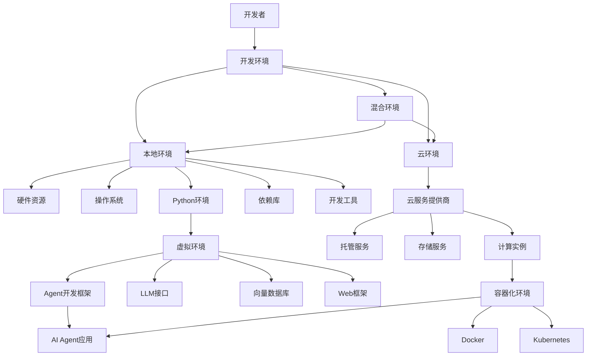

#### 开发环境交互关系图

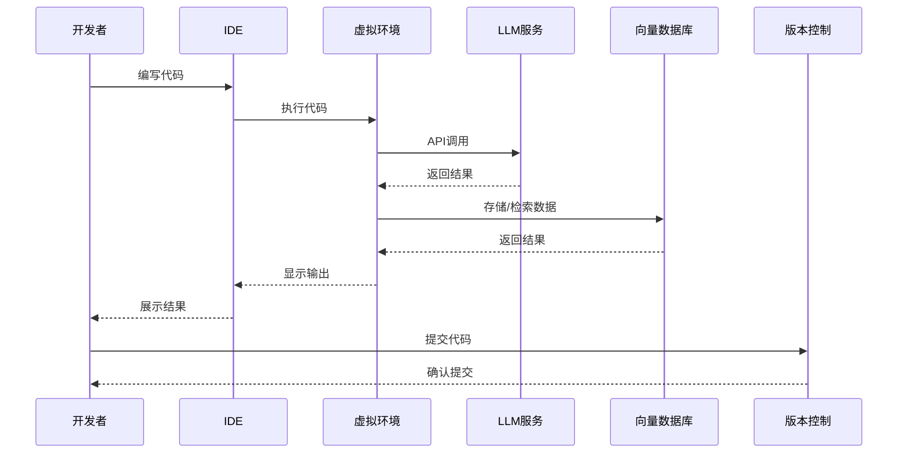

### 数学模型

在评估开发环境性能时，可以使用以下数学模型：

1. **资源利用率计算**

$$U = \frac{R_{used}}{R_{total}} \times 100\%$$

其中，$U$ 表示资源利用率，$R_{used}$ 表示已使用资源，$R_{total}$ 表示总可用资源。

2. **开发环境成本估算**

$$C_{total} = C_{hardware} + C_{software} + C_{maintenance} + C_{operation}$$

其中，$C_{total}$ 表示总成本，$C_{hardware}$ 表示硬件成本，$C_{software}$ 表示软件成本，$C_{maintenance}$ 表示维护成本，$C_{operation}$ 表示运营成本。

3. **云环境ROI计算**

$$ROI = \frac{B - C}{C} \times 100\%$$

其中，$ROI$ 表示投资回报率，$B$ 表示收益，$C$ 表示成本。

### 算法流程图

以下是AI Agent开发环境搭建的流程图：

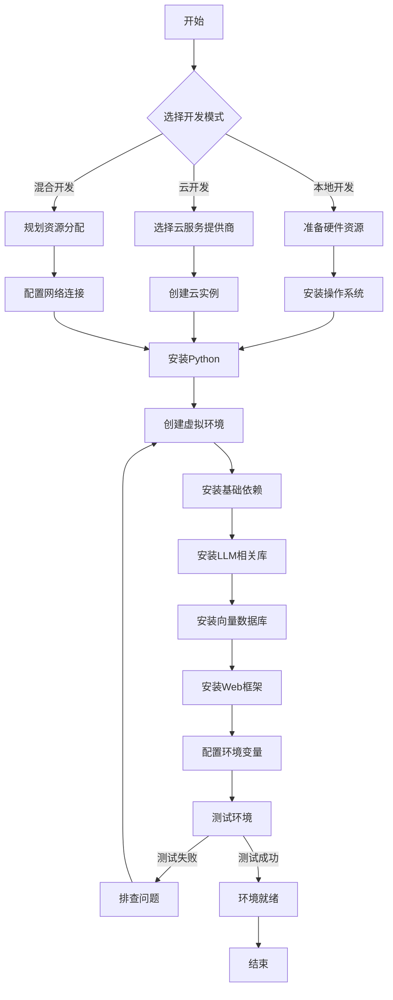

### 算法源代码

以下是一个自动化环境搭建脚本示例：

```python
#!/usr/bin/env python3
# -*- coding: utf-8 -*-

"""
AI Agent开发环境自动化搭建脚本
"""

import os
import sys
import subprocess
import platform
import argparse
from pathlib import Path

def check_python_version():
    """检查Python版本是否满足要求"""
    required_version = (3, 9)
    current_version = sys.version_info
    
    if current_version < required_version:
        print(f"错误: 需要Python {required_version[0]}.{required_version[1]}或更高版本")
        print(f"当前版本: {current_version[0]}.{current_version[1]}")
        return False
    return True

def create_virtual_env(env_name, python_path=None):
    """创建虚拟环境"""
    env_path = Path(env_name)
    
    if env_path.exists():
        print(f"虚拟环境 '{env_name}' 已存在")
        return env_path
    
    print(f"创建虚拟环境 '{env_name}'...")
    
    if python_path:
        subprocess.run([python_path, "-m", "venv", env_name], check=True)
    else:
        subprocess.run([sys.executable, "-m", "venv", env_name], check=True)
    
    print(f"虚拟环境创建成功: {env_path.absolute()}")
    return env_path

def install_dependencies(env_path, requirements=None, dev_mode=False):
    """安装依赖库"""
    # 确定pip路径
    if platform.system() == "Windows":
        pip_path = env_path / "Scripts" / "pip"
    else:
        pip_path = env_path / "bin" / "pip"
    
    # 升级pip
    print("升级pip...")
    subprocess.run([str(pip_path), "install", "--upgrade", "pip", "setuptools", "wheel"], check=True)
    
    # 安装基础依赖
    print("安装基础依赖...")
    base_packages = [
        "openai",
        "langchain",
        "faiss-cpu",
        "chromadb",
        "fastapi",
        "uvicorn",
        "streamlit",
        "gradio",
        "pandas",
        "numpy",
        "matplotlib",
        "requests",
        "python-dotenv"
    ]
    
    subprocess.run([str(pip_path), "install"] + base_packages, check=True)
    
    # 安装指定的requirements
    if requirements and Path(requirements).exists():
        print(f"从 {requirements} 安装依赖...")
        subprocess.run([str(pip_path), "install", "-r", requirements], check=True)
    
    # 安装开发依赖
    if dev_mode:
        print("安装开发依赖...")
        dev_packages = [
            "pytest",
            "black",
            "flake8",
            "mypy",
            "jupyter",
            "ipykernel"
        ]
        subprocess.run([str(pip_path), "install"] + dev_packages, check=True)
    
    print("依赖安装完成")

def setup_project_structure(project_path):
    """设置项目目录结构"""
    project_path = Path(project_path)
    
    if not project_path.exists():
        project_path.mkdir(parents=True)
    
    # 创建项目目录结构
    directories = [
        "app",
        "app/api",
        "app/core",
        "app/models",
        "app/services",
        "app/utils",
        "data",
        "docs",
        "tests"
    ]
    
    for directory in directories:
        dir_path = project_path / directory
        if not dir_path.exists():
            dir_path.mkdir(parents=True)
            print(f"创建目录: {dir_path}")
    
    # 创建基础文件
    files = {
        "app/__init__.py": "",
        "app/api/__init__.py": "",
        "app/core/__init__.py": "",
        "app/models/__init__.py": "",
        "app/services/__init__.py": "",
        "app/utils/__init__.py": "",
        "app/main.py": """from fastapi import FastAPI

app = FastAPI(title="AI Agent API")

@app.get("/")
async def root():
    return {"message": "Welcome to AI Agent API"}
""",
        ".env.example": """# API Keys
OPENAI_API_KEY=your_openai_api_key
# Database Settings
DATABASE_URL=sqlite:///./app.db
# App Settings
DEBUG=True
""",
        ".gitignore": """# Python
__pycache__/
*.py[cod]
*$py.class
*.so
.Python
env/
build/
develop-eggs/
dist/
downloads/
eggs/
.eggs/
lib/
lib64/
parts/
sdist/
var/
*.egg-info/
.installed.cfg
*.egg

# Virtual Environment
venv/
ENV/

# Environment Variables
.env

# IDE
.idea/
.vscode/
*.swp
*.swo

# OS
.DS_Store
Thumbs.db
""",
        "README.md": """# AI Agent Project

## Setup

1. Create a virtual environment:
   ```
   python -m venv venv
   ```

2. Activate the virtual environment:
   - Windows: `venv\\Scripts\\activate`
   - Unix/MacOS: `source venv/bin/activate`

3. Install dependencies:
   ```
   pip install -r requirements.txt
   ```

4. Copy `.env.example` to `.env` and fill in your API keys.

5. Run the application:
   ```
   uvicorn app.main:app --reload
   ```
""",
        "requirements.txt": """openai>=1.3.0
langchain>=0.0.335
faiss-cpu>=1.7.4
chromadb>=0.4.18
fastapi>=0.104.1
uvicorn>=0.23.2
pydantic>=2.4.2
python-dotenv>=1.0.0
"""
    }
    
    for file_path, content in files.items():
        full_path = project_path / file_path
        if not full_path.exists():
            with open(full_path, "w", encoding="utf-8") as f:
                f.write(content)
            print(f"创建文件: {full_path}")

def main():
    parser = argparse.ArgumentParser(description="AI Agent开发环境搭建工具")
    parser.add_argument("--project", "-p", default="ai_agent_project", help="项目目录名称")
    parser.add_argument("--venv", "-v", default="venv", help="虚拟环境名称")
    parser.add_argument("--requirements", "-r", help="指定requirements.txt文件路径")
    parser.add_argument("--dev", action="store_true", help="安装开发依赖")
    parser.add_argument("--python", help="指定Python解释器路径")
    
    args = parser.parse_args()
    
    # 检查Python版本
    if not check_python_version():
        sys.exit(1)
    
    # 创建虚拟环境
    env_path = create_virtual_env(args.venv, args.python)
    
    # 安装依赖
    install_dependencies(env_path, args.requirements, args.dev)
    
    # 设置项目结构
    setup_project_structure(args.project)
    
    print("\n环境搭建完成!")
    print(f"项目目录: {Path(args.project).absolute()}")
    print(f"虚拟环境: {env_path.absolute()}")
    print("\n激活虚拟环境:")
    
    if platform.system() == "Windows":
        print(f"{env_path}\\Scripts\\activate")
    else:
        print(f"source {env_path}/bin/activate")
    
    print("\n启动应用:")
    print(f"cd {args.project} && uvicorn app.main:app --reload")

if __name__ == "__main__":
    main()
```

### 实际场景应用

#### 场景一：个人开发者搭建本地环境

对于个人开发者，可以按照以下步骤搭建本地开发环境：

1. 安装Python 3.9+和必要的开发工具
2. 创建虚拟环境并安装依赖
3. 配置API密钥和环境变量
4. 使用VS Code或PyCharm等IDE进行开发
5. 使用Git进行版本控制

#### 场景二：团队协作开发环境

对于团队协作，推荐以下环境配置：

1. 使用Docker容器化开发环境，确保一致性
2. 采用GitLab/GitHub进行代码管理和CI/CD
3. 使用共享的开发服务器或云环境
4. 实施环境变量管理和密钥安全策略
5. 建立开发、测试和生产环境隔离

#### 场景三：资源受限环境下的开发

对于计算资源有限的情况：

1. 使用云端API而非本地模型
2. 采用轻量级框架和工具
3. 实施缓存策略减少API调用
4. 使用异步处理提高响应效率
5. 考虑使用预计算结果减少实时计算需求

### 项目介绍

以下是一个完整的AI Agent开发环境搭建项目示例：

**项目名称**：AgentDevKit

**项目目标**：提供一站式AI Agent开发环境搭建工具，降低开发门槛

**核心功能**：
1. 自动化环境配置
2. 项目模板生成
3. 依赖管理
4. 开发工具集成
5. 部署脚本生成

### 环境安装

AgentDevKit的安装步骤：

```bash
# 克隆仓库
git clone https://github.com/example/agent-dev-kit.git
cd agent-dev-kit

# 安装工具
pip install -e .

# 初始化项目
agentdev init my_agent_project

# 进入项目目录
cd my_agent_project

# 启动开发服务器
agentdev run
```

### 系统功能设计

AgentDevKit提供以下核心功能：

1. **环境初始化**：自动创建虚拟环境和安装依赖
2. **项目脚手架**：生成项目结构和基础文件
3. **依赖管理**：智能解决依赖冲突
4. **开发服务器**：提供热重载功能
5. **测试工具**：集成单元测试和集成测试
6. **部署工具**：生成Docker和云部署配置

### 系统架构设计

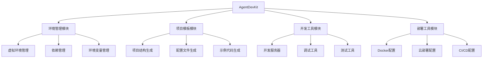

### 系统接口设计

AgentDevKit提供以下命令行接口：

```
agentdev init [project_name] - 初始化新项目
agentdev install - 安装依赖
agentdev run - 启动开发服务器
agentdev test - 运行测试
agentdev build - 构建项目
agentdev deploy - 部署项目
```

### 系统核心实现源代码

以下是AgentDevKit的核心模块实现：

```python
# agentdev/cli.py
import click
import os
import sys
from pathlib import Path
from .environment import setup_environment
from .project import create_project
from .server import run_server
from .deploy import deploy_project

@click.group()
def cli():
    """AgentDevKit - AI Agent开发环境工具"""
    pass

@cli.command()
@click.argument('project_name')
@click.option('--template', '-t', default='basic', 
              help='项目模板: basic, rag, tool-using, multi-agent')
@click.option('--python', '-p', help='指定Python解释器路径')
def init(project_name, template, python):
    """初始化新的AI Agent项目"""
    project_path = Path(project_name)
    
    if project_path.exists() and any(project_path.iterdir()):
        click.echo(f"错误: 目录 '{project_name}' 已存在且不为空")
        sys.exit(1)
    
    click.echo(f"创建项目 '{project_name}' 使用 '{template}' 模板...")
    
    # 创建项目目录结构
    create_project(project_path, template)
    
    # 设置开发环境
    setup_environment(project_path, python)
    
    click.echo(f"\n项目 '{project_name}' 创建成功!")
    click.echo(f"进入项目目录: cd {project_name}")
    click.echo("安装依赖: agentdev install")
    click.echo("启动开发服务器: agentdev run")

@cli.command()
def install():
    """安装项目依赖"""
    if not Path("requirements.txt").exists():
        click.echo("错误: 未找到requirements.txt文件")
        sys.exit(1)
    
    venv_path = Path(".venv")
    if not venv_path.exists():
        click.echo("创建虚拟环境...")
        os.system(f"{sys.executable} -m venv .venv")
    
    click.echo("安装依赖...")
    if os.name == 'nt':  # Windows
        os.system(".venv\\Scripts\\pip install -r requirements.txt")
    else:  # Unix/MacOS
        os.system(".venv/bin/pip install -r requirements.txt")
    
    click.echo("依赖安装完成")

@cli.command()
@click.option('--host', default='127.0.0.1', help='主机地址')
@click.option('--port', default=8000, help='端口号')
@click.option('--reload', is_flag=True, help='启用热重载')
def run(host, port, reload):
    """启动开发服务器"""
    run_server(host, port, reload)

@cli.command()
@click.option('--platform', '-p', default='docker', 
              help='部署平台: docker, aws, azure, gcp')
def deploy(platform):
    """部署项目"""
    deploy_project(platform)

if __name__ == '__main__':
    cli()
```

### 最佳实践小贴士

1. **环境隔离**：为每个项目创建独立的虚拟环境，避免依赖冲突
2. **版本锁定**：使用`requirements.txt`或`poetry.lock`锁定依赖版本
3. **环境变量管理**：使用`.env`文件和`python-dotenv`管理环境变量，不要硬编码API密钥
4. **容器化开发**：使用Docker确保环境一致性和可移植性
5. **渐进式开发**：从简单原型开始，逐步添加复杂功能
6. **模块化设计**：将Agent功能拆分为独立模块，便于测试和维护
7. **自动化测试**：编写单元测试和集成测试，确保代码质量
8. **文档驱动开发**：先写文档再写代码，明确设计目标
9. **定期更新依赖**：定期检查并更新依赖库，修复安全漏洞
10. **性能监控**：实施监控和日志记录，及时发现性能瓶颈

### 拓展阅读

1. [Python虚拟环境最佳实践](https://realpython.com/python-virtual-environments-a-primer/)
2. [Docker与Python开发](https://docs.docker.com/language/python/)
3. [LangChain开发环境配置指南](https://python.langchain.com/docs/get_started/installation)
4. [Hugging Face Transformers环境设置](https://huggingface.co/docs/transformers/installation)
5. [FastAPI官方文档](https://fastapi.tiangolo.com/)
6. [云开发环境比较](https://www.g2.com/categories/cloud-development-platforms)

### 行业发展与未来趋势

AI Agent开发环境正在经历快速演变，以下是主要的发展趋势：

| 趋势 | 描述 | 影响 | 时间框架 |
|------|------|------|---------|
| 低代码/无代码平台 | 通过图形界面构建AI Agent | 降低开发门槛，加速应用开发 | 现在-2年内 |
| 专用开发框架 | 针对AI Agent的专用开发框架涌现 | 提高开发效率，标准化开发流程 | 现在-1年内 |
| 云原生开发环境 | 完全基于云的开发、测试和部署环境 | 消除本地环境限制，提高协作效率 | 1-3年内 |
| AI辅助开发 | AI工具辅助Agent开发和调试 | 自动化代码生成，智能错误检测 | 现在-2年内 |
| 边缘计算集成 | 支持在边缘设备上运行的Agent开发环境 | 扩展应用场景，降低延迟 | 2-4年内 |
| 多模态开发工具 | 支持文本、图像、音频等多模态Agent开发 | 丰富Agent交互能力 | 1-2年内 |
| 联邦学习支持 | 在保护隐私的前提下进行分布式开发 | 解决数据隐私问题，提高模型质量 | 2-5年内 |
| 开源生态系统 | 开源工具和框架的繁荣发展 | 降低成本，促进创新和标准化 | 现在-持续 |

### 小结

本节详细介绍了AI Agent开发环境的搭建过程，包括硬件选择、软件配置、依赖管理和开发工具等方面。我们探讨了本地开发、云开发和混合开发三种模式的优缺点，并提供了具体的环境配置步骤和代码示例。

通过使用虚拟环境、Docker容器和自动化脚本，开发者可以快速搭建一个稳定、高效的AI Agent开发环境。我们还介绍了AgentDevKit这一开发工具，它能够简化环境搭建和项目初始化过程，提高开发效率。

随着AI技术的快速发展，开发环境也在不断演进，低代码平台、专用框架和AI辅助开发等趋势将进一步降低开发门槛，加速AI Agent应用的普及。

在下一节中，我们将深入探讨基础Agent的实现方法，包括Agent架构设计、核心组件实现和基本功能开发等内容。

## 6.2 基础Agent实现方法

### 核心概念

基础AI Agent是指具备基本智能交互能力的软件实体，能够接收用户输入，通过大型语言模型（LLM）进行处理，并生成相应的输出。基础Agent是构建复杂AI应用的基石，掌握其实现方法对于开发者至关重要。

### 问题背景介绍

随着大型语言模型的发展，基于LLM构建AI Agent已成为AI应用开发的主流方向。然而，从原始LLM到功能完善的Agent存在较大的实现差距。开发者需要解决如何设计Agent架构、如何处理用户输入、如何管理上下文、如何实现基本推理能力等一系列问题。

### 问题描述

在实现基础Agent时，开发者通常面临以下挑战：

1. 如何设计合理的Agent架构
2. 如何有效管理与LLM的交互
3. 如何处理和维护对话上下文
4. 如何实现基本的推理和决策能力
5. 如何处理异常情况和边界条件
6. 如何评估Agent的性能和质量

### 问题解决

#### Agent架构设计

基础Agent的架构通常包含以下核心组件：

1. **输入处理器**：负责接收和预处理用户输入
2. **上下文管理器**：维护对话历史和状态
3. **LLM接口**：与大型语言模型交互
4. **输出处理器**：后处理LLM响应并返回给用户
5. **配置管理器**：管理Agent的配置参数

以下是一个基础Agent的架构图：

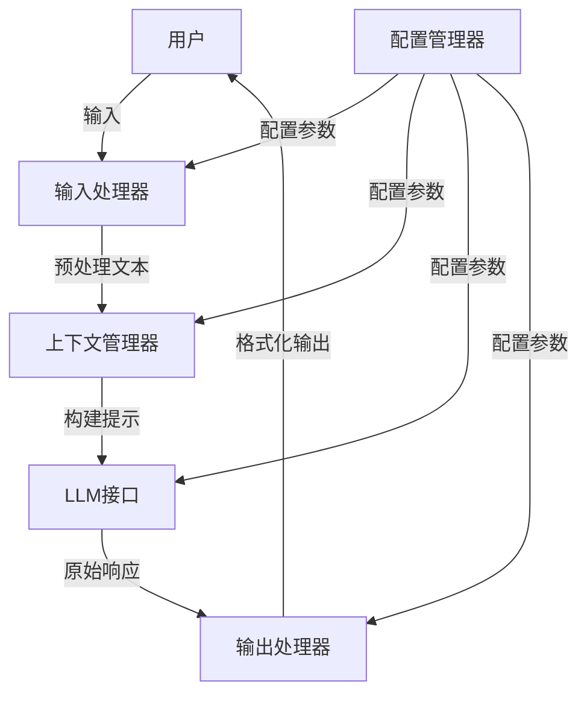

#### 基础Agent实现

下面是一个基础Agent的Python实现示例：

```python
import os
from typing import List, Dict, Any, Optional
import openai
from dotenv import load_dotenv

# 加载环境变量
load_dotenv()

# 配置OpenAI API密钥
openai.api_key = os.getenv("OPENAI_API_KEY")

class BasicAgent:
    """基础AI Agent实现"""
    
    def __init__(self, 
                 model: str = "gpt-3.5-turbo", 
                 system_message: str = "You are a helpful assistant.",
                 max_tokens: int = 1000,
                 temperature: float = 0.7):
        """
        初始化Agent
        
        Args:
            model: 使用的LLM模型名称
            system_message: 系统提示信息
            max_tokens: 生成的最大token数
            temperature: 生成的随机性参数
        """
        self.model = model
        self.system_message = system_message
        self.max_tokens = max_tokens
        self.temperature = temperature
        self.conversation_history = []
        self.initialize_conversation()
    
    def initialize_conversation(self):
        """初始化对话历史"""
        self.conversation_history = [
            {"role": "system", "content": self.system_message}
        ]
    
    def add_message(self, role: str, content: str):
        """
        添加消息到对话历史
        
        Args:
            role: 消息角色 (system, user, assistant)
            content: 消息内容
        """
        self.conversation_history.append({"role": role, "content": content})
    
    def process_input(self, user_input: str) -> str:
        """
        处理用户输入并返回响应
        
        Args:
            user_input: 用户输入文本
            
        Returns:
            Agent的响应文本
        """
        # 添加用户消息到历史
        self.add_message("user", user_input)
        
        try:
            # 调用LLM获取响应
            response = openai.ChatCompletion.create(
                model=self.model,
                messages=self.conversation_history,
                max_tokens=self.max_tokens,
                temperature=self.temperature
            )
            
            # 提取助手响应
            assistant_response = response.choices[0].message.content
            
            # 添加助手响应到历史
            self.add_message("assistant", assistant_response)
            
            return assistant_response
        
        except Exception as e:
            error_message = f"Error: {str(e)}"
            print(error_message)
            return f"I encountered an error while processing your request. Please try again later."
    
    def clear_history(self):
        """清除对话历史，保留系统消息"""
        self.initialize_conversation()
    
    def get_conversation_history(self) -> List[Dict[str, str]]:
        """获取完整对话历史"""
        return self.conversation_history
```

#### 使用示例

```python
# 创建基础Agent实例
agent = BasicAgent(
    system_message="You are a helpful and knowledgeable assistant specialized in technology.",
    temperature=0.5
)

# 与Agent交互
response = agent.process_input("What is artificial intelligence?")
print("Agent:", response)

response = agent.process_input("Can you provide some examples of AI applications?")
print("Agent:", response)

# 查看对话历史
print("\nConversation History:")
for message in agent.get_conversation_history():
    if message["role"] != "system":
        print(f"{message['role'].capitalize()}: {message['content'][:50]}...")
```

#### 增强基础Agent

为了提高Agent的实用性，我们可以添加以下增强功能：

##### 1. 上下文长度管理

```python
def manage_context_length(self, max_messages: int = 10):
    """
    管理上下文长度，防止超出LLM的上下文窗口
    
    Args:
        max_messages: 保留的最大消息数量(不包括系统消息)
    """
    if len(self.conversation_history) > max_messages + 1:  # +1 是因为系统消息
        # 保留系统消息和最近的max_messages条消息
        self.conversation_history = [
            self.conversation_history[0],  # 系统消息
            *self.conversation_history[-(max_messages):]  # 最近的消息
        ]
```

##### 2. 消息摘要功能

```python
def summarize_conversation(self) -> str:
    """
    总结当前对话，用于长对话的压缩
    
    Returns:
        对话摘要
    """
    if len(self.conversation_history) <= 2:  # 只有系统消息和一条用户消息
        return "Conversation just started."
    
    # 构建摘要提示
    summarize_prompt = "Please summarize our conversation so far in a concise paragraph."
    self.add_message("user", summarize_prompt)
    
    try:
        # 调用LLM获取摘要
        response = openai.ChatCompletion.create(
            model=self.model,
            messages=self.conversation_history,
            max_tokens=200,
            temperature=0.3
        )
        
        # 提取摘要
        summary = response.choices[0].message.content
        
        # 移除摘要请求和响应
        self.conversation_history = self.conversation_history[:-2]
        
        return summary
    
    except Exception as e:
        print(f"Error during summarization: {str(e)}")
        return "Failed to summarize conversation."
```

##### 3. 思考链（Chain-of-Thought）实现

```python
def think(self, question: str) -> str:
    """
    使用思考链方法处理复杂问题
    
    Args:
        question: 用户问题
        
    Returns:
        思考过程和最终答案
    """
    cot_prompt = f"""
    Question: {question}
    
    Let's think through this step by step:
    """
    
    self.add_message("user", cot_prompt)
    
    try:
        # 调用LLM获取思考过程
        response = openai.ChatCompletion.create(
            model=self.model,
            messages=self.conversation_history,
            max_tokens=self.max_tokens,
            temperature=self.temperature
        )
        
        # 提取思考过程
        thinking_process = response.choices[0].message.content
        
        # 添加思考过程到历史
        self.add_message("assistant", thinking_process)
        
        return thinking_process
    
    except Exception as e:
        error_message = f"Error during thinking: {str(e)}"
        print(error_message)
        return "I encountered an error while thinking about this problem."
```

##### 4. 情感分析功能

```python
def analyze_sentiment(self, text: str) -> Dict[str, Any]:
    """
    分析文本的情感
    
    Args:
        text: 要分析的文本
        
    Returns:
        情感分析结果
    """
    sentiment_prompt = f"""
    Analyze the sentiment of the following text. Return a JSON object with the following fields:
    - sentiment: (positive, negative, or neutral)
    - confidence: (a number between 0 and 1)
    - emotion: (the primary emotion expressed)
    
    Text: "{text}"
    
    JSON:
    """
    
    try:
        # 调用LLM获取情感分析
        response = openai.ChatCompletion.create(
            model=self.model,
            messages=[{"role": "user", "content": sentiment_prompt}],
            max_tokens=100,
            temperature=0.2
        )
        
        # 提取JSON响应
        sentiment_result = response.choices[0].message.content
        
        # 这里应该添加JSON解析，但为简化示例，我们返回原始文本
        return {"raw_result": sentiment_result}
    
    except Exception as e:
        error_message = f"Error during sentiment analysis: {str(e)}"
        print(error_message)
        return {"error": error_message}
```

#### 完整的增强型基础Agent

以下是整合了上述功能的完整Agent实现：

```python
import os
import json
from typing import List, Dict, Any, Optional
import openai
from dotenv import load_dotenv

# 加载环境变量
load_dotenv()

# 配置OpenAI API密钥
openai.api_key = os.getenv("OPENAI_API_KEY")

class EnhancedAgent:
    """增强型基础AI Agent实现"""
    
    def __init__(self, 
                 model: str = "gpt-3.5-turbo", 
                 system_message: str = "You are a helpful assistant.",
                 max_tokens: int = 1000,
                 temperature: float = 0.7,
                 max_context_messages: int = 10):
        """
        初始化Agent
        
        Args:
            model: 使用的LLM模型名称
            system_message: 系统提示信息
            max_tokens: 生成的最大token数
            temperature: 生成的随机性参数
            max_context_messages: 上下文中保留的最大消息数
        """
        self.model = model
        self.system_message = system_message
        self.max_tokens = max_tokens
        self.temperature = temperature
        self.max_context_messages = max_context_messages
        self.conversation_history = []
        self.initialize_conversation()
    
    def initialize_conversation(self):
        """初始化对话历史"""
        self.conversation_history = [
            {"role": "system", "content": self.system_message}
        ]
    
    def add_message(self, role: str, content: str):
        """
        添加消息到对话历史
        
        Args:
            role: 消息角色 (system, user, assistant)
            content: 消息内容
        """
        self.conversation_history.append({"role": role, "content": content})
        
        # 自动管理上下文长度
        if len(self.conversation_history) > self.max_context_messages + 1:  # +1 是因为系统消息
            self.manage_context_length()
    
    def manage_context_length(self):
        """管理上下文长度，防止超出LLM的上下文窗口"""
        # 如果对话太长，先尝试总结
        if len(self.conversation_history) > self.max_context_messages + 5:
            summary = self.summarize_conversation()
            
            # 使用摘要重置对话
            self.conversation_history = [
                {"role": "system", "content": self.system_message},
                {"role": "system", "content": f"Previous conversation summary: {summary}"}
            ]
        else:
            # 否则只保留最近的消息
            self.conversation_history = [
                self.conversation_history[0],  # 系统消息
                *self.conversation_history[-(self.max_context_messages):]  # 最近的消息
            ]
    
    def process_input(self, user_input: str, use_cot: bool = False) -> str:
        """
        处理用户输入并返回响应
        
        Args:
            user_input: 用户输入文本
            use_cot: 是否使用思考链方法
            
        Returns:
            Agent的响应文本
        """
        if use_cot:
            return self.think(user_input)
        
        # 添加用户消息到历史
        self.add_message("user", user_input)
        
        try:
            # 调用LLM获取响应
            response = openai.ChatCompletion.create(
                model=self.model,
                messages=self.conversation_history,
                max_tokens=self.max_tokens,
                temperature=self.temperature
            )
            
            # 提取助手响应
            assistant_response = response.choices[0].message.content
            
            # 添加助手响应到历史
            self.add_message("assistant", assistant_response)
            
            return assistant_response
        
        except Exception as e:
            error_message = f"Error: {str(e)}"
            print(error_message)
            return f"I encountered an error while processing your request. Please try again later."
    
    def think(self, question: str) -> str:
        """
        使用思考链方法处理复杂问题
        
        Args:
            question: 用户问题
            
        Returns:
            思考过程和最终答案
        """
        cot_prompt = f"""
        Question: {question}
        
        Let's think through this step by step:
        """
        
        self.add_message("user", cot_prompt)
        
        try:
            # 调用LLM获取思考过程
            response = openai.ChatCompletion.create(
                model=self.model,
                messages=self.conversation_history,
                max_tokens=self.max_tokens,
                temperature=self.temperature
            )
            
            # 提取思考过程
            thinking_process = response.choices[0].message.content
            
            # 添加思考过程到历史
            self.add_message("assistant", thinking_process)
            
            return thinking_process
        
        except Exception as e:
            error_message = f"Error during thinking: {str(e)}"
            print(error_message)
            return "I encountered an error while thinking about this problem."
    
    def summarize_conversation(self) -> str:
        """
        总结当前对话，用于长对话的压缩
        
        Returns:
            对话摘要
        """
        if len(self.conversation_history) <= 2:  # 只有系统消息和一条用户消息
            return "Conversation just started."
        
        # 构建摘要提示
        summarize_prompt = "Please summarize our conversation so far in a concise paragraph."
        
        try:
            # 创建临时消息列表，不修改原始历史
            temp_messages = self.conversation_history.copy()
            temp_messages.append({"role": "user", "content": summarize_prompt})
            
            # 调用LLM获取摘要
            response = openai.ChatCompletion.create(
                model=self.model,
                messages=temp_messages,
                max_tokens=200,
                temperature=0.3
            )
            
            # 提取摘要
            summary = response.choices[0].message.content
            return summary
        
        except Exception as e:
            print(f"Error during summarization: {str(e)}")
            return "Failed to summarize conversation."
    
    def analyze_sentiment(self, text: str) -> Dict[str, Any]:
        """
        分析文本的情感
        
        Args:
            text: 要分析的文本
            
        Returns:
            情感分析结果
        """
        sentiment_prompt = f"""
        Analyze the sentiment of the following text. Return a JSON object with the following fields:
        - sentiment: (positive, negative, or neutral)
        - confidence: (a number between 0 and 1)
        - emotion: (the primary emotion expressed)
        
        Text: "{text}"
        
        JSON:
        """
        
        try:
            # 调用LLM获取情感分析
            response = openai.ChatCompletion.create(
                model=self.model,
                messages=[{"role": "user", "content": sentiment_prompt}],
                max_tokens=100,
                temperature=0.2
            )
            
            # 提取JSON响应
            sentiment_result = response.choices[0].message.content
            
            # 尝试解析JSON
            try:
                # 提取JSON部分（可能包含在代码块或其他文本中）
                json_str = sentiment_result
                if "```json" in json_str:
                    json_str = json_str.split("```json")[1].split("```")[0].strip()
                elif "```" in json_str:
                    json_str = json_str.split("```")[1].split("```")[0].strip()
                
                result = json.loads(json_str)
                return result
            except json.JSONDecodeError:
                return {"raw_result": sentiment_result}
        
        except Exception as e:
            error_message = f"Error during sentiment analysis: {str(e)}"
            print(error_message)
            return {"error": error_message}
    
    def clear_history(self):
        """清除对话历史，保留系统消息"""
        self.initialize_conversation()
    
    def get_conversation_history(self) -> List[Dict[str, str]]:
        """获取完整对话历史"""
        return self.conversation_history
```

### 边界与外延

基础Agent实现存在一些边界和限制：

1. **上下文长度限制**：LLM有固定的上下文窗口大小，长对话需要特殊处理
2. **知识时效性**：LLM的知识截止于训练日期，无法获取最新信息
3. **推理能力限制**：复杂推理任务可能需要特殊的提示工程或外部工具
4. **安全与伦理边界**：需要防止有害输出和确保符合伦理标准
5. **多模态能力缺失**：基础Agent通常只处理文本，缺乏图像、音频等处理能力

基础Agent的外延方向包括：

1. **工具使用能力**：集成外部API和工具
2. **RAG增强**：添加检索增强生成能力
3. **多模态交互**：扩展到图像、音频等模态
4. **个性化定制**：根据用户偏好调整行为
5. **多Agent协作**：实现Agent之间的协作

### 概念结构与核心要素组成

基础Agent的核心要素包括：

1. **模型接口**：与LLM交互的组件
2. **上下文管理**：维护对话历史和状态
3. **提示工程**：构建有效的提示以引导LLM
4. **输出处理**：解析和格式化LLM输出
5. **异常处理**：处理API错误和边缘情况
6. **配置管理**：管理Agent的参数和设置

### 概念之间的关系

#### Agent组件关系表

| 组件 | 主要功能 | 与其他组件的关系 | 实现复杂度 |
|------|---------|----------------|-----------|
| 模型接口 | 与LLM API交互 | 接收上下文管理的输入，输出传给输出处理 | 中等 |
| 上下文管理 | 维护对话历史 | 接收用户输入，提供给模型接口 | 中等 |
| 提示工程 | 构建有效提示 | 与上下文管理协作，影响模型接口的输入 | 高 |
| 输出处理 | 解析LLM响应 | 接收模型接口的输出，生成最终响应 | 中等 |
| 异常处理 | 处理错误情况 | 监控所有组件，提供恢复机制 | 中等 |
| 配置管理 | 管理Agent参数 | 影响所有其他组件的行为 | 低 |

#### Agent架构ER图

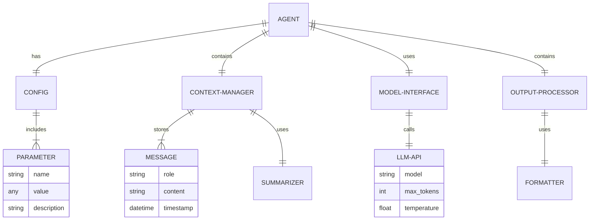

#### Agent交互关系图

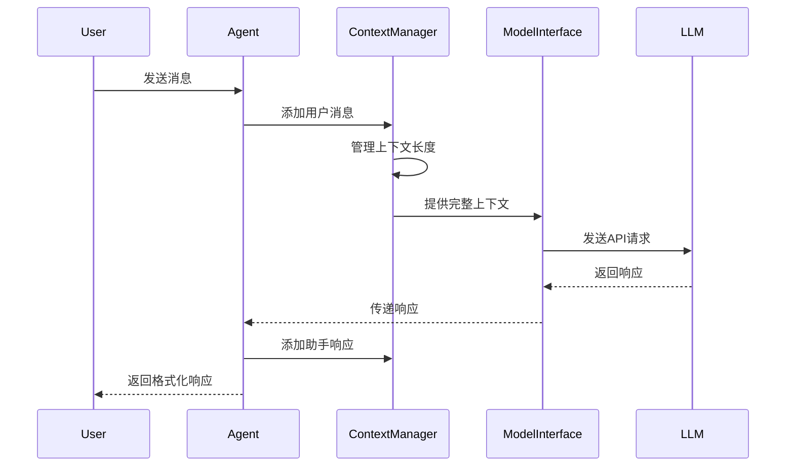

### 数学模型

在Agent设计中，可以使用以下数学模型：

1. **上下文窗口管理**

设对话历史为 $H = \{m_1, m_2, ..., m_n\}$，其中 $m_i$ 是第 $i$ 条消息。每条消息的token数为 $t(m_i)$。

LLM的上下文窗口大小为 $W$。为了确保对话历史不超过窗口大小，需要满足：

$$\sum_{i=1}^{n} t(m_i) \leq W$$

当总token数接近 $W$ 时，需要压缩或删除历史消息。

2. **温度参数与多样性**

LLM的温度参数 $T$ 控制输出的随机性。给定token $w_i$ 的原始概率 $p(w_i)$，应用温度 $T$ 后的概率为：

$$p_T(w_i) = \frac{\exp(\log(p(w_i))/T)}{\sum_j \exp(\log(p(w_j))/T)}$$

当 $T \to 0$ 时，输出趋向于确定性；当 $T > 1$ 时，输出更加随机多样。

3. **对话摘要压缩率**

对于长度为 $n$ 的对话历史，摘要后的长度为 $m$，压缩率 $C$ 定义为：

$$C = 1 - \frac{m}{n}$$

理想的摘要应该在保持高压缩率的同时保留关键信息。

### 算法流程图

以下是基础Agent处理用户输入的流程图：

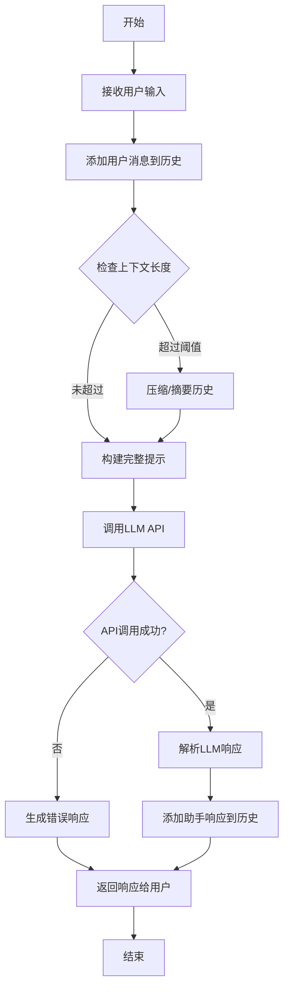

### 算法源代码

以下是一个更加模块化的基础Agent实现：


```python
# agent/base.py
import os
import json
import logging
from typing import List, Dict, Any, Optional, Callable
from abc import ABC, abstractmethod

# 配置日志
logging.basicConfig(level=logging.INFO, format='%(asctime)s - %(name)s - %(levelname)s - %(message)s')
logger = logging.getLogger(__name__)

class Message:
    """表示对话中的单条消息"""
    
    def __init__(self, role: str, content: str):
        """
        初始化消息
        
        Args:
            role: 消息角色 (system, user, assistant)
            content: 消息内容
        """
        self.role = role
        self.content = content
    
    def to_dict(self) -> Dict[str, str]:
        """转换为字典格式"""
        return {"role": self.role, "content": self.content}
    
    @classmethod
    def from_dict(cls, data: Dict[str, str]) -> 'Message':
        """从字典创建消息"""
        return cls(role=data["role"], content=data["content"])


class ContextManager:
    """管理Agent的对话上下文"""
    
    def __init__(self, system_message: str, max_messages: int = 10):
        """
        初始化上下文管理器
        
        Args:
            system_message: 系统提示消息
            max_messages: 保留的最大消息数量
        """
        self.max_messages = max_messages
        self.messages = [Message("system", system_message)]
    
    def add_message(self, role: str, content: str):
        """添加消息到上下文"""
        self.messages.append(Message(role, content))
        self._manage_context_length()
    
    def _manage_context_length(self):
        """管理上下文长度"""
        if len(self.messages) > self.max_messages + 1:  # +1 是因为系统消息
            # 保留系统消息和最近的max_messages条消息
            self.messages = [
                self.messages[0],  # 系统消息
                *self.messages[-(self.max_messages):]  # 最近的消息
            ]
    
    def get_messages(self) -> List[Dict[str, str]]:
        """获取消息列表，适用于API调用"""
        return [msg.to_dict() for msg in self.messages]
    
    def clear(self, keep_system: bool = True):
        """
        清除上下文
        
        Args:
            keep_system: 是否保留系统消息
        """
        if keep_system and self.messages:
            self.messages = [self.messages[0]]
        else:
            self.messages = []


class ModelInterface(ABC):
    """LLM模型接口抽象类"""
    
    @abstractmethod
    def generate(self, messages: List[Dict[str, str]], **kwargs) -> str:
        """
        生成文本响应
        
        Args:
            messages: 消息列表
            **kwargs: 其他参数
            
        Returns:
            生成的文本响应
        """
        pass


class OpenAIInterface(ModelInterface):
    """OpenAI API接口实现"""
    
    def __init__(self, api_key: Optional[str] = None, model: str = "gpt-3.5-turbo"):
        """
        初始化OpenAI接口
        
        Args:
            api_key: OpenAI API密钥
            model: 使用的模型名称
        """
        import openai
        
        self.api_key = api_key or os.getenv("OPENAI_API_KEY")
        if not self.api_key:
            raise ValueError("OpenAI API key is required")
        
        openai.api_key = self.api_key
        self.model = model
    
    def generate(self, messages: List[Dict[str, str]], **kwargs) -> str:
        """
        调用OpenAI API生成响应
        
        Args:
            messages: 消息列表
            **kwargs: 其他参数，如max_tokens, temperature等
            
        Returns:
            生成的文本响应
        """
        import openai
        
        try:
            response = openai.ChatCompletion.create(
                model=self.model,
                messages=messages,
                **kwargs
            )
            return response.choices[0].message.content
        except Exception as e:
            logger.error(f"OpenAI API error: {str(e)}")
            raise


class BaseAgent:
    """基础Agent实现"""
    
    def __init__(self, 
                 model_interface: ModelInterface,
                 system_message: str = "You are a helpful assistant.",
                 max_context_messages: int = 10,
                 **model_params):
        """
        初始化Agent
        
        Args:
            model_interface: LLM模型接口
            system_message: 系统提示消息
            max_context_messages: 上下文中保留的最大消息数
            **model_params: 模型参数，如max_tokens, temperature等
        """
        self.model_interface = model_interface
        self.context = ContextManager(system_message, max_context_messages)
        self.model_params = {
            "max_tokens": 1000,
            "temperature": 0.7,
            **model_params
        }
    
    def process(self, user_input: str) -> str:
        """
        处理用户输入并返回响应
        
        Args:
            user_input: 用户输入文本
            
        Returns:
            Agent响应
        """
        # 添加用户消息
        self.context.add_message("user", user_input)
        
        try:
            # 获取响应
            messages = self.context.get_messages()
            response = self.model_interface.generate(messages, **self.model_params)
            
            # 添加助手响应
            self.context.add_message("assistant", response)
            
            return response
        except Exception as e:
            logger.error(f"Error processing input: {str(e)}")
            return f"I encountered an error while processing your request: {str(e)}"
    
    def reset(self):
        """重置Agent状态"""
        self.context.clear(keep_system=True)


class EnhancedAgent(BaseAgent):
    """增强型Agent实现，添加了高级功能"""
    
    def __init__(self, 
                 model_interface: ModelInterface,
                 system_message: str = "You are a helpful assistant.",
                 max_context_messages: int = 10,
                 **model_params):
        """初始化增强型Agent"""
        super().__init__(model_interface, system_message, max_context_messages, **model_params)
        
        # 用于摘要的模型参数
        self.summary_params = {
            "max_tokens": 200,
            "temperature": 0.3
        }
    
    def process_with_thinking(self, user_input: str) -> str:
        """
        使用思考链处理用户输入
        
        Args:
            user_input: 用户输入文本
            
        Returns:
            包含思考过程的响应
        """
        cot_prompt = f"""
        Question: {user_input}
        
        Let's think through this step by step:
        """
        
        return self.process(cot_prompt)
    
    def summarize_conversation(self) -> str:
        """
        总结当前对话
        
        Returns:
            对话摘要
        """
        if len(self.context.messages) <= 2:  # 只有系统消息和一条用户消息
            return "Conversation just started."
        
        # 构建摘要提示
        summarize_prompt = "Please summarize our conversation so far in a concise paragraph."
        
        try:
            # 创建临时消息列表
            temp_messages = self.context.get_messages()
            temp_messages.append({"role": "user", "content": summarize_prompt})
            
            # 获取摘要
            summary = self.model_interface.generate(temp_messages, **self.summary_params)
            return summary
        
        except Exception as e:
            logger.error(f"Error summarizing conversation: {str(e)}")
            return "Failed to summarize conversation."
    
    def compress_context(self):
        """压缩上下文，用摘要替换部分历史"""
        if len(self.context.messages) <= 3:  # 消息太少，不需要压缩
            return
        
        # 获取摘要
        summary = self.summarize_conversation()
        
        # 保留系统消息
        system_message = self.context.messages[0]
        
        # 创建摘要消息
        summary_message = Message("system", f"Previous conversation summary: {summary}")
        
        # 保留最近的两轮对话（4条消息）
        recent_messages = self.context.messages[-4:] if len(self.context.messages) >= 4 else []
        
        # 重置上下文
        self.context.messages = [system_message, summary_message] + recent_messages
    
    def analyze_sentiment(self, text: str) -> Dict[str, Any]:
        """
        分析文本的情感
        
        Args:
            text: 要分析的文本
            
        Returns:
            情感分析结果
        """
        sentiment_prompt = f"""
        Analyze the sentiment of the following text. Return a JSON object with the following fields:
        - sentiment: (positive, negative, or neutral)
        - confidence: (a number between 0 and 1)
        - emotion: (the primary emotion expressed)
        
        Text: "{text}"
        
        JSON:
        """
        
        try:
            # 创建临时消息
            temp_messages = [{"role": "user", "content": sentiment_prompt}]
            
            # 获取分析结果
            result = self.model_interface.generate(temp_messages, temperature=0.2, max_tokens=100)
            
            # 尝试解析JSON
            try:
                # 提取JSON部分
                json_str = result
                if "```json" in json_str:
                    json_str = json_str.split("```json")[1].split("```")[0].strip()
                elif "```" in json_str:
                    json_str = json_str.split("```")[1].split("```")[0].strip()
                
                return json.loads(json_str)
            except json.JSONDecodeError:
                return {"raw_result": result}
            
        except Exception as e:
            logger.error(f"Error analyzing sentiment: {str(e)}")
            return {"error": str(e)}
```

使用示例：

```python
# example.py
import os
from dotenv import load_dotenv
from agent.base import OpenAIInterface, BaseAgent, EnhancedAgent

# 加载环境变量
load_dotenv()

def main():
    # 创建模型接口
    model_interface = OpenAIInterface(model="gpt-3.5-turbo")
    
    # 创建基础Agent
    basic_agent = BaseAgent(
        model_interface=model_interface,
        system_message="You are a helpful and knowledgeable assistant specialized in technology.",
        temperature=0.5
    )
    
    # 创建增强型Agent
    enhanced_agent = EnhancedAgent(
        model_interface=model_interface,
        system_message="You are a helpful and knowledgeable assistant specialized in technology.",
        temperature=0.5
    )
    
    # 使用基础Agent
    print("=== Basic Agent ===")
    response = basic_agent.process("What is artificial intelligence?")
    print("Agent:", response)
    
    response = basic_agent.process("Can you provide some examples of AI applications?")
    print("Agent:", response)
    
    # 使用增强型Agent
    print("\n=== Enhanced Agent with Thinking ===")
    response = enhanced_agent.process_with_thinking("How would you solve the traveling salesman problem?")
    print("Agent:", response)
    
    # 情感分析
    print("\n=== Sentiment Analysis ===")
    text = "I'm really excited about the new AI technologies that are being developed!"
    sentiment = enhanced_agent.analyze_sentiment(text)
    print("Text:", text)
    print("Sentiment:", sentiment)
    
    # 对话摘要
    print("\n=== Conversation Summary ===")
    enhanced_agent.process("What is machine learning?")
    enhanced_agent.process("How is it different from deep learning?")
    enhanced_agent.process("What are some popular machine learning frameworks?")
    summary = enhanced_agent.summarize_conversation()
    print("Summary:", summary)

if __name__ == "__main__":
    main()
```

### 实际场景应用

#### 场景一：客户服务Agent

基础Agent可以应用于客户服务场景，回答常见问题并提供支持：

```python
# 创建客户服务Agent
customer_service_agent = EnhancedAgent(
    model_interface=OpenAIInterface(model="gpt-3.5-turbo"),
    system_message="""You are a helpful customer service representative for TechCorp. 
    You help customers with product inquiries, technical support, and order status. 
    Be polite, professional, and concise in your responses. 
    If you don't know the answer to a question, acknowledge that and offer to connect the customer with a human representative.""",
    temperature=0.3
)

# 处理客户查询
query = "I ordered a laptop 3 days ago but haven't received any shipping confirmation. Order #12345."
response = customer_service_agent.process(query)
print("Customer Service Agent:", response)
```

#### 场景二：教育辅导Agent

基础Agent可以作为学习助手，帮助学生理解复杂概念：

```python
# 创建教育辅导Agent
tutor_agent = EnhancedAgent(
    model_interface=OpenAIInterface(model="gpt-3.5-turbo"),
    system_message="""You are a patient and knowledgeable tutor specializing in science and mathematics. 
    Your goal is to help students understand concepts by explaining them clearly and providing examples. 
    When appropriate, use the Socratic method to guide students to discover answers themselves through thoughtful questions.""",
    temperature=0.6
)

# 处理学生问题
question = "I don't understand how photosynthesis works. Can you explain it to me?"
response = tutor_agent.process_with_thinking(question)
print("Tutor Agent:", response)
```

#### 场景三：个人助理Agent

基础Agent可以作为个人助理，帮助用户管理日程和提供信息：

```python
# 创建个人助理Agent
assistant_agent = EnhancedAgent(
    model_interface=OpenAIInterface(model="gpt-3.5-turbo"),
    system_message="""You are a personal assistant helping with daily tasks and information needs. 
    You provide concise, helpful responses and remember important details from the conversation.
    When the user asks about scheduling, act as if you could help them manage their calendar, 
    but clarify that you don't have actual calendar access.""",
    temperature=0.4
)

# 处理用户请求
request = "Can you help me plan my day tomorrow? I have a meeting at 10 AM and need to prepare a presentation."
response = assistant_agent.process(request)
print("Assistant Agent:", response)
```

### 项目介绍

**项目名称**：ModularAgent

**项目目标**：提供一个模块化、可扩展的基础Agent框架，便于开发者快速构建和定制AI Agent应用。

**核心功能**：
1. 模块化架构，支持组件替换和扩展
2. 多种LLM后端支持（OpenAI, Anthropic, Hugging Face等）
3. 上下文管理和压缩
4. 思考链和推理增强
5. 情感分析和对话摘要
6. 可配置的系统提示和参数

### 环境安装

ModularAgent的安装步骤：

```bash
# 克隆仓库
git clone https://github.com/example/modular-agent.git
cd modular-agent

# 创建虚拟环境
python -m venv venv
source venv/bin/activate  # Linux/Mac
# venv\Scripts\activate  # Windows

# 安装依赖
pip install -e .

# 配置环境变量
cp .env.example .env
# 编辑.env文件，添加API密钥
```

### 系统功能设计

ModularAgent提供以下核心功能：

1. **模型接口抽象**：支持多种LLM后端
2. **上下文管理**：智能管理对话历史
3. **增强推理**：思考链和结构化输出
4. **对话工具**：摘要、情感分析等
5. **可扩展插件**：支持自定义功能扩展

### 系统架构设计

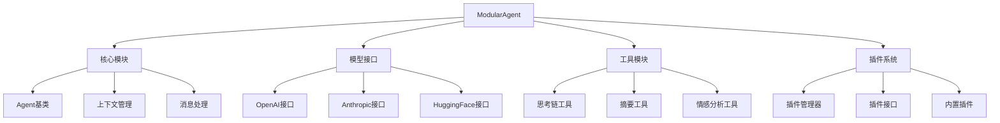

### 系统接口设计

ModularAgent提供以下核心接口：

```python
# Agent接口
agent.process(user_input: str) -> str
agent.process_with_thinking(user_input: str) -> str
agent.reset() -> None

# 上下文管理接口
agent.get_history() -> List[Dict[str, str]]
agent.summarize_conversation() -> str
agent.compress_context() -> None

# 工具接口
agent.analyze_sentiment(text: str) -> Dict[str, Any]
agent.extract_entities(text: str) -> List[Dict[str, Any]]
agent.categorize_text(text: str, categories: List[str]) -> Dict[str, float]
```

### 系统核心实现源代码

以下是ModularAgent的插件系统实现：

```python
# agent/plugins.py
from abc import ABC, abstractmethod
from typing import Dict, Any, List, Optional

class PluginInterface(ABC):
    """Agent插件接口"""
    
    @property
    @abstractmethod
    def name(self) -> str:
        """插件名称"""
        pass
    
    @property
    @abstractmethod
    def description(self) -> str:
        """插件描述"""
        pass
    
    @abstractmethod
    def process(self, agent: Any, user_input: str, context: List[Dict[str, str]]) -> Optional[str]:
        """
        处理用户输入
        
        Args:
            agent: Agent实例
            user_input: 用户输入
            context: 对话上下文
            
        Returns:
            处理结果，如果不处理则返回None
        """
        pass


class PluginManager:
    """插件管理器"""
    
    def __init__(self):
        """初始化插件管理器"""
        self.plugins: Dict[str, PluginInterface] = {}
    
    def register(self, plugin: PluginInterface):
        """
        注册插件
        
        Args:
            plugin: 插件实例
        """
        self.plugins[plugin.name] = plugin
    
    def unregister(self, plugin_name: str):
        """
        注销插件
        
        Args:
            plugin_name: 插件名称
        """
        if plugin_name in self.plugins:
            del self.plugins[plugin_name]
    
    def get_plugin(self, plugin_name: str) -> Optional[PluginInterface]:
        """
        获取插件
        
        Args:
            plugin_name: 插件名称
            
        Returns:
            插件实例，如果不存在则返回None
        """
        return self.plugins.get(plugin_name)
    
    def process_input(self, agent: Any, user_input: str, context: List[Dict[str, str]]) -> Optional[str]:
        """
        使用插件处理用户输入
        
        Args:
            agent: Agent实例
            user_input: 用户输入
            context: 对话上下文
            
        Returns:
            处理结果，如果没有插件处理则返回None
        """
        for plugin in self.plugins.values():
            result = plugin.process(agent, user_input, context)
            if result is not None:
                return result
        
        return None


# 示例插件：天气查询
class WeatherPlugin(PluginInterface):
    """天气查询插件"""
    
    @property
    def name(self) -> str:
        return "weather"
    
    @property
    def description(self) -> str:
        return "Provides weather information for a given location"
    
    def process(self, agent: Any, user_input: str, context: List[Dict[str, str]]) -> Optional[str]:
        """处理天气查询"""
        # 简单的关键词检测
        if "weather" in user_input.lower() and "in" in user_input.lower():
            # 这里应该调用实际的天气API
            # 为了示例，返回模拟数据
            return "I found weather information for your location: Sunny, 25°C"
        
        return None


# 示例插件：计算器
class CalculatorPlugin(PluginInterface):
    """计算器插件"""
    
    @property
    def name(self) -> str:
        return "calculator"
    
    @property
    def description(self) -> str:
        return "Performs basic calculations"
    
    def process(self, agent: Any, user_input: str, context: List[Dict[str, str]]) -> Optional[str]:
        """处理计算请求"""
        import re
        
        # 匹配简单的计算表达式
        match = re.search(r'calculate\s+([\d\+\-\*\/\(\)\s]+)', user_input.lower())
        if match:
            expression = match.group(1)
            try:
                result = eval(expression)
                return f"The result of {expression} is {result}"
            except Exception as e:
                return f"I couldn't calculate that expression: {str(e)}"
        
        return None
```

集成插件系统的Agent实现：

```python
# agent/plugin_agent.py
from typing import List, Dict, Any, Optional
from .base import BaseAgent, ModelInterface
from .plugins import PluginManager, PluginInterface

class PluginAgent(BaseAgent):
    """支持插件的Agent实现"""
    
    def __init__(self, 
                 model_interface: ModelInterface,
                 system_message: str = "You are a helpful assistant.",
                 max_context_messages: int = 10,
                 **model_params):
        """初始化插件Agent"""
        super().__init__(model_interface, system_message, max_context_messages, **model_params)
        self.plugin_manager = PluginManager()
    
    def register_plugin(self, plugin: PluginInterface):
        """注册插件"""
        self.plugin_manager.register(plugin)
    
    def unregister_plugin(self, plugin_name: str):
        """注销插件"""
        self.plugin_manager.unregister(plugin_name)
    
    def process(self, user_input: str) -> str:
        """
        处理用户输入
        
        首先尝试使用插件处理，如果没有插件处理则使用LLM
        
        Args:
            user_input: 用户输入
            
        Returns:
            Agent响应
        """
        # 尝试使用插件处理
        plugin_result = self.plugin_manager.process_input(
            self, user_input, self.context.get_messages()
        )
        
        if plugin_result is not None:
            # 插件处理成功，添加到对话历史
            self.context.add_message("user", user_input)
            self.context.add_message("assistant", plugin_result)
            return plugin_result
        
        # 插件未处理，使用基础处理方法
        return super().process(user_input)
```

### 最佳实践小贴士

1. **模块化设计**：将Agent功能拆分为独立模块，便于测试和维护
2. **接口抽象**：使用抽象类定义接口，支持多种实现
3. **错误处理**：实现全面的错误处理和恢复机制
4. **上下文管理**：智能管理对话历史，避免上下文窗口溢出
5. **提示工程**：精心设计系统提示和用户提示
6. **参数调优**：根据应用场景调整温度等参数
7. **测试驱动开发**：编写单元测试和集成测试
8. **渐进式增强**：从基础功能开始，逐步添加高级特性
9. **用户反馈**：收集和分析用户反馈，持续改进
10. **文档完善**：提供详细的API文档和使用示例

### 拓展阅读

1. [LangChain Agent设计模式](https://python.langchain.com/docs/modules/agents/)
2. [OpenAI API最佳实践](https://platform.openai.com/docs/guides/gpt-best-practices)
3. [Chain-of-Thought Prompting](https://arxiv.org/abs/2201.11903)
4. [ReAct: Synergizing Reasoning and Acting in Language Models](https://arxiv.org/abs/2210.03629)
5. [LLM应用架构模式](https://eugeneyan.com/writing/llm-patterns/)
6. [Anthropic Claude提示工程指南](https://docs.anthropic.com/claude/docs/introduction-to-prompt-design)

### 行业发展与未来趋势

基础Agent实现技术正在快速发展，以下是主要趋势：

| 趋势 | 描述 | 影响 | 时间框架 |
|------|------|------|---------|
| 模块化框架 | 标准化的Agent组件和接口 | 提高开发效率，促进组件复用 | 现在-1年内 |
| 自我改进Agent | 能够自我评估和优化的Agent | 减少人工干预，提高适应性 | 1-3年内 |
| 多模态集成 | 文本、图像、音频等多模态处理 | 扩展交互能力，提升用户体验 | 现在-2年内 |
| 本地部署LLM | 轻量级模型本地运行 | 降低延迟，提高隐私保护 | 现在-1年内 |
| Agent协作框架 | 支持多Agent协同工作的框架 | 解决复杂任务，提高系统能力 | 1-2年内 |
| 个性化定制 | 根据用户偏好和历史调整行为 | 提高用户满意度，增强粘性 | 现在-2年内 |
| 可解释性增强 | 提供决策过程的透明解释 | 增加用户信任，满足监管要求 | 1-3年内 |
| 低代码Agent构建 | 通过图形界面构建Agent | 降低技术门槛，加速应用开发 | 现在-2年内 |

### 本章小结

本节详细介绍了基础AI Agent的实现方法，包括架构设计、核心组件、实现代码和应用场景。我们从简单的基础Agent开始，逐步添加上下文管理、思考链、情感分析等高级功能，最终构建了一个模块化、可扩展的Agent框架。

通过模块化设计和接口抽象，我们实现了一个灵活的Agent系统，支持多种LLM后端和插件扩展。这种设计使得开发者可以根据具体需求定制和扩展Agent功能，而不必从头开始构建。

基础Agent是构建复杂AI应用的基石，掌握其实现方法对于开发高质量的AI应用至关重要。随着技术的发展，我们可以期待更加智能、自主和个性化的Agent系统出现，为用户提供更加自然和高效的交互体验。

在下一节中，我们将探讨如何将RAG（检索增强生成）系统集成到Agent中，进一步提升Agent的知识应用能力。

## 6.3 RAG系统集成

### 核心概念

检索增强生成（Retrieval-Augmented Generation，RAG）是一种将外部知识库与大型语言模型（LLM）结合的技术，通过在生成响应前检索相关信息，显著提升AI Agent的知识应用能力和回答准确性。RAG系统使Agent能够访问最新信息、专业领域知识和私有数据，克服LLM知识截止日期和幻觉等局限性。

### 问题背景介绍

尽管现代LLM拥有庞大的参数量和广泛的知识，但它们仍面临几个关键挑战：

1. **知识时效性**：LLM的知识在训练截止日期后不再更新
2. **领域专业性**：对特定领域的深度知识可能不足
3. **私有信息访问**：无法直接访问组织的私有数据和文档
4. **幻觉问题**：可能生成看似合理但实际不准确的信息
5. **上下文窗口限制**：无法一次处理大量文档内容

RAG系统通过将外部知识库与LLM结合，有效解决了这些问题。它允许Agent在生成响应前检索相关信息，从而提供更准确、更新和更专业的回答。

### 问题描述

在将RAG系统集成到AI Agent中，开发者通常面临以下挑战：

1. 如何构建和维护高质量的知识库
2. 如何实现高效的文本嵌入和向量检索
3. 如何设计合适的检索策略和相关性排序
4. 如何将检索结果与LLM提示有效结合
5. 如何处理长文本和多文档情况
6. 如何评估和优化RAG系统性能

### 问题解决

#### RAG系统架构设计

一个完整的RAG系统通常包含以下核心组件：

1. **文档处理器**：负责文档加载、清洗和分块
2. **嵌入模型**：将文本转换为向量表示
3. **向量数据库**：存储和索引文本向量
4. **检索器**：根据查询检索相关文档
5. **提示构建器**：将检索结果融入LLM提示
6. **LLM接口**：与大型语言模型交互
7. **结果处理器**：处理和格式化最终输出

以下是RAG系统的架构图：

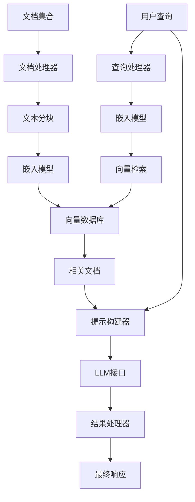

#### RAG系统实现

下面是一个基于LangChain和FAISS的RAG系统实现：

```python
import os
from typing import List, Dict, Any, Optional
from dotenv import load_dotenv
import numpy as np
from langchain.document_loaders import DirectoryLoader, TextLoader
from langchain.text_splitter import RecursiveCharacterTextSplitter
from langchain.embeddings import OpenAIEmbeddings
from langchain.vectorstores import FAISS
from langchain.llms import OpenAI
from langchain.chains import RetrievalQA

# 加载环境变量
load_dotenv()

class RAGSystem:
    """基于LangChain的RAG系统实现"""
    
    def __init__(self, 
                 documents_dir: str,
                 embedding_model: str = "text-embedding-ada-002",
                 llm_model: str = "gpt-3.5-turbo",
                 chunk_size: int = 1000,
                 chunk_overlap: int = 200,
                 top_k: int = 4):
        """
        初始化RAG系统
        
        Args:
            documents_dir: 文档目录路径
            embedding_model: 嵌入模型名称
            llm_model: LLM模型名称
            chunk_size: 文本块大小
            chunk_overlap: 文本块重叠大小
            top_k: 检索的文档数量
        """
        self.documents_dir = documents_dir
        self.embedding_model = embedding_model
        self.llm_model = llm_model
        self.chunk_size = chunk_size
        self.chunk_overlap = chunk_overlap
        self.top_k = top_k
        
        # 初始化组件
        self.embeddings = OpenAIEmbeddings(model=embedding_model)
        self.llm = OpenAI(model_name=llm_model)
        
        # 加载并处理文档
        self.documents = self._load_documents()
        self.chunks = self._split_documents()
        
        # 创建向量存储
        self.vector_store = self._create_vector_store()
        
        # 创建检索QA链
        self.retrieval_qa = RetrievalQA.from_chain_type(
            llm=self.llm,
            chain_type="stuff",
            retriever=self.vector_store.as_retriever(search_kwargs={"k": self.top_k})
        )
    
    def _load_documents(self):
        """加载文档"""
        loader = DirectoryLoader(
            self.documents_dir,
            glob="**/*.txt",
            loader_cls=TextLoader
        )
        return loader.load()
    
    def _split_documents(self):
        """分割文档为块"""
        text_splitter = RecursiveCharacterTextSplitter(
            chunk_size=self.chunk_size,
            chunk_overlap=self.chunk_overlap
        )
        return text_splitter.split_documents(self.documents)
    
    def _create_vector_store(self):
        """创建向量存储"""
        return FAISS.from_documents(self.chunks, self.embeddings)
    
    def query(self, question: str) -> str:
        """
        查询RAG系统
        
        Args:
            question: 用户问题
            
        Returns:
            回答
        """
        return self.retrieval_qa.run(question)
    
    def save_vector_store(self, path: str):
        """
        保存向量存储
        
        Args:
            path: 保存路径
        """
        self.vector_store.save_local(path)
    
    @classmethod
    def load_from_vector_store(cls, 
                              vector_store_path: str,
                              llm_model: str = "gpt-3.5-turbo",
                              top_k: int = 4):
        """
        从保存的向量存储加载RAG系统
        
        Args:
            vector_store_path: 向量存储路径
            llm_model: LLM模型名称
            top_k: 检索的文档数量
            
        Returns:
            RAG系统实例
        """
        # 创建实例但不初始化文档处理
        instance = cls.__new__(cls)
        
        # 设置基本属性
        instance.llm_model = llm_model
        instance.top_k = top_k
        
        # 初始化组件
        instance.embeddings = OpenAIEmbeddings()
        instance.llm = OpenAI(model_name=llm_model)
        
        # 加载向量存储
        instance.vector_store = FAISS.load_local(vector_store_path, instance.embeddings)
        
        # 创建检索QA链
        instance.retrieval_qa = RetrievalQA.from_chain_type(
            llm=instance.llm,
            chain_type="stuff",
            retriever=instance.vector_store.as_retriever(search_kwargs={"k": instance.top_k})
        )
        
        return instance
```

#### 自定义RAG系统实现

以下是一个不依赖LangChain的自定义RAG系统实现，提供更多灵活性和控制：

```python
import os
import json
import numpy as np
from typing import List, Dict, Any, Optional, Tuple
import openai
from dotenv import load_dotenv
import faiss
from tqdm import tqdm
import tiktoken

# 加载环境变量
load_dotenv()

# 配置OpenAI API密钥
openai.api_key = os.getenv("OPENAI_API_KEY")

class Document:
    """表示一个文档或文档块"""
    
    def __init__(self, text: str, metadata: Optional[Dict[str, Any]] = None):
        """
        初始化文档
        
        Args:
            text: 文档文本
            metadata: 文档元数据
        """
        self.text = text
        self.metadata = metadata or {}
    
    def __str__(self) -> str:
        return f"Document(text={self.text[:50]}..., metadata={self.metadata})"


class CustomRAGSystem:
    """自定义RAG系统实现"""
    
    def __init__(self, 
                 embedding_model: str = "text-embedding-ada-002",
                 llm_model: str = "gpt-3.5-turbo",
                 chunk_size: int = 1000,
                 chunk_overlap: int = 200,
                 top_k: int = 4,
                 similarity_threshold: float = 0.7):
        """
        初始化自定义RAG系统
        
        Args:
            embedding_model: 嵌入模型名称
            llm_model: LLM模型名称
            chunk_size: 文本块大小
            chunk_overlap: 文本块重叠大小
            top_k: 检索的文档数量
            similarity_threshold: 相似度阈值
        """
        self.embedding_model = embedding_model
        self.llm_model = llm_model
        self.chunk_size = chunk_size
        self.chunk_overlap = chunk_overlap
        self.top_k = top_k
        self.similarity_threshold = similarity_threshold
        
        # 初始化文档存储
        self.documents: List[Document] = []
        self.document_embeddings = None
        self.faiss_index = None
        
        # 初始化tokenizer
        self.tokenizer = tiktoken.get_encoding("cl100k_base")  # 适用于大多数OpenAI模型
    
    def add_documents(self, documents: List[Document]):
        """
        添加文档到系统
        
        Args:
            documents: 文档列表
        """
        self.documents.extend(documents)
    
    def add_texts(self, texts: List[str], metadatas: Optional[List[Dict[str, Any]]] = None):
        """
        添加文本到系统
        
        Args:
            texts: 文本列表
            metadatas: 元数据列表
        """
        if metadatas is None:
            metadatas = [{} for _ in texts]
        
        documents = [Document(text, metadata) for text, metadata in zip(texts, metadatas)]
        self.add_documents(documents)
    
    def load_directory(self, directory_path: str, glob_pattern: str = "**/*.txt"):
        """
        从目录加载文档
        
        Args:
            directory_path: 目录路径
            glob_pattern: 文件匹配模式
        """
        import glob
        
        file_paths = glob.glob(os.path.join(directory_path, glob_pattern), recursive=True)
        
        for file_path in file_paths:
            try:
                with open(file_path, 'r', encoding='utf-8') as f:
                    content = f.read()
                
                metadata = {
                    "source": file_path,
                    "filename": os.path.basename(file_path)
                }
                
                self.add_texts([content], [metadata])
            except Exception as e:
                print(f"Error loading {file_path}: {str(e)}")
    
    def split_documents(self):
        """将文档分割为块"""
        chunked_documents = []
        
        for doc in self.documents:
            # 计算分块数量
            tokens = self.tokenizer.encode(doc.text)
            token_count = len(tokens)
            
            # 如果文档小于块大小，直接添加
            if token_count <= self.chunk_size:
                chunked_documents.append(doc)
                continue
            
            # 分块
            chunks = []
            for i in range(0, token_count, self.chunk_size - self.chunk_overlap):
                # 确保不超出范围
                end_idx = min(i + self.chunk_size, token_count)
                
                # 解码token为文本
                chunk_text = self.tokenizer.decode(tokens[i:end_idx])
                
                # 创建新的文档对象
                chunk_metadata = {
                    **doc.metadata,
                    "chunk_index": len(chunks),
                    "original_length": token_count
                }
                
                chunks.append(Document(chunk_text, chunk_metadata))
                
                # 如果已经处理完所有token，退出循环
                if end_idx == token_count:
                    break
            
            chunked_documents.extend(chunks)
        
        # 更新文档列表
        self.documents = chunked_documents
    
    def create_embeddings(self):
        """为所有文档创建嵌入向量"""
        if not self.documents:
            raise ValueError("No documents to embed")
        
        all_embeddings = []
        batch_size = 20  # OpenAI API建议的批处理大小
        
        for i in tqdm(range(0, len(self.documents), batch_size), desc="Creating embeddings"):
            # 获取当前批次
            batch_docs = self.documents[i:i+batch_size]
            batch_texts = [doc.text for doc in batch_docs]
            
            # 调用OpenAI API获取嵌入
            response = openai.Embedding.create(
                model=self.embedding_model,
                input=batch_texts
            )
            
            # 提取嵌入向量
            batch_embeddings = [item["embedding"] for item in response["data"]]
            all_embeddings.extend(batch_embeddings)
        
        # 转换为numpy数组
        self.document_embeddings = np.array(all_embeddings, dtype=np.float32)
        
        # 创建FAISS索引
        dimension = len(all_embeddings[0])
        self.faiss_index = faiss.IndexFlatL2(dimension)
        self.faiss_index.add(self.document_embeddings)
    
    def get_query_embedding(self, query: str) -> np.ndarray:
        """
        获取查询的嵌入向量
        
        Args:
            query: 查询文本
            
        Returns:
            查询的嵌入向量
        """
        response = openai.Embedding.create(
            model=self.embedding_model,
            input=[query]
        )
        
        query_embedding = response["data"][0]["embedding"]
        return np.array([query_embedding], dtype=np.float32)
    
    def retrieve_documents(self, query: str) -> List[Tuple[Document, float]]:
        """
        检索相关文档
        
        Args:
            query: 查询文本
            
        Returns:
            文档和相似度分数的列表
        """
        if self.faiss_index is None:
            raise ValueError("Index not created. Call create_embeddings() first.")
        
        # 获取查询嵌入
        query_embedding = self.get_query_embedding(query)
        
        # 执行检索
        distances, indices = self.faiss_index.search(query_embedding, self.top_k)
        
        # 计算相似度分数 (1 - 归一化距离)
        max_distance = np.max(distances)
        if max_distance > 0:
            similarities = 1 - distances[0] / max_distance
        else:
            similarities = np.ones_like(distances[0])
        
        # 收集结果
        results = []
        for idx, similarity in zip(indices[0], similarities):
            if similarity >= self.similarity_threshold:
                results.append((self.documents[idx], float(similarity)))
        
        # 按相似度排序
        results.sort(key=lambda x: x[1], reverse=True)
        
        return results
    
    def generate_prompt(self, query: str, retrieved_docs: List[Tuple[Document, float]]) -> str:
        """
        生成包含检索结果的提示
        
        Args:
            query: 用户查询
            retrieved_docs: 检索到的文档和相似度
            
        Returns:
            完整提示
        """
        context_parts = []
        
        for doc, similarity in retrieved_docs:
            source_info = f"Source: {doc.metadata.get('source', 'Unknown')}" if 'source' in doc.metadata else ""
            context_parts.append(f"{source_info}\n{doc.text}\n")
        
        context = "\n".join(context_parts)
        
        prompt = f"""Answer the question based on the following context:

Context:
{context}

Question: {query}

Answer:"""
        
        return prompt
    
    def query(self, question: str) -> Dict[str, Any]:
        """
        查询RAG系统
        
        Args:
            question: 用户问题
            
        Returns:
            包含回答和元数据的字典
        """
        # 检索相关文档
        retrieved_docs = self.retrieve_documents(question)
        
        # 如果没有找到相关文档
        if not retrieved_docs:
            return {
                "answer": "I don't have enough information to answer this question.",
                "sources": [],
                "has_context": False
            }
        
        # 生成提示
        prompt = self.generate_prompt(question, retrieved_docs)
        
        # 调用LLM
        try:
            response = openai.ChatCompletion.create(
                model=self.llm_model,
                messages=[
                    {"role": "system", "content": "You are a helpful assistant that answers questions based on the provided context."},
                    {"role": "user", "content": prompt}
                ],
                temperature=0.3,
                max_tokens=1000
            )
            
            answer = response.choices[0].message.content
            
            # 收集源文档信息
            sources = []
            for doc, similarity in retrieved_docs:
                if 'source' in doc.metadata:
                    source = doc.metadata['source']
                    if source not in sources:
                        sources.append(source)
            
            return {
                "answer": answer,
                "sources": sources,
                "has_context": True,
                "retrieved_docs": [(doc.text[:100] + "...", similarity) for doc, similarity in retrieved_docs]
            }
            
        except Exception as e:
            return {
                "answer": f"Error generating answer: {str(e)}",
                "sources": [],
                "has_context": True,
                "error": str(e)
            }
    
    def save(self, directory: str):
        """
        保存RAG系统状态
        
        Args:
            directory: 保存目录
        """
        os.makedirs(directory, exist_ok=True)
        
        # 保存文档
        documents_data = []
        for doc in self.documents:
            documents_data.append({
                "text": doc.text,
                "metadata": doc.metadata
            })
        
        with open(os.path.join(directory, "documents.json"), "w") as f:
            json.dump(documents_data, f)
        
        # 保存嵌入
        if self.document_embeddings is not None:
            np.save(os.path.join(directory, "embeddings.npy"), self.document_embeddings)
        
        # 保存FAISS索引
        if self.faiss_index is not None:
            faiss.write_index(self.faiss_index, os.path.join(directory, "faiss_index.bin"))
        
        # 保存配置
        config = {
            "embedding_model": self.embedding_model,
            "llm_model": self.llm_model,
            "chunk_size": self.chunk_size,
            "chunk_overlap": self.chunk_overlap,
            "top_k": self.top_k,
            "similarity_threshold": self.similarity_threshold
        }
        
        with open(os.path.join(directory, "config.json"), "w") as f:
            json.dump(config, f)
    
    @classmethod
    def load(cls, directory: str) -> 'CustomRAGSystem':
        """
        加载RAG系统
        
        Args:
            directory: 加载目录
            
        Returns:
            RAG系统实例
        """
        # 加载配置
        with open(os.path.join(directory, "config.json"), "r") as f:
            config = json.load(f)
        
        # 创建实例
        instance = cls(
            embedding_model=config["embedding_model"],
            llm_model=config["llm_model"],
            chunk_size=config["chunk_size"],
            chunk_overlap=config["chunk_overlap"],
            top_k=config["top_k"],
            similarity_threshold=config["similarity_threshold"]
        )
        
        # 加载文档
        with open(os.path.join(directory, "documents.json"), "r") as f:
            documents_data = json.load(f)
        
        instance.documents = [Document(item["text"], item["metadata"]) for item in documents_data]
        
        # 加载嵌入
        embeddings_path = os.path.join(directory, "embeddings.npy")
        if os.path.exists(embeddings_path):
            instance.document_embeddings = np.load(embeddings_path)
        
        # 加载FAISS索引
        index_path = os.path.join(directory, "faiss_index.bin")
        if os.path.exists(index_path):
            instance.faiss_index = faiss.read_index(index_path)
        
        return instance
```

#### 将RAG系统集成到Agent

下面是将RAG系统集成到基础Agent的实现：

```python
from typing import List, Dict, Any, Optional
from agent.base import BaseAgent, ModelInterface
from rag.custom_rag import CustomRAGSystem

class RAGAgent(BaseAgent):
    """集成RAG系统的Agent"""
    
    def __init__(self, 
                 model_interface: ModelInterface,
                 rag_system: CustomRAGSystem,
                 system_message: str = "You are a helpful assistant with access to a knowledge base.",
                 max_context_messages: int = 10,
                 always_use_rag: bool = False,
                 **model_params):
        """
        初始化RAG Agent
        
        Args:
            model_interface: LLM模型接口
            rag_system: RAG系统
            system_message: 系统提示消息
            max_context_messages: 上下文中保留的最大消息数
            always_use_rag: 是否总是使用RAG系统
            **model_params: 模型参数
        """
        super().__init__(model_interface, system_message, max_context_messages, **model_params)
        self.rag_system = rag_system
        self.always_use_rag = always_use_rag
    
    def should_use_rag(self, user_input: str) -> bool:
        """
        判断是否应该使用RAG系统
        
        Args:
            user_input: 用户输入
            
        Returns:
            是否使用RAG
        """
        if self.always_use_rag:
            return True
        
        # 简单启发式判断：如果是问题，使用RAG
        question_indicators = ["what", "how", "when", "where", "who", "why", "which", "?"]
        return any(indicator in user_input.lower() for indicator in question_indicators)
    
    def process(self, user_input: str) -> str:
        """
        处理用户输入
        
        Args:
            user_input: 用户输入
            
        Returns:
            Agent响应
        """
        # 判断是否使用RAG
        if self.should_use_rag(user_input):
            # 使用RAG系统查询
            rag_result = self.rag_system.query(user_input)
            
            # 添加用户消息到上下文
            self.context.add_message("user", user_input)
            
            # 如果找到相关上下文
            if rag_result["has_context"]:
                answer = rag_result["answer"]
                
                # 添加源信息（如果有）
                if rag_result["sources"]:
                    sources_text = "\n\nSources: " + ", ".join(rag_result["sources"])
                    answer += sources_text
                
                # 添加助手响应到上下文
                self.context.add_message("assistant", answer)
                
                return answer
        
        # 如果不使用RAG或RAG没有找到相关上下文，使用基础处理方法
        return super().process(user_input)
    
    def process_with_explicit_rag(self, user_input: str) -> Dict[str, Any]:
        """
        使用RAG系统处理用户输入，并返回详细结果
        
        Args:
            user_input: 用户输入
            
        Returns:
            包含回答和元数据的字典
        """
        # 使用RAG系统查询
        rag_result = self.rag_system.query(user_input)
        
        # 添加用户消息到上下文
        self.context.add_message("user", user_input)
        
        # 添加助手响应到上下文
        self.context.add_message("assistant", rag_result["answer"])
        
        return rag_result
```

### 边界与外延

RAG系统集成存在一些边界和限制：

1. **知识库质量依赖**：RAG系统的效果高度依赖于知识库的质量和覆盖范围
2. **检索精度限制**：语义检索可能无法捕捉复杂的概念关系
3. **上下文长度限制**：即使使用RAG，LLM的上下文窗口仍有限制
4. **计算资源需求**：向量检索和嵌入计算需要较多资源
5. **实时性挑战**：知识库需要定期更新以保持信息时效性

RAG系统的外延方向包括：

1. **混合检索策略**：结合关键词和语义检索
2. **多级检索架构**：先粗粒度后细粒度检索
3. **查询重写和分解**：优化复杂查询的检索效果
4. **多模态RAG**：扩展到图像、音频等模态
5. **自适应检索**：根据查询特点动态调整检索策略

### 概念结构与核心要素组成

RAG系统的核心要素包括：

1. **文档处理**：加载、清洗、分块
2. **嵌入生成**：文本向量化
3. **向量索引**：高效相似度搜索
4. **检索策略**：查询处理和文档检索
5. **上下文融合**：将检索结果与查询结合
6. **生成增强**：利用检索结果指导LLM生成

### 概念之间的关系

#### RAG系统组件关系表

| 组件 | 主要功能 | 与其他组件的关系 | 实现复杂度 |
|------|---------|----------------|-----------|
| 文档处理器 | 文档加载和分块 | 为嵌入模型提供输入 | 中等 |
| 嵌入模型 | 文本向量化 | 连接文档处理器和向量数据库 | 低（使用API）或高（自定义） |
| 向量数据库 | 存储和检索向量 | 接收嵌入，提供检索结果 | 中等 |
| 检索器 | 执行相似度搜索 | 使用向量数据库，为提示构建器提供文档 | 中等 |
| 提示构建器 | 构建增强提示 | 整合检索结果和用户查询 | 中等 |
| LLM接口 | 生成最终回答 | 接收提示，生成响应 | 低 |
| 结果处理器 | 格式化和后处理 | 处理LLM输出 | 低 |

#### RAG系统ER图

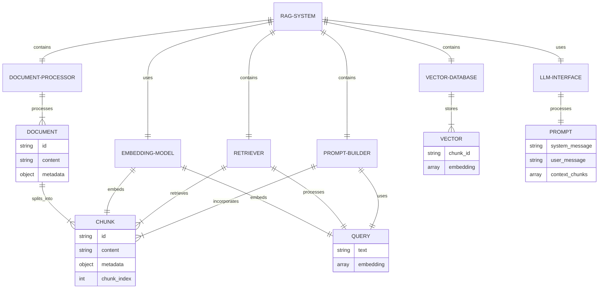

#### RAG系统交互关系图

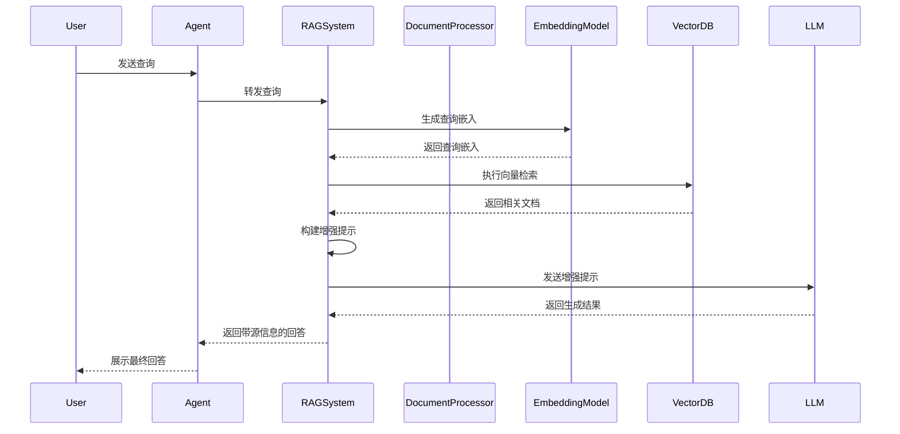

### 数学模型

在RAG系统中，可以使用以下数学模型：

1. **文本嵌入相似度计算**

对于查询 $q$ 和文档 $d$，它们的嵌入向量分别为 $\vec{q}$ 和 $\vec{d}$，余弦相似度计算如下：

$$\text{similarity}(q, d) = \frac{\vec{q} \cdot \vec{d}}{|\vec{q}||\vec{d}|} = \frac{\sum_{i=1}^{n} q_i d_i}{\sqrt{\sum_{i=1}^{n} q_i^2} \sqrt{\sum_{i=1}^{n} d_i^2}}$$

2. **检索相关性排序**

对于检索到的文档集合 $D = \{d_1, d_2, ..., d_k\}$，相似度分数为 $S = \{s_1, s_2, ..., s_k\}$，可以使用加权相关性分数：

$$\text{relevance}(d_i) = s_i \cdot \text{weight}(d_i)$$

其中 $\text{weight}(d_i)$ 可以基于文档的元数据、新鲜度等因素。

3. **最优检索数量确定**

为了平衡上下文长度和信息完整性，可以使用以下公式确定最优检索数量：

$$k_{opt} = \min\left(k_{max}, \left\lfloor\frac{C_{max} - C_{query} - C_{overhead}}{C_{avg}}\right\rfloor\right)$$

其中 $C_{max}$ 是LLM的上下文窗口大小，$C_{query}$ 是查询的token数，$C_{overhead}$ 是提示模板的token数，$C_{avg}$ 是平均文档块的token数。

### 算法流程图

以下是RAG系统处理查询的流程图：

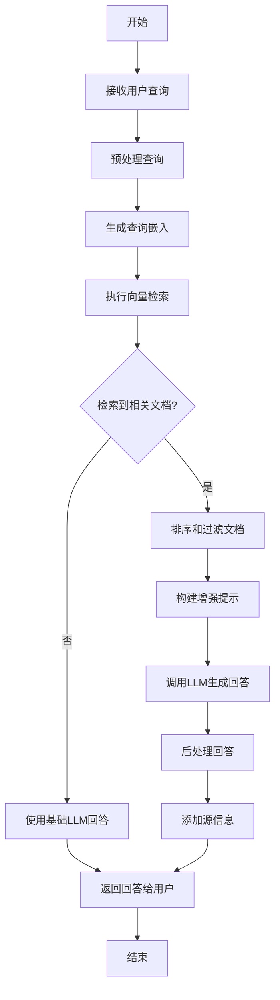

### 算法源代码

以下是一个高级RAG系统实现，包含查询重写和混合检索策略：

```python
import os
import json
import numpy as np
from typing import List, Dict, Any, Optional, Tuple, Union
import openai
from dotenv import load_dotenv
import faiss
from tqdm import tqdm
import tiktoken
import re
from sklearn.feature_extraction.text import TfidfVectorizer
from rank_bm25 import BM25Okapi

# 加载环境变量
load_dotenv()

# 配置OpenAI API密钥
openai.api_key = os.getenv("OPENAI_API_KEY")

class Document:
    """表示一个文档或文档块"""
    
    def __init__(self, text: str, metadata: Optional[Dict[str, Any]] = None):
        """
        初始化文档
        
        Args:
            text: 文档文本
            metadata: 文档元数据
        """
        self.text = text
        self.metadata = metadata or {}
    
    def __str__(self) -> str:
        return f"Document(text={self.text[:50]}..., metadata={self.metadata})"


class AdvancedRAGSystem:
    """高级RAG系统实现，包含查询重写和混合检索"""
    
    def __init__(self, 
                 embedding_model: str = "text-embedding-ada-002",
                 llm_model: str = "gpt-3.5-turbo",
                 chunk_size: int = 1000,
                 chunk_overlap: int = 200,
                 top_k: int = 4,
                 similarity_threshold: float = 0.7,
                 use_hybrid_search: bool = True,
                 use_query_rewriting: bool = True):
        """
        初始化高级RAG系统
        
        Args:
            embedding_model: 嵌入模型名称
            llm_model: LLM模型名称
            chunk_size: 文本块大小
            chunk_overlap: 文本块重叠大小
            top_k: 检索的文档数量
            similarity_threshold: 相似度阈值
            use_hybrid_search: 是否使用混合检索
            use_query_rewriting: 是否使用查询重写
        """
        self.embedding_model = embedding_model
        self.llm_model = llm_model
        self.chunk_size = chunk_size
        self.chunk_overlap = chunk_overlap
        self.top_k = top_k
        self.similarity_threshold = similarity_threshold
        self.use_hybrid_search = use_hybrid_search
        self.use_query_rewriting = use_query_rewriting
        
        # 初始化文档存储
        self.documents: List[Document] = []
        self.document_embeddings = None
        self.faiss_index = None
        
        # 初始化BM25索引
        self.bm25_index = None
        self.tfidf_vectorizer = None
        
        # 初始化tokenizer
        self.tokenizer = tiktoken.get_encoding("cl100k_base")
    
    def add_documents(self, documents: List[Document]):
        """添加文档到系统"""
        self.documents.extend(documents)
    
    def add_texts(self, texts: List[str], metadatas: Optional[List[Dict[str, Any]]] = None):
        """添加文本到系统"""
        if metadatas is None:
            metadatas = [{} for _ in texts]
        
        documents = [Document(text, metadata) for text, metadata in zip(texts, metadatas)]
        self.add_documents(documents)
    
    def load_directory(self, directory_path: str, glob_pattern: str = "**/*.txt"):
        """从目录加载文档"""
        import glob
        
        file_paths = glob.glob(os.path.join(directory_path, glob_pattern), recursive=True)
        
        for file_path in file_paths:
            try:
                with open(file_path, 'r', encoding='utf-8') as f:
                    content = f.read()
                
                metadata = {
                    "source": file_path,
                    "filename": os.path.basename(file_path)
                }
                
                self.add_texts([content], [metadata])
            except Exception as e:
                print(f"Error loading {file_path}: {str(e)}")
    
    def split_documents(self):
        """将文档分割为块"""
        chunked_documents = []
        
        for doc in self.documents:
            # 计算分块数量
            tokens = self.tokenizer.encode(doc.text)
            token_count = len(tokens)
            
            # 如果文档小于块大小，直接添加
            if token_count <= self.chunk_size:
                chunked_documents.append(doc)
                continue
            
            # 分块
            chunks = []
            for i in range(0, token_count, self.chunk_size - self.chunk_overlap):
                # 确保不超出范围
                end_idx = min(i + self.chunk_size, token_count)
                
                # 解码token为文本
                chunk_text = self.tokenizer.decode(tokens[i:end_idx])
                
                # 创建新的文档对象
                chunk_metadata = {
                    **doc.metadata,
                    "chunk_index": len(chunks),
                    "original_length": token_count
                }
                
                chunks.append(Document(chunk_text, chunk_metadata))
                
                # 如果已经处理完所有token，退出循环
                if end_idx == token_count:
                    break
            
            chunked_documents.extend(chunks)
        
        # 更新文档列表
        self.documents = chunked_documents
    
    def create_embeddings(self):
        """为所有文档创建嵌入向量"""
        if not self.documents:
            raise ValueError("No documents to embed")
        
        all_embeddings = []
        batch_size = 20  # OpenAI API建议的批处理大小
        
        for i in tqdm(range(0, len(self.documents), batch_size), desc="Creating embeddings"):
            # 获取当前批次
            batch_docs = self.documents[i:i+batch_size]
            batch_texts = [doc.text for doc in batch_docs]
            
            # 调用OpenAI API获取嵌入
            response = openai.Embedding.create(
                model=self.embedding_model,
                input=batch_texts
            )
            
            # 提取嵌入向量
            batch_embeddings = [item["embedding"] for item in response["data"]]
            all_embeddings.extend(batch_embeddings)
        
        # 转换为numpy数组
        self.document_embeddings = np.array(all_embeddings, dtype=np.float32)
        
        # 创建FAISS索引
        dimension = len(all_embeddings[0])
        self.faiss_index = faiss.IndexFlatL2(dimension)
        self.faiss_index.add(self.document_embeddings)
    
    def create_bm25_index(self):
        """创建BM25索引"""
        if not self.documents:
            raise ValueError("No documents to index")
        
        # 准备文档文本
        texts = [doc.text for doc in self.documents]
        
        # 分词
        tokenized_texts = [text.lower().split() for text in texts]
        
        # 创建BM25索引
        self.bm25_index = BM25Okapi(tokenized_texts)
        
        # 创建TF-IDF向量化器
        self.tfidf_vectorizer = TfidfVectorizer()
        self.tfidf_vectorizer.fit(texts)
    
    def build_indices(self):
        """构建所有索引"""
        print("Splitting documents...")
        self.split_documents()
        
        print("Creating embeddings...")
        self.create_embeddings()
        
        if self.use_hybrid_search:
            print("Creating BM25 index...")
            self.create_bm25_index()
    
    def rewrite_query(self, query: str) -> str:
        """
        使用LLM重写查询以提高检索效果
        
        Args:
            query: 原始查询
            
        Returns:
            重写后的查询
        """
        if not self.use_query_rewriting:
            return query
        
        prompt = f"""You are an AI assistant helping to improve search queries. 
Your task is to rewrite the given query to make it more effective for retrieving relevant information.
The rewritten query should:
1. Include important keywords from the original query
2. Be more specific and detailed
3. Include synonyms or related terms that might appear in relevant documents
4. Be formulated as a clear question or statement

Original query: {query}

Rewritten query:"""
        
        try:
            response = openai.ChatCompletion.create(
                model=self.llm_model,
                messages=[
                    {"role": "system", "content": "You are a query rewriting assistant."},
                    {"role": "user", "content": prompt}
                ],
                temperature=0.3,
                max_tokens=100
            )
            
            rewritten_query = response.choices[0].message.content.strip()
            
            # 如果重写结果太长，使用原始查询
            if len(rewritten_query) > len(query) * 3:
                return query
            
            return rewritten_query
            
        except Exception as e:
            print(f"Error rewriting query: {str(e)}")
            return query
    
    def get_query_embedding(self, query: str) -> np.ndarray:
        """获取查询的嵌入向量"""
        response = openai.Embedding.create(
            model=self.embedding_model,
            input=[query]
        )
        
        query_embedding = response["data"][0]["embedding"]
        return np.array([query_embedding], dtype=np.float32)
    
    def semantic_search(self, query: str, top_k: int) -> List[Tuple[Document, float]]:
        """
        执行语义搜索
        
        Args:
            query: 查询文本
            top_k: 返回的文档数量
            
        Returns:
            文档和相似度分数的列表
        """
        if self.faiss_index is None:
            raise ValueError("FAISS index not created. Call build_indices() first.")
        
        # 获取查询嵌入
        query_embedding = self.get_query_embedding(query)
        
        # 执行检索
        distances, indices = self.faiss_index.search(query_embedding, top_k)
        
        # 计算相似度分数 (1 - 归一化距离)
        max_distance = np.max(distances)
        if max_distance > 0:
            similarities = 1 - distances[0] / max_distance
        else:
            similarities = np.ones_like(distances[0])
        
        # 收集结果
        results = []
        for idx, similarity in zip(indices[0], similarities):
            if similarity >= self.similarity_threshold:
                results.append((self.documents[idx], float(similarity)))
        
        return results
    
    def keyword_search(self, query: str, top_k: int) -> List[Tuple[Document, float]]:
        """
        执行关键词搜索
        
        Args:
            query: 查询文本
            top_k: 返回的文档数量
            
        Returns:
            文档和相似度分数的列表
        """
        if self.bm25_index is None:
            raise ValueError("BM25 index not created. Call build_indices() first.")
        
        # 分词
        query_tokens = query.lower().split()
        
        # 执行BM25检索
        scores = self.bm25_index.get_scores(query_tokens)
        
        # 获取前top_k个结果
        top_indices = np.argsort(scores)[::-1][:top_k]
        
        # 归一化分数
        max_score = np.max(scores)
        if max_score > 0:
            normalized_scores = scores[top_indices] / max_score
        else:
            normalized_scores = np.zeros_like(top_indices, dtype=float)
        
        # 收集结果
        results = []
        for idx, score in zip(top_indices, normalized_scores):
            if score >= self.similarity_threshold:
                results.append((self.documents[idx], float(score)))
        
        return results
    
    def hybrid_search(self, query: str) -> List[Tuple[Document, float]]:
        """
        执行混合搜索（结合语义和关键词搜索）
        
        Args:
            query: 查询文本
            
        Returns:
            文档和相似度分数的列表
        """
        # 执行语义搜索
        semantic_results = self.semantic_search(query, self.top_k)
        
        if not self.use_hybrid_search:
            return semantic_results
        
        # 执行关键词搜索
        keyword_results = self.keyword_search(query, self.top_k)
        
        # 合并结果
        doc_scores = {}
        
        # 添加语义搜索结果，权重0.7
        for doc, score in semantic_results:
            doc_id = id(doc)
            doc_scores[doc_id] = {"doc": doc, "score": score * 0.7}
        
        # 添加关键词搜索结果，权重0.3
        for doc, score in keyword_results:
            doc_id = id(doc)
            if doc_id in doc_scores:
                doc_scores[doc_id]["score"] += score * 0.3
            else:
                doc_scores[doc_id] = {"doc": doc, "score": score * 0.3}
        
        # 转换为列表并排序
        results = [(item["doc"], item["score"]) for item in doc_scores.values()]
        results.sort(key=lambda x: x[1], reverse=True)
        
        # 限制结果数量
        return results[:self.top_k]
    
    def retrieve_documents(self, query: str) -> List[Tuple[Document, float]]:
        """
        检索相关文档
        
        Args:
            query: 查询文本
            
        Returns:
            文档和相似度分数的列表
        """
        # 重写查询
        if self.use_query_rewriting:
            rewritten_query = self.rewrite_query(query)
            print(f"Original query: {query}")
            print(f"Rewritten query: {rewritten_query}")
        else:
            rewritten_query = query
        
        # 执行混合搜索
        return self.hybrid_search(rewritten_query)
    
    def generate_prompt(self, query: str, retrieved_docs: List[Tuple[Document, float]]) -> str:
        """生成包含检索结果的提示"""
        context_parts = []
        
        for i, (doc, similarity) in enumerate(retrieved_docs, 1):
            source_info = f"Source: {doc.metadata.get('source', 'Unknown')}" if 'source' in doc.metadata else ""
            context_parts.append(f"[Document {i}] {source_info}\n{doc.text}\n")
        
        context = "\n".join(context_parts)
        
        prompt = f"""Answer the question based on the following context. If the context doesn't contain relevant information, acknowledge that and provide a general response based on your knowledge.

Context:
{context}

Question: {query}

Answer:"""
        
        return prompt
    
    def query(self, question: str) -> Dict[str, Any]:
        """查询RAG系统"""
        # 检索相关文档
        retrieved_docs = self.retrieve_documents(question)
        
        # 如果没有找到相关文档
        if not retrieved_docs:
            return {
                "answer": "I don't have specific information to answer this question accurately. Based on my general knowledge...",
                "sources": [],
                "has_context": False
            }
        
        # 生成提示
        prompt = self.generate_prompt(question, retrieved_docs)
        
        # 调用LLM
        try:
            response = openai.ChatCompletion.create(
                model=self.llm_model,
                messages=[
                    {"role": "system", "content": "You are a helpful assistant that answers questions based on the provided context. Always cite your sources when using information from the context."},
                    {"role": "user", "content": prompt}
                ],
                temperature=0.3,
                max_tokens=1000
            )
            
            answer = response.choices[0].message.content
            
            # 收集源文档信息
            sources = []
            for doc, similarity in retrieved_docs:
                if 'source' in doc.metadata:
                    source = doc.metadata['source']
                    if source not in sources:
                        sources.append(source)
            
            return {
                "answer": answer,
                "sources": sources,
                "has_context": True,
                "retrieved_docs": [(doc.text[:100] + "...", similarity) for doc, similarity in retrieved_docs]
            }
            
        except Exception as e:
            return {
                "answer": f"Error generating answer: {str(e)}",
                "sources": [],
                "has_context": True,
                "error": str(e)
            }
```

### 实际场景应用

#### 场景一：企业知识库Agent

RAG系统可以应用于企业内部知识库，帮助员工快速获取信息：

```python
# 创建企业知识库RAG系统
enterprise_rag = AdvancedRAGSystem(
    llm_model="gpt-4",
    chunk_size=500,
    chunk_overlap=100,
    top_k=5,
    use_hybrid_search=True,
    use_query_rewriting=True
)

# 加载企业文档
enterprise_rag.load_directory("enterprise_docs/")
enterprise_rag.build_indices()

# 创建企业知识库Agent
enterprise_agent = RAGAgent(
    model_interface=OpenAIInterface(model="gpt-4"),
    rag_system=enterprise_rag,
    system_message="""You are an enterprise knowledge assistant. 
    You help employees find information from the company's knowledge base. 
    Always cite your sources and be precise in your answers. 
    If you're not sure about something, acknowledge the limitations of your knowledge.""",
    always_use_rag=True
)

# 处理员工查询
query = "What is our company's policy on remote work?"
response = enterprise_agent.process_with_explicit_rag(query)
print(f"Answer: {response['answer']}")
print(f"Sources: {response['sources']}")
```

#### 场景二：医疗文献Agent

RAG系统可以帮助医疗专业人员查询最新研究文献：

```python
# 创建医疗文献RAG系统
medical_rag = AdvancedRAGSystem(
    llm_model="gpt-4",
    chunk_size=800,
    chunk_overlap=200,
    top_k=8,
    use_hybrid_search=True,
    use_query_rewriting=True
)

# 加载医疗文献
medical_rag.load_directory("medical_literature/")
medical_rag.build_indices()

# 创建医疗文献Agent
medical_agent = RAGAgent(
    model_interface=OpenAIInterface(model="gpt-4"),
    rag_system=medical_rag,
    system_message="""You are a medical research assistant. 
    You help healthcare professionals find relevant information from medical literature. 
    Always cite your sources and be precise in your answers. 
    Include relevant study details when available. 
    Emphasize that your responses are not medical advice and should be verified by qualified professionals.""",
    always_use_rag=True
)

# 处理医疗查询
query = "What are the latest findings on the efficacy of mRNA vaccines against new COVID variants?"
response = medical_agent.process_with_explicit_rag(query)
print(f"Answer: {response['answer']}")
print(f"Sources: {response['sources']}")
```

#### 场景三：法律助手Agent

RAG系统可以帮助律师和法律专业人员查询法律文件和案例：

```python
# 创建法律RAG系统
legal_rag = AdvancedRAGSystem(
    llm_model="gpt-4",
    chunk_size=1000,
    chunk_overlap=250,
    top_k=6,
    use_hybrid_search=True,
    use_query_rewriting=True
)

# 加载法律文件
legal_rag.load_directory("legal_documents/")
legal_rag.build_indices()

# 创建法律助手Agent
legal_agent = RAGAgent(
    model_interface=OpenAIInterface(model="gpt-4"),
    rag_system=legal_rag,
    system_message="""You are a legal research assistant. 
    You help legal professionals find relevant information from legal documents and case law. 
    Always cite your sources precisely with proper legal citations. 
    Emphasize that your responses are not legal advice and should be verified by qualified legal professionals. 
    Be precise in your language and avoid making definitive legal conclusions.""",
    always_use_rag=True
)

# 处理法律查询
query = "What are the key precedents for fair use doctrine in copyright cases involving AI-generated content?"
response = legal_agent.process_with_explicit_rag(query)
print(f"Answer: {response['answer']}")
print(f"Sources: {response['sources']}")
```

### 项目介绍

**项目名称**：EnhancedRAG

**项目目标**：提供一个高性能、可定制的RAG系统框架，支持多种检索策略和优化技术，便于集成到各类AI Agent应用中。

**核心功能**：
1. 多种文档加载和处理方式
2. 高效的文本分块和嵌入生成
3. 混合检索策略（语义+关键词）
4. 查询重写和优化
5. 多种向量数据库支持
6. 结果排序和过滤
7. 提示模板定制

### 环境安装

EnhancedRAG的安装步骤：

```bash
# 克隆仓库
git clone https://github.com/example/enhanced-rag.git
cd enhanced-rag

# 创建虚拟环境
python -m venv venv
source venv/bin/activate  # Linux/Mac
# venv\Scripts\activate  # Windows

# 安装依赖
pip install -r requirements.txt

# 配置环境变量
cp .env.example .env
# 编辑.env文件，添加API密钥
```

### 系统功能设计

EnhancedRAG提供以下核心功能：

1. **文档处理**：支持多种文件格式和数据源
2. **检索策略**：语义检索、关键词检索和混合检索
3. **查询优化**：查询重写、分解和扩展
4. **结果处理**：排序、过滤和去重
5. **提示构建**：自定义提示模板和格式
6. **评估工具**：检索质量和回答准确性评估

### 系统架构设计

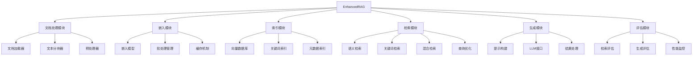

### 系统接口设计

EnhancedRAG提供以下核心接口：

```python
# 文档处理接口
rag.add_documents(documents: List[Document]) -> None
rag.add_texts(texts: List[str], metadatas: List[Dict]) -> None
rag.load_directory(directory: str, glob_pattern: str) -> None
rag.split_documents() -> None

# 索引构建接口
rag.build_indices() -> None
rag.save_indices(directory: str) -> None
rag.load_indices(directory: str) -> None

# 检索接口
rag.retrieve_documents(query: str) -> List[Tuple[Document, float]]
rag.semantic_search(query: str, top_k: int) -> List[Tuple[Document, float]]
rag.keyword_search(query: str, top_k: int) -> List[Tuple[Document, float]]
rag.hybrid_search(query: str) -> List[Tuple[Document, float]]

# 查询接口
rag.query(question: str) -> Dict[str, Any]
rag.query_with_sources(question: str) -> Dict[str, Any]
rag.batch_query(questions: List[str]) -> List[Dict[str, Any]]

# 评估接口
rag.evaluate_retrieval(queries: List[str], ground_truth: List[List[str]]) -> Dict[str, float]
rag.evaluate_generation(queries: List[str], expected_answers: List[str]) -> Dict[str, float]
```

### 系统核心实现源代码

以下是EnhancedRAG的查询优化模块实现：

```python
# rag/query_optimization.py
from typing import List, Dict, Any, Optional
import openai
import re

class QueryOptimizer:
    """查询优化器，提供查询重写、分解和扩展功能"""
    
    def __init__(self, 
                 llm_model: str = "gpt-3.5-turbo",
                 use_query_rewriting: bool = True,
                 use_query_decomposition: bool = False,
                 use_query_expansion: bool = False):
        """
        初始化查询优化器
        
        Args:
            llm_model: LLM模型名称
            use_query_rewriting: 是否使用查询重写
            use_query_decomposition: 是否使用查询分解
            use_query_expansion: 是否使用查询扩展
        """
        self.llm_model = llm_model
        self.use_query_rewriting = use_query_rewriting
        self.use_query_decomposition = use_query_decomposition
        self.use_query_expansion = use_query_expansion
    
    def optimize_query(self, query: str) -> Dict[str, Any]:
        """
        优化查询
        
        Args:
            query: 原始查询
            
        Returns:
            包含优化结果的字典
        """
        result = {
            "original_query": query,
            "optimized_query": query,
            "sub_queries": [],
            "expanded_queries": []
        }
        
        # 查询重写
        if self.use_query_rewriting:
            rewritten_query = self.rewrite_query(query)
            result["optimized_query"] = rewritten_query
        
        # 查询分解
        if self.use_query_decomposition:
            sub_queries = self.decompose_query(query)
            result["sub_queries"] = sub_queries
        
        # 查询扩展
        if self.use_query_expansion:
            expanded_queries = self.expand_query(query)
            result["expanded_queries"] = expanded_queries
        
        return result
    
    def rewrite_query(self, query: str) -> str:
        """
        重写查询以提高检索效果
        
        Args:
            query: 原始查询
            
        Returns:
            重写后的查询
        """
        prompt = f"""You are an AI assistant helping to improve search queries. 
Your task is to rewrite the given query to make it more effective for retrieving relevant information.
The rewritten query should:
1. Include important keywords from the original query
2. Be more specific and detailed
3. Include synonyms or related terms that might appear in relevant documents
4. Be formulated as a clear question or statement

Original query: {query}

Rewritten query:"""
        
        try:
            response = openai.ChatCompletion.create(
                model=self.llm_model,
                messages=[
                    {"role": "system", "content": "You are a query rewriting assistant."},
                    {"role": "user", "content": prompt}
                ],
                temperature=0.3,
                max_tokens=100
            )
            
            rewritten_query = response.choices[0].message.content.strip()
            
            # 如果重写结果太长，使用原始查询
            if len(rewritten_query) > len(query) * 3:
                return query
            
            return rewritten_query
            
        except Exception as e:
            print(f"Error rewriting query: {str(e)}")
            return query
    
    def decompose_query(self, query: str) -> List[str]:
        """
        将复杂查询分解为多个简单查询
        
        Args:
            query: 原始查询
            
        Returns:
            分解后的查询列表
        """
        prompt = f"""You are an AI assistant helping to decompose complex search queries into simpler sub-queries.
Your task is to break down the given query into 2-4 simpler, more focused sub-queries that together cover all aspects of the original query.
Each sub-query should be self-contained and focused on a specific aspect of the original query.

Original query: {query}

Sub-queries (output as a numbered list):"""
        
        try:
            response = openai.ChatCompletion.create(
                model=self.llm_model,
                messages=[
                    {"role": "system", "content": "You are a query decomposition assistant."},
                    {"role": "user", "content": prompt}
                ],
                temperature=0.3,
                max_tokens=200
            )
            
            decomposition_text = response.choices[0].message.content.strip()
            
            # 提取子查询
            sub_queries = []
            for line in decomposition_text.split("\n"):
                # 匹配"1. "、"2. "等格式
                match = re.match(r'^\d+\.\s+(.+)$', line.strip())
                if match:
                    sub_query = match.group(1).strip()
                    sub_queries.append(sub_query)
            
            # 如果没有成功提取子查询，返回原始查询
            if not sub_queries:
                return [query]
            
            return sub_queries
            
        except Exception as e:
            print(f"Error decomposing query: {str(e)}")
            return [query]
    
    def expand_query(self, query: str) -> List[str]:
        """
        扩展查询，生成包含同义词和相关术语的变体
        
        Args:
            query: 原始查询
            
        Returns:
            扩展后的查询列表
        """
        prompt = f"""You are an AI assistant helping to expand search queries with synonyms and related terms.
Your task is to generate 3-5 variations of the given query, each using different synonyms or related terms.
The variations should maintain the same meaning as the original query but use different wording.

Original query: {query}

Query variations (output as a numbered list):"""
        
        try:
            response = openai.ChatCompletion.create(
                model=self.llm_model,
                messages=[
                    {"role": "system", "content": "You are a query expansion assistant."},
                    {"role": "user", "content": prompt}
                ],
                temperature=0.5,
                max_tokens=200
            )
            
            expansion_text = response.choices[0].message.content.strip()
            
            # 提取变体
            variations = []
            for line in expansion_text.split("\n"):
                # 匹配"1. "、"2. "等格式
                match = re.match(r'^\d+\.\s+(.+)$', line.strip())
                if match:
                    variation = match.group(1).strip()
                    variations.append(variation)
            
            # 如果没有成功提取变体，返回原始查询
            if not variations:
                return [query]
            
            return variations
            
        except Exception as e:
            print(f"Error expanding query: {str(e)}")
            return [query]
```

以下是EnhancedRAG的混合检索模块实现：

```python
# rag/hybrid_retrieval.py
from typing import List, Dict, Any, Optional, Tuple
import numpy as np
from sklearn.feature_extraction.text import TfidfVectorizer
from rank_bm25 import BM25Okapi
import faiss
from .document import Document

class HybridRetriever:
    """混合检索器，结合语义检索和关键词检索"""
    
    def __init__(self, 
                 semantic_weight: float = 0.7,
                 keyword_weight: float = 0.3,
                 top_k: int = 5,
                 similarity_threshold: float = 0.6):
        """
        初始化混合检索器
        
        Args:
            semantic_weight: 语义检索权重
            keyword_weight: 关键词检索权重
            top_k: 返回的文档数量
            similarity_threshold: 相似度阈值
        """
        self.semantic_weight = semantic_weight
        self.keyword_weight = keyword_weight
        self.top_k = top_k
        self.similarity_threshold = similarity_threshold
        
        # 检查权重和是否为1
        total_weight = semantic_weight + keyword_weight
        if abs(total_weight - 1.0) > 1e-6:
            self.semantic_weight /= total_weight
            self.keyword_weight /= total_weight
    
    def retrieve(self, 
                query: str, 
                documents: List[Document],
                document_embeddings: np.ndarray,
                query_embedding: np.ndarray,
                bm25_index: Optional[BM25Okapi] = None) -> List[Tuple[Document, float]]:
        """
        执行混合检索
        
        Args:
            query: 查询文本
            documents: 文档列表
            document_embeddings: 文档嵌入向量
            query_embedding: 查询嵌入向量
            bm25_index: BM25索引
            
        Returns:
            文档和相似度分数的列表
        """
        # 执行语义检索
        semantic_results = self.semantic_search(
            query_embedding, documents, document_embeddings, self.top_k
        )
        
        # 如果没有BM25索引，只返回语义检索结果
        if bm25_index is None:
            return semantic_results
        
        # 执行关键词检索
        keyword_results = self.keyword_search(
            query, documents, bm25_index, self.top_k
        )
        
        # 合并结果
        return self.merge_results(semantic_results, keyword_results)
    
    def semantic_search(self, 
                       query_embedding: np.ndarray,
                       documents: List[Document],
                       document_embeddings: np.ndarray,
                       top_k: int) -> List[Tuple[Document, float]]:
        """
        执行语义搜索
        
        Args:
            query_embedding: 查询嵌入向量
            documents: 文档列表
            document_embeddings: 文档嵌入向量
            top_k: 返回的文档数量
            
        Returns:
            文档和相似度分数的列表
        """
        # 创建临时FAISS索引
        dimension = document_embeddings.shape[1]
        index = faiss.IndexFlatL2(dimension)
        index.add(document_embeddings)
        
        # 执行检索
        distances, indices = index.search(query_embedding, top_k)
        
        # 计算相似度分数 (1 - 归一化距离)
        max_distance = np.max(distances)
        if max_distance > 0:
            similarities = 1 - distances[0] / max_distance
        else:
            similarities = np.ones_like(distances[0])
        
        # 收集结果
        results = []
        for idx, similarity in zip(indices[0], similarities):
            if similarity >= self.similarity_threshold:
                results.append((documents[idx], float(similarity)))
        
        return results
    
    def keyword_search(self, 
                      query: str,
                      documents: List[Document],
                      bm25_index: BM25Okapi,
                      top_k: int) -> List[Tuple[Document, float]]:
        """
        执行关键词搜索
        
        Args:
            query: 查询文本
            documents: 文档列表
            bm25_index: BM25索引
            top_k: 返回的文档数量
            
        Returns:
            文档和相似度分数的列表
        """
        # 分词
        query_tokens = query.lower().split()
        
        # 执行BM25检索
        scores = bm25_index.get_scores(query_tokens)
        
        # 获取前top_k个结果
        top_indices = np.argsort(scores)[::-1][:top_k]
        
        # 归一化分数
        max_score = np.max(scores)
        if max_score > 0:
            normalized_scores = scores[top_indices] / max_score
        else:
            normalized_scores = np.zeros_like(top_indices, dtype=float)
        
        # 收集结果
        results = []
        for idx, score in zip(top_indices, normalized_scores):
            if score >= self.similarity_threshold:
                results.append((documents[idx], float(score)))
        
        return results
    
    def merge_results(self, 
                     semantic_results: List[Tuple[Document, float]],
                     keyword_results: List[Tuple[Document, float]]) -> List[Tuple[Document, float]]:
        """
        合并语义检索和关键词检索结果
        
        Args:
            semantic_results: 语义检索结果
            keyword_results: 关键词检索结果
            
        Returns:
            合并后的结果
        """
        # 合并结果
        doc_scores = {}
        
        # 添加语义搜索结果
        for doc, score in semantic_results:
            doc_id = id(doc)
            doc_scores[doc_id] = {"doc": doc, "score": score * self.semantic_weight}
        
        # 添加关键词搜索结果
        for doc, score in keyword_results:
            doc_id = id(doc)
            if doc_id in doc_scores:
                doc_scores[doc_id]["score"] += score * self.keyword_weight
            else:
                doc_scores[doc_id] = {"doc": doc, "score": score * self.keyword_weight}
        
        # 转换为列表并排序
        results = [(item["doc"], item["score"]) for item in doc_scores.values()]
        results.sort(key=lambda x: x[1], reverse=True)
        
        # 限制结果数量
        return results[:self.top_k]
```

### 最佳实践小贴士

1. **文档分块策略**：根据内容语义而非固定长度分块，保持上下文完整性
2. **嵌入模型选择**：针对特定领域选择专门的嵌入模型，提高语义理解能力
3. **混合检索优化**：根据查询类型动态调整语义和关键词检索的权重
4. **查询预处理**：移除停用词、标准化专业术语、扩展缩写
5. **上下文组织**：按相关性排序文档，并在提示中明确标记文档边界
6. **源信息保留**：在检索结果中保留文档元数据，便于引用和溯源
7. **缓存机制**：缓存常见查询的检索结果，减少API调用和计算开销
8. **批量处理**：批量生成嵌入向量，减少API调用次数
9. **增量更新**：支持知识库增量更新，避免全量重建索引
10. **评估与优化**：定期评估检索质量和回答准确性，持续优化系统参数

### 拓展阅读

1. [Retrieval-Augmented Generation for Knowledge-Intensive NLP Tasks](https://arxiv.org/abs/2005.11401)
2. [Self-RAG: Learning to Retrieve, Generate, and Critique through Self-Reflection](https://arxiv.org/abs/2310.11511)
3. [In-Context Retrieval-Augmented Language Models](https://arxiv.org/abs/2302.00083)
4. [Improving Language Models by Retrieving from Trillions of Tokens](https://arxiv.org/abs/2112.04426)
5. [Hybrid Search: Combining BM25 and Dense Retrieval](https://www.pinecone.io/learn/hybrid-search/)
6. [LangChain RAG Documentation](https://python.langchain.com/docs/use_cases/question_answering/)

### 行业发展与未来趋势

RAG系统技术正在快速发展，以下是主要趋势：

| 趋势 | 描述 | 影响 | 时间框架 |
|------|------|------|---------|
| 多模态RAG | 扩展到图像、音频、视频等多模态内容 | 丰富知识来源，提升理解能力 | 现在-2年内 |
| 自适应检索 | 根据查询特点动态调整检索策略 | 提高检索精度，优化资源使用 | 现在-1年内 |
| 递归检索 | 基于初始回答进行二次检索和精炼 | 提高复杂问题的回答质量 | 现在-1年内 |
| 知识图谱集成 | 结合结构化知识和关系推理 | 增强逻辑推理能力，减少幻觉 | 1-2年内 |
| 自监督优化 | 系统自动评估和优化检索策略 | 减少人工干预，提高适应性 | 1-3年内 |
| 联邦RAG | 跨多个知识库和组织的分布式检索 | 扩大知识覆盖，保护数据隐私 | 2-3年内 |
| 实时RAG | 集成实时数据源和流处理 | 提供最新信息，支持实时决策 | 1-2年内 |
| 个性化RAG | 根据用户背景和历史定制检索策略 | 提高相关性，改善用户体验 | 现在-2年内 |

### 本章小结

本节详细介绍了如何将检索增强生成（RAG）系统集成到AI Agent中，以提升其知识应用能力和回答准确性。我们探讨了RAG系统的核心组件、实现方法和优化策略，包括文档处理、嵌入生成、向量索引、混合检索和查询优化等关键技术。

通过RAG系统，Agent能够访问最新信息、专业领域知识和私有数据，有效克服LLM知识截止日期和幻觉等局限性。我们提供了从基础实现到高级优化的完整代码示例，并展示了在企业知识库、医疗文献和法律助手等实际场景中的应用。

随着技术的发展，RAG系统正向多模态、自适应检索、知识图谱集成等方向演进，将进一步提升AI Agent的知识处理能力和应用价值。掌握RAG系统集成技术，是构建高性能、高可靠性AI Agent的关键一步。

在下一节中，我们将探讨如何开发AI Agent的工具使用能力，使其能够与外部API和服务交互，进一步扩展功能边界。

## 6.4 工具使用能力开发

### 核心概念

工具使用能力是指AI Agent能够识别、选择和调用外部工具（如API、函数、服务）来完成特定任务的能力。通过工具使用，Agent可以突破LLM固有的局限性，实现数据检索、计算、外部系统交互等功能，大幅扩展其应用场景和能力边界。

### 问题背景介绍

尽管现代LLM具备强大的语言理解和生成能力，但它们仍然存在明显的局限性：

1. **无法访问实时信息**：LLM的知识在训练截止日期后不再更新
2. **计算能力有限**：复杂计算和数值处理容易出错
3. **无法直接与外部系统交互**：不能直接访问数据库、API或执行操作
4. **无法执行代码**：不能运行代码来解决编程问题
5. **无法访问用户特定数据**：不能直接访问用户的私有数据

工具使用能力的开发旨在解决这些问题，使Agent能够根据需要调用适当的工具，显著扩展其功能范围和应用场景。

### 问题描述

在开发AI Agent的工具使用能力时，开发者通常面临以下挑战：

1. 如何设计工具接口，使LLM能够正确理解和使用
2. 如何实现工具选择逻辑，确保Agent选择最合适的工具
3. 如何处理工具调用的参数解析和错误处理
4. 如何管理多步骤工具调用和状态维护
5. 如何评估和优化工具使用的效果
6. 如何确保工具使用的安全性和合规性

### 问题解决

#### 工具使用架构设计

一个完整的工具使用系统通常包含以下核心组件：

1. **工具注册器**：管理可用工具的注册和元数据
2. **工具选择器**：根据用户需求选择合适的工具
3. **参数解析器**：解析LLM生成的工具参数
4. **工具执行器**：执行工具调用并获取结果
5. **结果处理器**：处理工具执行结果并生成响应
6. **上下文管理器**：维护工具使用的上下文和状态

以下是工具使用系统的架构图：

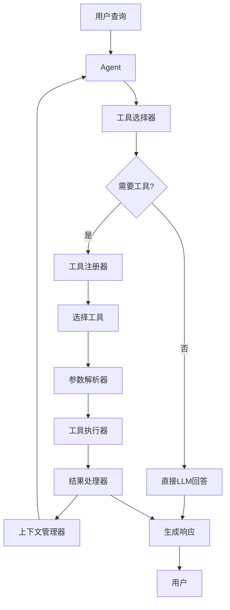

#### 基础工具使用实现

下面是一个基于函数调用的工具使用系统实现：

```python
import os
import json
import datetime
import requests
from typing import List, Dict, Any, Optional, Callable, Union
import openai
from dotenv import load_dotenv

# 加载环境变量
load_dotenv()

# 配置OpenAI API密钥
openai.api_key = os.getenv("OPENAI_API_KEY")

class Tool:
    """表示一个可被Agent使用的工具"""
    
    def __init__(self, 
                 name: str,
                 description: str,
                 function: Callable,
                 parameters: Dict[str, Any]):
        """
        初始化工具
        
        Args:
            name: 工具名称
            description: 工具描述
            function: 工具函数
            parameters: 参数定义
        """
        self.name = name
        self.description = description
        self.function = function
        self.parameters = parameters
    
    def to_openai_function(self) -> Dict[str, Any]:
        """转换为OpenAI函数格式"""
        return {
            "name": self.name,
            "description": self.description,
            "parameters": {
                "type": "object",
                "properties": self.parameters,
                "required": [k for k, v in self.parameters.items() if v.get("required", False)]
            }
        }
    
    def execute(self, **kwargs) -> Any:
        """
        执行工具函数
        
        Args:
            **kwargs: 函数参数
            
        Returns:
            函数执行结果
        """
        return self.function(**kwargs)


class ToolRegistry:
    """工具注册器，管理可用工具"""
    
    def __init__(self):
        """初始化工具注册器"""
        self.tools: Dict[str, Tool] = {}
    
    def register_tool(self, tool: Tool):
        """
        注册工具
        
        Args:
            tool: 工具实例
        """
        self.tools[tool.name] = tool
    
    def get_tool(self, name: str) -> Optional[Tool]:
        """
        获取工具
        
        Args:
            name: 工具名称
            
        Returns:
            工具实例，如果不存在则返回None
        """
        return self.tools.get(name)
    
    def get_all_tools(self) -> List[Tool]:
        """
        获取所有工具
        
        Returns:
            工具列表
        """
        return list(self.tools.values())
    
    def get_openai_functions(self) -> List[Dict[str, Any]]:
        """
        获取OpenAI函数格式的工具列表
        
        Returns:
            OpenAI函数列表
        """
        return [tool.to_openai_function() for tool in self.tools.values()]


class ToolUsingAgent:
    """具备工具使用能力的Agent"""
    
    def __init__(self, 
                 model: str = "gpt-3.5-turbo-0613",
                 system_message: str = "You are a helpful assistant with access to tools.",
                 temperature: float = 0.7,
                 max_tokens: int = 1000):
        """
        初始化Agent
        
        Args:
            model: 使用的LLM模型名称
            system_message: 系统提示信息
            temperature: 生成的随机性参数
            max_tokens: 生成的最大token数
        """
        self.model = model
        self.system_message = system_message
        self.temperature = temperature
        self.max_tokens = max_tokens
        self.conversation_history = []
        self.tool_registry = ToolRegistry()
        self.initialize_conversation()
    
    def initialize_conversation(self):
        """初始化对话历史"""
        self.conversation_history = [
            {"role": "system", "content": self.system_message}
        ]
    
    def register_tool(self, tool: Tool):
        """
        注册工具
        
        Args:
            tool: 工具实例
        """
        self.tool_registry.register_tool(tool)
    
    def add_message(self, role: str, content: str):
        """
        添加消息到对话历史
        
        Args:
            role: 消息角色 (system, user, assistant)
            content: 消息内容
        """
        self.conversation_history.append({"role": role, "content": content})
    
    def process_input(self, user_input: str) -> str:
        """
        处理用户输入并返回响应
        
        Args:
            user_input: 用户输入文本
            
        Returns:
            Agent的响应文本
        """
        # 添加用户消息到历史
        self.add_message("user", user_input)
        
        try:
            # 获取可用工具
            functions = self.tool_registry.get_openai_functions()
            
            # 调用LLM获取响应
            response = openai.ChatCompletion.create(
                model=self.model,
                messages=self.conversation_history,
                functions=functions,
                function_call="auto",  # 自动决定是否调用函数
                max_tokens=self.max_tokens,
                temperature=self.temperature
            )
            
            # 提取助手响应
            assistant_message = response.choices[0].message
            
            # 检查是否需要调用函数
            if assistant_message.get("function_call"):
                # 获取函数调用信息
                function_call = assistant_message["function_call"]
                function_name = function_call["name"]
                function_args = json.loads(function_call["arguments"])
                
                # 获取工具
                tool = self.tool_registry.get_tool(function_name)
                if tool:
                    # 执行工具函数
                    function_response = tool.execute(**function_args)
                    
                    # 将函数调用和结果添加到历史
                    self.add_message("assistant", assistant_message)
                    self.add_message(
                        "function",
                        {
                            "name": function_name,
                            "content": json.dumps(function_response)
                        }
                    )
                    
                    # 再次调用LLM获取最终响应
                    second_response = openai.ChatCompletion.create(
                        model=self.model,
                        messages=self.conversation_history,
                        max_tokens=self.max_tokens,
                        temperature=self.temperature
                    )
                    
                    # 提取最终响应
                    final_response = second_response.choices[0].message["content"]
                    
                    # 添加最终响应到历史
                    self.add_message("assistant", final_response)
                    
                    return final_response
                else:
                    error_message = f"Tool '{function_name}' not found"
                    self.add_message("assistant", error_message)
                    return error_message
            else:
                # 直接返回助手响应
                assistant_response = assistant_message["content"]
                
                # 添加助手响应到历史
                self.add_message("assistant", assistant_response)
                
                return assistant_response
            
        except Exception as e:
            error_message = f"Error: {str(e)}"
            print(error_message)
            return f"I encountered an error while processing your request. Please try again later."
    
    def clear_history(self):
        """清除对话历史，保留系统消息"""
        self.initialize_conversation()
    
    def get_conversation_history(self) -> List[Dict[str, Any]]:
        """获取完整对话历史"""
        return self.conversation_history
```

#### 实现常用工具

以下是一些常用工具的实现示例：

##### 1. 天气查询工具


```python
def get_weather(location: str, unit: str = "celsius") -> Dict[str, Any]:
    """
    获取指定位置的天气信息
    
    Args:
        location: 位置名称
        unit: 温度单位 (celsius 或 fahrenheit)
        
    Returns:
        天气信息
    """
    # 这里应该调用实际的天气API
    # 为了示例，返回模拟数据
    weather_data = {
        "location": location,
        "temperature": 25 if unit == "celsius" else 77,
        "unit": unit,
        "condition": "Sunny",
        "humidity": 60,
        "wind_speed": 10,
        "forecast": [
            {"day": "Today", "condition": "Sunny", "max": 28, "min": 20},
            {"day": "Tomorrow", "condition": "Partly Cloudy", "max": 26, "min": 19}
        ]
    }
    
    return weather_data

# 创建天气工具
weather_tool = Tool(
    name="get_weather",
    description="Get the current weather and forecast for a specific location",
    function=get_weather,
    parameters={
        "location": {
            "type": "string",
            "description": "The city and state or country (e.g., 'San Francisco, CA' or 'Paris, France')",
            "required": True
        },
        "unit": {
            "type": "string",
            "description": "The temperature unit, either 'celsius' or 'fahrenheit'",
            "enum": ["celsius", "fahrenheit"],
            "default": "celsius"
        }
    }
)
```

##### 2. 搜索工具

```python
def search_web(query: str, num_results: int = 5) -> List[Dict[str, str]]:
    """
    搜索网络获取信息
    
    Args:
        query: 搜索查询
        num_results: 返回结果数量
        
    Returns:
        搜索结果列表
    """
    # 这里应该调用实际的搜索API
    # 为了示例，返回模拟数据
    search_results = [
        {
            "title": f"Result {i+1} for: {query}",
            "url": f"https://example.com/result{i+1}",
            "snippet": f"This is a snippet of search result {i+1} for the query: {query}..."
        }
        for i in range(num_results)
    ]
    
    return search_results

# 创建搜索工具
search_tool = Tool(
    name="search_web",
    description="Search the web for information on a specific topic",
    function=search_web,
    parameters={
        "query": {
            "type": "string",
            "description": "The search query",
            "required": True
        },
        "num_results": {
            "type": "integer",
            "description": "The number of search results to return",
            "default": 5,
            "minimum": 1,
            "maximum": 10
        }
    }
)
```

##### 3. 计算器工具

```python
def calculate(expression: str) -> Dict[str, Any]:
    """
    计算数学表达式
    
    Args:
        expression: 数学表达式
        
    Returns:
        计算结果
    """
    try:
        # 安全地评估表达式
        # 注意：在生产环境中应使用更安全的方法
        result = eval(expression)
        return {
            "expression": expression,
            "result": result
        }
    except Exception as e:
        return {
            "expression": expression,
            "error": str(e)
        }

# 创建计算器工具
calculator_tool = Tool(
    name="calculate",
    description="Calculate the result of a mathematical expression",
    function=calculate,
    parameters={
        "expression": {
            "type": "string",
            "description": "The mathematical expression to calculate (e.g., '2 + 2 * 3')",
            "required": True
        }
    }
)
```

##### 4. 日期时间工具

```python
def get_date_time(timezone: str = "UTC") -> Dict[str, str]:
    """
    获取当前日期和时间
    
    Args:
        timezone: 时区
        
    Returns:
        日期和时间信息
    """
    from datetime import datetime
    import pytz
    
    try:
        tz = pytz.timezone(timezone)
        now = datetime.now(tz)
        
        return {
            "timezone": timezone,
            "date": now.strftime("%Y-%m-%d"),
            "time": now.strftime("%H:%M:%S"),
            "day_of_week": now.strftime("%A"),
            "iso_format": now.isoformat()
        }
    except Exception as e:
        return {
            "error": str(e)
        }

# 创建日期时间工具
datetime_tool = Tool(
    name="get_date_time",
    description="Get the current date and time in a specific timezone",
    function=get_date_time,
    parameters={
        "timezone": {
            "type": "string",
            "description": "The timezone (e.g., 'UTC', 'America/New_York', 'Europe/London')",
            "default": "UTC"
        }
    }
)
```

##### 5. 数据库查询工具

```python
def query_database(query_type: str, parameters: Dict[str, Any]) -> Dict[str, Any]:
    """
    查询数据库
    
    Args:
        query_type: 查询类型
        parameters: 查询参数
        
    Returns:
        查询结果
    """
    # 这里应该连接实际的数据库
    # 为了示例，返回模拟数据
    
    if query_type == "product":
        # 模拟产品查询
        product_id = parameters.get("product_id")
        return {
            "product_id": product_id,
            "name": f"Product {product_id}",
            "price": 99.99,
            "category": "Electronics",
            "in_stock": True
        }
    
    elif query_type == "customer":
        # 模拟客户查询
        customer_id = parameters.get("customer_id")
        return {
            "customer_id": customer_id,
            "name": f"Customer {customer_id}",
            "email": f"customer{customer_id}@example.com",
            "membership": "Gold",
            "since": "2020-01-01"
        }
    
    elif query_type == "order":
        # 模拟订单查询
        order_id = parameters.get("order_id")
        return {
            "order_id": order_id,
            "customer_id": "C12345",
            "date": "2023-01-15",
            "items": [
                {"product_id": "P1", "quantity": 2, "price": 199.98},
                {"product_id": "P2", "quantity": 1, "price": 49.99}
            ],
            "total": 249.97,
            "status": "Shipped"
        }
    
    else:
        return {
            "error": f"Unknown query type: {query_type}"
        }

# 创建数据库查询工具
database_tool = Tool(
    name="query_database",
    description="Query the database for information about products, customers, or orders",
    function=query_database,
    parameters={
        "query_type": {
            "type": "string",
            "description": "The type of query to perform",
            "enum": ["product", "customer", "order"],
            "required": True
        },
        "parameters": {
            "type": "object",
            "description": "The query parameters",
            "properties": {
                "product_id": {"type": "string"},
                "customer_id": {"type": "string"},
                "order_id": {"type": "string"}
            },
            "required": True
        }
    }
)
```

#### 高级工具使用实现

以下是一个支持多步骤工具调用和工具组合的高级实现：

```python
import os
import json
import datetime
import requests
from typing import List, Dict, Any, Optional, Callable, Union, Tuple
import openai
from dotenv import load_dotenv

# 加载环境变量
load_dotenv()

# 配置OpenAI API密钥
openai.api_key = os.getenv("OPENAI_API_KEY")

class Tool:
    """表示一个可被Agent使用的工具"""
    
    def __init__(self, 
                 name: str,
                 description: str,
                 function: Callable,
                 parameters: Dict[str, Any],
                 required_permissions: Optional[List[str]] = None):
        """
        初始化工具
        
        Args:
            name: 工具名称
            description: 工具描述
            function: 工具函数
            parameters: 参数定义
            required_permissions: 所需权限
        """
        self.name = name
        self.description = description
        self.function = function
        self.parameters = parameters
        self.required_permissions = required_permissions or []
    
    def to_openai_function(self) -> Dict[str, Any]:
        """转换为OpenAI函数格式"""
        return {
            "name": self.name,
            "description": self.description,
            "parameters": {
                "type": "object",
                "properties": self.parameters,
                "required": [k for k, v in self.parameters.items() if v.get("required", False)]
            }
        }
    
    def execute(self, **kwargs) -> Any:
        """执行工具函数"""
        return self.function(**kwargs)


class ToolRegistry:
    """工具注册器，管理可用工具"""
    
    def __init__(self):
        """初始化工具注册器"""
        self.tools: Dict[str, Tool] = {}
        self.categories: Dict[str, List[str]] = {}
    
    def register_tool(self, tool: Tool, categories: Optional[List[str]] = None):
        """
        注册工具
        
        Args:
            tool: 工具实例
            categories: 工具类别
        """
        self.tools[tool.name] = tool
        
        # 添加到类别
        if categories:
            for category in categories:
                if category not in self.categories:
                    self.categories[category] = []
                if tool.name not in self.categories[category]:
                    self.categories[category].append(tool.name)
    
    def get_tool(self, name: str) -> Optional[Tool]:
        """获取工具"""
        return self.tools.get(name)
    
    def get_tools_by_category(self, category: str) -> List[Tool]:
        """获取指定类别的工具"""
        tool_names = self.categories.get(category, [])
        return [self.tools[name] for name in tool_names if name in self.tools]
    
    def get_all_tools(self) -> List[Tool]:
        """获取所有工具"""
        return list(self.tools.values())
    
    def get_openai_functions(self, categories: Optional[List[str]] = None) -> List[Dict[str, Any]]:
        """
        获取OpenAI函数格式的工具列表
        
        Args:
            categories: 工具类别，如果指定则只返回这些类别的工具
            
        Returns:
            OpenAI函数列表
        """
        if categories:
            # 获取指定类别的工具
            tools = []
            for category in categories:
                tools.extend(self.get_tools_by_category(category))
            return [tool.to_openai_function() for tool in tools]
        else:
            # 获取所有工具
            return [tool.to_openai_function() for tool in self.tools.values()]


class ToolExecutionContext:
    """工具执行上下文，管理工具执行状态和结果"""
    
    def __init__(self):
        """初始化工具执行上下文"""
        self.execution_history: List[Dict[str, Any]] = []
        self.results_cache: Dict[str, Any] = {}
    
    def add_execution(self, tool_name: str, parameters: Dict[str, Any], result: Any):
        """
        添加工具执行记录
        
        Args:
            tool_name: 工具名称
            parameters: 执行参数
            result: 执行结果
        """
        execution = {
            "tool": tool_name,
            "parameters": parameters,
            "result": result,
            "timestamp": datetime.datetime.now().isoformat()
        }
        
        self.execution_history.append(execution)
        
        # 缓存结果
        cache_key = f"{tool_name}:{json.dumps(parameters, sort_keys=True)}"
        self.results_cache[cache_key] = result
    
    def get_cached_result(self, tool_name: str, parameters: Dict[str, Any]) -> Optional[Any]:
        """
        获取缓存的执行结果
        
        Args:
            tool_name: 工具名称
            parameters: 执行参数
            
        Returns:
            缓存的结果，如果不存在则返回None
        """
        cache_key = f"{tool_name}:{json.dumps(parameters, sort_keys=True)}"
        return self.results_cache.get(cache_key)
    
    def get_last_execution(self) -> Optional[Dict[str, Any]]:
        """
        获取最近的执行记录
        
        Returns:
            最近的执行记录，如果不存在则返回None
        """
        if self.execution_history:
            return self.execution_history[-1]
        return None
    
    def get_execution_history(self) -> List[Dict[str, Any]]:
        """
        获取完整执行历史
        
        Returns:
            执行历史列表
        """
        return self.execution_history
    
    def clear(self):
        """清除执行上下文"""
        self.execution_history = []
        self.results_cache = {}


class AdvancedToolUsingAgent:
    """高级工具使用Agent，支持多步骤工具调用和工具组合"""
    
    def __init__(self, 
                 model: str = "gpt-3.5-turbo-0613",
                 system_message: str = "You are a helpful assistant with access to tools.",
                 temperature: float = 0.7,
                 max_tokens: int = 1000,
                 max_tool_calls: int = 10):
        """
        初始化Agent
        
        Args:
            model: 使用的LLM模型名称
            system_message: 系统提示信息
            temperature: 生成的随机性参数
            max_tokens: 生成的最大token数
            max_tool_calls: 单次对话中最大工具调用次数
        """
        self.model = model
        self.system_message = system_message
        self.temperature = temperature
        self.max_tokens = max_tokens
        self.max_tool_calls = max_tool_calls
        self.conversation_history = []
        self.tool_registry = ToolRegistry()
        self.tool_context = ToolExecutionContext()
        self.initialize_conversation()
    
    def initialize_conversation(self):
        """初始化对话历史"""
        self.conversation_history = [
            {"role": "system", "content": self.system_message}
        ]
    
    def register_tool(self, tool: Tool, categories: Optional[List[str]] = None):
        """
        注册工具
        
        Args:
            tool: 工具实例
            categories: 工具类别
        """
        self.tool_registry.register_tool(tool, categories)
    
    def add_message(self, role: str, content: Union[str, Dict[str, Any]]):
        """
        添加消息到对话历史
        
        Args:
            role: 消息角色 (system, user, assistant, function)
            content: 消息内容
        """
        self.conversation_history.append({"role": role, "content": content})
    
    def process_input(self, user_input: str, tool_categories: Optional[List[str]] = None) -> str:
        """
        处理用户输入并返回响应
        
        Args:
            user_input: 用户输入文本
            tool_categories: 可用工具类别，如果指定则只使用这些类别的工具
            
        Returns:
            Agent的响应文本
        """
        # 添加用户消息到历史
        self.add_message("user", user_input)
        
        # 工具调用计数
        tool_call_count = 0
        
        try:
            # 获取可用工具
            functions = self.tool_registry.get_openai_functions(tool_categories)
            
            # 多轮工具调用循环
            while tool_call_count < self.max_tool_calls:
                # 调用LLM获取响应
                response = openai.ChatCompletion.create(
                    model=self.model,
                    messages=self.conversation_history,
                    functions=functions,
                    function_call="auto",
                    max_tokens=self.max_tokens,
                    temperature=self.temperature
                )
                
                # 提取助手响应
                assistant_message = response.choices[0].message
                
                # 检查是否需要调用函数
                if assistant_message.get("function_call"):
                    # 增加工具调用计数
                    tool_call_count += 1
                    
                    # 获取函数调用信息
                    function_call = assistant_message["function_call"]
                    function_name = function_call["name"]
                    
                    try:
                        function_args = json.loads(function_call["arguments"])
                    except json.JSONDecodeError:
                        # 处理参数解析错误
                        error_message = "Error parsing function arguments"
                        self.add_message("assistant", assistant_message)
                        self.add_message(
                            "function",
                            {
                                "name": function_name,
                                "content": json.dumps({"error": error_message})
                            }
                        )
                        continue
                    
                    # 获取工具
                    tool = self.tool_registry.get_tool(function_name)
                    if tool:
                        # 检查缓存
                        cached_result = self.tool_context.get_cached_result(function_name, function_args)
                        if cached_result:
                            function_response = cached_result
                        else:
                            # 执行工具函数
                            try:
                                function_response = tool.execute(**function_args)
                                # 添加到执行上下文
                                self.tool_context.add_execution(function_name, function_args, function_response)
                            except Exception as e:
                                function_response = {"error": str(e)}
                        
                        # 将函数调用和结果添加到历史
                        self.add_message("assistant", assistant_message)
                        self.add_message(
                            "function",
                            {
                                "name": function_name,
                                "content": json.dumps(function_response)
                            }
                        )
                    else:
                        # 工具不存在
                        error_message = f"Tool '{function_name}' not found"
                        self.add_message("assistant", assistant_message)
                        self.add_message(
                            "function",
                            {
                                "name": function_name,
                                "content": json.dumps({"error": error_message})
                            }
                        )
                else:
                    # 直接返回助手响应
                    assistant_response = assistant_message["content"]
                    
                    # 添加助手响应到历史
                    self.add_message("assistant", assistant_response)
                    
                    return assistant_response
            
            # 如果达到最大工具调用次数，生成最终响应
            final_response = openai.ChatCompletion.create(
                model=self.model,
                messages=self.conversation_history,
                max_tokens=self.max_tokens,
                temperature=self.temperature
            )
            
            # 提取最终响应
            final_content = final_response.choices[0].message["content"]
            
            # 添加最终响应到历史
            self.add_message("assistant", final_content)
            
            return final_content
            
        except Exception as e:
            error_message = f"Error: {str(e)}"
            print(error_message)
            return f"I encountered an error while processing your request: {str(e)}"
    
    def clear_history(self):
        """清除对话历史和工具执行上下文"""
        self.initialize_conversation()
        self.tool_context.clear()
    
    def get_conversation_history(self) -> List[Dict[str, Any]]:
        """获取完整对话历史"""
        return self.conversation_history
    
    def get_tool_execution_history(self) -> List[Dict[str, Any]]:
        """获取工具执行历史"""
        return self.tool_context.get_execution_history()
```

#### 工具组合示例

以下是一个结合多个工具的旅行助手示例：

```python
# 创建旅行助手Agent
travel_agent = AdvancedToolUsingAgent(
    model="gpt-4",
    system_message="""You are a helpful travel assistant with access to various tools. 
    You can help users plan trips, check weather, find attractions, and more. 
    Use the appropriate tools to provide accurate and helpful information.
    Always explain your reasoning and the information you find.""",
    temperature=0.5
)

# 注册天气工具
travel_agent.register_tool(weather_tool, categories=["weather", "travel"])

# 实现酒店搜索工具
def search_hotels(location: str, check_in: str, check_out: str, guests: int = 2) -> List[Dict[str, Any]]:
    """
    搜索酒店
    
    Args:
        location: 位置
        check_in: 入住日期 (YYYY-MM-DD)
        check_out: 退房日期 (YYYY-MM-DD)
        guests: 客人数量
        
    Returns:
        酒店列表
    """
    # 这里应该调用实际的酒店API
    # 为了示例，返回模拟数据
    hotels = [
        {
            "name": f"Grand Hotel {location}",
            "rating": 4.7,
            "price_per_night": 199.99,
            "address": f"123 Main St, {location}",
            "amenities": ["Pool", "Spa", "Restaurant", "Free WiFi"]
        },
        {
            "name": f"Comfort Inn {location}",
            "rating": 4.2,
            "price_per_night": 129.99,
            "address": f"456 Oak Ave, {location}",
            "amenities": ["Free Breakfast", "Gym", "Free WiFi"]
        },
        {
            "name": f"Budget Stay {location}",
            "rating": 3.8,
            "price_per_night": 89.99,
            "address": f"789 Pine Rd, {location}",
            "amenities": ["Free WiFi", "Free Parking"]
        }
    ]
    
    return hotels

hotel_tool = Tool(
    name="search_hotels",
    description="Search for hotels in a specific location",
    function=search_hotels,
    parameters={
        "location": {
            "type": "string",
            "description": "The city and state or country",
            "required": True
        },
        "check_in": {
            "type": "string",
            "description": "Check-in date in YYYY-MM-DD format",
            "required": True
        },
        "check_out": {
            "type": "string",
            "description": "Check-out date in YYYY-MM-DD format",
            "required": True
        },
        "guests": {
            "type": "integer",
            "description": "Number of guests",
            "default": 2,
            "minimum": 1
        }
    }
)

travel_agent.register_tool(hotel_tool, categories=["accommodation", "travel"])

# 实现景点搜索工具
def search_attractions(location: str, category: str = "all", top_k: int = 5) -> List[Dict[str, Any]]:
    """
    搜索景点
    
    Args:
        location: 位置
        category: 景点类别
        top_k: 返回结果数量
        
    Returns:
        景点列表
    """
    # 这里应该调用实际的景点API
    # 为了示例，返回模拟数据
    attractions = [
        {
            "name": f"{location} Museum of Art",
            "category": "Museum",
            "rating": 4.6,
            "description": "A world-class art museum featuring works from around the globe.",
            "address": f"100 Museum Dr, {location}",
            "price": "15.00",
            "hours": "9:00 AM - 5:00 PM"
        },
        {
            "name": f"{location} Botanical Gardens",
            "category": "Nature",
            "rating": 4.8,
            "description": "Beautiful gardens featuring native and exotic plants.",
            "address": f"200 Garden Path, {location}",
            "price": "10.00",
            "hours": "8:00 AM - 7:00 PM"
        },
        {
            "name": f"{location} Historical Center",
            "category": "History",
            "rating": 4.4,
            "description": "Learn about the rich history of the region.",
            "address": f"300 History Blvd, {location}",
            "price": "12.00",
            "hours": "10:00 AM - 4:00 PM"
        },
        {
            "name": f"{location} Adventure Park",
            "category": "Entertainment",
            "rating": 4.7,
            "description": "Thrilling rides and family fun.",
            "address": f"400 Fun Ave, {location}",
            "price": "45.00",
            "hours": "10:00 AM - 8:00 PM"
        },
        {
            "name": f"{location} Science Center",
            "category": "Museum",
            "rating": 4.5,
            "description": "Interactive exhibits exploring science and technology.",
            "address": f"500 Science Way, {location}",
            "price": "18.00",
            "hours": "9:00 AM - 6:00 PM"
        }
    ]
    
    # 过滤类别
    if category.lower() != "all":
        attractions = [a for a in attractions if a["category"].lower() == category.lower()]
    
    # 限制结果数量
    return attractions[:top_k]

attraction_tool = Tool(
    name="search_attractions",
    description="Search for attractions in a specific location",
    function=search_attractions,
    parameters={
        "location": {
            "type": "string",
            "description": "The city and state or country",
            "required": True
        },
        "category": {
            "type": "string",
            "description": "The category of attractions (Museum, Nature, History, Entertainment, etc.)",
            "default": "all"
        },
        "top_k": {
            "type": "integer",
            "description": "Number of attractions to return",
            "default": 5,
            "minimum": 1,
            "maximum": 10
        }
    }
)

travel_agent.register_tool(attraction_tool, categories=["attractions", "travel"])

# 实现餐厅搜索工具
def search_restaurants(location: str, cuisine: str = "all", price_range: str = "all", top_k: int = 5) -> List[Dict[str, Any]]:
    """
    搜索餐厅
    
    Args:
        location: 位置
        cuisine: 菜系
        price_range: 价格范围 (budget, mid-range, luxury, all)
        top_k: 返回结果数量
        
    Returns:
        餐厅列表
    """
    # 这里应该调用实际的餐厅API
    # 为了示例，返回模拟数据
    restaurants = [
        {
            "name": f"The {location} Grill",
            "cuisine": "American",
            "price_range": "mid-range",
            "rating": 4.5,
            "address": f"100 Food St, {location}",
            "hours": "11:00 AM - 10:00 PM",
            "popular_dishes": ["Steak", "Burger", "Salad"]
        },
        {
            "name": f"{location} Sushi Bar",
            "cuisine": "Japanese",
            "price_range": "luxury",
            "rating": 4.8,
            "address": f"200 Sushi Ave, {location}",
            "hours": "12:00 PM - 11:00 PM",
            "popular_dishes": ["Sashimi", "Dragon Roll", "Tempura"]
        },
        {
            "name": f"Mama's {location} Pizza",
            "cuisine": "Italian",
            "price_range": "budget",
            "rating": 4.3,
            "address": f"300 Pizza Rd, {location}",
            "hours": "11:00 AM - 9:00 PM",
            "popular_dishes": ["Margherita Pizza", "Pasta", "Garlic Bread"]
        },
        {
            "name": f"{location} Taco House",
            "cuisine": "Mexican",
            "price_range": "budget",
            "rating": 4.2,
            "address": f"400 Taco Blvd, {location}",
            "hours": "10:00 AM - 9:00 PM",
            "popular_dishes": ["Tacos", "Burritos", "Nachos"]
        },
        {
            "name": f"Golden {location}",
            "cuisine": "Chinese",
            "price_range": "mid-range",
            "rating": 4.4,
            "address": f"500 Dragon St, {location}",
            "hours": "11:30 AM - 10:30 PM",
            "popular_dishes": ["Kung Pao Chicken", "Dumplings", "Fried Rice"]
        }
    ]
    
    # 过滤菜系
    if cuisine.lower() != "all":
        restaurants = [r for r in restaurants if r["cuisine"].lower() == cuisine.lower()]
    
    # 过滤价格范围
    if price_range.lower() != "all":
        restaurants = [r for r in restaurants if r["price_range"].lower() == price_range.lower()]
    
    # 限制结果数量
    return restaurants[:top_k]


restaurant_tool = Tool(
    name="search_restaurants",
    description="Search for restaurants in a specific location",
    function=search_restaurants,
    parameters={
        "location": {
            "type": "string",
            "description": "The city and state or country",
            "required": True
        },
        "cuisine": {
            "type": "string",
            "description": "The type of cuisine (American, Italian, Japanese, Chinese, Mexican, etc.)",
            "default": "all"
        },
        "price_range": {
            "type": "string",
            "description": "The price range (budget, mid-range, luxury, all)",
            "enum": ["budget", "mid-range", "luxury", "all"],
            "default": "all"
        },
        "top_k": {
            "type": "integer",
            "description": "Number of restaurants to return",
            "default": 5,
            "minimum": 1,
            "maximum": 10
        }
    }
)

travel_agent.register_tool(restaurant_tool, categories=["dining", "travel"])

# 实现货币转换工具
def convert_currency(amount: float, from_currency: str, to_currency: str) -> Dict[str, Any]:
    """
    货币转换
    
    Args:
        amount: 金额
        from_currency: 源货币代码
        to_currency: 目标货币代码
        
    Returns:
        转换结果
    """
    # 这里应该调用实际的货币转换API
    # 为了示例，使用固定汇率
    exchange_rates = {
        "USD": {"EUR": 0.92, "GBP": 0.79, "JPY": 149.50, "CAD": 1.36, "AUD": 1.52},
        "EUR": {"USD": 1.09, "GBP": 0.86, "JPY": 162.50, "CAD": 1.48, "AUD": 1.65},
        "GBP": {"USD": 1.27, "EUR": 1.16, "JPY": 189.20, "CAD": 1.72, "AUD": 1.92},
        "JPY": {"USD": 0.0067, "EUR": 0.0062, "GBP": 0.0053, "CAD": 0.0091, "AUD": 0.0102},
        "CAD": {"USD": 0.74, "EUR": 0.68, "GBP": 0.58, "JPY": 110.20, "AUD": 1.12},
        "AUD": {"USD": 0.66, "EUR": 0.61, "GBP": 0.52, "JPY": 98.40, "CAD": 0.89}
    }
    
    # 标准化货币代码
    from_currency = from_currency.upper()
    to_currency = to_currency.upper()
    
    # 检查货币代码是否有效
    if from_currency not in exchange_rates:
        return {"error": f"Invalid source currency: {from_currency}"}
    
    if to_currency not in exchange_rates and to_currency != from_currency:
        return {"error": f"Invalid target currency: {to_currency}"}
    
    # 相同货币
    if from_currency == to_currency:
        return {
            "amount": amount,
            "from_currency": from_currency,
            "to_currency": to_currency,
            "converted_amount": amount,
            "exchange_rate": 1.0
        }
    
    # 获取汇率
    exchange_rate = exchange_rates[from_currency].get(to_currency)
    if exchange_rate is None:
        return {"error": f"No exchange rate found for {from_currency} to {to_currency}"}
    
    # 计算转换金额
    converted_amount = amount * exchange_rate
    
    return {
        "amount": amount,
        "from_currency": from_currency,
        "to_currency": to_currency,
        "converted_amount": converted_amount,
        "exchange_rate": exchange_rate
    }

currency_tool = Tool(
    name="convert_currency",
    description="Convert an amount from one currency to another",
    function=convert_currency,
    parameters={
        "amount": {
            "type": "number",
            "description": "The amount to convert",
            "required": True
        },
        "from_currency": {
            "type": "string",
            "description": "The source currency code (USD, EUR, GBP, JPY, CAD, AUD)",
            "required": True
        },
        "to_currency": {
            "type": "string",
            "description": "The target currency code (USD, EUR, GBP, JPY, CAD, AUD)",
            "required": True
        }
    }
)

travel_agent.register_tool(currency_tool, categories=["finance", "travel"])

# 实现航班搜索工具
def search_flights(origin: str, destination: str, date: str, passengers: int = 1) -> List[Dict[str, Any]]:
    """
    搜索航班
    
    Args:
        origin: 出发地
        destination: 目的地
        date: 日期 (YYYY-MM-DD)
        passengers: 乘客数量
        
    Returns:
        航班列表
    """
    # 这里应该调用实际的航班API
    # 为了示例，返回模拟数据
    flights = [
        {
            "airline": "Delta Airlines",
            "flight_number": "DL1234",
            "departure": f"{origin} International Airport",
            "departure_time": f"{date}T08:30:00",
            "arrival": f"{destination} International Airport",
            "arrival_time": f"{date}T11:45:00",
            "duration": "3h 15m",
            "price": 349.99,
            "seats_available": 12
        },
        {
            "airline": "United Airlines",
            "flight_number": "UA5678",
            "departure": f"{origin} International Airport",
            "departure_time": f"{date}T10:15:00",
            "arrival": f"{destination} International Airport",
            "arrival_time": f"{date}T13:20:00",
            "duration": "3h 5m",
            "price": 389.99,
            "seats_available": 8
        },
        {
            "airline": "American Airlines",
            "flight_number": "AA9012",
            "departure": f"{origin} International Airport",
            "departure_time": f"{date}T14:45:00",
            "arrival": f"{destination} International Airport",
            "arrival_time": f"{date}T17:40:00",
            "duration": "2h 55m",
            "price": 329.99,
            "seats_available": 5
        }
    ]
    
    return flights

flight_tool = Tool(
    name="search_flights",
    description="Search for flights between two locations",
    function=search_flights,
    parameters={
        "origin": {
            "type": "string",
            "description": "The departure city or airport code",
            "required": True
        },
        "destination": {
            "type": "string",
            "description": "The arrival city or airport code",
            "required": True
        },
        "date": {
            "type": "string",
            "description": "The departure date in YYYY-MM-DD format",
            "required": True
        },
        "passengers": {
            "type": "integer",
            "description": "Number of passengers",
            "default": 1,
            "minimum": 1
        }
    }
)

travel_agent.register_tool(flight_tool, categories=["transportation", "travel"])
```

### 边界与外延

工具使用能力开发存在一些边界和限制：

1. **安全性限制**：工具可能访问敏感系统，需要严格的权限控制
2. **参数解析挑战**：LLM可能生成不符合预期的参数格式
3. **错误处理复杂性**：工具执行失败需要合适的错误处理机制
4. **状态管理难度**：多步骤工具调用需要维护复杂状态
5. **工具选择准确性**：LLM可能选择不最优的工具

工具使用能力的外延方向包括：

1. **自定义工具创建**：允许用户定义和注册自己的工具
2. **工具组合优化**：自动发现和优化工具组合路径
3. **多模态工具**：支持图像、音频等多模态输入输出
4. **自适应工具选择**：根据历史表现动态调整工具选择策略
5. **工具学习能力**：Agent能够学习新工具的使用方法

### 概念结构与核心要素组成

工具使用系统的核心要素包括：

1. **工具定义**：工具名称、描述、参数和功能
2. **工具注册**：管理可用工具的注册和元数据
3. **工具选择**：根据用户需求选择合适的工具
4. **参数解析**：解析和验证工具参数
5. **工具执行**：调用工具函数并获取结果
6. **结果处理**：处理工具执行结果并生成响应
7. **上下文管理**：维护工具使用的上下文和状态

### 概念之间的关系

#### 工具使用组件关系表

| 组件 | 主要功能 | 与其他组件的关系 | 实现复杂度 |
|------|---------|----------------|-----------|
| 工具定义 | 描述工具接口和功能 | 为工具注册提供基础 | 低 |
| 工具注册器 | 管理可用工具 | 为工具选择提供工具集 | 低 |
| 工具选择器 | 选择合适的工具 | 使用工具注册器，输出给参数解析器 | 高 |
| 参数解析器 | 解析工具参数 | 接收工具选择结果，输出给工具执行器 | 中 |
| 工具执行器 | 执行工具调用 | 接收参数，输出给结果处理器 | 中 |
| 结果处理器 | 处理执行结果 | 接收执行结果，更新上下文管理器 | 中 |
| 上下文管理器 | 维护工具使用状态 | 与所有组件交互，提供状态管理 | 高 |

#### 工具使用ER图

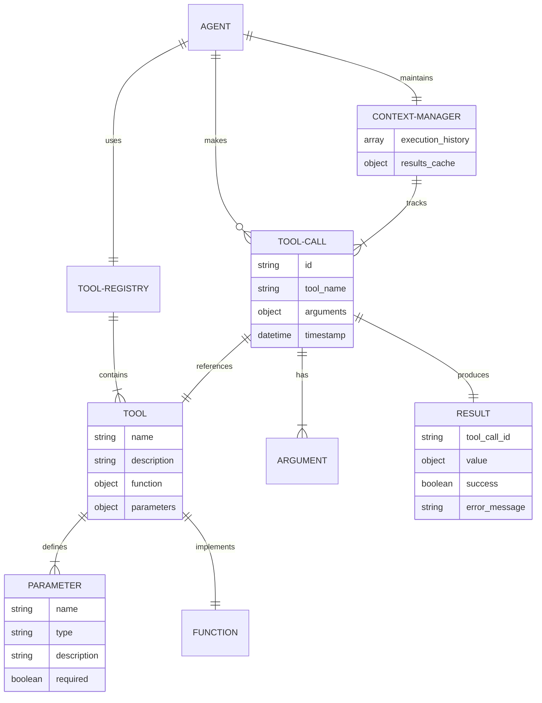

#### 工具使用交互关系图

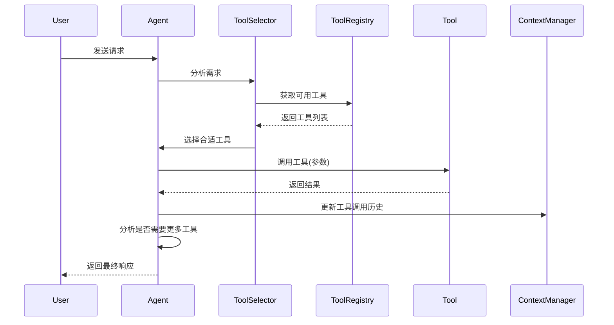

### 数学模型

在工具使用系统中，可以使用以下数学模型：

1. **工具选择概率模型**

对于用户查询 $q$ 和工具集合 $T = \{t_1, t_2, ..., t_n\}$，工具 $t_i$ 的选择概率可以表示为：

$$P(t_i|q) = \frac{\exp(s(q, t_i))}{\sum_{j=1}^{n} \exp(s(q, t_j))}$$

其中 $s(q, t_i)$ 是查询 $q$ 与工具 $t_i$ 的相关性分数。

2. **工具组合效用函数**

对于工具组合 $C = \{t_1, t_2, ..., t_k\}$，其效用函数可以定义为：

$$U(C) = \sum_{i=1}^{k} w_i \cdot u(t_i) - \alpha \cdot \sum_{i=1}^{k-1}\sum_{j=i+1}^{k} o(t_i, t_j)$$

其中 $u(t_i)$ 是工具 $t_i$ 的单独效用，$w_i$ 是权重，$o(t_i, t_j)$ 是工具 $t_i$ 和 $t_j$ 之间的重叠度，$\alpha$ 是重叠惩罚系数。

3. **工具执行成功率预测**

工具 $t$ 在参数集 $p$ 下的执行成功率可以建模为：

$$P_{success}(t, p) = \sigma\left(\beta_0 + \sum_{i=1}^{m} \beta_i \cdot f_i(t, p)\right)$$

其中 $\sigma$ 是sigmoid函数，$f_i(t, p)$ 是特征函数，$\beta_i$ 是权重系数。

### 算法流程图

以下是工具使用系统的核心流程图：

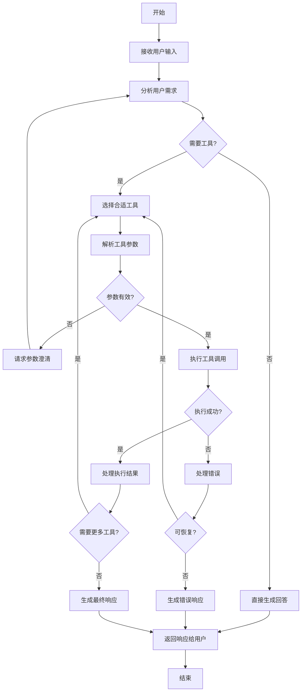

### 算法源代码

以下是一个支持工具链和工作流的高级工具使用系统实现：

```python
import os
import json
import datetime
import inspect
import logging
from typing import List, Dict, Any, Optional, Callable, Union, Tuple, Set
import openai
from dotenv import load_dotenv

# 配置日志
logging.basicConfig(level=logging.INFO, format='%(asctime)s - %(name)s - %(levelname)s - %(message)s')
logger = logging.getLogger(__name__)

# 加载环境变量
load_dotenv()

# 配置OpenAI API密钥
openai.api_key = os.getenv("OPENAI_API_KEY")

class Parameter:
    """表示工具参数"""
    
    def __init__(self, 
                 name: str,
                 description: str,
                 type: str = "string",
                 required: bool = False,
                 default: Any = None,
                 enum: Optional[List[Any]] = None,
                 minimum: Optional[Union[int, float]] = None,
                 maximum: Optional[Union[int, float]] = None):
        """
        初始化参数
        
        Args:
            name: 参数名称
            description: 参数描述
            type: 参数类型
            required: 是否必需
            default: 默认值
            enum: 枚举值
            minimum: 最小值
            maximum: 最大值
        """
        self.name = name
        self.description = description
        self.type = type
        self.required = required
        self.default = default
        self.enum = enum
        self.minimum = minimum
        self.maximum = maximum
    
    def to_dict(self) -> Dict[str, Any]:
        """转换为字典"""
        param_dict = {
            "type": self.type,
            "description": self.description
        }
        
        if self.default is not None:
            param_dict["default"] = self.default
        
        if self.enum is not None:
            param_dict["enum"] = self.enum
        
        if self.minimum is not None:
            param_dict["minimum"] = self.minimum
        
        if self.maximum is not None:
            param_dict["maximum"] = self.maximum
        
        return param_dict


class Tool:
    """表示一个可被Agent使用的工具"""
    
    def __init__(self, 
                 name: str,
                 description: str,
                 function: Callable,
                 parameters: Optional[List[Parameter]] = None,
                 required_permissions: Optional[List[str]] = None,
                 categories: Optional[List[str]] = None):
        """
        初始化工具
        
        Args:
            name: 工具名称
            description: 工具描述
            function: 工具函数
            parameters: 参数列表
            required_permissions: 所需权限
            categories: 工具类别
        """
        self.name = name
        self.description = description
        self.function = function
        self.parameters = parameters or []
        self.required_permissions = required_permissions or []
        self.categories = categories or []
        
        # 如果没有提供参数，尝试从函数签名自动生成
        if not self.parameters:
            self._generate_parameters_from_signature()
    
    def _generate_parameters_from_signature(self):
        """从函数签名自动生成参数"""
        sig = inspect.signature(self.function)
        
        for name, param in sig.parameters.items():
            # 跳过self参数
            if name == "self":
                continue
            
            # 确定参数类型
            param_type = "string"  # 默认类型
            if param.annotation != inspect.Parameter.empty:
                if param.annotation == int:
                    param_type = "integer"
                elif param.annotation == float:
                    param_type = "number"
                elif param.annotation == bool:
                    param_type = "boolean"
                elif param.annotation == dict or param.annotation == Dict:
                    param_type = "object"
                elif param.annotation == list or param.annotation == List:
                    param_type = "array"
            
            # 确定是否必需
            required = param.default == inspect.Parameter.empty
            
            # 获取默认值
            default = None if param.default == inspect.Parameter.empty else param.default
            
            # 创建参数
            self.parameters.append(Parameter(
                name=name,
                description=f"Parameter: {name}",
                type=param_type,
                required=required,
                default=default
            ))
    
    def to_openai_function(self) -> Dict[str, Any]:
        """转换为OpenAI函数格式"""
        properties = {}
        required_params = []
        
        for param in self.parameters:
            properties[param.name] = param.to_dict()
            if param.required:
                required_params.append(param.name)
        
        return {
            "name": self.name,
            "description": self.description,
            "parameters": {
                "type": "object",
                "properties": properties,
                "required": required_params
            }
        }
    
    def execute(self, **kwargs) -> Any:
        """
        执行工具函数
        
        Args:
            **kwargs: 函数参数
            
        Returns:
            函数执行结果
        """
        # 应用默认值
        for param in self.parameters:
            if param.name not in kwargs and param.default is not None:
                kwargs[param.name] = param.default
        
        return self.function(**kwargs)


class ToolCall:
    """表示一次工具调用"""
    
    def __init__(self, 
                 tool_name: str,
                 arguments: Dict[str, Any]):
        """
        初始化工具调用
        
        Args:
            tool_name: 工具名称
            arguments: 调用参数
        """
        self.id = f"call_{datetime.datetime.now().strftime('%Y%m%d%H%M%S%f')}"
        self.tool_name = tool_name
        self.arguments = arguments
        self.result = None
        self.error = None
        self.timestamp = datetime.datetime.now()
    
    def set_result(self, result: Any):
        """设置调用结果"""
        self.result = result
    
    def set_error(self, error: str):
        """设置调用错误"""
        self.error = error
    
    def to_dict(self) -> Dict[str, Any]:
        """转换为字典"""
        return {
            "id": self.id,
            "tool_name": self.tool_name,
            "arguments": self.arguments,
            "result": self.result,
            "error": self.error,
            "timestamp": self.timestamp.isoformat()
        }


class ToolWorkflow:
    """表示一个工具工作流"""
    
    def __init__(self, 
                 name: str,
                 description: str,
                 steps: List[Dict[str, Any]]):
        """
        初始化工作流
        
        Args:
            name: 工作流名称
            description: 工作流描述
            steps: 工作流步骤
        """
        self.name = name
        self.description = description
        self.steps = steps
    
    def to_dict(self) -> Dict[str, Any]:
        """转换为字典"""
        return {
            "name": self.name,
            "description": self.description,
            "steps": self.steps
        }


class ToolRegistry:
    """工具注册器，管理可用工具"""
    
    def __init__(self):
        """初始化工具注册器"""
        self.tools: Dict[str, Tool] = {}
        self.categories: Dict[str, List[str]] = {}
        self.workflows: Dict[str, ToolWorkflow] = {}
    
    def register_tool(self, tool: Tool):
        """
        注册工具
        
        Args:
            tool: 工具实例
        """
        self.tools[tool.name] = tool
        
        # 添加到类别
        for category in tool.categories:
            if category not in self.categories:
                self.categories[category] = []
            if tool.name not in self.categories[category]:
                self.categories[category].append(tool.name)
    
    def register_workflow(self, workflow: ToolWorkflow):
        """
        注册工作流
        
        Args:
            workflow: 工作流实例
        """
        self.workflows[workflow.name] = workflow
    
    def get_tool(self, name: str) -> Optional[Tool]:
        """获取工具"""
        return self.tools.get(name)
    
    def get_workflow(self, name: str) -> Optional[ToolWorkflow]:
        """获取工作流"""
        return self.workflows.get(name)
    
    def get_tools_by_category(self, category: str) -> List[Tool]:
        """获取指定类别的工具"""
        tool_names = self.categories.get(category, [])
        return [self.tools[name] for name in tool_names if name in self.tools]
    
    def get_all_tools(self) -> List[Tool]:
        """获取所有工具"""
        return list(self.tools.values())
    
    def get_all_workflows(self) -> List[ToolWorkflow]:
        """获取所有工作流"""
        return list(self.workflows.values())
    
    def get_openai_functions(self, categories: Optional[List[str]] = None) -> List[Dict[str, Any]]:
        """
        获取OpenAI函数格式的工具列表
        
        Args:
            categories: 工具类别，如果指定则只返回这些类别的工具
            
        Returns:
            OpenAI函数列表
        """
        if categories:
            # 获取指定类别的工具
            tools = []
            for category in categories:
                tools.extend(self.get_tools_by_category(category))
            return [tool.to_openai_function() for tool in tools]
        else:
            # 获取所有工具
            return [tool.to_openai_function() for tool in self.tools.values()]


class ToolExecutionContext:
    """工具执行上下文，管理工具执行状态和结果"""
    
    def __init__(self):
        """初始化工具执行上下文"""
        self.execution_history: List[ToolCall] = []
        self.results_cache: Dict[str, Any] = {}
        self.workflow_states: Dict[str, Dict[str, Any]] = {}
    
    def add_execution(self, tool_call: ToolCall):
        """
        添加工具执行记录
        
        Args:
            tool_call: 工具调用
        """
        self.execution_history.append(tool_call)
        
        # 缓存结果
        if tool_call.error is None:
            cache_key = f"{tool_call.tool_name}:{json.dumps(tool_call.arguments, sort_keys=True)}"
            self.results_cache[cache_key] = tool_call.result
    
    def get_cached_result(self, tool_name: str, arguments: Dict[str, Any]) -> Optional[Any]:
        """
        获取缓存的执行结果
        
        Args:
            tool_name: 工具名称
            arguments: 执行参数
            
        Returns:
            缓存的结果，如果不存在则返回None
        """
        cache_key = f"{tool_name}:{json.dumps(arguments, sort_keys=True)}"
        return self.results_cache.get(cache_key)
    
    def get_last_execution(self) -> Optional[ToolCall]:
        """
        获取最近的执行记录
        
        Returns:
            最近的执行记录，如果不存在则返回None
        """
        if self.execution_history:
            return self.execution_history[-1]
        return None
    
    def get_execution_history(self) -> List[ToolCall]:
        """
        获取完整执行历史
        
        Returns:
            执行历史列表
        """
        return self.execution_history
    
    def set_workflow_state(self, workflow_name: str, state: Dict[str, Any]):
        """
        设置工作流状态
        
        Args:
            workflow_name: 工作流名称
            state: 工作流状态
        """
        self.workflow_states[workflow_name] = state
    
    def get_workflow_state(self, workflow_name: str) -> Optional[Dict[str, Any]]:
        """
        获取工作流状态
        
        Args:
            workflow_name: 工作流名称
            
        Returns:
            工作流状态，如果不存在则返回None
        """
        return self.workflow_states.get(workflow_name)
    
    def clear(self):
        """清除执行上下文"""
        self.execution_history = []
        self.results_cache = {}
        self.workflow_states = {}


class WorkflowEngine:
    """工作流引擎，执行工具工作流"""
    
    def __init__(self, tool_registry: ToolRegistry, execution_context: ToolExecutionContext):
        """
        初始化工作流引擎
        
        Args:
            tool_registry: 工具注册器
            execution_context: 执行上下文
        """
        self.tool_registry = tool_registry
        self.execution_context = execution_context
    
    def execute_workflow(self, workflow_name: str, initial_inputs: Dict[str, Any]) -> Dict[str, Any]:
        """
        执行工作流
        
        Args:
            workflow_name: 工作流名称
            initial_inputs: 初始输入
            
        Returns:
            工作流执行结果
        """
        # 获取工作流
        workflow = self.tool_registry.get_workflow(workflow_name)
        if not workflow:
            raise ValueError(f"Workflow '{workflow_name}' not found")
        
        # 初始化工作流状态
        state = {
            "inputs": initial_inputs,
            "outputs": {},
            "current_step": 0,
            "completed": False,
            "error": None
        }
        
        self.execution_context.set_workflow_state(workflow_name, state)
        
        # 执行工作流步骤
        steps = workflow.steps
        step_index = 0
        
        while step_index < len(steps):
            step = steps[step_index]
            step_type = step.get("type", "tool")
            
            try:
                if step_type == "tool":
                    # 执行工具调用
                    tool_name = step["tool"]
                    parameter_mapping = step.get("parameter_mapping", {})
                    
                    # 准备参数
                    arguments = {}
                    for param_name, mapping in parameter_mapping.items():
                        if mapping.startswith("$input."):
                            # 从初始输入获取
                            input_key = mapping[7:]
                            if input_key in initial_inputs:
                                arguments[param_name] = initial_inputs[input_key]
                        elif mapping.startswith("$output."):
                            # 从前面步骤的输出获取
                            parts = mapping[8:].split(".")
                            if len(parts) == 2:
                                prev_step_index, output_key = parts
                                prev_step_index = int(prev_step_index)
                                if prev_step_index < step_index and prev_step_index in state["outputs"]:
                                    prev_output = state["outputs"][prev_step_index]
                                    if output_key in prev_output:
                                        arguments[param_name] = prev_output[output_key]
                        else:
                            # 直接值
                            arguments[param_name] = mapping
                    
                    # 获取工具
                    tool = self.tool_registry.get_tool(tool_name)
                    if not tool:
                        raise ValueError(f"Tool '{tool_name}' not found")
                    
                    # 执行工具
                    tool_call = ToolCall(tool_name, arguments)
                    try:
                        result = tool.execute(**arguments)
                        tool_call.set_result(result)
                    except Exception as e:
                        error_message = f"Error executing tool '{tool_name}': {str(e)}"
                        tool_call.set_error(error_message)
                        raise RuntimeError(error_message)
                    
                    # 添加到执行历史
                    self.execution_context.add_execution(tool_call)
                    
                    # 保存输出
                    state["outputs"][step_index] = result
                
                elif step_type == "condition":
                    # 条件分支
                    condition = step["condition"]
                    true_step = step.get("true_step")
                    false_step = step.get("false_step")
                    
                    # 评估条件
                    condition_result = False
                    if condition.startswith("$output."):
                        parts = condition[8:].split(".")
                        if len(parts) == 2:
                            prev_step_index, output_key = parts
                            prev_step_index = int(prev_step_index)
                            if prev_step_index < step_index and prev_step_index in state["outputs"]:
                                prev_output = state["outputs"][prev_step_index]
                                if output_key in prev_output:
                                    condition_result = bool(prev_output[output_key])
                    
                    # 根据条件跳转
                    if condition_result and true_step is not None:
                        step_index = true_step - 1  # -1是因为循环结束会+1
                    elif not condition_result and false_step is not None:
                        step_index = false_step - 1  # -1是因为循环结束会+1
                
                elif step_type == "loop":
                    # 循环
                    loop_condition = step["condition"]
                    loop_body = step.get("body", [])
                    max_iterations = step.get("max_iterations", 10)
                    
                    # 评估循环条件
                    loop_condition_result = False
                    if loop_condition.startswith("$output."):
                        parts = loop_condition[8:].split(".")
                        if len(parts) == 2:
                            prev_step_index, output_key = parts
                            prev_step_index = int(prev_step_index)
                            if prev_step_index < step_index and prev_step_index in state["outputs"]:
                                prev_output = state["outputs"][prev_step_index]
                                if output_key in prev_output:
                                    loop_condition_result = bool(prev_output[output_key])
                    
                    # 执行循环
                    iteration_count = 0
                    while loop_condition_result and iteration_count < max_iterations:
                        # 执行循环体
                        for body_step in loop_body:
                            # 递归执行
                            # 这里简化处理，实际应该递归调用工作流引擎
                            pass
                        
                        # 重新评估条件
                        if loop_condition.startswith("$output."):
                            parts = loop_condition[8:].split(".")
                            if len(parts) == 2:
                                prev_step_index, output_key = parts
                                prev_step_index = int(prev_step_index)
                                if prev_step_index < step_index and prev_step_index in state["outputs"]:
                                    prev_output = state["outputs"][prev_step_index]
                                    if output_key in prev_output:
                                        loop_condition_result = bool(prev_output[output_key])
                        
                        iteration_count += 1
                
                # 更新状态
                state["current_step"] = step_index
                self.execution_context.set_workflow_state(workflow_name, state)
                
                # 下一步
                step_index += 1
                
            except Exception as e:
                # 更新错误状态
                state["error"] = str(e)
                self.execution_context.set_workflow_state(workflow_name, state)
                raise
        
        # 工作流完成
        state["completed"] = True
        self.execution_context.set_workflow_state(workflow_name, state)
        
        # 返回最终结果
        return {
            "workflow": workflow_name,
            "outputs": state["outputs"],
            "completed": True
        }


class ToolUsingAgent:
    """具备高级工具使用能力的Agent"""
    
    def __init__(self, 
                 model: str = "gpt-3.5-turbo-0613",
                 system_message: str = "You are a helpful assistant with access to tools.",
                 temperature: float = 0.7,
                 max_tokens: int = 1000,
                 max_tool_calls: int = 10):
        """
        初始化Agent
        
        Args:
            model: 使用的LLM模型名称
            system_message: 系统提示信息
            temperature: 生成的随机性参数
            max_tokens: 生成的最大token数
            max_tool_calls: 单次对话中最大工具调用次数
        """
        self.model = model
        self.system_message = system_message
        self.temperature = temperature
        self.max_tokens = max_tokens
        self.max_tool_calls = max_tool_calls
        self.conversation_history = []
        self.tool_registry = ToolRegistry()
        self.tool_context = ToolExecutionContext()
        self.workflow_engine = WorkflowEngine(self.tool_registry, self.tool_context)
        self.initialize_conversation()
    
    def initialize_conversation(self):
        """初始化对话历史"""
        self.conversation_history = [
            {"role": "system", "content": self.system_message}
        ]
    
    def register_tool(self, tool: Tool, categories: Optional[List[str]] = None):
        """
        注册工具
        
        Args:
            tool: 工具实例
            categories: 工具类别
        """
        self.tool_registry.register_tool(tool)
    
    def register_workflow(self, workflow: ToolWorkflow):
        """
        注册工作流
        
        Args:
            workflow: 工作流实例
        """
        self.tool_registry.register_workflow(workflow)
    
    def add_message(self, role: str, content: Union[str, Dict[str, Any]]):
        """
        添加消息到对话历史
        
        Args:
            role: 消息角色 (system, user, assistant, function)
            content: 消息内容
        """
        self.conversation_history.append({"role": role, "content": content})
    
    def process_input(self, user_input: str, tool_categories: Optional[List[str]] = None) -> str:
        """
        处理用户输入并返回响应
        
        Args:
            user_input: 用户输入文本
            tool_categories: 可用工具类别，如果指定则只使用这些类别的工具
            
        Returns:
            Agent的响应文本
        """
        # 添加用户消息到历史
        self.add_message("user", user_input)
        
        # 工具调用计数
        tool_call_count = 0
        
        try:
            # 获取可用工具
            functions = self.tool_registry.get_openai_functions(tool_categories)
            
            # 多轮工具调用循环
            while tool_call_count < self.max_tool_calls:
                # 调用LLM获取响应
                response = openai.ChatCompletion.create(
                    model=self.model,
                    messages=self.conversation_history,
                    functions=functions,
                    function_call="auto",
                    max_tokens=self.max_tokens,
                    temperature=self.temperature
                )
                
                # 提取助手响应
                assistant_message = response.choices[0].message
                
                # 检查是否需要调用函数
                if assistant_message.get("function_call"):
                    # 增加工具调用计数
                    tool_call_count += 1
                    
                    # 获取函数调用信息
                    function_call = assistant_message["function_call"]
                    function_name = function_call["name"]
                    
                    try:
                        function_args = json.loads(function_call["arguments"])
                    except json.JSONDecodeError:
                        # 处理参数解析错误
                        error_message = "Error parsing function arguments"
                        self.add_message("assistant", assistant_message)
                        self.add_message(
                            "function",
                            {
                                "name": function_name,
                                "content": json.dumps({"error": error_message})
                            }
                        )
                        continue
                    
                    # 检查是否是工作流
                    workflow = self.tool_registry.get_workflow(function_name)
                    if workflow:
                        # 执行工作流
                        try:
                            workflow_result = self.workflow_engine.execute_workflow(function_name, function_args)
                            
                            # 将工作流调用和结果添加到历史
                            self.add_message("assistant", assistant_message)
                            self.add_message(
                                "function",
                                {
                                    "name": function_name,
                                    "content": json.dumps(workflow_result)
                                }
                            )
                        except Exception as e:
                            error_message = f"Error executing workflow '{function_name}': {str(e)}"
                            self.add_message("assistant", assistant_message)
                            self.add_message(
                                "function",
                                {
                                    "name": function_name,
                                    "content": json.dumps({"error": error_message})
                                }
                            )
                        continue
                    
                    # 获取工具
                    tool = self.tool_registry.get_tool(function_name)
                    if tool:
                        # 创建工具调用
                        tool_call = ToolCall(function_name, function_args)
                        
                        # 检查缓存
                        cached_result = self.tool_context.get_cached_result(function_name, function_args)
                        if cached_result:
                            function_response = cached_result
                            tool_call.set_result(function_response)
                        else:
                            # 执行工具函数
                            try:
                                function_response = tool.execute(**function_args)
                                tool_call.set_result(function_response)
                            except Exception as e:
                                error_message = f"Error executing tool '{function_name}': {str(e)}"
                                tool_call.set_error(error_message)
                                function_response = {"error": error_message}
                        
                        # 添加到执行上下文
                        self.tool_context.add_execution(tool_call)
                        
                        # 将函数调用和结果添加到历史
                        self.add_message("assistant", assistant_message)
                        self.add_message(
                            "function",
                            {
                                "name": function_name,
                                "content": json.dumps(function_response)
                            }
                        )
                    else:
                        # 工具不存在
                        error_message = f"Tool '{function_name}' not found"
                        self.add_message("assistant", assistant_message)
                        self.add_message(
                            "function",
                            {
                                "name": function_name,
                                "content": json.dumps({"error": error_message})
                            }
                        )
                else:
                    # 直接返回助手响应
                    assistant_response = assistant_message["content"]
                    
                    # 添加助手响应到历史
                    self.add_message("assistant", assistant_response)
                    
                    return assistant_response
            
            # 如果达到最大工具调用次数，生成最终响应
            final_response = openai.ChatCompletion.create(
                model=self.model,
                messages=self.conversation_history,
                max_tokens=self.max_tokens,
                temperature=self.temperature
            )
            
            # 提取最终响应
            final_content = final_response.choices[0].message["content"]
            
            # 添加最终响应到历史
            self.add_message("assistant", final_content)
            
            return final_content
            
        except Exception as e:
            error_message = f"Error: {str(e)}"
            logger.error(error_message)
            return f"I encountered an error while processing your request: {str(e)}"
    
    def clear_history(self):
        """清除对话历史和工具执行上下文"""
        self.initialize_conversation()
        self.tool_context.clear()
    
    def get_conversation_history(self) -> List[Dict[str, Any]]:
        """获取完整对话历史"""
        return self.conversation_history
    
    def get_tool_execution_history(self) -> List[ToolCall]:
        """获取工具执行历史"""
        return self.tool_context.get_execution_history()
```

### 实际场景应用

#### 场景一：个人财务助手

工具使用能力可以应用于个人财务管理：

```python
# 创建个人财务助手Agent
finance_agent = ToolUsingAgent(
    model="gpt-4",
    system_message="""You are a personal finance assistant with access to various financial tools. 
    You can help users track expenses, analyze spending patterns, calculate loan payments, and more. 
    Use the appropriate tools to provide accurate and helpful financial information and advice.""",
    temperature=0.3
)

# 实现预算跟踪工具
def track_expense(category: str, amount: float, date: str = None) -> Dict[str, Any]:
    """
    记录一笔支出
    
    Args:
        category: 支出类别
        amount: 金额
        date: 日期 (YYYY-MM-DD)，默认为今天
        
    Returns:
        记录结果
    """
    # 这里应该连接实际的数据库
    # 为了示例，返回模拟数据
    if date is None:
        date = datetime.datetime.now().strftime("%Y-%m-%d")
    
    return {
        "status": "success",
        "expense": {
            "id": f"exp_{int(datetime.datetime.now().timestamp())}",
            "category": category,
            "amount": amount,
            "date": date
        },
        "message": f"Expense of ${amount:.2f} in category '{category}' recorded successfully."
    }

expense_tool = Tool(
    name="track_expense",
    description="Record an expense in a specific category",
    function=track_expense,
    parameters=[
        Parameter("category", "The expense category (e.g., Food, Transportation, Housing)", "string", True),
        Parameter("amount", "The expense amount", "number", True),
        Parameter("date", "The expense date in YYYY-MM-DD format", "string", False)
    ]
)

finance_agent.register_tool(expense_tool, categories=["finance", "budgeting"])

# 实现预算分析工具
def analyze_spending(period: str = "month") -> Dict[str, Any]:
    """
    分析支出模式
    
    Args:
        period: 分析周期 (week, month, year)
        
    Returns:
        分析结果
    """
    # 这里应该查询实际的数据库
    # 为了示例，返回模拟数据
    
    if period == "week":
        return {
            "period": "Last 7 days",
            "total_spending": 423.45,
            "by_category": {
                "Food": 125.30,
                "Transportation": 87.50,
                "Entertainment": 65.75,
                "Housing": 100.00,
                "Other": 44.90
            },
            "top_category": "Food",
            "daily_average": 60.49
        }
    elif period == "month":
        return {
            "period": "Last 30 days",
            "total_spending": 1875.20,
            "by_category": {
                "Food": 450.30,
                "Transportation": 325.75,
                "Entertainment": 275.25,
                "Housing": 700.00,
                "Other": 123.90
            },
            "top_category": "Housing",
            "daily_average": 62.51
        }
    elif period == "year":
        return {
            "period": "Last 365 days",
            "total_spending": 22450.80,
            "by_category": {
                "Food": 5250.45,
                "Transportation": 3875.30,
                "Entertainment": 2950.75,
                "Housing": 8400.00,
                "Other": 1974.30
            },
            "top_category": "Housing",
            "daily_average": 61.51
        }
    else:
        return {"error": f"Invalid period: {period}"}

spending_tool = Tool(
    name="analyze_spending",
    description="Analyze spending patterns over a specific period",
    function=analyze_spending,
    parameters=[
        Parameter("period", "The analysis period", "string", False, "month", ["week", "month", "year"])
    ]
)

finance_agent.register_tool(spending_tool, categories=["finance", "analysis"])

# 实现贷款计算工具
def calculate_loan(principal: float, interest_rate: float, term_years: int) -> Dict[str, Any]:
    """
    计算贷款信息
    
    Args:
        principal: 贷款本金
        interest_rate: 年利率（百分比）
        term_years: 贷款期限（年）
        
    Returns:
        贷款计算结果
    """
    # 转换年利率为月利率
    monthly_rate = interest_rate / 100 / 12
    
    # 计算总月数
    total_months = term_years * 12
    
    # 计算月供
    if monthly_rate == 0:
        monthly_payment = principal / total_months
    else:
        monthly_payment = principal * monthly_rate * (1 + monthly_rate) ** total_months / ((1 + monthly_rate) ** total_months - 1)
    
    # 计算总还款额
    total_payment = monthly_payment * total_months
    
    # 计算总利息
    total_interest = total_payment - principal
    
    return {
        "principal": principal,
        "interest_rate": interest_rate,
        "term_years": term_years,
        "monthly_payment": round(monthly_payment, 2),
        "total_payment": round(total_payment, 2),
        "total_interest": round(total_interest, 2)
    }

loan_tool = Tool(
    name="calculate_loan",
    description="Calculate loan payment information",
    function=calculate_loan,
    parameters=[
        Parameter("principal", "The loan principal amount", "number", True),
        Parameter("interest_rate", "The annual interest rate (percentage)", "number", True),
        Parameter("term_years", "The loan term in years", "integer", True)
    ]
)

finance_agent.register_tool(loan_tool, categories=["finance", "loans"])

# 使用财务助手
response = finance_agent.process_input("I spent $45.75 on groceries today. Can you help me track this expense?")
print(response)

response = finance_agent.process_input("How have I been spending my money this month?")
print(response)

response = finance_agent.process_input("If I take a loan of $250,000 for a house at 4.5% interest for 30 years, what would my monthly payment be?")
print(response)
```

#### 场景二：研究助手

工具使用能力可以应用于学术研究：

```python
# 创建研究助手Agent
research_agent = ToolUsingAgent(
    model="gpt-4",
    system_message="""You are a research assistant with access to various research tools. 
    You can help users search for academic papers, analyze data, generate citations, and more. 
    Use the appropriate tools to provide accurate and helpful research information.""",
    temperature=0.4
)

# 实现论文搜索工具
def search_papers(query: str, max_results: int = 5) -> List[Dict[str, Any]]:
    """
    搜索学术论文
    
    Args:
        query: 搜索查询
        max_results: 最大结果数量
        
    Returns:
        论文列表
    """
    # 这里应该调用实际的学术API
    # 为了示例，返回模拟数据
    papers = [
        {
            "title": f"Advances in {query}: A Comprehensive Review",
            "authors": ["Smith, J.", "Johnson, A."],
            "journal": "Journal of Advanced Research",
            "year": 2022,
            "doi": "10.1234/jar.2022.001",
            "abstract": f"This paper provides a comprehensive review of recent advances in {query}..."
        },
        {
            "title": f"A Novel Approach to {query}",
            "authors": ["Brown, R.", "Davis, M.", "Wilson, T."],
            "journal": "International Journal of Innovation",
            "year": 2021,
            "doi": "10.5678/iji.2021.002",
            "abstract": f"We present a novel approach to addressing challenges in {query}..."
        },
        {
            "title": f"Empirical Analysis of {query} Methods",
            "authors": ["Lee, S.", "Wang, L."],
            "journal": "Data Science Review",
            "year": 2023,
            "doi": "10.9012/dsr.2023.003",
            "abstract": f"This study presents an empirical analysis of various methods in {query}..."
        },
        {
            "title": f"The Future of {query}: Challenges and Opportunities",
            "authors": ["Garcia, C.", "Martinez, E."],
            "journal": "Future Technology Trends",
            "year": 2022,
            "doi": "10.3456/ftt.2022.004",
            "abstract": f"This paper discusses the future challenges and opportunities in {query}..."
        },
        {
            "title": f"A Comparative Study of {query} Techniques",
            "authors": ["Taylor, J.", "Anderson, P.", "White, R."],
            "journal": "Comparative Studies Journal",
            "year": 2021,
            "doi": "10.7890/csj.2021.005",
            "abstract": f"We compare various techniques in {query} and evaluate their performance..."
        }
    ]
    
    return papers[:max_results]

paper_tool = Tool(
    name="search_papers",
    description="Search for academic papers on a specific topic",
    function=search_papers,
    parameters=[
        Parameter("query", "The search query", "string", True),
        Parameter("max_results", "Maximum number of results to return", "integer", False, 5, minimum=1, maximum=10)
    ]
)

research_agent.register_tool(paper_tool, categories=["research", "literature"])

# 实现引用生成工具
def generate_citation(doi: str, style: str = "apa") -> Dict[str, Any]:
    """
    生成引用
    
    Args:
        doi: DOI标识符
        style: 引用样式 (apa, mla, chicago, harvard)
        
    Returns:
        引用信息
    """
    # 这里应该调用实际的引用API
    # 为了示例，返回模拟数据
    
    # 模拟论文数据
    papers = {
        "10.1234/jar.2022.001": {
            "title": "Advances in Machine Learning: A Comprehensive Review",
            "authors": ["Smith, J.", "Johnson, A."],
            "journal": "Journal of Advanced Research",
            "volume": 45,
            "issue": 3,
            "pages": "123-145",
            "year": 2022,
            "publisher": "Academic Press"
        },
        "10.5678/iji.2021.002": {
            "title": "A Novel Approach to Natural Language Processing",
            "authors": ["Brown, R.", "Davis, M.", "Wilson, T."],
            "journal": "International Journal of Innovation",
            "volume": 32,
            "issue": 2,
            "pages": "78-92",
            "year": 2021,
            "publisher": "Innovation Press"
        }
    }
    
    # 检查DOI是否存在
    if doi not in papers:
        return {"error": f"Paper with DOI {doi} not found"}
    
    paper = papers[doi]
    
    # 生成不同样式的引用
    citations = {}
    
    # APA样式
    if style == "apa" or style == "all":
        authors = ", ".join(paper["authors"][:-1])
        if len(paper["authors"]) > 1:
            authors += f", & {paper['authors'][-1]}"
        else:
            authors = paper["authors"][0]
        
        apa = f"{authors} ({paper['year']}). {paper['title']}. {paper['journal']}, {paper['volume']}({paper['issue']}), {paper['pages']}. https://doi.org/{doi}"
        citations["apa"] = apa
    
    # MLA样式
    if style == "mla" or style == "all":
        authors = ", ".join(paper["authors"][:-1])
        if len(paper["authors"]) > 1:
            authors += f", and {paper['authors'][-1]}"
        else:
            authors = paper["authors"][0]
        
        mla = f"{authors}. \"{paper['title']}.\" {paper['journal']}, vol. {paper['volume']}, no. {paper['issue']}, {paper['year']}, pp. {paper['pages']}. DOI: {doi}"
        citations["mla"] = mla
    
    # Chicago样式
    if style == "chicago" or style == "all":
        authors = ", ".join(paper["authors"][:-1])
        if len(paper["authors"]) > 1:
            authors += f", and {paper['authors'][-1]}"
        else:
            authors = paper["authors"][0]
        
        chicago = f"{authors}. \"{paper['title']}.\" {paper['journal']} {paper['volume']}, no. {paper['issue']} ({paper['year']}): {paper['pages']}. https://doi.org/{doi}"
        citations["chicago"] = chicago
    
    # Harvard样式
    if style == "harvard" or style == "all":
        authors = ", ".join(paper["authors"][:-1])
        if len(paper["authors"]) > 1:
            authors += f" and {paper['authors'][-1]}"
        else:
            authors = paper["authors"][0]
        
        harvard = f"{authors} {paper['year']}, '{paper['title']}', {paper['journal']}, vol. {paper['volume']}, no. {paper['issue']}, pp. {paper['pages']}, DOI: {doi}"
        citations["harvard"] = harvard
    
    if style != "all":
        return {"citation": citations.get(style, "Style not supported")}
    else:
        return {"citations": citations}

citation_tool = Tool(
    name="generate_citation",
    description="Generate a citation for an academic paper using its DOI",
    function=generate_citation,
    parameters=[
        Parameter("doi", "The DOI of the paper", "string", True),
        Parameter("style", "The citation style", "string", False, "apa", ["apa", "mla", "chicago", "harvard", "all"])
    ]
)

research_agent.register_tool(citation_tool, categories=["research", "citation"])

# 使用研究助手
response = research_agent.process_input("I need to find recent papers about machine learning in healthcare.")
print(response)

response = research_agent.process_input("Can you generate an APA citation for the paper with DOI 10.1234/jar.2022.001?")
print(response)
```

#### 场景三：开发助手

工具使用能力可以应用于软件开发：

```python
# 创建开发助手Agent
dev_agent = ToolUsingAgent(
    model="gpt-4",
    system_message="""You are a software development assistant with access to various development tools. 
    You can help users generate code, debug issues, search documentation, and more. 
    Use the appropriate tools to provide accurate and helpful development assistance.""",
    temperature=0.2
)

# 实现代码执行工具
def execute_python(code: str) -> Dict[str, Any]:
    """
    执行Python代码
    
    Args:
        code: Python代码
        
    Returns:
        执行结果
    """
    import sys
    from io import StringIO
    import traceback
    
    # 捕获标准输出和错误
    old_stdout = sys.stdout
    old_stderr = sys.stderr
    stdout_capture = StringIO()
    stderr_capture = StringIO()
    sys.stdout = stdout_capture
    sys.stderr = stderr_capture
    
    result = {
        "success": True,
        "output": "",
        "error": "",
        "return_value": None
    }
    
    try:
        # 创建本地命名空间
        local_namespace = {}
        
        # 执行代码
        exec_result = exec(code, {}, local_namespace)
        
        # 获取返回值（如果有）
        if "result" in local_namespace:
            result["return_value"] = local_namespace["result"]
        
        # 获取标准输出
        result["output"] = stdout_capture.getvalue()
    except Exception as e:
        # 捕获异常
        result["success"] = False
        result["error"] = str(e)
        result["traceback"] = traceback.format_exc()
    finally:
        # 恢复标准输出和错误
        sys.stdout = old_stdout
        sys.stderr = old_stderr
    
    return result

python_tool = Tool(
    name="execute_python",
    description="Execute Python code and return the result",
    function=execute_python,
    parameters=[
        Parameter("code", "The Python code to execute", "string", True)
    ]
)

dev_agent.register_tool(python_tool, categories=["development", "code"])

# 实现文档搜索工具
def search_docs(query: str, language: str = "python") -> List[Dict[str, Any]]:
    """
    搜索编程语言文档
    
    Args:
        query: 搜索查询
        language: 编程语言
        
    Returns:
        文档结果
    """
    # 这里应该调用实际的文档API
    # 为了示例，返回模拟数据
    
    python_docs = {
        "list": [
            {
                "title": "list - Built-in Types",
                "url": "https://docs.python.org/3/library/stdtypes.html#list",
                "summary": "Lists are mutable sequences, typically used to store collections of homogeneous items.",
                "methods": ["append()", "extend()", "insert()", "remove()", "pop()", "clear()", "index()", "count()", "sort()", "reverse()", "copy()"]
            }
        ],
        "dictionary": [
            {
                "title": "dict - Built-in Types",
                "url": "https://docs.python.org/3/library/stdtypes.html#dict",
                "summary": "Dictionaries are mutable mappings that associate keys to values.",
                "methods": ["clear()", "copy()", "get()", "items()", "keys()", "pop()", "popitem()", "setdefault()", "update()", "values()"]
            }
        ],
        "pandas": [
            {
                "title": "pandas.DataFrame",
                "url": "https://pandas.pydata.org/docs/reference/api/pandas.DataFrame.html",
                "summary": "Two-dimensional, size-mutable, potentially heterogeneous tabular data.",
                "methods": ["head()", "tail()", "info()", "describe()", "mean()", "sum()", "groupby()", "merge()", "concat()", "join()"]
            }
        ]
    }
    
    javascript_docs = {
        "array": [
            {
                "title": "Array - JavaScript | MDN",
                "url": "https://developer.mozilla.org/en-US/docs/Web/JavaScript/Reference/Global_Objects/Array",
                "summary": "The Array object is used to store multiple values in a single variable.",
                "methods": ["push()", "pop()", "shift()", "unshift()", "slice()", "splice()", "concat()", "join()", "forEach()", "map()", "filter()"]
            }
        ],
        "object": [
            {
                "title": "Object - JavaScript | MDN",
                "url": "https://developer.mozilla.org/en-US/docs/Web/JavaScript/Reference/Global_Objects/Object",
                "summary": "The Object class represents one of JavaScript's data types.",
                "methods": ["assign()", "create()", "entries()", "keys()", "values()", "hasOwnProperty()", "toString()"]
            }
        ]
    }
    
    # 选择语言文档
    if language.lower() == "python":
        docs = python_docs
    elif language.lower() == "javascript":
        docs = javascript_docs
    else:
        return [{"error": f"Documentation for {language} not available"}]
    
    # 搜索文档
    results = []
    for key, items in docs.items():
        if query.lower() in key.lower():
            results.extend(items)
    
    # 如果没有找到结果，返回一个通用消息
    if not results:
        return [{"message": f"No documentation found for '{query}' in {language}"}]
    
    return results

docs_tool = Tool(
    name="search_docs",
    description="Search programming language documentation",
    function=search_docs,
    parameters=[
        Parameter("query", "The search query", "string", True),
        Parameter("language", "The programming language", "string", False, "python", ["python", "javascript"])
    ]
)

dev_agent.register_tool(docs_tool, categories=["development", "documentation"])

# 实现代码生成工具
def generate_code(task: str, language: str = "python") -> Dict[str, str]:
    """
    生成代码
    
    Args:
        task: 任务描述
        language: 编程语言
        
    Returns:
        生成的代码
    """
    # 这里应该调用专门的代码生成模型
    # 为了示例，返回预定义的代码示例
    
    python_examples = {
        "sort list": """
# Sort a list in ascending order
def sort_list(input_list):
    return sorted(input_list)

# Example usage
numbers = [3, 1, 4, 1, 5, 9, 2, 6, 5]
sorted_numbers = sort_list(numbers)
print(sorted_numbers)  # Output: [1, 1, 2, 3, 4, 5, 5, 6, 9]
""",
        "read file": """
# Read a file and return its contents
def read_file(file_path):
    try:
        with open(file_path, 'r') as file:
            return file.read()
    except Exception as e:
        return f"Error reading file: {str(e)}"

# Example usage
content = read_file('example.txt')
print(content)
"""
    }
    
    javascript_examples = {
        "sort array": """
// Sort an array in ascending order
function sortArray(inputArray) {
    return inputArray.slice().sort((a, b) => a - b);
}

// Example usage
const numbers = [3, 1, 4, 1, 5, 9, 2, 6, 5];
const sortedNumbers = sortArray(numbers);
console.log(sortedNumbers);  // Output: [1, 1, 2, 3, 4, 5, 5, 6, 9]
""",
        "read file": """
// Read a file and return its contents (Node.js)
const fs = require('fs');

function readFile(filePath) {
    try {
        return fs.readFileSync(filePath, 'utf8');
    } catch (error) {
        return `Error reading file: ${error.message}`;
    }
}

// Example usage
const content = readFile('example.txt');
console.log(content);
"""
    }
    
    # 选择语言示例
    if language.lower() == "python":
        examples = python_examples
    elif language.lower() == "javascript":
        examples = javascript_examples
    else:
        return {"error": f"Code generation for {language} not available"}
    
    # 查找最匹配的示例
    for key, code in examples.items():
        if key.lower() in task.lower():
            return {"code": code, "language": language}
    
    # 如果没有找到匹配的示例，返回一个通用消息
    return {"message": f"No predefined code example available for '{task}' in {language}"}

code_tool = Tool(
    name="generate_code",
    description="Generate code for a specific task",
    function=generate_code,
    parameters=[
        Parameter("task", "The task description", "string", True),
        Parameter("language", "The programming language", "string", False, "python", ["python", "javascript"])
    ]
)

dev_agent.register_tool(code_tool, categories=["development", "code"])

# 使用开发助手
response = dev_agent.process_input("How do I sort a list in Python?")
print(response)

response = dev_agent.process_input("Can you execute this Python code for me? `print('Hello, world!')`")
print(response)

response = dev_agent.process_input("I need documentation about Python dictionaries.")
print(response)
```

### 项目介绍

**项目名称**：ToolKit

**项目目标**：提供一个灵活、可扩展的工具使用框架，使开发者能够轻松为AI Agent添加工具使用能力。

**核心功能**：
1. 工具定义和注册
2. 工具选择和执行
3. 参数解析和验证
4. 工作流定义和执行
5. 上下文管理和缓存
6. 错误处理和恢复

### 环境安装

ToolKit的安装步骤：

```bash
# 克隆仓库
git clone https://github.com/example/toolkit.git
cd toolkit

# 创建虚拟环境
python -m venv venv
source venv/bin/activate  # Linux/Mac
# venv\Scripts\activate  # Windows

# 安装依赖
pip install -r requirements.txt

# 配置环境变量
cp .env.example .env
# 编辑.env文件，添加API密钥
```

### 系统功能设计

ToolKit提供以下核心功能：

1. **工具管理**：定义、注册和管理工具
2. **工具执行**：执行工具调用并处理结果
3. **工作流管理**：定义和执行工具工作流
4. **上下文管理**：维护工具执行状态和历史
5. **错误处理**：处理工具执行错误和恢复
6. **缓存机制**：缓存工具执行结果，提高效率

### 系统架构设计

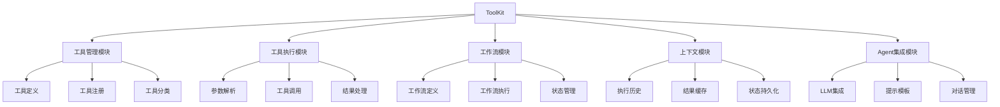

### 系统接口设计

ToolKit提供以下核心接口：

```python
# 工具定义接口
toolkit.define_tool(name, description, function, parameters)
toolkit.register_tool(tool, categories)

# 工具执行接口
toolkit.execute_tool(tool_name, **parameters)
toolkit.execute_workflow(workflow_name, initial_inputs)

# 工作流定义接口
toolkit.define_workflow(name, description, steps)
toolkit.register_workflow(workflow)

# 上下文管理接口
toolkit.get_execution_history()
toolkit.get_cached_result(tool_name, parameters)
toolkit.clear_context()

# Agent集成接口
toolkit.create_agent(model, system_message, temperature)
toolkit.process_input(user_input, tool_categories)
```

### 系统核心实现源代码

以下是ToolKit的工作流引擎实现：

```python
# toolkit/workflow.py
from typing import List, Dict, Any, Optional, Callable, Union, Tuple
import json
import logging
from .tool import Tool, ToolRegistry
from .context import ToolExecutionContext

logger = logging.getLogger(__name__)

class WorkflowStep:
    """表示工作流中的一个步骤"""
    
    def __init__(self, 
                 step_id: str,
                 step_type: str,
                 config: Dict[str, Any]):
        """
        初始化工作流步骤
        
        Args:
            step_id: 步骤ID
            step_type: 步骤类型 (tool, condition, loop)
            config: 步骤配置
        """
        self.step_id = step_id
        self.step_type = step_type
        self.config = config
    
    def to_dict(self) -> Dict[str, Any]:
        """转换为字典"""
        return {
            "step_id": self.step_id,
            "step_type": self.step_type,
            "config": self.config
        }


class Workflow:
    """表示一个工具工作流"""
    
    def __init__(self, 
                 name: str,
                 description: str,
                 steps: List[WorkflowStep],
                 input_schema: Optional[Dict[str, Any]] = None):
        """
        初始化工作流
        
        Args:
            name: 工作流名称
            description: 工作流描述
            steps: 工作流步骤
            input_schema: 输入模式
        """
        self.name = name
        self.description = description
        self.steps = steps
        self.input_schema = input_schema or {}
    
    def to_dict(self) -> Dict[str, Any]:
        """转换为字典"""
        return {
            "name": self.name,
            "description": self.description,
            "steps": [step.to_dict() for step in self.steps],
            "input_schema": self.input_schema
        }
    
    @classmethod
    def from_dict(cls, data: Dict[str, Any]) -> 'Workflow':
        """从字典创建工作流"""
        steps = [
            WorkflowStep(
                step["step_id"],
                step["step_type"],
                step["config"]
            )
            for step in data.get("steps", [])
        ]
        
        return cls(
            name=data["name"],
            description=data["description"],
            steps=steps,
            input_schema=data.get("input_schema")
        )


class WorkflowEngine:
    """工作流引擎，执行工具工作流"""
    
    def __init__(self, tool_registry: ToolRegistry, execution_context: ToolExecutionContext):
        """
        初始化工作流引擎
        
        Args:
            tool_registry: 工具注册器
            execution_context: 执行上下文
        """
        self.tool_registry = tool_registry
        self.execution_context = execution_context
    
    def execute_workflow(self, workflow: Workflow, inputs: Dict[str, Any]) -> Dict[str, Any]:
        """
        执行工作流
        
        Args:
            workflow: 工作流
            inputs: 输入参数
            
        Returns:
            工作流执行结果
        """
        logger.info(f"Executing workflow: {workflow.name}")
        
        # 初始化工作流状态
        state = {
            "workflow_name": workflow.name,
            "inputs": inputs,
            "outputs": {},
            "current_step_index": 0,
            "completed_steps": [],
            "error": None,
            "completed": False
        }
        
        # 保存初始状态
        self.execution_context.set_workflow_state(workflow.name, state)
        
        # 执行工作流步骤
        step_index = 0
        
        try:
            while step_index < len(workflow.steps):
                step = workflow.steps[step_index]
                logger.info(f"Executing step {step.step_id} of type {step.step_type}")
                
                # 更新当前步骤
                state["current_step_index"] = step_index
                self.execution_context.set_workflow_state(workflow.name, state)
                
                # 根据步骤类型执行
                if step.step_type == "tool":
                    # 执行工具调用
                    result = self._execute_tool_step(step, state)
                    
                    # 保存步骤输出
                    state["outputs"][step.step_id] = result
                    state["completed_steps"].append(step.step_id)
                    
                    # 下一步
                    step_index += 1
                
                elif step.step_type == "condition":
                    # 执行条件分支
                    next_step_id = self._execute_condition_step(step, state)
                    
                    # 查找下一步索引
                    if next_step_id:
                        for i, s in enumerate(workflow.steps):
                            if s.step_id == next_step_id:
                                step_index = i
                                break
                        else:
                            # 如果没有找到下一步，继续执行下一步
                            step_index += 1
                    else:
                        # 如果没有指定下一步，继续执行下一步
                        step_index += 1
                
                elif step.step_type == "loop":
                    # 执行循环
                    should_continue, next_step_id = self._execute_loop_step(step, state)
                    
                    if should_continue:
                        # 继续执行循环体
                        if next_step_id:
                            for i, s in enumerate(workflow.steps):
                                if s.step_id == next_step_id:
                                    step_index = i
                                    break
                            else:
                                step_index += 1
                        else:
                            step_index += 1
                    else:
                        # 退出循环
                        step_index += 1
                
                else:
                    # 未知步骤类型
                    logger.warning(f"Unknown step type: {step.step_type}")
                    step_index += 1
                
                # 更新工作流状态
                self.execution_context.set_workflow_state(workflow.name, state)
            
            # 工作流完成
            state["completed"] = True
            self.execution_context.set_workflow_state(workflow.name, state)
            
            logger.info(f"Workflow {workflow.name} completed successfully")
            
            return {
                "workflow_name": workflow.name,
                "outputs": state["outputs"],
                "completed": True
            }
            
        except Exception as e:
            # 更新错误状态
            error_message = f"Error executing workflow: {str(e)}"
            logger.error(error_message)
            state["error"] = error_message
            self.execution_context.set_workflow_state(workflow.name, state)
            
            return {
                "workflow_name": workflow.name,
                "error": error_message,
                "outputs": state["outputs"],
                "completed": False
            }
    
    def _execute_tool_step(self, step: WorkflowStep, state: Dict[str, Any]) -> Any:
        """
        执行工具步骤
        
        Args:
            step: 工作流步骤
            state: 工作流状态
            
        Returns:
            工具执行结果
        """
        config = step.config
        tool_name = config.get("tool")
        
        if not tool_name:
            raise ValueError(f"Tool name not specified in step {step.step_id}")
        
        # 获取工具
        tool = self.tool_registry.get_tool(tool_name)
        if not tool:
            raise ValueError(f"Tool '{tool_name}' not found")
        
        # 准备参数
        arguments = {}
        parameter_mapping = config.get("parameter_mapping", {})
        
        for param_name, mapping in parameter_mapping.items():
            if isinstance(mapping, str):
                if mapping.startswith("$input."):
                    # 从输入获取
                    input_key = mapping[7:]
                    if input_key in state["inputs"]:
                        arguments[param_name] = state["inputs"][input_key]
                elif mapping.startswith("$output."):
                    # 从输出获取
                    parts = mapping[8:].split(".")
                    if len(parts) == 2:
                        step_id, output_key = parts
                        if step_id in state["outputs"]:
                            output = state["outputs"][step_id]
                            if isinstance(output, dict) and output_key in output:
                                arguments[param_name] = output[output_key]
                            elif hasattr(output, output_key):
                                arguments[param_name] = getattr(output, output_key)
                else:
                    # 直接值
                    arguments[param_name] = mapping
            else:
                # 直接值
                arguments[param_name] = mapping
        
        # 执行工具
        logger.info(f"Executing tool {tool_name} with arguments: {arguments}")
        return tool.execute(**arguments)
    
    def _execute_condition_step(self, step: WorkflowStep, state: Dict[str, Any]) -> Optional[str]:
        """
        执行条件步骤
        
        Args:
            step: 工作流步骤
            state: 工作流状态
            
        Returns:
            下一步ID
        """
        config = step.config
        condition = config.get("condition")
        true_step = config.get("true_step")
        false_step = config.get("false_step")
        
        # 评估条件
        condition_result = False
        
        if isinstance(condition, str):
            if condition.startswith("$input."):
                # 从输入获取
                input_key = condition[7:]
                if input_key in state["inputs"]:
                    condition_result = bool(state["inputs"][input_key])
            elif condition.startswith("$output."):
                # 从输出获取
                parts = condition[8:].split(".")
                if len(parts) == 2:
                    step_id, output_key = parts
                    if step_id in state["outputs"]:
                        output = state["outputs"][step_id]
                        if isinstance(output, dict) and output_key in output:
                            condition_result = bool(output[output_key])
                        elif hasattr(output, output_key):
                            condition_result = bool(getattr(output, output_key))
            else:
                # 直接值
                condition_result = bool(condition)
        else:
            # 直接值
            condition_result = bool(condition)
        
        logger.info(f"Condition result: {condition_result}")
        
        # 根据条件返回下一步
        if condition_result and true_step:
            return true_step
        elif not condition_result and false_step:
            return false_step
        
        return None
    
    def _execute_loop_step(self, step: WorkflowStep, state: Dict[str, Any]) -> Tuple[bool, Optional[str]]:
        """
        执行循环步骤
        
        Args:
            step: 工作流步骤
            state: 工作流状态
            
        Returns:
            (是否继续循环, 下一步ID)
        """
        config = step.config
        condition = config.get("condition")
        next_step = config.get("next_step")
        max_iterations = config.get("max_iterations", 10)
        
        # 获取当前迭代次数
        iteration_key = f"loop_{step.step_id}_iteration"
        if iteration_key not in state:
            state[iteration_key] = 0
        
        # 增加迭代次数
        state[iteration_key] += 1
        
        # 检查是否达到最大迭代次数
        if state[iteration_key] >= max_iterations:
            logger.info(f"Loop reached maximum iterations: {max_iterations}")
            return False, None
        
        # 评估条件
        condition_result = False
        
        if isinstance(condition, str):
            if condition.startswith("$input."):
                # 从输入获取
                input_key = condition[7:]
                if input_key in state["inputs"]:
                    condition_result = bool(state["inputs"][input_key])
            elif condition.startswith("$output."):
                # 从输出获取
                parts = condition[8:].split(".")
                if len(parts) == 2:
                    step_id, output_key = parts
                    if step_id in state["outputs"]:
                        output = state["outputs"][step_id]
                        if isinstance(output, dict) and output_key in output:
                            condition_result = bool(output[output_key])
                        elif hasattr(output, output_key):
                            condition_result = bool(getattr(output, output_key))
            else:
                # 直接值
                condition_result = bool(condition)
        else:
            # 直接值
            condition_result = bool(condition)
        
        logger.info(f"Loop condition result: {condition_result}, iteration: {state[iteration_key]}")
        
        # 根据条件返回是否继续循环
        if condition_result and next_step:
            return True, next_step
        
        return condition_result, None
```

### 最佳实践小贴士

1. **工具接口设计**：设计清晰、一致的工具接口，包括详细的描述和参数说明
2. **参数验证**：实施严格的参数验证，确保工具接收正确格式的输入
3. **错误处理**：实现全面的错误处理机制，提供有用的错误信息
4. **工具分类**：按功能对工具进行分类，便于Agent选择合适的工具
5. **缓存机制**：缓存工具执行结果，避免重复调用
6. **权限控制**：实施工具使用权限控制，确保安全性
7. **工具组合**：设计工具工作流，支持复杂任务的自动化
8. **监控和日志**：记录工具使用情况，便于调试和优化
9. **渐进式增强**：从简单工具开始，逐步添加复杂功能
10. **用户反馈**：收集用户反馈，持续改进工具功能和使用体验

### 拓展阅读

1. [Function Calling in OpenAI API](https://platform.openai.com/docs/guides/function-calling)
2. [LangChain Tools and Agents](https://python.langchain.com/docs/modules/agents/)
3. [Building AI Assistants with Function Calling](https://www.pinecone.io/learn/function-calling/)
4. [ReAct: Synergizing Reasoning and Acting in Language Models](https://arxiv.org/abs/2210.03629)
5. [Tool Learning with Foundation Models](https://arxiv.org/abs/2304.08354)
6. [Gorilla: Large Language Model Connected with Massive APIs](https://arxiv.org/abs/2305.15334)

### 行业发展与未来趋势

工具使用能力开发正在快速发展，以下是主要趋势：

| 趋势 | 描述 | 影响 | 时间框架 |
|------|------|------|---------|
| 自动工具发现 | Agent自动发现和学习使用新工具 | 减少人工配置，扩展功能边界 | 1-2年内 |
| 工具组合优化 | 自动优化工具调用序列和参数 | 提高效率，解决复杂任务 | 现在-1年内 |
| 多模态工具 | 支持图像、音频等多模态输入输出 | 扩展应用场景，提升用户体验 | 现在-2年内 |
| 工具市场生态 | 开发者共享和交易专用工具 | 促进创新，形成工具生态系统 | 1-3年内 |
| 自适应工具选择 | 根据上下文动态选择最佳工具 | 提高准确性，优化资源使用 | 现在-1年内 |
| 安全沙箱执行 | 在隔离环境中安全执行工具 | 提高安全性，防止恶意利用 | 现在-1年内 |
| 个性化工具推荐 | 根据用户偏好推荐相关工具 | 提升用户体验，增强个性化 | 1-2年内 |
| 低代码工具创建 | 通过图形界面创建和配置工具 | 降低开发门槛，加速工具开发 | 现在-2年内 |

### 本章小结

本节详细介绍了AI Agent工具使用能力的开发方法，包括工具定义、工具选择、参数解析、工具执行和结果处理等关键环节。我们探讨了从基础工具使用到高级工作流管理的实现技术，并提供了完整的代码示例和实际应用场景。

通过工具使用能力，AI Agent能够突破LLM固有的局限性，实现数据检索、计算、外部系统交互等功能，大幅扩展其应用场景和能力边界。我们展示了如何在个人财务助手、研究助手和开发助手等场景中应用工具使用能力，为用户